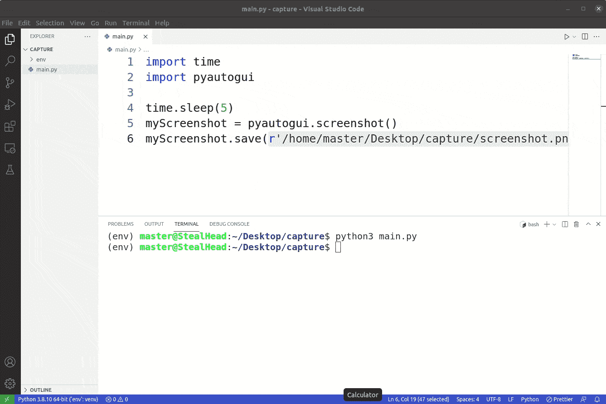
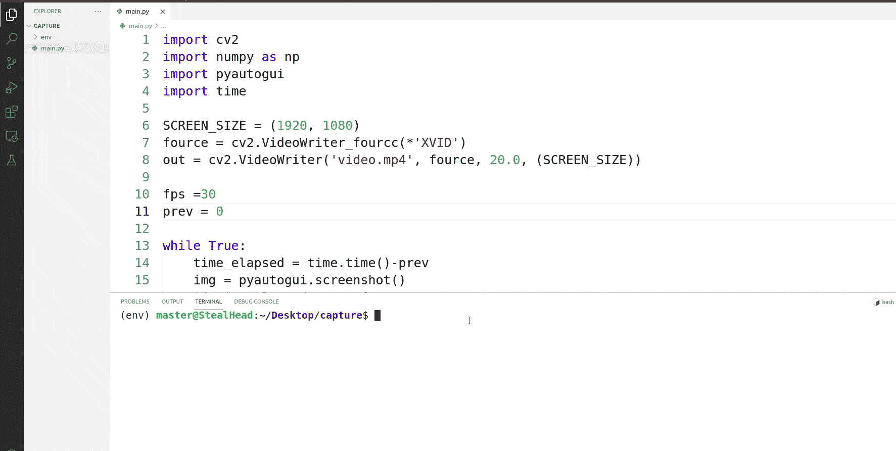
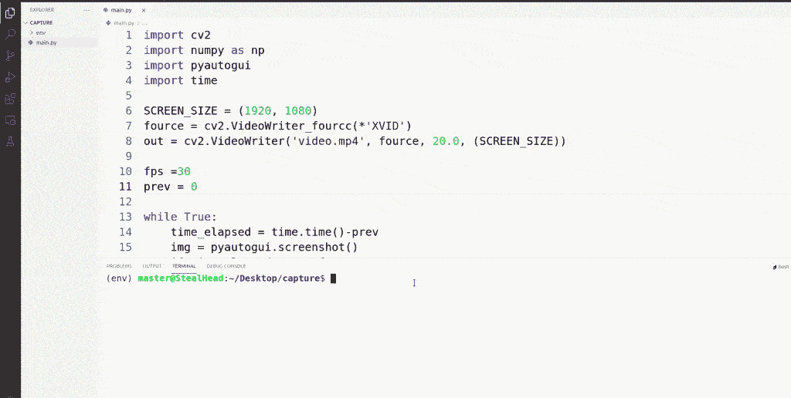
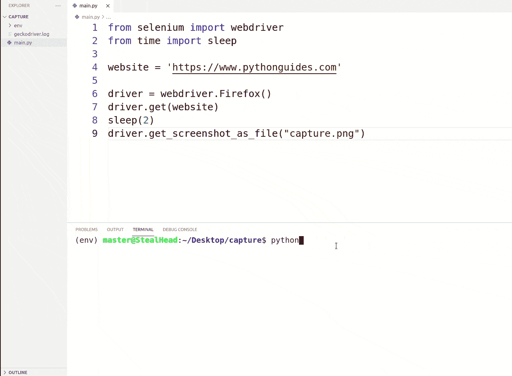
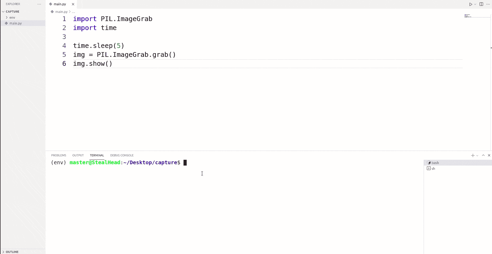

# Python 屏幕截图

> 原文：<https://pythonguides.com/python-screen-capture/>

[](https://sharepointsky.teachable.com/p/python-and-machine-learning-training-course)

在本 [Python 教程](https://pythonguides.com/learn-python/)中，我们将学习 **Python 截屏**。此外，我们将涵盖这些主题。

*   Python 屏幕截图
*   Python 屏幕截图特定窗口
*   Python 屏幕截图视频
*   Python 截屏 OpenCV
*   Python 屏幕截图库
*   Python 屏幕捕获速度快
*   Python 截屏网站
*   Python 屏幕捕获窗口

目录

[](#)

*   [Python 截屏](#Python_Screen_Capture "Python Screen Capture")
    *   [在 windows 上安装 pyautogui 模块](#Installation_of_pyautogui_module_on_windows "Installation of pyautogui module on windows")
    *   [在 Linux (Ubuntu)上安装 pyautogui 模块](#Installation_of_pyautogui_module_on_Linux_Ubuntu "Installation of pyautogui module on Linux (Ubuntu)")
*   [Python 截屏特定窗口](#Python_Screen_Capture_Specific_Window "Python Screen Capture Specific Window")
*   [Python 截屏视频](#Python_Screen_Capture_Video "Python Screen Capture Video")
*   [Python 截屏 OpenCV](#Python_Screen_Capture_OpenCV "Python Screen Capture OpenCV")
*   [Python 截屏库](#Python_Screen_Capture_Library "Python Screen Capture Library")
    *   [1。pyautogui](#1_pyautogui "1\. pyautogui")
    *   [2。OpenCV](#2_OpenCV "2\. OpenCV")
    *   [3 .形象坟墓](#3_ImageGrab "3\. ImageGrab")
*   [Python 截屏快](#Python_Screen_Capture_Fast "Python Screen Capture Fast")
*   [Python 截屏网站](#Python_Screen_Capture_Website "Python Screen Capture Website")
    *   [窗户](#Windows "Windows")
    *   [Linux 或 MacOs](#Linux_or_MacOs "Linux or MacOs")
*   [Python 截屏窗口](#Python_Screen_Capture_Windows "Python Screen Capture Windows")

## Python 截屏

Python 是一种编程语言，用于开发各种应用程序，无论是基于桌面的还是基于 web 的。它用于高级目的，如数据处理、机器学习等等。

*   Python 有丰富的各种有用的库，允许您在更短的时间内创建自己选择的软件。
*   在本节中，我们将学习 Python 屏幕截图。我们将看到如何使用 python 截取窗口的屏幕截图。
*   使用 python 中的 `pyautogui` 模块，我们可以截取窗口的截图，并将其存储在所需的位置。

### 在 windows 上安装 pyautogui 模块

我们假设您已经在系统上安装了 pip。使用下面的代码在您的 windows 机器上安装 pyautogui 模块。

```py
pip install pyautogui
```

### 在 Linux (Ubuntu)上安装 pyautogui 模块

在 Linux 上安装 python pyautogui 模块时，在 Linux 机器上安装 `scrot` 包是很重要的。如果没有 Scrot，Linux 机器将无法捕获屏幕。按照下面的命令在你的 Linux (Ubuntu)机器上安装 scrot 包。

```py
sudo apt-get install scrot
```

一旦安装了 scrot，使用下面的命令在您的 Linux (Ubuntu)机器上安装 pyautogui 模块。

```py
pip install pyautogui
```

还有，看: [Python 数字猜谜游戏](https://pythonguides.com/python-number-guessing-game/)

## Python 截屏特定窗口

在这一节中，我们将学习如何用 python 捕捉一个特定的窗口屏幕。

*   在上一节中，我们已经学习了如何在您的设备上安装 pyautogui 模块。现在，使用该模块，我们将学习如何捕捉特定的窗口。这里捕获意味着窗口的屏幕截图(静止图像)。
*   可以使用 pyautogui 模块的 screen down()方法来捕获屏幕。使用下面的代码启动截图。

```py
pyautogui.screenshot() 
```

*   截图之后，指定你想保存文件的位置是很重要的。在下面的代码中，指定保存截图文件的路径。

```py
pyautogui.screenshot().save(r'file_path/filename.png')

or 

screenshot = pyautogui.screenshot()
screenshot.save(r'file_path/filename.png')
```

*   运行该程序后，屏幕截图会立即被捕获，所以你不会有时间选择特定的屏幕。
*   要解决这个问题，您可以使用时间模块的 sleep 方法将代码片段的执行延迟 5 或 10 秒。
*   下面是 python 屏幕截图具体窗口的实现。

**源代码:**

在这段代码中，我们使用了一个 python 内置的时间模块，将截图过程延迟了 5 秒。5 秒钟后，这段代码片段运行`myScreenshot = pyautogui.screenshot()`，屏幕截图被捕获。之后，这段代码将截图文件保存在同一个目的地。

**输出:**

在下面的输出中，您可以注意到我们正在尝试捕获计算器窗口。程序运行后，我们有 5 秒钟的时间来定位应用程序窗口。5 秒钟后，新文件被创建，并有截图。



Python Screen Capture Specific Window

阅读: [Python 统计文件中的字数](https://pythonguides.com/python-count-words-in-file/)

## Python 截屏视频

在这一节中，我们将学习如何使用 python 捕捉屏幕视频。

*   视频是每秒帧数的渲染，以这种方式，观众相信他们正在观看一系列的活动。
*   Python 屏幕捕捉视频意味着我们将记录屏幕上发生的所有活动，这个文件可以在以后访问。
*   屏幕录像过程涉及三个模块。
    *   pyautogui 模块用于捕获图像
    *   NumPy 模块创建这些图像的数组
    *   使用 Opencv 模块，这些图像被组合在一起，并转换成任何格式的视频。
*   使用下面的命令在您的系统中安装 opencv 和 numpy。

```py
pip install opencv-python
pip install numpy
```

**源代码**:

在这段代码中，为不同的任务导入了四个模块。使用 pyautogui 模块捕获了一系列图像。这些图像使用 numpy 排列成数组，然后使用 python OpenCV 模块转换成视频。我们已经使用时间模块添加了延迟。

```py
import cv2
import numpy as np
import pyautogui
import time

SCREEN_SIZE = (1920, 1080)
fource = cv2.VideoWriter_fourcc(*'XVID')
out = cv2.VideoWriter('output.mp4', fource, 20.0, (SCREEN_SIZE))

fps =30
prev = 0

while True:
    time_elapsed = time.time()-prev
    img = pyautogui.screenshot()
    if time_elapsed > 1.0/fps:
        prev = time.time()
        frame = np.array(img)
        frame = cv2.cvtColor(frame, cv2.COLOR_BGR2RGB)
        out.write(frame)
    cv2.waitKey(10000)
```

**输出:**

在这个输出中，一旦你执行这个程序，它将开始捕获当前窗口。使用`ctrl + c`终止程序。



Python Screen Capture Video

读取:[如果不是 python 中的条件](https://pythonguides.com/if-not-condition-in-python/)

## Python 截屏 OpenCV

在本节中，我们将学习使用 OpenCV 的 Python 屏幕截图。OpenCV 是用于图像处理的 python 模块。

*   视频是每秒帧数的渲染，以这种方式，观众相信他们正在观看一系列的活动。
*   Python 屏幕捕捉视频意味着我们将记录屏幕上发生的所有活动，这个文件可以在以后访问。
*   屏幕录像过程涉及三个模块。
    *   pyautogui 模块用于捕获图像
    *   NumPy 模块创建这些图像的数组
    *   使用 Opencv 模块，这些图像被组合在一起，并转换成任何格式的视频。
*   使用下面的命令在您的系统中安装 opencv 和 numpy。

```py
pip install opencv-python
pip install numpy
```

**源代码:**

在这段代码中，为不同的任务导入了四个模块。使用 pyautogui 模块捕获了一系列图像。这些图像使用 numpy 排列成数组，然后使用 python OpenCV 模块转换成视频。我们已经使用时间模块添加了延迟。

```py
import cv2
import numpy as np
import pyautogui
import time

SCREEN_SIZE = (1920, 1080)
fource = cv2.VideoWriter_fourcc(*'XVID')
out = cv2.VideoWriter('output.mp4', fource, 20.0, (SCREEN_SIZE))

fps =30
prev = 0

while True:
    time_elapsed = time.time()-prev
    img = pyautogui.screenshot()
    if time_elapsed > 1.0/fps:
        prev = time.time()
        frame = np.array(img)
        frame = cv2.cvtColor(frame, cv2.COLOR_BGR2RGB)
        out.write(frame)
    cv2.waitKey(10000)
```

**输出:**

在这个输出中，一旦你执行这个程序，它将开始捕获当前窗口。使用`ctrl + c`终止程序。



阅读:[删除非 ASCII 字符 Python](https://pythonguides.com/remove-non-ascii-characters-python/)

## Python 截屏库

在这一节中，我们将探索 Python 屏幕截图库。我们寻找最流行的用于在 Python 中捕获截图和视频的库。

*   pyautogui
*   opencv
*   图像抓取

### 1 .[【pyautoui】](https://pyautogui.readthedocs.io/en/latest/)

python 中的 Pyautogui 库用于自动化与其他应用程序的交互。使用 pyautogui 模块的`screen down()`方法，我们可以捕获窗口的屏幕截图。按照下面的命令在您的系统上安装 python pyautogui 模块。因为我们使用 pip，所以它可以在所有操作系统上工作。

```py
pip install pyautogui
```

### 2。[OpenCV](https://pypi.org/project/opencv-python/)

Python OpenCV 是一个用于计算机视觉、机器学习和图像处理的开源库。使用这个模块我们可以捕捉屏幕上的视频。OpenCV 只帮助将文件(静止图像)转换成视频。pyautogui 模块放在循环中，每个图像都被记录下来，使用 numpy 我们可以创建这些图像的数组。现在，可以使用 OpenCV 将这个数组转换成视频格式。按照下面的命令在您的系统上安装 OpenCV。

```py
pip install opencv-python
```

### 3\. [形象坟墓](https://pillow.readthedocs.io/en/stable/reference/ImageGrab.html)T3]

使用 Python **PIL。ImageGrab** 模块我们可以抓取想要的窗口的截图。它提供了各种各样的选项，比如捕获窗口的特定部分，在用户使用多个屏幕的情况下捕获所有屏幕。

**语法:**

下面是 **PIL 的语法。ImageGrab.grab()** 。

```py
PIL.ImageGrab.grab(
    bbox=None, 
    include_layered_windows=False, 
    all_screens=False, 
    xdisplay=None
    )
```

*   **bbox:** 允许选择要复制的区域。默认为全屏。
*   **include_layered_windows:** 它包括所有层，但此功能仅在 windows 操作系统上有效。
*   **all_screens:** 如果用户使用多台显示器，则可以使用该选项捕捉所有显示器。这只在 windows 上有效。

阅读:[如何在 Python 中创建列表](https://pythonguides.com/create-list-in-python/)

## Python 截屏快

在这一节中，我们将学习 Python 屏幕捕捉 Fast。我们将学习如何快速记录屏幕上的内容。

*   录制屏幕视频涉及 3 个主要模块。python 中的 OpenCV，Numpy，pyautogui。
*   使用 pyautogui，我们继续捕捉帧，直到程序终止。然后使用 numpy 将这些图像放入一个数组中。最后，使用 python-opencv 将这个数组转换成视频格式。

**源代码:**

已经为不同的任务导入了模块。使用 pyautogui 模块捕获了一系列图像。这些图像使用 numpy 排列成数组，然后使用 python OpenCV 模块转换成视频。我们已经使用时间模块添加了延迟。

```py
import cv2
import numpy as np
import pyautogui
import time

SCREEN_SIZE = (1920, 1080)
fource = cv2.VideoWriter_fourcc(*'XVID')
out = cv2.VideoWriter('output.mp4', fource, 20.0, (SCREEN_SIZE))

fps =30
prev = 0

while True:
    time_elapsed = time.time()-prev
    img = pyautogui.screenshot()
    if time_elapsed > 1.0/fps:
        prev = time.time()
        frame = np.array(img)
        frame = cv2.cvtColor(frame, cv2.COLOR_BGR2RGB)
        out.write(frame)
    cv2.waitKey(1000)
```

**输出:**

在这个输出中，程序已经开始记录当前窗口。


阅读:[删除 python 中的 Unicode 字符](https://pythonguides.com/remove-unicode-characters-in-python/)

## Python 截屏网站

在这一节中，我们将学习如何使用 Python 对网站进行截图。

*   使用 Python Selenium 模块，我们可以捕捉任何网站的截图。
*   Python Selenium 用于使用 web 驱动程序自动化浏览器。换句话说，我们可以在没有任何人为干预的情况下监管浏览器上的任何活动。
*   Python Selenium 是用于自动化和测试的主要工具。假设您想在网站上测试表单。然后使用 selenium，您可以提供所有到达表单页面的指令，然后提供各种输入。一旦程序被执行，它将自动打开浏览器，在 url 框中键入网站名称，并将到达目标页面并执行活动。
*   使用下面的命令在您的系统中安装 selenium。

```py
pip install selenium
```

*   网络驱动允许跨浏览器测试。每个网络浏览器(chrome、safari、firefox)都有不同的网络驱动程序。
*   重要的是下载网络驱动程序，使这一进程的工作。在我们的例子中，我们正在开发 firefox，所以我们将下载 firefox 驱动程序。[点击此处](https://selenium-python.readthedocs.io/installation.html#drivers)选择网络驱动程序。
*   下载 web 驱动程序后，需要为它们设置路径。按照以下部分设置 web 驱动程序的路径。

### 窗户

如果您是 windows 用户，请按照以下说明设置 web 驱动程序的路径。

*   创建目录`C:\bin`
*   将驱动程序下载文件放在`C:\bin`中
*   使用下面的命令设置路径。

```py
setx PATH "%PATH%;C:\bin"
```

*   重新启动命令提示符。
*   验证设置`chromedriver.exe -v`

### Linux 或 MacOs

如果您是 Linux 或 Mac 用户，请按照以下说明设置 web 驱动程序的路径。

*   使用以下命令提取. tar.gz 文件。请注意，文件名或版本将来可能会改变。

```py
tar -xf geckodriver-v0.30.0-linux64.tar.gz
```

*   将 geckodriver 文件移动到`/usr/local/bin`或`/user/local/bin`。请注意，您将需要 root 权限。

```py
sudo mv geckodriver /usr/local/bin
```

一旦你完成了所有这些过程，你就可以开始写代码了。在我们的代码中，我们已经打开了我们的网站 pythonguides.com，然后捕捉它的截图。

**源代码:**

在这个源代码中，我们从 selenium 导入了 webdriver，为了增加一些延迟，我们使用了时间模块。

*   在这段代码中，我们已经初始化了网络驱动程序。如果为 web 驱动程序设置了不正确的路径，您将会看到一个错误。
*   使用此代码，我们正在打开用户提供的网站。
*   使用这段代码，我们捕获了网站的截图。

```py
from selenium import webdriver
from time import sleep

website = 'https://www.pythonguides.com'

driver = webdriver.Firefox()
driver.get(website)
sleep(2)
driver.get_screenshot_as_file("capture.png")
```

**输出:**

在这个输出中，您可以看到网站在运行程序后自动打开。2 秒钟后，capture.png 文件生成，这是该网站的截图。



Python Screen Capture Website

阅读:[Python 中的注释行](https://pythonguides.com/comment-lines-in-python/)

## Python 截屏窗口

在这一节中，我们将学习如何使用 python 来捕捉屏幕。我们将使用 Pillow 模块的 `ImageGrab` 方法。

*   Python Pillow 模块为 Python 解释器增加了图像处理功能。
*   这个库提供了广泛的文件格式支持、高效的内部表示和强大的图像处理能力。
*   Pillow 用 PIL 表示，它有 ImageGrab 方法，我们可以用 python 捕捉当前的窗口。
*   它在运行程序后立即捕获窗口，所以在我们的例子中，我们使用 python 时间模块将这个过程延迟了 5 秒。

**源代码:**

在这段代码中，我们使用了属于 Python 中枕头或 PIL 模块的 `ImageGrab` 模块。使用 ImageGrab 模块中的 grab()方法，我们可以捕获当前屏幕的截图。

```py
import PIL.ImageGrab
import time

time.sleep(5)
img = PIL.ImageGrab.grab()
img.show()
```

**输出:**

在这个输出中，运行代码后，程序会给我们 5 秒钟，然后它会捕获当前窗口。



Python Capture Window

你可能也喜欢阅读下面的教程。

*   [Python 字典追加](https://pythonguides.com/python-dictionary-append/)
*   [Python 方块一号](https://pythonguides.com/python-square-a-number/)
*   [Python 漂亮打印 JSON](https://pythonguides.com/python-pretty-print-json/)
*   [Python 字典方法](https://pythonguides.com/python-dictionary-methods/)
*   [Python 加法示例](https://pythonguides.com/python-addition/)

在本教程中，我们学习了 **Python 截屏**。此外，我们将涵盖这些主题。

*   Python 屏幕截图
*   Python 屏幕截图特定窗口
*   Python 屏幕截图视频
*   Python 截屏 OpenCV
*   Python 屏幕截图库
*   Python 屏幕捕获速度快
*   Python 截屏网站
*   Python 屏幕捕获窗口

[Bijay Kumar](https://pythonguides.com/author/fewlines4biju/)

Python 是美国最流行的语言之一。我从事 Python 工作已经有很长时间了，我在与 Tkinter、Pandas、NumPy、Turtle、Django、Matplotlib、Tensorflow、Scipy、Scikit-Learn 等各种库合作方面拥有专业知识。我有与美国、加拿大、英国、澳大利亚、新西兰等国家的各种客户合作的经验。查看我的个人资料。

[enjoysharepoint.com/](https://enjoysharepoint.com/)[](https://www.facebook.com/fewlines4biju "Facebook")[](https://www.linkedin.com/in/fewlines4biju/ "Linkedin")[](https://twitter.com/fewlines4biju "Twitter")