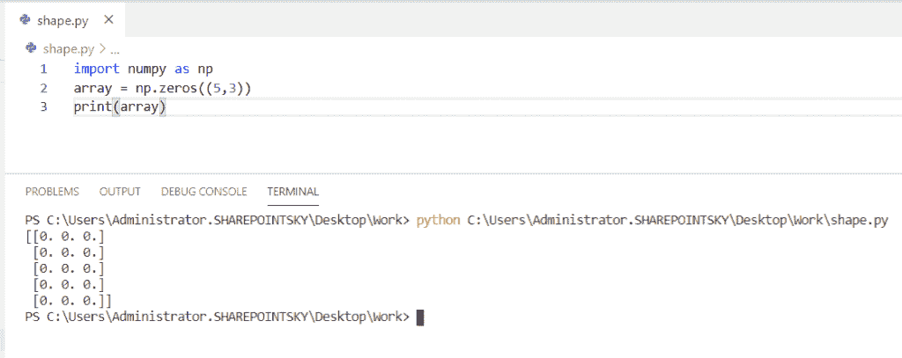

# 数组的 Python 形状

> 原文：<https://pythonguides.com/python-shape-of-an-array/>

[](https://sharepointsky.teachable.com/p/python-and-machine-learning-training-course)

在本 [](https://pythonguides.com/learn-python/) [Python 教程](https://pythonguides.com/python-programming-for-the-absolute-beginner/)中，我们将学习 **Python 的数组形状**，我们还将涉及以下主题:

*   2D 数组的 Python 形状
*   嵌套数组的 Python 形状
*   N-d 数组的 Python 形状和类型
*   多维数组的 Python 整形
*   3D 数组的 Python 形状
*   Python 索引数组
*   Python 打印多维数组的形状
*   1D 数组的 Python 转置
*   Python 将 1D 数组的形状更改为 3D 数组
*   Python 改变数组的形状

目录

[](#)

*   [蟒蛇形状的 2D 阵](#Python_shape_of_a_2D_array "Python shape of a 2D array")
*   [Python 形状的嵌套数组](#Python_shape_of_a_nested_array "Python shape of a nested array")
*   [Python N-d 数组的形状和类型](#Python_shape_and_type_of_N-d_array "Python shape and type of N-d array")
*   [多维数组的 Python 整形](#Python_reshape_of_a_multidimensional_array "Python reshape of a multidimensional array")
*   [Python 形状的 3D 数组](#Python_shape_of_a_3D_array "Python shape of a 3D array")
*   [Python 索引数组](#Python_index_array "Python index array")
*   [Python 打印出一个多维数组的形状](#Python_print_shape_of_a_multidimensional_array "Python print shape of a multidimensional array")
*   [1D 数组的 Python 转置](#Python_transpose_of_1D_array "Python transpose of 1D array")
*   [Python 将 1D 数组的形状改为 3D 数组](#Python_change_shape_of_a_1D_array_to_a_3D_array "Python change shape of a 1D array to a 3D array")
*   [Python 改变数组形状](#Python_change_shape_of_an_array "Python change shape of an array")

## 蟒蛇形状的 2D 阵

在这里，我们可以看到 python 中 2D 数组的**形状。**

*   在这个例子中，我导入了一个名为 **numpy 的模块作为 np。**`NumPy`库用于处理数组。
*   我将一个变量作为一个**数组**，并将一个数组赋值为 **array = np.array([[1，2，3，4，5]，[5，6，7，8，9]])** 。
*   而且我已经用 `np.array` 得到了一个数组的维数，shape 属性用来得到一个数组的当前形状。为了得到输出，我必须**打印(数组.形状)**。

示例:

```py
import numpy as np
array = np.array([[1, 2, 3, 4, 5], [5, 6, 7, 8, 9]])
print(array.shape)
```

我们可以看到输出(2，5 ),因为有 2 个由 5 个元素组成的数组，这是一个数组的形状。您可以参考下面的输出截图。


Python shape of a 2D array

*   [Python 数组与示例](https://pythonguides.com/python-array/)
*   [在 Python 中创建一个空数组](https://pythonguides.com/create-an-empty-array-in-python/)

## Python 形状的嵌套数组

这里可以看到**如何在 python 中找到嵌套数组**的 **形状。**

*   在这个例子中，我将一个名为 `numpy` 的模块作为 `np` 导入。 `NumPy` 库用于处理一个数组，并创建了一个名为数组的变量。
*   变量 array 被赋值为 **array = np.zeros((5，3))** ，np.zeros 用于得到一个给定大小和形状的数组，用**零填充。**
*   ((5，3))是一个数组的大小和形状，为了得到输出，我使用了 `print(array)` 。

示例:

```py
import numpy as np
array = np.zeros((5,3))
print(array)
```

在下面的截图中，你可以看到大小为(5，3)的带有零的数组。



Python shape of a nested array

## Python N-d 数组的形状和类型

现在我们可以看到**如何在 python 中找到 N-d 数组**的形状和类型。

*   在这个例子中，我导入了一个名为 `numpy` 的模块作为 **np。**`NumPy`库用于处理数组。
*   取一个变量为 x，赋一个数组为 **x = np.array([[1，2，4]，[3，4，5]，[4，5，6]])** 。
*   `np.array` 用于查找数组的维数，变量 `a = x.shape` 用于查找数组的形状，变量 `b = x.dtype` 用于查找数组的类型。
*   为了获得形状形式的输出，我使用了 `print(a)` ，为了获得数据类型形式的输出，我使用了 `print(b)` 。

示例:

```py
import numpy as np
x = np.array([[1, 2, 4],[3, 4, 5],[4, 5, 6]])
a = x.shape
b = x.dtype
print(a)
print(b) 
```

在下面的截图中，你可以看到数组的形状和数据类型作为输出。


## 多维数组的 Python 整形

现在，我们可以看到**如何在 python 中重塑多维数组**。

*   在这个例子中，我导入了一个名为 **numpy 的模块作为 np** 。 `NumPy` 库用于处理数组。
*   并赋值一个变量 x 为 **x = np.array([[ 0，1，3，4]，[ 4，5，6，7]，[ 8，9，10，11]，[12，13，14，15，])** 。
*   `np.array` 用于求一个数组的维数，对于变量 **array，**我已经赋值为**array = x . shape(4，2，2)。**
*   `shape()`函数用于在不改变数据的情况下给数组一个新的形状。
*   (4，2，2) 4 是数组中的元素数 **2 是行**，另一个 **2 是列**，为了得到输出，我使用了 `print(array)` 。

示例:

```py
import numpy as np
x = np.array([[ 0,  1, 3, 4],[ 4,  5, 6, 7],[ 8,  9, 10, 11],[12,13,14,15,]])
array = x.reshape(4, 2 , 2)
print(array) 
```

在下面的屏幕截图中，您可以看到经过整形的数组输出。


Python reshape of a multidimensional array

## Python 形状的 3D 数组

在这里，我们可以看到**如何在 python 中获得 3D 数组**的形状。

*   在这个例子中，我导入了一个名为 **numpy 的模块作为 np** 。 `NumPy` 库用于处理数组。
*   并赋值一个变量 `array_3d` 为**array _ 3d = NP . array([[1，2]，[3，4]，[[5，6]，[7，8]，[[9，10]，[11，12]])**。
*   **np。数组**用于获取数组的维数，为了得到输出我已经使用了 `print(array_3d.shape)` 。

例子

```py
import numpy as np
array_3d = np.array([[[1, 2], [3, 4]], [[5, 6], [7, 8]], [[9, 10], [11, 12]]])
print(array_3d.shape)
```

在下面的截图中，我们可以看到 shape 3d 数组的输出。


Python shape of a 3D array

## Python 索引数组

在这里，我们可以看到 python 中的**索引数组**。

*   在这个例子中，我导入了一个名为 **numpy 的模块作为 np** 。 `NumPy` 库用于处理数组。
*   并赋值一个变量数组为 **array = np.arange(20，2，-2)** 。
*   `np.arange` 是一个内置的 numpy 函数，它返回一个 ndarray 对象，该对象包含一个具有定义间隔的空间值。
*   **(20，2，-2)** 是给定的 20 到 2 之间的范围，差值为-2。
*   为了得到输出，我使用了 `print(array)` 。

示例:

```py
import numpy as np
array = np.arange(20,2,-2)
print(array)
```

我们可以将输出视为范围从 20 到 2 的数组，两者之间有 2 个差值。您可以参考下面的输出截图。


Python index array

## Python 打印出一个多维数组的形状

在这里，我们可以**如何用 python 打印多维数组**的形状。

*   在这个例子中，我导入了一个名为 `numpy` 的模块作为 **np。**`NumPy`库用于处理数组。
*   我取了三个变量作为 **array1 = np.array([[1，2]])** ， **array2 = np.array([[1，3]，[2，4]])** ， **array3 = np.array([[1，3，5，7]，[2，4，6，8]，[3，6，9，12]])** 三个都是不同维度的。
*   `np.array` 用于获取数组的维数。
*   为了得到输出，我使用了 **print(array1.shape)，print(array2.shape)，print(array3.shape)** 。

示例:

```py
import numpy as np
array1 = np.array([[1,2]])
array2 = np.array([[1, 3], [2, 4]]) 
array3 = np.array([[1, 3, 5, 7], [2, 4, 6, 8],  [3, 6, 9, 12]]) 
print(array1.shape) 
print(array2.shape) 
print(array3.shape)
```

在下面的截图中，你可以看到多维数组的形状作为输出。


Python print the shape of a multidimensional array

## 1D 数组的 Python 转置

现在，我们可以看到**如何在 python 中转置 1D 数组**。

*   在这个例子中，我导入了一个名为 **numpy 的模块作为 np** 。 `NumPy` 库用于处理数组。
*   变量数组赋值为 **array = np.arange(4)。**
*   `np.arange` 是一个内置的 numpy 函数，它返回一个 n array 对象，该对象包含一个具有定义间隔 4 的间隔值，这是一个数组的范围。
*   为了转置一个数组，我使用了 `transpose()` 函数。为了得到输出，我使用了 `print(array.transpose())` 。

示例:

```py
import numpy as np
array = np.arange(4)
print(array.transpose())
```

您可以看到范围为 4 的数组作为输出。您可以参考下面的输出截图。


Python transpose of 1D array

## Python 将 1D 数组的形状改为 3D 数组

现在，我们可以看到**如何在 python 中将 1D 数组的形状改为 3D 数组**。

*   在这个例子中，我将一个名为 **numpy 的模块作为 np** 导入，并将变量 array 赋值为 **array = np.array([2，4，6，8，10，12，14，16，18，20，22，24])** 。 `np.array` 用于获取数组的维数。
*   为了改变数组的形状，我创建了另一个变量，名为 `array_3d` ，并赋值为**array _ 3d = array . shape(2，3，2)** 。
*   `shape()`函数用于在不改变数据的情况下获得数组的新形状。为了得到输出，我使用了**打印(数组 _3d)。**

示例:

```py
import numpy as np
array = np.array([2,4,6,8,10,12,14,16,18,20,22,24])
array_3d = array.reshape(2, 3, 2)
print(array_3d)
```

输入数组是一维数组，在输出中你可以看到三维数组。您可以参考下面的输出截图。


Python convert 1D array to 3D array

## Python 改变数组形状

现在，我们可以看到**如何在 python 中改变数组**的形状。

*   在这个例子中，我将一个名为 **numpy 的模块作为 np** 导入，并将变量 array 赋值为 **array = np.array([1，2，3，4，5，6，7，8，9，10，11，12])** 。
*   `np.array` 用于获取数组的维数。
*   为了改变数组的形状，我创建了另一个变量，名为 `newarray` ，并赋值为**new array = array . shape(3，4)** 。这里 3 是行数，4 是列数。
*   `shape()`函数用于在不改变数据的情况下获得数组的新形状。为了得到输出，我使用了 **print(newarray)。**

示例:

```py
import numpy as np
array = np.array([1, 2, 3, 4, 5, 6, 7, 8, 9, 10, 11, 12])
newarray = array.reshape(3, 4)
print(newarray)
```

给定的数组被更改为 range (3，4)的数组。您可以参考下面的输出截图。


Python change the shape of an array

您可能会喜欢以下 Python 教程:

*   [如何用 Turtle 创建 Python 中的贪吃蛇游戏](https://pythonguides.com/snake-game-in-python/)
*   [使用 if-else 理解 Python 列表](https://pythonguides.com/python-list-comprehension-using-if-else/)
*   [使用蟒蛇龟绘制彩色填充形状](https://pythonguides.com/draw-colored-filled-shapes-using-python-turtle/)
*   [Python 读取二进制文件(示例)](https://pythonguides.com/python-read-a-binary-file/)
*   [Python 要求用户输入](https://pythonguides.com/python-ask-for-user-input/)
*   [如何在 Python 中把字符串转换成日期时间](https://pythonguides.com/convert-a-string-to-datetime-in-python/)
*   [Python 线程和多线程](https://pythonguides.com/python-threading-and-multithreading/)
*   [Python Tkinter 窗口大小](https://pythonguides.com/python-tkinter-window-size/)

在本教程中，我们已经学习了数组的 **Python 形状，并且我们已经涵盖了以下主题:**

*   2D 数组的 Python 形状
*   嵌套数组的 Python 形状
*   N-d 数组的 Python 形状和类型
*   多维数组的 Python 整形
*   3D 数组的 Python 形状
*   Python 索引数组
*   Python 打印多维数组的形状
*   1D 数组的 Python 转置
*   Python 将 1D 数组的形状更改为 3D 数组
*   Python 改变数组的形状

[Bijay Kumar](https://pythonguides.com/author/fewlines4biju/)

Python 是美国最流行的语言之一。我从事 Python 工作已经有很长时间了，我在与 Tkinter、Pandas、NumPy、Turtle、Django、Matplotlib、Tensorflow、Scipy、Scikit-Learn 等各种库合作方面拥有专业知识。我有与美国、加拿大、英国、澳大利亚、新西兰等国家的各种客户合作的经验。查看我的个人资料。

[enjoysharepoint.com/](https://enjoysharepoint.com/)[](https://www.facebook.com/fewlines4biju "Facebook")[](https://www.linkedin.com/in/fewlines4biju/ "Linkedin")[](https://twitter.com/fewlines4biju "Twitter")