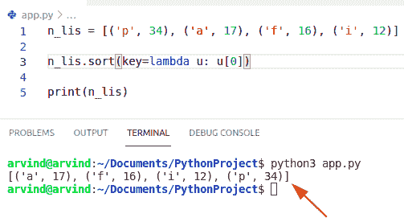

# 元组的 Python 排序列表

> 原文：<https://pythonguides.com/python-sort-list-of-tuples/>

[](https://sharepointsky.teachable.com/p/python-and-machine-learning-training-course)

在本 [Python 教程](https://pythonguides.com/python-programming-for-the-absolute-beginner/)中，我们将学习 **Python 元组排序列表**。此外，我们还将讨论:

*   元组的 Python 排序列表
*   按第二个元素对元组列表进行 Python 排序
*   如何在 Python 中通过第一个元素降序排列元组列表
*   如何按长度对 Python 中的元组列表进行排序
*   Python 对元组列表进行降序排序
*   按最后一个元素对元组列表进行 Python 排序
*   Python 按第一个和第二个元素对元组列表进行排序
*   按多个元素对元组列表进行 Python 排序
*   Python 按第二个值对元组列表进行排序
*   Python 按字母顺序排列元组列表
*   Python 元组多键排序列表
*   Python 按关键字对元组列表进行排序
*   Python 首先对元组列表进行排序
*   使用 lambda 对元组列表进行排序的 Python 程序
*   Python 按第二个值降序排列元组列表

Python 中元组列表如何排序？**在 Python 中，我们可以使用 sort()方法对元素进行升序排序，默认情况下，它会对第一个元素进行排序。**

目录

[](#)

*   [Python 元组排序列表](#Python_sort_list_of_tuples "Python sort list of tuples")
*   [通过使用 list.sort()函数](#By_using_listsort_function "By using list.sort() function")
*   [通过使用冒泡排序算法](#By_using_bubble_sort_algorithm "By using bubble sort algorithm")
*   [通过使用 sorted()函数](#By_using_sorted_function "By using sorted() function")
*   [Python 元组排序列表](#Python_sort_list_of_tuples-2 "Python sort list of tuples")
*   [Python 按第二个元素排序元组列表](#Python_sort_list_of_tuples_by_second_element "Python sort list of tuples by second element")
*   [Python 按第一个元素降序排列元组列表](#Python_sort_list_of_tuples_by_first_element_descending "Python sort list of tuples by first element descending")
*   [Python 按长度排序元组列表](#Python_sort_list_of_tuples_by_length "Python sort list of tuples by length")
*   [Python 对元组列表进行降序排序](#Python_sort_list_of_tuples_descending "Python sort list of tuples descending")
*   [Python 按最后一个元素排序元组列表](#Python_sort_list_of_tuples_by_last_element "Python sort list of tuples by last element")
*   [如何在 Python 中按最后一个元素对元组列表进行排序](#How_to_sort_list_of_tuple_by_last_element_in_Python "How to sort list of tuple by last element in Python")
*   [Python 通过第一个和第二个元素对元组列表进行排序](#Python_sort_list_of_tuples_by_first_and_second_element "Python sort list of tuples by first and second element")
*   [Python 通过多个元素对元组列表进行排序](#Python_sort_list_of_tuples_by_multiple_elements "Python sort list of tuples by multiple elements")
*   [Python 按字母顺序排列元组列表](#Python_sort_list_of_tuples_alphabetically "Python sort list of tuples alphabetically")
*   [如何使用 Python 中的 sorted()函数按字母顺序对元组列表进行排序](#How_to_sort_list_of_tuple_alphabetically_by_using_sorted_function_in_Python "How to sort list of tuple alphabetically by using sorted() function in Python")
*   [Python 元组多键排序列表](#Python_sort_list_of_tuples_multiple_keys "Python sort list of tuples multiple keys")
*   [Python 按关键字排序元组列表](#Python_sort_list_of_tuples_by_key "Python sort list of tuples by key")
*   [Python 首先对元组列表进行排序](#Python_sort_list_of_tuples_by_first "Python sort list of tuples by first ")
*   [Python 程序使用 lambda 对元组列表进行排序](#Python_program_to_sort_a_list_of_tuples_using_lambda "Python program to sort a list of tuples using lambda")
*   [Python 按第二个值降序排列元组列表](#Python_sort_list_of_tuples_by_second_value_descending "Python sort list of tuples by second value descending ")

## Python 元组排序列表

*   让我们看看如何使用 Python 中的元组对列表进行排序。
*   在 python 中，我们可以通过使用 Python 中的[元组在单个变量中存储多个值。假设你有一个元组列表，现在你想对列表中的元组进行排序。](https://pythonguides.com/create-a-tuple-in-python/)
*   有各种方法来解决这个任务
    *   通过使用 list.sort()函数
    *   通过使用冒泡排序算法
    *   通过使用 sorted()函数

## 通过使用 list.sort()函数

*   在这里，我们可以通过使用 Python 中的 list.sort()函数来检查如何对元组列表进行排序。
*   这个函数是一个内置的列表方法，它对给定列表的元素进行排序。Sort()函数接受标识值的唯一键参数，并返回排序中使用的值。

**举例:**

现在，让我们举一个例子，看看如何对元组列表进行排序

```py
new_list = [('john', 6), ('Micheal', 9), ('George', 2), ('steve', 19)]

new_list.sort(key=lambda y: y[1])

print(new_list)
```

在上面的代码中，我们必须根据第二个元素对元组进行排序。

下面是以下给定代码的输出


Python sort list of tuples

阅读:[如何在 Python 中访问元组的项目](https://pythonguides.com/access-items-of-a-tuple-in-python/)

## 通过使用冒泡排序算法

*   冒泡排序是一种简单的排序算法，可以对列表中的 n 个元素进行排序。如果给定列表中的相邻项的位置顺序不对，它将交换这些项。之后，它重复这个过程，直到所有元素都被排序。
*   在本例中，我们将获取元组列表，并使用冒泡排序算法对它们进行排序。

**举例:**

```py
new_list = [('Germany',120), ('France',110) , ('England',40) , ('Japan',184), ('China',20)]

new_ele = 0
new_lis_len = len(new_list)  
for k in range(0, new_lis_len):  
    for l in range(0, new_lis_len-k-1):  
        if (new_list[l][new_ele] > new_list[l + 1][new_ele]):  
            new_tem = new_list[l]  
            new_list[l]= new_list[l + 1]  
            new_list[l + 1]= new_tem  

print(new_list)
```

**注:**在上面的代码中， `new_ele` 变量指定了索引位置。在这种情况下，我们可以使用第一个元素对元组列表进行排序。

下面是以下给定代码的执行过程


Python sort list of tuples bubble sort

阅读 [Python 连接元组与示例](https://pythonguides.com/python-concatenate-tuples/)

## 通过使用 sorted()函数

*   Sorted 是 Python 中的内置函数。这个函数可以用在所有的 iterables 上，如果你想修改排序过程，那么你可以使用 key 函数，默认情况下它的值是 none。
*   在这个例子中，我们有一个元组列表，您可以使用 sorted()函数对这个列表进行排序。

**举例:**

```py
new_list = [(2,6,9),(0,9,7),(1,7,6),(9,1,2)]

b = sorted(new_list)
print(b)
```

**输出:**


Python sort list of the tuple using sorted

这就是如何在 Python 中对元组列表进行排序。

## Python 元组排序列表

**sort()方法**用于按升序对元素进行排序，默认情况下，它将对第一个元素进行排序。如果两个元组具有相同的第一个元素，那么它将根据第二个元素对它们进行排序。

**举例:**

```py
roll_list1 = [('Jack', 76), ('Beneth', 78), ('Cirus', 77), ('Faiz', 79)]
roll_list1.sort()
print(roll_list1)
```

写完上面的代码(python 排序元组列表)，你将打印出 `"roll_list1"` ，然后输出将显示为 **" [('Beneth '，78)，(' Cirus '，77)，(' Faiz '，79)，(' Jack '，76)，] "** 。这里，sort()方法用于按升序对元素进行排序，它将按第一个元素进行排序。你可以参考下面的截图来创建 python 元组排序列表。


Python sort list of tuples

读取 [Python 将元组转换为列表](https://pythonguides.com/python-convert-tuple-to-list/)

## Python 按第二个元素排序元组列表

让我们看另一个例子， **python 通过第二个元素**对元组列表进行排序。

在 python 中，如果你想通过第二个元素对元组列表进行排序，那么我们有一个名为 sort()的函数，并使用 lambda 函数作为关键函数。自定义比较器是 sort()中的一个关键函数。

**举例:**

```py
roll_list1 = [('Jack', 76), ('Beneth', 78), ('Cirus', 77), ('Faiz', 79)]
roll_list1.sort(key=lambda a: a[1])
print(roll_list1)
```

写完上面的代码(python 通过第二个元素对元组列表进行排序)，你将打印出 `"roll_list1"` ，然后输出将显示为 **" [('Jack '，76)， **('Cirus '，77)，**， **('Beneth '，78)，` `('Faiz '，79)`"`。

这里， **sort()方法**用于按升序对元素进行排序，元组列表将按其第二个元素进行排序。

查看 **python 中通过第二个元素**排序元组列表的截图。


Python sort list of tuples by second element

这就是如何通过 Python 中的第二个元素对元组列表进行排序。

## Python 按第一个元素降序排列元组列表

在 python 中，为了按照降序对元组列表进行排序，我们必须使用带有参数`(reverse = True)`的 sort()方法，该方法将按照降序对元素进行排序。

示例:

```py
roll_list1 = [('Jack', 76), ('Beneth', 78), ('Cirus', 77), ('Faiz', 79)]
roll_list1.sort(reverse=True)
print(roll_list1)
```

写完上面的代码(python 对元组列表按第一个元素降序排序)，你将打印出 `"roll_list1"` ，然后输出将显示为 **" [ ('Jack '，76)， **('Faiz '，79)，(' Cirus '，77)，` **`('Beneth '，78)**** ] "** 。

这里使用 sort()方法，参数为`(reverse = True)`对元素进行降序排序，按第一个元素排序。

查看截图。


Python sort list of tuples by first element descending

这就是如何按照第一个元素降序排列元组列表。

阅读 [Python 字典初始化-完整教程](https://pythonguides.com/python-dictionary-initialize/)

## Python 按长度排序元组列表

在 python 中，为了通过长度对元组列表进行**排序，我们使用了 **sort()方法**，并且应该传递参数以获得第一个元素的长度。**

**举例:**

```py
roll_list1 = [('Jack', 76), ('Beneth', 78), ('Cirus', 77), ('sid', 79)]
roll_list1.sort(key=lambda a: len(a[0]))
print(roll_list1)
```

写完上面的代码(python 按长度对元组列表进行排序)，你将打印出 `"roll_list1"` ，然后输出将显示为 **" [ **('Sid '，79)， **('Jack '，76)，`**` ****('Cirus '，77)，` `('Beneth '，78)`"`。

这里，sort()方法与参数一起使用，计算长度，并根据元素的第一个元素对元素进行升序排序。你可以参考下面的截图，获得 python 中元组按长度排序的列表。


Python sort list of tuples by length

上面的 Python 代码可以用来按长度对元组列表进行排序。

阅读[将字符串添加到 Python +示例列表中](https://pythonguides.com/add-string-to-list-python/)

## Python 对元组列表进行降序排序

*   要按降序对元组列表进行排序，我们可以很容易地使用 Python 中的 sort()函数。
*   首先，我们将获取元组列表，并对它们进行无序排列。现在，sort()函数将通过传递 reverse=True 作为 sort()方法的参数，将顺序从递增改为递减。

**举例:**

让我们举一个例子，看看如何使用 reverse 参数对列表进行降序排序

```py
my_list = [('z',80),('f',90),('g',84),('d',92),('a',96)]

my_list.sort(key=lambda i:i[1],reverse=True)
print(my_list)
```

下面是以下代码的截图


Python sort list of tuples descending

这就是如何在 Python 中对元组列表进行降序排序。

## Python 按最后一个元素排序元组列表

*   让我们看看如何通过 Python 中的最后一个元素对元组列表进行排序。
*   在 sorted()函数中，key 参数指定了一个自定义的排序顺序。在这个例子中，我们将获取一个元组列表，并希望根据每个元组的最后一个元素对元组进行排序。

**举例:**

```py
new_lis=[(4, 2), (7, 8), (3, 1)]
las_ele = sorted(new_lis, key=lambda i: i[-1])
print (las_ele)
```

下面是以下给定代码的执行过程


Python sort list of tuples by the last element

这是一个通过最后一个元素对元组进行 **Python 排序的例子。**

阅读 [Python 连接列表示例](https://pythonguides.com/python-concatenate-list/)

## 如何在 Python 中按最后一个元素对元组列表进行排序

使用冒泡排序算法，我们可以很容易地访问每个元组的最后一个元素，并使用嵌套循环来执行这个特定的任务。

这是源代码

```py
def my_list(las_ele):  

    end = len(las_ele)  
    for o in range(0, end):  

        for p in range(0, end-o-1):  
            if (las_ele[p][-1] > las_ele[p + 1][-1]):  
                new_temp = las_ele[p]  
                las_ele[p]= las_ele[p + 1]  
                las_ele[p + 1]= new_temp  
    return las_ele  

las_ele =[(9, 6), (8, 3), (4, 1)]

print(my_list(las_ele)) 
```

首先在这个例子中，我们将定义一个函数，并将 list 作为一个参数，返回每个元组的最后一个元素。

下面是以下给定代码的输出


Python sort list of tuples by last element bubble sort

这就是如何在 Python 中通过最后一个元素对元组列表进行排序。

## Python 通过第一个和第二个元素对元组列表进行排序

*   在这里，我们可以检查如何按照第一个和第二个元素对元组列表进行排序
*   为了对第一个元组元素进行排序，我们可以使用 index()方法，如 **list[0]** 。类似于第二个元素，我们可以使用**列表【1】**索引。
*   通过使用排序方法，我们需要按位置和顺序对列表进行排序。

**举例:**

```py
my_list = [('b', 4), ('d', 1), ('e', 6), ('m', 2)]

my_list.sort(key=lambda s:s[1])
print("First element values:",my_list)
my_list.sort(key=lambda i:i[0])
print("Second element values:",my_list)
```

**输出:**


Python sort list of tuples by a first and second element

这就是如何在 Python 中通过第一个和第二个元素对元组列表进行排序。

读取[检查一个列表是否存在于另一个列表 Python 中](https://pythonguides.com/check-if-a-list-exists-in-another-list-python/)

## Python 通过多个元素对元组列表进行排序

*   在这里，我们可以检查如何通过包含多个元素来对元组列表进行排序。
*   假设每个元组中有多个元素，我们希望用 double 条件对它们进行排序。在这个例子中，我们将首先对每个元组的第二个元素进行排序。
*   为此，我们可以使用 sorted()函数对元素进行排序，并返回一个包含排序顺序的元组。

**举例:**

让我们举一个例子，看看如何通过多个元素对元组列表进行排序

```py
my_tup_lis = [(2, 4), (9, 16), (1, 12), (5, 4)]
mul_sort = sorted(my_tup_lis, key=lambda t: (t[1], t[0]))

print("Multiple elements sorted",mul_sort)
```

以下给定代码的屏幕截图


Python sort list of tuples by multiple elements

上面的代码我们可以用 Python 中的多个元素对元组列表进行排序。

## Python 按字母顺序排列元组列表

*   让我们看看如何在 Python 中按字母顺序对元组列表进行排序。
*   通过使用 sort()方法，我们可以很容易地按字母顺序对元组列表进行排序。
*   要完成这项任务，首先我们必须创建一个函数，并将列表作为参数传递。在 sort 方法中，key 参数被设置为使用 lambda 函数对元素进行排序。也可以用 key=itemgetter 代替 lambda 作为参数。

**举例:**

这是源代码

```py
def alpha_tuple(new_list):  

    new_list.sort(key = lambda a: a[0])  
    return new_list  
new_list = [("b", 41), ("u", 46), ("n", 31),
        ("a", 81), ("m", 92)]
print("sorted elements alphabetically:",alpha_tuple(new_list))
```

下面是以下给定代码的执行过程


Python sort list of tuples alphabetically

上面的 Python 代码我们可以用来按字母顺序对元组列表进行排序。

读取 [Python 写列表到 CSV](https://pythonguides.com/python-write-a-list-to-csv/)

## 如何使用 Python 中的 sorted()函数按字母顺序对元组列表进行排序

这里有另一种方法，通过使用 Python 中的 sorted()函数按字母顺序对元组列表进行排序。

**源代码:**

```py
new_list = [(2,'z'),(9,'f'),(4,'c'),(6,'b')]

b = sorted(new_list, key = lambda u: u[1])  
print("sorted alphabetically",b)
```

**输出:**


Python sort list of tuples alphabetically sorted

这就是如何在 Python 中按字母顺序对元组列表进行排序。

## Python 元组多键排序列表

*   让我们看看如何在 Python 中对包含多个键的元组列表进行排序。
*   通过使用冒泡排序算法，我们可以执行这个特殊的任务。在这个例子中，每个元组是给定列表中的一个关键元素，并使用嵌套循环方法获得每个元组的第一个元素。

**举例:**

```py
def mul_keys(key):

    l = len(key)
    for x in range(l):
        for y in range(l-x-1):

            if key[y][0] > key[y + 1][0]:
                key[y], key[y + 1] = key[y + 1], key[y]
    return key

key = [("Australia"), ("Switzerland"), ("Europe"),
        ("Paris"), ("Brazil")]
print("sorted multiple keys",mul_keys(key))
```

下面是以下代码的截图


Python sort list of tuples multiple keys

使用 if-else 阅读 [Python 列表理解](https://pythonguides.com/python-list-comprehension-using-if-else/)

## Python 按关键字排序元组列表

*   在 python 编程中，为了通过键对元组列表进行排序，我们使用了 sort()方法。
*   sort()是一个内置的 list 方法，它对给定列表的元素进行排序。

**举例:**

让我们举一个例子，看看如何按键对元组列表进行排序

```py
my_list = [('Lily', 2), ('Rose', 7), ('Jasmine', 4), ('Lotus', 1)]

my_list.sort(key=lambda r: r[0])

print(my_list)
```

查看以下代码的截图


Python sort list of tuples by key

这是一个通过关键字对元组进行 **Python 排序的例子。**

## Python 首先对元组列表进行排序

*   让我们看看如何通过 Python 中的第一个元素对元组列表进行排序。
*   在 python 中，要按第一个元素对元组列表进行排序，我们必须使用 sorted()方法和参数 key=lambda 函数。

**举例:**

```py
n_lis = [('p', 34), ('a', 17), ('f', 16), ('i', 12)]

n_lis.sort(key=lambda u: u[0])

print(n_lis)
```

下面是以下给定代码的实现



Python sort list of tuples by first

上面的 Python 代码可以用来按照 Python 中的第一个元素对元组列表进行排序。

阅读:[如何在 Python 中创建元组列表](https://pythonguides.com/list-of-tuples-in-python/)

## Python 程序使用 lambda 对元组列表进行排序

首先在这个例子中，我们将初始化一个元组列表，并按照它们在 Python 中的第二个、第三个值对列表进行排序。

**举例:**

```py
to_lis = [('z', 2, 19), ('b', 2, 24), ('c', 2, 28), 
        ('q', 1, 10), ('p', 1, 19), ('o', 1, 15), ('e', 1, 17)]
new_list = sorted(to_lis, key=lambda m: (m[1],-m[2]))
print(new_list)
```

**输出:**


Python program to sort a list of tuples using lambda

上面的代码我们可以用来**使用 Python** 中的 lambda 对元组列表进行排序。

## Python 按第二个值降序排列元组列表

在 Python 中，要按第二个值降序排列元组列表，我们必须使用 Python sort()函数。

**举例:**

```py
new_lis = [('v', 2), ('u', 9), ('q', 10), ('w', 4)]

new_lis.sort(key=lambda i:i[1],reverse=True)
print("Second element descending order:",new_lis)
```

下面是以下给定代码的实现


Python sort list of tuples by second value descending

这就是如何在 Python 中**按照第二个值降序排列元组列表。**

您可能会喜欢以下 Python 教程:

*   [如何在 Python 中处理 indexerror:字符串索引超出范围](https://pythonguides.com/indexerror-string-index-out-of-range-python/)
*   [解析 Python 时出现意外的 EOF](https://pythonguides.com/unexpected-eof-python/)
*   [删除 python 中的 Unicode 字符](https://pythonguides.com/remove-unicode-characters-in-python/)
*   [无换行符的 Python 打印](https://pythonguides.com/python-print-without-newline/)
*   [如何在 Python 中创建列表](https://pythonguides.com/create-list-in-python/)
*   [Python 字符串函数](https://pythonguides.com/string-methods-in-python/)
*   [如何在 python 中把整数转换成字符串](https://pythonguides.com/convert-an-integer-to-string-in-python/)
*   [如何在 python 中连接字符串](https://pythonguides.com/concatenate-strings-in-python/)
*   [Python 命名约定](https://pythonguides.com/python-naming-conventions/)
*   [如何在 python 中使用正则表达式拆分字符串](https://pythonguides.com/python-split-string-regex/)
*   [Python 串联数组](https://pythonguides.com/python-concatenate-arrays/)

在本教程中，我们已经讨论了如何在 python 中对元组列表进行排序。我们用例子讨论了 Python 元组排序列表。

*   元组的 Python 排序列表
*   Python 对元组列表进行降序排序
*   按最后一个元素对元组列表进行 Python 排序
*   Python 按第一个和第二个元素对元组列表进行排序
*   按多个元素对元组列表进行 Python 排序
*   Python 按第二个值对元组列表进行排序
*   Python 按字母顺序排列元组列表
*   Python 元组多键排序列表
*   Python 按关键字对元组列表进行排序
*   Python 首先对元组列表进行排序
*   使用 lambda 对元组列表进行排序的 Python 程序
*   Python 按第二个值降序排列元组列表

[Bijay Kumar](https://pythonguides.com/author/fewlines4biju/)

Python 是美国最流行的语言之一。我从事 Python 工作已经有很长时间了，我在与 Tkinter、Pandas、NumPy、Turtle、Django、Matplotlib、Tensorflow、Scipy、Scikit-Learn 等各种库合作方面拥有专业知识。我有与美国、加拿大、英国、澳大利亚、新西兰等国家的各种客户合作的经验。查看我的个人资料。

[enjoysharepoint.com/](https://enjoysharepoint.com/)[](https://www.facebook.com/fewlines4biju "Facebook")[](https://www.linkedin.com/in/fewlines4biju/ "Linkedin")[](https://twitter.com/fewlines4biju "Twitter")