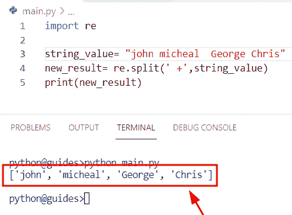

# Python 通过空格分割字符串

> 原文：<https://pythonguides.com/python-split-string-by-space/>

[](https://sharepointsky.teachable.com/p/python-and-machine-learning-training-course)

在本 [Python 教程](https://pythonguides.com/learn-python/)中，我们将学习**如何在 Python** 中按空格拆分字符串。通过 **Python 的分割函数**，我们将涵盖这些主题。

*   Python 将字符串按空格分割成列表
*   Python 按空格分割字符串并获取第一个元素
*   Python 通过空格和逗号分割字符串
*   Python 通过空格而不是引号来分割字符串
*   Python 通过空格和换行符分割字符串
*   Python 按空格分割字符串并获取最后一个元素
*   Python 不带空格的拆分字符串
*   Python 正则表达式按空格分割字符串

目录

[](#)

*   [Python 通过空格分割字符串](#Python_split_string_by_whitespace "Python split string by whitespace")
*   [Python 将字符串按空格分割成列表](#Python_split_string_by_space_into_list "Python split string by space into list")
*   [Python 按空格分割字符串，得到第一个元素](#Python_split_string_by_space_and_get_first_element "Python split string by space and get first element")
*   [Python 用空格和逗号分割字符串](#Python_split_string_by_space_and_comma "Python split string by space and comma")
*   [Python 通过空格而不是引号分割字符串](#Python_split_string_by_space_but_not_inside_quotes "Python split string by space but not inside quotes")
*   [Python 通过空格和换行符分割字符串](#Python_split_string_by_space_and_newline "Python split string by space and newline")
*   [Python 按空格分割字符串，得到最后一个元素](#Python_split_string_by_space_and_get_last_element "Python split string by space and get last element")
*   [Python 无空格分割字符串](#Python_split_string_without_whitespace "Python split string without whitespace")
*   [Python 正则表达式按空格分割字符串](#Python_regex_split_string_by_space "Python regex split string by space")

## Python 通过空格分割字符串

*   在这一节中，我们将讨论如何在 Python 中用空格分割字符串。
*   为了完成这个任务，我们将使用 [Python 字符串](https://pythonguides.com/create-a-string-in-python/) `split()` 方法。在 Python 中，这个函数用于从给定的分隔符中分离字符串，并且总是返回所有单词的列表。
*   在这个方法中，默认情况下，分隔符是空白，这是 Python 中的一个内置函数。

**语法:**

让我们看一下语法并理解 Python `split()` 函数的工作原理

```py
str.split
         (
          separator,
          maxsplit
         )
```

*   它由几个参数组成
    *   **分隔符:**该参数表示分隔符，默认情况下任何空格都是分隔符。
    *   `maxsplit` :可选参数，表示最大拆分次数。

**举例:**

```py
new_string="John is a good boy"

result=new_string.split()
print(result)
```

在下面的代码中，我们使用了空格作为分隔符。为了完成这个任务，我们有一个输入字符串，通过使用 `string.split()` 方法，我们可以很容易地分离字符串。

下面是以下给定代码的实现


Python split string by whitespace

另外，查看: [Python 下载和安装步骤](https://pythonguides.com/python-download-and-installation/)

## Python 将字符串按空格分割成列表

*   在这个程序中，我们将讨论如何使用 list 构造函数按空格分割字符串。
*   为了完成这项任务，我们将首先创建一个输入字符串，然后生成一个列表构造函数。在 Python 中，这个方法用于返回一个列表，在这个构造函数中，我们传递了输入字符串。

**语法:**

下面是 Python `list()` 构造函数的语法

```py
list(iterable)
```

**举例:**

```py
new_str = 'Micheal'

result = list(new_str)
print("split strings",result) 
```

下面是以下给定代码的执行过程


Python split string by space into a list

阅读:[如何在 Python 中把列表转换成字符串](https://pythonguides.com/python-convert-list-to-string/)

## Python 按空格分割字符串，得到第一个元素

*   在本节中，我们将讨论如何按空格分割字符串，并获取 Python 中的第一个元素。
*   为了完成这项任务，首先我们将创建一个包含由空格分隔的整数值的字符串。现在我们将使用 `str.split()` 函数分割字符串，同时我们将使用 **[0]** 索引。它将显示拆分字符串的第一个元素。

**举例:**

```py
new_string="23 24 26"

result=new_string.split()[0]
print(result)
```

下面是以下代码的截图


Python split string by space and get the first element

阅读: [Python 在字符串中查找数字](https://pythonguides.com/python-find-number-in-string/)

## Python 用空格和逗号分割字符串

*   在这个程序中，我们将学习如何在 Python 中用空格和逗号分割字符串。
*   在本例中，我们将在 `split()` 函数中使用逗号分隔符，按空格和逗号分割字符串。一旦你将打印**‘new _ result’**，那么输出将显示字符串的子串。

**举例:**

```py
new_string = ' Germany, France, England '

new_result = new_string.split(',')
print(new_result)
```

你可以参考下面的截图


Python split string by space and comma

阅读:[从字符串 Python 中删除字符](https://pythonguides.com/remove-character-from-string-python/)

## Python 通过空格而不是引号分割字符串

*   在这一节中，我们将讨论如何在 Python 中通过空格而不是引号来分割字符串。
*   为了执行这个特定的任务，我们将使用 shlex 模块，它用于拆分字符串并写入词法分析器。

**举例:**

```py
import shlex

new_string=('China, England, "France Malaysia"')
new_output=shlex.split(new_string)
print(new_output)
```

下面是以下代码的截图


Python split string by space but not inside quotes

阅读: [Python 3 string replace()方法](https://pythonguides.com/python-3-string-replace/)

## Python 通过空格和换行符分割字符串

*   在这一节中，我们将讨论如何在 Python 中通过空格和换行符来拆分字符串。
*   在本例中，我们刚刚创建了一个简单的字符串，它包含单引号中的**‘国家名称’**，但是在字符串内部，我们使用了双引号中的**【法国马来西亚】**，一旦您执行下面的代码，输出将显示**【法国马来西亚】**是一个单独的字符串。
*   现在我们将调用一个变量**‘new _ result’**并分配 `split()` 函数。一旦您将打印**‘new _ result’**，那么输出将显示存储了子字符串的列表。

**举例:**

```py
str_value = 'Japan\nRussia England' 

new_result = str_value.split('\n')

print("split strings:",new_result)
```

下面是以下给定代码的实现


Python split string by space and newline

阅读: [Python 3 字符串方法](https://pythonguides.com/string-methods-in-python/)

## Python 按空格分割字符串，得到最后一个元素

*   在这一节中，我们将讨论如何按空格分割字符串并获得 Python 中的最后一个元素。
*   为了执行这个特定的任务，首先我们将创建一个包含由空格分隔的整数值的字符串。现在我们将使用 `str.split()` 函数分割字符串，同时我们将使用 **[-1]** 索引。它将显示拆分字符串的最后一个元素。

**源代码:**

```py
new_str_values="56 83 178"

new_output=new_str_values.split()[-1]
print(new_output)
```

下面是以下给定代码的输出


Python split string by space and get the last element

阅读: [Python 在字符串](https://pythonguides.com/python-find-substring-in-string/)中查找子串

## Python 无空格分割字符串

*   在这一节中，我们将讨论如何在 Python 中拆分不带空格的字符串。
*   在这个例子中，我们不会在 `split()` 函数中使用空白分隔符。我们将使用**' * "**分隔符。一旦你将打印**‘结果’**，那么输出显示多个字符串。

**举例:**

```py
new_string="John*is a good boy"

result=new_string.split('*')
print(result)
```

下面是以下给定代码的实现


Python split string without whitespace

阅读:[在 Python 中切片字符串](https://pythonguides.com/slicing-string-in-python/)

## Python 正则表达式按空格分割字符串

*   在这个程序中，我们将讨论如何使用 Python 中的 regex 模块来拆分字符串。
*   要完成这项任务，我们首先要导入 re 模块，然后初始化一个字符串。接下来，我们将声明一个变量**‘new _ result’**并调用. split()函数。在这个函数中，我们将分隔符 **'+'** 作为一个参数传递，该参数指示字符串将被分成子字符串。

**举例:**

```py
import re 

string_value= "john micheal  George Chris"         
new_result= re.split(' +',string_value)
print(new_result)
```

下面是以下给定代码的实现



Python regex split string by space

你可能也喜欢阅读下面的 Python 教程。

*   [在 Python 中把字符串转换成浮点数](https://pythonguides.com/convert-string-to-float-in-python/)
*   [通过索引](https://pythonguides.com/remove-character-from-python-string-through-index/)从 Python 字符串中删除一个字符
*   [Python 字典重复键](https://pythonguides.com/python-dictionary-duplicate-keys/)
*   [添加字符串到列表 Python](https://pythonguides.com/add-string-to-list-python/)
*   [追加到字符串 Python](https://pythonguides.com/append-to-a-string-python/)
*   [Python 字典多值](https://pythonguides.com/python-dictionary-multiple-values/)
*   [用 Python 从列表中获取字符串值](https://pythonguides.com/how-to-get-string-values-from-list-in-python/)

在这个 Python 教程中，我们已经学习了如何在 Python 中用空格分割字符串。此外，使用 **Python 分割函数**，我们已经涵盖了这些主题。

*   Python 将字符串按空格分割成列表
*   Python 按空格分割字符串并获取第一个元素
*   Python 通过空格和逗号分割字符串
*   Python 通过空格而不是引号来分割字符串
*   Python 通过空格和换行符分割字符串
*   Python 按空格分割字符串并获取最后一个元素
*   Python 不带空格的拆分字符串
*   Python 正则表达式按空格分割字符串

[Bijay Kumar](https://pythonguides.com/author/fewlines4biju/)

Python 是美国最流行的语言之一。我从事 Python 工作已经有很长时间了，我在与 Tkinter、Pandas、NumPy、Turtle、Django、Matplotlib、Tensorflow、Scipy、Scikit-Learn 等各种库合作方面拥有专业知识。我有与美国、加拿大、英国、澳大利亚、新西兰等国家的各种客户合作的经验。查看我的个人资料。

[enjoysharepoint.com/](https://enjoysharepoint.com/)[](https://www.facebook.com/fewlines4biju "Facebook")[](https://www.linkedin.com/in/fewlines4biju/ "Linkedin")[](https://twitter.com/fewlines4biju "Twitter")