# 如何在 python 中使用正则表达式拆分字符串

> 原文：<https://pythonguides.com/python-split-string-regex/>

[](https://sharepointsky.teachable.com/p/python-and-machine-learning-training-course)

在这个 python 教程中，我们将讨论**如何在 python** 中使用 regex 拆分字符串。我们还将在此讨论以下主题

*   如何在 python 中用逗号分割字符串
*   如何在 python 中按空格分割字符串
*   如何在 python 中通过分隔符分割字符串
*   如何在 python 中按字符分割字符串
*   如何在 python 中使用 split 函数拆分字符串
*   如何在 python 中拆分字符串的最后一个元素
*   如何在 python 中拆分一个字符串的每个字符
*   如何在 python 中使用多个分隔符分割字符串
*   如何在 python 中按索引拆分字符串
*   Python 将一个字符串分成相等的两半
*   Python 将一个字符串拆分成数组
*   将句子拆分成单词列表

如果您是 Python 新手，请查看 [Python 下载和安装步骤](https://pythonguides.com/python-download-and-installation/)和 [Python Hello World 程序](https://pythonguides.com/python-hello-world-program/)

目录

[](#)

*   [如何在 python 中使用正则表达式拆分字符串](#How_to_split_a_string_using_regex_in_python "How to split a string using regex in python")
*   [如何在 python 中用逗号分割字符串](#How_to_split_a_string_by_comma_in_python "How to split a string by comma in python")
*   [如何在 python 中按空格分割字符串](#How_to_split_a_string_by_space_in_python "How to split a string by space in python")
*   [如何在 python 中通过分隔符分割字符串](#How_to_split_a_string_by_delimiter_in_python "How to split a string by delimiter in python")
*   [如何在 python 中按每个字符拆分一个字符串](#How_to_split_a_string_by_every_character_in_python "How to split a string by every character in python")
    *   [1-如何使用 for 循环将字符串拆分成字符数组](#1-_How_to_split_a_string_into_array_of_characters_using_for_loop "1- How to split a string into array of characters using for loop")
    *   [2-如何通过将字符串类型转换为列表来将字符串拆分为字符数组](#2-_How_to_split_string_into_array_of_characters_by_typecasting_string_to_list "2- How to split string into array of characters by typecasting string to list")
*   [如何用 python 中的 split 函数拆分字符串](#How_to_split_a_string_by_split_function_in_python "How to split a string by split function in python")
*   [如何用 python 中的最后一个元素拆分一个字符串](#How_to_split_a_string_by_the_last_element_in_python "How to split a string by the last element in python")
    *   [1-如何使用 rsplit()](#1-_How_to_split_a_string_by_the_last_element_using_rsplit "1- How to split a string by the last element using rsplit() ") 根据最后一个元素分割字符串
    *   [2-如何使用 rpartition()](#2-_How_to_split_a_string_by_the_last_element_using_rpartition "2- How to split a string by the last element using rpartition()") 根据最后一个元素分割字符串
*   [如何在 python 中用多个分隔符分割一个字符串](#How_to_split_a_string_by_multiple_separators_in_python "How to split a string by multiple separators in python")
*   [如何在 python 中按索引拆分字符串](#How_to_split_a_string_by_index_in_python "How to split a string by index in python")
*   [Python 将一个字符串分成相等的两半](#Python_split_a_string_into_equal_half "Python split a string into equal half")
*   [Python 将一个字符串拆分成数组](#Python_split_a_string_into_array "Python split a string into array")
*   [将句子拆分成单词列表 python](#Split_sentence_into_list_of_words_python "Split sentence into list of words python")

## 如何在 python 中使用正则表达式拆分字符串

在 python 中，我们可以使用正则表达式来分割字符串。让我们看看如何在 python 中使用 regex 来拆分字符串。

我们可以用 `re.split()` 来表示同样的意思。 `re` 是模块， `split()` 是该模块中的内置方法。

例如

```py
import re
myvar = 'sky1cloud3blue333red'

print(re.split('\d+', myvar))
```

注意:确保导入 `re` 模块，否则将无法工作。

**输出**将为

```py
['sky', 'cloud', 'blue', 'red']
```

请参见此处的**输出**

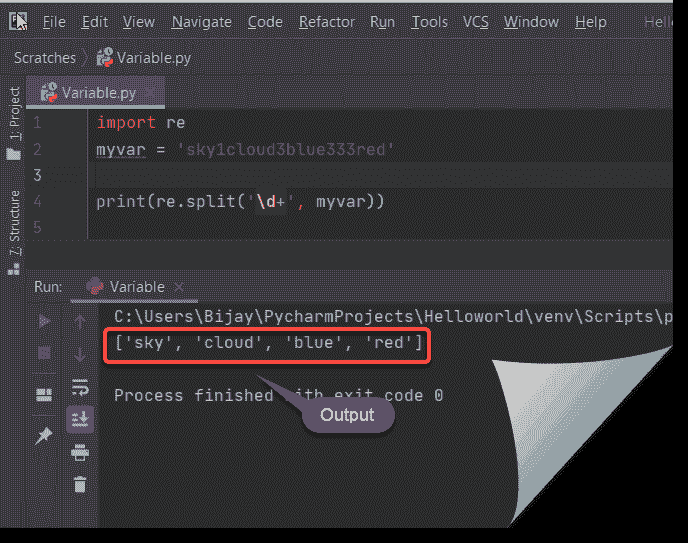

split a string using regex in python

这是如何在 python 中使用 regex 分割字符串。

阅读:[如何在 python 中创建一个字符串并将其赋给一个变量](https://pythonguides.com/create-a-string-in-python/)

## 如何在 python 中用逗号分割字符串

在 python 中，我们可以**使用逗号作为分隔符来拆分字符串。**

让我们看一个例子，看看它是如何工作的

示例:

```py
mystring = "Hey, I love Python, Python is easy"

x = mystring.split(",")

print(x)
```

输出将是

```py
['Hey', ' I love Python', ' Python is easy']
```

在这里查看输出

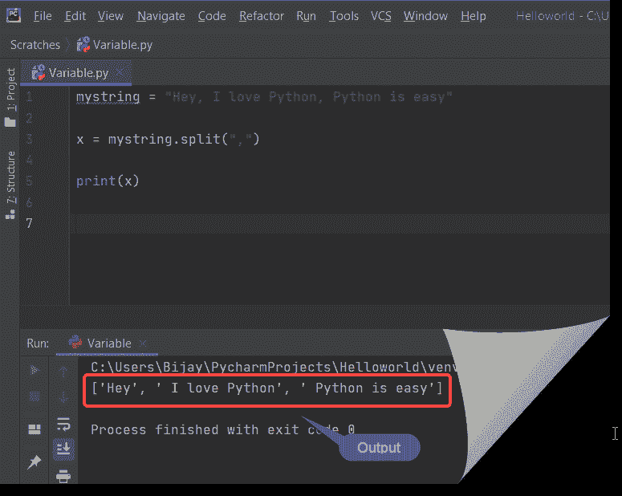

split a string using comma in python

上面的代码我们可以用来在 python 中用逗号**分割一个字符串。**

阅读:[追加到字符串 Python](https://pythonguides.com/append-to-a-string-python/)

## 如何在 python 中按空格分割字符串

在 python 中，你也可以通过使用空格作为分隔符来分割字符串。

默认情况下， `split()` 方法在分割字符串时使用空格作为分隔符。

例如:

```py
mystring = "sky blue red cloud"

x = mystring.split()

print(x)
```

输出将是

```py
['sky', 'blue', 'red', 'cloud']
```

示例:

将字符串拆分成一个列表

```py
mystring = "sky blue red cloud"

x = mystring.split()

for temp in mystring:
    print(temp)
```

输出将是

```py
s
k
y

b
l
u
e

r
e
d

c
l
o
u
d
```

在这里查看输出

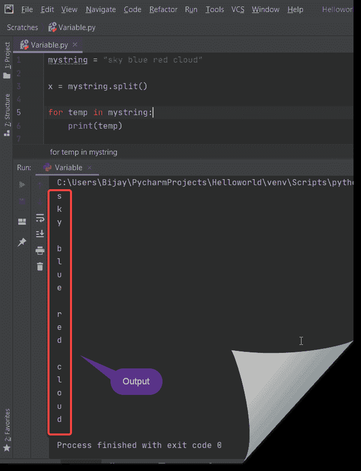

split the string using space as a separator

这是**如何在 python** 中按空格拆分一个字符串。

查看 [Python 字符串格式](https://pythonguides.com/python-string-formatting/)。

## 如何在 python 中通过分隔符分割字符串

我们可以在 Python 中用分隔符**分割字符串。**

示例:

```py
myvar = 'I love python'

# This splits at space
print(myvar.split())

nature = 'sky, cloud, blue'

# This splits at ','
print(nature.split(','))

nature = 'sky:cloud:blue'

# This splits at ':'
print(nature.split(':'))
```

输出将是

```py
['I', 'love', 'python']
['sky', ' cloud', ' blue']
['sky', 'cloud', 'blue']
```

请参见下面的输出

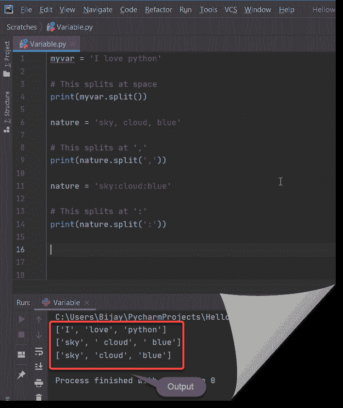

split string using delimiter in Python

这是**如何在 python** 中通过分隔符分割字符串。

阅读:[用 Python 把 PDF 文件转换成 Docx](https://pythonguides.com/convert-pdf-file-to-docx-in-python/)

## 如何在 python 中按每个字符拆分一个字符串

这里讨论一下，如何用字符的**数组或者字符**的**列表拆分字符串。**

### **1-如何` `使用 for 循环** 将一个字符串拆分成字符数组

我们可以使用循环的**将一个字符串分割成字符数组。**

示例:

```py
def charactersplit(str):
  return [ch for ch in str]

mystr = 'I love python'

print(charactersplit(mystr))
```

输出将是

```py
['I', ' ', 'l', 'o', 'v', 'e', ' ', 'p', 'y', 't', 'h', 'o', 'n']
```

在此查看输出

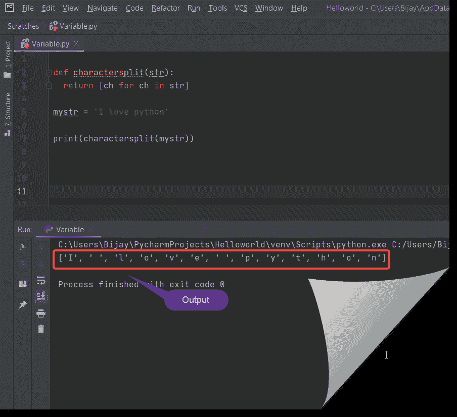

split a string by every character in python

这是如何在 python 中按每个字符分割一个字符串。

### `2-` **如何通过对字符串列表** 进行排版来将字符串拆分成字符数组

我们可以通过**将字符串转换成列表**来将字符串拆分成字符数组。

示例:

```py
def charactersplit(str):
  return list(str)

mystr = 'I love python'

print(charactersplit(mystr))
```

输出将是

```py
['I', ' ', 'l', 'o', 'v', 'e', ' ', 'p', 'y', 't', 'h', 'o', 'n']
```

在此查看输出

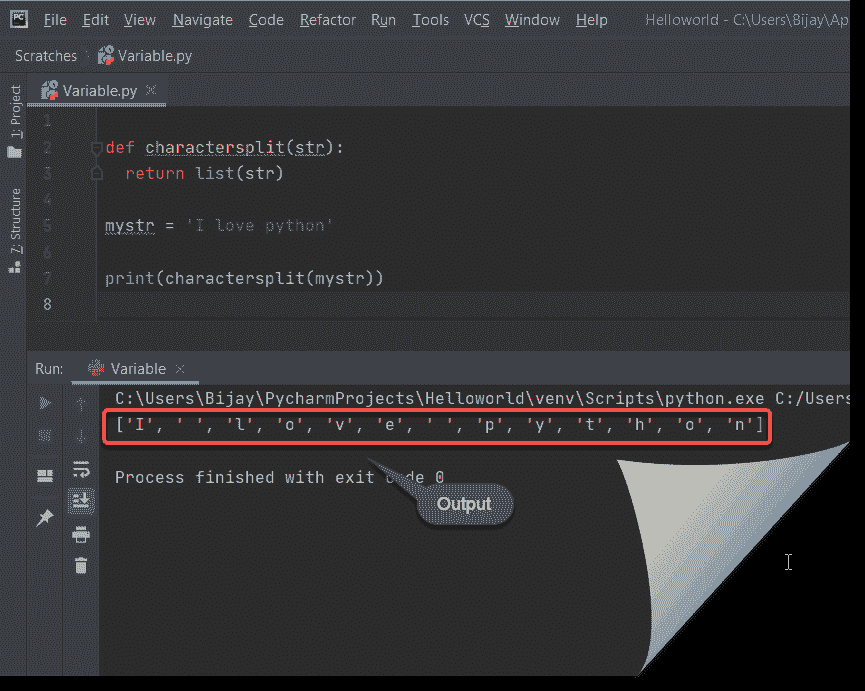

split string into array of characters by typecasting string to list in Python

这是如何通过将字符串类型转换为列表来将字符串拆分为字符数组。

## 如何用 python 中的 split 函数拆分字符串

我们可以**通过 python** 中的 split 函数来拆分一个字符串。

例如:

```py
mystring = "sky cloud  blue red"

x = mystring.split()

print(x)
```

输出将是

```py
['sky', 'cloud', 'blue', 'red']
```

在此查看输出

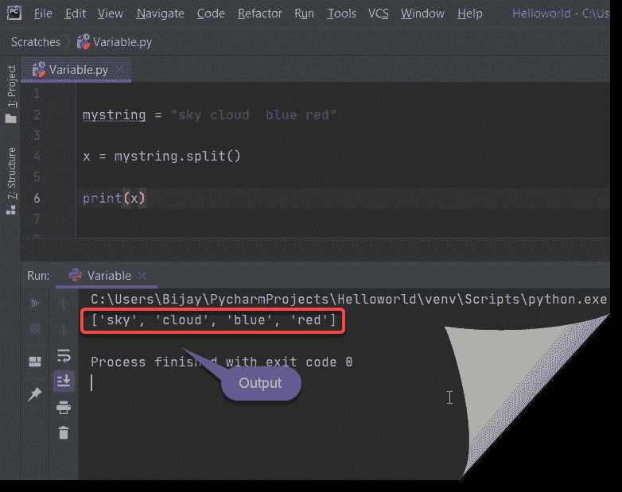

split a string by split function in python

上面的代码我们可以用来**通过 python** 中的 split 函数拆分一个字符串。

## 如何用 python 中的最后一个元素拆分一个字符串

我们可以在 python 中**拆分一个字符串的最后一个元素。让我们就此展开讨论**

### `1-` **如何` `拆分一个字符串` `由` `最后一个元素` `使用 rsplit()**

我们可以使用 `rsplit()` 函数来拆分 python 中一个字符串的最后一个元素。

示例:

```py
# initializing string
mystring = "sky, cloud,  blue, red"

# rsplit() to split the string
result = mystring.rsplit(', ', 1)

print(str(result))
```

输出将是

```py
['sky, cloud,  blue', 'red']
```

在这里查看输出

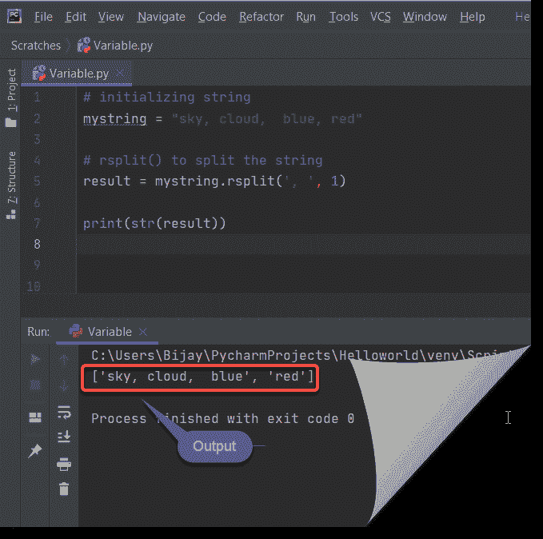

split a string by the last element in python

### `2-` **如何` `拆分一个字符串` `由` `最后一个元素` `使用 rpartition()**

我们可以使用 **`rpartition` ()** 函数在 python 中拆分一个字符串的最后一个元素。

示例:

```py
# initializing string
mystring = "sky, cloud,  blue, red"

# rsplit() to split the string
result = mystring.rpartition(', ')

print(str(result))
```

注意:rpartition()将只接受一个参数，否则将显示异常“类型错误:rpartition()只接受一个参数(给定 2 个)”

输出将是

```py
('sky, cloud,  blue', ', ', 'red')
```

在这里查看输出

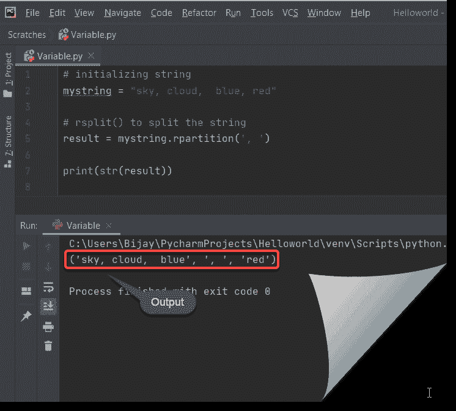

Python split a string by the last element using rpartition()

这就是 python 中如何通过最后一个元素来拆分字符串。

## 如何在 python 中用多个分隔符分割一个字符串

我们可以使用 split()在 python 中一次用一个分隔符来拆分字符串。

如果要用多重分隔符来拆分字符串我们可以用 re.split()代替 split()。

例如

```py
import re
myvar = 'sky,cloud;blue,   red'

print(re.split(r'[;,\s]\s*', myvar))
```

输出将是

```py
['sky', 'cloud', 'blue', 'red']
```

在这里查看输出

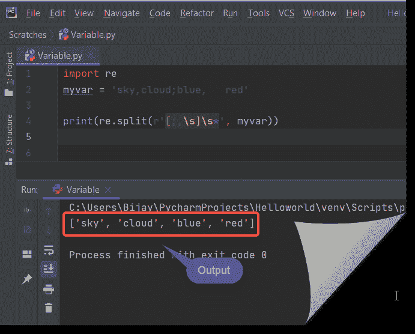

split a string by multiple separators in python

上面的代码我们可以用 python 中的多个分隔符来拆分一个字符串。

## 如何在 python 中按索引拆分字符串

我们还可以在 python 中通过索引来分割字符串。

示例 1:

```py
mystring = 'I love python It is easy to learn'
indices = [0,6,13]
x = [mystring[index:] for index in indices]
for mystring in x:
    print (mystring)
```

输出将是

```py
I love python It is easy to learn
 python It is easy to learn
 It is easy to learn
```

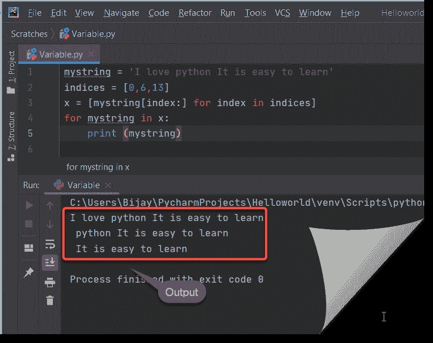

split a string by index in python

参见上面的输出

示例 2:

```py
mystring = 'I love python It is easy to learn'
indices = [0,6,13]
x = [mystring[i:j] for i,j in zip(indices, indices[1:]+[None])]
for mystring in x:
    print (mystring)
```

输出将是

```py
I love
 python
 It is easy to learn
```

在这里查看输出

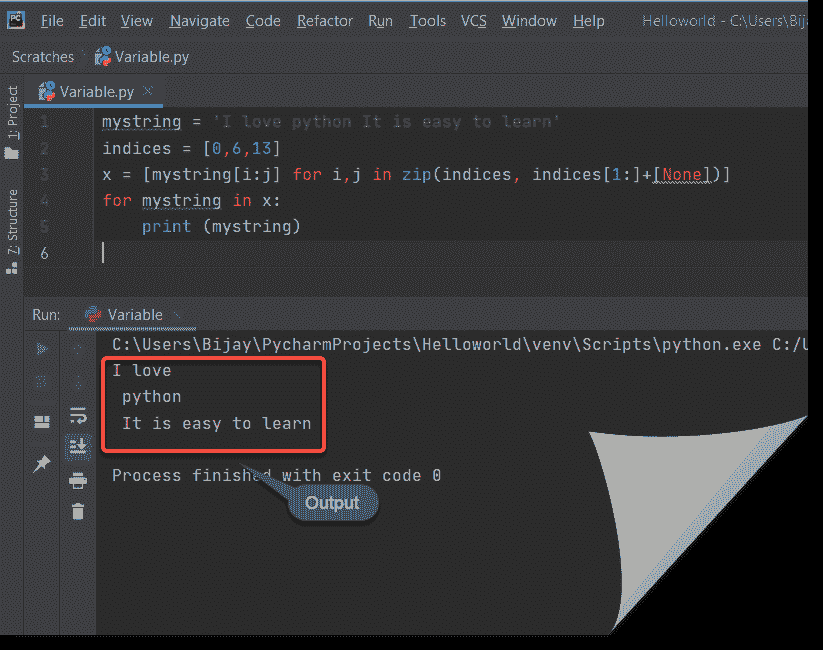

split a string by index in python

上面的代码，我们可以用来在 python 中按索引拆分一个字符串。

## Python 将一个字符串分成相等的两半

在 python 中，要将字符串分成两半，我们将使用字符串切片方法来将字符串分成两半。

**举例:**

```py
my_string = "PythonGuides"
string_first = my_string[:len(my_string)//2]
string_second = my_string[len(my_string)//2:]
print("My first part of string : " + string_first)
print("My second part of string : " + string_second)
```

在编写完上面的代码(python 将一个字符串分成相等的两半)后，您将打印这些代码，然后输出将显示为**“我的第一部分字符串:Python，我的第二部分字符串:Guides”**。这里，我们将使用字符串切片方法将字符串分成相等的两半。

你可以参考下面的截图，python 把一个字符串分成相等的两半

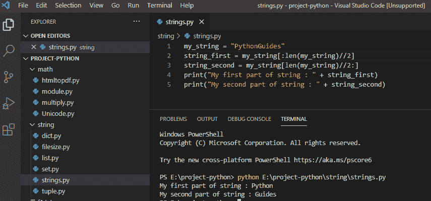

这就是 **python 如何将一个字符串分成相等的两半**。

## Python 将一个字符串拆分成数组

要将一个字符串拆分成一个数组，我们将使用 `"string.split()"` ，它会将字符串拆分成一个数组。

**举例:**

```py
string = "welcome to python happy learning"
arr = string.split()
print(arr)
```

写完上面的代码(python 将一个字符串拆分成数组)，你将打印出 `" arr "` ，然后输出将显示为 **" ['欢迎'，' to '，' python '，' happy '，' learning']"。**在这里， `string.split()` 方法将把字符串拆分成一个数组。

你可以参考下面的截图 python 把一个字符串拆分成数组

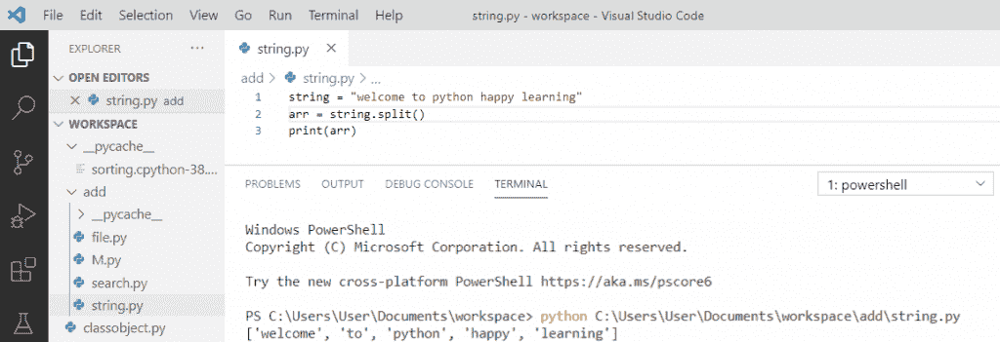

Python split a string into array

上面的代码我们可以用来在 Python 中把一个字符串分割成数组。

## 将句子拆分成单词列表 python

我们可以使用 `split()` 方法来拆分给定的列表，然后我们将使用 `join()` 方法进行连接。

**举例:**

```py
def sentence(list):
    return ' '.join(list).split()
list = ['Welcome to Python Guides']
print(sentence(list))
```

写完上面的代码(将句子拆分成单词列表 python)，你将打印出**“句子(列表)”**，然后输出将显示为**“['欢迎'，'到'，' Python '，'指南']”。**这里， `split()` 方法将把句子拆分成一个单词列表。

你可以参考下面的截图把句子拆分成一个单词列表 python

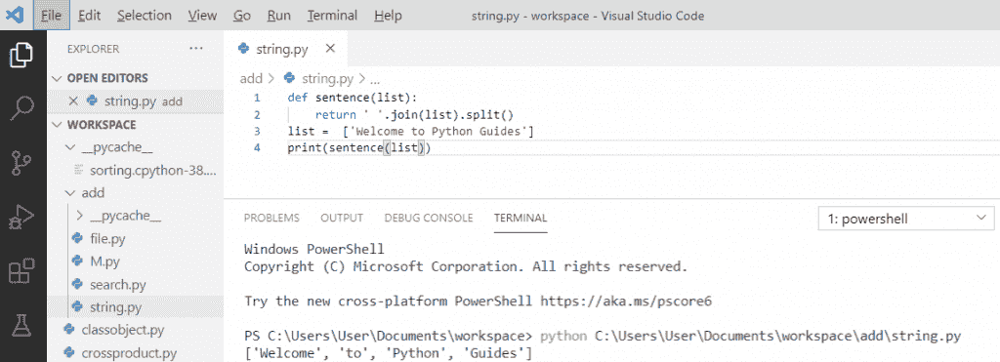

Split sentence into list of words python

上面的代码，我们可以使用 python 中如何将句子拆分成单词列表。

您可能会喜欢以下 Python 教程:

*   [Python 编程的绝对初学者](https://pythonguides.com/python-programming-for-the-absolute-beginner/)
*   [如何在 python 中创建变量](https://pythonguides.com/create-python-variable/)
*   [如何在 python 中创建一个字符串并将其赋给一个变量](https://pythonguides.com/create-a-string-in-python/)
*   [Python 字符串函数](https://pythonguides.com/string-methods-in-python/)
*   [用 Python 创建和修改 PDF 文件](https://pythonguides.com/create-and-modify-pdf-file-in-python/)

**结论**

Python 是最流行的开源面向对象编程语言，易于学习，语法也非常简单。

我们可以用 `re.split()` 来表示同样的意思。 `re` 是模块， `split()` 是该模块中的内置方法。在 python 中，我们可以使用逗号、空格和其他分隔符作为分隔符来拆分字符串。我们还可以使用 `rsplit()` 和 **`rpartition` ()** 函数来拆分 python 中字符串的最后一个元素

本 python 教程解释了以下几点:

*   如何在 python 中使用正则表达式拆分字符串
*   如何在 python 中用逗号分割字符串
*   如何在 python 中按空格分割字符串
*   如何在 python 中通过分隔符分割字符串
*   如何在 python 中按每个字符拆分字符串
*   如何在 python 中使用 split 函数拆分字符串
*   如何在 python 中拆分字符串的最后一个元素
*   如何在 python 中使用多个分隔符分割字符串
*   如何在 python 中按索引拆分字符串
*   Python 将一个字符串分成相等的两半
*   Python 将一个字符串拆分成数组
*   如何在 Python 中将句子拆分成单词列表

[Bijay Kumar](https://pythonguides.com/author/fewlines4biju/)

Python 是美国最流行的语言之一。我从事 Python 工作已经有很长时间了，我在与 Tkinter、Pandas、NumPy、Turtle、Django、Matplotlib、Tensorflow、Scipy、Scikit-Learn 等各种库合作方面拥有专业知识。我有与美国、加拿大、英国、澳大利亚、新西兰等国家的各种客户合作的经验。查看我的个人资料。

[enjoysharepoint.com/](https://enjoysharepoint.com/)[](https://www.facebook.com/fewlines4biju "Facebook")[](https://www.linkedin.com/in/fewlines4biju/ "Linkedin")[](https://twitter.com/fewlines4biju "Twitter")