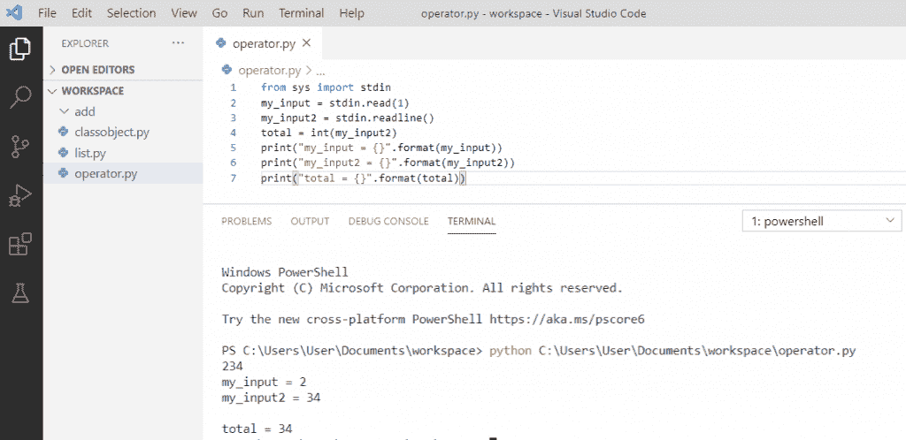

# Python – stderr, stdin and stdout

> 原文：<https://pythonguides.com/python-stderr-stdin-and-stdout/>

[](https://sharepointsky.teachable.com/p/python-and-machine-learning-training-course)

在这个 [python 教程](https://pythonguides.com/python-gui-programming/)中，你将学习到**python print——stderr、stdin、stdout** 的例子。

[Python](https://pythonguides.com/python-programming-for-the-absolute-beginner/) 为我们提供了类似文件的对象，表示标准输入、标准输出和标准错误。所以首先我们需要用 python 导入 sys 模块。在这里，我们将看到如何使用这些对象。

目录

[](#)

*   [Python 打印到 stderr](#Python_print_to_stderr "Python print to stderr")
*   [Python 从 stdin 获取输入](#Python_take_input_from_stdin "Python take input from stdin")
*   [Python stdout](#Python_stdout "Python stdout")
*   [从 python 中的 stdin 读取](#Read_from_stdin_in_python "Read from stdin in python")

## Python 打印到 stderr

`Python stderr` 被称为**标准错误流**。它类似于 stdout，因为它也直接打印到控制台，但主要区别是它只打印错误消息。

**举例:**

```py
import sys
sys.stderr.write("This is error msg")
```

写完上面的代码(python print to stderr)后，可以观察到它使用 `sys.stderr` 打印调试消息。Stderr 总是用于打印错误，如果您想将警告和错误消息从实际输出中分离出来，这是非常有用的。

可以参考下面 **python 打印到 stderr** 的截图。


Python print to stderr

## Python 从 stdin 获取输入

`Python stdin` 用于**标准输入**，因为它在内部调用输入函数，并且在输入字符串末尾附加一个换行符。所以，使用 rstrip()函数来删除它。

**举例:**

```py
import sys
for line in sys.stdin:
if 'E' == line.rstrip():
break
print(f"Message : {line}')
print("End")
```

在编写了上面的代码(python 从 stdin 获取输入)之后，程序从标准输入中读取用户消息，并对其进行相应的处理。当用户输入**“E”**消息并打印**“结束”**时，程序将终止。

你可以参考下面的 python 从 stdin 获取输入的截图。


Python take input from stdin

## Python stdout

`Python stdout` 被称为**标准输出**。在这里，write 函数将直接打印您给出的任何字符串。

**举例:**

```py
import sys
s = sys.stdout
my_input = ['Welcome', 'to', 'python']
for a in my_input:
s.write(a + '\n')
```

写完上面的代码(python stdout)，输出会是**“欢迎使用 python”**。当我们编写 sys.stdout 时，我们得到了控制台的输出。

关于 `python stdout` 可以参考下面的截图。


Python stdout

## 从 python 中的 stdin 读取

为了从 stdin 中读取输入，我们可以在 Python 中调用 `read()` 和 `readlines()` 函数来读取所有内容。

**举例:**

```py
from sys import stdin
my_input = stdin.read(1)
my_input2 = stdin.readline()
total = int(my_input2)
print("my_input = {}".format(my_input))
print("my_input2 = {}".format(my_input2))
print("total = {}".format(total))
```

在编写上述代码(在 python 中从 stdin 读取)之后，stdin 将读取输入并打印每个输入。

你可以参考下面用 python 从 stdin 中读取的截图。



Read from stdin in python

您可能会喜欢以下 Python 教程:

*   [Python 中的递增和递减运算符](https://pythonguides.com/increment-and-decrement-operators-in-python/)
*   [面向对象编程 python](https://pythonguides.com/object-oriented-programming-python/)
*   [Python 中的构造函数](https://pythonguides.com/constructor-in-python/)
*   [Python 访问修饰符+示例](https://pythonguides.com/python-access-modifiers/)
*   [Python 匿名函数](https://pythonguides.com/python-anonymous-function/)
*   [Python 读取 CSV 文件并写入 CSV 文件](https://pythonguides.com/python-read-csv-file/)
*   [Python 数组与示例](https://pythonguides.com/python-array/)
*   [Python 从路径中获取文件名](https://pythonguides.com/python-get-filename-from-the-path/)

在本 Python 教程中，我们学习了-`Python print to stderr`，Python 从 stdin、Python stdout 中获取输入，并通过示例在 Python 中从 stdin 中读取。

[Bijay Kumar](https://pythonguides.com/author/fewlines4biju/)

Python 是美国最流行的语言之一。我从事 Python 工作已经有很长时间了，我在与 Tkinter、Pandas、NumPy、Turtle、Django、Matplotlib、Tensorflow、Scipy、Scikit-Learn 等各种库合作方面拥有专业知识。我有与美国、加拿大、英国、澳大利亚、新西兰等国家的各种客户合作的经验。查看我的个人资料。

[enjoysharepoint.com/](https://enjoysharepoint.com/)[](https://www.facebook.com/fewlines4biju "Facebook")[](https://www.linkedin.com/in/fewlines4biju/ "Linkedin")[](https://twitter.com/fewlines4biju "Twitter")