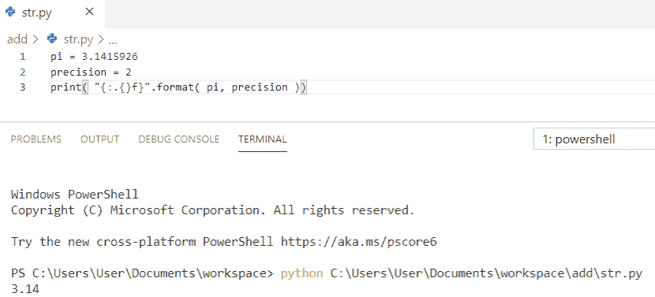
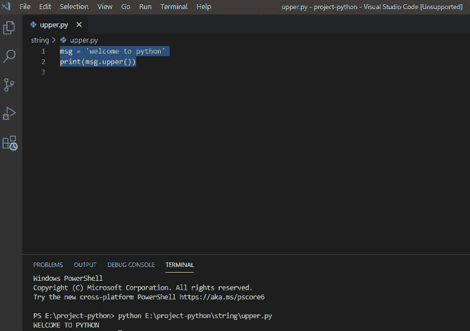

# Python 字符串格式化示例

> 原文：<https://pythonguides.com/python-string-formatting/>

[](https://sharepointsky.teachable.com/p/python-and-machine-learning-training-course)

在本 [python 教程中，](https://pythonguides.com/python-hello-world-program/)我们将讨论 **Python 字符串格式化**，我们还将涵盖以下主题:

*   Python 字符串格式
*   Python 字符串格式化多个值
*   Python 字符串格式填充
*   右对齐的 Python 字符串格式填充
*   居中对齐的 Python 字符串格式填充
*   使用中心对齐和*填充字符的 Python 字符串格式填充
*   使用 f 进行 Python 字符串格式化
*   Python 字符串格式化浮点
*   Python 字符串格式方法
*   Python 字符串格式化小数位
*   Python 字符串格式整数
*   Python 字符串大写
*   Python 将字符串中的每个单词大写

目录

[](#)

*   [Python 字符串格式化](#Python_string_formatting "Python string formatting")
*   [Python 字符串格式化多值](#Python_string_formatting_multiple_values "Python string formatting multiple values")
*   [Python 字符串格式填充](#Python_string_formatting_padding "Python string formatting padding")
*   [Python 字符串格式填充，右对齐](#Python_string_formatting_padding_with_right_alignment "Python string formatting padding with right alignment")
*   [居中对齐的 Python 字符串格式填充](#Python_string_formatting_padding_with_center_alignment "Python string formatting padding with center alignment")
*   [Python 字符串格式用中心对齐和*填充字符填充](#Python_string_formatting_padding_with_center_alignment_and_padding_character "Python string formatting padding with center alignment and * padding character")
*   [使用 f 的 Python 字符串格式化](#Python_string_formatting_using_f "Python string formatting using f")
*   [Python 字符串格式化浮点](#Python_string_formatting_float "Python string formatting float")
*   [Python 字符串格式方法](#Python_string_format_methods "Python string format methods")
*   [Python 字符串格式化小数位](#Python_string_formatting_decimal_places "Python string formatting decimal places")
*   [Python 字符串格式化整数](#Python_string_formatting_integer "Python string formatting integer")
*   [Python 字符串大写](#Python_string_uppercase "Python string uppercase")
*   [Python 将字符串中的每个单词大写](#Python_capitalize_each_word_in_a_string "Python capitalize each word in a string")

## Python 字符串格式化

在这里，我们将看到 **python 字符串格式化**的一个例子。

Python string format() 方法允许格式化字符串的选定部分。我们使用 format 来确保字符串按预期显示。

为了控制这样的值，在文本中添加一个占位符**花括号{}** ，然后通过 `format()` 方法运行这些值。

**举例:**

```py
roll = 101
msg = "The roll start from {} "
print(msg.format(roll))
```

为了得到输出，我使用了 `print(msg.format(roll))` 。您可以参考下面的输出截图。


Python string formatting

这就是我们如何在 Python 中进行**字符串格式化。**

你可能也喜欢，[python 中如何串联字符串](https://pythonguides.com/concatenate-strings-in-python/)？以及[如何在 Python 中添加两个变量](https://pythonguides.com/add-two-variables-in-python/)。

## Python 字符串格式化多值

现在，我们将看到 **python 字符串格式化多个值**。

在本例中，我们将使用**多个值**以便将多个值添加到 `format()` 方法中。我们只需在文本中添加一个占位符**花括号{}** ，然后通过 `format()` 方法运行这些值。

**举例:**

```py
roll = 1
sub_code = 121
msg = "The roll {} has taken subject math and the code is {}."
print(msg.format(roll, sub_code))
```

为了得到输出，我使用了 **print(msg.format(roll，sub_code))** 。您可以参考下面的输出截图。


Python string formatting multiple values

你也可能喜欢[如何通过例子](https://pythonguides.com/python-string-to-byte-array/)将 Python 字符串转换成字节数组。

## Python 字符串格式填充

让我们看看 **python 字符串格式填充**。

**Python 字符串**可以用类似于 `format()` 的方式格式化。这里，完成了左对齐的字符串填充，并且可以将值填充到特定的长度。填充字符可以是空格或指定字符。

**举例:**

```py
print("{:10}".format("Welcome"))
```

为了获得输出，我使用了**print(“{:10 }”。格式("欢迎")**。Python 中**字符串格式填充的输出可以参考下面的截图。**


Python string formatting padding

你可能也喜欢，[如何在 Python 中把一个字符串转换成日期时间](https://pythonguides.com/convert-a-string-to-datetime-in-python/)

## Python 字符串格式填充，右对齐

现在，我们将看到 **python 字符串格式填充右对齐**。

在使用右对齐的 **python 字符串格式填充中，**我们将使用 **" > "** 来填充剩余位置右侧的字符串。

**举例:**

```py
print("{:>8}".format("Hello"))
```

为了得到输出，我使用了**print(“{:>8 }”。格式("你好")**。您可以参考下面的输出截图。


Python string formatting padding with right alignment

你可能喜欢用 [Python 生成随机数和字符串](https://pythonguides.com/python-generate-random-number/)。

## 居中对齐的 Python 字符串格式填充

在这里，我们将看到 **python 字符串格式填充与中心对齐**。

为了得到中心对齐的**字符串格式填充**,我们将使用**“^”**为中心对齐到剩余的地方。

**举例:**

```py
print("{:^10}".format("Python"))
```

为了得到输出，我使用了 **print("{:^10}".格式(" Python ")**。您可以参考下面的输出截图。


Python string formatting padding with center alignment

这就是如何使用居中对齐来填充 Python 字符串格式。

查看 Python 中的[字符串方法和示例](https://pythonguides.com/string-methods-in-python/)。

## Python 字符串格式用中心对齐和*填充字符填充

现在，我们将看到用中心对齐和*填充字符填充的**字符串格式。**

为了得到带有中心对齐 **和*填充字符**的**字符串格式填充，我们将使用 `"*"` 填充剩余的空间，而 **"^"** 用于中心对齐。**

**举例:**

```py
print("{:*^10}".format("Guides"))
```

为了得到输出，我使用了 **print("{:*^10}".格式("指南")**。您可以参考下面的输出截图。


Python string formatting padding with center alignment and * padding character

签出 [Python 将字符串写入文件](https://pythonguides.com/python-write-string-to-a-file/)。

## 使用 f 的 Python 字符串格式化

这里，我们将看到使用 f 的 **python 字符串格式化。**

为了使用 f 创建一个**字符串格式，我们在字符串前面加上了字母**“f”**。字符串本身可以像我们使用 `str.format()` 一样格式化。F 字符串是一种方便的格式化方式。**

**举例:**

```py
value = 'Python'
print(f"Hello, Welcome to {value} tutorial {value} is very interesting.")
```

为了得到输出，我使用了 **print(f“你好，欢迎来到{value}教程{value}非常有趣。”)**。您可以参考下面的输出截图。


Python string formatting using f

这是如何在 Python 中使用 f 进行字符串格式化。

检查[从字符串 Python](https://pythonguides.com/remove-character-from-string-python/) 中移除字符。

## Python 字符串格式化浮点

现在，我们将看到 **python 字符串格式化浮动**。

在 **python 字符串格式化浮动中，**我们使用了 **"{ }"** 作为格式化括号内的变量。在这个例子中，精度变量控制显示多少个小数位。

```py
pi = 3.1415926
precision = 2
print( "{:.{}f}".format( pi, precision ))
```

为了获得输出，我使用了 **print("{:。{}f}”。格式(pi，precision)** )。您可以参考下面的输出截图。



Python string formatting float

查看[如何处理索引错误:Python 中的字符串索引超出范围](https://pythonguides.com/indexerror-string-index-out-of-range-python/)

## Python 字符串格式方法

现在，我们将看到 **python 字符串格式方法**。

`format()` 方法格式化指定的值，并将它们插入字符串占位符中。占位符用**花括号“{ }”**定义，价格固定，有两位小数格式。

```py
val = "Its only {price:.2f} Rupees!"
print(val.format(price = 84))
```

为了得到输出，我使用了`print(val . format(price = 84)`)。您可以参考下面的输出截图。


Python string format methods

阅读:[如何在 Python 中求一个字符串的长度](https://pythonguides.com/find-the-length-of-a-string-in-python/)

## Python 字符串格式化小数位

在这里，我们将看到 **python 字符串格式化小数位**。

在 **python 字符串格式化小数位**中，我们使用了 **"{:.3f}"** 将一个浮点数格式化为 3 个小数位，通过使用 `format()` 它将被格式化。

**举例:**

```py
print("{:.3f}".format(2.123456))
```

为了获得输出，我使用了**print(“{:. 3f }”。格式(2.123456)** )。您可以参考下面的输出截图。


Python string formatting decimal places

这就是如何在 Python 中进行**字符串格式化小数位。**

查看 [Python 将列表转换为字符串](https://pythonguides.com/python-convert-list-to-string/)。

## Python 字符串格式化整数

现在，我们将看到 **python 字符串格式化整数**。

在**字符串格式化整数**中，我们将使用用于整数参数的**“d”**。占位符通过使用**花括号“{ }”**来定义。

**举例:**

```py
print("My marks is {:d} in maths".format(80))
```

为了得到输出，我使用了 **print("我的数学成绩是{:d}"。格式(80)** )。您可以参考下面的输出截图。


Python string formatting integer

## Python 字符串大写

这里是另一个 **Python 字符串格式化**的例子。

*   使用 Python string `upper()` 方法，我们可以将字符串中所有小写字符转换成大写。
*   为了将任何字符串转换成大写，我们在 Python 中内置了 upper()方法，该方法将小写转换成大写。
*   该函数可以接受任何小写字符串作为输入，并且可以产生大写字符串作为输出。

**举例:**

*   首先，我们需要取一个字符串值。在下面的 python 代码中，你可以看到，我已经把值取为**“欢迎使用 python”**。
*   现在打印 `"msg.upper()"` ，它将以大写字母返回字符串。

**Python 字符串大写代码**

下面是字符串大写的 python 代码。

```py
msg = "welcome to python"
print(msg.upper())
```

*   在编写完上面的 Python 代码(字符串大写)后，您将打印出 `"msg.uppercase()"` ，然后输出将显示为**"欢迎使用 PYTHON"** ，它将返回一个大写字符串作为输出。另外，你可以参考下面的截图。



Python string uppercase

这是如何在 Python 中将一个字符串转换成大写的。

阅读:[如何在 Python 中删除字符串的第一个字符](https://pythonguides.com/remove-first-character-from-a-string-in-python/)

## Python 将字符串中的每个单词大写

在 python 中，为了大写字符串中的每个单词，我们将使用内置方法 `upper()` 来大写字符串中的所有字母。

**举例:**

```py
my_string = 'python guides'
print(my_string.upper())
```

写完上面的 python 代码(Python 将字符串中的每个单词大写)，你将打印出 `"my_string.upper()"` ，然后输出将出现 `" PYTHON GUIDES "` 。这里，string.upper()用于大写字符串中的每个单词。另外，你可以参考下面的截图，将字符串中的每个单词大写。


Python capitalize each word in a string

这是另一个 Python 字符串格式化的例子，在这里我们看到了**如何在 Python** 中大写字符串中的每个单词。

您可能会喜欢以下 Python 教程:

*   [如何在 python 中把整数转换成字符串](https://pythonguides.com/convert-an-integer-to-string-in-python/)
*   [Python 3 string replace()方法示例](https://pythonguides.com/python-3-string-replace/)
*   [Python 比较字符串](https://pythonguides.com/python-compare-strings/)
*   [无法将字符串转换为浮点 Python](https://pythonguides.com/could-not-convert-string-to-float-python/)
*   [在 Python 中切片字符串+示例](https://pythonguides.com/slicing-string-in-python/)

在本教程中，我们已经学习了 **Python 字符串格式化**，并且我们已经涵盖了以下主题:

*   Python 字符串格式
*   Python 字符串格式化多个值
*   Python 字符串格式填充
*   Python 字符串格式填充，左对齐
*   右对齐的 Python 字符串格式填充
*   居中对齐的 Python 字符串格式填充
*   使用中心对齐和*填充字符的 Python 字符串格式填充
*   使用 f 进行 Python 字符串格式化
*   Python 字符串格式化浮点
*   Python 字符串格式方法
*   Python 字符串格式化小数位
*   Python 字符串格式整数
*   Python 字符串大写
*   Python 将字符串中的每个单词大写

[Bijay Kumar](https://pythonguides.com/author/fewlines4biju/)

Python 是美国最流行的语言之一。我从事 Python 工作已经有很长时间了，我在与 Tkinter、Pandas、NumPy、Turtle、Django、Matplotlib、Tensorflow、Scipy、Scikit-Learn 等各种库合作方面拥有专业知识。我有与美国、加拿大、英国、澳大利亚、新西兰等国家的各种客户合作的经验。查看我的个人资料。

[enjoysharepoint.com/](https://enjoysharepoint.com/)[](https://www.facebook.com/fewlines4biju "Facebook")[](https://www.linkedin.com/in/fewlines4biju/ "Linkedin")[](https://twitter.com/fewlines4biju "Twitter")