# 如何用例子将 Python 字符串转换成字节数组

> 原文：<https://pythonguides.com/python-string-to-byte-array/>

[](https://sharepointsky.teachable.com/p/python-and-machine-learning-training-course)

在这个 [python 教程](https://pythonguides.com/python-hello-world-program/)中，你将了解到 **python 字符串到字节数组。**此外，我们将检查:

*   Python 字符串到字节数组编码
*   Python 字符串到字节数组 UTF-8
*   Python 字符串到字节数组 UTF-16
*   Python 字符串到字节数组十六进制
*   Python base64 字符串到字节数组
*   Python 二进制字符串到字节数组
*   Python JSON 字符串到字节数组
*   Python 字符串转换为不带 b 的字节数组
*   Python 十六进制字符串到字节数组
*   Python 字符串到字节数组 ASCII
*   Python 2.7 字符串到字节类型

目录

[](#)

*   [Python 字符串到字节数组](#Python_string_to_byte_array "Python string to byte array")
*   [Python 字符串到字节数组编码](#Python_string_to_byte_array_encoding "Python string to byte array encoding")
*   [Python 字符串到字节数组 UTF-8](#Python_string_to_byte_array_UTF-8 "Python string to byte array UTF-8")
*   [Python 字符串到字节数组 UTF-16](#Python_string_to_byte_array_UTF-16 "Python string to byte array UTF-16")
*   [Python 字符串到字节数组十六进制](#Python_string_to_byte_array_hex "Python string to byte array hex")
*   [Python base64 字符串到字节数组](#Python_base64_string_to_byte_array "Python base64 string to byte array")
*   [Python 二进制字符串到字节数组](#Python_binary_string_to_byte_array "Python binary string to byte array")
*   [Python JSON 字符串到字节数组](#Python_JSON_string_to_byte_array "Python JSON string to byte array")
*   [Python 字符串到不带 b 的字节数组](#Python_string_to_a_byte_array_without_b "Python string to a byte array without b")
*   [Python 十六进制字符串到字节数组](#Python_hex_string_to_byte_array "Python hex string to byte array")
*   [Python 字符串到字节数组 ASCII 码](#Python_string_to_byte_array_ASCII "Python string to byte array ASCII")
*   [Python 2.7 字符串到字节类型](#Python_27_string_to_byte_type "Python 2.7 string to byte type")

## Python 字符串到字节数组

现在，我们可以看到**如何在 python 中将字符串转换成字节数组**。

*   在这个例子中，我将**字符串作为“python 指南”**，为了将该字符串转换为字节，我使用了 **new_string = bytes(string，" ascii")** 。
*   `bytearray()` 方法返回一个字节数组对象。

示例:

```py
string = "python guides"
new_string = bytes(string,"ascii")
print(new_string)
```

为了打印这个字节，我使用了 `print(new_string)` 。在下面的屏幕截图中，您可以在输出中看到一个转换后的字符串。

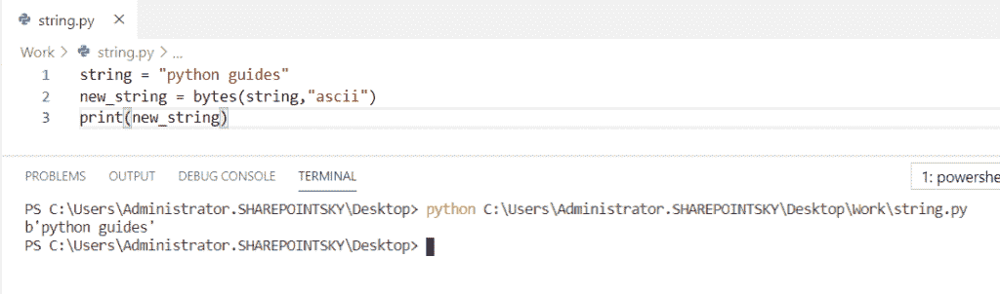

Python string to byte array

*   [Python 数组与示例](https://pythonguides.com/python-array/)
*   [在 Python 中创建一个空数组](https://pythonguides.com/create-an-empty-array-in-python/)

## Python 字符串到字节数组编码

在这里，我们可以看到**如何通过在 python 中编码**将字符串转换为字节数组。

在这个例子中，我将一个**字符串作为“python guides”**，并通过使用 **new_string = string.encode()将其编码成一个字节数组。**`encode()`方法用于对字符串进行编码。

示例:

```py
string = "python guides"
new_string = string.encode()
print(new_string)
```

为了打印编码后的字符串，我使用了 **print(new_string)。**你可以参考下面的输出截图。

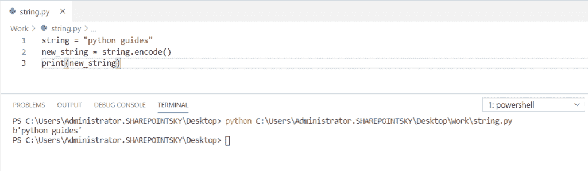

Python string to byte array encoding

## Python 字符串到字节数组 UTF-8

现在，我们可以看到**如何在 python 中将字符串转换成字节数组 utf-8**

在这个例子中，我将一个**字符串作为“Python 指南”。**为了将字符串转换成 UTF-8，我使用了 **newstring = bytes(string，' utf-8')** 。 `bytearray()` 方法返回字节数组对象。

示例:

```py
string = "Python guides."
newstring = bytes(string, 'utf-8')
print(newstring)
```

为了打印转换后的字符串，我使用了 `print(newstring)` 。下面的截图显示了输出。

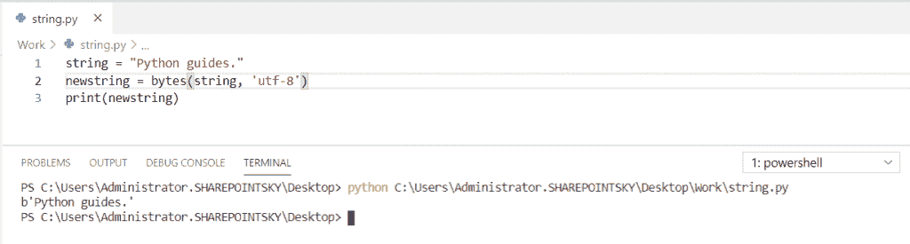

Python string to byte array UTF

阅读: [Python NumPy concatenate](https://pythonguides.com/python-numpy-concatenate/)

## Python 字符串到字节数组 UTF-16

在这里，我们可以看到**如何在 python 中将字符串转换成字节数组 UTF-16**

*   在这个例子中，我将一个**字符串作为“Python 指南”**。将字符串转换为 UTF-16。我用过 **newstring = bytes(string，' utf-16')** 。 `bytearray()` 方法返回字节数组对象。

示例:

```py
string = "Python guides."
newstring = bytes(string, 'utf-16')
print(newstring)
```

为了打印转换后的字符串，我使用了 `print(newstring)` 。您可以在下面的屏幕截图中看到 utf-16 格式的字符串输出。

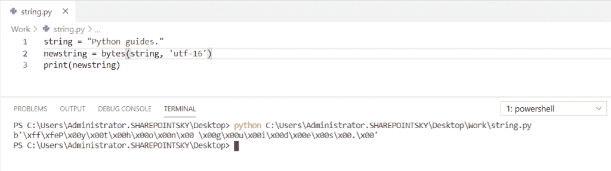

Python string to byte array UTF-16

## Python 字符串到字节数组十六进制

让我们看看**如何在 python 中将字符串转换成十六进制字节数组**

*   在这个例子中，我将一个字符串作为 `string = "AB CD EF"` 来将字符串转换为十六进制字节数组，我使用了`new string = bytearray . from hex(string)`。
*   这个方法返回一个包含十六进制数字的字符串。

示例:

```py
string = "AB CD EF"
newstring = bytearray.fromhex(string)
print(newstring)
```

为了将字符串打印成十六进制字节数组，我使用了 `print(newstring)` 。您可以参考下面的输出截图。

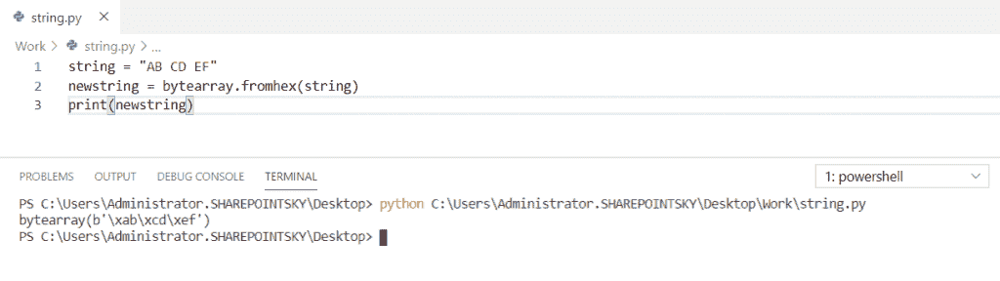

Python string to byte array hex

*   [如何在 Python 中创建字符串](https://pythonguides.com/create-a-string-in-python/)
*   [如何在 python 中使用正则表达式拆分字符串](https://pythonguides.com/python-split-string-regex/)
*   [如何在 python 中连接字符串](https://pythonguides.com/concatenate-strings-in-python/)
*   [如何在 python 中把整数转换成字符串](https://pythonguides.com/convert-an-integer-to-string-in-python/)
*   [Python 将列表转换成字符串](https://pythonguides.com/python-convert-list-to-string/)

## Python base64 字符串到字节数组

在这里，我们可以看到**如何在 python 中将 base64 字符串转换成字节数组**

*   在这个例子中，我导入了一个名为 `base64` 的模块。该模块用于将**二进制数据转换为 ASCII** 字符。
*   要解码字符串，我们必须使用`string = base64 . b 64 decode(" python guides ")`。

示例:

```py
import base64
string = base64.b64decode("Pythonguides")
print(string)
```

要打印编码后的字符串，我们必须使用 `print(string)` 。您可以参考下面的输出截图。

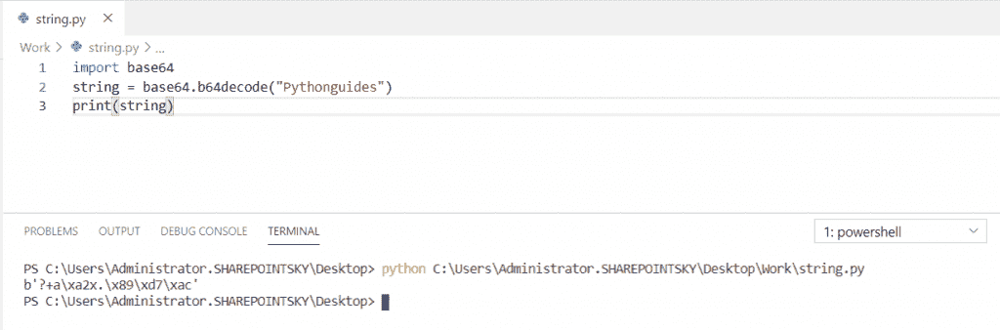

Python base64 string to byte array

## Python 二进制字符串到字节数组

现在，我们可以**如何在 python 中将二进制字符串转换成字节数组**

*   在这个例子中，我取了一个二进制字符串作为`string = " 11000010110001001100011 "`。将二进制字符串转换为字节数组。
*   我用过 **new_string = bytearray(string，“ascii”)**。 `bytearray()` 方法返回字节数组对象。

示例:

```py
string = "11000010110001001100011"
new_string = bytearray(string,"ascii")
print(new_string)
```

为了打印转换后的字符串，我使用了 `print(new_string)` 。下面的截图显示了输出。

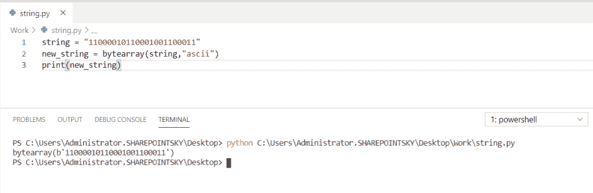

Python binary string to byte array

阅读: [Python NumPy linspace](https://pythonguides.com/python-numpy-linspace/)

## Python JSON 字符串到字节数组

在这里，我们可以看到**如何在 python 中将 JSON 字符串转换成字节数组**

*   在这个例子中，我导入了一个名为 JSON 的模块。JSON 模块提供了类似于 pickle 的 API，用于在内存中进行转换。
*   JSON 字符串类似于 javascript 对象。JSON 中的密钥必须是带双引号(" ")的字符串。
*   **json_string = '{"Name": "Kushi "，" subjects": ["english "，" maths"]} '就是 json 字符串**。
*   `bytearray()` 方法用于将 JSON 字符串转换为 bytearray 字符串， `bytearray()` 方法返回字节数组对象。

示例:

```py
import json
json_string = '{"Name": "Kushi", "subjects": ["english", "maths"]}'
new_string = bytearray(json_string,"ansi")
print(new_string)
```

为了打印转换后的字符串，我使用了 `print(new_string)` 。在下面的截图中，你可以看到 json 字符串转换成 bytearray 的输出。

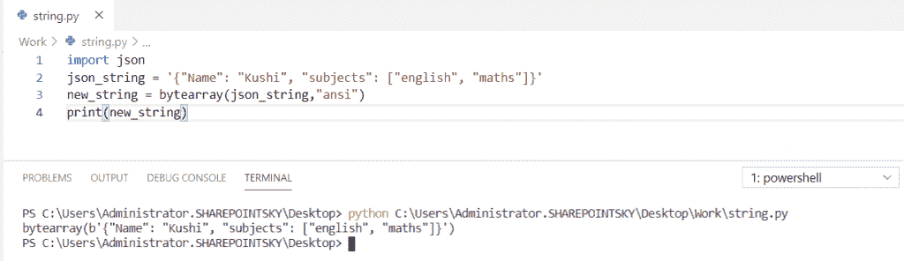

Python JSON string to byte array

*   [在 Python 中使用 JSON 数据](https://pythonguides.com/json-data-in-python/)

## Python 字符串到不带 b 的字节数组

在这里，我们可以**在 python 中如何在没有 b** 的情况下将字符串转换成字节数组

在这个例子中，我将一个字符串作为包含一个字节数组的**b‘python guides’**，然后对该字符串进行解码，以打印不包含 b 的字节数组。为了解码该字符串，我使用了`new string = string . decode()`。

示例:

```py
string = b'python guides'
print(string)
newstring = string.decode()
print(newstring) 
```

为了打印不带 b 的字符串，我使用了 `print(newstring)` 。您可以参考下面的输出截图。

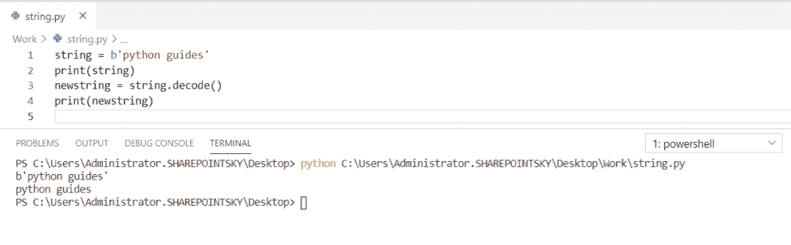

Python string to a byte array without b

## Python 十六进制字符串到字节数组

现在，我们可以看到**如何在 python 中将十六进制字符串转换成字节数组**

在这个例子中，我取了一个 hex_string = "1A ",为了将这个字符串转换成 bytearray，我使用了`new string = bytearray . from hex(hexa _ string)`。 `bytearray.fromhex()` 方法返回一个包含十六进制数字的必需字符串。

示例:

```py
hexa_string = "1A"
newstring = bytearray.fromhex(hexa_string)
print(newstring)
```

为了打印转换成字节数组的十六进制字符串，我使用了 `print(newstring)` 。您可以参考下面的输出截图。

## Python 字符串到字节数组 ASCII 码

在这里，我们可以看到**如何在 python 中将 string 转换成 bytearray ASCII**

在这个例子中，我将一个字符串作为(' python guides ')，为了将该字符串转换为 bytearray ASCII，我使用了**string = bytes(str(' Python guides ')。编码(" ascii ")**。

示例:

```py
string = bytes(str('Python guides').encode("ascii"))
print(string)
```

为了打印转换后的字符串，我使用了 print(string)。您可以参考下面的输出截图

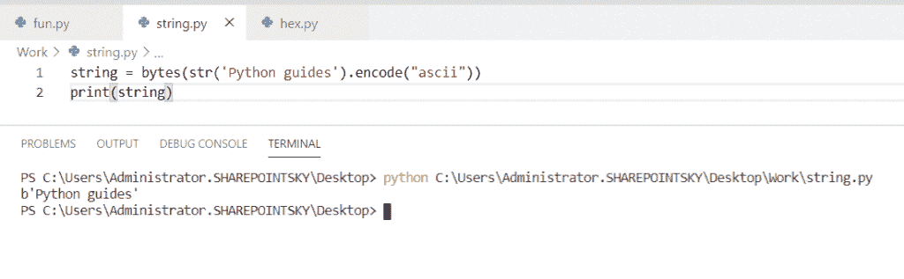

Python string to byte array ASCII

## Python 2.7 字符串到字节类型

在这里，我们可以看到**一个给定的字符串在 python 中属于哪种类型**

在这个例子中，我采用了三个参数 `a = "hi"` ， `b=bytes(0)` ， `c=25` ，为了获得给定字符串的类型，我使用了 `type()` 函数。 `type()` 函数返回作为参数传递的变量的类类型。

示例:

```py
a="hi"
print(type (a))
b=bytes(0)
print(type (b))
c=25
print(type (c))
```

为了获得输出，我使用了 `print(type (a))` 来获得第一个参数的类类型，并为第二个参数。我使用了 print(类型(b))，对于第三个参数，我使用了 print(类型(c))。您可以参考下面的输出截图。

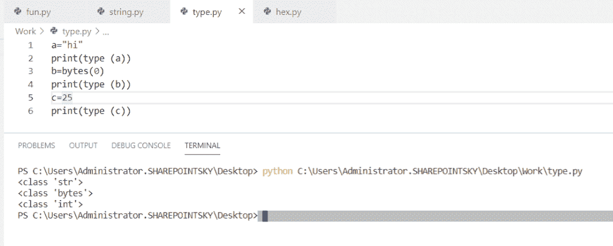

Python string to byte type

您可能会喜欢以下 Python 教程:

*   [Python 通过引用或值传递示例](https://pythonguides.com/python-pass-by-reference-or-value/)
*   [Python 从列表中选择+示例](https://pythonguides.com/python-select-from-a-list/)
*   [Python Tkinter Listbox–如何使用](https://pythonguides.com/python-tkinter-listbox/)
*   [Python 复制文件(示例)](https://pythonguides.com/python-copy-file/)
*   [Python 文件方法(附有用例子)](https://pythonguides.com/python-file-methods/)
*   [如何在 Python 中把字符串转换成日期时间](https://pythonguides.com/convert-a-string-to-datetime-in-python/)
*   [如何将 Python 角度转换为弧度](https://pythonguides.com/python-degrees-to-radians/)
*   [Python 将元组转换为列表](https://pythonguides.com/python-convert-tuple-to-list/)
*   [Python 将列表转换成字符串](https://pythonguides.com/python-convert-list-to-string/)
*   [Python 形状的一个数组](https://pythonguides.com/python-shape-of-an-array/)
*   [如何在 Python 中将 dictionary 转换成 JSON](https://pythonguides.com/convert-dictionary-to-json-python/)

在这个 Python 教程中，我们已经学习了将 **Python 字符串转换成字节数组**。此外，我们还讨论了以下主题:

*   如何在 Python 中将字符串转换成字节数组编码
*   Python 字符串到字节数组 UTF-8
*   Python 字符串到字节数组 UTF-16
*   Python 字符串到字节数组十六进制
*   Python base64 字符串到字节数组
*   Python 二进制字符串到字节数组
*   Python JSON 字符串到字节数组
*   Python 字符串转换为不带 b 的字节数组
*   Python 十六进制字符串到字节数组
*   Python 字符串到字节数组 ASCII
*   Python 2.7 字符串到字节类型

[Bijay Kumar](https://pythonguides.com/author/fewlines4biju/)

Python 是美国最流行的语言之一。我从事 Python 工作已经有很长时间了，我在与 Tkinter、Pandas、NumPy、Turtle、Django、Matplotlib、Tensorflow、Scipy、Scikit-Learn 等各种库合作方面拥有专业知识。我有与美国、加拿大、英国、澳大利亚、新西兰等国家的各种客户合作的经验。查看我的个人资料。

[enjoysharepoint.com/](https://enjoysharepoint.com/)[](https://www.facebook.com/fewlines4biju "Facebook")[](https://www.linkedin.com/in/fewlines4biju/ "Linkedin")[](https://twitter.com/fewlines4biju "Twitter")