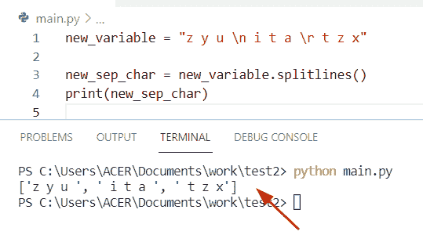

# Python 字符串列表–完整教程

> 原文：<https://pythonguides.com/python-string-to-list/>

[](https://sharepointsky.teachable.com/p/python-and-machine-learning-training-course)

在这个 [Python 教程](https://pythonguides.com/python-hello-world-program/)中，你将学习到关于 **Python 的字符串列表。**让我们看看**如何将 Python 字符串转换成列表**，我们还将介绍下面的例子:

*   Python 字符串到字符列表
*   Python 字符串到列表的转换
*   要用分隔符列出的 Python 字符串
*   单词列表的 Python 字符串
*   Python 字符串到列表拆分
*   Python 字符串到整型列表
*   要用空格列出的 Python 字符串
*   用于换行符列表的 Python 字符串
*   字典列表的 Python 字符串
*   Python 字符串到字符串列表
*   通过分隔符列出的 Python 字符串
*   Python 字符串到浮点列表
*   Python 字符串到列表数组
*   Python 字符串无需拆分即可列出
*   Python 向列表元素添加字符串
*   Python 字符串列表提取子串
*   Python 字符串拆分为列表正则表达式
*   Python 字符串列表移除重复项
*   Python 字符串列表索引
*   Python 字符串到元组列表
*   json 列表的 Python 字符串
*   用于列出移除空格的 Python 字符串
*   Python 字符串列表到数据帧
*   Python 字符串列表最大长度
*   Python 字符串列表到字节数组
*   Python 字符串与列表

目录

[](#)

*   [Python 字符串列表](#Python_string_to_list "Python string to list")
*   [在 Python 中把字符串转换成列表](#Convert_a_string_to_a_list_in_Python "Convert a string to a list in Python")
*   [Python 字符串到字符列表](#Python_string_to_list_of_characters "Python string to list of characters")
*   [检查如何将一个字符串转换成一个字符列表](#Check_how_to_convert_a_string_into_a_list_of_characters "Check how to convert a string into a list of characters")
*   [Python 字符串到列表的转换](#Python_string_to_list_conversion "Python string to list conversion")
*   [用分隔符列出的 Python 字符串](#Python_string_to_list_with_separator "Python string to list with separator")
*   [Python 字符串到单词列表](#Python_string_to_list_of_words "Python string to list of words")
*   [Python 字符串到列表的拆分](#Python_string_to_list_split "Python string to list split")
*   [Python 字符串到 int 列表](#Python_string_to_list_of_ints "Python string to list of ints")
*   [如何将字符串列表转换成整数](#How_to_convert_a_string_list_to_an_integer "How to convert a string list to an integer")
*   [Python 字符串以空格列出](#Python_string_to_list_with_spaces "Python string to list with spaces")
*   [如何将字符串转换成带空格的列表](#How_to_convert_a_string_to_a_list_with_spaces "How to convert a string to a list with spaces")
*   [Python 字符串列表换行符](#Python_string_to_list_newline "Python string to list newline")
*   使用换行符将字符串转换成列表——另一种方法
*   [Python 字符串到字典列表](#Python_string_to_list_of_dictionries "Python string to list of dictionries")
*   [Python 字符串到字符串列表](#Python_string_to_list_of_strings "Python string to list of strings")
*   [Python 字符串以分隔符](#Python_string_to_list_by_delimiter "Python string to list by delimiter")列出
*   [Python 字符串到浮点列表](#Python_string_to_list_of_floats "Python string to list of floats")
*   [另一个使用 list comprehension 和 eval()方法的例子](#Another_example_by_using_list_comprehension_and_eval_method "Another example by using list comprehension and eval() method")
*   [Python 字符串到列表数组](#Python_string_to_list_array "Python string to list array")
*   [Python 字符串到列表不拆分](#Python_string_to_list_without_split "Python string to list without split")
*   [Python 向列表元素添加字符串](#Python_add_string_to_list_elements "Python add string to list elements")
*   [Python 字符串列表提取子串](#Python_string_list_extract_substring "Python string list extract substring")
*   [Python 字符串拆分为列表正则表达式](#Python_string_split_to_list_regex "Python string split to list regex")
*   [Python 字符串列表删除重复项](#Python_string_list_remove_duplicates "Python string list remove duplicates")
*   [如何从列表中删除重复的字符串](#How_to_remove_duplicate_string_from_list "How to remove duplicate string from list")
*   [Python 字符串列表索引](#Python_string_list_index "Python string list index")
*   [Python 字符串到元组列表](#Python_string_to_list_of_tuples "Python string to list of tuples")
*   [Python 字符串到 json 列表](#Python_string_to_list_of_json "Python string to list of json")
*   [Python 字符串列表删除空格](#Python_string_to_list_remove_spaces "Python string to list remove spaces")
*   [Python 字符串列表到数据帧](#Python_string_list_to_dataframe "Python string list to dataframe")
*   [Python 字符串列表最大长度](#Python_string_list_max_length "Python string list max length")
*   [Python 字符串列表到字节数组](#Python_string_list_to_byte_array "Python string list to byte array")
*   [Python 字符串 vs 列表](#Python_string_vs_list "Python string vs list")

## Python 字符串列表

*   在这个程序中，我们将学习如何用 Python 将字符串转换成列表。
*   为了在 Python 中把一个字符串转换成一个列表，我们可以很容易地应用 T2 的 split()方法。这个方法将帮助用户在给定的分隔符处拆分一个字符串，并且它总是返回一个列表中的拆分字符串。
*   在 Python 字符串中，如果函数中没有将分隔符作为参数给出，或者默认情况下分隔符的值为 none，则应用不同的拆分算法。

**语法:**

下面是 `split()` 函数的语法

```py
String.split(separator,maxsplit)
```

*   它由几个参数组成
    *   **分隔符:**这是一个可选参数，用于拆分字符串，如果没有提供，空白将被视为分隔符。
    *   **Maxsplit:** 指定函数中需要多少次拆分。

**举例:**

让我们举个例子，检查一下**如何将一个字符串转换成一个列表**。

```py
new_str = "java is a best programming language"

new_lis = list(new_str.split(" ")) 
print("convert str to list:",new_lis) 
```

在上面的代码中，我们首先初始化一个字符串**‘new _ str’**，然后使用 `split()` 方法并传递空白作为分隔符，该分隔符拆分字符串中的单词，并将它们存储到列表中。

下面是以下代码的截图


Python string to list

阅读[从字符串 Python 中删除字符(35 个例子)](https://pythonguides.com/remove-character-from-string-python/)

## 在 Python 中把字符串转换成列表

通过使用 **Python list()函数**,我们可以执行这个特定的任务，这个方法获取可迭代的对象并将它们转换成列表。

下面是 Python 中要列出的字符串代码

```py
new_val = "john is a good boy"

new_out = list(new_val.strip(" "))
print(new_out)
```

在这个例子中，我们使用了 `strip()` 函数的概念，它将从字符串的开头和结尾删除空格。

下面是以下给定代码的执行过程


Python string to list

阅读[如何在 Python 中创建字符串](https://pythonguides.com/create-a-string-in-python/)

## Python 字符串到字符列表

*   让我们看看在 Python 中，如何通过使用内置的 `list()` 方法将一个字符串**转换成一个字符列表**。
*   在 Python 中, `list()` 构造函数直接从 iterable 对象生成一个列表，它总是返回一个字符串中所有可用字符的列表，在这个例子中，我们必须将一个字符串对象传递给 `list()` 方法。

**语法:**

下面是 list()方法的语法

```py
list(iterable)
```

*   它只包含一个参数
    *   `Iterable` :这个参数可以作为一个序列使用，也可以说是任何其他的 Iterable 对象。

**源代码:**

```py
give_str = 'Micheal'

new_val2 = list(give_str)
print(new_val2) 
```

在上面的代码中，我们已经获取了输入字符串**‘Micheal’**，现在我们使用 `list()` 构造函数，它将给出一个列表，其中包含单个字符【T4’‘M’，‘I’作为元素。

下面是以下给定代码的实现


Python string to list of characters

使用 if-else 阅读 [Python 列表理解](https://pythonguides.com/python-list-comprehension-using-if-else/)

## 检查如何将一个字符串转换成一个字符列表

通过使用 [Python list comprehension](https://pythonguides.com/python-list-comprehension/) 方法，我们可以将一个字符串转换成一个字符列表。在 Python 中，列表理解方法用于构建新列表。列表理解是一种基于现有列表定义和声明列表的简单方法。

下面是源代码:

```py
 str_new = 'Australia'

new_char = [i for i in str_new]
print(new_char) 
```

在上面的例子中，一个列表被分配给一个变量**‘str _ new’，**，这个列表存储了 iterable 对象的条目。之后，我们调用 print()语句来显示输出。

下面是以下给定代码的执行过程


Python string to list of characters

阅读 [Python 从字符串中移除子串+示例](https://pythonguides.com/python-remove-substring-from-a-string/)

## Python 字符串到列表的转换

*   让我们看看如何用 Python 将一个字符串转换成一个列表。
*   在这个例子中，我们使用了一个 `split()` 函数的概念，如果您想要将一个字符串拆分为列表，那么您不需要为 split 方法提供任何分隔符或分隔符。如果函数参数中没有给定分隔符，那么默认情况下它不取值。

**语法:**

下面是 split()函数的语法

```py
string.split(delimiter, maxsplit)
```

**举例:**

```py
pro_lang = "Python developer"

new_char = pro_lang.split()
print("Conversion string to list:",new_char)
```

下面是以下给定代码的输出


Python string to list conversion

阅读 [Python 3 的 string replace()方法](https://pythonguides.com/python-3-string-replace/)

## 用分隔符列出的 Python 字符串

*   在 **Python 中用分隔符**将一个字符串转换成一个列表，我们可以使用 **str。**方法拆分()。
*   在这个例子中，我们可以使用逗号分隔的字符串**’、**并将它们转换成一个字符列表。在 python 中， `split()` 函数基本上是用来根据分隔符将一个字符串拆分成一个列表。
*   这里我们提到了 `split()` 方法中的分隔符参数。

下面是源代码:

```py
stu_name = "oliva,Elijah,Potter"

new_lis = stu_name.split(",")
print(new_lis)
```

**输出:**


Python string to list with separator

阅读 [Python 比较字符串](https://pythonguides.com/python-compare-strings/)

## Python 字符串到单词列表

*   让我们看看**如何将一个字符串转换成一个单词列表在 Python** 中，解决这个问题最简单的方法是使用 `split()` 方法，这个方法会将一个字符串分解成一个列表，其中每个单词都是一个列表项。
*   在这个例子中，默认情况下，这个函数的分隔符是空白，我们必须拆分第一个索引元素。

**源代码:**

```py
def convert(Country_name):
    return (Country_name[0].split())

Country_name = ["Australia Germany"]
print(convert(Country_name)) 
```

在上面的代码中，我们首先定义了一个函数**‘convert’**，然后将 list**‘country _ name’**作为参数传递。现在创建一个列表并调用 `print()` 语句来显示结果。

下面是以下给定代码的执行过程


Python string to list of words

阅读 [Python 3 字符串方法示例](https://pythonguides.com/string-methods-in-python/)

## Python 字符串到列表的拆分

*   这里我们可以看到**如何使用 Python** 中的 split()方法将字符串转换成列表。
*   在 Python 中， `split()` 方法总是返回字符串中的单词列表，并且还将一个字符串分成一个列表。默认情况下，分隔符是空白字符，如空格、**' '、\n、**等。

**语法:**

下面是 `split()` 函数的语法

```py
string.split(separator,maxsplit)
```

**源代码:**

```py
new_str = 'John,micheal,George'

print(new_str.split('-'))
```

下面是以下给定代码的输出


Python string to list split

读取 [Python 在字符串](https://pythonguides.com/python-find-substring-in-string/)中查找子串

## Python 字符串到 int 列表

*   让我们看看**如何在 Python** 中将字符串列表转换成整数列表。
*   通过使用 list comprehension 方法，我们可以执行这个特定的任务，这个方法用于构建一个新的列表，其中每个列表元素都要迭代。

**举例:**

```py
val_lis = ['16', '87', '27', '19', '145']

new_char = [int(x) for x in val_lis]
print ("updated list is : ",new_char)
```

在上面的例子中，我们有一个 list **'val_lis'** ，然后应用内置函数 int，通过使用 list comprehension 方法得到一个整数列表。

下面是以下给定代码的实现


Python string to list of ints

## 如何将字符串列表转换成整数

通过使用 map 和 `split()` 函数我们可以解决这个问题，在 Python 中， `map()` 函数非常高效，并且容易将字符串列表转换为整数，这个方法总是返回一个迭代器，将字符串转换为整数列表。

**源代码:**

```py
new_char = "15 27 89"

val_list = new_char.split()
new_item = map(int, val_list)
d = list(new_item)
print(d)
```

下面是以下代码的截图


Python string to list of ints

读取[无法将字符串转换为浮点 Python](https://pythonguides.com/could-not-convert-string-to-float-python/)

## Python 字符串以空格列出

*   这里我们可以看到**如何在 Python** 中将一个字符串转换成一个带有空格的列表。
*   为了执行这个任务，我们可以使用函数 **join()。**在 Python 中， `join()` 函数是一个字符串方法，通过组合 iterable 对象的所有元素，并以**“”分隔，返回 str。**

**源代码:**

```py
def convert(new_name):

    return ' '.join(new_name)
new_name = ['Adam','Hayden','Chris']
print(convert(new_name))
```

下面是以下给定代码的输出


Python string to list with spaces

读取 Python 中的[切片字符串](https://pythonguides.com/slicing-string-in-python/)

## 如何将字符串转换成带空格的列表

通过使用**' * "**操作符，我们可以**将一个字符串转换成 Python 中带有空格的列表**。在这个例子中，我们首先声明一个列表**‘new _ val _ lis’**，并存储它们的整数值。

**源代码:**

```py
new_val_lis = [16,82,93,46]
print(*new_val_lis)

new_val = ['lily','rose','jasmine']
print(*new_val)
```

下面是以下代码的截图


Python string to list with spaces

在 Python 中读取[转换字符串为浮点数](https://pythonguides.com/convert-string-to-float-in-python/)

## Python 字符串列表换行符

*   这里我们可以看到**如何用 Python** 中的换行符分割一个字符串。为了完成这项任务，我们首先声明一个字符串中所有行的列表，这些行在行尾分开。
*   通过使用 **"\n "、" \r"** 特殊字符，我们可以分隔给定字符串中的字符，这些行边界被定义为字符串中的拆分。

**举例:**

```py
new_variable = "z y u \n i t a \r t z x"

new_sep_char = new_variable.splitlines()
print(new_sep_char) 
```

下面是以下给定代码的执行过程



Python string to list newline

阅读[追加到字符串 Python](https://pythonguides.com/append-to-a-string-python/)

## 使用换行符将字符串转换成列表——另一种方法

通过使用 `splitline()` 方法，我们可以解决这个问题，这个函数用于在 Python 中的线边界处分割线。

**源代码:**

```py
new_string1 = 'Oliva\nis\nagood\nprogrammer'

new_str2= new_string1.splitlines()
print(new_str2)
```

下面是以下代码的截图


Python string to list newline

阅读[将字符串添加到 Python +示例列表中](https://pythonguides.com/add-string-to-list-python/)

## Python 字符串到字典列表

*   让我们看看**如何在 Python** 中将一个字符串转换成一个字典列表。
*   为了执行这个特定的任务，我们可以使用方法 **eval()。**这个方法检查数据类型，并以列表的形式返回结果。在 Python 中， `eval()` 是一个内置函数，它评估字符串并将它们转换成列表。

**源代码:**

```py
country_str = "[{'australia' : 15, 'England' : 19}, {'Germany' : 27, 'Europe' : 37}]"

new_output = list(eval(country_str))
print(new_output) 
```

在上面的例子中，我们首先初始化一个字符串，然后使用 `eval()` 方法来转换字典列表。

下面是以下给定代码的实现


Python string to list of dictionaries

阅读 [Python 程序反转字符串示例](https://pythonguides.com/python-program-to-reverse-a-string/)

## Python 字符串到字符串列表

*   在 Python 中，要将字符串转换成字符串列表，我们可以使用 `split()` 函数，这个方法将帮助用户将一个字符串分解成一个列表，其中每个单词都是一个列表项。

**举例:**

```py
pro_sting =" Mongodb sql java"

print("original str: ",pro_sting) 
print("Convert string to list of str :",pro_sting.split()) 
```

在上面的代码中，我们首先考虑一个字符串，**‘pro _ sting’，**，然后应用 `split()` 函数。它用于在给定的分隔符上将一个字符串拆分成一个列表。在这个例子中，我们没有提到分隔符参数是一个 `split()` 函数。

下面是以下给定代码的输出


Python string to list of strings

阅读 [Python 字符串格式化示例](https://pythonguides.com/python-string-formatting/)

## Python 字符串以分隔符列出

*   在这里，我们可以看到如何使用 Python 中的分隔符**将字符串转换成列表。**
*   默认情况下，分隔符使用空白并分隔单词，但是在这个例子中，我们提到了在 `split()` 函数中使用**、**作为分隔符。

**源代码:**

```py
alpha_str = 'o,q,e,x,c'

new_list = alpha_str.split(",")
print (new_list)
```

在上面的代码中，我们首先考虑一个字符串‘alpha _ str ’,并在单引号**中为它们指定字符。**现在我们可以使用 `split()` 函数并传递分隔符'，'作为参数。

下面是以下给定代码的输出


Python string to list by a delimiter

阅读[如何在 python 中连接字符串](https://pythonguides.com/concatenate-strings-in-python/)

## Python 字符串到浮点列表

*   通过使用 map 和 `split()` 函数，我们可以执行这项任务，在 Python 中， `map()` 函数非常有效，可以轻松地将字符串列表转换为浮点数，该方法总是返回一个迭代器，将字符串转换为浮点数列表。

**源代码:**

```py
flo_str = "31.9 23.4 118.3"

new_val_lis = flo_str.split()
new_item = map(float, new_val_lis)
z = list(new_item)
print("Convert string to float list:",z)
```

在这个例子中，我们已经创建了一个字符串**‘flo _ str’**，并为它们分配了浮点值。现在，通过使用 `map()` 函数，我们将浮点数据类型作为参数传递，并将它们存储到一个**‘new _ item’**变量中。

**输出:**


Python string to list of floats

阅读[如何将 Python 字符串转换成字节数组并举例](https://pythonguides.com/python-string-to-byte-array/)

## 另一个使用 list comprehension 和 eval()方法的例子

*   还可以使用 Python 内置函数 `eval()` 和 list comprehension 将字符串转换成浮点数列表。
*   在 Python 中，list comprehension 方法从字符串等其他可迭代对象中声明新的列表，而 `eval()` 方法解析表达式参数，并将算术表达式作为字符串进行检查。

**举例:**

```py
i = ["4.2", "85.1", "92.5"]

new_float_value = [eval(z) for z in i]
print(new_float_value)
```

下面是以下代码的截图


Python string to list of floats

通过使用 for 循环和 split()方法，我们可以在 Python 中将一个字符串转换成一个浮点列表

**源代码:**

```py
new_floa_str = "76.4 35.8 167.9"

emp_lis = []
for i in new_floa_str.split():
  emp_lis.append(float(i))

print(emp_lis)
```

在这个例子中，我们在字符串中按空格创建了一个条目列表，我们可以使用 `split()` 和 use for 循环来迭代给定列表中的每个条目。之后，使用 float 数据类型将每一项转换成浮点数。

**截图:**


Python string to list of floats

阅读[如何用 Python 将字符串转换成日期时间](https://pythonguides.com/convert-a-string-to-datetime-in-python/)

## Python 字符串到列表数组

*   让我们看看**如何在 Python** 中将字符串转换成数组。
*   为此，我们可以使用 `split()` 方法，该方法将帮助用户将元素单独拆分成列表项。在 `split()` 方法中，您可以指定分隔符，但是在本例中，默认情况下，分隔符是空白。

**语法:**

下面是 `split()` 方法的语法

```py
String.split(separator, maxsplit)
```

**举例:**

让我们举一个例子，看看如何将字符串转换成数组

```py
new_alpha = "Python is a best programming language"

new_array = new_alpha.split()
print(new_array)
```

在上面的例子中，我们通过使用空白分隔符来分割字符串。

**输出:**


Python string to list array

读取 [Python 生成的随机数和字符串](https://pythonguides.com/python-generate-random-number/)

## Python 字符串到列表不拆分

*   这里我们可以看到如何在不使用 Python 中的 split()方法的情况下**将一个字符串转换成一个列表。**
*   在 Python 中打破一个字符串最简单的方法，我们可以使用列表切片方法。在列表切片方法中，第一个和最后一个索引由冒号分隔。如果我们没有为第一个索引设置值，那么默认情况下它取 0，最后一个索引被设置为列表的结束元素。

**语法:**

```py
list[start:stop:step]
```

**源代码:**

```py
new_character = "Micheal"

empty_list = []

empty_list[:] = new_character
print('Convert string to list:',empty_list)
```

下面是以下给定代码的执行过程


Python string to list without split

这是如何在不使用 Python 中的 split()函数的情况下将一个字符串拆分成一个列表。

读取 [Python 将字符串写入文件](https://pythonguides.com/python-write-string-to-a-file/)

## Python 向列表元素添加字符串

*   在 Python 中如何**将一个字符串添加到一个元素列表中，我们可以应用 Python 中的 append()函数**，这个方法会将新的项添加到一个列表的末尾。
*   在这个例子中，我们指定了一个条目来添加一个字符串到一个列表中，它不会返回一个新的列表，但是它会通过将元素插入到列表的最后来更新原来的列表。

**源代码:**

```py
new_str_lis = ['a','z','x','c']

add_str = 'uveq'
new_str_lis.append(add_str)
print("list after appending string is:",new_str_lis)
```

在上面的例子中，我们首先初始化了一个列表，并创建了一个需要添加到列表中的字符串‘add _ str’。将字符串添加到列表中我们可以使用方法 `append()` ，这个特殊的函数将一个字符串元素添加到列表的最后，而不改变字符列表。

下面是以下给定代码的执行过程


Python add a string to list elements

阅读[如何处理索引错误:Python 中的字符串索引超出范围](https://pythonguides.com/indexerror-string-index-out-of-range-python/)

## Python 字符串列表提取子串

*   这里我们可以看到**如何在 Python** 中从给定的字符串中提取子串。
*   在 Python 中，我们可以通过使用切片方法轻松解决这个任务。在这个程序中，我们要访问一个字符串的子字符串。子串是字符串中的一系列字符。
*   为了从 Python 的字符串中提取子串，我们可以应用字符串切片方法。

**语法:**

下面是 slice()方法的语法

```py
slice(start,stop,step)
```

注意:该方法由三个参数 **start、stop、step、**组成，切片对象被插入到字符串变量中。

**举例:**

```py
ext_str = "oplrtwe"

new_slic =slice(2)
new_slic2 = slice(3)
print(ext_str[new_slic])
print(ext_str[new_slic2])
```

在上面的例子中，我们在 `slice()` 构造函数中将单个整数值【T0’‘2’作为参数传递，索引值从 **0 开始。**

下面是以下给定代码的执行过程


Python string list extract substring

阅读[如何用 Python 将列表转换成字符串](https://pythonguides.com/python-convert-list-to-string/)

## Python 字符串拆分为列表正则表达式

*   这里我们可以看到**如何基于 Python** 中的 regex 模式来拆分字符串。
*   要通过正则表达式分割字符串，我们可以使用 **re。**方法拆分()。在 Python 中， `re.split()` 方法通过比较字符串中给定模式的所有情况来返回字符串列表。
*   正则表达式使用反斜杠字符 **('\')** ，但是在这个例子中我们使用下划线分隔符 **('_ ')。**

**语法:**

下面是 re.split()函数的语法

```py
re.split(pattern, string, maxsplit=0, flags=0)
```

*   这个方法由四个参数组成。
    *   **模式:**正则表达式模式用作分隔符，也用于拆分字符串。
    *   **String:** 要从字符串列表中拆分的变量或单词。
    *   **Maxsplit:** 可选参数，默认情况下，Maxsplit 参数为 0。
    *   **flags:** 可选标志，默认情况下，该方法不需要标志。

**源代码:**

```py
import re

nw_string1 = "13__oliva,,eljiah,_john_,Micheal"
reg_exp_str = re.split('[_,][_,]',nw_string1)
print(reg_exp_str)
```

首先在上面的代码中，我们创建了一个字符串 **'nw_string1'** ，在这个字符串中，每个单词都用下划线和逗号分隔。现在，这个分隔符 **('_')** 用于将字符串拆分成子字符串。

**输出:**


Python string split to list regex

阅读[如何用 python 将整数转换成字符串](https://pythonguides.com/convert-an-integer-to-string-in-python/)

## Python 字符串列表删除重复项

*   让我们看看**如何在 Python** 中从列表字符串中删除重复项。
*   您可以使用 `set()` 方法从列表中删除重复项。在 Python 中， `set()` 方法不能包含任何重复的值，这个方法将帮助用户转换成一个新的列表，其中重复的字符被删除。

让我们举一个例子，看看如何使用 `set()` 方法从列表中删除重复项。

**源代码:**

```py
new_str = ['a','g','j','i','u','p','u','i','z']

rem_new_dup = list(set(new_str))
print(rem_new_dup)
```

在上面的代码中，我们首先初始化一个名为**‘new _ str’**的列表，其中包含字母字符。现在我们声明一个变量 **'rem_new_dup'** ，它存储了 `set()` 函数，并将 **'new_str'** 变量作为一个参数。该过程从给定列表中删除所有重复项。

下面是以下给定代码的执行过程


Python string list remove duplicates

## 如何从列表中删除重复的字符串

*   还可以使用 Python 中的 dict.keys()方法**从列表中删除重复项。这个方法将总是返回一个唯一的值。在 Python 中，字典不能包含重复的值，这就是为什么我们在这个例子中使用 `dict.keys()` 方法。**
*   方法将帮助用户从列表中删除重复的单词或字符。

**语法:**

下面是 dict.keys()方法的语法

```py
dict.fromkeys(keys,value)
```

注意:这个方法由两个参数 key 和 value 组成。

**举例:**

```py
string =['john','micheal','australia','micheal','germany','george','john']

remove_dupli = list(dict.fromkeys(string))
print(remove_dupli)
```

在上面的代码中，我们首先创建了一个名为**‘string’**的字符串，它以字符串的形式包含了不同国家的名称。现在使用 `dict.fromkeys()` 方法从“字符串”变量初始化一个字典，然后使用 `list()` 构造函数将 dict 转换成一个列表。

**截图:**


Python string list remove duplicates

阅读[如何在 python 中使用正则表达式拆分字符串](https://pythonguides.com/python-split-string-regex/)

## Python 字符串列表索引

*   这里我们可以看到**如何在 Python** 中从包含字符串元素的列表中获取索引值。
*   通过使用 list `index()` 方法，我们可以执行这项任务，这是 Python 中的一个内置函数，它从列表的开头开始查找元素。

**语法:**

下面是 list index()方法的语法

```py
list.index(element, start, end)
```

*   它由几个参数组成
    *   **element:** 这个参数指定你要获取哪个元素的索引值。
    *   **Start:** 可选参数，默认为 0。
    *   **End:** 如果你想找到最后一个索引元素，那么你可以使用这个参数。

**举例:**

```py
student_name = ['George', 'James', 'Potter', 'Oliva']

new_ind = student_name.index('James')
print(new_ind)
```

在上面的例子中，我们创建了一个包含字符串的列表**‘student _ name’**。现在我想获取**‘詹姆士’**的索引值，为此我们应用了 `list.index()` 方法并调用 print 语句来显示索引值。

下面是以下给定代码的执行过程


Python string list index

阅读 [Python 元组字典](https://pythonguides.com/python-dictionary-of-tuples/)

## Python 字符串到元组列表

*   让我们看看如何在 Python 中将字符串转换成元组列表。
*   iter()+split()+next() 的组合可以用来执行这个特定的任务。在这个例子中，我们使用包含可数元素的迭代器对象，并使用 `next()` 方法从集合中获取下一个元素。

**源代码:**

```py
new_val_str = "Java is a core programming language"

new_out = iter(new_val_str.split())

lis_of_tup = [(new_element, next(new_out)) for new_element in new_out]
print(lis_of_tup)
```

下面是以下给定代码的输出


Python string to list of tuples

读取 [Python 元组排序列表](https://pythonguides.com/python-sort-list-of-tuples/)

## Python 字符串到 json 列表

*   这里我们可以看到**如何通过在 Python** 中导入 JSON 库将字符串转换成列表。
*   在这个程序**、**中，我们使用了 `JSON.loads()` 方法。在 Python 中，JSON.loads()方法将一个 `JSON` 字符串作为参数，它将返回 list-objects。

**源代码:**

```py
import json

first_list1 = "[45,7,8,2,3,4]"
new_output = json.loads(first_list1)
print ("Convert string to list:", new_output)
```


Python string to list of JSON

阅读 [Python 连接元组与示例](https://pythonguides.com/python-concatenate-tuples/)

## Python 字符串列表删除空格

*   为了去除列表中的空白，我们可以对 for 循环应用 **replace()和 append()** 方法。
*   在这个例子中，我们创建了一个列表 `"new_lis"` ，它包含字符串形式的元素。现在创建一个空列表，使用 for 循环方法迭代原始列表中的条目，然后使用 `replace()` 方法删除列表中的空白。

**举例:**

```py
new_lis = ['John', '   ', 'James ', 'Micheal', '  ', 'George']

new_output = []
for val in new_lis:
    m = val.replace(' ', '')
    new_output.append(m)

print(new_output)
```

**输出:**


Python string to list remove spaces

读取 [Python 方块一号](https://pythonguides.com/python-square-a-number/)

## Python 字符串列表到数据帧

*   让我们看看如何使用 Python 中的 data frame**将字符串转换成列表。为了完成这个任务，我们首先在其中导入一个熊猫库。**
*   在 Python 中，数据帧是行和列形式的数据结构。

下面是 CSV 文件的截图和代码

注意:这个代码是一个必须在 CSV 文件中使用的输入字符串

```py
student_id|batch
23|"[batch3,batch8]"
24|"[batch7,batch18,batch78]"
19|"[batch65,batch34]"
```


Python string to list CSV file

下面是字符串列表到数据帧的实现。

**源代码:**

```py
import pandas as pd

df = pd.read_csv('test1.csv', sep='|')
print(df)
```

在上面的例子中，我们首先导入一个 pandas 库，然后创建一个变量**‘df’**，其中我们使用了**‘read _ csv’**函数将 CSV 文件导入到 dataframe 格式。在这个方法中，我们给**分配了一个‘test . CSV’**文件作为参数。

**输出:**


Python string list to dataframe

阅读 [Python 打印无换行符](https://pythonguides.com/python-print-without-newline/)

## Python 字符串列表最大长度

*   让我们看看如何用 Python 在字符串列表中找到最大长度。
*   为了执行这个任务，我们可以使用内置的 max()函数，将 `"len"` 构造函数作为关键参数，这个方法返回最大值字符串。

**源代码:**

```py
original_lis1 = ['Micheal', 'john', 'george', 'potter', 'james']

new_output = max(original_lis1, key = len)
print(new_output) 
```

下面是以下给定代码的执行过程


Python string list max length

## Python 字符串列表到字节数组

*   要将一个字符串转换成一个字节数组，我们可以简单地将该字符串作为第一个输入，然后将编码 **'utf-8'** 作为第二个参数传递。
*   在这个例子中，我们首先创建了一个字符串“count_str ”,然后创建了一个变量**“new _ array”**,在这个变量中我们有 stores `bytes()` 方法，并将 string 指定为一个参数。

**源代码:**

```py
count_str = "Germany"

new_array = bytes(count_str, 'utf-8')

for new_byte in new_array:
    print("Convert string to byte:",new_byte)
```

下面是以下给定代码的实现


Python string list to byte array

阅读 [Python 命名约定](https://pythonguides.com/python-naming-conventions/)

## Python 字符串 vs 列表

*   在 Python 中，列表可以存储任何数据类型，而字符串只能由字符组成。
*   在 Python 中，list 可以通过方括号[]轻松声明，字符串是单引号或双引号内的字符序列。
*   在一个列表中，数据可以用一个**逗号(，)**分隔，数据可以是**整数、浮点数、**和字符串。而字符串是不可变的数据类型。

**举例:**

让我们举个例子，看看 Python 中字符串和列表的主要区别

```py
new_str = 'James' #create string

print("created string:",new_str)
my_new_list = [35,87,66] #create list

print("Created list:",my_new_list)
```

下面是以下给定代码的执行过程


Python string vs list

您可能会喜欢以下 Python 教程:

*   [语法错误标识符 python3 中的无效字符](https://pythonguides.com/syntaxerror-invalid-character-in-identifier-python3/)
*   [Python 加法示例](https://pythonguides.com/python-addition/)
*   [Python 中的乘法与例题](https://pythonguides.com/multiply-in-python/)

在本 Python 教程中，您将了解到 **Python 字符串列表。**让我们看看如何将 Python 字符串转换为列表，我们还将介绍以下示例:

*   Python 字符串到字符列表
*   Python 字符串到列表的转换
*   要用分隔符列出的 Python 字符串
*   单词列表的 Python 字符串
*   Python 字符串到列表拆分
*   Python 字符串到整型列表
*   要用空格列出的 Python 字符串
*   用于换行符列表的 Python 字符串
*   字典列表的 Python 字符串
*   Python 字符串到字符串列表
*   通过分隔符列出的 Python 字符串
*   Python 字符串到浮点列表
*   Python 字符串到列表数组
*   Python 字符串无需拆分即可列出
*   Python 向列表元素添加字符串
*   Python 字符串列表提取子串
*   Python 字符串拆分为列表正则表达式
*   Python 字符串列表移除重复项
*   Python 字符串列表索引
*   Python 字符串到元组列表
*   json 列表的 Python 字符串
*   用于列出移除空格的 Python 字符串
*   Python 字符串列表到数据帧
*   Python 字符串列表最大长度
*   Python 字符串列表到字节数组
*   Python 字符串与列表

[Bijay Kumar](https://pythonguides.com/author/fewlines4biju/)

Python 是美国最流行的语言之一。我从事 Python 工作已经有很长时间了，我在与 Tkinter、Pandas、NumPy、Turtle、Django、Matplotlib、Tensorflow、Scipy、Scikit-Learn 等各种库合作方面拥有专业知识。我有与美国、加拿大、英国、澳大利亚、新西兰等国家的各种客户合作的经验。查看我的个人资料。

[enjoysharepoint.com/](https://enjoysharepoint.com/)[](https://www.facebook.com/fewlines4biju "Facebook")[](https://www.linkedin.com/in/fewlines4biju/ "Linkedin")[](https://twitter.com/fewlines4biju "Twitter")