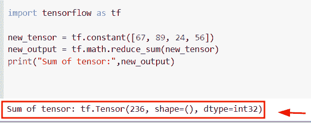
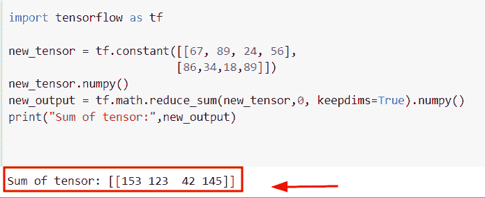
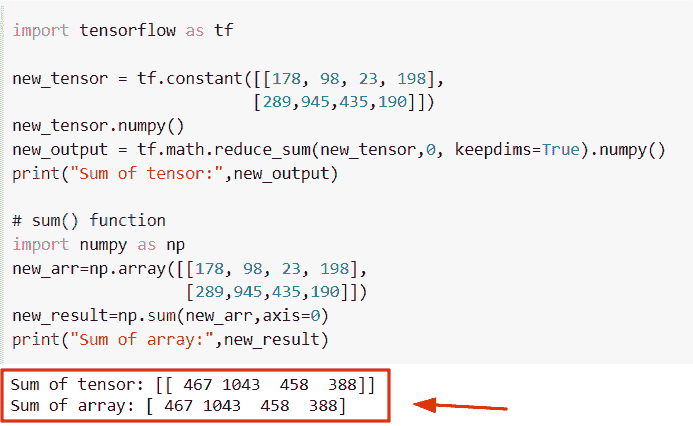
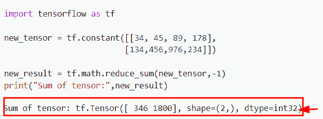
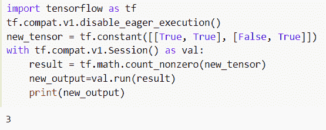
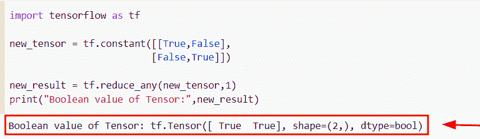
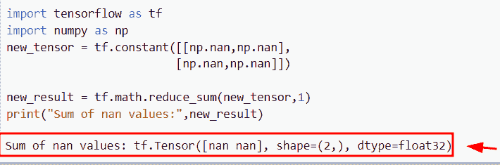
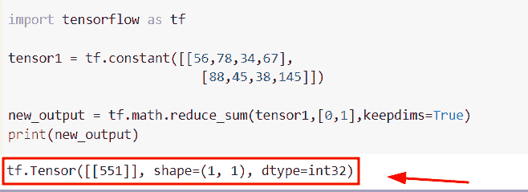
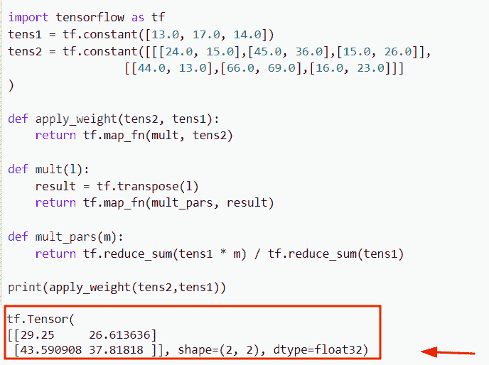
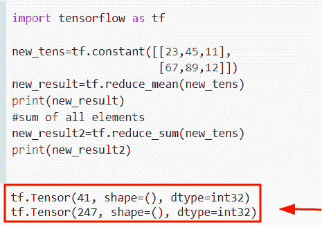

# Python TensorFlow reduce_sum

> 原文：<https://pythonguides.com/python-tensorflow-reduce_sum/>

[](https://sharepointsky.teachable.com/p/python-and-machine-learning-training-course)

在本 [Python 教程](https://pythonguides.com/learn-python/)中，我们将学习**如何在 Python** 中使用 TensorFlow reduce_sum()。此外，我们将涵盖以下主题。

*   张量流 reduce_sum keepdims
*   张量流 reduce_sum vs sum
*   张量流 reduce_sum 轴=-1
*   张量流减少计数布尔值
*   张量流减少 _ 总和 nan
*   张量流 reduce_sum 函数
*   张量流 reduce_sum 列表
*   张量流加权归约和
*   张量流 reduce_mean vs reduce_sum

目录

[](#)

*   [Python tensor flow reduce _ sum](#Python_TensorFlow_reduce_sum "Python TensorFlow reduce_sum")
*   [tensor flow reduce _ sum keepdims](#TensorFlow_reduce_sum_keepdims "TensorFlow reduce_sum keepdims")
*   [张量流 reduce_sum vs sum](#TensorFlow_reduce_sum_vs_sum "TensorFlow reduce_sum vs sum")
*   [tensor flow reduce _ sum axis =-1](#TensorFlow_reduce_sum_axis-1 "TensorFlow reduce_sum axis=-1")
*   [张量流减少计数布尔型](#TensorFlow_reduce_count_boolean "TensorFlow reduce count boolean")
    *   [检查 Tensorflow 中布尔和的另一个例子](#Another_example_to_check_the_sum_of_boolean_in_Tensorflow "Another example to check the sum of boolean in Tensorflow")
*   [张量流 reduce_sum nan](#TensorFlow_reduce_sum_nan "TensorFlow reduce_sum nan")
*   [张量流 reduce_sum 函数](#TensorFlow_reduce_sum_function "TensorFlow reduce_sum function")
*   [张量流加权归约和](#TensorFlow_weighted_reduce_sum "TensorFlow weighted reduce sum")
*   [tensor flow reduce _ mean vs reduce _ sum](#TensorFlow_reduce_mean_vs_reduce_sum "TensorFlow reduce_mean vs reduce_sum")

## Python tensor flow reduce _ sum

*   在本节中，我们将学习如何在 [TensorFlow Python](https://pythonguides.com/tensorflow/) 中找到一个张量的和。
*   为了执行这个特定的任务，我们将使用 `tf.math.reduce_sum()` 函数。
*   在 Python 中，该函数用于使张量维度上的所有元素之和相等。

**语法:**

我们先来看看语法，了解一下 `tf.math.reduce_sum()` 函数的工作原理。

```py
tf.math.reduce_sum
                  (
                   input_tensor,
                   axis=None,
                   Keepdims=False,
                   name=None
                  )
```

*   它由几个参数组成
    *   **input_tensor:** 该参数表示我们想要减少的张量，它应该始终是一个数字类型。
    *   **轴:**默认情况下，它不取任何值，如果张量中没有值，它会减少所有维度。
    *   **keepdims:** 该参数将检查条件，如果为真，则减少秩张量的长度。默认情况下，它采用假值。
    *   **名称:**可选参数，表示操作的名称。

**举例:**

让我们举个例子，看看如何在 TensorFlow Python 中求一个张量的和

**源代码:**

```py
import tensorflow as tf

new_tensor = tf.constant([67, 89, 24, 56])
new_output = tf.math.reduce_sum(new_tensor)
print("Sum of tensor:",new_output)
```

在上面的代码中，我们首先导入了 TensorFlow 库，然后声明了名为**‘new _ tensor’**的输入张量。在我们使用了 `tf.math.reduce()` 函数之后，在这个函数中，我们将给定的张量指定为自变量。

一旦执行了这段代码，输出将显示张量中所有元素的总和。

下面是下面给出的代码的截图。



Python TensorFlow reduce_sum

阅读: [TensorFlow Tensor to numpy](https://pythonguides.com/tensorflow-tensor-to-numpy/)

## tensor flow reduce _ sum keepdims

*   在本节中，我们将学习如何在 `tf.reduce_sum()` 函数中使用 keepdims 参数。
*   通过使用 `tf.math.reduce_sum()` 函数，我们可以轻松地执行这个特定的任务。首先，我们将导入 TensorFlow 库，然后我们将使用 `tf.constant()` 函数创建一个张量。
*   接下来，我们将声明一个变量**‘new _ output’**，并使用 `tf.math.reduce_sum()` 函数。在这个函数中，我们将使用张量和 `keepdims=True` 作为参数。

**语法:**

下面是 `tf.math.reduce_sum()` 函数的语法。

```py
tf.math.reduce_sum
                  (
                   input_tensor,
                   axis=None,
                   Keepdims=True,
                   name=None
                  )
```

**注意:**在这个函数中，如果 keepdims 参数为真，那么张量的秩减少 1

示例:

```py
import tensorflow as tf

new_tensor = tf.constant([[67, 89, 24, 56],
                         [86,34,18,89]])
new_tensor.numpy()
new_output = tf.math.reduce_sum(new_tensor,0, keepdims=True).numpy()
print("Sum of tensor:",new_output)
```

下面是以下给定代码的执行。



Python TensorFlow reduce_sum keepdims

阅读:[张量流得到形状](https://pythonguides.com/tensorflow-get-shape/)

## 张量流 reduce_sum vs sum

*   在本节中，我们将了解 TensorFlow Python 中 reduce_sum 和 sum 的区别。
*   在这个例子中，我们将看到 `reduce_sum()` 和 `numpy.sum()` 函数之间的主要区别。在 Python 中，numpy.sum()函数用于计算给定数组中所有元素的总和。
*   而在 `reduce_sum()` 函数的情况下，它将帮助用户计算张量维度上所有元素的和。
*   在 Python 中， `numpy.sum()` 函数在 numpy 包模块中可用，如果提供了轴，那么它将返回所有元素和轴的总和。而在 `reduce_sum()` 函数的情况下，它将沿着轴减少输入张量。

**语法:**

下面是 Python `numpy.sum()` 函数的语法。

```py
numpy.sum
         (
          a,
          axis=None,
          dtype=None,
          out=None,
          keepdims=<no value>,
          initial=<no value>,
          where=<no value>
         )
```

**举例:**

我们举个例子，检查一下 Python reduce_sum()和 sum()函数的区别。

**源代码:**

```py
import tensorflow as tf

new_tensor = tf.constant([[178, 98, 23, 198],
                         [289,945,435,190]])
new_tensor.numpy()
new_output = tf.math.reduce_sum(new_tensor,0, keepdims=True).numpy()
print("Sum of tensor:",new_output)

# sum() function
import numpy as np
new_arr=np.array([[178, 98, 23, 198],
                  [289,945,435,190]])
new_result=np.sum(new_arr,axis=0)
print("Sum of array:",new_result)
```

在上面的代码中，我们首先使用 `tf.math.reduce()` 函数导入了 TensorFlow 库，然后使用 `tf.constant()` 函数声明了一个张量。创建张量后，我们使用了 `tf.math.reduce()` 函数，并将**张量 axis，keedims=True** 指定为参数。

接下来，我们通过使用`NP . array()`函数创建了一个数组，然后使用 `np.sum()` 函数并传递一个数组作为参数。一旦执行了这段代码，输出将显示所有元素的总和。

下面是以下给定代码的实现。



TensorFlow reduce_sum vs sum

另外，检查:[模块“TensorFlow”没有属性“session”](https://pythonguides.com/module-tensorflow-has-no-attribute-session/)

## tensor flow reduce _ sum axis =-1

*   在这里我们将看到如何在 Python tensor flow`reduce _ sum()`函数中使用 `axis=-1` 。
*   为了执行这个特定的任务，我们将使用 TensorFlow 函数 `tf.math.reduce_sum()` 。在这个函数中，我们将设置 th **e 轴=-1** 以及输入张量，这将减少第二个维度。
*   在 Python 中，轴指定了张量的维数，一个 `d -1` 表示最后一个轴。

**举例:**

```py
import tensorflow as tf

new_tensor = tf.constant([[34, 45, 89, 178],
                         [134,456,976,234]])

new_result = tf.math.reduce_sum(new_tensor,-1)
print("Sum of tensor:",new_result)
```

在下面给出的代码中，我们首先导入了 TensorFlow 库，然后使用 `tf.constant()` 函数创建了一个张量**‘new _ tensor’**。之后，我们使用了 `tf.math.reduce_sum()` 函数，在这个函数中，我们指定了张量和 `axis=-1` 作为参数。

下面是以下给定代码的输出。



TensorFlow reduce_sum axis-1

阅读:[Python tensor flow reduce _ mean](https://pythonguides.com/python-tensorflow-reduce_mean/)

## 张量流减少计数布尔型

*   在本节中，我们将学习如何计算 Python TensorFlow reduce_sum()函数中的布尔值。
*   为了完成这个任务，我们将使用**TF . math . count _ 非零()**函数。在 Python TensorFlow 中的 **tf。math.count _ 非零()**函数用于计算输入张量各维中的非零元素。假设您有一个包含零和非零元素的输入张量。
*   在这个例子中，我们只指定了 true 和 false **(布尔)**值，然后这个函数将帮助用户计算给定张量中可用的非零元素。

**语法:**

我们先来看看语法，了解一下**TF . math . count _ 非零()**函数的工作原理。

```py
tf.math.count_nonzero
                     (
                      input,
                      axis=None,
                      keepdims=None,
                      dtype=tf.dtypes.int64,
                      name=None,
                     )
```

*   它由几个参数组成
    *   **输入:**该参数表示需要约简的张量，通常为布尔型、数值型和字符串型。
    *   **轴:**默认取 none 值，指定减少所有尺寸。
    *   **keepdims:** 这是一个可选参数，如果为真，那么它将减少长度为 1 的维度。
    *   **dtype:** 默认取 tf.dtypes.int64 数据类型，表示 dtype 的输出。

**举例:**

让我们举一个例子，检查如何在 Python TensorFlow 中计算布尔值

**源代码:**

```py
import tensorflow as tf
tf.compat.v1.disable_eager_execution()
new_tensor = tf.constant([[True, True], [False, True]])
with tf.compat.v1.Session() as val:
    result = tf.math.count_nonzero(new_tensor)
    new_output=val.run(result)
    print(new_output)
```

在上面的代码中，我们创建了一个张量，然后使用了 `tf.compat.v1.session()` 函数来运行会话。之后，我们使用了**TF . math . count _ 非零()**函数，并将输入张量指定为参数。一旦执行了这段代码，输出将显示真值的计数。

下面是下面给出的代码的截图。



Python TensorFlow reduce count boolean

读取[张量流乘法](https://pythonguides.com/tensorflow-multiplication/)

### 检查 Tensorflow 中布尔和的另一个例子

在这个例子中，我们通过使用 `tf.constant()` 函数创建了一个张量，并分配了布尔值。接下来，我们使用了 `tf.reduce_any()` 函数，它将只返回真值。

**语法:**

下面是 `tf.reduce_any()` 函数的语法。

```py
tf.math.reduce_any
                  (
                   input_tensor,
                   axis=None,
                   keepdims=False,
                   name=None
                  )
```

**举例:**

```py
import tensorflow as tf

new_tensor = tf.constant([[True,True],
                         [False,True]])

new_result = tf.reduce_any(new_tensor,1)
print("Boolean value of Tensor:",new_result)
```

下面是以下给定代码的执行。



TensorFlow reduce count boolean

阅读: [Python TensorFlow 随机均匀](https://pythonguides.com/tensorflow-random-uniform/)

## 张量流 reduce_sum nan

*   在本节中，我们将学习如何使用 Python TensorFlow 中的 `tf.math.reduce_sum()` 函数来减少 nan 值。
*   首先，我们将使用 `tf.constant()` 函数创建一个张量，在这个张量中，我们将分配 nan 个值，然后使用 t `f.math.reduce_sum()` 函数和**轴=1** 减少这些值。

**举例:**

```py
import tensorflow as tf
import numpy as np
new_tensor = tf.constant([[np.nan,np.nan],
                         [np.nan,np.nan]])

new_result = tf.math.reduce_sum(new_tensor,1)
print("Sum of nan values:",new_result)
```

下面是以下给定代码的实现



Python TensorFlow reduce_sum nan

阅读:[Python tensor flow expand _ dims](https://pythonguides.com/tensorflow-expand_dims/)

## 张量流 reduce_sum 函数

*   在本节中，我们将学习如何在 Python TensorFlow 中使用 `reduce_sum` 函数。
*   通过使用 `tf.math.reduce_sum()` 函数，我们可以轻松地对张量中可用的所有元素求和。为了在 TensorFlow 中创建一个张量，我们将使用 t `f.contstant()` 函数。

**语法:**

下面是 `tf.math.reduce_sum()` 函数的语法

```py
tf.math.reduce_sum
                  (
                   input_tensor,
                   axis=None,
                   Keepdims=False,
                   name=None
                  )
```

**举例:**

让我们举个例子，了解一下 `tf.math.reduce_sum()` 函数的工作原理

**源代码:**

```py
import tensorflow as tf

tensor1 = tf.constant([[56,78,34,67],
                         [88,45,38,145]])

new_output = tf.math.reduce_sum(tensor1,[0,1],keepdims=True)
print(new_output)
```

在下面给出的代码中，我们使用了 `tf.math.reduce_sum()` 函数，并在该函数中设置了轴 **[0，1]** 和 `keepsdims=True` 作为参数。

你可以参考下面的截图



TensorFlow reduce_sum function in Python

阅读: [Python TensorFlow 占位符](https://pythonguides.com/tensorflow-placeholder/)

## 张量流加权归约和

*   在这个程序中，我们将学习如何在 Python TensorFlow 中找到张量的加权和。
*   在这个例子中，我们将使用 `tf.constant()` 函数创建两个张量**‘tens 1’**和**‘tens 2’**。接下来，我们将定义函数**‘apply _ weight’**并传递输入张量。

**举例:**

```py
import tensorflow as tf
tens1 = tf.constant([13.0, 17.0, 14.0])
tens2 = tf.constant([[[24.0, 15.0],[45.0, 36.0],[15.0, 26.0]],
                 [[44.0, 13.0],[66.0, 69.0],[16.0, 23.0]]]
)

def apply_weight(tens2, tens1): 
    return tf.map_fn(mult, tens2)

def mult(l):
    result = tf.transpose(l)
    return tf.map_fn(mult_pars, result)

def mult_pars(m): 
    return tf.reduce_sum(tens1 * m) / tf.reduce_sum(tens1)

print(apply_weight(tens2,tens1))
```

下面是以下代码的截图



TensorFlow weighted reduce sum in Python

阅读: [TensorFlow 获取变量+示例](https://pythonguides.com/tensorflow-get-variable/)

## tensor flow reduce _ mean vs reduce _ sum

*   这里我们要讨论的是 Python TensorFlow 中 reduce_mean()和 `reduce_sum()` 函数的区别。
*   在 TensorFlow 中， `reduce_mean()` 函数用于计算张量各维度的平均值。而在 th `e reduce_sum()` 函数的情况下，它将帮助用户计算输入张量的维度上的值的和。

**语法:**

下面是 TensorFlow `reduce_mean()` 函数的语法

```py
tf.math.reduce_mean
                   (
                    input_tensor,
                    axis=None,
                    keepdims=False,
                    name=None
                   )
```

**举例:**

我们举个例子，检查一下 `tf.reduce_mean()` 和 `tf.reduce_sum()` 函数的区别

**源代码:**

```py
import tensorflow as tf

new_tens=tf.constant([[23,45,11],
                      [67,89,12]])
new_result=tf.reduce_mean(new_tens)
print(new_result)
#sum of all elements
new_result2=tf.reduce_sum(new_tens)
print(new_result2)
```

下面是以下给定代码的实现



TensorFlow reduce_mean vs reduce_sum in Python

你可能也喜欢阅读下面的 Python TensorFlow 教程。

*   [张量流自定义损失函数](https://pythonguides.com/tensorflow-custom-loss-function/)
*   [tensor flow next _ batch+Examples](https://pythonguides.com/tensorflow-next_batch/)
*   [张量流交叉熵损失](https://pythonguides.com/tensorflow-cross-entropy-loss/)
*   [Tensorflow 嵌入 _ 查找](https://pythonguides.com/tensorflow-embedding_lookup/)

在本 Python 教程中，我们学习了**如何在 Python** 中使用 TensorFlow reduce_sum()。此外，我们还讨论了以下主题。

*   张量流 reduce_sum keepdims
*   张量流 reduce_sum vs sum
*   张量流 reduce_sum 轴=-1
*   张量流归约和布尔值
*   张量流减少 _ 总和 nan
*   张量流 reduce_sum 函数
*   张量流 reduce_sum 列表
*   张量流加权归约和
*   张量流 reduce_mean vs reduce_sum

[Bijay Kumar](https://pythonguides.com/author/fewlines4biju/)

Python 是美国最流行的语言之一。我从事 Python 工作已经有很长时间了，我在与 Tkinter、Pandas、NumPy、Turtle、Django、Matplotlib、Tensorflow、Scipy、Scikit-Learn 等各种库合作方面拥有专业知识。我有与美国、加拿大、英国、澳大利亚、新西兰等国家的各种客户合作的经验。查看我的个人资料。

[enjoysharepoint.com/](https://enjoysharepoint.com/)[](https://www.facebook.com/fewlines4biju "Facebook")[](https://www.linkedin.com/in/fewlines4biju/ "Linkedin")[](https://twitter.com/fewlines4biju "Twitter")