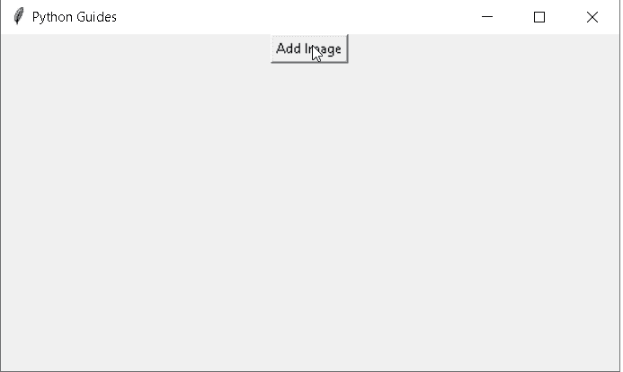

# Python Tkinter add 函数示例

> 原文：<https://pythonguides.com/python-tkinter-add-function/>

[](https://sharepointsky.teachable.com/p/python-and-machine-learning-training-course)

在本 [Python 教程](https://pythonguides.com/python-hello-world-program/)中，我们将学习关于 **Python Tkinter add 函数**的一切，如何在 Python Tkinter 中使用 **add 函数，我们还将涵盖与 add 函数相关的不同示例。我们将讨论这些话题。**

*   python tkinter add image(python tkinter add 映像)
*   Python Tkinter 添加两个数
*   Python Tkinter 添加标签
*   Python Tkinter 添加文本框
*   Python Tkinter 添加菜单栏
*   Python Tkinter 向条目添加文本
*   Python Tkinter 向框架网格添加滚动条
*   Python Tkinter 添加图标

如果您是 Python Tkinter 的新手，请查看 [Python GUI 编程](https://pythonguides.com/python-gui-programming/)。

目录

[](#)

*   [Python Tkinter 添加函数](#Python_Tkinter_add_function "Python Tkinter add function")
*   [Python Tkinter 添加图片](#Python_Tkinter_add_Image "Python Tkinter add Image")
*   [Python Tkinter 加两个数](#Python_Tkinter_Add_Two_Numbers "Python Tkinter Add Two Numbers")
*   [Python Tkinter 添加标签](#Python_Tkinter_add_a_label "Python Tkinter add a label")
*   [Python Tkinter 添加文本框](#Python_Tkinter_add_Text_Box "Python Tkinter add Text Box")
*   [Python Tkinter 添加菜单栏](#Python_Tkinter_add_Menu_Bar "Python Tkinter add Menu Bar")
*   [Python Tkinter 向条目添加文本](#Python_Tkinter_add_Text_to_Entry "Python Tkinter add Text to Entry")
*   [Python Tkinter 给框架网格添加滚动条](#Python_Tkinter_add_a_Scrollbar_To_Frame_Grid "Python Tkinter add a Scrollbar To Frame Grid ")
*   [Python Tkinter 添加图标](#Python_Tkinter_add_icon "Python Tkinter add icon")

## Python Tkinter 添加函数

让我们来看看，如何在 Python Tkinter 中使用 add 函数。我们将看到，我们如何使用图像，两个数字，文本框等添加功能。

## Python Tkinter 添加图片

在本节中，我们将学习如何在 Python Tkinter 中**添加图像。**

我们想在窗口屏幕上添加一个图像。我们创建一个想要添加图像的窗口。我们从对话框中添加图像。选择图像并打开它。所选图像将添加到窗口中。

**代码:**

在下面的代码中，我们创建了一个窗口 `ws=Tk()` 在这个窗口中，我们添加了一个按钮，它的功能就像一个事件，帮助我们选择一个想要添加到框中的图像。

*   **图像。open()** 用于在窗口上打开一幅图像。
*   `file dialog . askopenfilename()`此处用于询问从我们的本地系统位置打开我们想要打开的文件名。
*   I `mage.resize()` 帮助将图像调整到定义的像素大小。

```py
from tkinter import *
from PIL import ImageTk, Image
from tkinter import filedialog
import os

ws = Tk()
ws.title("Python Guides")
ws.geometry("550x300+300+150")
ws.resizable(width=True, height=True)

def openfun():
    filename = filedialog.askopenfilename(title='open')
    return filename
def open_img():
    a = openfun()
    imag = Image.open(a)
    imag = imag.resize((250, 250), Image.ANTIALIAS)
    imag = ImageTk.PhotoImage(imag)
    label = Label(ws, image=imag)
    label.image = imag
    label.pack()

button = Button(ws, text='Add Image', command=open_img).pack()

ws.mainloop() 
```

**输出:**

在下面的输出中，我们可以看到一个标签为 Add Image 的按钮，它的功能是选择图像的路径并在框中输入。



Python Tkinter add image Output

如前所述，当点击添加图像按钮时，它的功能是如何工作的。它从路径上询问我们想要在窗口中添加或打开哪个图像。

以这种方式选择图像后，它会显示在窗口上，我们的图像会添加到窗口中。


Add image in Python Tkinter

阅读[如何在 Python Tkinter 中设置背景为图像](https://pythonguides.com/set-background-to-be-an-image-in-python-tkinter/)

## Python Tkinter 加两个数

在本节中，我们将学习如何在 Python Tkinter 中将两个数**相加。**

加法是取两个或两个以上的数，把它们加在一起。把这些数字相加后，我们得到结果。

**代码:**

在下面的代码中，我们创建了一个窗口，在这个窗口中我们添加了标签、条目和按钮。用户在输入框中输入，结果显示为用户所给数字的相加。

`Label()` 函数用于实现显示框，我们可以在其中放置文本或图像。

`entry()` 小部件用于接受单个文本。

```py
from tkinter import *

def addnumber():
    res1=int(entry1.get())+int(entry2.get())
    mytext.set(res1)

ws = Tk()
ws.title("Python Guides")
ws.geometry("500x300")
mytext=StringVar()
Label(ws, text="First").grid(row=0, sticky=W)
Label(ws, text="Second").grid(row=1, sticky=W)
Label(ws, text="Result:").grid(row=3, sticky=W)
result=Label(ws, text="", textvariable=mytext).grid(row=3,column=1, sticky=W)

entry1 = Entry(ws)
entry2 = Entry(ws)

entry1.grid(row=0, column=1)
entry2.grid(row=1, column=1)

button = Button(ws, text="Calculate", command=addnumber)
button.grid(row=0, column=2,columnspan=2, rowspan=2,sticky=W+E+N+S, padx=5, pady=5)

ws.mainloop()
```

**输出:**

运行上述代码后，我们得到以下输出，我们看到一个窗口，窗口内有一个输入框，它从用户那里获取值，然后计算并返回结果给用户。


Add two numbers in Python Tkinter

来看看，[使用 Python Tkinter 的身体质量指数计算器](https://pythonguides.com/bmi-calculator-using-python-tkinter/)

## Python Tkinter 添加标签

在本节中，我们将学习如何在 Python Tkinter 中**添加标签。**

标签用于向用户提供关于小部件的消息。用户可以随时更改小部件上显示的文本。标签一次可以使用一种字体。

```py
Label(master,option)
```

**主**:代表父窗口。

**代码:**

在下面的代码中，我们创建了一个小部件，在这个小部件中，我们添加了一个向用户提供消息的标签。用户可以随时更改该文本。

`Label()` 用于用户指定要显示的文本或图像。

```py
from tkinter import *

ws = Tk()
ws.title("Python Guides")
ws.geometry("500x300")

label = Label(ws, text="Welcome To Python Guides Tutorial !!",font="arial" "bold")
label.pack()

ws.mainloop()
```

**输出:**

运行上面的代码后，我们得到下面的输出，其中我们看到标签在小部件中突出显示。


Python Tkinter add label Output

阅读，[Python Tkinter Entry–如何使用](https://pythonguides.com/python-tkinter-entry/)

## Python Tkinter 添加文本框

在这一节中，我们将学习如何在 Python Tkinter 中**添加一个文本框。**

文本框允许用户输入程序要使用的文本信息。用户可以一次在文本框中插入多个文本。

**代码:**

在下面的代码中，我们创建了一个小部件，在这个小部件中，我们添加了一个文本框，用户可以在其中插入文本，或者默认情况下，文本是文本字段中的一个弹出窗口。

*   `inputtext.get()` 用于获取用户的输入。
*   `Text()` 功能用于输入文本。
*   `Label()` 用于用户指定要显示的文本或图像。
*   **按钮()**用于提交文本。

```py
from tkinter import *

ws = Tk()
ws.geometry("500x300")
ws.title("Python Guides")

def take_input():
	INPUT = inputtext.get("1.0", "end-1c")
	print(INPUT)
	if(INPUT == "120"):
		Output.insert(END, 'Correct')
	else:
		Output.insert(END, "Wrong answer")

label = Label(text = "What is 24 * 5 ? ")
inputtext = Text(ws, height = 10,
				width = 25,
				bg = "light yellow")

Output = Text(ws, height = 5,
			width = 25,
			bg = "light cyan")

display = Button(ws, height = 2,
				width = 20,
				text ="Show",
				command = lambda:take_input())

label.pack()
inputtext.pack()
display.pack()
Output.pack()

ws.mainloop()
```

**输出:**

运行上面的代码后，我们得到下面的输出，用户可以在文本字段中插入数字。

输入文本后，单击显示按钮，如果用户在文本字段中输入的答案是正确的，则下一个文本字段显示正确，否则显示不正确。


Python Tkinter add text box Output

用户可以插入正确的值，该值会显示在命令提示符上。


Add a text box in Python Tkinter

阅读， [Python Tkinter 单选按钮–如何使用](https://pythonguides.com/python-tkinter-radiobutton/)

## Python Tkinter 添加菜单栏

在本节中，我们将学习如何在 Python Tkinter 中**添加菜单栏。**

菜单栏位于屏幕的下方，标题栏下方包含一个下拉菜单。菜单栏提供了打开文件、编辑等功能。

**代码:**

在下面的代码中，我们导入了 **Toplevel、Button、Tk、Menu** 库，并在窗口顶部创建了一个包含下拉菜单的菜单栏。

*   `file1.add_command()` 用于向菜单中添加菜单项。
*   `file1.add_separator()` 用于对菜单进行相应的分隔。
*   `menubar.add_cascade()` 用于以适当的方式创建菜单栏。

```py
from tkinter import Toplevel, Button, Tk, Menu  

ws = Tk() 
ws.title("Python Guides")
ws.geometry("500x300") 
menubar = Menu(ws)  
file1 = Menu(menubar, tearoff=0)  
file1.add_command(label="New")  
file1.add_command(label="Open")  
file1.add_command(label="Save")  
file1.add_command(label="Save as...")  
file1.add_command(label="Close")  

file1.add_separator()  

file1.add_command(label="Exit", command=ws.quit)  

menubar.add_cascade(label="File", menu=file1)  
edit1 = Menu(menubar, tearoff=0)  
edit1.add_command(label="Undo")  

edit1.add_separator()  

edit1.add_command(label="Cut")  
edit1.add_command(label="Copy")  
edit1.add_command(label="Paste")  
edit1.add_command(label="Delete")  
edit1.add_command(label="Select All")  

menubar.add_cascade(label="Edit", menu=edit1)  
help1 = Menu(menubar, tearoff=0)  
help1.add_command(label="About")  
menubar.add_cascade(label="Help", menu=help1)  

ws.config(menu=menubar)  
ws.mainloop() 
```

**输出:**

运行上面的代码后，我们得到了下面的输出，其中我们添加了 3 个流行的菜单栏文件、编辑和帮助。


Python Tkinter add menu bar Output

在这个图片，文件，Edir 是菜单栏和菜单选项，如新建，打开，保存，另存为等。


add `Menu Bar` in Python Tkinter

阅读， [Python Tkinter 菜单栏–如何使用](https://pythonguides.com/python-tkinter-menu-bar/)

## Python Tkinter 向条目添加文本

在本节中，我们将学习如何在 Python Tkinter 中**向条目添加文本。**

条目是我们可以输入文本的地方，或者我们可以说文本条目是指以字符、数字等形式创建消息，或者有时默认消息也可以生成。

**代码:**

在下面的代码中，我们创建了一个窗口 `ws=Tk()` 窗口里面有一个文本框。其中用户可以输入他们的文本。如果用户不提供任何输入，则使用默认值。

`textBox.insert()` 用于插入单词或句子。

```py
from tkinter import *
import tkinter as tk

ws = Tk()
ws.title("Python Guides")
ws.geometry("500x300")

textBox = Entry(ws)
textBox.insert(0, "Python Guides..!!")  
textBox.pack()
ws.mainloop() 
```

**输出:**

以下输出显示 textbox 中已经提到了该文本。如果用户想在文本框中添加一些其他文本，那么他们首先删除这些文本，然后输入另外的**“Python Guides..！!"**默认显示文本。


Python Tkinter add text to entry Output

阅读[如何用 Python 制作计算器](https://pythonguides.com/make-a-calculator-in-python/)

## Python Tkinter 给框架网格添加滚动条

在这一节中，我们将学习如何在 Python Tkinter 中将滚动条添加到框架网格中。

滚动条是一个小部件，其中文本、图片内容可以在预定方向(水平或垂直)滚动。当内容超过时，添加滚动条。

**代码:**

在下面的代码中，我们创建一个窗口 `ws=Tk()` 我们想要添加一个滚动条我们使用 `Scrollbar()` 函数在主窗口上添加滚动条。 `Orient` 决定滚动条是**垂直**还是**水平**。

`Scrollbar()` 用于在主窗口中添加滚动条。

```py
from tkinter import *
class ScrollBar:

	def __init__(self):

		ws = Tk()
		ws.title("Python Guides")
		ws.geometry("200x200")		
		h1 = Scrollbar(ws, orient = 'horizontal')		
		h1.pack(side = BOTTOM, fill = X)
		v1 = Scrollbar(ws)		
		v1.pack(side = RIGHT, fill = Y)

		t1 = Text(ws, width = 15, height = 15, wrap = NONE,
				xscrollcommand = h1.set,
				yscrollcommand = v1.set)

		for i in range(20):
	        t1.insert(END,"Python Guides Tutorial..!!\n")		
		t1.pack(side=TOP, fill=X)		
		h1.config(command=t1.xview)	
		v1.config(command=t1.yview)

		ws.mainloop()
                s1 = ScrollBar() 
```

**输出:**

在下面的输出中，我们看到有垂直或水平滚动条被添加到窗口中。


Python Tkinter add a scrollbar to a frame grid Output

阅读[如何使用 Python Tkinter 获取用户输入并存储在变量中](https://pythonguides.com/how-to-take-user-input-and-store-in-variable-using-python-tkinter/)

## Python Tkinter 添加图标

在这一节中，我们将学习如何在 Python Tkinter 中添加图标。

该图标类似于标志，它给任何网站的品牌。如果用户想搜索任何网站，他们首先会看到该网站的图标。一个带有 Sitename 的图标被添加到标题栏上。

**代码:**

在下面的代码中，我们创建了一个窗口，窗口里面有一个标题栏，并且在标题栏上添加了图标。窗口的标题栏图标基于名称**照片图像**。

*   `PhotoImage()` 用于显示图标的图像。
*   `ws.iconphoto()` 方法用于设置标题栏图标。

```py
from tkinter import *
from tkinter.ttk import *

ws = Tk()
ws.title("Python Guides")
ws.geometry("500x300")

image = PhotoImage(file = 'Pyimage.png.crdownload')

ws.iconphoto(False, image)

button = Button(ws, text = 'Click Me !')
button.pack(side = TOP)
ws.mainloop()
```

**输出:**

运行上面的代码后，我们得到了下面的输出，其中我们看到了添加到标题栏的图标。


Python Tkinter add icon Output

您可能会喜欢以下 Python Tkinter 教程:

*   [Python Tkinter 退出程序](https://pythonguides.com/python-tkinter-exit-program/)
*   [如何进入 Python Tkinter 程序的下一页](https://pythonguides.com/go-to-next-page-in-python-tkinter/)
*   [如何使用 Python Tkinter 读取文本文件](https://pythonguides.com/python-tkinter-read-text-file/)
*   [Python Tkinter 面板](https://pythonguides.com/python-tkinter-panel/)
*   [Python Tkinter 方法后](https://pythonguides.com/python-tkinter-after-method/)

因此，在本教程中，我们讨论了 **Python Tkinter add 函数**，并且我们还涵盖了不同的例子。这是我们已经讨论过的例子的列表。

*   python tkinter add image(python tkinter add 映像)
*   Python Tkinter 添加两个数
*   Python Tkinter 添加标签
*   Python Tkinter 添加文本框
*   Python Tkinter 添加菜单栏
*   Python Tkinter 向条目添加文本
*   Python Tkinter 向框架网格添加滚动条
*   Python Tkinter 添加图标

[Bijay Kumar](https://pythonguides.com/author/fewlines4biju/)

Python 是美国最流行的语言之一。我从事 Python 工作已经有很长时间了，我在与 Tkinter、Pandas、NumPy、Turtle、Django、Matplotlib、Tensorflow、Scipy、Scikit-Learn 等各种库合作方面拥有专业知识。我有与美国、加拿大、英国、澳大利亚、新西兰等国家的各种客户合作的经验。查看我的个人资料。

[enjoysharepoint.com/](https://enjoysharepoint.com/)[](https://www.facebook.com/fewlines4biju "Facebook")[](https://www.linkedin.com/in/fewlines4biju/ "Linkedin")[](https://twitter.com/fewlines4biju "Twitter")