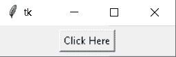
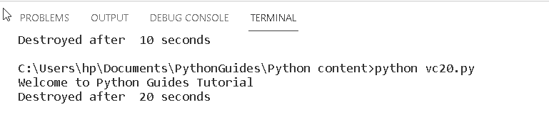
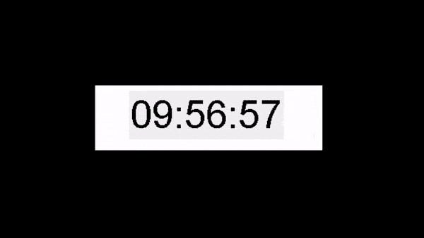
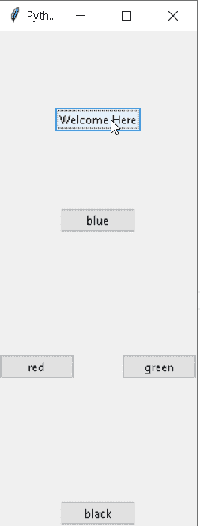
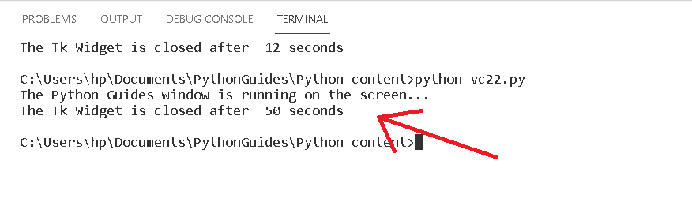
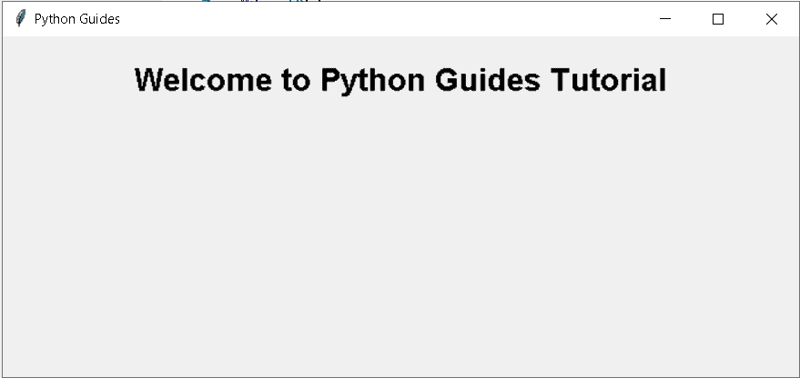

# Python Tkinter after 方法

> 原文：<https://pythonguides.com/python-tkinter-after-method/>

[](https://sharepointsky.teachable.com/p/python-and-machine-learning-training-course)

在本 Python 教程中，我们将学习如何在 [Python Tkinter](https://pythonguides.com/python-gui-programming/) 中创建 after 方法，我们还将介绍与 after 方法相关的不同示例。我们还将讨论这些话题。

*   Python Tkinter after 方法
*   Python Tkinter 后循环
*   Python Tkinter 后带参数
*   Python Tkinter after_cancel

目录

[](#)

*   [Python Tkinter 方法后](#Python_Tkinter_after_method "Python Tkinter after method")
*   [Python Tkinter 后循环](#Python_Tkinter_after_loop "Python Tkinter after loop")
*   [Python Tkinter 后带参数](#Python_Tkinter_after_with_arguments "Python Tkinter after with arguments")
*   [Python Tkinter after _ cancel](#Python_Tkinter_after_cancel "Python Tkinter after_cancel")

## Python Tkinter 方法后

在这一节中，我们将学习如何在 Python Tkinter 中创建一个 after 方法。

方法之后的**是 Tkinter 中的内置函数，它在延迟毫秒后调用一次回调函数。当程序运行几秒钟后，调用 after 方法，窗口被销毁。**

`()`方法用以下语法

```py
after(delay,callback=None)
```

**代码:**

在下面的代码中，我们导入了一个用于计算时间的**时间库**。并且在窗口添加按钮内创建一个窗口 `ws=Tk()` ，文本为**“点击这里”**。

*   `Button()` 点击一下就可以显示文字。
*   `start = time()` 计算开始时间。
*   **ws.after(20000，ws.destroy)** 方法定义为 20 秒后主窗口被销毁。
*   `end = time()` 计算结束时间。

```py
from tkinter import *

from time import time

ws = Tk()

button1 = Button(ws, text = 'Click Here')
button1.pack(side = TOP, pady = 5)

print('Welcome to Python Guides Tutorial')

start = time()

ws.after(20000, ws.destroy)

ws.mainloop()

end = time()
print('Destroyed after % d seconds' % (end-start))
```

**输出:**

在下面的输出中，我们看到一个窗口，窗口里面有一个按钮。



Python Tkinter after method Output

单击该按钮，我们会在命令提示符下看到文本**“欢迎使用 Python 指南教程”**，几秒钟后， `after()` 方法调用，窗口将被破坏。



Python Tkinter after method1 Output

阅读: [Python tkinter 标签](https://pythonguides.com/python-tkinter-label/)

## Python Tkinter 后循环

在这一节中，我们将学习如何在 Python Tkinter 的循环之后创建一个**。**

循环是一个结束与开始相连接的过程。在 after 循环中，回调函数在延迟毫秒后被调用，一段时间后再次继续循环。

**代码:**

在下面的代码中，我们将时间库作为一个用于计算时间的**导入时间**，并在我们创建的类中创建一个函数。

*   `Label()` 用于显示文本或图像的字段。
*   **self.label1.after(1000，self.update)** 方法被定义为 10 秒后主窗口被销毁并调度另一个定时器。

```py
from tkinter import *
from tkinter import ttk
import time

class digitalwatch(Tk):
    def __init__(self):
        super().__init__()

        self.title('Python Guides')
        self.resizable(0, 0)
        self.geometry('300x80')
        self['bg'] = 'white'

        self.style = ttk.Style(self)
        self.style.configure(
            'TLabel',
            background='white',
            foreground='black')

        self.label1 = Label(
            self,
            text=self.time_string(),
            font=('Digital-7', 40))

        self.label1.pack(expand=True)

        self.label1.after(1000, self.update)

    def time_string(self):
        return time.strftime('%H:%M:%S')

    def update(self):
        """ update the label every 1 second """

        self.label1.configure(text=self.time_string())

        self.label1.after(1000, self.update)

if __name__ == "__main__":
    ws = digitalwatch()
    ws.mainloop()
```

**输出:**

在下面的输出中，我们看到了数字手表，其中时间在几秒钟后连续运行，从开始开始，在循环后继续。



Python Tkinter after loop Output

阅读: [Python Tkinter 条目](https://pythonguides.com/python-tkinter-entry/)

## Python Tkinter 后带参数

在本节中，我们将学习如何用 Python Tkinter 中的参数创建 after。

在带有参数的函数后使用**进行修补，在该函数中定义了一个函数并调用它。否则，它会显示一个错误。**

**代码:**

在下面的代码中，我们创建了一个窗口，在这个窗口中我们添加了一些按钮来定义和调用函数。调用它后会得到结果。

*   `starttime = time()` 计算开始时间
*   **ws.after(50000，ws.destroy)** 定义 50 秒后主窗口将被破坏。
*   `endtime = time()` 计算结束时间。

```py
from tkinter import *
from time import time
from tkinter.ttk import Button
ws= Tk()
ws.title("Python Guides")
ws.geometry("200x500")
b = Button(ws, text = 'Welcome Here')
b.pack(pady = 77,side = TOP)
blue = Button(ws, text = "blue")
blue.pack( side = TOP)
black = Button(ws, text = "black")
black.pack( side = BOTTOM )
red = Button(ws, text = "red")
red.pack( side = LEFT )
green = Button(ws, text = "green")
green.pack( side = RIGHT)
print('The Python Guides window is running on the screen...')
starttime = time()
ws.after(50000, ws.destroy)
ws.mainloop()
endtime = time()
print('The Tk Widget is closed after % d seconds' % (endtime-starttime))
```

**输出:**

运行上面的代码后，我们得到下面的输出，其中函数运行平稳，没有错误。



Python Tkinter after with arguments Output

参数显示在命令提示符上，我们还看到 50 秒后小部件自动关闭。



Python Tkinter after with arguments1 Output

阅读: [Python Tkinter 按钮](https://pythonguides.com/python-tkinter-button/)

## Python Tkinter after _ cancel

在本节中，我们将学习如何在 Python Tkinter 中创建 `add_cancel` 函数。

当我们使用 after()函数创建一个调度时，它会关闭主窗口，给他们提供停止该调度的时间，或者我们可以说，为了停止一个特定的调度，我们使用了 `after_cancel` 函数。

**代码:**

在下面的代码中，我们使用 **after(5000，lambda:ws.destroy())** 函数，该函数在 5 秒后关闭主窗口，但在应用 `after_cancel()` 后，它将停止 after 函数。

`after_cancel()` 函数用于停止**的调度，after()** 函数。

函数只有一个表达式，它可以接受任何类型的参数。

```py
from tkinter import *
from tkinter import ttk

ws = Tk()
ws.title("Python Guides")

ws.geometry("700x300")

Label(ws, text= "Welcome to Python Guides Tutorial",
font=('Helvetica 20 bold')).pack(pady=20)

ws.after_cancel(ws)
ws.after(5000,lambda:ws.destroy())
ws.mainloop()
```

**输出:**

运行上述代码后，我们将得到以下输出，我们看到一个窗口，在屏幕上显示一些文本。当我们移除 `after_cancel()` 函数时，窗口将在 5 秒后关闭。要移除 `after()` **函数**的时间表，我们使用 `after_cancel()` 函数。



Python Tkinter after_cancel Output

你也可以阅读下面的 Tkinter 教程。

*   [Python Tkinter 画布教程](https://pythonguides.com/python-tkinter-canvas/)
*   [Python Tkinter 窗口大小](https://pythonguides.com/python-tkinter-window-size/)
*   [Python Tkinter 面板](https://pythonguides.com/python-tkinter-panel/)
*   [Python Tkinter 进度条](https://pythonguides.com/python-tkinter-progress-bar/)
*   [Python Tkinter Stopwatch](https://pythonguides.com/python-tkinter-stopwatch/)
*   [Python Tkinter 列表框](https://pythonguides.com/python-tkinter-listbox/)
*   [Python Tkinter 帧](https://pythonguides.com/python-tkinter-frame/)
*   [如何使用 Python Tkinter 生成工资条](https://pythonguides.com/how-to-generate-payslip-using-python-tkinter/)

因此，在本教程中，我们讨论了 Python Tkinter after 方法，我们还将讨论不同的例子。这是我们已经讨论过的例子列表。

*   Python Tkinter after 方法
*   Python Tkinter 后循环
*   Python Tkinter 后带参数
*   Python Tkinter after_cancel

[Bijay Kumar](https://pythonguides.com/author/fewlines4biju/)

Python 是美国最流行的语言之一。我从事 Python 工作已经有很长时间了，我在与 Tkinter、Pandas、NumPy、Turtle、Django、Matplotlib、Tensorflow、Scipy、Scikit-Learn 等各种库合作方面拥有专业知识。我有与美国、加拿大、英国、澳大利亚、新西兰等国家的各种客户合作的经验。查看我的个人资料。

[enjoysharepoint.com/](https://enjoysharepoint.com/)[](https://www.facebook.com/fewlines4biju "Facebook")[](https://www.linkedin.com/in/fewlines4biju/ "Linkedin")[](https://twitter.com/fewlines4biju "Twitter")