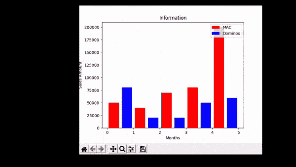

# Python Tkinter 动画

> 原文：<https://pythonguides.com/python-tkinter-animation/>

[](https://sharepointsky.teachable.com/p/python-and-machine-learning-training-course)

在本教程中，我们将学习 **Python Tkinter 动画**。在这里，我们将了解如何在 python 中使用 Tkinter 创建动画，我们将涵盖与动画相关的不同示例。我们还将讨论这些主题

*   Python tkinter 动画
*   Python tkinter 加载动画
*   Python tkinter 计时器动画
*   Python tkinter matplotlib 动画
*   Python tkinter 简单动画
*   Python tkinter 按钮动画

目录

[](#)

*   [Python Tkinter 动画](#Python_Tkinter_Animation "Python Tkinter Animation")
*   [Python Tkinter 加载动画](#Python_Tkinter_Loading_Animation "Python Tkinter Loading Animation")
*   [Python tkinter 定时器动画](#Python_tkinter_timer_animation "Python tkinter timer animation")
*   [Python tkinter matplotlib 动画](#Python_tkinter_matplotlib_animation "Python tkinter matplotlib animation")
*   [Python tkinter 简单动画](#Python_tkinter_Simple_animation "Python tkinter Simple animation")
*   [Python tkinter 按钮动画](#Python_tkinter_Button_animation "Python tkinter Button animation")

## Python Tkinter 动画

在本节中，我们将学习 Python Tkinter 动画。通过动画，我们的意思是在任何物体上创造一个瞬间的幻觉。

在下面的代码中，我们取了两个起始位置“x”和“y ”,并给了一个窗口一些**宽度**和**高度**,在里面，我们用画布做了一个球，并在我们创建的屏幕空间内给球添加了一个力矩。

**代码:**

```py
import tkinter
import time

Window_Width=800

Window_Height=600

Ball_Start_XPosition = 50

Ball_Start_YPosition = 50

Ball_Radius = 30

Ball_min_movement = 5

Refresh_Sec = 0.01

def create_animation_window():
  Window = tkinter.Tk()
  Window.title("Python Guides")

  Window.geometry(f'{Window_Width}x{Window_Height}')
  return Window

def create_animation_canvas(Window):
  canvas = tkinter.Canvas(Window)
  canvas.configure(bg="Blue")
  canvas.pack(fill="both", expand=True)
  return canvas

def animate_ball(Window, canvas,xinc,yinc):
  ball = canvas.create_oval(Ball_Start_XPosition-Ball_Radius,
            Ball_Start_YPosition-Ball_Radius,
            Ball_Start_XPosition+Ball_Radius,
            Ball_Start_YPosition+Ball_Radius,
            fill="Red", outline="Black", width=4)
  while True:
    canvas.move(ball,xinc,yinc)
    Window.update()
    time.sleep(Refresh_Sec)
    ball_pos = canvas.coords(ball)
    # unpack array to variables
    al,bl,ar,br = ball_pos
    if al < abs(xinc) or ar > Window_Width-abs(xinc):
      xinc = -xinc
    if bl < abs(yinc) or br > Window_Height-abs(yinc):
      yinc = -yinc

Animation_Window = create_animation_window()
Animation_canvas = create_animation_canvas(Animation_Window)
animate_ball(Animation_Window,Animation_canvas, Ball_min_movement, Ball_min_movement) 
```

下面是给定代码的一些主要亮点。

*   `Canvas.create_oval()` 用于赋予球椭圆形。
*   `Canvas.move()` =球的运动
*   `time.sleep()` 它在给定的秒数内暂停执行。

**输出:**

运行上面的代码后，我们可以看到下面的输出，其中一个球正在改变它的位置。球上下运动，展示了一个动画的例子。


Output

阅读: [Python Tkinter 编辑器](https://pythonguides.com/python-tkinter-editor/)

## Python Tkinter 加载动画

在本节中，我们将学习 python Tkinter 加载动画。所谓加载，我们指的是通过互联网处理任何页面或加载任何数据。

**代码:**

在下面的代码中，我们制作了一个处理栏，它在点击 run 按钮后运行，并向我们展示了页面的加载。

*   `Progressbar()` 用于显示加载栏。
*   **mode = ' determine '**显示将起点移动到终点的指示器。

```py
from tkinter import *
from tkinter.ttk import *

ws=Tk()
Progress_Bar=Progressbar(ws,orient=HORIZONTAL,length=250,mode='determinate')

def Slide():
    import time
    Progress_Bar['value']=20
    ws.update_idletasks()
    time.sleep(1)
    Progress_Bar['value']=50
    ws.update_idletasks()
    time.sleep(1)
    Progress_Bar['value']=80
    ws.update_idletasks()
    time.sleep(1)
    Progress_Bar['value']=100

Progress_Bar.pack()
Button(ws,text='Run',command=Slide).pack(pady=10)
mainloop() 
```

**输出:**

运行下面的代码后，我们得到了下面的输出，它向我们展示了 python Tkinter 是如何加载的。在这里，我们可以看到当用户点击“ `Run` 按钮时，页面上开始加载数据。


Output

阅读: [Python Tkinter 表教程](https://pythonguides.com/python-tkinter-table-tutorial/)

## Python tkinter 定时器动画

在本节中，我们将学习 python Tkinter 计时器动画。通过定时器，我们的意思是为我们的提醒设置任何时间计数来记住我们的任务。理解计时器的最好例子是我们日常使用的闹钟。

**代码:**

在下面的代码中，我们导入了一个**时间库**，用来定义**小时**、**分钟` `&秒**。这里一个用户正在设置一些时间计数器，它的工作类似于在时间到了之后给出一个提醒。

```py
import time
from tkinter import *
from tkinter import messagebox

ws = Tk()

ws.geometry("300x300")

ws.title("Python Guides")

Hour=StringVar()
Minute=StringVar()
Second=StringVar()

Hour.set("00")
Minute.set("00")
Second.set("00")

Hour_entry= Entry(ws, width=3, font=("Arial",18,""),
				textvariable=Hour)
Hour_entry.place(x=80,y=20)

Minute_entry= Entry(ws, width=3, font=("Arial",18,""),
				textvariable=Minute)
Minute_entry.place(x=130,y=20)

Second_entry= Entry(ws, width=3, font=("Arial",18,""),
				textvariable=Second)
Second_entry.place(x=180,y=20)

def OK():
	try:

		temp = int(Hour.get())*3600 + int(Minute.get())*60 + int(Second.get())
	except:
		print("Please Input The Correct Value")
	while temp >-1:

		Mins,Secs = divmod(temp,60)

		Hours=0
		if Mins >60:

			Hours, Mins = divmod(Mins, 60)

		Hour.set("{0:2d}".format(Hours))
		Minute.set("{0:2d}".format(Mins))
		Second.set("{0:2d}".format(Secs))

		ws.update()
		time.sleep(1)

		if (temp == 0):
			messagebox.showinfo("Time Countdown", "Time up ")

		temp -= 1

button = Button(ws, text=' countdown', bd='5',
			command= OK)
button.place(x = 100,y = 110)

ws.mainloop()
```

**输出:**

运行上面的代码后，我们可以看到一个用户已经设置了几秒钟的定时器，它按照定时器的命令工作。


Output

阅读:[如何用 Python Tkinter 创建贪吃蛇游戏](https://pythonguides.com/create-a-snake-game-in-python/)

## Python tkinter matplotlib 动画

`Matplotlib` 是一个用于绘制图形的 Python 库。这是一个我们可以免费使用的开源库。它是用 Python 语言写的。这里有一个专门用来处理 `matplotlib` 函数的工具，名为“ `MATLAB` ”。在这里，Numpy 是其数字数学扩展，用于表示其轴的图形值。

**代码:**

*   `plt.bar()` 用于表示要用 **X 轴**和 **Y 轴**值绘制条形图。
*   `ptl.xlabel()` 用来表示 x 轴。
*   `plt.ylabel()` 用于表示 y 轴。
*   `plt.title()` 用于给条形图赋予标题。

```py
from matplotlib import pyplot as plt
plt.bar([0.25,1.25,2.25,3.25,4.25],[50000,40000,70000,80000,200000],label="MAC",color='r',width=.4)
plt.bar([0.75,1.75,2.75,3.75,4.75],[80000,20000,20000,50000,60000],label="Dominos",color='b',width=.4)
plt.legend(loc='upper right')
plt.xlabel('Months')
plt.ylabel('Sales Amount')
plt.title('Information')
plt.show()
```

**输出:**

运行以下代码后，我们看到生成了条形图。这里是代表数据点的 **x 轴**和 **y 轴**值的月份和销售额变量，条形图代表一个月的总销售额。在下面的 gif 中，当我们将鼠标悬停在一个条上时，我们可以看到 **x 轴**和 **y 轴**正在给出一些值。



Output

阅读: [Python Tkinter 图片](https://pythonguides.com/python-tkinter-image/)

## Python tkinter 简单动画

在下一节中，我们将学习 python Tkinter 的简单动画。在这里，我们制作了一个按钮，点击这个按钮可以改变背景颜色。

**代码:**

在下面的代码中，我们使用了一个随机库，为我们的选项提供了一个随机选择，在顶部，我们添加了一个带有文本“click me”的按钮，它可以随机改变背景的颜色。

*   返回一个随机选择颜色的列表。
*   `ws.title` 用于给窗口一个标题。
*   **按钮()**用于运行该命令生成随机颜色在此。

```py
from tkinter import *
import random

def gen_color():
    ws.configure(background=random.choice(["black", "red" , "green" , "blue"]))

ws =Tk()
ws.title("Python Guides")
ws.geometry('500x500')

button=Button(ws,text='Click Me',command = gen_color).pack()
ws.mainloop()
```

**输出:**

运行上述代码后，我们可以借助 python Tkinter 运行一个简单的动画。


Simple animation

阅读: [Python Tkinter Colors](https://pythonguides.com/python-tkinter-colors/)

## Python tkinter 按钮动画

在本节中，我们将学习 Python Tkinter 动画按钮。

我们在这里使用按钮动画作为一种功能，我们可以在任何游戏应用程序或任何类似的应用程序中使用它来打开或关闭该功能。这里的按钮就像一个普通的开关一样工作，我们在日常生活中使用它来打开房子的灯。

**代码:**

```py
from tkinter import *
ws = Tk()
ws.title("Python Guides")

def convert():
    if(a1['state']==NORMAL):
        a1["state"] = DISABLED
        a2["text"]="enable"
    elif (a1['state']==DISABLED):
        a1["state"]=NORMAL
        a2["text"]="disable"

#--Buttons
a1=Button(ws, text="button")
a1.config(height = 8, width = 9)
a1.grid(row=0, column=0)    
a2 = Button(text="disable", command=convert)
a2.grid(row=0,column=1)
ws.mainloop()
```

在上面的代码中，首先，我们创建了一个按钮对象“ `a1` ”，然后，我们使用 `IF` 语句来检查按钮的状态。最后，我们使用状态来改变按钮的行为，以获得想要的结果。

**输出:**

运行下面的代码后，我们得到下面的输出，当我们点击它们时，按钮将被禁用。当我们再次点击它们时，按钮将被启用。


Output

你可能也喜欢读下面的文章。

*   [python tkinter auto complete](https://pythonguides.com/python-tkinter-autocomplete/)
*   [Python Tkinter 主循环](https://pythonguides.com/python-tkinter-mainloop/)
*   [Python Tkinter 保存文本到文件](https://pythonguides.com/python-tkinter-save-text-to-file/)
*   [Python Tkinter 滚动条](https://pythonguides.com/python-tkinter-scrollbar/)
*   [Python Tkinter Spinbox](https://pythonguides.com/python-tkinter-spinbox/)
*   [Python Tkinter 文本框小工具](https://pythonguides.com/python-tkinter-text-box/)
*   [Python Tkinter 事件](https://pythonguides.com/python-tkinter-events/)
*   [Python Tkinter 通断开关](https://pythonguides.com/python-tkinter-on-off-switch/)

所以，在本教程中，我们讨论 **Python Tkinter 动画**。这是我们已经讨论过的例子的列表。

*   Python Tkinter 动画
*   Python Tkinter 动画教程
*   Python Tkinter 加载动画
*   Python Tkinter 计时器动画
*   Python Tkinter matplotlib 动画
*   Python Tkinter 简单动画
*   Python Tkinter 按钮动画

[Bijay Kumar](https://pythonguides.com/author/fewlines4biju/)

Python 是美国最流行的语言之一。我从事 Python 工作已经有很长时间了，我在与 Tkinter、Pandas、NumPy、Turtle、Django、Matplotlib、Tensorflow、Scipy、Scikit-Learn 等各种库合作方面拥有专业知识。我有与美国、加拿大、英国、澳大利亚、新西兰等国家的各种客户合作的经验。查看我的个人资料。

[enjoysharepoint.com/](https://enjoysharepoint.com/)[](https://www.facebook.com/fewlines4biju "Facebook")[](https://www.linkedin.com/in/fewlines4biju/ "Linkedin")[](https://twitter.com/fewlines4biju "Twitter")