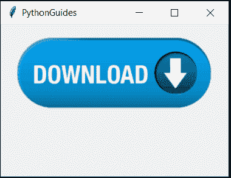
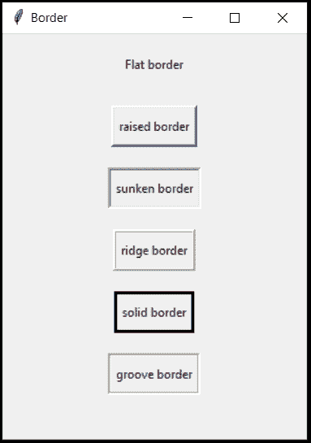

# Python Tkinter 按钮–如何使用

> 原文：<https://pythonguides.com/python-tkinter-button/>

[](https://sharepointsky.teachable.com/p/python-and-machine-learning-training-course)

在本 [Python 教程](https://pythonguides.com/python-programming-for-the-absolute-beginner/)中，我们将学习 **Python tkinter 按钮**。我们也会看到这些话题。

*   Python Tkinter 按钮命令
*   Python Tkinter 按钮样式
*   Python Tkinter 按钮位置
*   Python Tkinter 按钮大小
*   Python Tkinter 按钮颜色
*   Python Tkinter 按钮形状
*   python tkinter button image(python tkinter button 图像)
*   Python Tkinter 按钮命令参数
*   Python Tkinter 按钮属性
*   Python Tkinter 按钮变灰

目录

[](#)

*   [Tkinter 按钮命令](#Tkinter_Button_Command "Tkinter Button Command")
*   [t inter 按钮样式](#Tkinter_button_Styles "Tkinter button Styles")
*   [t inter 按钮位置](#Tkinter_Button_Position "Tkinter Button Position")
*   [t inter 按钮尺寸](#Tkinter_Button_size "Tkinter Button size")
*   [t inter 按钮颜色](#Tkinter_Button_Color "Tkinter Button Color")
*   [t inter 按钮形状](#Tkinter_Button_Shape "Tkinter Button Shape")
*   tkinter button image
*   [Tkinter 按钮命令参数](#Tkinter_Button_Command_Arguments "Tkinter Button Command Arguments")
*   [Tkinter 按钮属性](#Tkinter_Button_Attributes "Tkinter Button Attributes")
*   [Python Tkinter 灰显按钮](#Python_Tkinter_Greyed_Out_Button "Python Tkinter Greyed Out Button")

## Tkinter 按钮命令

*   button 小部件用于在屏幕上放置一个按钮。
*   按钮拥有按下时触发的功能。

**语法:**

在这种语法中，ws 是主要的，在文本的地方你可以提到按钮的用途，函数或方法应该作为命令传递。

```py
Button(ws, text="any text", command=function/method).pack()
```

。**代码:**

这里有一个订阅按钮。当用户点击该按钮，消息框与谢谢你出现。

```py
from tkinter import *
from tkinter import messagebox

ws = Tk()
ws.title('PythonGuides')

def subscribe():
    return messagebox.showinfo('PythonGuides','Thnak you for subscribing!')

Button(ws, text="Subscribe", command=subscribe).pack(pady=20)

ws.mainloop()
```

**输出:**

正如您在下面的输出屏幕中看到的。当用户点击订阅按钮时，他会得到一个提示。如果您只想调用函数一次，那么在调用函数之后添加()。比如这个例子``command=subscribe()``


python tkinter button

你可能也会喜欢， [Python Tkinter Title](https://pythonguides.com/python-tkinter-title/) 和[身体质量指数计算器使用 Python Tkinter](https://pythonguides.com/bmi-calculator-using-python-tkinter/) 。

## t inter 按钮样式

*   样式用于改善按钮的外观
*   它提供了各种各样的功能，如背景，前景，字体等
*   开发者可以准备用于设计按钮的模板
*   使用 style，它可以在所有按钮上实现
*   您可以将更改应用于单个按钮或多个按钮

**代码:**

```py
from tkinter import *
from tkinter.ttk import * 

ws = Tk()
ws.title('PythonGuides')
ws.geometry('200x200')

st = Style()
st.configure('W.TButton', background='#345', foreground='black', font=('Arial', 14 ))

Button(ws, text='Smash Me', style='W.TButton', command=None).pack()

ws.mainloop() 
```

**输出:**

这个输出是使用 style 实现的。


Tkinter button Styles

## t inter 按钮位置

*   有 3 个布局管理器: **Pack，Grid，Place** 。
*   `Pack` 用于将 widget 在框架中央对齐。
*   **网格**使用行&列的方法放置小部件。
*   `Place` 用于在任何坐标中定位小部件，提供为 x & y

**语法:**

```py
Button(ws, text="any text", command=function/method).pack()

Button(ws, text="any text", command=function/method).grid(row=value, column=value)

Button(ws, text="any text", command=function/method).place(x=value, y=value) 
```

**代码使用包:**

```py
from tkinter import *

ws = Tk()
ws.title("PythonGuide")
ws.geometry('200x250')

Button(ws, text="Click", command=None).pack()

ws.mainloop()
```

**输出:**

在这个输出中，pack 用于放置按钮。Pack 将小部件居中对齐。这就是为什么在第二张图片中调整屏幕大小时，按钮仍然在中间位置。


Button positioning using pack

**使用网格编码**:

```py
from tkinter import *

ws=Tk()
ws.title("PythonGuide")
ws.geometry('200x250')

Button(ws,text="Click",command=None).grid(row=0, column=0)

ws.mainloop()
```

**输出:**

在这个输出中，您可以看到按钮位于第 0 行和第 0 列，这意味着左上角。即使调整了窗口大小,“在网格中”按钮仍保持不变。


Tkinter Button Position

**代码使用地点:**

```py
from tkinter import *

ws = Tk()
ws.title("PythonGuide")
ws.geometry('200x250')

Button(ws, text="Click", command=None).place(x=20, y=20)

ws.mainloop()
```

**输出:**

在这个输出中，使用 place 来定位按钮。这个地方提供了最大限度的控制。正如你所看到的，两个按钮被放置在不同的位置，但由于屏幕尺寸小于第二个按钮的位置，所以它没有出现。但是当屏幕被拉伸时，它开始出现。


## t inter 按钮尺寸

*   调整按钮的大小意味着增加或减少按钮部件的宽度和高度。
*   使用关键字**宽度**和**高度**可以很容易地做到这一点。

**代码:**

```py
from tkinter import *

ws = Tk()
ws.title('PythonGuides')
ws.geometry('200x200')

Button(ws, text='Smash Me!', height=10, width=20).pack(pady=10)

ws.mainloop()
```

**输出:**

在此输出中，按钮大小从常规大小增加了。按钮的标准尺寸在上一节中已经提到。在这种情况下，按钮的高度和宽度都增加了。


Tkinter Button size

## t inter 按钮颜色

*   颜色在使应用程序看起来有吸引力和吸引眼球方面起着重要的作用。
*   按钮也可以涂上任何颜色。
*   有两个部分需要着色。
*   首先是按钮的背景其次是字体颜色
*   `bg` 关键字用于绘制背景
*   `fg` 关键字用于给字体上色。

**代码:**

```py
from tkinter import *

ws = Tk()
ws.title('PythonGuides')
ws.geometry('200x200')

Button(ws, text='Smash Me!', height=10, width=20, bg='#567', fg='White').pack(pady=10)

ws.mainloop()
```

**输出:**

在这个输出中，背景被涂成蓝色，字体颜色是白色。单词和 hexacode 都是可以接受的。


Tkinter Button Color

## t inter 按钮形状

*   形状是指在按钮中应用形状
*   形状可以是矩形、椭圆形、圆形等。
*   tkinter 不支持形状
*   您不能直接从 widget 创建圆形按钮。
*   要做到这一点，你需要一个全面的形象。
*   然后将边框宽度减小到 0。
*   要观看演示，请参考 Tkinter 图像部分

## tkinter button image

*   图像改善了应用程序的外观
*   为了在按钮上应用图像，我们使用了 `image` 关键字

**代码:**

```py
from tkinter import *

ws = Tk()
ws.title('PythonGuides')
ws.geometry('300x200')   

dwnd = PhotoImage(file='download.png')
Button(ws, image=dwnd, command=None).pack(pady=10)

ws.mainloop()
```

**输出:**

在此输出中，下载按钮图像应用于按钮小部件。它是可点击的，这意味着它是一个按钮。但是这个有按钮背景。移除下一张图片中的按钮边框设置`borderwidth = 0.`,你可以看到这里没有边框。


Button image with background



Button image without background

## Tkinter 按钮命令参数

*   命令按钮参数是指在命令按钮中提供输入
*   在计算器中，代码通过按钮命令获取一个关键参数。
*   类似地，我们将编写向函数发送一个数字的代码

**代码:**

```py
from tkinter import *

ws = Tk()
ws.title('PythonGuides')
ws.geometry('200x200')

ep = ''
def keyLog(k):
    global ep
    ep = ep + str(k)
    actn.set(ep)

actn = StringVar()
Entry(ws, textvariable=actn).pack()

one_Btn = Button(ws, text='1', command=lambda: keyLog(1), padx=5, pady=5)
two_Btn = Button(ws, text='2', command=lambda: keyLog(2), padx=5, pady=5)
three_Btn = Button(ws, text='3', command=lambda: keyLog(3), padx=5, pady=5)

one_Btn.pack()
two_Btn.pack()
three_Btn.pack()

ws.mainloop()
```

**输出:**

所以在这个输出中，参数以键名 ie 的形式出现。1 或 2 或 3 被传递给函数，其中这些数字被打印在输入框中。


Tkinter Button Command Arguments

## Tkinter 按钮属性

*   属性是按钮小工具的属性
*   它包含小部件的所有特性的列表

1.  **活动背景** & **活动前景**

*   **活动背景**点击时改变按钮的背景颜色
*   点击按钮时， `activeforeground` 改变文本颜色

**代码:**

```py
from tkinter import *

ws = Tk()
ws.title('PythonGuides')
ws.geometry('300x200')   

Button(ws, text="Smash Me", activebackground='#345',activeforeground='white', padx=5, pady=5 ).pack(pady=10)

ws.mainloop()
```

**输出:**

在这个输出中，第一个图像显示了没有单击的按钮，但是第二个图像显示了单击时背景颜色和文本颜色的变化。只要松开按钮，它就会变得正常


Tkinter Button Attributes

**2。颜色:**

*   颜色在软件开发中起着重要的作用。
*   每种颜色都有一些含义，比如红色代表错误，绿色代表正确，等等。
*   `bg` 用于填充标签的背景颜色
*   `fg` 用于改变文本颜色。
*   您可以提供颜色名称或十六进制代码

**举例**:

```py
Button(ws, text="Click", bg="blue", fg="#000").pack()
```

**3。` `字体:**

*   字体使文本可读。
*   了解更多关于字体的知识。

**举例:**

```py
Button(ws, text="font", font=('arial bold', 18)).pack()
```

**4。救济:**

*   浮雕**用于为**边框提供装饰。
*   它有各种选项可以用来强调文本。
*   按钮边框定义了边框的类型和宽度。
*   有 6 种类型的边框，每种都有其 on 属性:
    *   **平**
    *   **升起**
    *   **沉没**
    *   **山脊**
    *   **固体**
    *   **凹槽**
*   默认情况下，平面处于活动状态。
*   `borderwidth` 关键字用来定义边框的粗细。
*   `relief` 关键字用于定义边框的类型。

**语法:** borderwidth 应提供任意整数值，relief 应提供任意这些(平的、凸起的、凹陷的、脊形的、实心的、凹槽的)。

```py
Label(ws, text="any text", borderwidth=value, relief="typeofborder").pack()
```

**代码:**

```py
from tkinter import *

ws = Tk()
ws.title("Border")
ws.geometry("300x400")

Button(ws, text="Flat border", borderwidth=3, relief="flat", padx=5, pady=10).pack(padx=5, pady=10)
Button(ws, text="raised border", borderwidth=3, relief="raised", padx=5, pady=10).pack(padx=5, pady=10)
Button(ws, text="sunken border", borderwidth=3, relief="sunken", padx=5, pady=10).pack(padx=5, pady=10)
Button(ws, text="ridge border", borderwidth=3, relief="ridge", padx=5, pady=10).pack(padx=5, pady=10)
Button(ws, text="solid border", borderwidth=3, relief="solid", padx=5, pady=10).pack(padx=5, pady=10)
Button(ws, text="groove border", borderwidth=3, relief="groove",padx=5, pady=10).pack(padx=5, pady=10)

ws.mainloop() 
```

**输出:**

在此输出中，显示了所有类型的边框，每种边框的宽度为 3 个像素。padx & pady 决定盒子周围的额外空间。



**举例:**

```py
Button(ws, text="relief demo", borderwidth=3, relief='solid border').pack()
```

**5。高度&宽度:**

*   高度决定了按钮的垂直尺寸。
*   宽度决定按钮的水平尺寸。

**举例:**

```py
Button(ws, text="Height & width", height=5, width=10).pack()
```

**6。帕德克斯&帕迪**

*   `padx` 垂直添加空白
*   **pady 水平添加空白**
*   如果在按钮内使用它们，它们会在盒子内增加额外的空间
*   如果在定位部分(包装/网格/位置)使用它们，则在框外添加空间。

**例:**盒子里面

```py
Button(ws, text="Smash Me", padx=10, pady=5).pack()
```

**7。` `狡辩:**

*   Justify 用于对齐。
*   它的工作方式类似于 anchor，但只有三个选项
*   **左、中、右**

**举例:**

```py
Button(ws, text="Smash Me", justify=CENTER).pack()
```

## Python Tkinter 灰显按钮

*   **Python Tkinter 按钮变灰**表示按钮处于禁用状态&无法点击。
*   当开发人员不希望用户在没有满足需求的情况下继续开发时，可以使用这种方法。
*   下次如果你在网站或软件上看到接受条款和条件选项，试着接受它。您会注意到按钮被禁用&它是不可点击的。
*   **状态**用于在**正常**或**禁用**状态之间切换。
    *   **正常**:按钮可点击，准备触发功能
    *   **禁用**:按钮变灰，无法点击。

**语法:**

```py
Button(ws, text="any-text", state=DISABLED).pack()
```

**代码:**

在这段代码中，我们创建了一个按钮变灰的演示。有一个按钮处于禁用状态。当用户选中复选框时，该按钮将变为正常状态。

```py
from tkinter import * 

def activate_submit():
    if var.get()==1:
        btn['state']=NORMAL
    elif var.get()==0:
        btn['state']=DISABLED 
    else:
        print('something went wrong!')

ws = Tk()
ws.title("PythonGuides")
ws.geometry("400x300")
ws['bg']='#5d8a82'

var = IntVar()
cb = Checkbutton(
    ws, 
    text="Terms & conditions", 
    onvalue=1, 
    offvalue=0,
    variable=var,
    font=("time", 16),
    command=activate_submit,
    bg='#5d8a82'
    )
cb.pack(pady=50)

btn = Button(
    ws, 
    text="Register",
    command=None,
    state=DISABLED, 
    padx=20, 
    pady=10,
    relief=RAISED, 
    font=('times bold', 14)
)
btn.pack()

ws.mainloop()
```

**输出:**

在这个输出中，您可以看到在第一张图片中，按钮是灰色的或被禁用，但一旦用户接受了条款和条件，但正常和可点击的。


您可能会喜欢以下 Python 教程:

*   [Python 将列表写入文件，并附有示例](https://pythonguides.com/python-write-list-to-file/)
*   [Python 生成随机数和字符串](https://pythonguides.com/python-generate-random-number/)
*   [Python tkinter 标签–如何使用](https://pythonguides.com/python-tkinter-label/)
*   [Python 格式数字加逗号](https://pythonguides.com/python-format-number-with-commas/)
*   [Python Tkinter 条目–如何使用](https://pythonguides.com/python-tkinter-entry/)
*   [Python 将字符串写入文件](https://pythonguides.com/python-write-string-to-a-file/)
*   [Python 中的优先级队列](https://pythonguides.com/priority-queue-in-python/)
*   [Python 历元到日期时间+示例](https://pythonguides.com/python-epoch-to-datetime/)
*   [Python tkinter messagebox +示例](https://pythonguides.com/python-tkinter-messagebox/)
*   如何[使用 Tkinter](https://pythonguides.com/make-a-calculator-in-python/) 创建一个 Python 计算器

在本教程中，我们学习了 **Python Tkinter 按钮**:

*   Python Tkinter 按钮命令
*   Python Tkinter 按钮样式
*   Python Tkinter 按钮位置
*   Python Tkinter 按钮大小
*   Python Tkinter 按钮颜色
*   Python Tkinter 按钮形状
*   python tkinter button image(python tkinter button 图像)
*   Python Tkinter 按钮命令参数
*   Python Tkinter 按钮属性
*   Python Tkinter 按钮变灰

[Bijay Kumar](https://pythonguides.com/author/fewlines4biju/)

Python 是美国最流行的语言之一。我从事 Python 工作已经有很长时间了，我在与 Tkinter、Pandas、NumPy、Turtle、Django、Matplotlib、Tensorflow、Scipy、Scikit-Learn 等各种库合作方面拥有专业知识。我有与美国、加拿大、英国、澳大利亚、新西兰等国家的各种客户合作的经验。查看我的个人资料。

[enjoysharepoint.com/](https://enjoysharepoint.com/)[](https://www.facebook.com/fewlines4biju "Facebook")[](https://www.linkedin.com/in/fewlines4biju/ "Linkedin")[](https://twitter.com/fewlines4biju "Twitter")