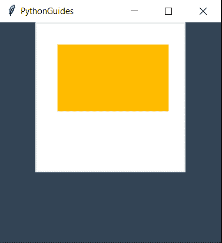
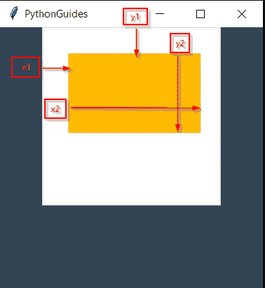
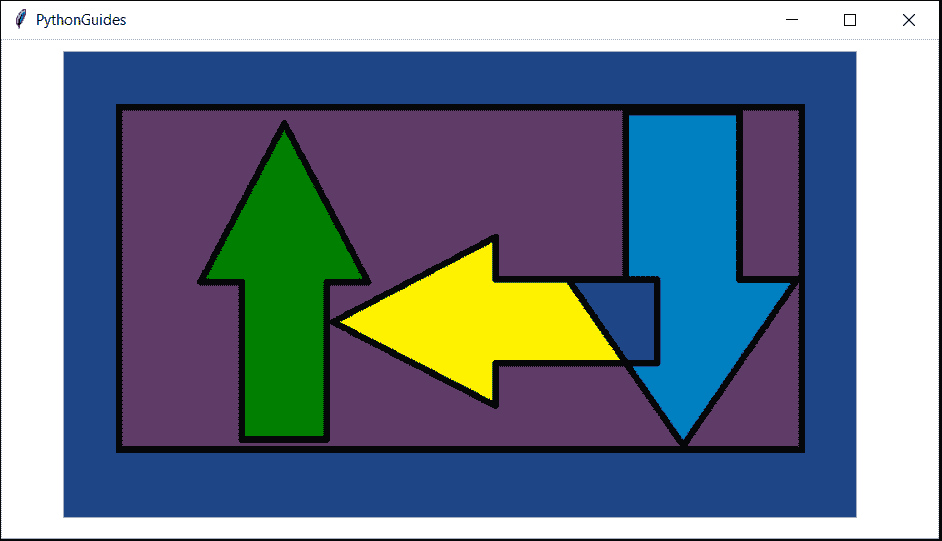
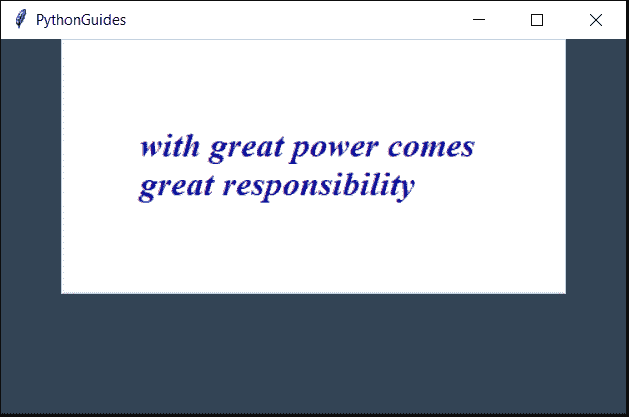
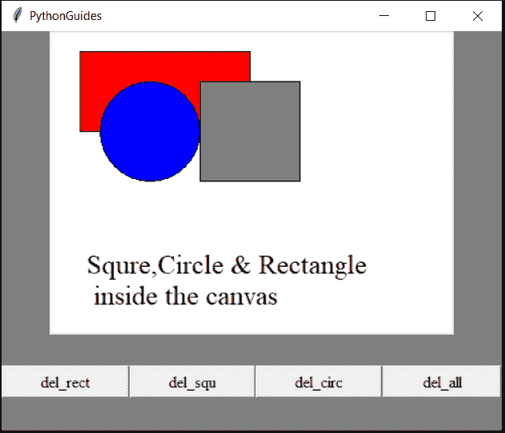
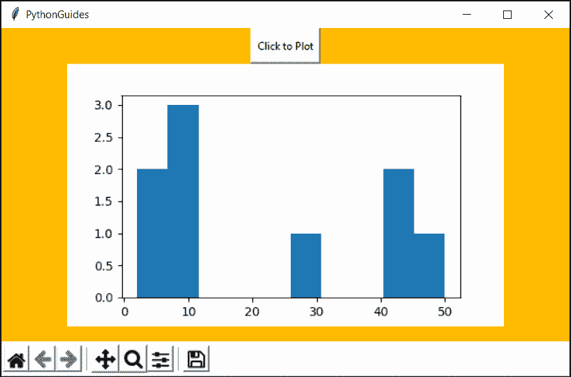

# Python Tkinter 画布教程

> 原文：<https://pythonguides.com/python-tkinter-canvas/>

[](https://sharepointsky.teachable.com/p/python-and-machine-learning-training-course)

在本 [Python 教程](https://pythonguides.com/learn-python/)中，我们将详细讨论 `Python Tkinter Canvas` 。我们还将涵盖以下主题:

*   Python Tkinter 画布教程
*   使用 Python Tkinter 画布创建矩形
*   使用 Python Tkinter Canvas 添加图像
*   使用 Python Tkinter 画布添加文本
*   清除 Python Tkinter 画布中的画布对象
*   在 python tkinter 画布中使用 matplotlib
*   更改 Python Tkinter 画布的大小

目录

[](#)

*   [Python Tkinter 画布教程](#Python_Tkinter_Canvas_Tutorial "Python Tkinter Canvas Tutorial")
*   [Python Tkinter 画布矩形](#Python_Tkinter_Canvas_Rectangle "Python Tkinter Canvas Rectangle")
*   [Python Tkinter 画布图像](#Python_Tkinter_Canvas_Image "Python Tkinter Canvas Image")
*   [Python Tkinter Canvas Text](#Python_Tkinter_Canvas_Text "Python Tkinter Canvas Text")
*   [Python Tkinter Canvas Clear](#Python_Tkinter_Canvas_Clear "Python Tkinter Canvas Clear")
*   [python tkinter canvas matplot lib](#Python_Tkinter_Canvas_Matplotlib "Python Tkinter Canvas Matplotlib")
*   [Python Tkinter 画布大小](#Python_Tkinter_Canvas_Size "Python Tkinter Canvas Size")

## Python Tkinter 画布教程

*   像其他小部件一样，画布也是一个具有多种用途的小部件。
*   Canvas 是一个绘图小部件，它也可以保存其他小部件。
*   使用画布 2D 对象可以创建像文本，圆形，矩形等。
*   在画布中，x & y 坐标在左上角的值为 0。
*   向右移动增加 x 值，向左移动增加 y 值。
*   python Tkinter canvas 的层是根据放置顺序决定的，这意味着放置在最终样式中的对象位于顶层。

> 如果您是 Python Tkinter 或 Python GUI 编程的新手，请查看 [Python GUI 编程(Python Tkinter)](https://pythonguides.com/python-gui-programming/) 和 [Python Tkinter 拖放](https://pythonguides.com/python-tkinter-drag-and-drop/)。

## Python Tkinter 画布矩形

*   `Python Tkinter Canvas` 内置了创建形状的功能。
*   创建矩形使用 create_rectangle()方法。
*   这个方法接受 4 个参数 x1，y1，x2，y2。这里 x1 和 y1 是左上角的坐标，x2 和 y2 是右下角的坐标。

**代码:**

下面是解释**使用画布**创建 python tkinter 矩形的代码。

```py
from tkinter import *

ws = Tk()
ws.title('PythonGuides')
ws.geometry('300x300')
ws.config(bg='#345')

canvas = Canvas(
    ws,
    height=200,
    width=200,
    bg="#fff"
    )

canvas.pack()

canvas.create_rectangle(
    30, 30, 180, 120,
    outline="#fb0",
    fill="#fb0")

ws.mainloop()
```

**输出:**

在这个输出中，矩形是使用 `python tkinter Canvas` 创建的。



python tkinter rectangle using canvas

如果你对 x1，y1，x2，y2 坐标感到困惑，这里有相同的解释。x1 将对象推向右侧或东方。，y1 将对象推向南方。X2 和 Y2 向东南方向扩展矩形。



python tkinter rectangle using canvas

## Python Tkinter 画布图像

*   在本教程中，我们将学习在 Python Tkinter Canvas 中实现一个图像。
*   我们创造了一个简单的。使用 ms paint 的 png 图像，用于演示目的。
*   首先，我们将创建一个画布部件，并为其提供高度和宽度。
*   **`PhotoImage()`** 该方法用于读取图像，其值存储在 `img` 变量中。
*   `canvas.create_image(x, y, image=img_path)`
*   这里， `x` 向右扩展图像，而 `y` 向下扩展图像。
*   **图像**选项保存文件名。

**代码:**

```py
from tkinter import *
from tkinter import *

ws = Tk()
ws.title('PythonGuides')
ws.geometry('750x400')
ws.config(bg='#345')

canvas = Canvas(
    ws,
    height=500,
    width=1000,
    bg="#fff"
    )

canvas.pack()

img = PhotoImage(file="python-tkinter-canvas-image-for-use.png")
canvas.create_image(370, 200, image=img)

ws.mainloop()
```

**输出:**

在此输出中，使用 Python Tkinter 中的 canvas 显示图像。



Python Tkinter Canvas Image

## Python Tkinter 画布文本

*   这篇课文提到了字母表的排列。
*   我们可以使用`canvas.create_text(x, y)`在 python Tkinter 画布中放置文本。这里 x & y 是文本的位置。

**代码:**

在这段代码中，显示了 python tkinter 画布文本。

```py
from tkinter import *

ws = Tk()
ws.title('PythonGuides')
ws.geometry('500x300')
ws.config(bg='#345')

canvas = Canvas(
    ws,
    height=200,
    width=400,
    bg="#fff"
    )

canvas.pack()

canvas.create_text(
    200,100,
    fill="darkblue",
    font="Times 20 italic bold",
    text="with great power comes \ngreat responsibility")

ws.mainloop()
```

**输出:**

在这个输出中，我们可以看到文本是使用 python tkinter canvas 显示的。



python tkinter canvas text

## Python Tkinter Canvas Clear

*   在本节中，我们将学习如何**删除**或**清除**python Tkinter 画布。
*   delete 方法用于清除画布或画布的特定对象。
*   要删除整个画布，使用`canvas.delete("all")`
    *   这里 canvas 是存储 Canvas 小部件值的变量。
    *   `all` 是一个内置功能，用于删除画布内的所有内容。
    *   要删除画布中的特定对象，请提供**标签**名称来代替“all”。
*   **标签**可以通过使用关键字标签后跟任何名称来创建。
*   示例:canvas.create_rectangle(100，30，400，200，fill="red "，tags="rect ")
    *   `canvas.delete("rect")`
    *   这段代码将只删除标签为 rect 的矩形。
*   可以为多个对象提供相同的标记名。
*   并且当 delete 方法用于所提供的标签时，这些对象将被删除。

**代码:**

在这段代码中，我们创建了多个对象&我们创建了删除这些对象的按钮。点击 `del_rect` 按钮删除矩形，点击 `del_squ` 按钮删除正方形，点击 `del_all` 按钮删除所有对象。

```py
from tkinter import *

ws = Tk()
ws.title('PythonGuides')
ws.geometry('500x400')
ws.config(bg='grey')

canvas = Canvas(
    ws,
    height=300,
    width=400,
    bg="#fff",
    )

canvas.pack()

canvas.create_rectangle(
    30, 20, 200, 100,
    fill="red", 
    tags="rect",
    )

canvas.create_oval(
    150, 150, 50, 50,
    fill="blue",
    tag="circ"
    )

canvas.create_rectangle(
    150, 50, 250, 150,
    fill="grey",
    tag="squa"
    )

canvas.create_text(
    180, 250,
    font= "Times 20",
    text="Squre,Circle & Rectangle \n inside the canvas",
    tag='txt'
    )

btn1 = Button(
    ws,
    text='del_rect',
    font="Times 12",
    command=lambda:canvas.delete("rect")
    )

btn1.pack(side=LEFT, fill=X, expand=True)

btn2 = Button(
    ws,
    text='del_squ',
    font="Times 12",
    command=lambda:canvas.delete("squa")
    )

btn2.pack(side=LEFT, fill=X, expand=True)

btn3 = Button(
    ws,
    text='del_circ',
    font="Times 12",
    command=lambda:canvas.delete("circ")
    )

btn3.pack(side=LEFT, fill=X, expand=True)

btn4 = Button(
    ws,
    text='del_all',
    font="Times 12",
    command=lambda:canvas.delete("all")
    )

btn4.pack(side=LEFT, fill=X, expand=True)

ws.mainloop() 
```

**输出:**

在这个输出中，显示了圆形、正方形、矩形和文本。底部有四个按钮。每个按钮将**清除**屏幕上的一个对象。``del_all` the` 按钮将清除画布上的一切。



Python Tkinter Canvas Clear

## python tkinter canvas matplot lib

*   在本节中，我们将学习在 python Tkinter canvas 中使用 matplotlib
*   Matplotlib 是一个 python 库，用于以可视化形式绘制数据。它广泛应用于数据分析。它把数据变成图表、直方图等。
*   matplotlib 是一个外部库，使用前需要安装。
*   该命令将安装 matplotlib
*   一旦安装了 matplotlib，我们需要导入库。
*   `backend_tkagg` 模块用于使用 matplotlib 在画布上绘图
*   这个模块在 `matplotlib.backend` 里面。
*   此外，我们需要从 matplotlib 导入图形。数字
*   图决定绘图区域的大小也提供了一个重要的工具栏。


Toolbar

**代码:**

在这段代码中，我们用直方图绘制了数据。

```py
from tkinter import *
from matplotlib.figure import Figure 
from matplotlib.backends.backend_tkagg import *

def click_toplot(): 
    fig = Figure(
        figsize = (5, 3),
        dpi = 100
        ) 

    #change this data to see difference
    y = [2, 10, 30, 10, 5, 8, 50, 44, 41] 

    plot1 = fig.add_subplot(111) 

    plot1.hist(y) 

    canvas = FigureCanvasTkAgg(
        fig,
        master = ws) 
    canvas.draw() 
    canvas.get_tk_widget().pack() 

    toolbar = NavigationToolbar2Tk(
        canvas,
        ws
        ) 

    toolbar.update() 
    canvas.get_tk_widget().pack() 

ws = Tk() 
ws.title('PythonGuides') 
ws.geometry("650x400") 
ws.config(bg='#fb0')

plot_button = Button(master=ws,
					command = click_toplot, 
					text = "Click to Plot") 

plot_button.pack() 

ws.mainloop() 
```

**输出:**

在这个输出中，数据以直方图的方式显示。



Python Tkinter Canvas Matplotlib

## Python Tkinter 画布大小

*   Python Tkinter 画布的大小可以通过提供高度和宽度来决定。
*   `Height` 是父窗口上画布的垂直位置。
*   **宽度**是父窗口上画布的水平位置。
*   高度和宽度的变化将改变画布的大小。

```py
canvas = Canvas(
    ws,
    height=200,
    width=400,
    bg="#fff"
    )

canvas.pack()
```

*   在这段代码中，我们使用了 `Canvas` 小部件。
*   `ws` 是 Tkinter 的母层。
*   **高度**为画布提供垂直空间
*   **宽度**为画布提供水平空间。
*   `bg` 用来给画布提供背景色。

您可能会喜欢以下 Python Tkinter 画布教程:

*   [Python Tkinter 进度条](https://pythonguides.com/python-tkinter-progress-bar/)
*   [Python Tkinter Stopwatch](https://pythonguides.com/python-tkinter-stopwatch/)
*   [Python Tkinter 列表框](https://pythonguides.com/python-tkinter-listbox/)
*   [Python tkinter messagebox](https://pythonguides.com/python-tkinter-messagebox/)
*   [Python Tkinter 帧](https://pythonguides.com/python-tkinter-frame/)
*   [如何用 Python 制作计算器](https://pythonguides.com/make-a-calculator-in-python/)
*   [Python Tkinter 待办事项列表](https://pythonguides.com/python-tkinter-todo-list/)

在本教程中，我们学习了关于 `python tkinter canvas` 的知识，也涵盖了这些主题。

*   Python Tkinter 画布教程
*   使用 Python Tkinter 画布创建矩形
*   使用 Python Tkinter Canvas 添加图像
*   使用 Python Tkinter 画布添加文本
*   清除 Python Tkinter 画布中的画布对象
*   在 python tkinter 画布中使用 matplotlib
*   更改 Python Tkinter 画布的大小

[Bijay Kumar](https://pythonguides.com/author/fewlines4biju/)

Python 是美国最流行的语言之一。我从事 Python 工作已经有很长时间了，我在与 Tkinter、Pandas、NumPy、Turtle、Django、Matplotlib、Tensorflow、Scipy、Scikit-Learn 等各种库合作方面拥有专业知识。我有与美国、加拿大、英国、澳大利亚、新西兰等国家的各种客户合作的经验。查看我的个人资料。

[enjoysharepoint.com/](https://enjoysharepoint.com/)[](https://www.facebook.com/fewlines4biju "Facebook")[](https://www.linkedin.com/in/fewlines4biju/ "Linkedin")[](https://twitter.com/fewlines4biju "Twitter")