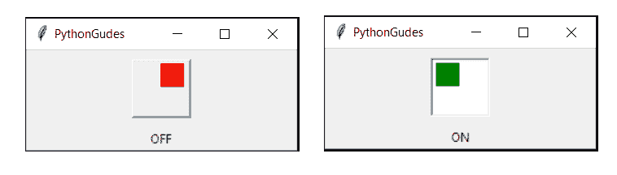
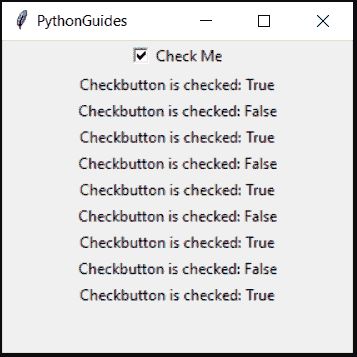

# python Tkinter check button–如何使用

> 原文：<https://pythonguides.com/python-tkinter-checkbutton/>

[](https://sharepointsky.teachable.com/p/python-and-machine-learning-training-course)

在本 [Python 教程](https://pythonguides.com/python-programming-for-the-absolute-beginner/)中，我们将讨论关于 `Python tkinter checkbutton` 。

*   Tkinter Checkbutton python
*   Tkinter Checkbutton 获取值
*   Tkinter 复选按钮图像位置
*   Tkinter Checkbutton 命令
*   Tkinter Checkbutton 默认选中
*   Tkinter Checkbutton 值
*   t 内部检查按钮大小
*   Tkinter Checkbutton 设置值
*   Tkinter 复选按钮取消选择
*   Tkinter 复选按钮取消选择
*   Tkinter 复选按钮网格
*   Tkinter 复选框示例

目录

[](#)

*   [Python Tkinter Checkbutton](#Python_Tkinter_Checkbutton "Python Tkinter Checkbutton")
*   [Tkinter Checkbutton 获取值](#Tkinter_Checkbutton_get_value "Tkinter Checkbutton get value")
*   [Python Tkinter 检查按钮图像位置(指示器开)](#Python_Tkinter_Checkbutton_image_placement_indicatoron "Python Tkinter Checkbutton image placement ( indicatoron )")
*   [t 内部检查按钮命令](#Tkinter_Checkbutton_command "Tkinter Checkbutton command")
*   [Tkinter Checkbutton 默认选中](#Tkinter_Checkbutton_default_checked "Tkinter Checkbutton default checked")
*   [Python Tkinter Checkbutton 值](#Python_Tkinter_Checkbutton_value "Python Tkinter Checkbutton value")
*   [t 内部检查按钮尺寸](#Tkinter_Checkbutton_size "Tkinter Checkbutton size")
*   [t 内部检查按钮设定值](#Tkinter_Checkbutton_set_value "Tkinter Checkbutton set value")
*   [t 内部检查按钮取消选择](#Tkinter_Checkbutton_deselect "Tkinter Checkbutton deselect")
*   [t 内部检查按钮网格](#Tkinter_Checkbutton_grid "Tkinter Checkbutton grid")
*   [Python Tkinter Checkbutton 示例](#Python_Tkinter_Checkbutton_example "Python Tkinter Checkbutton example")

## Python Tkinter Checkbutton

Python GUI 编程新手？，先查看 [Python GUI 编程(Python Tkinter)](https://pythonguides.com/python-gui-programming/) 和[如何使用 Python Tkinter](https://pythonguides.com/python-tkinter-read-text-file/) 读取文本文件。

*   `checkbutton` 是一个方形的方框，点击后会有一个勾号。
*   如果尚未选中，则每次点击**甚至**时，复选标记都会消失。
*   Checkbuttons 类似于 radiobuttons，但它允许多重选择。
*   复选按钮也称为复选框。
*   下面是一个 Checkbutton 的例子


Python Tkinter Checkbutton

## Tkinter Checkbutton 获取值

*   `Get` value 用于从创建 checkbutton 时分配的 checkbutton 中提取值
*   这个值可以是**整数**、**字符串**或**布尔值**。
*   `IntVar()` 用于获取整数值
*   `StringVar()` 用于获取字符串值
*   `BooleanVar` ()用于获取布尔值，即真或假。
*   值可以与 if-else 一起使用，以便在选中或取消选中 checkbutton 时运行您希望发生的任何操作

**代码:**

在这段代码中，我们实现了**获取**值。这里分配给`on value`&`off value`的值是一个整数，这就是为什么 `IntVar()` 被用作变量。

```py
from tkinter import *

ws = Tk()
ws.title('PythonGuides')
ws.geometry('200x80')

def isChecked():
    if cb.get() == 1:
        btn['state'] = NORMAL
        btn.configure(text='Awake!')
    elif cb.get() == 0:
        btn['state'] = DISABLED
        btn.configure(text='Sleeping!')
    else:
        messagebox.showerror('PythonGuides', 'Something went wrong!')

cb = IntVar()

Checkbutton(ws, text="accept T&C", variable=cb, onvalue=1, offvalue=0, command=isChecked).pack()
btn = Button(ws, text='Sleeping!', state=DISABLED, padx=20, pady=5)
btn.pack()

ws.mainloop()
```

**输出:**

在这个输出中， `get` 用于比较值，然后相应地改变按钮状态&文本。如您所见，如果**复选框**被选中，则按钮状态为**正常** &有文本“**唤醒**”，而当**复选框按钮**未被选中时，则按钮状态为**禁用** &文本显示“**睡眠**！”


Tkinter Checkbutton get value

阅读: [Python Tkinter 文本框小工具](https://pythonguides.com/python-tkinter-text-box/)

## Python Tkinter 检查按钮图像位置(指示器开)

*   可以通过将 indicatoron 设置为 False 来放置图像。
*   **指示器**负责创建一个带有复选标记的方框
*   将 indicatoron 设置为 false 会删除默认指示器。

```py
from tkinter import *
ws = Tk()
ws.title('PythonGudes')
ws.geometry('200x100')

def switchState():
    if cb1.get() == 1:
       disp_Lb.config(text='ON')

    elif cb1.get() == 0:
        disp_Lb.config(text='OFF')
    else:
        disp_Lb.config(text='error!')

switch_on = PhotoImage(width=50, height=50)
switch_off = PhotoImage(width=50, height=50)

switch_on.put(("green",), to=(0, 0, 23,23))
switch_off.put(("red",), to=(24, 0, 47, 23))
cb1 = IntVar()
Checkbutton(ws, image=switch_off, selectimage=switch_on, onvalue=1, offvalue=0, variable=cb1, indicatoron=False, command=switchState).pack(padx=20, pady=10)
disp_Lb = Label(ws)
disp_Lb.pack()
ws.mainloop()
```

**输出:**

在这个输出中，我们显示了一个可以用作开关的 Checkbutton。这个开关有两种颜色'红色'和'绿色'。每次点击，它都会在这些颜色之间切换。此外，还有一个消息框，显示绿色的**开**和红色的**关**。



Python Tkinter Checkbutton image

阅读: [Python Tkinter Colors](https://pythonguides.com/python-tkinter-colors/)

## t 内部检查按钮命令

*   该命令用于传递任何函数或方法。
*   命令包含当选择或取消选择 checkbutton 时将执行的操作的指令。
*   使用关键字 command，后跟函数名。

**代码:**

```py
from tkinter import *

ws = Tk()
ws.title('PythonGuides')
ws.geometry('200x250')

def isChecked():
    return Label(ws, text=f'Checkbutton is checked: , {cb.get()}').pack()

cb = BooleanVar()
checkme = Checkbutton(ws, text='Check Me',variable = cb, onvalue=True, offvalue=False, command=isChecked)
checkme.pack()

ws.mainloop()
```

**输出:**

在此输出中，创建了一个函数来以布尔形式显示按钮状态，即真或假。该函数作为命令在复选框中传递。现在，每次如果 checkbutton 被选中，它就打印 True，否则打印 False。



Python Tkinter Checkbutton get value

## Tkinter Checkbutton 默认选中

*   这意味着 cehck 框已经被选中。
*   为此，我们需要做的就是在变量中提供值
*   示例:`cb = IntVar(value=1)`


Tkinter Checkbutton default checked

## Python Tkinter Checkbutton 值

*   值在 Checkbutton 和 Radiobutton 中都起着重要的作用
*   **值**的类型由**变量决定。**
*   如果变量是 `IntVar()` 这意味着值将是一个整数
*   如果变量是 `StringVar()` 这意味着值将是字符串。
*   如果变量是 `BooleanVar()` 这意味着值将为真或假
*   checkbutton 有两种类型的值:`on value`&`off value`。
*   `onvalue` :选中复选框时返回提供的值。
*   **offvalue:** 返回复选框未选中时提供的值。
*   通常 `onvalue=1` 和 `offvalue=0`

**语法:**

```py
cb = IntVar()

Checkbutton(ws, text="any text", variable=cb, onvalue=value, offvalue=value, command=function/method).pack()
```

**代码:**

在本例中，我们将**on 值**作为 `5` ，将**off 值**作为 `6` 进行演示。

```py
from tkinter import *

ws = Tk()
ws.title('PythonGuides')
ws.geometry('200x80')

def isChecked():
    if cb.get() == 5:
        btn['state'] = NORMAL
        btn.configure(text='Awake!')
    elif cb.get() == 6:
        btn['state'] = DISABLED
        btn.configure(text='Sleeping!')
    else:
        messagebox.showerror('PythonGuides', 'Something went wrong!')

cb = IntVar(value=1)

Checkbutton(ws, text="accept T&C", variable=cb, onvalue=5, offvalue=6, command=isChecked).pack()
btn = Button(ws, text='Sleeping!', state=DISABLED, padx=20, pady=5)
btn.pack()

ws.mainloop()
```

**输出:**

输出没有区别，因为这是与上一节相同的程序。但是在这里，我们将**开值**指定为 `5` ，将**关值**指定为 `6`


Python Tkinter Checkbutton value

## t 内部检查按钮尺寸

*   无法更改 Checkbutton 的大小。
*   高度和宽度将改变复选按钮的位置。
*   可以根据需要的大小放置图像。
*   要了解更多>>请查看我们的 Tkinter Checkbutton 图像放置部分。

## t 内部检查按钮设定值

*   `Set` value 用于设置 checkbutton 的默认值。
*   设定值将取决于所用变量的类型。
*   如果变量是整数，则集合中传递的参数必须是整数。
*   为了更好地理解，我们将使用**检查按钮值**部分中的示例
*   在该示例中，未选中条款和条件的 checkbutton
*   但是我们会把它设置为检查。所以每次程序执行的时候，这个框都已经被选中了。

**代码:**

在这段代码中，我们将 checkbutton 的值设置为 1，表示它已被选中。

```py
from tkinter import *

ws = Tk()
ws.title('PythonGuides')
ws.geometry('200x80')

def isChecked():
    if cb.get() == 1:
        btn['state'] = NORMAL
        btn.configure(text='Awake!')
    elif cb.get() == 0:
        btn['state'] = DISABLED
        btn.configure(text='Sleeping!')
    else:
        messagebox.showerror('PythonGuides', 'Something went wrong!')

cb = IntVar()
cb.set(1)
Checkbutton(ws, text="accept T&C", variable=cb, onvalue=1, offvalue=0, command=isChecked).pack()
btn = Button(ws, text='Sleeping!', state=DISABLED, padx=20, pady=5)
btn.pack()

ws.mainloop()
```

**输出:**

在这个输出中，checkbutton 已经被选中。


## t 内部检查按钮取消选择

*   “取消选择”用于从 checkbutton 中删除复选标记。
*   如果用户想清除选择，在这种情况下，取消选择使用
*   取消选择是一个函数&不需要参数。

**代码:**

在这段代码中，创建了多个 check button，这些 check button 默认设置为选中。有一个按钮可以取消所有的复选按钮。

```py
from tkinter import *

ws = Tk() 
ws.geometry('300x250')
ws.title('Python Guides')

def clear_selection():
    cb1.deselect()
    cb2.deselect()
    cb3.deselect()
    cb4.deselect()
    cb5.deselect()
    cb6.deselect()

var = BooleanVar() 
var.set(True)

cb1 = Checkbutton(ws, text='Click me!', variable=var)
cb1.pack()
cb2 = Checkbutton(ws, text='Click me!', variable=var)
cb2.pack()
cb3 = Checkbutton(ws, text='Click me!', variable=var)
cb3.pack()
cb4 = Checkbutton(ws, text='Click me!', variable=var)
cb4.pack()
cb5 = Checkbutton(ws, text='Click me!', variable=var)
cb5.pack()
cb6 = Checkbutton(ws, text='Click me!', variable=var)
cb6.pack()

Button(ws, text='Deselect All Check buttons', command=clear_selection).pack()

ws.mainloop()
```

**输出:**

在这些输出中，第一个图像显示了代码的执行。而第二个图像显示了单击时取消选中 checkbuttons。使用取消选择功能可以取消选择多个复选按钮。


## t 内部检查按钮网格

*   网格是一个几何管理器。
*   它将小部件放置在一个**行** & **列**格式中

**代码:**

在这段代码中，使用**网格**创建 checkbuttons。提供给 checkbutton 的名称是指它们在**行**和**列**格式中的位置。

```py
from tkinter import *

ws = Tk()
ws.title('PythonGuides')
ws.geometry('300x250')
ws.config(bg="grey")

Checkbutton(ws, text='0, 0').grid(row=0, column=0)
Checkbutton(ws, text='0, 1').grid(row=0, column=1)
Checkbutton(ws, text='0, 2').grid(row=0, column=1)
Checkbutton(ws, text='1, 0').grid(row=1, column=0)
Checkbutton(ws, text='1, 1').grid(row=1, column=1)
Checkbutton(ws, text='1, 2').grid(row=1, column=2)
Checkbutton(ws, text='2, 0').grid(row=2, column=0)
Checkbutton(ws, text='2, 1').grid(row=2, column=1)
Checkbutton(ws, text='2, 2').grid(row=2, column=2)

ws.mainloop()
```

**输出:**

在这个输出中，名为 **1，2** 的 Checkbutton 表示它位于第二列的第一行。同样，所有的复选按钮都根据它们的位置来命名。


## Python Tkinter Checkbutton 示例

让我们来看一个 **Python Tkinter Checkbutton 的例子**。

举个例子，我们正在做一个迷你项目。我们正在创建一个简单的表格，将接受用户的详细信息&用户将无法点击提交按钮，直到他检查条款和条件。

**代码:**

```py
from tkinter import *
from tkinter import messagebox

ws =Tk()
ws.title('PythonGuides')
ws.geometry('250x300')
ws.configure(bg='#dddddd')

def selection():
    choice = var.get()
    if choice == 1:
        m = 'Ms.'
    elif choice == 2:
        m = 'Mr.'
    elif choice == 3:
        pass
    return m

def submit():
    try:
        name = name_Tf.get()
        m = selection()
        return messagebox.showinfo('PythonGuides', f'{m} {name}, submitted form.')
    except Exception as ep:
        return messagebox.showwarning('PythonGuides', 'Please provide valid input')

def termsCheck():
    if cb.get() == 1:
        submit_btn['state'] = NORMAL
    else:
        submit_btn['state'] = DISABLED
        messagebox.showerror('PythonGuides', 'Accept the terms & conditions')

frame1 = Label(ws, bg='#dddddd')
frame1.pack()
frame2 = LabelFrame(frame1, text='Gender', padx=30, pady=10)

var =IntVar()
cb = IntVar()

Label(frame1, text='Full Name').grid(row=0, column=0, padx=5, pady=5)
Label(frame1, text='Email').grid(row=1, column=0, padx=5, pady=5)
Label(frame1, text='Password').grid(row=2, column=0, padx=5, pady=5)
Radiobutton(frame2, text='Female', variable=var, value=1,command=selection).pack()
Radiobutton(frame2, text='Male', variable=var, value=2,command=selection).pack(anchor=W)
Radiobutton(frame2, text='Others', variable=var, value=3,command=selection).pack()
name_Tf = Entry(frame1)
name_Tf.grid(row=0, column=2)
Entry(frame1).grid(row=1, column=2)
Entry(frame1, show="*").grid(row=2, column=2)
frame2.grid(row=3, columnspan=3,padx=30)
Checkbutton(frame1, text='Accept the terms & conditions', variable=cb, onvalue=1, offvalue=0,command=termsCheck).grid(row=4, columnspan=4, pady=5)
submit_btn = Button(frame1, text="Submit", command=submit, padx=50, pady=5, state=DISABLED)
submit_btn.grid(row=5, columnspan=4, pady=2)

ws.mainloop()
```

**输出:**

*   在这个输出中，使用 python Tkinter 创建了一个简单的表单。
*   使用了像**标签、条目、单选按钮、复选按钮、框架、标签框架、**和**按钮**这样的小部件。
*   按钮将保持在**禁用**状态，直到**检查按钮**被检查。
*   该程序接受用户的详细信息，并在提交消息时提示标题、名称。


Tkinter Checkbutton example

这是这个程序的另一个输出截图。在这种情况下，按钮处于正常状态。


Tkinter Checkbutton example

您可能会喜欢以下 python 教程:

*   [Python Tkinter 单选按钮–如何使用](https://pythonguides.com/python-tkinter-radiobutton/)
*   [Python Tkinter 按钮–如何使用](https://pythonguides.com/python-tkinter-button/)
*   [Python Tkinter 条目–如何使用](https://pythonguides.com/python-tkinter-entry/)
*   [Python tkinter 标签–如何使用](https://pythonguides.com/python-tkinter-label/)
*   [Python 生成随机数和字符串](https://pythonguides.com/python-generate-random-number/)
*   [Python 格式数字加逗号](https://pythonguides.com/python-format-number-with-commas/)
*   [Python 将列表写入文件，并附有示例](https://pythonguides.com/python-write-list-to-file/)
*   [Python 将字符串写入文件](https://pythonguides.com/python-write-string-to-a-file/)
*   [Python tkinter messagebox +示例](https://pythonguides.com/python-tkinter-messagebox/)
*   [Python Tkinter 退出程序](https://pythonguides.com/python-tkinter-exit-program/)

在本教程中，我们已经了解了 `Python Tkinter checkbutton` 。此外，我们已经讨论了这些主题。

*   Tkinter Checkbutton python
*   Tkinter Checkbutton 获取值
*   Tkinter 复选按钮图像位置
*   Tkinter Checkbutton 命令
*   Tkinter Checkbutton 默认选中
*   Tkinter Checkbutton 值
*   t 内部检查按钮尺寸
*   Tkinter Checkbutton 设置值
*   Tkinter 复选按钮取消选择
*   Tkinter 复选按钮网格
*   Tkinter 复选框示例

[Bijay Kumar](https://pythonguides.com/author/fewlines4biju/)

Python 是美国最流行的语言之一。我从事 Python 工作已经有很长时间了，我在与 Tkinter、Pandas、NumPy、Turtle、Django、Matplotlib、Tensorflow、Scipy、Scikit-Learn 等各种库合作方面拥有专业知识。我有与美国、加拿大、英国、澳大利亚、新西兰等国家的各种客户合作的经验。查看我的个人资料。

[enjoysharepoint.com/](https://enjoysharepoint.com/)[](https://www.facebook.com/fewlines4biju "Facebook")[](https://www.linkedin.com/in/fewlines4biju/ "Linkedin")[](https://twitter.com/fewlines4biju "Twitter")