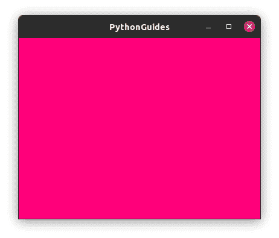
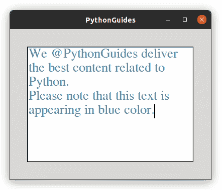
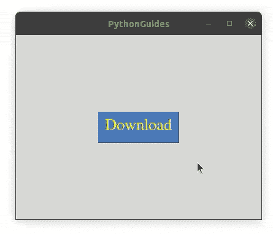
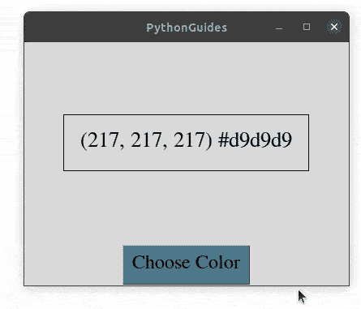
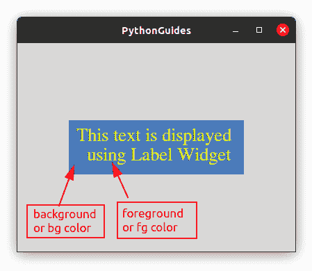
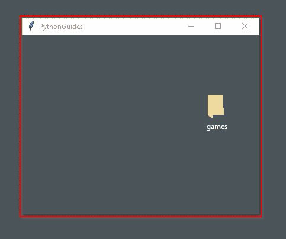
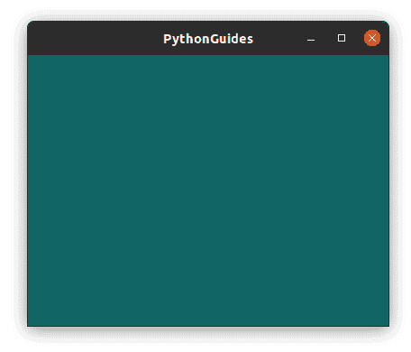

# Python Tkinter 颜色+示例

> 原文：<https://pythonguides.com/python-tkinter-colors/>

[](https://sharepointsky.teachable.com/p/python-and-machine-learning-training-course)

在这个 Python 教程中，我们将学习如何使用 [Python Tkinter](https://pythonguides.com/python-gui-programming/) 实现颜色。下面就让我们详细了解一下 `Python Tkinter colors` 的搭配要点:

*   Python Tkinter 颜色
*   Python Tkinter 颜色 RGB
*   Python Tkinter 颜色文本
*   Python Tkinter 颜色按钮
*   Python Tkinter 颜色选择器
*   Python Tkinter 颜色标签
*   Python Tkinter 彩色透明
*   Python Tkinter 颜色窗口

目录

[](#)

*   [Python Tkinter Colors](#Python_Tkinter_Colors "Python Tkinter Colors")
*   [Python Tkinter Colors RGB](#Python_Tkinter_Colors_RGB "Python Tkinter Colors RGB")
*   [Python Tkinter 彩色文本](#Python_Tkinter_Color_Text "Python Tkinter Color Text")
*   [Python Tkinter 颜色按钮](#Python_Tkinter_Color_Button "Python Tkinter Color Button")
*   [Python Tkinter 颜色选择器](#Python_Tkinter_Color_Chooser "Python Tkinter Color Chooser")
*   [Python Tkinter Color Label](#Python_Tkinter_Color_Label "Python Tkinter Color Label")
*   [Python Tkinter 彩色透明](#Python_Tkinter_Color_Transparent "Python Tkinter Color Transparent")
*   [Python Tkinter 颜色窗口](#Python_Tkinter_Color_Window " Python Tkinter Color Window")

## Python Tkinter Colors

颜色在应用程序的用户界面/UX 中扮演着重要的角色。它为应用程序添加了专业的风格，有助于用户更长时间的参与。

*   每种颜色背后都有一些想法，为应用程序选择正确的颜色是一门艺术&需要时间来掌握它。
*   红色象征一个错误，绿色意味着没问题或完成了，黄色意味着某事没有完成，等等。
*   每种颜色都有两种东西，开发者/用户可以提供其中任何一种:
    *   **颜色名称**:‘白烟’、‘红色’、‘花白色’、‘蓝色’等
    *   **颜色代码** : #F5F5F5、#FF0000、#FFFAF0、0000FF 等

阅读: [Python Tkinter 自动完成](https://pythonguides.com/python-tkinter-autocomplete/)

## Python Tkinter Colors RGB

Python Tkinter 不支持 RGB 格式的颜色输入，但是我们可以创建一个接受 RGB 格式输入的变通方法。

*   在下面的程序中，你可以注意到我们创建了一个接受用户输入的函数，它添加了井号(#)作为前缀，字节码作为后缀。
*   现在，在提供背景颜色的同时，我们使用了这个函数并提供了 RGB 值。

```py
from tkinter import *

def rgb_hack(rgb):
    return "#%02x%02x%02x" % rgb  

ws = Tk()
ws.title('PythonGuides')
ws.geometry('400x300')
ws.config(bg=rgb_hack((255, 0, 122))) 
ws.mainloop()
```

**输出:**

在这个输出中，您可以看到窗口在代码中以 RGB 格式传递了一种颜色。



Python Tkinter Color RGB

阅读: [Python Tkinter 主循环示例](https://pythonguides.com/python-tkinter-mainloop/)

## Python Tkinter 彩色文本

在这一节中，我们将学习如何在 Python Tkinter 中设置文本的颜色。

*   **前景**或 `fg` 是接受用户颜色输入并设置字体或文本颜色的选项。
*   这个选项在几乎所有的小部件中都很常见，可以应用于任何小部件的文本。
*   在我们的例子中，我们将在文本框小部件上实现颜色。默认情况下，文本颜色是蓝色的，但我们将改变它为蓝色。

```py
from tkinter import *

ws = Tk()
ws.title('PythonGuides')
ws.config(bg='#D9D8D7')
ws.geometry('400x300')

tb = Text(
    ws,
    width=25, 
    height=8,
    font=('Times', 20),
    wrap='word',
    fg='#4A7A8C'
)
tb.pack(expand=True)

ws.mainloop()
```

**Python Tkinter 颜色文本的输出**

在这个输出中，我们将文本的默认颜色从黑色改为浅蓝色。



Python Tkinter Text Color

阅读: [Python Tkinter 滚动条](https://pythonguides.com/python-tkinter-scrollbar/)

## Python Tkinter 颜色按钮

在这一节中，我们将学习如何在 Python Tkinter 中改变按钮和按钮文本的颜色。

*   Python Tkinter 中的按钮部件主要应用了三种颜色。
    *   按钮文本颜色
    *   按钮背景颜色
    *   单击时按钮的颜色
*   使用关键字**前景**或**前景**可以改变按钮文本颜色。
*   使用关键字**背景**或**背景**可以改变按钮背景颜色。
*   点击时按钮的颜色可以通过使用关键字 `activebackground` 来改变，要改变文本的颜色可以使用 `activeforeground` 。
*   在我们的例子中，我们演示了当指针悬停在按钮上时改变颜色的按钮。

```py
from tkinter import *

ws = Tk()
ws.titlSelect colorSelect colore('PythonGuides')
ws.config(bg='#D9D8D7')
ws.geometry('400x300')

Button(
    ws,
    text='Download',
    font=('Times', 20),
    padx=10,
    pady=10,
    bg='#4a7abc',
    fg='yellow',
    activebackground='green',
    activeforeground='white'
    ).pack(expand=True)

ws.mainloop()
```

**输出:**

在这个输出中，按钮的背景颜色是浅蓝色和黄色文本。当鼠标悬停在按钮上时，按钮会变成绿色背景和白色前景或文本颜色。



Python Tkinter Color Button

阅读: [Python Tkinter 文本框小工具](https://pythonguides.com/python-tkinter-text-box/)

## Python Tkinter 颜色选择器

在这一节中，我们将学习使用 python tkinter 创建一个颜色选择器。

*   Python Tkinter 提供了 `colorchooser` 模块，使用该模块可以显示颜色工具箱。
*   颜色选择器允许用户从颜色托盘中选择颜色。
*   colorchooser 以元组格式返回带有十六进制颜色代码的 RGB 代码。
*   在我们的示例中，我们将创建一个应用程序，允许用户从颜色托盘中选择任何颜色，然后该颜色将显示在标签上。

```py
from tkinter import *
from tkinter import colorchooser

def pick_color():
    color = colorchooser.askcolor(title ="Choose color")
    color_me.config(bg=color[1])
    color_me.config(text=color)

ws = Tk()
ws.title('PythonGuides')
ws.geometry('400x300')

color_me = Label(
    ws,
    text='(217, 217, 217) #d9d9d9',
    font = ('Times', 20),
    relief = SOLID,
    padx=20, 
    pady=20
)
color_me.pack(expand=True)
button = Button(
    ws, 
    text = "Choose Color",
    command = pick_color,
    padx=10,
    pady=10,
    font=('Times', 18),
    bg='#4a7a8c'
    )
button.pack()

ws.mainloop() 
```

**输出:**

在这个输出中，您可以看到当用户单击 choose color 按钮时，会弹出一个颜色托盘。并且标签将颜色变为选定的颜色。



Python Tkinter Color Chooser

这就是如何在 Python Tkinter 中使用**颜色选择器。**

阅读:[Python Tkinter](https://pythonguides.com/python-tkinter-grid/)中的 grid()方法

## Python Tkinter Color Label

在这一节中，我们将学习如何在 Python Tkinter 中**改变标签小部件的颜色。**

*   Python Tkinter 中的 Label 是一个小部件，用于在应用程序上显示文本和图像。
*   我们可以在标签小部件和标签文本上应用颜色。
*   使用背景或 bg 关键字给小部件标签着色，使用**前景**或 `fg` 关键字改变标签小部件的文本颜色。
*   在本例中，我们有一个彩色标签小部件和标签文本。

```py
from tkinter import *

ws = Tk()
ws.title('PythonGuides')
ws.config(bg='#D9D8D7')
ws.geometry('400x300')

Label(
    ws,
    text='This text is displayed \n using Label Widget',
    font=('Times', 20),
    padx=10,
    pady=10,
    bg='#4a7abc',
    fg='yellow'
    ).pack(expand=True)

ws.mainloop()
```

**在此输出中，标签小部件涂有浅蓝色，标签文本涂有黄色**



Python Tkinter Color Label

阅读: [Python Tkinter 选项菜单](https://pythonguides.com/python-tkinter-optionmenu/)

## Python Tkinter 彩色透明

在这一节中，我们将学习如何在 Python Tkinter 中将颜色设置为透明。换句话说，从背景中去除所有的颜色，这样背景的东西开始透过窗口出现。

*   该过程的第一步是使用 `config` 关键字设置窗口的背景颜色。
*   现在在 `wm_attributes()` 中提供相同的背景颜色
*   下面是 **Python Tkinter 颜色透明**的实现。

```py
from tkinter import *

ws = Tk()
ws.title('PythonGuides')
ws.geometry('400x300')

ws.config(bg='#4a7a8c')

ws.wm_attributes('-transparentcolor','#4a7a8c')

ws.mainloop()
```

**这里是 Python Tkinter 颜色透明的输出**

在这个输出中，应用程序是透明的，您看到的颜色是桌面的背景色。



Python Tkinter Color Transparent

## Python Tkinter 颜色窗口

在这一节中，我们将学习如何给 Python Tkinter 的主窗口着色。

*   在 Python Tkinter 中，我们可以通过更改配置来更改小部件的默认设置。
*   要更改配置，我们可以使用关键字**配置**或**配置**。

```py
from tkinter import *

ws = Tk()
ws.title('PythonGuides')
ws.geometry('400x300')
ws.config(bg='#116562')

ws.mainloop()
```

**输出:**

在此输出中，显示的窗口颜色发生了变化。Python Tkinter 窗口的默认颜色是浅灰色，但是我们把它改成了绿色。



Python Tkinter Color Window

您可能会喜欢以下 Python Tkinter 教程:

*   [Python NumPy 0+示例](https://pythonguides.com/python-numpy-zeros/)
*   [检查 Python 中的 NumPy 数组是否为空](https://pythonguides.com/check-if-numpy-array-is-empty/)
*   [Python NumPy Random](https://pythonguides.com/python-numpy-random/)
*   [使用 Tkinter 的 Python 注册表](https://pythonguides.com/registration-form-in-python-using-tkinter/)
*   [从 PDF Python 中提取文本](https://pythonguides.com/extract-text-from-pdf-python/)
*   [使用 Python Tkinter 的身体质量指数计算器](https://pythonguides.com/bmi-calculator-using-python-tkinter/)
*   [Python Tkinter Image](https://pythonguides.com/python-tkinter-image/)
*   [用 Python Tkinter 创建一个贪吃蛇游戏](https://pythonguides.com/create-a-snake-game-in-python/)

在本教程中，我们学习了**如何在 Python Tkinter** 中使用颜色。此外，我们已经讨论了这些主题。

*   Python Tkinter 颜色
*   Python Tkinter 颜色示例
*   Python Tkinter 颜色 RGB
*   Python Tkinter 颜色文本
*   Python Tkinter 颜色按钮
*   Python Tkinter 颜色选择器
*   Python Tkinter 颜色标签
*   Python Tkinter 彩色透明
*   Python Tkinter 颜色窗口

[Bijay Kumar](https://pythonguides.com/author/fewlines4biju/)

Python 是美国最流行的语言之一。我从事 Python 工作已经有很长时间了，我在与 Tkinter、Pandas、NumPy、Turtle、Django、Matplotlib、Tensorflow、Scipy、Scikit-Learn 等各种库合作方面拥有专业知识。我有与美国、加拿大、英国、澳大利亚、新西兰等国家的各种客户合作的经验。查看我的个人资料。

[enjoysharepoint.com/](https://enjoysharepoint.com/)[](https://www.facebook.com/fewlines4biju "Facebook")[](https://www.linkedin.com/in/fewlines4biju/ "Linkedin")[](https://twitter.com/fewlines4biju "Twitter")