# Python Tkinter 拖放

> 原文：<https://pythonguides.com/python-tkinter-drag-and-drop/>

[](https://sharepointsky.teachable.com/p/python-and-machine-learning-training-course)

在这个 [Python 教程](https://pythonguides.com/learn-python/)中，我们将学习如何使用 Python Tkinter 在屏幕上拖放小部件。除了 **Python Tkinter 拖放**，我们将涉及这些主题。

*   Python Tkinter 拖放
*   Python Tkinter 拖放文件
*   Python Tkinter 拖拽列表框
*   Python Tkinter 拖放文件夹
*   Python Tkinter 拖放 ide
*   Python Tkinter Treeview 拖放

目录

[](#)

*   [Python Tkinter 拖拽](#Python_Tkinter_Drag_and_Drop "Python Tkinter Drag and Drop")
*   [Python Tkinter 拖放文件](#Python_Tkinter_Drag_Drop_File "Python Tkinter Drag Drop File")
*   [Python Tkinter 拖拽列表框](#Python_Tkinter_Drag_and_Drop_Listbox "Python Tkinter Drag and Drop Listbox")
*   [Python Tkinter 拖拽文件夹](#Python_Tkinter_Drag_and_Drop_Folder "Python Tkinter Drag and Drop Folder")
*   [Python Tkinter 拖放 ide](#Python_Tkinter_Drag_and_Drop_ide "Python Tkinter Drag and Drop ide")
*   [Python Tkinter Treeview 拖拽](#Python_Tkinter_Treeview_Drag_and_Drop " Python Tkinter Treeview Drag and Drop")

## Python Tkinter 拖拽

*   拖放是指在按住左键的同时移动小工具。用户可以在 x 轴或 y 轴上拖动小部件或对象。
*   根据官方文档，要拖动一个对象，必须将一个事件绑定到一个回调函数。该函数应该调用`**Tkdnd.dnd_start(source, event)**`，其中'**源**是要拖动的对象，'**事件**是调用该调用的事件。
*   我们试过这种方法，但对我们没用。所以我们想出了一个解决办法。
*   拖放涉及三个活动:
    *   鼠标按钮被按下
    *   鼠标被移动
    *   释放鼠标按钮
*   并且所有这些活动都可以通过触发事件来执行。我们将使用鼠标按钮上的事件来拖放一个对象。
*   在更进一步之前，让我们安装拖放所需的重要包。
    *   圣乔治·佩塔西斯的 tkdnd2.8
    *   **【tkinterdnd 2】**由瓣膜鼻子
*   [点击此处](https://sourceforge.net/projects/tkdnd/files/)，跳转到下载 `tkdnd2.8` 的页面
*   [点击这里](https://sourceforge.net/projects/tkinterdnd/files/TkinterDnD2/TkinterDnD2-0.3.zip/download)，下载`tkinternd2`
*   一旦你下载了这两个文件，然后提取它们。
*   导航到安装 Python 的文件夹，将`tkinternd2`文件夹放在`Python/lib/site-packages`&`tkdnd 2.8`文件夹内 `Python/tcl` 文件夹内。

**第一步:**

第一步是下载 `tkdnd2.8` 和`tkinterndd 2`。只要你点击这个[链接](https://sourceforge.net/projects/tkinterdnd/files/TkinterDnD2/TkinterDnD2-0.3.zip/download)，TkinterDnD2 就会被下载。对于 tkdnd2.8，单击此[链接，您将被重定向到下面的](https://sourceforge.net/projects/tkdnd/files/)页面。选择操作系统并下载文件。在我们的案例中，我们正在开发 windows 10。

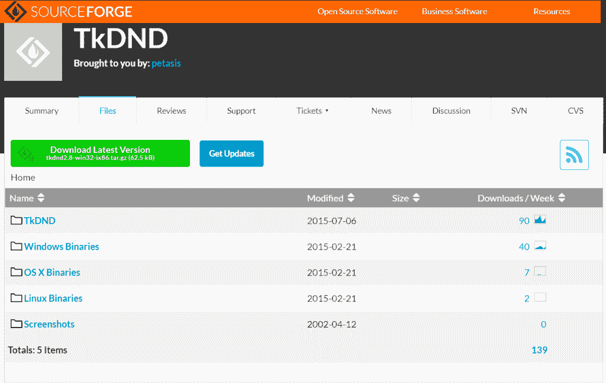

Python Tkinter drag and drop installation

**第三步:**

提取这两个文件并找到 python 的安装路径。在大多数情况下，它安装在这个位置`C:\Users\username\AppData\Local` \ `Python`。在我们的例子中，我们将 python 直接安装在 c 盘上，就像这样`C:\Python`。

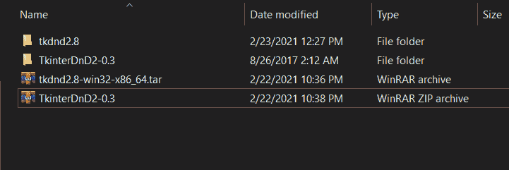

Python Tkinter drag and drop installation

**第四步:**

这是两个文件浏览器的图片，一个有下载文件的路径，而另一个打开了 Python>tcl 文件夹。我们已经将 tkdndn2.8 文件夹拖到了`Python/tcl`文件夹中。

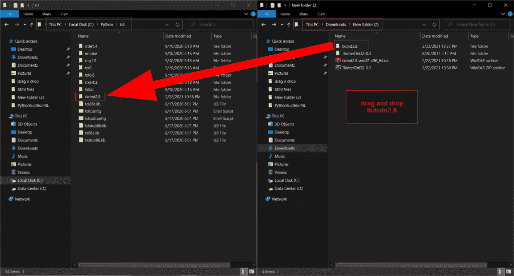

Python Tkinter drag and drop installation

**第五步:**

导航至库，然后导航至 python 文件夹下的顶级站点包。将 TkinterDnD2 文件夹拖放到站点包中。

**注意:**你会在 tkinternd2-0.3 文件夹里找到`tkinternd2`

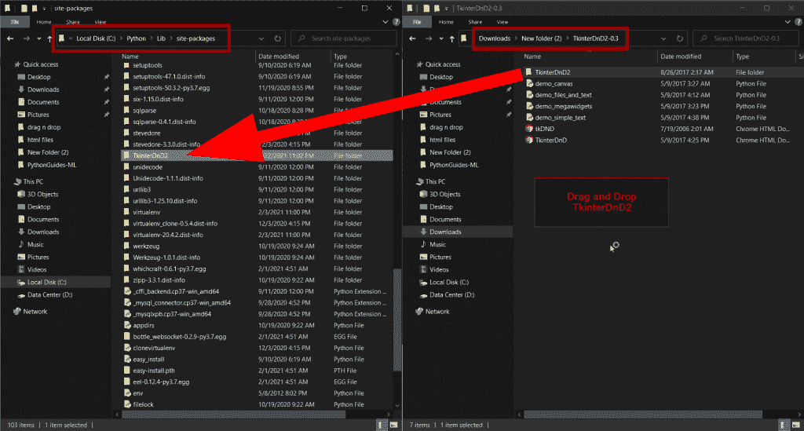

Python Tkinter drag and drop installation

**第六步:**

现在，这只是一个检查包裹是否放在正确位置的测试。在您的 ide 中，如果它自动建议 TkinterDnD2 包，那么这意味着它正在工作。如果您在 idle、notepad 或任何其他不提供自动建议的平台上编写代码，您可以跳过这一步。

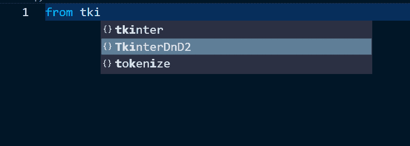

Install Python Tkinter Drag Drop

你可能喜欢看， [Python 二叉树实现](https://pythonguides.com/python-binary-tree/)。

## Python Tkinter 拖放文件

*   在本节中，我们将学习如何拖放文件。文本文件将被拖动到屏幕上，它会打开芳香。这意味着一旦文件被拖动到屏幕上，文件的内容就会显示出来。
*   在这种情况下，我们只使用文本文件，但是您可以阅读任何带有流行扩展名的文件，如 pdf、CSV、word、excel 等。但是为了这个，你必须用熊猫。
*   第一步是导入 Tkinter 和 TkinterDnD2
*   这次我们将指定``ws = TkinterDnD.Tk()``，而不是
*   **该命令使文本框准备好接受拖放的文件。**
*   ****`textarea.dnd_bind('<<Drop>>', show_text)`** 在这里，drop 是一个事件，每次被拖动的文件被释放时都会调用该函数。 `show_text` 是一个会被调用的函数。**
*   ****`show_text()`** 函数保存先删除现有地层的指令，然后检查文件是否有 `txt` 扩展名。如果是，则读取文件并在文本框中显示信息。**

 ****代码:**

下面是代码，文本文件可以被拖动到窗口&它会显示文本。

```py
from tkinter import *
from TkinterDnD2 import *

def show_text(event):
    textarea.delete("1.0","end")
    if event.data.endswith(".txt"):
        with open(event.data, "r") as file:
            for line in file:
                line=line.strip()
                textarea.insert("end",f"{line}\n")

ws = TkinterDnD.Tk()
ws.title('PythonGuides')
ws.geometry('400x300')
ws.config(bg='#fcb103')

frame = Frame(ws)
frame.pack()

textarea = Text(frame, height=18, width=40)
textarea.pack(side=LEFT)
textarea.drop_target_register(DND_FILES)
textarea.dnd_bind('<<Drop>>', show_text)

sbv = Scrollbar(frame, orient=VERTICAL)
sbv.pack(side=RIGHT, fill=Y)

textarea.configure(yscrollcommand=sbv.set)
sbv.config(command=textarea.yview)

ws.mainloop()
```

**输出:**

在这个输出中，虚拟文件是一个包含虚拟文本的文本文件。现在，当这个文件被拖动到窗口上时，就会显示文本。


Python Tkinter Drag Drop File

阅读 [Python Tkinter 笔记本小工具](https://pythonguides.com/python-tkinter-notebook/)

## Python Tkinter 拖拽列表框

*   在本节中，我们将学习如何使用 Python Tkinter 在 Listbox 上拖放对象。
*   `Python Tkinter Listbox` 是一个显示多个项目的小部件。它还允许您选择多个项目。
*   点击下面的链接阅读更多关于 [Python Tkinter Listbox](https://pythonguides.com/python-tkinter-listbox/) 的信息。

**代码:**

在这段代码中，我们创建了一个 Listbox，它将显示拖放到其上的文件或文件夹的路径。多次重复活动将创建一个路径列表。

```py
from tkinter import *
from TkinterDnD2 import *

def addto_listbox(event):
    lb.insert("end", event.data)

ws = TkinterDnD.Tk()
ws.title('PythonGuides')
ws.geometry('400x300')
ws.config(bg='#fcb103')

frame = Frame(ws)
frame.pack()

lb = Listbox(
    frame, 
    width=50,
    height=15,
    selectmode=SINGLE,
    )
lb.pack(fill=X, side=LEFT)
lb.drop_target_register(DND_FILES)
lb.dnd_bind('<<Drop>>', addto_listbox)

sbv = Scrollbar(
    frame,
    orient=VERTICAL
    )
sbv.pack(side=RIGHT, fill=Y)

lb.configure(yscrollcommand=sbv.set)
sbv.config(command=lb.yview)

ws.mainloop()
```

**输出:**

在这个输出中，不同扩展名的六个文件被拖动到 Listbox 上，每个文件路径都被记录下来。

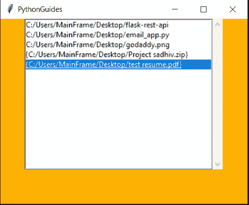

Python Tkinter Drag and Drop Listbox

## Python Tkinter 拖拽文件夹

*   在这一节中，我们将学习如何在 Python Tkinter 中拖放文件夹。
*   这个部分类似于 Python Tkinter 拖放列表框。我们所要做的就是放置一个输入框，而不是列表框。

**代码:**

```py
from tkinter import *
from TkinterDnD2 import *

def drop(event):
    var.set(event.data)

ws = TkinterDnD.Tk()
ws.title('PythonGuides')
ws.geometry('300x200')
ws.config(bg='#fcba03')

var = StringVar()
Label(ws, text='Path of the Folder', bg='#fcba03').pack(anchor=NW, padx=10)
e_box = Entry(ws, textvar=var, width=80)
e_box.pack(fill=X, padx=10)
e_box.drop_target_register(DND_FILES)
e_box.dnd_bind('<<Drop>>', drop)

lframe = LabelFrame(ws, text='Instructions', bg='#fcba03')
Label(
    lframe, 
    bg='#fcba03',
    text='Drag and drop the folder \nof your choice in the above text field.\n You will notice a path over there.'
    ).pack(fill=BOTH, expand=True)
lframe.pack(fill=BOTH, expand=True, padx=10, pady=10)

ws.mainloop()
```

**输出:**

在这个输出中，第一个图像显示了应用程序的界面。用户可以将文件夹拖放到文本字段中。它将显示文件夹的路径。相同的输出显示在下一张图片中。

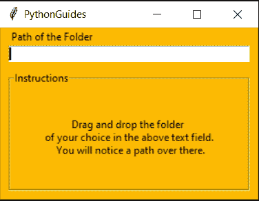

Python Tkinter Drag and Drop Folder

在这张图片中，您可以看到文件夹被拖放到输入框中。现在，路径显示在输入框中。

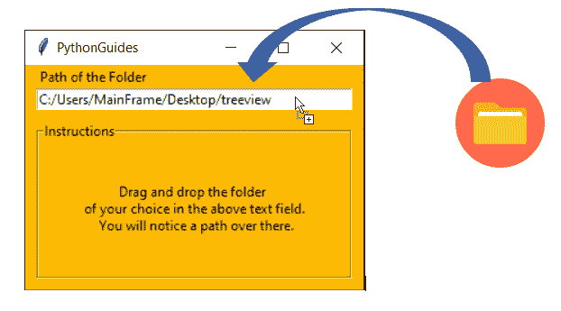

Python Tkinter Drag and Drop Folder

## Python Tkinter 拖放 ide

*   在这一节中，我们将讨论 Tkinter ide，它允许我们通过拖放小部件来轻松地创建界面。
*   有各种各样的选项可以这样做，比如 `pygubu` 、 `visualtk` 等等。我们个人推荐 visualtk。其背后的原因，它是在线的，并且完美地工作。
*   你可以很容易地在屏幕上拖放部件，然后一旦你完成了设计，你就可以切换到代码标签。您可以看到应用程序自动生成的代码。
*   我们已经附上了 [visualtk](https://visualtk.com/) 的图片。您可以看到如何使用简单的界面来创建有效的应用程序。

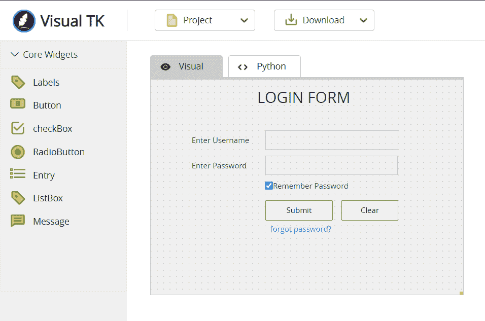

Python Tkinter Drag and Drop ide

下面是上述程序的代码部分的屏幕截图。该代码是自动生成的。

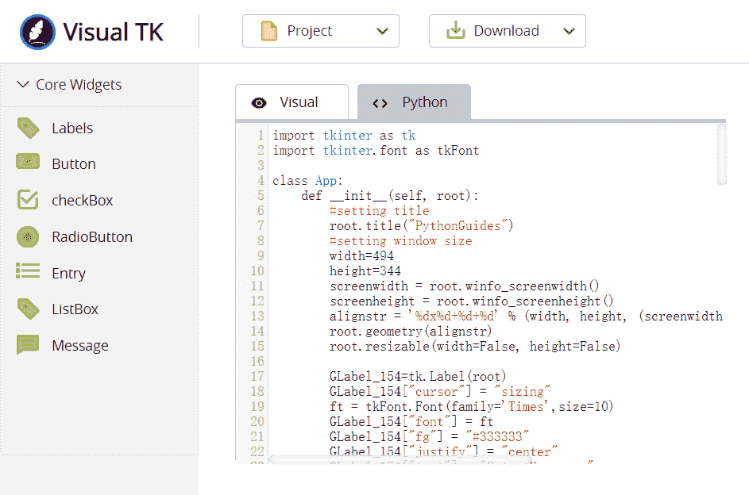

Python Tkinter Drag and Drop ide

##  Python Tkinter Treeview 拖拽

*   在本节中，我们将学习在 Treeview 中拖放项目。
*   Treeview 是数据的表格表示。它还允许创建父子对象。
*   点击下方点击阅读更多关于 [Python Tkinter Treeview](https://pythonguides.com/python-tkinter-treeview/) 。

**代码:**

在这段代码中，我们在一个树形视图中显示了雇员信息。

```py
.from tkinter import *
from tkinter import ttk

def downwars_shift(event):
    tv = event.widget
    select = [tv.index(s) for s in tv.selection()]
    select.append(tv.index(tv.identify_row(event.y)))
    select.sort()
    for i in range(select[0],select[-1]+1,1):
        tv.selection_add(tv.get_children()[i])

def move_down(event):
    tv = event.widget
    if tv.identify_row(event.y) not in tv.selection():
        tv.selection_set(tv.identify_row(event.y))    

def move_up(event):
    tv = event.widget
    if tv.identify_row(event.y) in tv.selection():
        tv.selection_set(tv.identify_row(event.y))    

def upward_shift(event):
    pass

def Movement(event):
    tv = event.widget
    moveto = tv.index(tv.identify_row(event.y))    
    for s in tv.selection():
        tv.move(s, '', moveto)

ws = Tk()
ws.title('PythonGuides')
ws.geometry('400x300')
ws.config(bg='#037272')

tv = ttk.Treeview(ws)
tv['columns']=('Eid', 'Name', 'Department')
tv.column('#0', width=0, stretch=NO)
tv.column('Eid', anchor=CENTER, width=80)
tv.column('Name', anchor=CENTER, width=80)
tv.column('Department', anchor=CENTER, width=80)

tv.heading('#0', text='', anchor=CENTER)
tv.heading('Eid', text='Id', anchor=CENTER)
tv.heading('Name', text='Name', anchor=CENTER)
tv.heading('Department', text='Department', anchor=CENTER)

tv.insert(parent='', index=0, iid=0, text='', values=('E01','Vineet','Cisco'))
tv.insert(parent='', index=1, iid=1, text='', values=('E02','Anil','Design'))
tv.insert(parent='', index=2, iid=2, text='', values=('E03','Vaishali','IT/Security'))
tv.insert(parent='', index=3, iid=3, text='', values=('E04','Vimal','Support'))
tv.insert(parent='', index=4, iid=4, text='', values=('E05','Ankita','HR'))
tv.pack(pady=20)

tv.bind("<ButtonPress-1>",move_down)
tv.bind("<ButtonRelease-1>",move_up, add='+')
tv.bind("<B1-Motion>",Movement, add='+')
tv.bind("<Shift-ButtonPress-1>",downwars_shift, add='+')
tv.bind("<Shift-ButtonRelease-1>",upward_shift, add='+')

style = ttk.Style()
style.theme_use("default")
style.map("Treeview")
ws.mainloop() 
```

**输出:**

在这个输出中，我们显示了雇员信息。

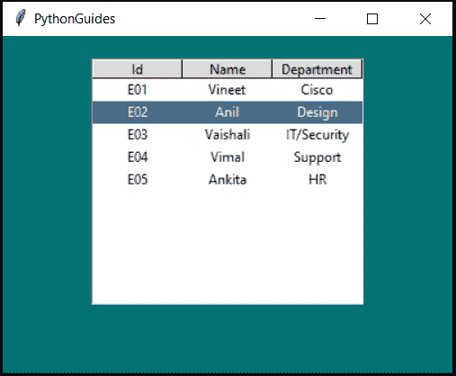

Python Tkinter Treeview Drag and Drop

在第二张图片中，您可以注意到我们将 `E01` 拖到了第三个位置。

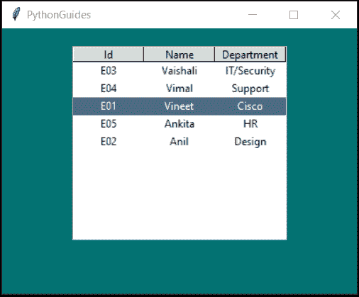

Python Tkinter Treeview Drag and Drop

您可能会喜欢以下 Python Tkinter 教程:

*   [Python Tkinter Map()函数](https://pythonguides.com/python-tkinter-map-function/)
*   [如何使用 Python Tkinter 创建日期时间选择器](https://pythonguides.com/create-date-time-picker-using-python-tkinter/)
*   [如何进入 Python Tkinter 程序的下一页](https://pythonguides.com/go-to-next-page-in-python-tkinter/)
*   [如何使用 Python Tkinter 读取文本文件](https://pythonguides.com/python-tkinter-read-text-file/)
*   [如何使用 Python Tkinter 获取用户输入并存储在变量中](https://pythonguides.com/how-to-take-user-input-and-store-in-variable-using-python-tkinter/)
*   [Python Tkinter 退出程序](https://pythonguides.com/python-tkinter-exit-program/)

在本教程中，我们已经学习了**如何使用 Python Tkinter** 拖放对象。此外，我们已经讨论了这些主题。

*   Python Tkinter 拖放
*   Python Tkinter 拖放文件
*   Python Tkinter 拖放列表框
*   Python Tkinter 拖放文件夹
*   Python Tkinter 拖放 ide
*   Python Tkinter Treeview 拖放

[Bijay Kumar](https://pythonguides.com/author/fewlines4biju/)

Python 是美国最流行的语言之一。我从事 Python 工作已经有很长时间了，我在与 Tkinter、Pandas、NumPy、Turtle、Django、Matplotlib、Tensorflow、Scipy、Scikit-Learn 等各种库合作方面拥有专业知识。我有与美国、加拿大、英国、澳大利亚、新西兰等国家的各种客户合作的经验。查看我的个人资料。

[enjoysharepoint.com/](https://enjoysharepoint.com/)[](https://www.facebook.com/fewlines4biju "Facebook")[](https://www.linkedin.com/in/fewlines4biju/ "Linkedin")[](https://twitter.com/fewlines4biju "Twitter")**