# Python Tkinter 编辑器+示例

> 原文：<https://pythonguides.com/python-tkinter-editor/>

[](https://sharepointsky.teachable.com/p/python-and-machine-learning-training-course)

在本 [Python Tkinter 教程](https://pythonguides.com/python-gui-programming/)中，我们将借助一些例子来了解 **Python Tkinter 编辑器**。我们还将讨论以下主题。

*   Python Tkinter 编辑器
*   Python Tkinter 文本编辑器
*   Python Tkinter 在线编辑器
*   Python Tkinter 代码编辑器
*   Python tkinter GUI 编辑器
*   Python Tkinter JSON 编辑器
*   Python Tkinter 图像编辑器

目录

[](#)

*   [Python Tkinter 编辑器](#Python_Tkinter_Editor "Python Tkinter Editor")
*   [Python Tkinter 文本编辑器](#Python_Tkinter_text_editor "Python Tkinter text editor")
*   [Python Tkinter 在线编辑](#Python_Tkinter_online_editor "Python Tkinter online editor")
*   [Python Tkinter 代码编辑器](#Python_Tkinter_code_editor "Python Tkinter code editor")
*   [Python tkinter GUI 编辑器](#Python_tkinter_GUI_editor "Python tkinter GUI editor")
*   [Python Tkinter JSON 编辑器](#Python_Tkinter_JSON_editor "Python Tkinter JSON editor")
*   [Python Tkinter 图像编辑器](#Python_Tkinter_image_editor "Python Tkinter image editor")

## Python Tkinter 编辑器

在本节中，我们将学习如何使用 Python Tkinter 创建编辑器。但是在学习 Python Tkinter 编辑器之前，我们应该先了解一个“**编辑器**”的知识。

一个**编辑器**是一个空间，用户可以在这里编写代码、文本、信息或任何有用的文本。它还包括为文章、报纸等选择、准备和撰写任何文本的过程。

**代码:**

在下面的代码中，我们必须制作一个框架，在这个框架中，有一个编辑器，用户可以在其中的一个框中插入文本。

```py
from tkinter import *

ws = Tk()

ws.geometry('500x500')
ws.title("Python Guides")

def call():
    text = text_edit.get(0.3,END)
    print(text)

text_edit = Text(ws, width=56, height=25)

text_edit.pack()

ws.mainloop()
```

**输出:**

在下面的输出中，我们可以看到我们的代码是如何工作的，因为在输出中它显示了一个框架，在这个框架中有一个编辑器。

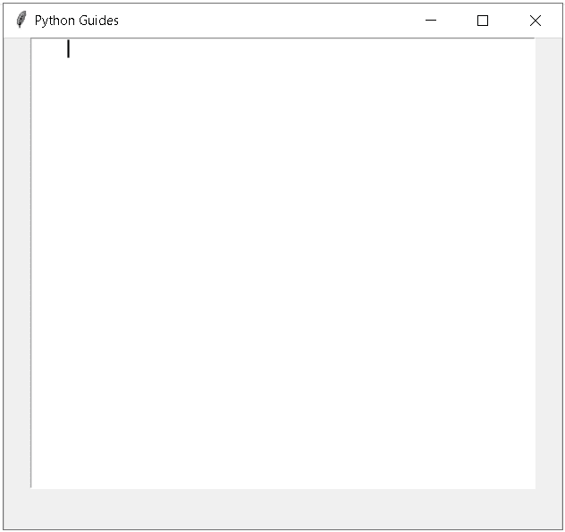

Python Tkinter Editor

阅读: [Python Tkinter 表教程](https://pythonguides.com/python-tkinter-table-tutorial/)

## Python Tkinter 文本编辑器

在本节中，我们将学习如何在 python Tkinter 文本编辑器中**编辑文本。**

在继续之前，我们应该了解一下**什么是文本编辑器？**

从计算机学习或计算机编程开始，我们可能在不同的工作空间工作，那里有不同的编辑。我们在日常生活中使用它们，其中一些是**写字板**、**记事本**等。

这个例子可以很容易地使我们理解和清楚地了解文本编辑器。

**代码:**

在下面的代码中，我们必须制作一个框架，在这个框架中，有一个文本框，我们可以在其中退出文本。在底部，有一个按钮，它在控制台上显示我们在文本框中输入的文本。

```py
from tkinter import *

ws = Tk()

ws.geometry('500x500')
ws.title("Python Guides")

def call():
    text = text_edit.get(0.3,END)
    print(text)

text_edit = Text(ws, width=56, height=25)

text_edit.pack()

text_button = Button(ws,text="Show Text", command= call)
text_button.pack(pady =10)

ws.mainloop()
```

**输出:**

下面的代码给出了下面的输出，用户可以在文本编辑器字段中输入文本。并且通过点击"**显示文本**按钮，它向控制台显示一个文本。

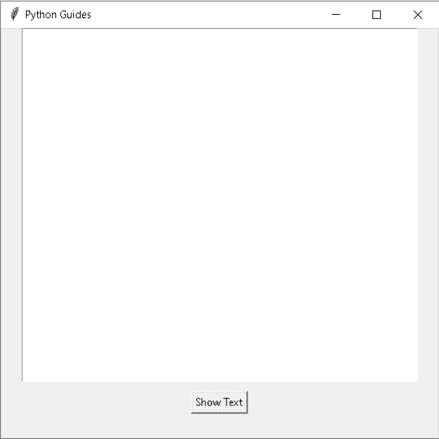

Python Tkinter text editor example

在下面的输出中，我们可以看到用户输入了一些文本，它在文本编辑器中是可见的，用户可以在文本中书写和修改。

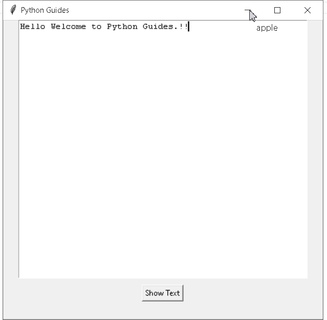

Text Editor in Python Tkinter

阅读: [Python Tkinter 测验](https://pythonguides.com/python-tkinter-quiz/)

## Python Tkinter 在线编辑

在本节中，我们将学习**Python Tkinter 在线编辑器如何工作**。

在线编辑器是程序员以在线模式编写或编辑代码的工作空间。

**代码:**

```py
from tkinter import *
from tkinter.filedialog import askopenfilename, asksaveasfilename
import subprocess

ws = Tk()
ws.title('Python Guides')

Cpath = ''

def Runthiscode():
    global Cpath
    if Cpath == '':
        SaveMessage = Toplevel()
        message = Label(SaveMessage, text="Save this File")
        message.pack()
        return
    Command = f'python {Cpath}'
    process = subprocess.Popen(Command, stdout=subprocess.PIPE, stderr=subprocess.PIPE, shell=True)
    result, Error = process.communicate()
    Result.insert('1.0',result)
    Result.insert('1.0',Error)

def Openthisfile():
    path = askopenfilename(filetypes=[('Python Files','*.py')])
    with open(path, 'r') as file:
        code = file.read()
        editor.delete('1.0', END)
        editor.insert('1.0', code)
        global Cpath
        Cpath = path

def SavethisfileAs():
    global gpath
    if Cpath =='':
        path = asksaveasfilename(filetypes=[('Python Files','*.py')])
    else:
        path = Cpath    
    with open(path, 'w') as file:
        code = editor.get('1.0', END)
        file.write(code)

editor = Text()
editor.config(bg='white', fg='blue', insertbackground='black')
editor.pack()

Result = Text(height=7)
Result.config(bg='black', fg='green')
Result.pack()

Menu_option = Menu(ws)

File_option = Menu(Menu_option, tearoff=0)
File_option.add_command(label='Open', command = Openthisfile)
File_option.add_command(label='Save', command = SavethisfileAs)
File_option.add_command(label='SaveAs', command = SavethisfileAs)
File_option.add_command(label='Exit', command = exit)
Menu_option.add_cascade(label='File', menu = File_option)

Compile_option = Menu(Menu_option, tearoff=0)
Compile_option.add_command(label='compile', command = Runthiscode)
Menu_option.add_cascade(label='compile', menu = Compile_option)

ws.config(menu=Menu_option)
ws.mainloop()
```

这些是代码的主要亮点。

*   **Cpath = ' '** 用于给出文件的路径。
*   `Result.insert()` 用于插入值。
*   `editor.delete()` 用于删除数值。
*   `Menu _ option . add _ cascade()`用于设置父单元格的层级菜单。

**输出:**

在下面的输出中，我们使用在线编辑器来运行代码。我们编写代码，然后保存它。

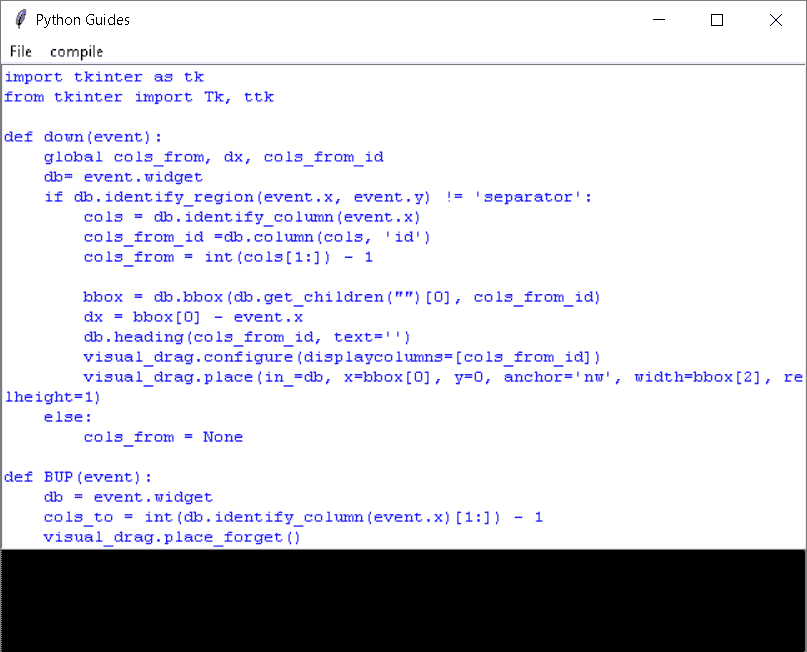

Python tkinter online editor

保存代码后，我们单击编译选项，如我们在输出中看到的。

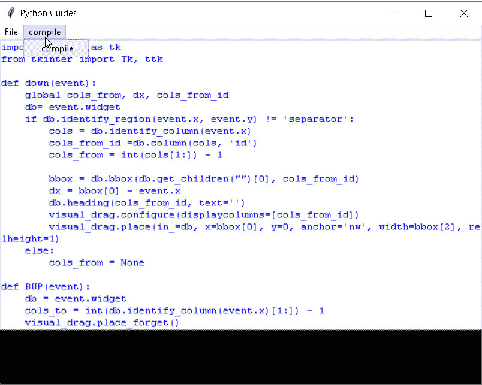

Python tkinter onlinee editor example

编译后，将生成以下最终输出。

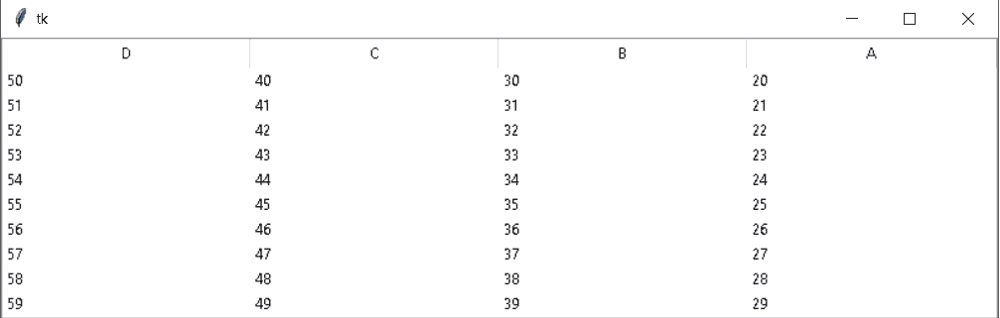

online editor Python tkinter

阅读:[使用 Tkinter 中 pyqrcode 的 Python QR 码生成器](https://pythonguides.com/python-qr-code-generator/)

## Python Tkinter 代码编辑器

在这一节中，我们将学习如何使用 Python Tkinter 创建代码编辑器。

在转向代码之前，我们需要知道什么是**代码编辑器**以及我们为什么使用它？

代码编辑器是一个工作空间，程序员或开发人员可以在这里编写代码，以运行下面的问题语句。

我们使用代码编辑器来编写不同语言的不同代码，如 Python、C++、Java、R、Ruby 等。遵循他们的语法，这有助于按照要求运行代码。

**代码:**

在下面的代码编辑器中，我们必须制作一个编辑框，在这里我们可以编写一个程序，它还显示了代码的语法错误。

```py
from tkinter import *
from tkinter.filedialog import askopenfilename, asksaveasfilename
import subprocess

ws = Tk()
ws.title('Python Guides')

Cpath = ''

def Runthiscode():
    global Cpath
    if Cpath == '':
        SaveMessage = Toplevel()
        message = Label(SaveMessage, text="Save this File")
        message.pack()
        return
    Command = f'python {Cpath}'
    process = subprocess.Popen(Command, stdout=subprocess.PIPE, stderr=subprocess.PIPE, shell=True)
    result, Error = process.communicate()
    Result.insert('1.0',result)
    Result.insert('1.0',Error)

def Openthisfile():
    path = askopenfilename(filetypes=[('Python Files','*.py')])
    with open(path, 'r') as file:
        code = file.read()
        editor.delete('1.0', END)
        editor.insert('1.0', code)
        global Cpath
        Cpath = path

def SavethisfileAs():
    global gpath
    if Cpath =='':
        path = asksaveasfilename(filetypes=[('Python Files','*.py')])
    else:
        path = Cpath    
    with open(path, 'w') as file:
        code = editor.get('1.0', END)
        file.write(code)

editor = Text()
editor.config(bg='white', fg='blue', insertbackground='black')
editor.pack()

Result = Text(height=7)
Result.config(bg='black', fg='green')
Result.pack()

Menu_option = Menu(ws)

File_option = Menu(Menu_option, tearoff=0)
File_option.add_command(label='Open', command = Openthisfile)
File_option.add_command(label='Save', command = SavethisfileAs)
File_option.add_command(label='SaveAs', command = SavethisfileAs)
File_option.add_command(label='Exit', command = exit)
Menu_option.add_cascade(label='File', menu = File_option)

Compile_option = Menu(Menu_option, tearoff=0)
Compile_option.add_command(label='compile', command = Runthiscode)
Menu_option.add_cascade(label='compile', menu = Compile_option)

ws.config(menu=Menu_option)
ws.mainloop()
```

**输出:**

运行这段代码后，我们得到了一个可以写代码的工作空间，在底部，我们可以看到运行代码的编译后的程序。如果有任何错误，它将显示如下代码所示的语法错误，我们可以在控制台上看到。

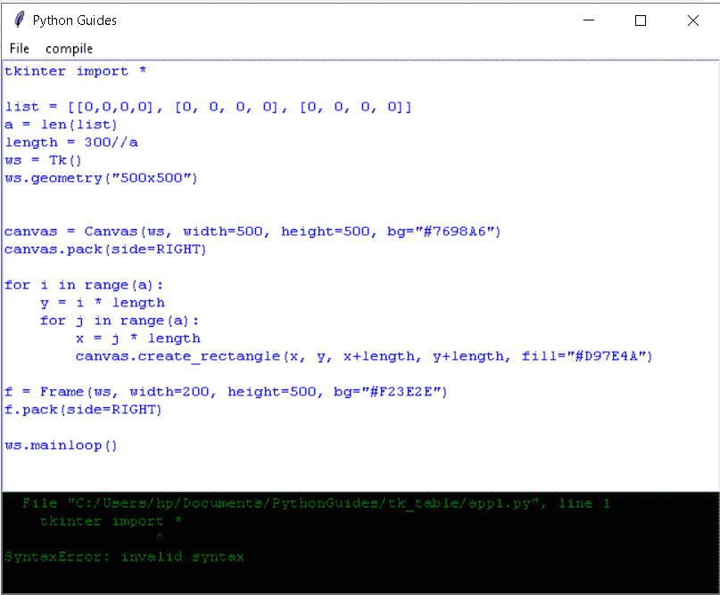

Syntax error Output

在检查错误并进行纠正后，我们得到了代码的最终输出。

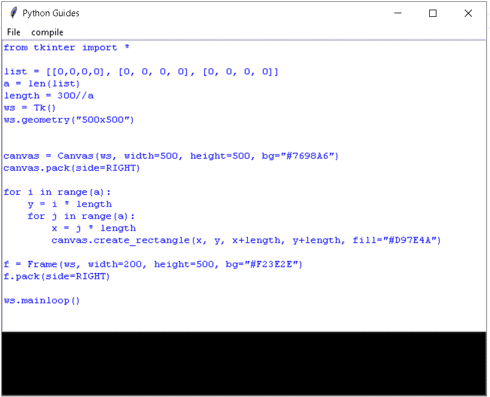

Python tkinter code editor

最终的输出向我们展示了一个表格，表格中有行和列，网格线有助于在表格中划分行和列。

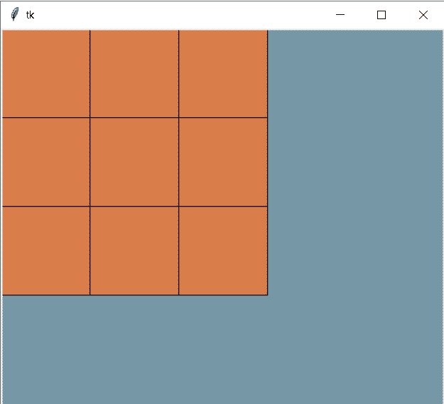

Python tkinter code editor example

阅读:[如何用 Python Tkinter 创建贪吃蛇游戏](https://pythonguides.com/create-a-snake-game-in-python/)

## Python tkinter GUI 编辑器

在本节中，我们将学习一个 **Python Tkinter GUI 编辑器**。但是**什么是 GUI 编辑器？**

`GUI` 代表**图形用户界面**,“**GUI 编辑器**”是一个工作空间，普通用户使用它来编写、编辑或准备文本框上的内容。

**代码:**

在下面的代码中，我们必须在菜单栏中创建一个工作区和一个文件，这有助于保存、另存为、打开和退出 python guides 记事本。

```py
from tkinter import *
from tkinter.filedialog import askopenfilename, asksaveasfilename
import subprocess

ws = Tk()
ws.title('Python Guides')

Cpath = ''

def Openthisfile():
    path = askopenfilename(filetypes=[('Python Files','*.py')])
    with open(path, 'r') as file:
        code = file.read()
        editor.delete('1.5', END)
        editor.insert('1.5', code)
        global Cpath
        Cpath = path

def SavethisfileAs():
    global gpath
    if Cpath =='':
        path = asksaveasfilename(filetypes=[('Python Files','*.py')])
    else:
        path = Cpath    
    with open(path, 'w') as file:
        code = editor.get('1.5', END)
        file.write(code)

editor = Text()
editor.config(bg='white', fg='blue', insertbackground='black')
editor.pack()

Result = Text(height=7)
Result.config(bg='black', fg='green')
Result.pack()

Menu_option = Menu(ws)

File_option = Menu(Menu_option, tearoff=0)
File_option.add_command(label='Open', command = Openthisfile)
```

**输出:**

运行下面的代码后，我们得到了这个输出，在这里我们可以创建一个工作区并添加一些上下文。

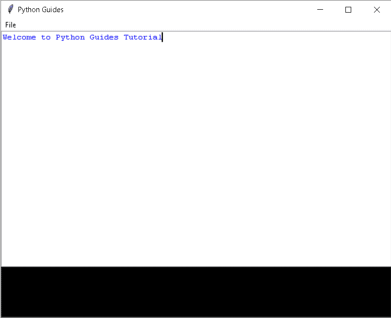

Python tkinter GUI editor

添加上下文后，我们现在使用步骤保存该文件

*   点击**文件的**选项。
*   寻找“**保存**按钮。
*   点击文件菜单栏中的保存按钮

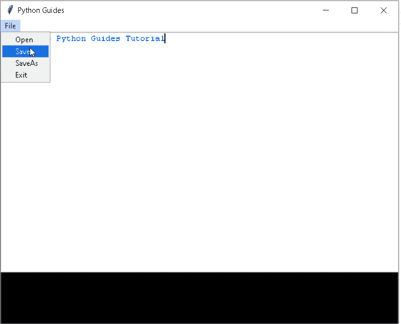

Python tkinter GUI editor example

*   点击保存按钮后，它会询问我们要保存文件的位置。
*   给出一个我们想用来保存文件的文件名。
*   点击**保存**按钮。
*   我们的文件将被保存。

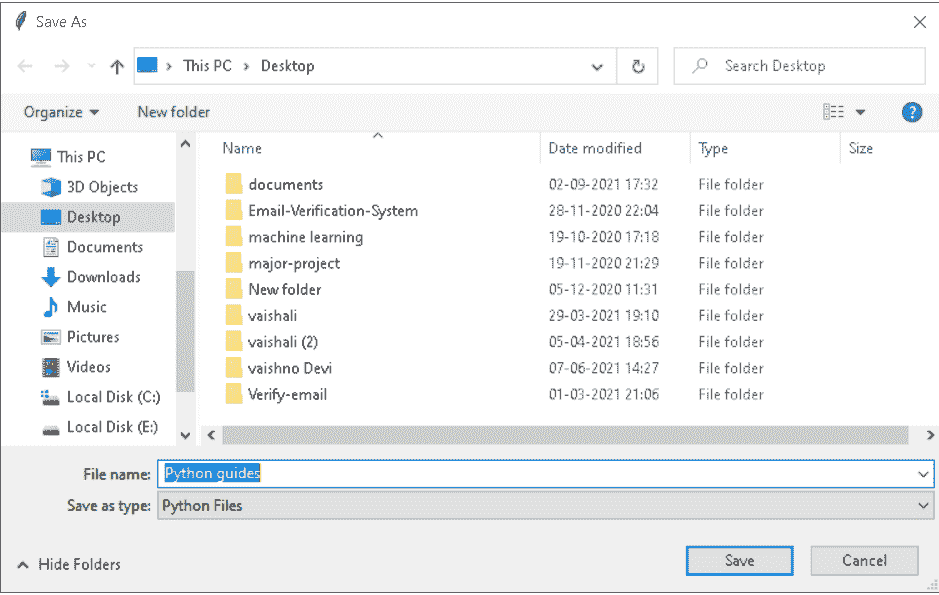

GUI editor Python tkinter

为了检查我们的文本是否被保存，我们可以从我们保存的位置打开一个文件，我们可以将它作为输出。

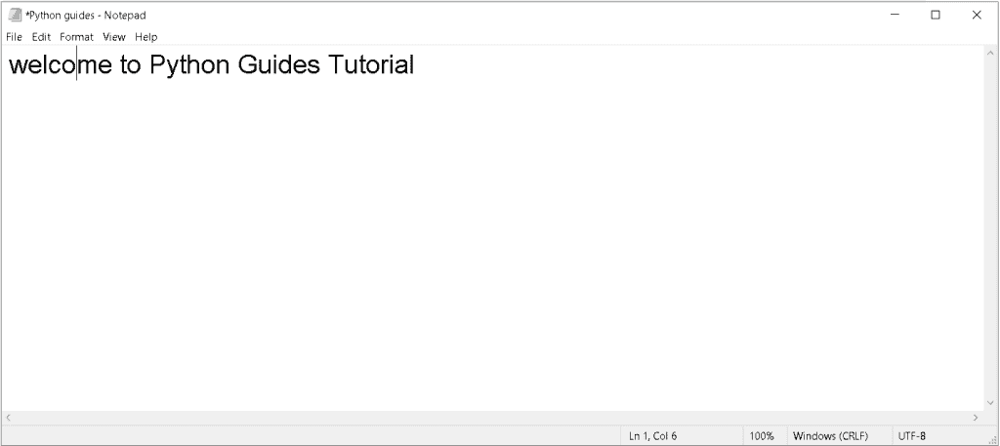

GUI editor using Python Tkinter

阅读: [Python Tkinter 图片](https://pythonguides.com/python-tkinter-image/)

## Python Tkinter JSON 编辑器

在本节中，我们将学习 **Python Tkinter JSON 编辑器**。

**JSON 编辑器是什么？**

JSON 编辑器是一个编辑器，我们可以在其中查看、编辑、打开和打印'**。json** 文件。 `JSON` 代表 **JavaScript 对象符号**。

在下面的代码中，我们制作了一个表单，用户可以在其中输入数据，输入数据被转换成 JSON 文件。我们可以使用生成的文件来编辑、查看、打开和打印。

```py
from tkinter import *
import json
from tkinter.filedialog import asksaveasfile

ws = Tk()
ws.geometry('640x300')
ws.title('Python Guides')

test = 1
def jSONfile(path, fileName, data):
        json.dump(data, path)

path = './'

def check():
    x= int(ID.get())
    y = test * Name.get()
    z = Batch.get()
    print(x)
    print(y)
    print(z)
    data = {}
    data['ID'] = x
    data['Name'] = y
    data['Batch'] = z
    File = [('JSON_File', '*.json')]
    File_Name='IOTEDU'
    File_position = asksaveasfile(filetypes = File,defaultextension = json,initialfile='IOTEDU')
    jSONfile(File_position, File_Name, data)

id = Label(ws, text="ID:")
ID = Entry(ws)
name = Label(ws, text="Name:")
Name = Entry(ws)
batch = Label(ws, text="Batch:")
Batch = Entry(ws)

id.grid(row=0, column=0)
ID.grid(row=0,column=1)
name.grid(row=4,column=0)
Name.grid(row=4, column=1)
batch.grid(row=6, column=0)
Batch.grid(row=6, column=1)

submit = Button(ws,text='Submit',command = check).grid(row=8, column=1)

ws.mainloop()
```

运行下面的代码后，我们得到一个表单，要求输入一个 **Id、名称、**和**批次**。提交后，我们得到了以下 JSON 格式的数据，稍后我们可以编辑、查看和打印这些数据。

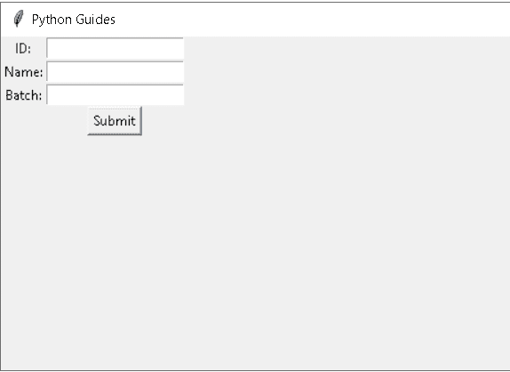

Python Tkinter JSON editor

现在在下图中，我们可以看到我们已经输入了一个 `ID` 、**名称**和**批次**，并提交给 JSON 输出。

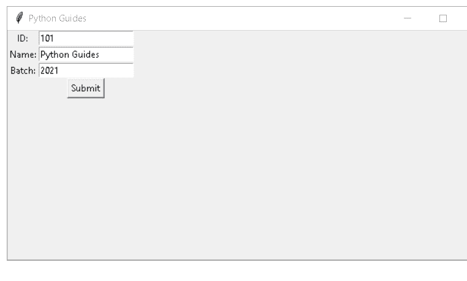

JSON editor using Python Tkinter

提交之后，我们得到了 JSON 格式的输出。

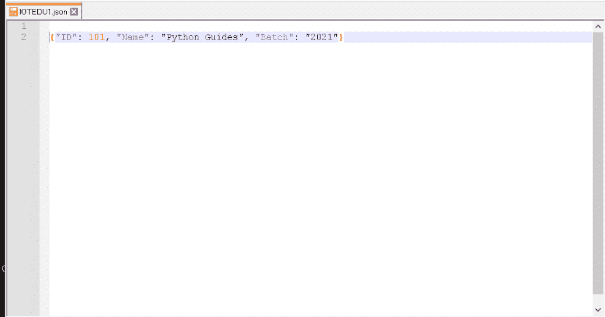

JSON editor using Python Tkinter

阅读: [Python Tkinter Colors](https://pythonguides.com/python-tkinter-colors/)

## Python Tkinter 图像编辑器

在这一节中，我们将学习如何使用 Python Tkinter 创建一个图像编辑器。

图像编辑器用于编辑图像，如旋转、添加边框、添加对比度、增加亮度、添加边框和使图像模糊。借助图像编辑，我们可以提高图像的可视性。

**代码:**

在下面的代码中，我们制作了一个图像编辑器，可以从本地位置选择图像。并在这里添加它和其他功能是使图像模糊，增加对比度，增加亮度，旋转，翻转从左到右，或从上到下，并添加边框。

```py
from tkinter import *
from tkinter import ttk
from tkinter import filedialog
from tkinter.filedialog import askopenfilename,asksaveasfilename
from PIL import Image, ImageTk, ImageFilter, ImageEnhance, ImageOps
import os
# contrast border thumbnail 
ws = Tk()
ws.title("Simple Photo Editor")
ws.geometry("640x640")
# create functions
def selected():
    global image_path, image
    image_path = filedialog.askopenfilename(initialdir=os.getcwd()) 
    image = Image.open(image_path)
    image.thumbnail((350, 350))
    #imgg = img.filter(ImageFilter.BoxBlur(0))
    image1 = ImageTk.PhotoImage(image)
    canvas2.create_image(300, 210, image=image1)
    canvas2.image=image1                                                                                                                                                                                                                
def blur(event):
    global image_path, image1, imgg
    for m in range(0, v1.get()+1):
            image = Image.open(image_path)
            image.thumbnail((350, 350))
            imgg = image.filter(ImageFilter.BoxBlur(m))
            image1 = ImageTk.PhotoImage(imgg) 
            canvas2.create_image(300, 210, image=image1)
            canvas2.image=image1
def brightness(event):
    global image_path, image2, image3
    for m in range(0, v2.get()+1):
            image = Image.open(image_path)
            image.thumbnail((350, 350))
            imgg = ImageEnhance.Brightness(image)
            image2 = imgg.enhance(m)
            image3 = ImageTk.PhotoImage(image2)
            canvas2.create_image(300, 210, image=image3)
            canvas2.image=image3
def contrast(event):
    global image_path, image4, image5
    for m in range(0, v3.get()+1):
            image = Image.open(image_path)
            image.thumbnail((350, 350))
            imgg = ImageEnhance.Contrast(image)
            image4 = imgg.enhance(m)
            image5 = ImageTk.PhotoImage(image4)
            canvas2.create_image(300, 210, image=image5)
            canvas2.image=image5
def rotate_image(event):
        global image_path, image6, image7
        image = Image.open(image_path)
        image.thumbnail((350, 350))
        image6 = image.rotate(int(Rotate_combo.get()))
        image7 = ImageTk.PhotoImage(image6)
        canvas2.create_image(300, 210, image=image7)
        canvas2.image=image7

def flip_image(event):
        global image_path, image8, image9
        image = Image.open(image_path)
        image.thumbnail((350, 350))
        if Flip_combo.get() == "FLIP LEFT TO RIGHT":
            image8 = image.transpose(Image.FLIP_LEFT_RIGHT)
        elif Flip_combo.get() == "FLIP TOP TO BOTTOM":
            image8 = image.transpose(Image.FLIP_TOP_BOTTOM)
        image9 = ImageTk.PhotoImage(image8)
        canvas2.create_image(300, 210, image=image9)
        canvas2.image=image9   
def image_border(event):
    global image_path, image10, image11
    image = Image.open(image_path)
    image.thumbnail((350, 350))
    image10 = ImageOps.expand(image, border=int(Border_combo.get()), fill=95)
    image11 = ImageTk.PhotoImage(image10)
    canvas2.create_image(300, 210, image=image11)
    canvas2.image=image11    
image1 = None
image3 = None
image5 = None
image7 = None
image9 = None
image11 = None
def save():
    global image_path, imgg, image1, image2, image3, image4, image5, image6, image7, image8, image9, image10, image11
    #file=None
    ext = image_path.split(".")[-1]
    file=asksaveasfilename(defaultextension =f".{ext}",filetypes=[("All Files","*.*"),("PNG file","*.png"),("jpg file","*.jpg")])
    if file: 
            if canvas2.image==image1:
                imgg.save(file)
            elif canvas2.image==image3:
                image2.save(file)
            elif canvas2.image==image5:
                image4.save(file)
            elif canvas2.image==image7:
                image6.save(file)
            elif canvas2.image==image9:
                image8.save(file)
            elif canvas2.image==image11:
                image10.save(file)        
# create labels, scales and comboboxes
blurr = Label(ws, text="Blur:", font=("ariel 17 bold"), width=9, anchor='e')
blurr.place(x=15, y=8)
v1 = IntVar()
scale = ttk.Scale(ws, from_=0, to=10, variable=v1, orient=HORIZONTAL, command=blur) 
scale.place(x=150, y=10)
bright = Label(ws, text="Brightness:", font=("ariel 17 bold"))
bright.place(x=8, y=50)
v2 = IntVar()   
Scale1 = ttk.Scale(ws, from_=0, to=10, variable=v2, orient=HORIZONTAL, command=brightness) 
Scale1.place(x=150, y=55)
contrast = Label(ws, text="Contrast:", font=("ariel 17 bold"))
contrast.place(x=35, y=92)
v3 = IntVar()   
Scale2 = ttk.Scale(ws, from_=0, to=10, variable=v3, orient=HORIZONTAL, command=contrast) 
Scale2.place(x=150, y=100)
Rotate = Label(ws, text="Rotate:", font=("ariel 17 bold"))
Rotate.place(x=370, y=8)
values = [0, 90, 180, 270, 360]
Rotate_combo = ttk.Combobox(ws, values=values, font=('ariel 10 bold'))
Rotate_combo.place(x=460, y=15)
Rotate_combo.bind("<<ComboboxSelected>>", rotate_image)
Flip = Label(ws, text="Flip:", font=("ariel 17 bold"))
Flip.place(x=400, y=50)
values1 = ["FLIP LEFT TO RIGHT", "FLIP TOP TO BOTTOM"]
Flip_combo = ttk.Combobox(ws, values=values1, font=('ariel 10 bold'))
Flip_combo.place(x=460, y=57)
Flip_combo.bind("<<ComboboxSelected>>", flip_image)
border = Label(ws, text="Add border:", font=("ariel 17 bold"))
border.place(x=320, y=92)
values2 = [i for i in range(10, 45, 5)]
Border_combo = ttk.Combobox(ws, values=values2, font=("ariel 10 bold"))
Border_combo.place(x=460, y=99)
Border_combo.bind("<<ComboboxSelected>>", image_border)
# create canvas to display image
canvas2 = Canvas(ws, width="600", height="420", relief=RIDGE, bd=2)
canvas2.place(x=15, y=150)
# create buttons
button1 = Button(ws, text="Select Image", bg='black', fg='gold', font=('ariel 15 bold'), relief=GROOVE, command=selected)
button1.place(x=100, y=595)
button2 = Button(ws, text="Save", width=12, bg='black', fg='gold', font=('ariel 15 bold'), relief=GROOVE, command=save)
button2.place(x=280, y=595)
button3 = Button(ws, text="Exit", width=12, bg='black', fg='gold', font=('ariel 15 bold'), relief=GROOVE, command=ws.destroy)
button3.place(x=460, y=595)
ws.mainloop() 
```

**输出:**

运行下面的代码后，我们得到了一个输出，我们可以从本地位置选择一个图像，并在一个框中编辑它。

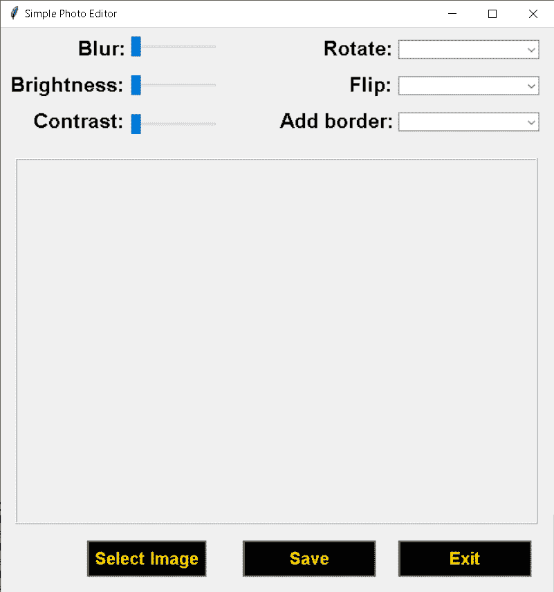

Python Tkinter image editor

我们可以看到在这个图像里面添加了一个边框，带有“ `20` ，并将图像从**左**翻转到**右**。

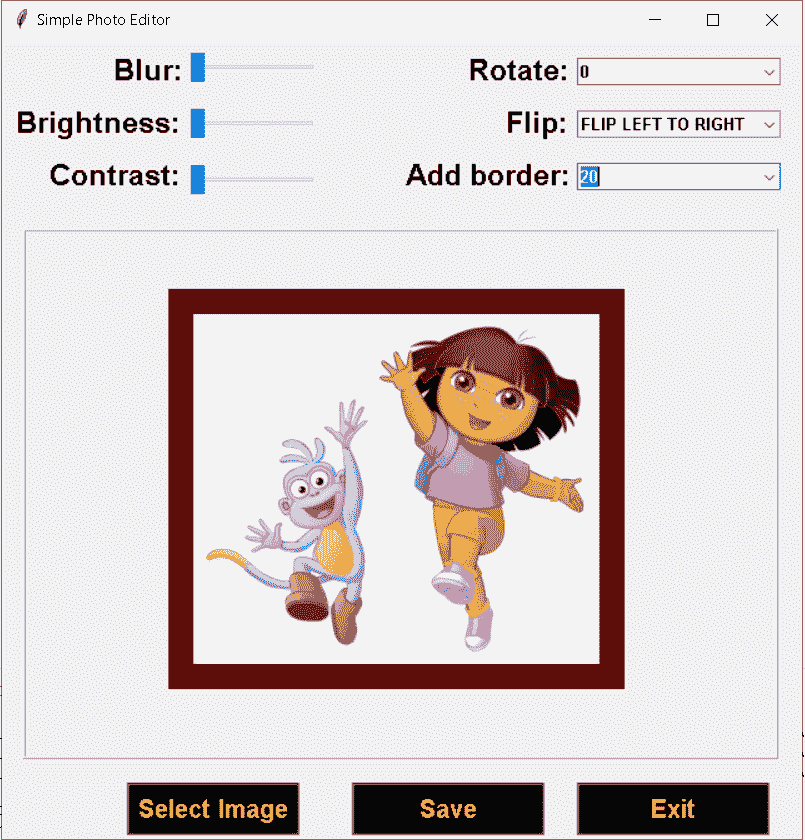

Python Tkinter image editor example

你可能也喜欢读下面的文章。

*   [python tkinter auto complete](https://pythonguides.com/python-tkinter-autocomplete/)
*   [Python Tkinter 主循环](https://pythonguides.com/python-tkinter-mainloop/)
*   [Python Tkinter 滚动条](https://pythonguides.com/python-tkinter-scrollbar/)
*   [Python Tkinter Validation](https://pythonguides.com/python-tkinter-validation/)
*   [Python Tkinter 动画](https://pythonguides.com/python-tkinter-animation/)
*   [Python Tkinter 多窗口教程](https://pythonguides.com/python-tkinter-multiple-windows-tutorial/)
*   [Python Tkinter Validation](https://pythonguides.com/python-tkinter-validation/)

在本教程中，我们学习了关于 **Python Tkinter 编辑器**的知识，并且我们还涵盖了以下主题。

*   Python Tkinter 编辑器
*   Python Tkinter 文本编辑器
*   Python Tkinter 在线编辑器
*   Python Tkinter 代码编辑器
*   Python tkinter GUI 编辑器
*   Python Tkinter JSON 编辑器
*   Python Tkinter 图像编辑器

[Bijay Kumar](https://pythonguides.com/author/fewlines4biju/)

Python 是美国最流行的语言之一。我从事 Python 工作已经有很长时间了，我在与 Tkinter、Pandas、NumPy、Turtle、Django、Matplotlib、Tensorflow、Scipy、Scikit-Learn 等各种库合作方面拥有专业知识。我有与美国、加拿大、英国、澳大利亚、新西兰等国家的各种客户合作的经验。查看我的个人资料。

[enjoysharepoint.com/](https://enjoysharepoint.com/)[](https://www.facebook.com/fewlines4biju "Facebook")[](https://www.linkedin.com/in/fewlines4biju/ "Linkedin")[](https://twitter.com/fewlines4biju "Twitter")