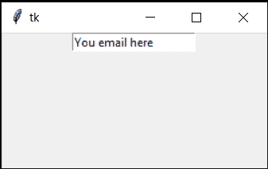
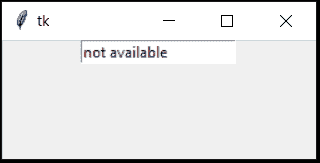
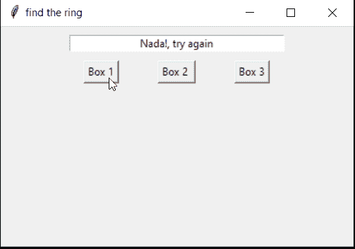
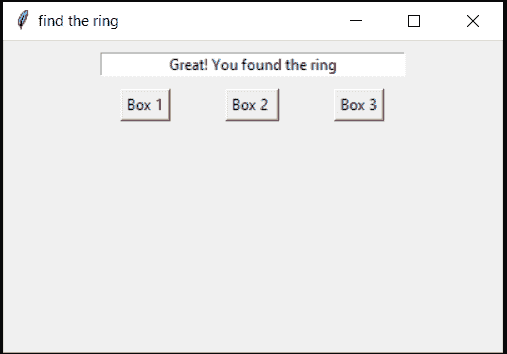
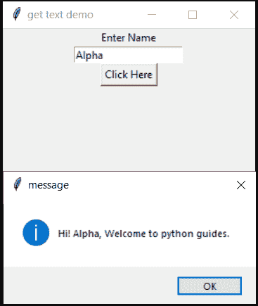
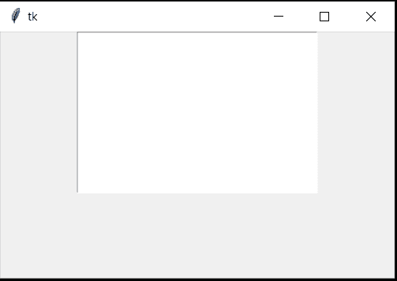
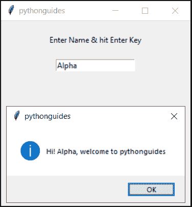

# Python Tkinter 入口–如何使用

> 原文：<https://pythonguides.com/python-tkinter-entry/>

[](https://sharepointsky.teachable.com/p/python-and-machine-learning-training-course)

在本 [Python 教程](https://pythonguides.com/python-programming-for-the-absolute-beginner/)中，我们将详细讨论关于 `Python tkinter entry` 。

*   Python Tkinter 入口小部件
*   Python Tkinter 条目默认值
*   Python Tkinter 条目占位符
*   Python Tkinter 条目集文本
*   Python Tkinter 条目获取文本
*   Python Tkinter 入口高度
*   Python Tkinter 条目文本变量
*   输入 Python Tkinter 输入命令

目录

[](#)

*   [Python Tkinter 条目](#Python_Tkinter_Entry "Python Tkinter Entry")
*   [Tkinter 入口小工具](#Tkinter_entry_widget "Tkinter entry widget")
*   [Tkinter 输入默认值](#Tkinter_entry_default_value "Tkinter entry default value")
*   [Tkinter 条目占位符](#Tkinter_entry_placeholder "Tkinter entry placeholder")
*   [Python Tkinter 条目集文本](#Python_Tkinter_entry_set_text "Python Tkinter entry set text")
*   [Python Tkinter 条目获取文本](#Python_Tkinter_entry_get_text "Python Tkinter entry get text")
*   [Python Tkinter 入口高度](#Python_Tkinter_entry_height "Python Tkinter entry height")
*   [PythonTkinter 条目文本变量](#PythonTkinter_entry_textvariable "PythonTkinter entry textvariable")
*   [Python Tkinter 输入命令输入](#Python_Tkinter_entry_command_on_enter "Python Tkinter entry command on enter")

## Python Tkinter 条目

在 Python 中，如果您想以单行字符串的形式接受用户输入，那么我们应该使用 Python Tkinter Entry。让我们再检查一下。

另外，如果你是第一次接触 **Python GUI 编程**，请查看文章 [Python GUI 编程(Python Tkinter)](https://pythonguides.com/python-gui-programming/) 和[如何使用 Tkinter](https://pythonguides.com/python-tkinter-calculator/) 创建 Python 计算器。

## Tkinter 入口小工具

*   **Python tkinter 入口小部件**用于接收用户输入。
*   它是一个广泛使用的小部件，可以在任何应用程序中找到，而不管编程语言是什么。
*   java 里叫 TextField。
*   这是一个单行的盒子，用户可以在里面输入一些东西。
*   与 java 不同，Tkinter 没有单独的多行条目小部件。
*   要允许多行输入，请增加入口小部件的高度。

你可能会喜欢， [Python Tkinter Title](https://pythonguides.com/python-tkinter-title/) 。

## Tkinter 输入默认值

*   占位符和默认值之间只有一线之差。
*   如果用户不提供任何输入，那么默认值将被用作参数。
*   但是在占位符的情况下，它们永远不能用作值。它们被放置来显示信息或模式。
*   但是在 Tkinter **中默认值** & **占位符与**相同
*   有两种方法可以做到:
    *   `Entry.insert`
    *   **文本变量**

1.  **Entry.insert:**

*   `insert` 关键字用于插入单词或句子
*   `END` 决定紧接着最后一个字符输入下一个字符

**代码:**

```py
from tkinter import *

ws = Tk()

info_Tf = Entry(ws)
info_Tf.insert(END, 'You email here')
info_Tf.pack()

ws.mainloop()
```

**输出:**输出显示文本框中已经提到的文本。



Tkinter entry default value

2.**文本变量**

*   textvariable 用于通过变量提供值
*   值可以是**整数**或**字符串**
*   对于整数: `IntVar()` 关键字被使用
*   对于字符串:**使用 StringVar()** 关键字

**代码:**

```py
from tkinter import * 

ws = Tk()
name = StringVar(ws, value='not available')
nameTf = Entry(ws, textvariable=name).pack()

ws.mainloop()
```

**输出**:在该输出中，如果用户不提供任何信息，则“不可用”将被视为默认输入



Entry default value using textvariable

## Tkinter 条目占位符

*   占位符与默认值相同。
*   参考**t 输入默认值**部分

## Python Tkinter 条目集文本

*   **设置文本**用于在 Python tkinter 中设置**条目**框中的文本。
*   它与函数一起使用，起到在输入框中输入文本的作用。
*   我们将创建一个函数，并使用按钮调用该函数。
*   当用户点击按钮时，值将被插入到输入框中。

**代码:**

在这段代码中，有一个游戏，你必须找到一个戒指。点击其中一个盒子，你会得到一个戒指。明智地选择。

```py
from tkinter import *

def chooseOne(res):
    userInput.delete(0, END)
    userInput.insert(0, res)
    return

ws = Tk()
ws.title("find the ring")
ws.geometry("400x250")

frame = Frame(ws)
userInput = Entry(frame, width=40, justify=CENTER)
userInput.grid(row=0, columnspan=3, padx=5, pady= 10)

Button(frame,text="Box 1",command=lambda:chooseOne("Nada!, try again")).grid(row=1, column=0)
Button(frame,text="Box 2 ",command=lambda:chooseOne("Great! You found the ring")).grid(row=1, column=1)
Button(frame,text="Box 3",command=lambda:chooseOne("Nada! try again")).grid(row=1, column=2)
frame.pack()

ws.mainloop()
```

**输出:**

在这个输出中，有一个游戏，你必须找到一个戒指。点击其中一个盒子，你会得到一个戒指。明智地选择



Python Tkinter entry set text

用户未能获得正确的按钮。在输入框中设置消息“没有，再试一次”



Python Tkinter entry set text

用户按下右键，消息“太好了！你在入口盒里发现了戒指。

你可能喜欢阅读，[使用 Python Tkinter](https://pythonguides.com/bmi-calculator-using-python-tkinter/) 的身体质量指数计算器。

## Python Tkinter 条目获取文本

*   Get text 用于从 Python Tkinter entry 小部件获取值。
*   换句话说，Get text 提取用户提供的任何值。
*   如果要使用用户提供的值，那么使用 get 文本。

**代码:**

在这个例子中，用户提供了他的名字，程序打印出带有他名字的欢迎消息。

```py
from tkinter import *
from tkinter import messagebox

ws = Tk()
ws.title('get text demo')
ws.geometry('200x200')

def welcomeMessage():
    name = name_Tf.get()
    return messagebox.showinfo('message',f'Hi! {name}, Welcome to python guides.')

Label(ws, text="Enter Name").pack()
name_Tf = Entry(ws)
name_Tf.pack()

Button(ws, text="Click Here", command=welcomeMessage).pack()

ws.mainloop()
```

**输出:**

在此输出中，用户提供的名称为“Alpha”。程序正在使用此名称发送名为的问候消息。



Python Tkinter entry get text

## Python Tkinter 入口高度

*   输入框只有一行
*   需要高度以方便多行输入。
*   使用了 `height` 关键字&它接受一个整数作为输入。
*   多行输入框也被称为**文本区**。

**代码:**

```py
from tkinter import *

ws = Tk()
ws.geometry("400x250")

text_area = Text(ws, height=10, width=30).pack()

ws.mainloop()
```

**输出:**

输入框是单行的，但是在这个例子中，空白是输入行。它可以接受多行输入。



Tkinter entry height

## PythonTkinter 条目文本变量

*   textvariable 用于通过变量提供值
*   值可以是**整数**或**字符串**
*   对于整数: `IntVar()` 关键字被使用
*   对于字符串:**使用 StringVar()** 关键字。

**代码:**

```py
from tkinter import * 

ws = Tk()
name = StringVar(ws, value='not available')
nameTf = Entry(ws, textvariable=name).pack()

ws.mainloop()
```

**输出**:在该输出中，如果用户不提供任何信息，则“不可用”将被视为默认输入


Tkinter entry textvariable

## Python Tkinter 输入命令输入

*   它仅仅意味着，当用户点击键盘上的回车键时会发生什么动作。
*   这也称为键绑定
*   每当用户在入口小部件中提供输入并点击 enter 时，就会触发一些动作。
*   该动作可以是验证、打印消息等形式。
*   让我们通过一个例子来更好地理解这一点

**举例**:

*   编写一段代码，打印带有用户名的欢迎消息。
*   用户将在入口小部件中输入名称，然后点击 enter。

**代码:**

*   我们使用绑定函数来执行上述任务
*   绑定语法: `name_Tf.bind('<Return>', function)`
*   在这种情况下，函数为 `welMsg`

```py
from tkinter import *
from tkinter import messagebox

ws = Tk()
ws.title('pythonguides')
ws.geometry('250x200')

def welMsg(name):
    name = name_Tf.get()
    return messagebox.showinfo('pythonguides', f'Hi! {name}, welcome to pythonguides' )

Label(ws, text='Enter Name & hit Enter Key').pack(pady=20)
name_Tf = Entry(ws)
name_Tf.bind('<Return>',welMsg)
name_Tf.pack()

ws.mainloop()
```

**输出:**

所以在这里，没有按钮来触发功能。用户输入了名称“Alpha”并按下了 enter。输出用他的名字问候他。



Tkinter entry command on enter

您可能会喜欢以下 Python 教程:

*   [Python 生成随机数和字符串](https://pythonguides.com/python-generate-random-number/)
*   [Python tkinter 标签–如何使用](https://pythonguides.com/python-tkinter-label/)
*   [Python 将列表写入文件，并附有示例](https://pythonguides.com/python-write-list-to-file/)
*   [命令出错，退出状态为 1 python](https://pythonguides.com/command-errored-out-with-exit-status-1-python/)
*   [Python 历元到日期时间+示例](https://pythonguides.com/python-epoch-to-datetime/)
*   [Python 中的优先级队列](https://pythonguides.com/priority-queue-in-python/)
*   [Python 3 pickle typeerror 需要一个类似字节的对象，而不是“str”](https://pythonguides.com/python-3-pickle-typeerror-a-bytes-like-object-is-required-not-str/)
*   [Python Tkinter 按钮–如何使用](https://pythonguides.com/python-tkinter-button/)
*   [Python Tkinter 进度条](https://pythonguides.com/python-tkinter-progress-bar/)
*   [用乌龟创建一个 Python 的贪吃蛇游戏](https://pythonguides.com/snake-game-in-python/)
*   [Python Tkinter 画布教程](https://pythonguides.com/python-tkinter-canvas/)

在本教程中，我们详细研究了 Python 中的**入口小部件，我们也涵盖了这些主题。**

*   Python Tkinter 入口小部件
*   Python Tkinter 条目默认值
*   Python Tkinter 条目占位符
*   Python Tkinter 条目集文本
*   Python Tkinter 条目获取文本
*   Python Tkinter 入口高度
*   Python Tkinter 条目文本变量
*   输入 Python Tkinter 输入命令

[Bijay Kumar](https://pythonguides.com/author/fewlines4biju/)

Python 是美国最流行的语言之一。我从事 Python 工作已经有很长时间了，我在与 Tkinter、Pandas、NumPy、Turtle、Django、Matplotlib、Tensorflow、Scipy、Scikit-Learn 等各种库合作方面拥有专业知识。我有与美国、加拿大、英国、澳大利亚、新西兰等国家的各种客户合作的经验。查看我的个人资料。

[enjoysharepoint.com/](https://enjoysharepoint.com/)[](https://www.facebook.com/fewlines4biju "Facebook")[](https://www.linkedin.com/in/fewlines4biju/ "Linkedin")[](https://twitter.com/fewlines4biju "Twitter")