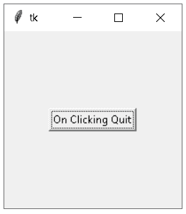
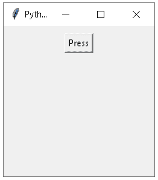
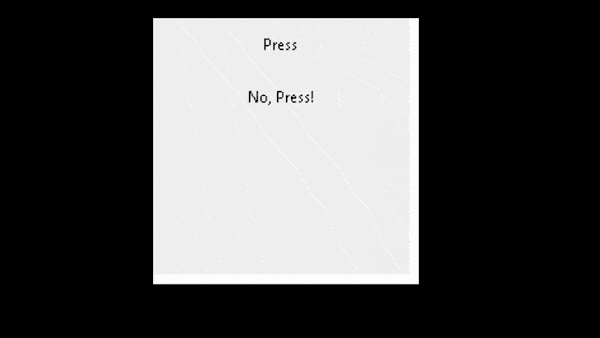
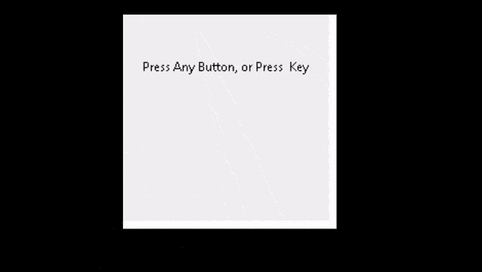
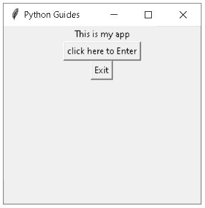
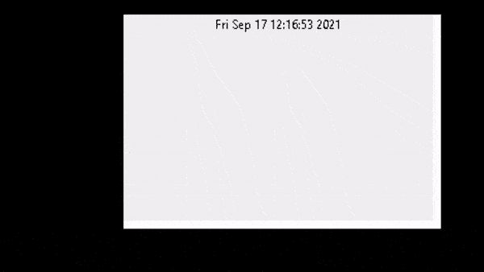
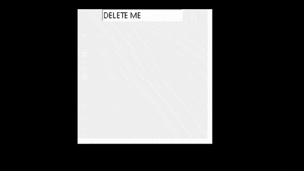
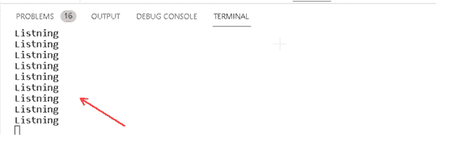

# Python Tkinter 事件

> 原文：<https://pythonguides.com/python-tkinter-events/>

[](https://sharepointsky.teachable.com/p/python-and-machine-learning-training-course)

在本 [Python Tkinter 教程](https://pythonguides.com/python-gui-programming/)中，我们将了解 **Python Tkinter 事件**，其中我们将了解**如何在 Python Tkinter** 中创建事件。我们还将介绍与**事件**相关的不同示例。我们也将讨论这些话题。

*   Python Tkinter 事件
*   Python Tkinter 事件和绑定
*   Python Tkinter 事件列表
*   Python Tkinter 事件小工具
*   Python Tkinter 事件属性
*   Python Tkinter 事件类
*   Python Tkinter 事件处理程序
*   Python Tkinter 事件 _ 生成
*   Python Tkinter 事件循环
*   Python Tkinter 事件 _ 监听器
*   Python Tkinter event.keysym

目录

[](#)

*   [Python Tkinter 事件](#Python_Tkinter_Events "Python Tkinter Events")
*   [Python Tkinter 事件和绑定](#Python_Tkinter_event_and_bind "Python Tkinter event and bind")
*   [Python Tkinter 事件列表](#Python_Tkinter_event_list "Python Tkinter event list")
*   [Python Tkinter 事件小工具](#Python_Tkinter_event_widget "Python Tkinter event widget")
*   [Python Tkinter 事件属性](#Python_Tkinter_event_attributes "Python Tkinter event attributes")
*   [Python Tkinter 事件类](#Python_Tkinter_event_class "Python Tkinter event class")
*   [Python Tkinter 事件处理程序](#Python_Tkinter_event_handler "Python Tkinter event handler")
*   [Python Tkinter 事件 _ 生成](#Python_Tkinter_event_generate "Python Tkinter event_generate")
*   [Python Tkinter 事件循环](#Python_Tkinter_event_loop "Python Tkinter event loop")
*   [Python Tkinter event _ listener](#Python_Tkinter_event_listener "Python Tkinter event_listener")
*   [Python Tkinter event . key sym](#Python_Tkinter_eventkeysym "Python Tkinter event.keysym")

## Python Tkinter 事件

在本节中，我们将学习 Python Tkinter 中的**事件**。

**事件**是用户的鼠标操作，也可以说是用事件对象调用了**处理程序**函数。它可以处理与它们相关的所有功能。

**代码:**

在下面的代码中，我们通过在单击“退出”时给出文本= **”来创建一个按钮。通过点击按钮，他们打印 Python 指南，并且退出命令也被执行。**

*   **按钮()**用于运行命令
*   `Button.focus()` 用于获取特定事件的焦点。

```py
from tkinter import *

def task(event):
    print("PythonGuides") 

ws=Tk()
ws.geometry("200x200")

button=Button(ws,text="On Clicking Quit",command= ws.quit)

button.focus()
button.pack(expand=True)
button.bind('<Button-1>', task)

ws.mainloop()
```

**输出:**

运行上述代码后，我们可以看到生成了一个窗口，其中放置了一个按钮。用户点击按钮，点击后打印文本 Python 指南并自动退出。当事件发生时，自动调用分配的函数。



EventOutput

阅读: [Python Tkinter 动画](https://pythonguides.com/python-tkinter-animation/)

## Python Tkinter 事件和绑定

在本节中，我们将学习如何在 Python Tkinter 中绑定事件。

将功能分配给事件被称为事件绑定。当事件发生时，自动调用分配的函数。

bind()方法的语法

```py
widget.bind(event,handler,add=None)
```

**代码:**

在下面的代码中，我们可以创建一个可以在其中发生事件的小部件。我们在小部件上创建一个按钮，如果用户单击按钮一次，在单击按钮“ `Hello` ”后会显示文本。如果用户双击按钮，程序停止执行。

```py
from tkinter import *
def task(event):
    print("Hello") 
def quit(event):                           
    print("Double click  to stop") 
    import sys; sys.exit()

ws=Tk()
ws.title("Python guides")
ws.geometry("200x200") 

button = Button(ws, text='Press')
button.pack(pady=10)
button.bind('<Button-1>', task)
button.bind('<Double-1>', quit) 
button.mainloop()
```

`ws.title()` 用于给小部件赋予标题。

`sys` 是一个为现有 Python 模块命名的函数

**输出:**

运行上面的代码后，我们得到了下面的输出，在其中我们可以看到小部件。在小部件中，一旦他们打印 Hello，单击按钮后会放置一个按钮。之后，点击两次，他们退出所有的程序。



Event binding Output

阅读: [Python Tkinter 多窗口教程](https://pythonguides.com/python-tkinter-multiple-windows-tutorial/)

## Python Tkinter 事件列表

在本节中，我们将了解 **Python Tkinter 事件列表**。

列表是按顺序书写的连接的对象或项目。

以下是一些活动的列表:

*   **按钮**–当我们点击程序执行的按钮时，按钮被用作事件处理程序
*   **配置**–配置用于更改小工具的属性。
*   **专注**–完全专注于特定的小工具。
*   **销毁**-终止特定的小工具。
*   **动作**–即使鼠标在小工具上移动。

**代码:**

在下面的代码中，我们使用标签和按钮，标签用于描述文本，按钮用于处理事件。

*   `def show_text(e)` 用于定义**显示的消息。**
*   `ws.bind()` 用于绑定光标移动、鼠标移动、键盘输入等方法。
*   `ws.mainloop()` = Mainloop 是应用程序窗口的无限循环。

```py
from tkinter import *

ws= Tk()

ws.title("Python guides")
ws.geometry("700x350")

def Show_Text(e):
   label.config(text="Life is short/ Do what you love", font=('Helvetica 14 bold'))

label= Label(ws, text= "")
label.pack(pady= 50)

ws.bind('<Button-1>',Show_Text)
ws.mainloop()
```

**输出**:

通过运行上面的代码，我们得到下面的输出，我们看到一个小部件被创建。开始时，小部件上没有文本，当我们将光标移到小部件上时，我们会看到一些文本“生命短暂/做你喜欢的事情”。


EventlistOutput

阅读: [Python Tkinter 编辑器](https://pythonguides.com/python-tkinter-editor/)

## Python Tkinter 事件小工具

在本节中，我们将学习如何在 Python Tkinter 中**创建事件小部件。**

在继续之前，我们应该了解一下什么是小部件？

小部件是图形用户界面的组件，显示用户可以与操作系统交互的信息。事件在小部件中发生。

**代码:**

在下面的代码中， `event.widget` 用于创建一个小部件。将函数添加到小部件的事件中称为事件绑定。当事件发生时，所分配的功能被自动调用。

*   **def clickI(事件):**用于显示消息。
*   `event.widget.config` 作为引用将一个对象传递给我们的函数。
*   `Lamba` 功能用于减少代码行数。

```py
from tkinter import *

def clickI(event):
    print ("you clicked on"), event.widget
    event.widget.config(text="Thank_You")

def clickII(event, Obj):
    print ("you clicked on"), Obj
    Obj.config(text="Thank_You!")

ws = Tk()
ws.geometry("200x200")
a1 = Label(ws, text="Press")
a2 = Label(ws, text="No, Press!")
a1.pack(pady=10)
a2.pack(pady=10)

a1.bind("<1>", clickI)
a2.bind("<1>", lambda event, obj=a2: clickII(event, obj))

ws.mainloop()
```

**输出:**

在这个输出中，我们可以看到我们创建了一个小部件，并绑定了两个按钮，在单击它时执行一些操作。



Event Widget Output

阅读: [Python Tkinter 表教程](https://pythonguides.com/python-tkinter-table-tutorial/)

## Python Tkinter 事件属性

在本节中，我们将学习 **Python Tkinter 事件属性**。属性在事件类中定义，并从事件类接收值。如事件类定义所述，属性值可以默认出现。

**代码:**

在下面的代码中，我们定义了一些调用属性的函数。属性是某种特殊字符、普通字符和数字。我们用来在屏幕上显示文本。

下面是该代码中使用的一些事件属性:

*   **。char** 定义一个字母表的普通字符。
*   **。height** 属性用于将 widget 设置为新的高度。
*   **。keysym** 属性用于设置字符串中的按键、数字、特殊字符。

```py
import tkinter
from tkinter import *

ws = Tk(  )
ws.geometry("200x200")
display='Press Any Button, or Press  Key'
Lab= Label(ws, text=display, width=len(display))
Lab.pack(pady=40)

def key(eve):
    if eve.char==eve.keysym:
        message ='Normal Key %r' % eve.char
    elif len(eve.char)==1:
        message ='Punctuation Key %r (%r)' % (eve.keysym, eve.char)
    else:
        message ='Special Key %r' % eve.keysym
    Lab.config(text=message)
Lab.bind_all('<Key>', key)

def do_mouse(eventname):
    def mouse_binding(event):
        message = 'Mouse event %s' % eventname
        Lab.config(text=message)
    Lab.bind_all('<%s>'%eventname, mouse_binding)

for i in range(1,4):
    do_mouse('Button-%s'%i)
    do_mouse('ButtonRelease-%s'%i)
    do_mouse('Double-Button-%s'%i)

ws.mainloop(  ) 
```

**输出:**

在下面的输出中，我们可以看到属性如何在控制台上工作，因为我们使用鼠标指针属性在屏幕上显示鼠标事件。

在这里，它还可以与显示不同属性(如字符、符号等)的键盘按钮一起工作。



Event Attribute Output

阅读: [Python Tkinter 测验](https://pythonguides.com/python-tkinter-quiz/)

## Python Tkinter 事件类

在这一节中，我们将学习如何在 Python Tkinter 中**创建一个事件类。**

在学习事件类之前，我们应该有一个关于类的知识。类是用于创建对象的代码模板。为了创建一个类，我们使用 class 关键字。

如果类没有功能，那么类就没有用。所谓功能性，我们指的是它作为数据和功能容器的属性。这些函数被称为方法。

**代码:**

在下面的代码中，我们创建了一个名为“myfirstapp”的类，在该类中定义了两个对象，其中一个对象调用另一个对象，并通过单击按钮显示其值。

*   **def __init__(self，master)** 用对象定义类。
*   `Label()` 类似于赋予小部件的普通文本。

```py
from tkinter import Tk, Label, Button

class myfirstapp:
    def __init__(Self, master):
        Self.Master = master
        master.title("Python Guides")

        Self.lab = Label(master, text="This is my app")
        Self.lab.pack()

        Self.greet_button = Button(master, text="click here to Enter", command=Self.click_here_to_enter)
        Self.greet_button.pack()

        Self.close_button = Button(master, text="Exit", command=master.quit)
        Self.close_button.pack()

    def click_here_to_enter(self):
        print("Welcome")

ws = Tk()
ws.geometry("200x200")
My_app = myfirstapp(ws)
ws.mainloop()
```

**输出:**

运行下面的代码后，我们得到了这个输出，其中我们制作了一个标签，并定义了一个按钮来帮助调用一个对象并显示值。



Event Class Output

阅读:[使用 Tkinter 中 pyqrcode 的 Python QR 码生成器](https://pythonguides.com/python-qr-code-generator/)

## Python Tkinter 事件处理程序

在本节中，我们将了解 Python Tkinter 中的**事件处理程序。**

顾名思义，它可以描述处理某事。事件处理程序是事件的一部分，负责管理所有被执行和调用的回调。它只是一个简单的动作，就像点击一个按钮，导致另一个事件。

**代码:**

在下面的代码中，我们定义了一个类，并在其中创建了一个对象。我们在一个按钮上添加了一个事件处理程序，它是退出窗口的动作。它处理事件中接收到的输入。

*   `Self.master.title()` 用于给一个窗口赋予标题。
*   `Button()` 正在执行一个事件处理程序，该程序执行一个退出动作。

```py
from tkinter import *

ws = Tk()

ws.geometry("200x200")

class Win(Frame):

    def __init__(self, master=None):

        Frame.__init__(self, master)   

        self.master = master

        self.init_win()

    def init_win(self):

        self.master.title("Python Guides")

        self.pack(fill=BOTH, expand=1)

        Exitbutton = Button(self, text="quit",command=self.Client_Quit)
        Exitbutton.place(x=0, y=0)

    def Client_Quit(self):
        exit()

pro = Win(ws)

ws.mainloop() 
```

**输出:**

从下面的代码中，我们得到了一个正在执行事件处理程序的程序的输入。我们可以看到以下操作的输出。


Event_handler Output

阅读:[如何用 Python Tkinter 创建贪吃蛇游戏](https://pythonguides.com/create-a-snake-game-in-python/)

## Python Tkinter 事件 _ 生成

在本节中，我们将学习如何在 Python Tkinter 中通过 event _ generate**生成事件。**

简单地说，我们所理解的单词 Generate 就是使某物存在。甚至我们也理解 generate 是用来生产或创造的。

在这个 event_generate 中，我们生成了一个事件，它显示了一些动作并使一些东西存在。

以下内容的语法:

```py
widget.event_generate(sequence,when='tail')
```

**代码:**

在下面的代码中，我们创建了一个时间不断变化的小部件。

`event _ getrate`产生与 `when` 属性**when =‘tail’**。 `tail` 是在任何事件被处理后，将它附加到事件队列中。

```py
import threading
import time
import queue
from tkinter import *

ws = Tk()

ws.geometry("200x200")

comque= queue.Queue()

def timeThread():
    prestime = 0
    while 1:

        comque.put(prestime)

        try:
            ws.event_generate('<<TimeChanged>>', when='tail')

        except TclError:
            break

        time.sleep(1)
        prestime += 1

clcvar = IntVar()
Label(ws, textvariable=clcvar, width=9).pack(pady=10)

def timeChanged(event):
    clcvar.set(comque.get())

ws.bind('<<TimeChanged>>', timeChanged)

Thr=threading.Thread(target=timeThread)
Thr.start()

ws.mainloop()
```

**输出:**

在下面的输出中，生成的时间以秒为单位不断变化，正如我们在这里看到的。


event_generate Output

阅读: [Python Tkinter 图片](https://pythonguides.com/python-tkinter-image/)

## Python Tkinter 事件循环

在本节中，我们将学习如何在 python Tkinter 中**创建一个事件循环。**

在学习 Python Tkinter even loop 之前，我们应该先了解一下什么是循环。

循环是一个过程，它的结束与开始相连。

事件循环是一个异步过程，它转换表示时间的元组并返回到本地时间。

```py
time.asctime()
```

**代码:**

在下面的代码中，我们创建了一个小部件，其中本地时间循环运行。

*   `time.asctime()` 将表示时间的元组转换为 24 个字符串的本地时间。
*   `Frame()` 用来把我们显示为一个简单的矩形。我们使用 frame 来组织其他小部件，创建一个我们使用 `tkk.frame` 的框架。

```py
from tkinter import *
import time
from tkinter import ttk

def swap_Text():
    lab['text'] = time.asctime()

    ws.after(1000, swap_Text)

ws = Tk()
frame = ttk.Frame(ws)
frame.pack(fill='both', expand=True)

lab = ttk.Label(frame, text='0')
lab.pack()

swap_Text()      

ws.geometry('300x200')
ws.mainloop()
```

**输出:**

在下面的输出中，我们看到了如何使用 `asctime()` 来转换 struct_time，并以输出中提到的 24 个字符串的形式作为 `localtime()` 返回。



Event Loop Output

阅读: [Python Tkinter Colors](https://pythonguides.com/python-tkinter-colors/)

## Python Tkinter event _ listener

在本节中，我们将学习 Python Tkinter 中的**事件监听器。**

**事件监听器**是一个像点击鼠标一样等待事件发生的功能。

事件侦听器有两种用法:

*   用一个新的信息给听众打电话。
*   通过调用方法 on_message_received。

**代码:**

在下面的代码中，我们通过设置预定义的值来创建一个小部件和一个事件侦听器，当我们在后台删除这些值时，它会调用事件侦听器。

*   `event_listener.set()` 用于设置预定义的值。
*   `event_listener.trace()` 用于修改预定义的值。

```py
from tkinter import *

def modify(*args):
    print("Listning")

ws = Tk()
ws.geometry('200x200')
ws.title("Python Guides")

event_listener = StringVar()
event_listener.set("DELETE ME")
event_listener.trace("w", modify)

entry_widget = Entry(ws, textvariable = event_listener)
entry_widget.pack()

ws.mainloop()
```

**输出:**

在下面的输出中，我们可以看到在 gif 中我们删除了一些值并添加了我们的值。在另一个输出中，我们可以看到在控制台中显示了一条消息侦听，这表明我们的事件侦听器正在后台工作。



event listener Output

控制台显示一条消息，显示 `event_listener()` 正在运行。



Event Listener Output

阅读: [Python Tkinter 自动完成](https://pythonguides.com/python-tkinter-autocomplete/)

## Python Tkinter event . key sym

在本节中，我们将学习 Python Tkinter 中的 **event.keysym。**

Keysym 属性用于为字母、数字和特殊字符(如[a、b、c……)设置字符串中的键。],[1,2,3,4……],[!@,#,%,^……].它仅用于描述键盘事件。

**代码:**

在下面的代码中，我们定义了一些调用属性的函数。属性是某种特殊字符、普通字符和数字。我们用来在屏幕上显示文本。

`eve.keysym` 属性用于定义键盘事件。

```py
import tkinter
from tkinter import *

ws = Tk(  )
ws.geometry("200x200")
display='Press Any Button, or Press  Key'
Lab= Label(ws, text=display, width=len(display))
Lab.pack(pady=40)

def key(eve):
    if eve.char==eve.keysym:
        message ='Normal Key %r' % eve.char
    elif len(eve.char)==1:
        message ='Punctuation Key %r (%r)' % (eve.keysym, eve.char)
    else:
        message ='Special Key %r' % eve.keysym
    Lab.config(text=message)
Lab.bind_all('<Key>', key)

def do_mouse(eventname):
    def mouse_binding(event):
        message = 'Mouse event %s' % eventname
        Lab.config(text=message)
    Lab.bind_all('<%s>'%eventname, mouse_binding)

for i in range(1,4):
    do_mouse('Button-%s'%i)
    do_mouse('ButtonRelease-%s'%i)
    do_mouse('Double-Button-%s'%i)

ws.mainloop() 
```

**输出:**

在下面的输出中，我们可以看到**的功能。event_keysym** 属性描述了键盘事件，当用户按下任何键或使用鼠标时，一切都会被控制台看到，如下图所示。


event.keysym Output

在本教程中，我们将讨论 **Python Tkinter 事件**,我们还将介绍与其实现相关的不同示例。这是我们已经讨论过的主题列表。

*   Python Tkinter 事件
*   Python Tkinter 事件和绑定
*   Python Tkinter 事件列表
*   Python Tkinter 事件微件
*   Python Tkinter 事件属性
*   Python Tkinter 事件类
*   Python Tkinter 事件处理程序
*   Python Tkinter 事件 _ 生成
*   Python Tkinter 事件循环
*   Python Tkinter 事件 _ 监听器
*   Python Tkinter event.keysym

**相关帖子:**

*   [如何用 Python 制作计算器](https://pythonguides.com/make-a-calculator-in-python/)
*   [Python Tkinter Menu bar](https://pythonguides.com/python-tkinter-menu-bar/)
*   [Python Tkinter Checkbutton](https://pythonguides.com/python-tkinter-checkbutton/)
*   [Python Tkinter 通断开关](https://pythonguides.com/python-tkinter-on-off-switch/)
*   [Python Tkinter 搜索框](https://pythonguides.com/python-tkinter-search-box/)
*   [Python Tkinter 单选按钮–如何使用](https://pythonguides.com/python-tkinter-radiobutton/)
*   [Python Tkinter 按钮–如何使用](https://pythonguides.com/python-tkinter-button/)

[Bijay Kumar](https://pythonguides.com/author/fewlines4biju/)

Python 是美国最流行的语言之一。我从事 Python 工作已经有很长时间了，我在与 Tkinter、Pandas、NumPy、Turtle、Django、Matplotlib、Tensorflow、Scipy、Scikit-Learn 等各种库合作方面拥有专业知识。我有与美国、加拿大、英国、澳大利亚、新西兰等国家的各种客户合作的经验。查看我的个人资料。

[enjoysharepoint.com/](https://enjoysharepoint.com/)[](https://www.facebook.com/fewlines4biju "Facebook")[](https://www.linkedin.com/in/fewlines4biju/ "Linkedin")[](https://twitter.com/fewlines4biju "Twitter")