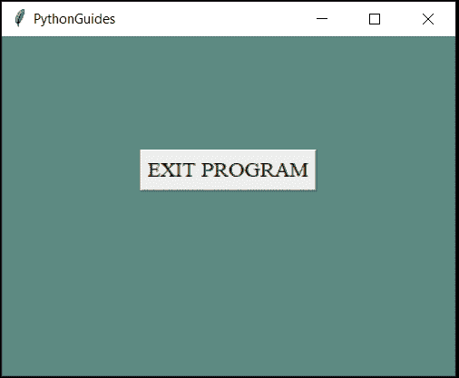

# Python Tkinter 退出程序

> 原文：<https://pythonguides.com/python-tkinter-exit-program/>

[](https://sharepointsky.teachable.com/p/python-and-machine-learning-training-course)

在这一节中，我们将学习**如何在 Python Tkinter** 中退出程序。

## Python Tkinter 退出程序

要退出一个程序，我们需要销毁窗口。在 [Python Tkinter](https://pythonguides.com/python-gui-programming/) 中有一个内置的关闭窗口的方法 ``destroy`` **`()`** 。

**语法:**

这里的 `ws` 是主窗口&是变量 `Tk()` 为类方法。

```py
ws.destroy()
```

下面是 Python Tkinter 退出程序**的小演示。**

**代码:**

在这段代码中，我们在窗口中创建了一个简单的按钮。当用户点击按钮时，它将关闭窗口。

```py
from tkinter import *
from tkinter import messagebox
from time import *

def close():
    ws.destroy()

ws = Tk()
ws.title("PythonGuides")
ws.geometry("400x300")
ws['bg']='#5d8a82'

Button(
    ws, 
    text="EXIT PROGRAM", 
    font=("Times", 14),
    command=close
    ).pack(pady=100)

ws.mainloop()
```

**输出:**

在这个输出中，显示了带有文本“退出程序”的按钮。当用户点击此按钮时，窗口将关闭。



Python Tkinter Exit Program

您可能会喜欢以下 Python 教程:

*   [Python Tkinter TreeView 示例](https://pythonguides.com/python-tkinter-treeview/)
*   [Python Tkinter 待办事项列表](https://pythonguides.com/python-tkinter-todo-list/)
*   [Python Tkinter 窗口大小](https://pythonguides.com/python-tkinter-window-size/)
*   [Python Tkinter 画布教程](https://pythonguides.com/python-tkinter-canvas/)
*   [Python Tkinter 进度条](https://pythonguides.com/python-tkinter-progress-bar/)
*   [Python Tkinter Stopwatch](https://pythonguides.com/python-tkinter-stopwatch/)
*   [Python Tkinter 列表框](https://pythonguides.com/python-tkinter-listbox/)
*   [如何进入 Python Tkinter 程序的下一页](https://pythonguides.com/go-to-next-page-in-python-tkinter/)
*   [如何使用 Python Tkinter 创建倒计时定时器](https://pythonguides.com/create-countdown-timer-using-python-tkinter/)

所以在本教程中，我们学习了**如何在 Python Tkinter** 中退出程序或者**如何在 python Tkinter** 中退出程序。

[Bijay Kumar](https://pythonguides.com/author/fewlines4biju/)

Python 是美国最流行的语言之一。我从事 Python 工作已经有很长时间了，我在与 Tkinter、Pandas、NumPy、Turtle、Django、Matplotlib、Tensorflow、Scipy、Scikit-Learn 等各种库合作方面拥有专业知识。我有与美国、加拿大、英国、澳大利亚、新西兰等国家的各种客户合作的经验。查看我的个人资料。

[enjoysharepoint.com/](https://enjoysharepoint.com/)[](https://www.facebook.com/fewlines4biju "Facebook")[](https://www.linkedin.com/in/fewlines4biju/ "Linkedin")[](https://twitter.com/fewlines4biju "Twitter")