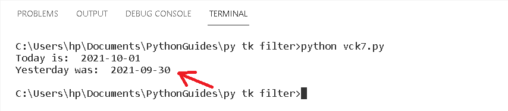
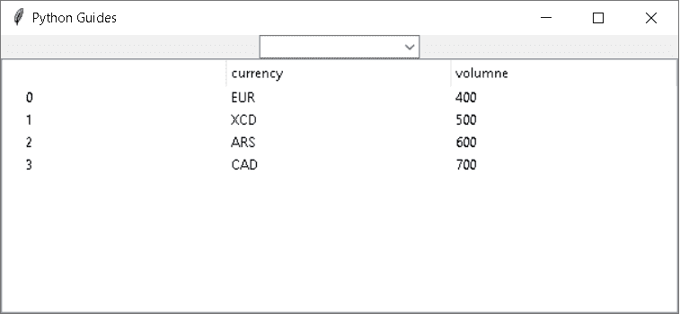
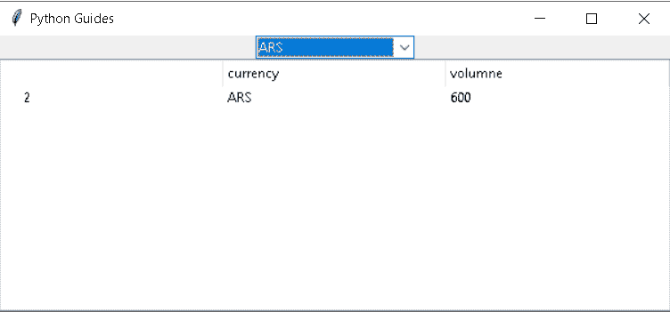
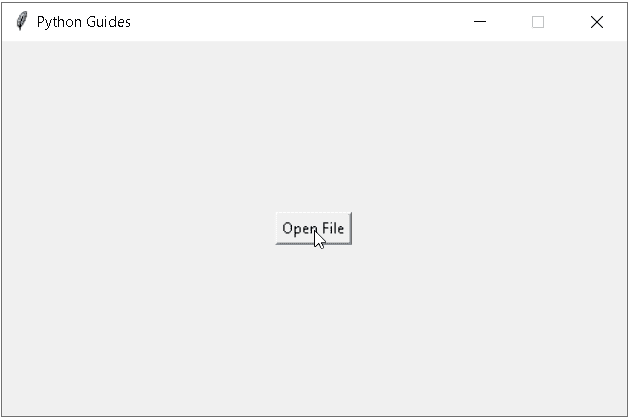
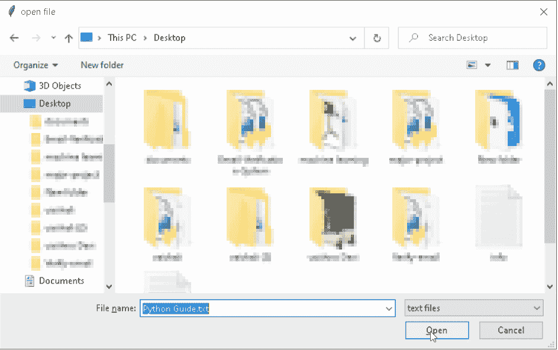
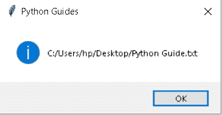
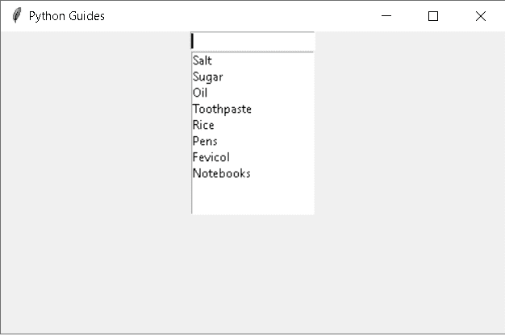
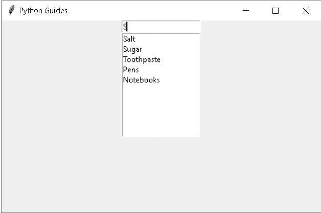

# Python Tkinter 过滤器函数()–如何使用

> 原文：<https://pythonguides.com/python-tkinter-filter/>

[](https://sharepointsky.teachable.com/p/python-and-machine-learning-training-course)

在本 [Python Tkinter 教程](https://pythonguides.com/python-gui-programming/)中，我们将通过与 Tkinter 过滤器相关的不同示例，学习如何在 Python Tkinter 中使用过滤器函数。我们将讨论这些话题。

*   Python Tkinter 过滤两个日期之间的日期
*   Python Tkinter 树视图过滤器
*   Python Tkinter 文件对话框过滤器
*   Python Tkinter Listbox 过滤器

目录

[](#)

*   [Python Tkinter 过滤两个日期之间的日期](#Python_Tkinter_filter_date_between_two_dates "Python Tkinter filter date between two dates ")
*   [Python Tkinter 树形视图过滤器](#Python_Tkinter_Treeview_Filter "Python Tkinter Treeview Filter")
*   [Python Tkinter 文件对话过滤器](#Python_Tkinter_File_Dialog_Filter "Python Tkinter File Dialog Filter")
*   [Python 的 Tkinter 列表框过滤器](#Python_Tkinter_Listbox_Filter "Python Tkinter Listbox Filter")

## Python Tkinter 过滤两个日期之间的日期

在本节中，我们将学习如何在 Python Tkinter 中过滤两个日期之间的日期。

Filter()方法过滤序列，它们可以过滤序列中出现的所有元素。

项目通过功能过滤并测试项目是否被接受，如果项目不被接受，则显示错误信息。在这种情况下，我们可以过滤两个日期之间的日期

**代码:**

在下面的代码中，我们导入库 **datetime 导入日期**， **datetime 导入**， `timedelta` 。 `timedelta()` 函数用于计算日期之间的差值。

`date.today()` 用于显示当前日期。

```py
from tkinter import *

from datetime import date
from datetime import timedelta

today1 = date.today()
print("Today is: ", today1)

yesterday1 = today1 - timedelta(days = 1)
print("Yesterday was: ", yesterday1)
```

**输出:**

运行上述代码后，我们得到以下输出，我们看到两个日期之间的筛选日期。



Python Tkinter filter date and time Output

读取 [Python Tkinter 添加函数](https://pythonguides.com/python-tkinter-add-function/)

## Python Tkinter 树形视图过滤器

在这一节中，我们将学习如何在 Python Tkinter 中**创建一个树形视图过滤器。**

Treeview 指的是分层表示，我们可以使用 filter treeview 来过滤 treeview 中的所有行。它可以检测用户选择的项目是否出现在树视图中。

**代码:**

在下面的代码中，我们导入熊猫的库。**熊猫**用于分析数据。

*   `tkinter.ttk` 模块用于获取 Python Tkinter treeview。
*   **ttk。Combobox()** 是一个列表项的组合，它显示下拉菜单。

```py
from tkinter import *
import pandas as pd
from tkinter import ttk

df = pd.DataFrame({"currency":["EUR","XCD","ARS","CAD"],
                   "volumne":[400,500,600,700]})

class app(Tk):
    def __init__(self):
        Tk.__init__(self)
        self.title("Python Guides")

        self.tree = ttk.Treeview(self)
        columns = list(df.columns)
        self.Combo = ttk.Combobox(self, values=list(df["currency"].unique()),state="readonly")
        self.Combo.pack()
        self.Combo.bind("<<ComboboxSelected>>", self.select_currency)
        self.tree["columns"] = columns
        self.tree.pack(expand=TRUE, fill=BOTH)

        for i in columns:
            self.tree.column(i, anchor="w")
            self.tree.heading(i, text=i, anchor="w")

        for index, row in df.iterrows():
            self.tree.insert("", "end", text=index, values=list(row))

    def select_currency(self,event=None):
        self.tree.delete(*self.tree.get_children())
        for index, row in df.loc[df["currency"].eq(self.Combo.get())].iterrows():
            self.tree.insert("", "end", text=index, values=list(row))

ws = app()
ws.mainloop() 
```

**输出:**

在下面的输出中，我们看到显示了一个简单的 Tkinter treeview。其中有四行和两列。



Python Tkinter Treeview filter Output

在这张图片中，我们看到用户在选择了过滤方法来验证货币是否出现在列表中之后选择了货币。如果存在，它将显示我们已经显示的结果。



Python Tkinter Treeview filter

阅读 [Python Tkinter 面板](https://pythonguides.com/python-tkinter-panel/)

## Python Tkinter 文件对话过滤器

在这一节中，我们将学习如何在 Python Tkinter 中**创建一个对话框过滤器。**

文件对话框过滤器确定从对话框中显示什么类型的文件。用户从对话框中选择文件，如果文件出现在对话框中，则显示文件位置，如果文件未被选择，则显示弹出消息“选择文件”。

**代码:**

在下面的代码中，我们从 Tkinter import filedialog 导入一些库比如**作为 fd** ，从 tkinter.messagebox 导入 showinfo 导入**。**

*   `fd.askopenfilename()` 用于显示一个对话框，允许从文件系统中选择一个文件。
*   `showinfo()` 用于在窗口上给出一个弹出消息。

```py
from tkinter import *
from tkinter import filedialog as fd
from tkinter.messagebox import showinfo

ws = Tk()
ws.title('Python Guides')
ws.resizable(False, False)
ws.geometry('500x300')

def selectfile():
    filetypes = (
        ('text files', '*.txt'),
        ('All files', '*Allfile*')
    )

    filename = fd.askopenfilename(
        title='open file',
        initialdir='/',
        filetypes=filetypes)

    showinfo(
        title='Python Guides',
        message=filename
    )

button = Button(
    ws,
    text='Open File',
    command=selectfile
)

button.pack(expand=True)

ws.mainloop() 
```

**输出:**

在下面的输出中，我们看到一个小部件，在这个小部件中创建了一个按钮。



Python tkinter file dialog filter

点击按钮时，会打开一个对话框。从这个对话框中，我们选择一个文件。选择一个文件后，点击打开。



Python Tkinter file dialog filter

点击打开后，我们过滤后得到文件所在的路径。



Python Tkinter filedialog filter

在方法之后读取 [Python Tkinter](https://pythonguides.com/python-tkinter-after-method/)

## Python 的 Tkinter 列表框过滤器

在本节中，我们将学习如何在 Python Tkinter 中**创建列表框过滤器。**

通过列表框过滤器，我们的意思是从列表中过滤结果，我们可以使用搜索框的帮助，帮助过滤我们的内容，也显示我们的结果。

**代码:**

在下面的代码中，我们在 `list.insert()` 的帮助下创建了一个列表框。我们将一些值插入到一个对我们可见的列表框中，为了过滤这些值，我们添加了一个过滤框，用户可以在其中键入想要在列表框中查看的项目。

`listbox.insert()` 用于在列表中插入值

**列表** =('值，'值 1 ')

```py
from tkinter import *

def Scankey(event):

	val = event.widget.get()
	print(val)

	if val == '':
		data = list
	else:
		data = []
		for item in list:
			if val.lower() in item.lower():
				data.append(item)				

	Update(data)
def Update(data):

	listbox.delete(0, 'end')

	for item in data:
		listbox.insert('end', item)

list = ('Salt','Sugar','Oil',
	'Toothpaste','Rice',
	'Pens','Fevicol','Notebooks' )

ws = Tk()
ws.title("Python Guides")
ws.geometry("500x300")

entry = Entry(ws)
entry.pack()
entry.bind('<KeyRelease>', Scankey)

listbox = Listbox(ws)
listbox.pack()
Update(list)

ws.mainloop()
```

**输出:**

运行上述代码后，我们可以看到下面的输出，这有助于描述列表框过滤器。这里，在一个窗口中，创建了一个列表框，其中包含一些预定义的项目和一个过滤框。



Python Tkinter Listbox Filter Output

在下面的输出中，我们可以看到用户使用一些属性来过滤列表框中的一些项目，列表框中的过滤功能正常工作并定义结果。



Python Tkinter Listbox Filter Output

**相关帖子:**

*   [python tkinter auto complete](https://pythonguides.com/python-tkinter-autocomplete/)
*   [Tkinter 中的费用跟踪器](https://pythonguides.com/expense-tracking-application-using-python-tkinter/)
*   [Python Tkinter 分隔符](https://pythonguides.com/python-tkinter-separator/)
*   [从 PDF Python 中提取文本](https://pythonguides.com/extract-text-from-pdf-python/)
*   [Python Tkinter Scale](https://pythonguides.com/python-tkinter-scale/)

因此，在本教程中，我们讨论了 **Python Tkinter 过滤器**，我们还涵盖了不同的例子。这是我们已经讨论过的例子列表。

*   python Tkinter 过滤两个日期之间的日期
*   python Tkinter 树视图过滤器
*   python Tkinter 文件对话框过滤器
*   python Tkinter Listbox 过滤器

[Bijay Kumar](https://pythonguides.com/author/fewlines4biju/)

Python 是美国最流行的语言之一。我从事 Python 工作已经有很长时间了，我在与 Tkinter、Pandas、NumPy、Turtle、Django、Matplotlib、Tensorflow、Scipy、Scikit-Learn 等各种库合作方面拥有专业知识。我有与美国、加拿大、英国、澳大利亚、新西兰等国家的各种客户合作的经验。查看我的个人资料。

[enjoysharepoint.com/](https://enjoysharepoint.com/)[](https://www.facebook.com/fewlines4biju "Facebook")[](https://www.linkedin.com/in/fewlines4biju/ "Linkedin")[](https://twitter.com/fewlines4biju "Twitter")