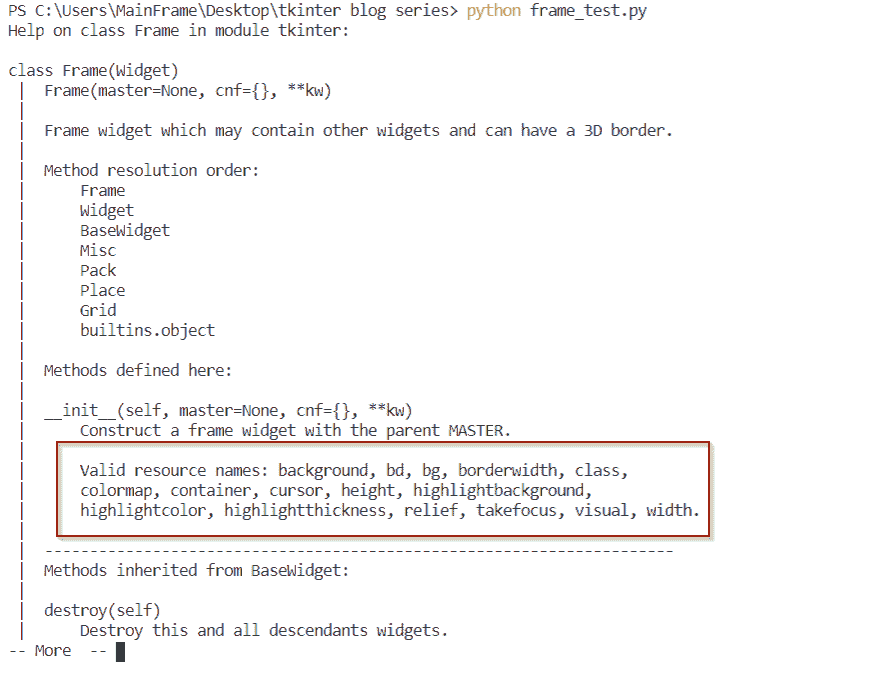
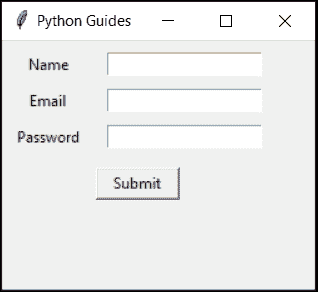
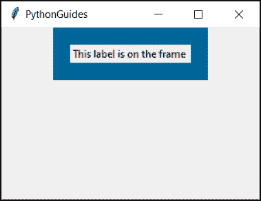
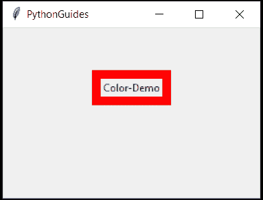
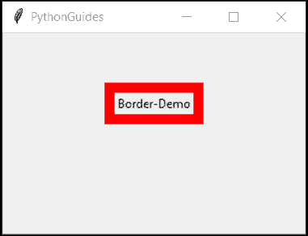
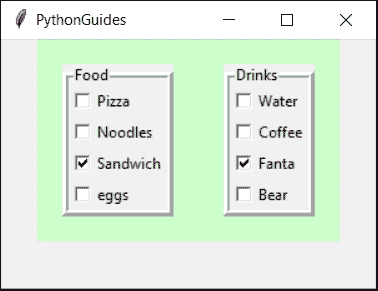
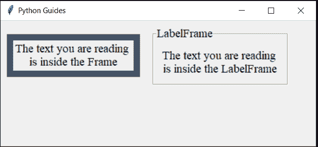
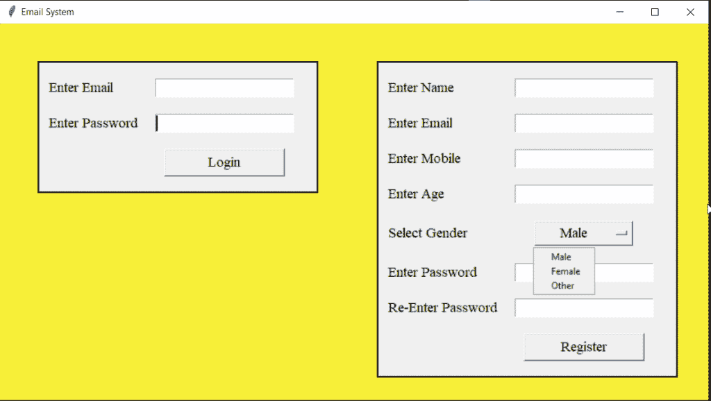

# Python Tkinter 框架

> 原文：<https://pythonguides.com/python-tkinter-frame/>

[](https://sharepointsky.teachable.com/p/python-and-machine-learning-training-course)

在本教程中，我们将学习 `python tkinter frame` 。我们也将涉及这些主题。

*   Python Tkinter 框架
*   Python Tkinter 框架属性
*   Python Tkinter 框架网格
*   Python Tkinter 框架类
*   Python Tkinter 帧颜色
*   Python Tkinter 帧大小
*   Python Tkinter 框架边框
*   框架内的 Python Tkinter 框架
*   Python Tkinter 框架与 LabelFrame
*   Python Tkinter 框架小型项目

你知道图形用户界面编程吗？查看 [Python GUI 编程(Python Tkinter)](https://pythonguides.com/python-gui-programming/) 。

目录

[](#)

*   [Python Tkinter 帧](#Python_Tkinter_Frame "Python Tkinter Frame")
*   [Python Tkinter 帧属性](#Python_Tkinter_Frame_attributes "Python Tkinter Frame attributes")
*   [Python Tkinter 框架网格](#Python_Tkinter_Frame_grid "Python Tkinter Frame grid")
*   [Python Tkinter 帧类](#Python_Tkinter_Frame_class "Python Tkinter Frame class")
*   [Python Tkinter 帧颜色](#Python_Tkinter_Frame_color "Python Tkinter Frame color")
*   [Python Tkinter 帧大小](#Python_Tkinter_Frame_size "Python Tkinter Frame size")
*   [Python Tkinter 框架边框](#Python_Tkinter_Frame_border "Python Tkinter Frame border")
*   [Python 帧内的 Tkinter 帧](#Python_Tkinter_Frame_within_the_Frame "Python Tkinter Frame within the Frame")
*   [Python Tkinter Frame vs label Frame](#Python_Tkinter_Frame_vs_LabelFrame "Python Tkinter Frame vs LabelFrame")
*   [Python Tkinter 框架迷你项目](#Python_Tkinter_Frame_Mini-Project "Python Tkinter Frame Mini-Project")

## Python Tkinter 帧

*   Tkinter frame 是一个顶级小部件。它位于父窗口上，用于对其他小部件进行分组。
*   它改善了应用程序的用户界面/UX。Python 框架也称为面板。

## Python Tkinter 帧属性

*   属性是指特性。
*   大多数功能在每个小部件中都是通用的。但是很少有功能只在特定的小部件上起作用。常见的特征有，bg，宽度，高度，fg 等。
*   属性是有效的资源。要查看这些有效资源，请键入`help(widget_name)`

**代码:**

下面是在 Python 中查看小部件框架所有属性的代码。

```py
from tkinter import *

ws = Tk()
ws.geometry('300x200')
ws.title('PythonGuides')

help(Frame)

ws.mainloop()
```

**输出:**

输出显示与小部件框架相关的所有信息。属性部分突出显示。



Python Tkinter Frame

现在，让我们结合实际来研究一下每个部件。

你可能也喜欢 Python 熊猫和 [Python Tkinter 中的](https://pythonguides.com/python-tkinter-to-display-data-in-textboxes/) [Crosstab 在文本框](https://pythonguides.com/crosstab-in-python-pandas/)中显示数据。

| **背景**，
背景 | 背景或背景填充框架背景中的颜色。这样做的方法不止一种。
1) frame = Frame(ws，BG = ' red ')
Frame . pack()
2)Frame = Frame(ws，background = ' red ')
Frame . pack()
3)Frame = Frame(ws)
Frame . config(BG = ' red ')
Frame . pack()
4)Frame = Frame(ws)
Frame . config(background = ' red ')
Frame . pack()
5)Frame = Frame(ws)【T12 |
| **borderdth，**
`bd` | bd 或 borderwidth 为框架的边框提供宽度。类似于 bg 也可以多种方式实现:
1) frame = Frame(ws，BD = 10)
Frame . pack()
2)Frame = Frame(ws，border width = 10)
Frame . pack()
3)Frame = Frame(ws)
Frame . config(BD = 10’)
Frame . pack()
4)Frame = Frame(ws)
Frame . config(border width = 10)
 |
| **类** | 默认的类名是 Frame。
框架(父，* *选项) |
| **色彩图** | 很少有旧屏幕支持 256 色或更少的颜色。所以开发者必须为颜色设置限制。在这种情况下，会映射受支持的颜色，以便在整个应用程序中只能实现这些颜色。是的，不同的窗口可以继承这个颜色，也可以创建一个新的颜色。

frame = Frame(bg="blue "，colormap="new "，border width = 10)
Frame . pack()
 |
| **集装箱** | 容器是布局管理器。小部件有两种类型:容器&子部件。容器组织子部件。
pack、grid、place 都是容器小部件。 |
| `cursor` | 光标是屏幕上显示鼠标位置的图标。
这里是可以使用的光标列表:“箭头”、“圆圈”、“时钟”、“十字”、“点盒”、“交换”、“芙蓉”、“心”、“心”、“人”、“T1”、“鼠标”、“海盗”、“加号”、“穿梭”、“上浆”、“蜘蛛”、“喷雾罐”、“星星”、“目标”、“十字”、“T2”、“迷航”、“手表”。
**举例:**
frame = Frame(ws，cursor = ' clock ')
Frame . pack()

 |
| **高度**，**宽度** | 高度是指水平空间，宽度是指垂直空间。
**举例:**
frame = Frame(ws，高度=20，宽度=50)
frame.pack() |
| **高亮背景** | 当框架没有焦点时，焦点突出显示的颜色。 |
| **荧光笔颜色** | 当框架具有焦点时，焦点中显示的颜色会高亮显示。 |
| **高光厚度** | 焦点突出显示的粗细。 |
| **减压** | 它通过给框架添加 3D 效果来给框架添加样式。
有 5 种缓解选项。
1)平
2)凹
3)凸
4)槽
5)脊

下面是要实现的代码片段:
frame = Frame(ws，relief=FLAT，bd=10)
frame.pack() |
| **对焦** | takefocus 的默认值为 0。当按下**标签**时，它决定焦点的移动。 |
| **视觉** | 为任何窗体中的新窗口指定可视信息。 |

## Python Tkinter 框架网格

*   Grid 用于以行列格式定位框架小部件。
*   **行** & **列**都是必要的参数。

**代码:**

在这段代码中，我们使用了 2 帧。一个用于标签，另一个用于输入框。使用网格管理器定位框架。

```py
from tkinter import *

ws = Tk()
ws.title('Python Guides')
ws.geometry('250x200')

frame1 = Frame(ws, padx=5, pady=5)
frame1.grid(row=0, column=1)

Label(frame1, text='Name', padx=5, pady=5).pack()
Label(frame1, text='Email', padx=5, pady=5).pack()
Label(frame1, text='Password', padx=5, pady=5).pack()

frame2 = Frame(ws, padx=5, pady=5)
frame2.grid(row=0, column=2)

Entry(frame2).pack(padx=5, pady=5)
Entry(frame2).pack(padx=5, pady=5)
Entry(frame2).pack(padx=5, pady=5)

Button(ws, text='Submit', padx=10).grid(row=1, columnspan=5, pady=5)

ws.mainloop()
```

**输出:**

在此输出中，虽然框架不可见，但它确实存在。左边的标签组织在框架 1 中，右边的输入框组织在框架 2 中。使用栅格几何图形管理器放置框架。



Python Tkinter Frame grid

你可能会喜欢，[如何在 Python Tkinter](https://pythonguides.com/set-background-to-be-an-image-in-python-tkinter/) 中设置背景为图像？

## Python Tkinter 帧类

*   类有助于避免部分代码的重复。
*   我们大部分时间使用类。
*   有时我们使用预定义的类或者创建新的类。
*   下面是 frame 使用类的实现。

**代码:**

```py
from tkinter import *

class Frame1(Frame):
    def __init__(self, ws):
        Frame.__init__(self, ws, bg="#006699")
        self.ws = ws
        self.widgets()

    def widgets(self):
        self.text = Label(self, text="This label is on the frame ")
        self.text.grid(row=0, column=0, padx=20, pady=20) # margins

class Win(Tk):

    def __init__(self, ws):
        Tk.__init__(self, ws)
        self.ws = ws
        self.title('PythonGuides')
        self.geometry('300x200')
        self.main()

    def main(self):
        self.w = Frame1(self)
        self.w.pack()

if __name__=="__main__":
    app = Win(None)
    app.mainloop()
```

**输出:**



Python Tkinter Frame class

阅读: [Python Tkinter Colors](https://pythonguides.com/python-tkinter-colors/)

## Python Tkinter 帧颜色

*   颜色用于为应用程序提供漂亮的外观
*   选择正确的颜色使应用程序看起来很专业。
*   在框架中，我们可以改变窗口的背景颜色。
*   bg 或 background 关键字用于填充框架中的颜色。

**代码:**

```py
from tkinter import *

ws = Tk()
ws.title('PythonGuides')
ws.geometry('300x200')

frame = Frame(ws, bd=10, bg='red')
frame.pack(pady=50)

Label(frame, text='Color-Demo').pack()

ws.mainloop()
```

**输出:**

在此输出中，显示了 10 个边框宽度的红色框架。



Python Tkinter Frame color

读取 [Python Tkinter 过滤函数()](https://pythonguides.com/python-tkinter-filter/)

## Python Tkinter 帧大小

*   可以使用关键字**高度**和**宽度**来控制窗口的大小
*   作为高度或宽度提供的任何整数值将修改窗口屏幕。

## Python Tkinter 框架边框

*   为了提供边界，我们可以使用 `bd` 或者 `borderwidth` 关键字。
*   可以传递任何整数值来设置边框

**代码:**

在这段代码中，我们创建了宽度为 20 的边框。

```py
from tkinter import *

ws = Tk()
ws.title('PythonGuides')
ws.geometry('300x200')

frame = Frame(ws, bd=10, bg='red')
frame.pack(pady=50)

Label(frame, text='Border-Demo').pack()

ws.mainloop()
```

**输出:**

在此输出中，创建了宽度为 20 的边框。因为框架和主窗口一样有默认颜色。所以我们为边界提供了红色。



Python Tkinter Frame border

## Python 帧内的 Tkinter 帧

*   框架在父窗口上创建一个窗口。
*   其他框架放在第一个框架上来组织小部件。

**代码:**

在这段代码中，创建了 3 个帧。这两个框架中的一个放在另一个框架中。

```py
from tkinter import *

ws = Tk()
ws.title('PythonGuides')
ws.geometry('300x200')

frame = Frame(ws, height=300, width=300, bg='#ccffcc')
frame.pack()

food = LabelFrame(frame, text='Food', bd=5, relief=RIDGE)
food.grid(row=0, column=0, sticky=W, padx=20, pady=20)

Checkbutton(food, text='Pizza').pack(anchor=W)
Checkbutton(food, text='Noodles').pack(anchor=W)
Checkbutton(food, text='Sandwich').pack(anchor=W)
Checkbutton(food, text='eggs').pack(anchor=W)

drinks = LabelFrame(frame, text='Drinks', bd=5, relief=RIDGE)
drinks.grid(row=0, column=1, sticky=E, padx=20, pady=20)

Checkbutton(drinks, text='Water').pack(anchor=W)
Checkbutton(drinks, text='Coffee').pack(anchor=W)
Checkbutton(drinks, text='Fanta').pack(anchor=W)
Checkbutton(drinks, text='Bear').pack(anchor=W)

ws.mainloop()
```

**输出:**

在这个输出中，有 3 个框架，食品和饮料被标在绿色框架中



Python Tkinter Frame within the Frame

阅读: [Python Tkinter 主循环](https://pythonguides.com/python-tkinter-mainloop/)

## Python Tkinter Frame vs label Frame

LabelFrame 是 Frame 的另一种变体。只有两个可能的区别:

| **帧** | **标签框** |
| --- | --- |
| 默认情况下没有边框 | 默认情况下有虚线边框 |
| 无法提供标题描述 | 可以使用关键字**文本**来提供标题 |
| **语法**:帧(主) | **Synatx:**label frame(master，text="text ") |
| **举例:**
Frame = Frame(ws)
Frame . pack() | **举例:**
frame = LabelFrame(ws，text = " text to display ")
frame . pack() |

Python Tkinter Frame vs LabelFrame



所以在这里你可以观察到 Label 和 LabelFrame 的区别。LabelFrame 与背景颜色相同，这就是为什么将颜色改为蓝色的原因。所有蓝色的部分都是带有标签的名声。而 LabelFrame 具有写在顶部的文本和虚线边界。

阅读 [Python Tkinter add 函数示例](https://pythonguides.com/python-tkinter-add-function/)

## Python Tkinter 框架迷你项目

*   在这个项目中，我们在 Python TKinter 中创建了漂亮的登录和注册页面。
*   登录和注册部分都是使用两个不同的框架创建的，名称分别为**左框架&右框架**

**代码:**

**左框**用于登录部分，而**右框**用于注册部分

```py
from tkinter import *

ws = Tk()
ws.title('Email System')
ws.geometry('940x500')
ws.config(bg='#f7ef38')

variable = StringVar()
gender = ('Male', 'Female', 'Other')
variable.set(gender[0])

# widgets
left_frame = Frame(ws, bd=2, relief=SOLID, padx=10, pady=10)

Label(left_frame, text="Enter Email", font=('Times', 14)).grid(row=0, column=0, sticky=W, pady=10)
Label(left_frame, text="Enter Password", font=('Times', 14)).grid(row=1, column=0, pady=10)
log_em = Entry(left_frame, font=('Times', 14))
log_pw = Entry(left_frame, font=('Times', 14))
login_btn = Button(left_frame, width=15, text='Login', font=('Times', 14), command=None)

right_frame = Frame(ws, bd=2, relief=SOLID, padx=10, pady=10)

Label(right_frame, text="Enter Name", font=('Times', 14)).grid(row=0, column=0, sticky=W, pady=10)
Label(right_frame, text="Enter Email", font=('Times', 14)).grid(row=1, column=0, sticky=W, pady=10)
Label(right_frame, text="Enter Mobile", font=('Times', 14)).grid(row=2, column=0, sticky=W, pady=10)
Label(right_frame, text="Enter Age", font=('Times', 14)).grid(row=3, column=0, sticky=W, pady=10)
Label(right_frame, text="Select Gender", font=('Times', 14)).grid(row=4, column=0, sticky=W, pady=10)
Label(right_frame, text="Enter Password", font=('Times', 14)).grid(row=5, column=0, sticky=W, pady=10)
Label(right_frame, text="Re-Enter Password", font=('Times', 14)).grid(row=6, column=0, sticky=W, pady=10)

reg_na = Entry(right_frame, font=('Times', 14))
reg_em = Entry(right_frame, font=('Times', 14))
reg_mo = Entry(right_frame, font=('Times', 14))
reg_ag = Entry(right_frame, font=('Times', 14))
reg_ge = OptionMenu(right_frame, variable, *gender)
reg_ge.config(width=10, font=('Times', 14))
reg_pw = Entry(right_frame, font=('Times', 14))
re_pw = Entry(right_frame, font=('Times', 14))

reg_btn = Button(right_frame, width=15, text='Register', font=('Times', 14), command=None)

# widgets placement
log_em.grid(row=0, column=1, pady=10, padx=20)
log_pw.grid(row=1, column=1, pady=10, padx=20)
login_btn.grid(row=2, column=1, pady=10, padx=20)
left_frame.place(x=50, y=50)

reg_na.grid(row=0, column=1, pady=10, padx=20)
reg_em.grid(row=1, column=1, pady=10, padx=20) 
reg_mo.grid(row=2, column=1, pady=10, padx=20)
reg_ag.grid(row=3, column=1, pady=10, padx=20)
reg_ge.grid(row=4, column=1, pady=10, padx=20)
reg_pw.grid(row=5, column=1, pady=10, padx=20)
re_pw.grid(row=6, column=1, pady=10, padx=20)
reg_btn.grid(row=7, column=1, pady=10, padx=20)
right_frame.place(x=500, y=50)

# infinite loop
ws.mainloop()
```

**输出:**

这是代码的输出，我们选择黄色和灰色，因为这些颜色被提名为“年度颜色”。请随意在您的项目中使用这些代码。



您可能会喜欢以下 Python 教程:

*   [如何用 Python 显示日历](https://pythonguides.com/display-calendar-in-python/)
*   [如何用 Python 制作计算器](https://pythonguides.com/make-a-calculator-in-python/)
*   [Python 中的正则表达式](https://pythonguides.com/regular-expressions-in-python/)
*   [Python 布尔函数](https://pythonguides.com/python-booleans/)
*   [Python 生成器](https://pythonguides.com/python-generators/)
*   [Python Tkinter 菜单栏–如何使用](https://pythonguides.com/python-tkinter-menu-bar/)
*   [Python Tkinter check button–如何使用](https://pythonguides.com/python-tkinter-checkbutton/)
*   [Python Tkinter 单选按钮–如何使用](https://pythonguides.com/python-tkinter-radiobutton/)
*   [Python Tkinter 按钮–如何使用](https://pythonguides.com/python-tkinter-button/)
*   [Python Tkinter 条目–如何使用](https://pythonguides.com/python-tkinter-entry/)
*   [如何使用 Python Tkinter 获取用户输入并存储在变量中](https://pythonguides.com/how-to-take-user-input-and-store-in-variable-using-python-tkinter/)

因此，在本教程中，我们已经学习了关于 `python tkinter frame` 的知识，并且我们已经涵盖了这些主题。

*   Python Tkinter 框架
*   Python Tkinter 框架属性
*   Python Tkinter 框架网格
*   Python Tkinter 框架类
*   Python Tkinter 帧颜色
*   Python Tkinter 帧大小
*   Python Tkinter 框架边框
*   框架内的 Python Tkinter 框架
*   Python Tkinter 框架与 LabelFrame
*   Python Tkinter 框架小型项目

[Bijay Kumar](https://pythonguides.com/author/fewlines4biju/)

Python 是美国最流行的语言之一。我从事 Python 工作已经有很长时间了，我在与 Tkinter、Pandas、NumPy、Turtle、Django、Matplotlib、Tensorflow、Scipy、Scikit-Learn 等各种库合作方面拥有专业知识。我有与美国、加拿大、英国、澳大利亚、新西兰等国家的各种客户合作的经验。查看我的个人资料。

[enjoysharepoint.com/](https://enjoysharepoint.com/)[](https://www.facebook.com/fewlines4biju "Facebook")[](https://www.linkedin.com/in/fewlines4biju/ "Linkedin")[](https://twitter.com/fewlines4biju "Twitter")