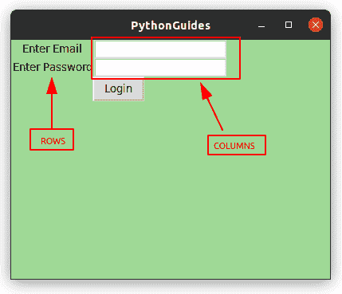
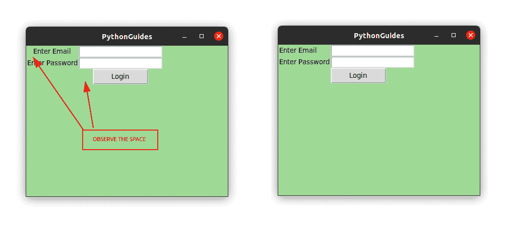
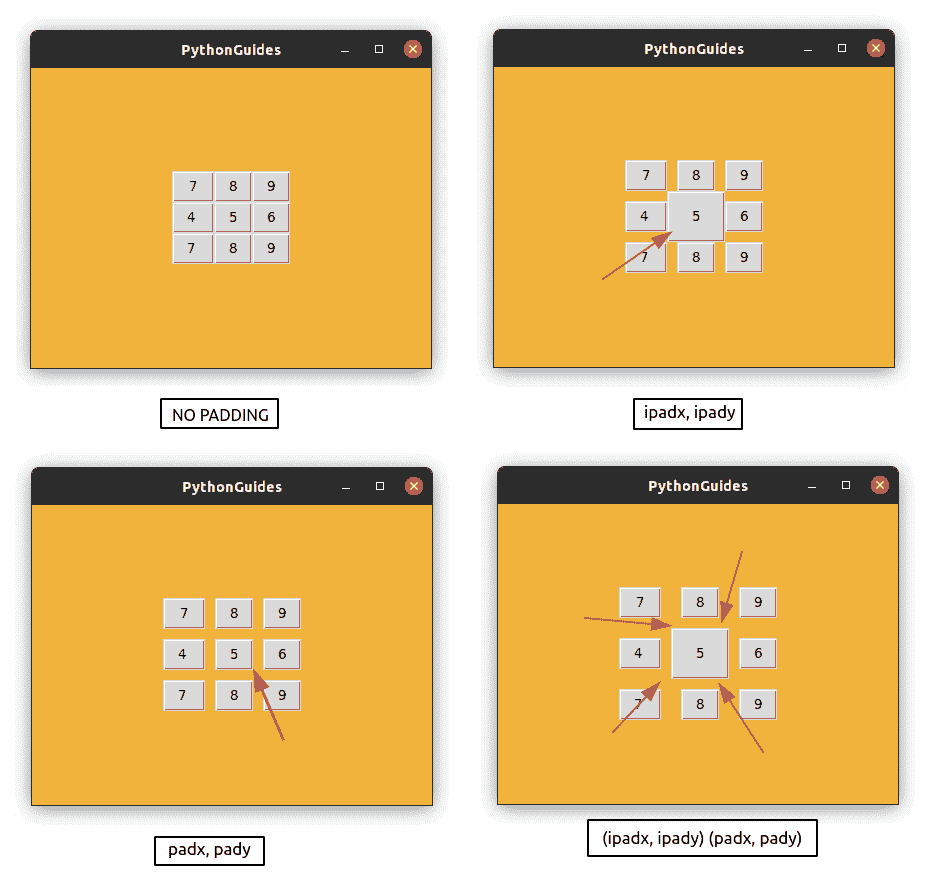
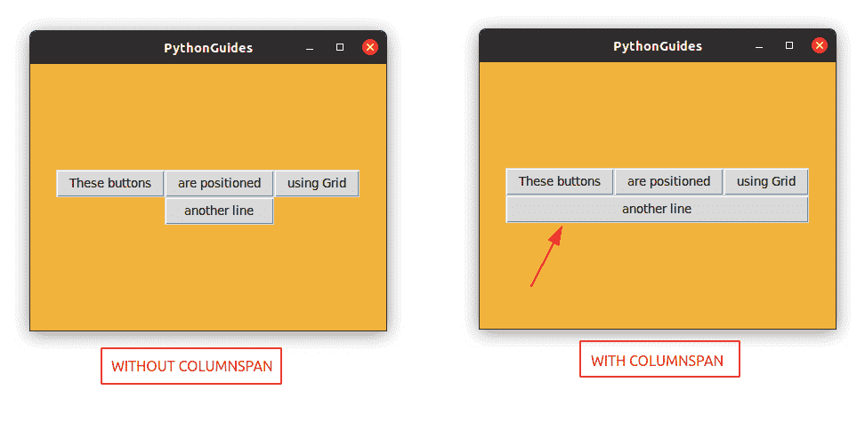
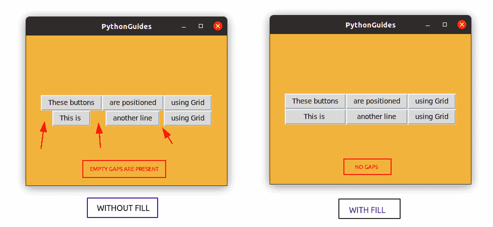

# Python Tkinter Grid(Python Tkinter 中的 Grid()方法)

> 原文：<https://pythonguides.com/python-tkinter-grid/>

[](https://sharepointsky.teachable.com/p/python-and-machine-learning-training-course)

想知道如何使用 `Python Tkinter grid` ？在本教程中，我们将介绍 Python Tkinter 中关于网格的所有内容。我们将看到如何在 Python Tkinter 中使用 **grid()方法。此外，我们还将讨论以下主题:**

*   python tkinter grid(python tkinter 网格)
*   如何使用 Python Tkinter grid()方法
*   Python Tkinter 格网示例
*   Python Tkinter 格网左对齐
*   Python Tkinter 格网函数
*   Python Tkinter 网格填充
*   Python Tkinter 网格列 span
*   Python Tkinter 网格间距
*   Python Tkinter 网格不起作用
*   Python Tkinter 格网展开
*   Python Tkinter 格网填充

目录

[](#)

*   [Python Tkinter Grid](#Python_Tkinter_Grid "Python Tkinter Grid")
*   [Python Tkinter 网格示例](#Python_Tkinter_Grid_Example "Python Tkinter Grid Example")
*   [Python Tkinter 网格左对齐](#Python_Tkinter_Grid_Align_Left "Python Tkinter Grid Align Left")
*   [Python Tkinter 网格函数](#Python_Tkinter_Grid_Function "Python Tkinter Grid Function")
*   [Python Tkinter 网格填充](#Python_Tkinter_Grid_Padding "Python Tkinter Grid Padding")
*   [Python Tkinter 网格列跨度](#Python_Tkinter_Grid_Columnspan "Python Tkinter Grid Columnspan")
*   [Python Tkinter 网格间距](#Python_Tkinter_Grid_Spacing "Python Tkinter Grid Spacing")
*   [Python Tkinter 网格不工作](#Python_Tkinter_Grid_Not_Working "Python Tkinter Grid Not Working")
*   [Python Tkinter 网格展开](#Python_Tkinter_Grid_Expand "Python Tkinter Grid Expand")
*   [Python Tkinter 网格填充](#Python_Tkinter_Grid_Fill "Python Tkinter Grid Fill")

## Python Tkinter Grid

*   Python Tkinter 提供了一些小部件，使应用程序对用户来说看起来很好并且易于使用。在应用程序上放置小部件与选择正确的小部件同样重要。
*   Python Tkinter 提供了三种类型的布局管理器，帮助开发人员将小部件放置在应用程序的正确位置。
    *   **Pack:** 将所有的 widget 打包在中心，按顺序放置 widget。
    *   **Grid:** Grid 将小部件按行和列的方式放置。
    *   **Place:** 在 X 和 Y 坐标中放置小部件。
*   在本教程中，我们将讨论 **Python Tkinter Grid()方法**。我们将探索 Python Tkinter 中网格布局管理器的所有可用选项。

## Python Tkinter 网格示例

在本节中，我们将看到 Python Tkinter 中的**网格布局管理器的一个例子，我们还将看到 Python Tkinter 中网格布局管理器的一些特性。**

*   Grid Layout manager 需要行和列作为参数，使用这些信息将小部件放置在屏幕上。
*   行和列从屏幕的左上角开始。您可以将电子表格可视化，以便更好地理解它。
*   `columnspan` 用于占据列的其他单元格，如下例所示，您可以看到 button 占据了两个单元格的空间。
*   这是一个在小部件上实现网格的例子。在这个例子中，我们使用了标签、条目和按钮部件。



Python Tkinter Grid

**上面例子的源代码**:

在本例中，我们将标签小部件放在第 0 列，将条目小部件放在第 1 列。而按钮扩展为两列。

```py
from tkinter import *

ws = Tk()
ws.title('PythonGuides')
ws.geometry('400x300')
ws.config(bg='#9FD996')

Label(
    ws,
    text='Enter Email', 
    bg='#9FD996'
).grid(row=0, column=0)

Label(
    ws,
    text='Enter Password',
    bg='#9FD996'
).grid(row=1, column=0)

Entry(ws).grid(row=0, column=1)
Entry(ws).grid(row=1, column=1)

Button(
    ws,
    text='Login',
    command=None
).grid(row=2, columnspan=2)

ws.mainloop()
```

## Python Tkinter 网格左对齐

*   Python Tkinter 中的**网格**布局管理器提供了一个**粘性**选项，允许将小部件向左、右、上、下方向对齐。在这一节中，我们将看到如何在 Python Tkinter 中使用 Grid 设置左对齐。
*   `Sticky` 需要小写的通用方向的第一个字母来设置小工具的选择方向。以下是选择
    *   **sticky = 'e' :** 向右对齐
    *   **sticky = 'w':** 向左对齐
    *   **sticky = 'n':** 与顶部对齐
    *   **sticky = 's':** 与底部对齐

```py
grid(row=0, column=1, sticky='w')
```

**Python Tkinter 网格左对齐示例:**

在本例中，我们显示了两幅图像。在第一张图中，标签小部件和按钮小部件没有对齐，而在第二张图中，我们使用 Python Tkinter 的网格布局管理器中的 sticky 选项将小部件都向左对齐。



Python Tkinter Grid align left using sticky

## Python Tkinter 网格函数

*   Python Tkinter 中的 Grid 是一个允许管理小部件布局的函数。它将行和列作为参数，并将小部件放置为 2D 格式。
*   由于其 2D 属性，Python Tkinter Grid 广泛用于游戏和应用程序，如计算器、井字游戏、地雷等。
*   除了行和列， `Grid` 还提供了一些选项:

| 选择 | 描述 |
| --- | --- |
| 列，行 | 列指的是表格的垂直单元格
行指的是表格的水平单元格 |
| 列跨度，行跨度 | 列合并列以提供更多空间
行合并行以提供更多水平空间 |
| ipad，ipad | ipadx 在小工具的边框中垂直添加像素 |
| 帕德，帕德 | padx 在小工具边框外垂直添加像素
pady 在小工具边框外水平添加像素 |
| 粘的 | 它把小部件贴在东西南北四个方向。 |

## Python Tkinter 网格填充

*   Python Tkinter 中的 Grid 提供了一个填充选项，使用该选项可以在小部件的边框内外添加空间。
*   在组织小部件时，小部件的默认**大小**或**位置**有时不符合开发者的期望。在使用填充的时候，开发人员调整小部件。
*   有两种类型的填充:
    *   小工具边框内部的填充
    *   小部件边框外的填充
*   **ipadx，ipady** 用于在小工具的边框内水平和垂直添加空格**。**
*   **padx，pady** 用于在小工具边框外水平和垂直添加空格**。**

**Python Tkinter 中的网格填充示例**

在本例中，显示了四张图片，每张图片都显示了添加填充时按钮的变化。我们选择了位于所有按钮中间的按钮 5。

**图片 1:** 图片一没有任何填充。添加此图像的目的是向您展示原始图像，以便您可以将其与更改后的图像进行比较。

**图 2:** 我们添加了 `ipadx=10` 和`ipady=10`，在小工具的边框内添加了 10 个像素，它开始看起来更大了。

**图 3:** 我们添加了`padx=10`和`pady=10`，这 10 个像素被添加到小部件的边界之外，因此其他小部件必须移开。

**图像 4:** 第四幅图像是最终图像，其源代码如下。在这里，我们应用了填充，结果是按钮 5 看起来更大了，其他部件移动了 10 个像素。



Python Tkinter Grid

**上图的代码片段**

下面是上述程序的代码片段。在这段代码中，我们提供了内部和外部小部件的宽度。所以这段代码将在第四张图片上产生输出。确切的代码可在**第 15 行找到。**

```py
from tkinter import *

ws = Tk()
ws.title('PythonGuides')
ws.geometry('400x300')
ws.config(bg='#F2B33D')

frame = Frame(ws, bg='#F2B33D')

Button(frame, text="7").grid(row=0, column=0, sticky='ew')
Button(frame, text="8").grid(row=0, column=1)
Button(frame, text="9").grid(row=0, column=2)

Button(frame, text="4 ").grid(row=1, column=0)
Button(frame, text="5").grid(row=1, column=1, ipadx=10, ipady=10, padx=10, pady=10)
Button(frame, text="6").grid(row=1, column=2)

Button(frame, text="7 ").grid(row=2, column=0)
Button(frame, text="8").grid(row=2, column=1)
Button(frame, text="9").grid(row=2, column=2)

frame.pack(expand=True) 

ws.mainloop()
```

## Python Tkinter 网格列跨度

*   Python Tkinter 中的 Grid 提供了 `columnspan` ，使用它我们可以将两个或多个单元格合并成一个。
*   当你需要额外的空间来放置一个特殊的小部件时，columnspan 会很有帮助。
*   columnspan 接受整数作为参数，并将相同数量的单元格合并在一起。



Python Tkinter Grid Columnspan

**代码片段:**

在这段代码中，online 14 我们使用了 `columnspan=3` ，它将三个单元格合并为一个并向其显示按钮。因为我们设置了 **sticky='ew'** ，所以按钮被扩展到可用空间。

```py
from tkinter import *

ws = Tk()
ws.title('PythonGuides')
ws.geometry('400x300')
ws.config(bg='#F2B33D')

frame = Frame(ws, bg='#F2B33D')

Button(frame, text="These buttons").grid(row=0, column=0)
Button(frame, text="are positioned").grid(row=0, column=1)
Button(frame, text="using Grid").grid(row=0, column=2)

Button(frame, text="another line").grid(row=1, columnspan=3, sticky='ew')

frame.pack(expand=True) 

ws.mainloop()
```

## Python Tkinter 网格间距

*   Python Tkinter 中的 **Grid 提供了一个**填充**选项，使用该选项可以在小部件的边框内外添加**空间**。**
*   在组织小部件时，小部件的默认大小或位置有时不符合开发人员的期望。
*   在使用填充的时候，开发人员调整小部件。有两种类型的填充:
    *   小工具边框内部的填充
    *   小部件边框外的填充
*   **ipadx，ipady** 用于在小工具的边框内水平和垂直添加空格**。 **padx，pady** 用于在小工具边框**外水平和垂直**添加空格。**
*   参考 **Python Tkinter 网格填充**查看示例。

## Python Tkinter 网格不工作

在本节中，我们将讨论导致 Python Tkinter Grid 无法工作的常见错误。

*   Columnspan 的值不能大于总列数。如果应用程序中有 5 列，那么可以合并的最大列数是 5。如果您输入了 5 个以上，它将只合并到 5 个

## Python Tkinter 网格展开

*   Python Tkinter 中的 **Grid 提供了一个 `sticky` ，使用它可以在 X & Y 方向**扩展**一个小部件。其他布局管理器，如 Place and Pack，有一个**扩展**选项，使用该选项可以允许小部件扩展`expand =True`。**
*   `Sticky` 需要小写的通用方向的第一个字母来设置小工具的选择方向。以下是选择
    *   **sticky = 'e' :** 向右对齐
    *   **sticky = 'w':** 向左对齐 **sticky = 'n':** 向上对齐 **sticky = 's':** 向下对齐

通过提供方向的组合，我们可以在可用空间中使用小部件。例如，如果你想填充部件的 X 位置，那么输入: **`sticky = 'ew'`** 。这里，**‘e’**将覆盖部件的东方向， `w` 将覆盖西方向。

## Python Tkinter 网格填充

*   Python Tkinter 中的 **Grid 提供了一个**粘性**，使用它可以在 X & Y 方向扩展一个小部件。其他布局管理器，如 Place and Pack，有一个 `fill` 选项，如果 expand =True，使用该选项可以允许小部件在可用空间中扩展。**
*   `Sticky` 需要小写的通用方向的第一个字母来设置小工具的选择方向。以下是选择
    *   **sticky = 'e' :** 向右对齐
    *   **sticky = 'w':** 向左对齐
    *   **sticky = 'n':** 与顶部对齐
    *   **sticky = 's':** 与底部对齐
*   通过提供方向的组合，我们可以在可用空间中使用小部件。例如，如果你想填充部件的 X 位置，那么输入: **`sticky = 'ew'`** 。这里，**‘e’**将覆盖部件的东方向， `w` 将覆盖西方向。

**Python Tkinter 中的网格填充示例**

在这段代码中，我们在 Python Tkinter 中实现了**网格填充。**网格总是从屏幕的左上角开始，所以我们创建了一个框架，将该框架放置在中心，然后我们用网格布局管理器创建了按钮。在第 11、12 行，我们使用 sticky 在左右方向拉伸按钮。

```py
from tkinter import *

ws = Tk()
ws.title('PythonGuides')
ws.geometry('400x300')
ws.config(bg='#F2B33D')

frame = Frame(ws, bg='#F2B33D')

Button(frame, text="These buttons").grid(row=0, column=0)
Button(frame, text="are positioned").grid(row=0, column=1)
Button(frame, text="using Grid").grid(row=0, column=2)

Button(frame, text="This is ").grid(row=1, column=0, sticky='ew')
Button(frame, text="another line").grid(row=1, column=1, sticky='ew')
Button(frame, text="using Grid").grid(row=1, column=2)

frame.pack(expand=True) 

ws.mainloop()
```

**输出:**

在这个输出中，按钮使用 Python Tkinter 中的网格显示在屏幕上。两个按钮小是因为字数少。所以为了填充这个丑陋的空间，我们在这两个按钮上使用了 **sticky='ew'** 。现在你可以在右图中看到所有的按钮都被组织好了，没有空白。



Python Tkinter Grid Fill

在本教程中，我们已经学习了 Python Tkinter 中关于**网格布局管理器**的一切。此外，我们已经讨论了这些主题。

*   Python Tkinter
*   如何在 Python Tkinter 中使用 grid()方法
*   Python Tkinter 格网布局示例
*   Python Tkinter 格网左对齐
*   Python Tkinter 格网函数
*   Python Tkinter 网格填充
*   Python Tkinter 网格列 span
*   Python Tkinter 网格间距
*   Python Tkinter 网格不起作用
*   Python Tkinter 格网展开
*   Python Tkinter 格网填充

[Bijay Kumar](https://pythonguides.com/author/fewlines4biju/)

Python 是美国最流行的语言之一。我从事 Python 工作已经有很长时间了，我在与 Tkinter、Pandas、NumPy、Turtle、Django、Matplotlib、Tensorflow、Scipy、Scikit-Learn 等各种库合作方面拥有专业知识。我有与美国、加拿大、英国、澳大利亚、新西兰等国家的各种客户合作的经验。查看我的个人资料。

[enjoysharepoint.com/](https://enjoysharepoint.com/)[](https://www.facebook.com/fewlines4biju "Facebook")[](https://www.linkedin.com/in/fewlines4biju/ "Linkedin")[](https://twitter.com/fewlines4biju "Twitter")