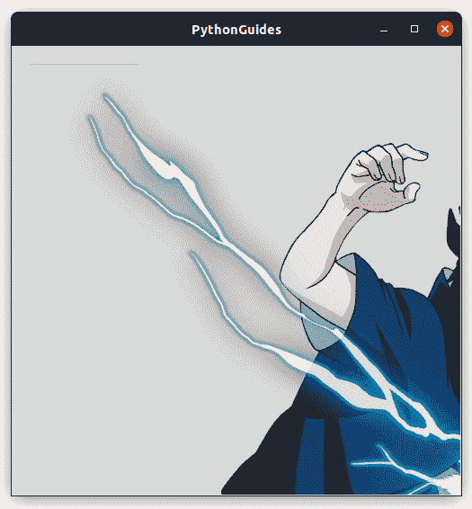
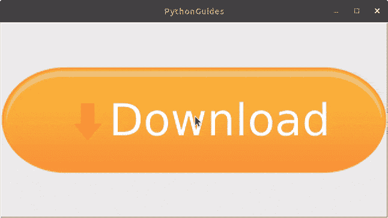
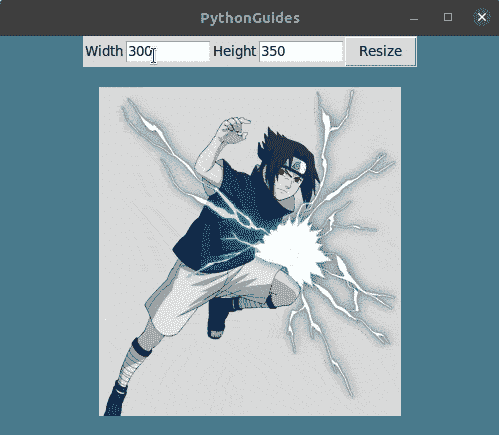
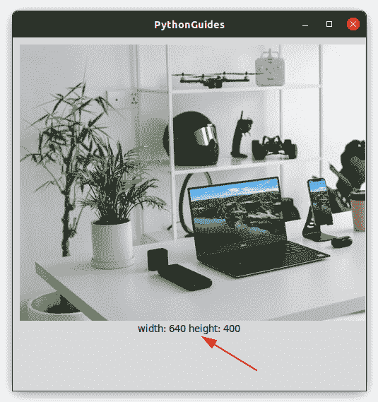

# Python Tkinter 图像+示例

> 原文：<https://pythonguides.com/python-tkinter-image/>

[](https://sharepointsky.teachable.com/p/python-and-machine-learning-training-course)

在这个 Python 教程中，我们将学习**如何在 Python Tkinter** 中添加图像。让我们从下面的例子开始 `Python Tkinter Image` 。

*   python tkinter image(python tkinter 映像)
*   Python Tkinter 图像显示
*   python tkinter image button(python tkinter image 按钮)
*   Python Tkinter 图像背景
*   python tkinter image resize(python tkinter image resize)
*   python tkinter image size(python tkinter image 大小)
*   Python Tkinter Image Label
*   Python Tkinter 图像不存在

目录

[](#)

*   [Python Tkinter Image](#Python_Tkinter_Image "Python Tkinter Image")
*   [Python Tkinter 图像显示](#Python_Tkinter_Image_Display "Python Tkinter Image Display")
*   [Python Tkinter 图像按钮](#Python_Tkinter_Image_Button "Python Tkinter Image Button")
*   [Python Tkinter 图像背景](#Python_Tkinter_Image_Background "Python Tkinter Image Background")
*   [Python Tkinter 图像大小调整](#Python_Tkinter_Image_Resize "Python Tkinter Image Resize")
*   [Python Tkinter 图像大小](#Python_Tkinter_Image_Size "Python Tkinter Image Size")
*   [Python Tkinter Image Label](#Python_Tkinter_Image_Label "Python Tkinter Image Label")
*   [Python Tkinter 镜像不存在](#Python_Tkinter_Image_Doesnt_Exist "Python Tkinter Image Doesn’t Exist")

## Python Tkinter Image

[Python Tkinter](https://pythonguides.com/python-gui-programming/) 有 PhotoImage 方法，该方法允许**在 Python Tkinter** 中读取图像。然后通过在标签、按钮、框架等小部件的图像属性中提供添加 **PhotoImage 变量**来放置图像。

*   在 Python Tkinter 上添加图像有三种方式。
    *   **照片图像**
    *   **枕头` `模块**
*   `PhotoImage` 是 Python Tkinter 自带的内置库，提供有限的选项。但是对于应用程序只是为了将图像显示在屏幕上的小任务来说，这是一个很好的开始。此外，它支持有限的图像扩展。
*   Python Tkinter 中的 Pillow 模块提供了更多的功能，比如你可以读取任何扩展名的图片，调整图片大小等等。使用前需要安装枕形模块。
*   Pillow 可以使用 Python Tkinter 中的 pip 或 pip3 来安装。

```py
pip install pillow

or

pip3 install pillow
```

*   在下面的例子中，我们已经演示了 PhotoImage 的使用。Pillow 将在同一教程的后面部分讨论。我们将展示在这种情况下使用的最佳方法。

**代码**

这是演示如何在 Python Tkinter 中添加图像的基本代码。因为下面的代码只是显示一张图片，所以我们在 Python Tkinter 中使用了 `PhotoImage` 方法。

```py
from tkinter import *

ws = Tk()
ws.title('PythonGuides')

img = PhotoImage(file='images/sasuke.png')
Label(
    ws,
    image=img
).pack()

ws.mainloop()
```

**输出**

在这个输出中，使用标签小部件显示图像，因为我们没有提供任何几何图形，所以应用程序的大小是图像的大小。


Python Tkinter Image

阅读:[如何用 Python 制作计算器](https://pythonguides.com/make-a-calculator-in-python/)

## Python Tkinter 图像显示

`Python Tkinter`中的图像可以通过使用 PhotoImage 模块或枕头库来显示。

*   在本节中，我们将使用 PhotoImage 和 Pillow 库来显示图像。此外，我们将使用画布中的 create_image 方法。
*   Canvas 用于在应用程序屏幕上添加图像或文本。

**代码` `使用摄影图像法**

在这段代码中，您可以观察到我们没有导入任何库，因为 PhotoImage 在导入所有内容时会自动加载。

```py
from tkinter import *      

ws = Tk()
ws.title('PythonGuides')
ws.geometry('500x500')

canvas = Canvas(
    ws,
    width = 500, 
    height = 500
    )      
canvas.pack()      
img = PhotoImage(file='images/sasuke.png')      
canvas.create_image(
    10,
    10, 
    anchor=NW, 
    image=img
    )      
ws.mainloop() 
```

**摄影图像方法的输出**

图像显示在画布上，它显示不完整，因为我们提供的画布高度和宽度小于图像的大小。



Python Tkinter display image using PhotoImage

**代码使用枕库**

在这段代码中，我们从 PIL 库中导入了 ImageTk，即 Image 方法。PIL 是枕头的简称。虽然代码看起来和前面的非常相似，但现在我们可以读取更多的图像扩展，如 jpg、png、bitmap 等。

```py
from tkinter import *  
from PIL import ImageTk,Image  

ws = Tk()  
ws.title('PythonGuides')
ws.geometry('500x500')

canvas = Canvas(
        ws, 
        width = 500, 
        height = 500
        )  
canvas.pack()  
img = ImageTk.PhotoImage(Image.open('images/sasuke.png'))  
canvas.create_image(
        10, 
        10, 
        anchor=NW, 
        image=img
        ) 
ws.mainloop() 
```

**使用枕头库显示的图像输出**

输出类似于 PhotoImage 部分，photo 是不完整的，因为提供的窗口大小小于图像的原始大小。


Python Tkinter Image Display

阅读: [Python Tkinter 菜单栏–如何使用](https://pythonguides.com/python-tkinter-menu-bar/)

## Python Tkinter 图像按钮

Python Tkinter 中的按钮部件有 image 属性，通过提供 image 变量，我们可以在按钮部件上放置图像。

*   该过程的第一步是读取图像，为此我们将使用 Python Tkinter 中的 `PhotoImage` 方法。
*   Tkinter 中的按钮有 image 属性，您可以在这里提供分配给 PhotoImage 的变量。
*   通过这种方式，可以在 Python Tkinter 中的按钮小部件上放置图像。

在这一节中，我们将学习如何在 Python Tkinter 中将图像放到按钮上。

**代码**

在这段代码中，我们在按钮上添加了一个图像。用户可以点击图像来执行操作。

```py
from tkinter import *

ws = Tk()
ws.title('PythonGuides')

img = PhotoImage(file='images/downloadbtn.png')
Button(
    ws,
    image=img,
    command=None
).pack()

ws.mainloop()
```

**输出**

在这个输出中，按钮上添加了下载图像。用户可以点击这个图片下载文件。



Python Tkinter Image Button

阅读:[Python Tkinter check button–如何使用](https://pythonguides.com/python-tkinter-checkbutton/)

## Python Tkinter 图像背景

在这一节中，我们将学习如何在 Python Tkinter 中**插入背景图片。换句话说，如何在 Python Tkinter** 中**设置背景图片。**

*   在 Python Tkinter 中主要有两种放置背景的方法
    *   使用 Place layout manager，我们可以将背景图像放在标签上，并将其一直拉伸到屏幕。
    *   使用 canvas create_image 方法，我们可以将图像放在屏幕上，稍后使用 canvas 的 create_text 方法，我们可以放置文本小部件。
*   在这两种方法中，第二种方法说使用 canvas 更有效和准确，我们推荐使用 canvas。
*   在下面的例子中，我们使用 canvas 创建了一个应用程序。该应用程序有背景图像，文本和一个按钮。当用户点击按钮，他/她将被重定向到我们的网站。

**代码**

在这段代码中，我们导入了 webbrowser 以便打开网页。我们使用 canvas 方法 create_image 在背景中放置图像，然后使用 create _text 和 create_window 在窗口中放置按钮和文本。

```py
from tkinter import *
import webbrowser

ws = Tk()
ws.title('PythonGuides')
ws.geometry('500x400')

new = 1
url = "https://www.pythonguides.com"

def openbrowser():
    webbrowser.open(url,new=new)

bg = PhotoImage(file = 'images/bg.png')

canvas = Canvas(
	ws, 
	width = 500,
	height = 400
	)

canvas.pack(fill='both', expand = True)

canvas.create_image(
	0, 
	0, 
	image=bg,
	anchor = "nw"
	)

canvas.create_text(
	250, 
	150, 
	text = 'PythonGuides',
	font=('Arial', 50),
	)

btn = Button(
	ws, 
	text = 'EXPLORE MORE',
	command=openbrowser,
	width=20,
	height=2,
	relief=SOLID,
	font=('arial', 18)
	)

btn_canvas = canvas.create_window(
	100, 
	200,
	anchor = "nw",
	window = btn,
	)

ws.mainloop() 
```

**输出**

在这个输出中，您可以看到应用程序有背景图像、文本和按钮。当用户点击按钮时，他/她将被重定向到一个网站。


Python Tkinter Image Background

阅读: [Python Tkinter 单选按钮–如何使用](https://pythonguides.com/python-tkinter-radiobutton/)

## Python Tkinter 图像大小调整

在这一节中，我们将学习如何在 Python Tkinter 中调整图像的大小。

*   使用 Python Tkinter 中的 Pillow 库，我们可以调整图像的大小。要导入枕头使用此代码 **`from PIL import Image, ImageTk`**
*   **`image.resize((w, h))`** 该命令允许我们改变图像的高度(h)和宽度(w)。
*   在下面的例子中，我们创建了一个应用程序，用户可以提供宽度和高度，图像将实时改变大小。

**代码**

在这段代码中，我们使用了 Pillow 模块中的 Image 方法来改变图像的大小。

```py
from tkinter import *
from PIL import Image, ImageTk

ws = Tk()
ws.title('PythonGuides')
ws.geometry('500x400')
ws.config(bg='#4a7a8c')

def resize_func():
    image = Image.open("images/sasuke.png")
    w = int(width.get())
    h = int(height.get())
    resize_img = image.resize((w, h))
    img = ImageTk.PhotoImage(resize_img)
    disp_img.config(image=img)
    disp_img.image = img

frame = Frame(ws)
frame.pack()

Label(
    frame,
    text='Width'
    ).pack(side=LEFT)
width = Entry(frame, width=10)
width.insert(END, 300)
width.pack(side=LEFT)

Label(
    frame,
    text='Height'
    ).pack(side=LEFT)

height = Entry(frame, width=10)
height.insert(END, 350)
height.pack(side=LEFT)

resize_btn = Button(
    frame,
    text='Resize',
    command=resize_func
)
resize_btn.pack(side=LEFT)

disp_img = Label()
disp_img.pack(pady=20)

ws.mainloop()
```

**输出**

在这个输出中，您可以看到图像正在根据用户提供的高度和宽度调整大小。是用 Python Tkinter 创建的成熟应用程序，可用于日常活动。



Python Tkinter image resize

阅读: [Python Tkinter 按钮–如何使用](https://pythonguides.com/python-tkinter-button/)

## Python Tkinter 图像大小

在这一节中，我们将学习**如何在 Python Tkinter** 中获取图像大小。

*   这个过程中的第一件事是从 PIL 导入 Image，ImageTk。
*   然后 ImageTk 提供了 width 和 height 方法，使用该方法我们可以获得图像的大小。

**代码**

在这段代码中， **`text=f'width: {img.width()} height: {img.height()}'`** 该命令显示图像的高度和宽度。这里，img 是存储文件 file 的变量。

```py
from tkinter import *  
from PIL import ImageTk,Image  

ws = Tk()  
ws.title('PythonGuides')
ws.geometry('500x500')

canvas = Canvas(
        ws, 
        width = 500, 
        height = 400
        )  
canvas.pack()  
img = ImageTk.PhotoImage(Image.open('images/workstation.jpg'))  

canvas.create_image(
        10, 
        10, 
        anchor=NW, 
        image=img
        ) 
Label(
    ws,
    text=f'width: {img.width()} height: {img.height()}'
).pack()

ws.mainloop() 
```

**输出**

在这个输出中，您可以看到图像的高度和宽度显示在页面的底部。



Python Tkinter Image Size

阅读:[用 Python Tkinter 创建一个贪吃蛇游戏](https://pythonguides.com/create-a-snake-game-in-python/)

## Python Tkinter Image Label

在本节中，我们将学习如何在 Python Tkinter 中的**标签小部件上设置图像。**

*   Python Tkinter 中的 label 小部件用于在应用程序窗口中显示文本和图像。
*   标签小部件有一个属性**图像**。向该属性添加图像文件将在标签小部件上设置图像。
*   如果您正在处理 PNG 图像，那么您可以简单地使用 `PhotoImage` 方法，这是 Python Tkinter 中的一个内置方法。
*   对于高级功能和所有扩展，使用枕头库中的图像 ImageTk。

**代码**

下面是使用 Python Tkinter 中的**标签小部件显示图像的简单代码。**

```py
from tkinter import *

ws = Tk()
ws.title('PythonGuides')

img = PhotoImage(file='images/sasuke.png')
Label(
    ws,
    image=img
).pack()

ws.mainloop()
```

**输出**


Python Tkinter Image on Label Widget

阅读:[如何使用 Python Tkinter 获取用户输入并存储在变量中](https://pythonguides.com/how-to-take-user-input-and-store-in-variable-using-python-tkinter/)

## Python Tkinter 镜像不存在

这是几乎所有使用 Python Tkinter 处理图像的程序员都会遇到的一个常见错误，即 **Python Tkinter 图像不存在**。

*   这个错误主要有三个原因:
    *   提供的图像路径不正确
    *   您已经使用 **`var = Image.open(pathToImage)`** 读取了图像，但没有将其传递给 **`ImageTk.PhotoImage(var)`** 。
    *   声明一个全局变量，以防在函数中使用图像。
*   **_tkinter。TCL 错误:无法识别图像文件“images/workstation.jpg”中的数据**
*   如果你看到上面的错误代码，这意味着你正试图使用 PhotoImage JPG 图像文件。
*   要解决这个问题，要么使用 PNG 图像文件，要么切换到 Pillow。因为枕形模块允许使用各种图像扩展。

您可能会喜欢以下 Python tkinter 教程:

*   [Python Tkinter 帧](https://pythonguides.com/python-tkinter-frame/)
*   [Python Tkinter TreeView–如何使用](https://pythonguides.com/python-tkinter-treeview/)
*   [Python Tkinter 待办事项列表](https://pythonguides.com/python-tkinter-todo-list/)
*   [Python Tkinter 窗口大小](https://pythonguides.com/python-tkinter-window-size/)
*   [Python Tkinter 画布教程](https://pythonguides.com/python-tkinter-canvas/)
*   [Python Tkinter 表教程](https://pythonguides.com/python-tkinter-table-tutorial/)
*   [用 Python Tkinter 创建 Word 文档](https://pythonguides.com/create-word-document-in-python-tkinter/)

在本教程中，我们学习了如何在 Python Tkinter 中**添加图像。此外，我们已经讨论了这些主题。**

*   python tkinter image(python tkinter 映像)
*   Python Tkinter 图像显示
*   python tkinter image button(python tkinter image 按钮)
*   Python Tkinter 图像背景
*   python tkinter image resize(python tkinter image resize)
*   python tkinter image size(python tkinter image 大小)
*   Python Tkinter Image Label
*   Python Tkinter 图像不存在

[Bijay Kumar](https://pythonguides.com/author/fewlines4biju/)

Python 是美国最流行的语言之一。我从事 Python 工作已经有很长时间了，我在与 Tkinter、Pandas、NumPy、Turtle、Django、Matplotlib、Tensorflow、Scipy、Scikit-Learn 等各种库合作方面拥有专业知识。我有与美国、加拿大、英国、澳大利亚、新西兰等国家的各种客户合作的经验。查看我的个人资料。

[enjoysharepoint.com/](https://enjoysharepoint.com/)[](https://www.facebook.com/fewlines4biju "Facebook")[](https://www.linkedin.com/in/fewlines4biju/ "Linkedin")[](https://twitter.com/fewlines4biju "Twitter")