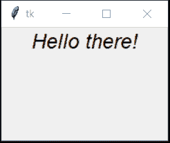
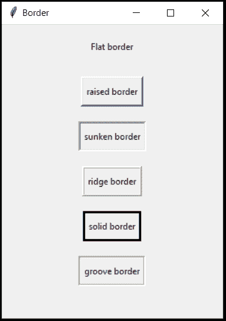
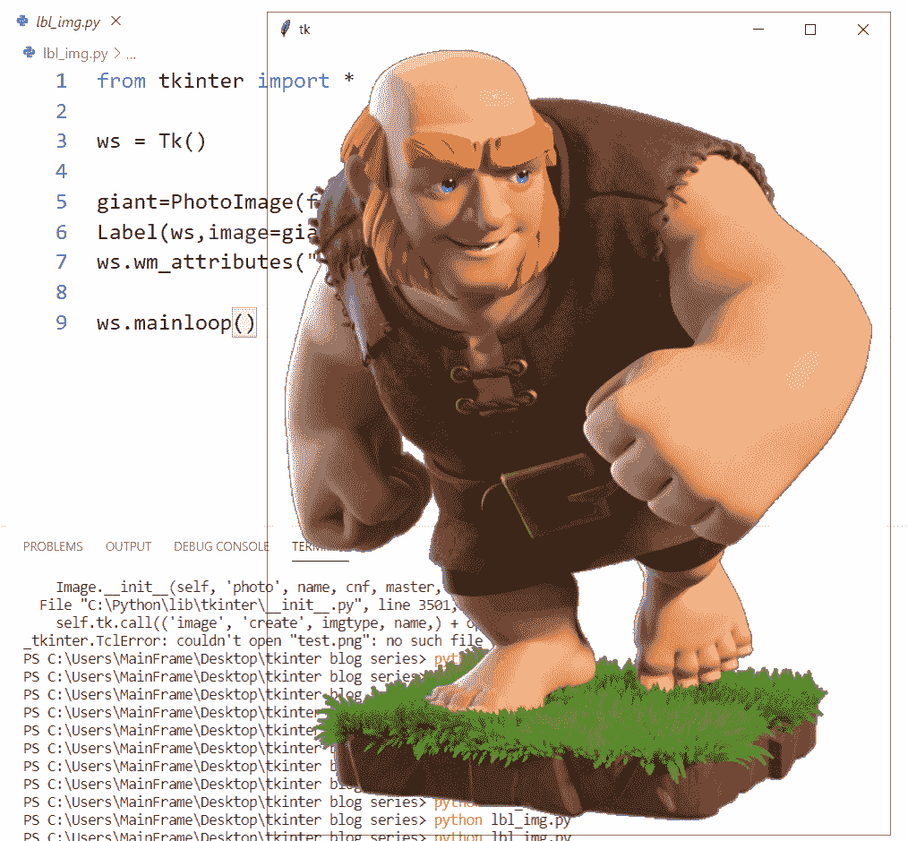
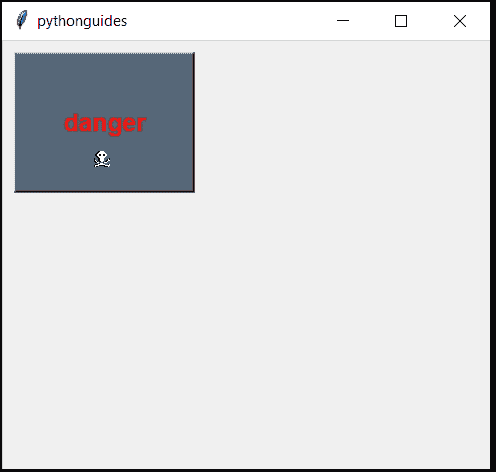
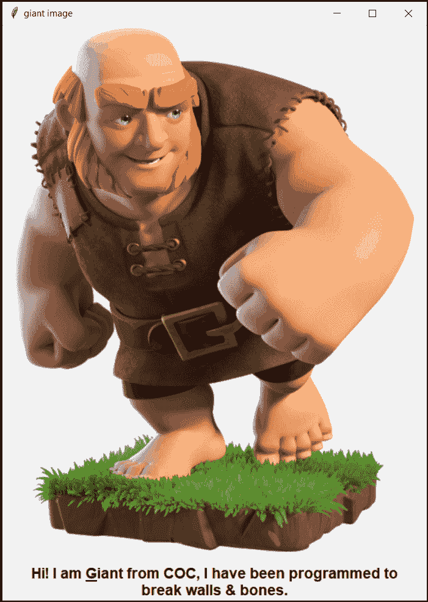
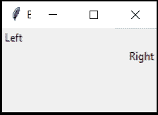

# Python tkinter 标签–如何使用

> 原文：<https://pythonguides.com/python-tkinter-label/>

[](https://sharepointsky.teachable.com/p/python-and-machine-learning-training-course)

你在努力学习 [Python GUI 编程](https://pythonguides.com/python-gui-programming/)吗？让我们来详细了解一下 **Python Tkinter 标签**。如何在 Python Tkinter 中使用**标签？我们将涵盖以下所有主题:**

*   关于 Tkinter 标签
*   tkinter label font size(tkinter label 字体大小)
*   t 中间标签位置
*   标签边框
*   Tkinter 标签透明背景
*   标签间属性
*   tkinter label image(tkinter label 影像)
*   标签间属性
*   tkinter label image(tkinter label 影像)
*   标签文本左对齐

目录

[](#)

*   [Python Tkinter 标签](#Python_Tkinter_label "Python Tkinter label")
*   [Tkinter label font size](#Tkinter_label_font_size "Tkinter label font size")
*   [Tkinter 标签位置](#Tkinter_label_position "Tkinter label position")
*   [Tkinter 标签边框](#Tkinter_label_border "Tkinter label border")
*   [Tkinter 标签透明背景](#Tkinter_label_transparent_background "Tkinter label transparent background")
*   [Tkinter 标签属性](#Tkinter_label_attributes "Tkinter label attributes")
*   [Tkinter label image](#Tkinter_label_image "Tkinter label image")
*   [Tkinter 标签文本对齐](#Tkinter_label_text-alignment "Tkinter label text-alignment")

## Python Tkinter 标签

让我们看看什么是 **Python Tkinter 标签**？

*   标签仅仅意味着屏幕上的文本。
*   它可能是一个指令或信息。
*   标签是广泛使用的小部件，是所有 GUI 支持工具和语言中的一个命令。
*   标签也用于显示图像和图标。
*   几个受欢迎的标签选项是:
    *   **文本:**显示文本
    *   **文本变量:**指定将替换文本的名称。主要在文本发生变化时使用。
    *   **下划线**:仅给文本字符串的一个字符加下划线
    *   `width` :给标签加上宽度，取一个数字作为参数。
    *   **图像**:添加图像或样式化标签。它使用 style.map()
    *   复合(compound):显示带有文本的图像，同时提供对图像位置的控制。

还有，你可能喜欢， [Python Tkinter Title](https://pythonguides.com/python-tkinter-title/) 。

## Tkinter label font size

让我们看看如何在 Python Tkinter 标签中**设置字体大小。**

*   字体大小强调用户。
*   它让事情变得更加清晰易读。
*   标签中的字体大小可以使用关键字**字体**来控制

**语法:**

在这个语法中, `ws` 是我们使用的主字体，font-name 可以是 ms word 支持的任何字体，如 Arial、Times new roman、Calibri 等。粗细可以是粗体、斜体、下划线。

```py
Label(ws, text="any text here", font=('font-name & weight', 'font-size')
```

**代码:**

```py
from tkinter import *

ws = Tk()

Label(ws, text="Hello there!", font=("arial italic", 18) ).pack()

ws.mainloop()
```

**输出:**

所以在这个输出中，您可以看到文本“Hello there！”大小为 18，是斜体。同样，你可以把**加粗**和**加下划线**。



Python tkinter label

你可能会喜欢，[身体质量指数计算器使用 Python Tkinter](https://pythonguides.com/bmi-calculator-using-python-tkinter/) 。

## Tkinter 标签位置

*   部件的正确放置可以产生不同。
*   **标签位置**可以用**包**、**格** & **位**来控制
*   请参考我们的几何定位部分以了解更多信息

**语法**:

```py
Label(ws, text="any text", font=(14, "roboto")).pack()
```

```py
Label(ws, text="any text", font=(14, "roboto")).grid(row=value, columns=value)
```

```py
Label(ws, text="any text", font=(14, "roboto")).place(x=coordinate_value, y=coordinate_value)
```

## Tkinter 标签边框

*   **Python Tkinter 标签 border** 定义了边框的类型&它的粗细。
*   有 6 种类型的边框，每种都有其 on 属性:
    *   **平**
    *   **升起**
    *   **沉没**
    *   **山脊**
    *   **固体**
    *   **凹槽**
*   默认情况下，平面处于活动状态。
*   `borderwidth` 关键字用来定义边框的粗细。
*   `relief` 关键字用于定义边框的类型。

**语法:** borderwidth 应提供任意整数值，relief 应提供任意这些(平的、凸起的、凹陷的、脊形的、实心的、凹槽的)。

```py
Label(ws, text="any text", borderwidth=value, relief="typeofborder").pack()
```

**代码:**

```py
from tkinter import *

ws = Tk()
ws.title("Border")
ws.geometry("300x400")

Label(ws, text="Flat border", borderwidth=3, relief="flat", padx=5, pady=10).pack(padx=5, pady=10)
Label(ws, text="raised border", borderwidth=3, relief="raised", padx=5, pady=10).pack(padx=5, pady=10)
Label(ws, text="sunken border", borderwidth=3, relief="sunken", padx=5, pady=10).pack(padx=5, pady=10)
Label(ws, text="ridge border", borderwidth=3, relief="ridge", padx=5, pady=10).pack(padx=5, pady=10)
Label(ws, text="solid border", borderwidth=3, relief="solid", padx=5, pady=10).pack(padx=5, pady=10)
Label(ws, text="groove border", borderwidth=3, relief="groove",padx=5, pady=10).pack(padx=5, pady=10)

ws.mainloop() 
```

**输出:**

在此输出中，显示了所有类型的边框，每种边框的宽度为 3 个像素。padx & pady 决定盒子周围的额外空间。



Tkinter label border

## Tkinter 标签透明背景

*   透明背景意味着你可以透过框架看到。
*   只有一个图像会出现，其余的框架将不可见。
*   确保拍摄没有背景的图像
*   为图像提供背景颜色，并为 wm_attributes 命令分配相同的颜色。
*   我们试过各种颜色，但灰色效果最好。

**语法:**

这个**颜色名称**应该与图像背景颜色相同。我们尝试了许多颜色，但灰色最适合这个。

```py
ws.wm_attributes("-transparentcolor", 'colorname') 
```

**代码:**

```py
from tkinter import *

ws = Tk()

giant=PhotoImage(file='bg.png')
Label(ws,image=giant,bg='grey').pack()
ws.wm_attributes("-transparentcolor", 'grey')

ws.mainloop()
```

**输出:**

在这个输出中，显示了没有背景的 giant 图片。你可以透过相框看到。



https://static.wikia.nocookie.net/clashofclans/images/3/35/Giant_info.png/revision/latest/scale-to-width-down/340?cb=20170927232347

## Tkinter 标签属性

*   属性是指标签的特征
*   它们也被称为促进更多功能的选项
*   虽然我们已经在这个博客中讨论了其中的大部分。
*   但是我们在这里对它们进行总结。
*   属性如下:

1.  **颜色:**

*   颜色在软件开发中起着重要的作用。
*   每种颜色都有一些含义，比如红色代表错误，绿色代表正确，等等。
*   `bg` 用于填充标签的背景颜色
*   `fg` 用于改变文本颜色。
*   您可以提供颜色名称或十六进制代码

**举例**:

```py
Label(ws, text="colors", bg="blue", fg="#000").pack()
```

`2` 。**字体:**

*   字体使文本可读。
*   要了解更多关于字体的信息
*   请参考我们的 Tkinter 标签字体大小部分

**举例:**

```py
Label(ws, text="font demo", font=('arial bold', 18)).pack()
```

**3。救济:**

*   浮雕**用于为**边框提供装饰。
*   它有各种选项可以用来强调文本。
*   要了解更多关于选项的信息，请查看 **Tkinter 标签边框**部分。

**举例:**

```py
Label(ws, text="relief demo", borderwidth=3, relief='solid border').pack()
```

**4\. cursor** :

*   它用来改变光标悬停在标签上时的图像。
*   以下是可以使用的所有光标的列表
*   **箭头，圆圈，时钟，点盒，交换，芙蓉，心脏人，老鼠，海盗，pls，穿梭，上浆，蜘蛛，喷雾罐，星星，目标，tcross，迷航，手表**

**举例:**

```py
Label(ws, text="cursor demo", cursor="watch").pack()
```

**5。高度&宽度:**

*   高度决定了标签的垂直尺寸。
*   宽度决定了标签的水平尺寸

**举例:**

```py
Label(ws, text="Height & width", height=5, width=10).pack()
```

**6。帕德克斯&帕迪**

*   padx 垂直添加空白空间
*   pady 水平添加空白空间
*   如果在标签中使用它们，那么它们会在框内增加额外的空间
*   如果在定位部分(包装/网格/位置)使用它们，则在框外添加空间。

**例:**盒子里面

```py
Label(ws, text="padding demo", padx=10, pady=5).pack()
```

7 .**。` `狡辩:**

*   Justify 用于对齐。
*   它的工作方式类似于 anchor，但只有三个选项
*   **左、中、右**
*   程序员更喜欢使用**锚**,因为它提供了更多的控制

**举例:**

```py
Label(ws, text="padding demo", justify=CENTER).pack()
```

**8。主播:**

*   锚点还提供了对齐控制。
*   要了解更多信息，请参考我们的章节**标签间文本对齐**

**举例:**

```py
Label(ws, text="padding demo").pack(anchor='w')
```

所以这些是标签的流行属性。他们中的大多数在其他窗口小部件以及入口、按钮等中工作。现在在我们结束这一节之前，这里有一个程序，其中使用了一些属性。为了让你相信，控件是按顺序放置的。请注意使用的每一个属性。光标一号是我的最爱

**代码**:

```py
from tkinter import *

ws = Tk()
ws.title("pythonguides")
ws.geometry('200x150')

Label(ws, text='danger', bg='red', fg='red', font=('Arial bold', 14), relief='raised', cursor='pirate', height=4, width=10, padx=10, pady=10, justify=CENTER).pack(padx=10, pady=10, anchor='w')

ws.mainloop()
```

**输出:**

这是一个使用上述所有属性创建的简单程序。**几个亮点**，光标对海盗图标有变形能力，虽然是 `pack()` 但由于锚设置为 `west` 所以还在角落里，蓝色是`BG`红色文字是 `fg` 。文本**对齐**到**居中**等。



Tkinter label attributes

## Tkinter label image

*   图像让事情变得有趣。
*   在这一节中，我们将学习如何把图像放在标签中
*   我们还将学习在图像上放置文本。

**语法:**

```py
var-name = PhotoImage(file="path/of/image.extension")
Label(ws, image=var-name).pack() 
```

**代码:**

```py
from tkinter import *

ws = Tk()
ws.title("giant image")

giant = PhotoImage(file="bg.png")
Label(ws, text="hi",image=giant).pack(side="top")
intro = '''Hi! I am Giant from COC, I have been programmed to
break walls & bones.''' 
Label(ws, text=intro, anchor=S, font=('Arial bold', 14), underline=9).pack(side="bottom")

ws.mainloop()
```

**输出:**

在这个输出中，已经放置了巨人的图像，在图像下面有一个关于他的简短信息。在介绍部分 G 是带下划线的，为此我们在标签中使用了下划线选项。



Tkinter label image

## Tkinter 标签文本对齐

*   对齐是指文本方向的快速定位。
*   方向意味着:
    *   **北**:北
    *   南方:南方
    *   东:东
    *   西方
    *   东北方
    *   西北方向:西北方向
    *   东南方向
    *   西南:西南
    *   **居中**
*   `anchor` 关键字用于定位标签小部件。

**语法:**在方向的位置提供其中的任何一个( `SN` 、 `SE` 、 `W` 、 `NE` 、 `SE` 、 `SW` 、 `CENTER`

```py
Label(ws, text="sometext", anchor= direction).pack()
```

**代码:**

```py
from tkinter import *

ws = Tk()
ws.title("Border")
ws.geometry("50x100")

Label(ws, text="Left", anchor=W).pack(fill='both')
Label(ws, text="Right", anchor=E).pack(fill='both')

ws.mainloop() 
```

**输出:**

在这个输出中，您可以看到文本已经使用**锚**左右对齐。



Python Label text-alignment

您可能会喜欢以下 Python 教程:

*   [Python 中的递增和递减运算符](https://pythonguides.com/increment-and-decrement-operators-in-python/)
*   [Python 匿名函数(Lambda 函数)](https://pythonguides.com/python-anonymous-function/)
*   [Python 访问修饰符+示例](https://pythonguides.com/python-access-modifiers/)
*   [Python 读取 CSV 文件并写入 CSV 文件](https://pythonguides.com/python-read-csv-file/)
*   [Python 数组与示例](https://pythonguides.com/python-array/)
*   [python 中的哈希表](https://pythonguides.com/hash-table-in-python/)
*   [Python 中的块缩进](https://pythonguides.com/block-indentation-in-python/)
*   [Python 从路径中获取文件名](https://pythonguides.com/python-get-filename-from-the-path/)
*   [Python 类型错误:“列表”对象不可调用](https://pythonguides.com/python-typeerror-list-object-is-not-callable/)
*   [Python Tkinter 条目–如何使用](https://pythonguides.com/python-tkinter-entry/)
*   [Python Tkinter 按钮–如何使用](https://pythonguides.com/python-tkinter-button/)
*   [Python Tkinter 菜单栏–如何使用](https://pythonguides.com/python-tkinter-menu-bar/)
*   [Python Tkinter check button–如何使用](https://pythonguides.com/python-tkinter-checkbutton/)
*   [Python Tkinter 单选按钮–如何使用](https://pythonguides.com/python-tkinter-radiobutton/)
*   [Python Tkinter 计算器](https://pythonguides.com/make-a-calculator-in-python/)
*   [Python Tkinter 画布教程](https://pythonguides.com/python-tkinter-canvas/)

在本教程中，我们学习了 **Python tkinter 标签**。

*   Python 中的 **Tkinter 标签是什么**
*   tkinter label font size(tkinter label 字体大小)
*   t 中间标签位置
*   标签边框
*   Tkinter 标签透明背景
*   标签间属性
*   tkinter label image(tkinter label 影像)
*   标签间属性
*   tkinter label image(tkinter label 影像)
*   标签文本左对齐

[Bijay Kumar](https://pythonguides.com/author/fewlines4biju/)

Python 是美国最流行的语言之一。我从事 Python 工作已经有很长时间了，我在与 Tkinter、Pandas、NumPy、Turtle、Django、Matplotlib、Tensorflow、Scipy、Scikit-Learn 等各种库合作方面拥有专业知识。我有与美国、加拿大、英国、澳大利亚、新西兰等国家的各种客户合作的经验。查看我的个人资料。

[enjoysharepoint.com/](https://enjoysharepoint.com/)[](https://www.facebook.com/fewlines4biju "Facebook")[](https://www.linkedin.com/in/fewlines4biju/ "Linkedin")[](https://twitter.com/fewlines4biju "Twitter")