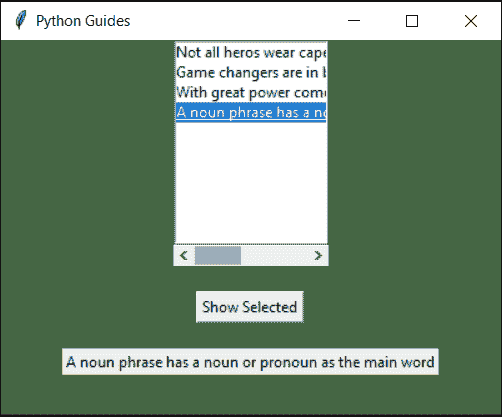
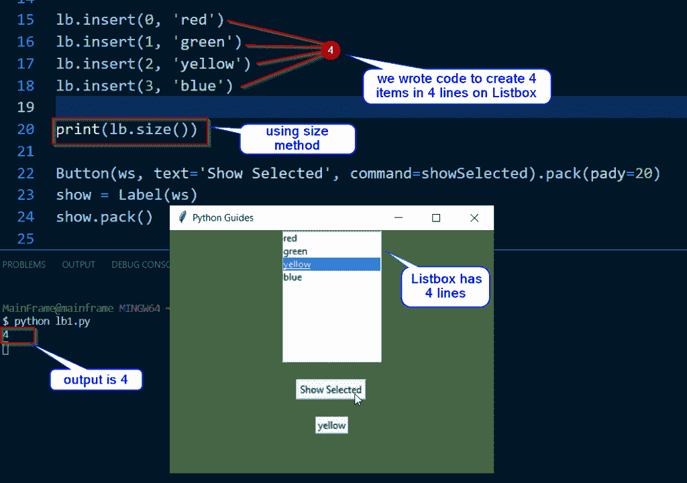

# Python Tkinter 列表框–如何使用

> 原文：<https://pythonguides.com/python-tkinter-listbox/>

[](https://sharepointsky.teachable.com/p/python-and-machine-learning-training-course)

在这个 [Python 教程](https://pythonguides.com/python-programming-for-the-absolute-beginner/)中，我们将通过几个例子了解 `Python Tkinter Listbox` ，我们也将涵盖这些主题

*   Python Tkinter 列表框简介
*   如何从 Python Tkinter 列表框中获取所选项
*   如何在 Python Tkinter Listbox 中使用 curselection
*   如何从 Python Tkinter 列表框中获取所有项目
*   带复选框的 Python Tkinter 列表框
*   如何实现 Python Tkinter Listbox 滚动条
*   Python Tkinter 列表框大小
*   如何从 Python Tkinter Listbox 中选择多个项目？
*   Python Tkinter 列表框设置所选项
*   Python Tkinter 列表框绑定

如果您是 Python Tkinter 或 Python GUI 编程的新手，请查看 [Python GUI 编程(Python Tkinter)](https://pythonguides.com/python-gui-programming/) 。

目录

[](#)

*   [Python Tkinter 列表框](#Python_Tkinter_Listbox "Python Tkinter Listbox")
*   [Python tkinter 列表框获取选中的项目](#Python_tkinter_listbox_get_selected_item "Python tkinter listbox get selected item")
*   [Python tkinter 列表框光标选择](#Python_tkinter_listbox_curselection "Python tkinter listbox curselection")
*   [Python Tkinter 列表框获取所有项目](#Python_Tkinter_Listbox_get_all_items "Python Tkinter Listbox get all items")
*   [带复选框的 Python Tkinter 列表框](#Python_Tkinter_Listbox_with_checkboxes "Python Tkinter Listbox with checkboxes")
*   [Python 的 tkinter 下拉列表框滚动栏](#Python_tkinter_listbox_scrollbar "Python tkinter listbox scrollbar")
*   [Python Tkinter 列表框大小](#Python_Tkinter_Listbox_size "Python Tkinter Listbox size")
*   [Python Tkinter 列表框多选](#Python_Tkinter_Listbox_multiple_selection "Python Tkinter Listbox multiple selection")
*   [Python Tkinter Listbox 设置选中项](#Python_Tkinter_Listbox_set_selected_item "Python Tkinter Listbox set selected item")
*   [Python Tkinter 列表框绑定](#Python_Tkinter_Listbox_bind "Python Tkinter Listbox bind")

## Python Tkinter 列表框

*   `Python Tkinter Listbox` 是另一个显示多个项目的小部件。
*   用户可以选择单个项目或多个项目。
*   任何被选中的项目都可以被称为“**锚**”。这是 Python Tkinter 列表框的预览。


Python Tkinter Listbox

**语法:**

```py
variable_name = Listbox(ws)
variable_name.pack()

# to insert items in the list
variable_name.insert(index, string) 
```


Python Tkinter Listbox Syntax

阅读: [Python TKinter 添加图片](https://pythonguides.com/python-tkinter-image/)。

## Python tkinter 列表框获取选中的项目

*   让我们看看**如何从 Python Tkinter Listbox** 中获取选中的项目。get 函数用于获取所选项的名称。
*   所选项目可以与锚相关，因为所选项目充当超链接
*   我们需要将锚点作为 get 函数的参数传递。

**代码:**

在这段代码中，我们创建了一个列表，单击按钮就可以获取列表框中的项目。

```py
from tkinter import *

ws = Tk()
ws.title('Python Guides')
ws.geometry('400x300')
ws.config(bg='#446644')

def showSelected():
    show.config(text=lb.get(ANCHOR))

lb = Listbox(ws)
lb.pack()
lb.insert(0, 'red')
lb.insert(1, 'green')
lb.insert(2, 'yellow')
lb.insert(3, 'blue')

Button(ws, text='Show Selected', command=showSelected).pack(pady=20)
show = Label(ws)
show.pack()

ws.mainloop()
```

**输出:**

在这个输出中，有四个选项可用。用户可以点击任何项目，然后点击按钮打印所选项目。


Python tkinter listbox get selected item

阅读:[如何用 Python Tkinter 创建贪吃蛇游戏](https://pythonguides.com/create-a-snake-game-in-python/)

## Python tkinter 列表框光标选择

*   **Python tkinter 列表框光标选择**用于显示选中的项目。
*   curselection 是一个预定义的函数，用于获取选定项目的值。
*   curselection 主要用于需要获取多个值的时候。

**代码:**

在这段代码中，我们打印了单击按钮时所选择的项目名称。

```py
from tkinter import *

ws = Tk()
ws.title('Python Guides')
ws.geometry('400x300')
ws.config(bg='#446644')

def showSelected():
    itm = lb.get(lb.curselection())
    var.set(itm)

var =StringVar()
lb = Listbox(ws)
lb.pack()

lb.insert(0, 'Iceland')
lb.insert(1, 'USA')
lb.insert(2, 'China')
lb.insert(3, 'Europe')

disp = Label(ws, textvariable=var)
disp.pack(pady=20)
Button(ws, text='Show Selected', command=showSelected).pack()

ws.mainloop() 
```

**输出:**

在这个输出中，我们显示了国家的名称。用户将点击给定的国家名称，当点击按钮，它将显示选定的国家名称。


Python tkinter listbox curselection

读取 [Python Tkinter 过滤函数()](https://pythonguides.com/python-tkinter-filter/)

## Python Tkinter 列表框获取所有项目

*   `Python Tkinter Listbox` 支持多选项目。因此，在本节中，我们将学习获取所有选定的项目。

**代码:**

在这段代码中，我们创建了一个国家列表。现在，用户可以选择他已经访问过的国家，用户可以选择多个国家，当他/她点击显示选择的按钮。然后将显示选定的国家名称。

```py
from tkinter import *

ws = Tk() 
ws.title('Python Guides') 
ws.geometry('400x300')

var = StringVar()

def showSelected():
    countries = []
    cname = lb.curselection()
    for i in cname:
        op = lb.get(i)
        countries.append(op)
    for val in countries:
        print(val)

show = Label(ws, text = "Select Your Country", font = ("Times", 14), padx = 10, pady = 10)
show.pack() 
lb = Listbox(ws, selectmode = "multiple")
lb.pack(padx = 10, pady = 10, expand = YES, fill = "both") 

x =["Afghanistan", "Albania", "Algeria", "Andorra", "Angola", "Australia", "Brazil", "Canada", "China", "Iceland", "Israel", "United States", "Zimbabwe"]

for item in range(len(x)): 
	lb.insert(END, x[item]) 
	lb.itemconfig(item, bg="#bdc1d6") 

Button(ws, text="Show Selected", command=showSelected).pack()
ws.mainloop() 
```

**输出:**

在此输出中，选择了三个国家，当单击 showSelected 按钮时，同样三个国家显示在下面。


Python Tkinter Listbox get all items

阅读 [Python Tkinter add 函数示例](https://pythonguides.com/python-tkinter-add-function/)

## 带复选框的 Python Tkinter 列表框

*   没有办法在列表框中放置复选框。
*   曾经有一个 **[tixchecklist](https://docs.python.org/3/library/tkinter.tix.html#tkinter.tix.CheckList)** 小部件，使用它可以在列表框中创建复选框。
*   但是 tixchecklist 在 python 3.6 之后就停产了。

## Python 的 tkinter 下拉列表框滚动栏

让我们看看如何在 Python Tkinter Listbox 中**实现滚动条。**

*   当要显示的内容超过一个专用区域时，使用滚动条。
*   它便于在屏幕上输入大量数据。
*   可以通过滚动滚动条来访问这些数据。
*   滚动条可以是垂直的，也可以是水平的。
*   要在 `Python Tkinter Listbox` 中实现滚动条，主要有 3 个步骤:
    *   创建一个滚动条并将其放在父窗口或框架窗口中
    *   设置滚动条的类型:**水平**或**垂直**。
    *   配置滚动条。
*   我们将在下面的示例中详细了解这一点。

**代码:**

在这段代码中，垂直和水平滚动条都被投影。
**垂直滚动条` `源代码**

```py
from tkinter import *

ws = Tk()
ws.title('Python Guides')
ws.geometry('400x300')
ws.config(bg='#446644')

def showSelected():
    show.config(text=lb.get(ANCHOR))

frame = Frame(ws)
frame.pack()

lb = Listbox(frame)
lb.pack(side=LEFT)

sb = Scrollbar(frame, orient=VERTICAL)
sb.pack(side=RIGHT, fill=Y)

lb.configure(yscrollcommand=sb.set)
sb.config(command=lb.yview)
lb.insert(0, 'red')
lb.insert(1, 'green')
lb.insert(2, 'yellow')
lb.insert(3, 'blue')
lb.insert(0, 'red')
lb.insert(1, 'green')
lb.insert(2, 'yellow')
lb.insert(3, 'blue')
lb.insert(0, 'red')
lb.insert(1, 'green')
lb.insert(2, 'yellow')
lb.insert(3, 'blue')
lb.insert(0, 'red')
lb.insert(1, 'green')
lb.insert(2, 'yellow')
lb.insert(3, 'blue')

Button(ws, text='Show Selected', command=showSelected).pack(pady=20)
show = Label(ws)
show.pack()

ws.mainloop()
```

**水平滚动条` `源代码**

```py
from tkinter import *

ws = Tk()
ws.title('Python Guides')
ws.geometry('400x300')
ws.config(bg='#446644')

def showSelected():
    show.config(text=lb.get(ANCHOR))

frame = Frame(ws)
frame.pack()

lb = Listbox(frame)
lb.pack()

sb = Scrollbar(frame, orient=HORIZONTAL)
sb.pack(fill=X)

lb.configure(xscrollcommand=sb.set)
sb.config(command=lb.xview)

lb.insert(0, 'Not all heros wear capes.')
lb.insert(1, 'Game changers are in blue')
lb.insert(2, 'With great power comes great responsibility')
lb.insert(3, 'A noun phrase has a noun or pronoun as the main word')

Button(ws, text='Show Selected', command=showSelected).pack(pady=20)
show = Label(ws)
show.pack()

ws.mainloop()
```

**输出:**

在这些输出中，第一个图像是垂直滚动条，第二个是水平滚动条。

**垂直滚动条` `输出**


Python tkinter listbox scrollbar

**水平滚动条` `输出**



Python tkinter listbox scrollbar

将 [Python 数据帧读取到 CSV](https://pythonguides.com/python-dataframe-to-csv/)

## Python Tkinter 列表框大小

*   你可能认为大小与改变列表框的大小有关。
*   但是这里的**大小**是 Listbox 中的一个**方法**。
*   `Size` 用于获取列表框中的行数。

**代码:**

在这段代码中，我们创建了一个包含 4 项的列表框程序。我们已经使用了 `Size` 的方法来计算行数。

```py
from tkinter import *

ws = Tk()
ws.title('Python Guides')
ws.geometry('400x300')
ws.config(bg='#446644')

def showSelected():
    show.config(text=lb.get(ANCHOR))

lb = Listbox(ws)
lb.pack()

lb.insert(0, 'red')
lb.insert(1, 'green')
lb.insert(2, 'yellow')
lb.insert(3, 'blue')

print(lb.size())

Button(ws, text='Show Selected', command=showSelected).pack(pady=20)
show = Label(ws)
show.pack()

ws.mainloop()
```

**输出:**

在此输出中，预计将实现 size 方法。catch 方法用于计算 Listbox 中的行数。所以在这种情况下，4 行中有 4 个项目。所以出现的输出是 4。



Python tkinter listbox size

## Python Tkinter 列表框多选

*   多重选择是指从 Python Tkinter 列表框中获取所有项目。
*   列表框支持多项选择。
*   **selectmode = 'multiple'** 用于选择多个项目。

**代码:**

```py
from tkinter import *

ws = Tk() 
ws.title('Python Guides') 
ws.geometry('400x300')

var = StringVar()

def showSelected():
    countries = []
    cname = lb.curselection()
    for i in cname:
        op = lb.get(i)
        countries.append(op)
    for val in countries:
        print(val)

show = Label(ws, text = "Select Your Country", font = ("Times", 14), padx = 10, pady = 10)
show.pack() 
lb = Listbox(ws, selectmode = "multiple")
lb.pack(padx = 10, pady = 10, expand = YES, fill = "both") 

x =["Afghanistan", "Albania", "Algeria", "Andorra", "Angola", "Australia", "Brazil", "Canada", "China", "Iceland", "Israel", "United States", "Zimbabwe"]

for item in range(len(x)): 
	lb.insert(END, x[item]) 
	lb.itemconfig(item, bg="#bdc1d6") 

Button(ws, text="Show Selected", command=showSelected).pack()
ws.mainloop() 
```

**输出:**


Python tkinter listbox multiple selection

## Python Tkinter Listbox 设置选中项

*   Python 设置选定项是指在 Python Tkinter 列表框中设置默认项。
*   每当用户运行程序时，已经选择了一个默认值

**代码:**

在此代码中，索引 2 上的“黄色”被选为默认选项。更改**选择集**中的索引号将会更改默认的项目偏好。

```py
from tkinter import *
from tkinter import messagebox

ws = Tk()
ws.title('Python Guides')
ws.geometry('400x300')
ws.config(bg='#446644')

def showSelected():
    show.config(text=lb.get(ANCHOR))

lb = Listbox(ws)
lb.pack()

lb.insert(0, 'red')
lb.insert(1, 'green')
lb.insert(2, 'yellow')
lb.insert(3, 'blue')
lb.select_set(2) 

Button(ws, text='Show Selected', command=showSelected).pack(pady=20)
show = Label(ws)
show.pack()

ws.mainloop()
```

**输出:**

在这个输出中，默认情况下，在运行程序后立即选择黄色。


Python tkinter listbox set selected item

## Python Tkinter 列表框绑定

*   `Python Listbox bind` 用于设置事件执行时将发生的动作。
*   发生在 Listbox 小部件上的任何活动都称为事件。
*   获得焦点、失去焦点、点击等等是事件的几个例子。
*   在本节中，我们将了解一些常见的绑定事件:
    *   **<<Listbox select>>**:告知用户何时选择或取消选择列表框项目
    *   **< Double-1 >** :当用户双击列表框中的一项时触发活动。

**代码:**

在这段代码中，**<<listbox select>>**用于绑定带有回调函数的事件。此代码返回所选列表框项目的索引号。

```py
from tkinter import *

def showSelected(event):
    temp= str(event) + '\n' + str(lb.curselection())
    show.configure(text=temp)

ws = Tk()
ws.title('Python Guides')
ws.geometry('400x250')
ws.config(bg='#F9F833')

var = StringVar(value=dir())

lb = Listbox(ws, listvariable=var, selectmode='extended')
lb.pack()

lb.bind('<<ListboxSelect>>', showSelected)

show = Label(ws)
show.pack()

ws.mainloop()
```

**输出:**

在此输出中，below label 显示了 Listbox 中选定项的索引号。


Python tkinter listbox bind

您可能会喜欢以下 Python 教程:

*   [Python 复制文件](https://pythonguides.com/python-copy-file/)
*   [Python 文件方法](https://pythonguides.com/python-file-methods/)
*   [Python tkinter messagebox +示例](https://pythonguides.com/python-tkinter-messagebox/)
*   [集合的并集 Python +实例](https://pythonguides.com/union-of-sets-python/)
*   [Python 接口介绍](https://pythonguides.com/python-interface/)
*   [如何在 Python 中把字符串转换成日期时间](https://pythonguides.com/convert-a-string-to-datetime-in-python/)
*   [Python 中的转义序列](https://pythonguides.com/escape-sequence-in-python/)
*   [Python 列表理解λ](https://pythonguides.com/python-list-comprehension/)
*   [Python Tkinter Stopwatch](https://pythonguides.com/python-tkinter-stopwatch/)

在本教程中，我们学习了关于 `Python Tkinter listbox` 的内容，我们还涵盖了以下主题:

*   Python tkinter listbox 是什么，怎么用？
*   如何从 python tkinter listbox 中获取选中的项目？
*   Python tkinter listbox curselection
*   如何从 Python tkinter Listbox 中获取所有项目？
*   带复选框的 Python tkinter 列表框
*   Python tkinter listbox 滚动条
*   Python tkinter 列表框大小
*   Python tkinter 列表框多重选择
*   Python tkinter 列表框设置所选项
*   Python tkinter 列表框绑定

[Bijay Kumar](https://pythonguides.com/author/fewlines4biju/)

Python 是美国最流行的语言之一。我从事 Python 工作已经有很长时间了，我在与 Tkinter、Pandas、NumPy、Turtle、Django、Matplotlib、Tensorflow、Scipy、Scikit-Learn 等各种库合作方面拥有专业知识。我有与美国、加拿大、英国、澳大利亚、新西兰等国家的各种客户合作的经验。查看我的个人资料。

[enjoysharepoint.com/](https://enjoysharepoint.com/)[](https://www.facebook.com/fewlines4biju "Facebook")[](https://www.linkedin.com/in/fewlines4biju/ "Linkedin")[](https://twitter.com/fewlines4biju "Twitter")