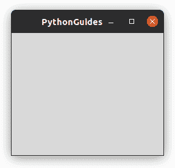
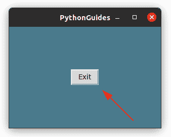
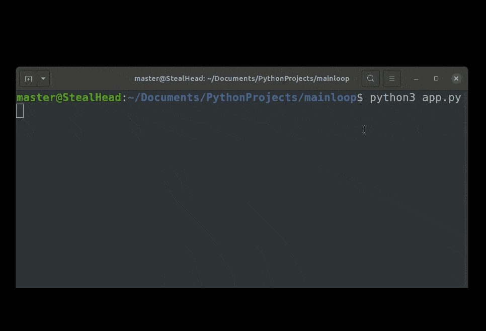
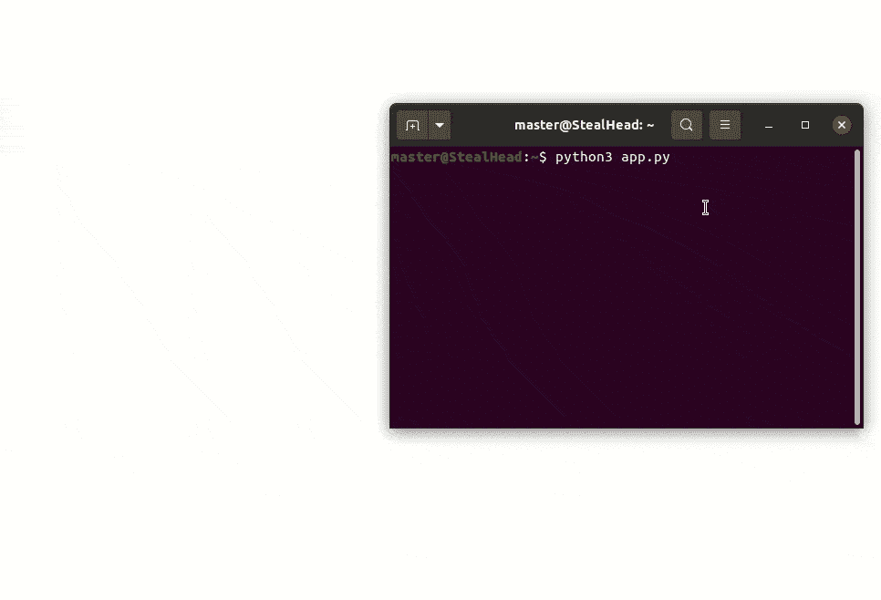
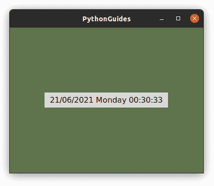

# Python Tkinter 主循环及示例

> 原文：<https://pythonguides.com/python-tkinter-mainloop/>

[](https://sharepointsky.teachable.com/p/python-and-machine-learning-training-course)

在本 [Python Tkinter 教程](https://pythonguides.com/python-gui-programming/)中，我们将学习关于 **Python Tkinter 主循环**的一切。此外，我们将涵盖这些主题。

1.  Python Tkinter 主循环
2.  Python Tkinter 主循环线程
3.  Python Tkinter 主循环出口
4.  Python Tkinter 主循环阻塞
5.  Python Tkinter 主循环无阻塞
6.  Python Tkinter 主循环更新
7.  Python Tkinter 主循环事件
8.  Python Tkinter 主循环定时器
9.  Python Tkinter 主循环背景

目录

[](#)

*   [Python Tkinter 主循环](#Python_Tkinter_Mainloop "Python Tkinter Mainloop")
*   [Python Tkinter 主循环线程](#Python_Tkinter_Mainloop_Thread "Python Tkinter Mainloop Thread")
*   [Python Tkinter 主循环出口](#Python_Tkinter_Mainloop_exit "Python Tkinter Mainloop exit")
*   [Python Tkinter 主循环阻塞](#Python_Tkinter_Mainloop_Blocking "Python Tkinter Mainloop Blocking")
*   [Python Tkinter 主循环无阻塞](#Python_Tkinter_Mainloop_Non_Blocking "Python Tkinter Mainloop Non Blocking")
*   [Python Tkinter 主循环更新](#Python_Tkinter_Mainloop_Update "Python Tkinter Mainloop Update")
*   [Python Tkinter 主循环事件](#Python_Tkinter_Mainloop_Event "Python Tkinter Mainloop Event")
*   [Python Tkinter 主循环定时器](#Python_Tkinter_Mainloop_Timer "Python Tkinter Mainloop Timer")
*   [Python Tkinter 主循环背景](#Python_Tkinter_Mainloop_Background "Python Tkinter Mainloop Background")

## Python Tkinter 主循环

Python Tkinter 中的 Mainloop 是应用程序窗口的无限循环，它永远运行，这样我们就可以看到静止的屏幕。

*   应用程序窗口就像一个帧，每一微秒都在不断破坏，但是主循环不断创建一个新的更新窗口。
*   这个摧毁旧纱窗、创造新纱窗的过程发生得如此之快，以至于人眼都没有意识到。
*   由于进程运行的时间是无限的，这就是为什么我们能够看到应用程序在我们面前，当我们关闭窗口，然后循环终止或退出。
*   C 或 C++程序员可以将这与我们用 C 或 C++运行程序时的情况联系起来，在显示结果后，黑色的输出窗口关闭。但是，如果有意或无意地触发了无限循环，那么黑色窗口将保持不变，并继续显示消息。
*   无限循环投射更新的窗口，这个过程太快了，我们感觉它在更新。

下面是用 Python Tkinter 实现**主循环的代码。 `mainloop()` 总是应用在代码的最后一行。**

```py
from tkinter import *

ws = Tk()
ws.title('PythonGuides')

ws.mainloop()
```



mainloop in Python Tkinter

## Python Tkinter 主循环线程

线程是作为独立实体与程序并行的进程。换句话说，通过使用线程，我们可以同时在同一个程序中运行多个东西。

*   线程就像程序的一个分支，作为一个独立的实体运行，一旦任务完成，它就会合并回主循环。
*   线程通过在一个任务运行时避免屏幕冻结来节省用户时间。

阅读: [Python Tkinter Checkbutton](https://pythonguides.com/python-tkinter-checkbutton/)

## Python Tkinter 主循环出口

Python Tkinter 提供了 `destroy()` 函数，使用该函数我们可以**退出 Python Tkinter** 中的主循环。 `destroy()` 函数可以应用于父窗口、框架、画布等。

**下面是演示 Python Tkinter 主循环出口**的代码

在这段代码中，我们创建了一个退出按钮，单击它将关闭窗口。

```py
from tkinter import *

ws = Tk()
ws.title('PythonGuides')
ws.geometry('300x200')
ws.config(bg='#4a7a8c')

Button(
    ws,
    text='Exit',
    command=lambda:ws.destroy()
).pack(expand=True)

ws.mainloop()
```

**下面是上面代码的输出，演示 Python Tkinter 主循环出口**

在这个输出中，当单击 exit 按钮时，主循环退出。



Python Tkinter Mainloop exit

## Python Tkinter 主循环阻塞

`Mainloop()` 方法在 Python Tkinter 中起着重要的作用，因为它会在每次事件发生时更新应用程序的图形用户界面(GUI)。

*   但是上述语句中令人难过的部分是主循环等待事件发生。这意味着它阻塞了主循环之外的代码。
*   Python 逐行执行代码，所以除非主循环没有终止，否则不允许 python 在主循环之外执行代码。
*   在下一节中，我们学习了如何在 Python Tkinter 中修复主循环阻塞。

**下面是演示 Python Tkinter 主循环阻塞**的代码

在这段代码中，我们创建了 GUI (Tkinter)和基于终端的应用程序。

```py
# GUI based application

from tkinter import *

ws = Tk()
ws.title('PythonGuides')
ws.geometry('300x200')
ws.config(bg='#4a7a8c')

Button(
    ws,
    text='Exit',
    command=lambda:ws.destroy()
).pack(expand=True)

ws.mainloop()

# terminal based application

name = input('Enter your name ')
print('Good Morning ',name)
```

**输出:**

*   在这个输出中，你可以注意到当 *app.py* 被执行时，Tkinter 应用程序出现在屏幕上，但是基于终端的应用程序只在 Tkinter 应用程序关闭时才出现。
*   这是因为主循环阻塞了代码。



Python Tkinter Mainloop Blocking

阅读: [Python Tkinter 单选按钮–如何使用](https://pythonguides.com/python-tkinter-radiobutton/)

## Python Tkinter 主循环无阻塞

在上一节中，我们已经看到了 **Python Tkinter 主循环阻塞**。现在我们将学习如何创建一个 **Python Tkinter 非阻塞主循环。**

*   线程是 Python Tkinter 中的库，使用它可以编写主循环非阻塞代码。
*   线程提升了程序中的多任务特性。这意味着代码块作为一个单独的实体运行。
*   在大型应用程序中使用线程是首选，但对于小型应用程序来说， `after()` 和 `update()` 做了同样的事情。
*   在我们的例子中，我们将在()之后使用**进行解释。对于**线程**和**更新()**，我们在这个博客中有不同的部分。**
*   因此，如果我们继续前面的例子，现在 GUI (Tkinter)和基于终端的应用程序应该同时出现。

**下面是演示 Python Tkinter 主循环非阻塞**的代码

在这段代码中，我们创建了保存基于终端的应用程序代码的函数，并在第 18 行使用 after 函数调用该函数。

```py
from tkinter import *

ws = Tk()
ws.title('PythonGuides')
ws.geometry('300x200')
ws.config(bg='#4a7a8c')

def greet_user():
    name = input('Enter your name ')
    print('Good Morning ',name)   

Button(
    ws,
    text='Exit',
    command=lambda:ws.destroy()
).pack(expand=True)

ws.after(0, greet_user)
ws.mainloop() 
```

在这个输出中，基于终端的应用程序和基于 GUI 的应用程序同时运行。这样，主循环就不会阻塞其他应用程序。



Python Tkinter Mainloop Non Blocking

## Python Tkinter 主循环更新

Python Tkinter 中 mainloop 的 `Update()` 方法用于显示更新后的屏幕。它反映了事件发生时的变化。在下面的例子中，我们展示了 Python Tkinter 中的 `update()` 函数。

**Python Tkinter 主循环的源代码更新示例**

在这个代码中，日期、星期和时间被显示。该信息从系统中获取，Tkinter 窗口持续更新以显示最新信息。

```py
from tkinter import *
import time

ws = Tk()
ws.title('PythonGuides')
ws.geometry('400x300')
ws.config(bg='#5f734c')

time_lbl = Label(
    ws,
    text=time.strftime( "%d/%m/%Y %A %H:%M:%S"),
    font=(21),
    padx=10,
    pady=5,
    bg='#d9d8d7'
    )

time_lbl.pack(expand=True)
ws.update()

while True:
    time.sleep(1)
    time_text=time.strftime("%d/%m/%Y %A %H:%M:%S")
    time_lbl.config(text=time_text)
    ws.update()

ws.mainloop() 
```

**Python Tkinter 主循环更新示例的输出**

在这个输出中，时间是不断变化的，更新是可见的，因为我们在主窗口上应用了更新功能。



Python Tkinter Mainloop Update

阅读: [Python Tkinter 按钮](https://pythonguides.com/python-tkinter-button/)

## Python Tkinter 主循环事件

在本节中，我们将学习 Python Tkinter 中主循环中的**事件。同样，我们也看到了同样的例子。**

*   事件是指执行的任何活动，它可以是预定的活动或由用户手动执行的活动。点击按钮、在输入框中填充信息、选择单选按钮等触发事件。
*   主循环等待事件发生，以便更新屏幕。等待事件会导致阻塞，但可以通过使用 Python Tkinter 中的 thread、update 或 after 函数来解决
*   在我们的例子中，我们将演示生成密码的程序，同时它将在终端上显示一条消息。

**Python Tkinter 主循环事件示例的源代码**

在这段代码中，我们创建了两个程序，一个是基于 gui 的，另一个是基于终端的。其中基于终端的每 2 秒触发一个事件，而基于 gui 的应用程序在用户点击按钮时触发。这里要注意的是两者都是并行运行的，没有阻塞代码。

```py
from tkinter import *
import random

ws = Tk()
ws.title('PythonGuides')
ws.config(bg='#5f734c')
ws.geometry('400x300')

def generate_password():
    digits = ['0', '1', '2', '3', '4', '5', '6', '7', '8', '9'] 
    lc = ['a', 'b', 'c', 'd', 'e', 'f', 'g', 'h',
                     'i', 'j', 'k', 'm', 'n', 'o', 'p', 'q',
                     'r', 's', 't', 'u', 'v', 'w', 'x', 'y',
                     'z']

    uc = ['A', 'B', 'C', 'D', 'E', 'F', 'G', 'H',
                     'I', 'J', 'K', 'M', 'N', 'O', 'p', 'Q',
                     'R', 'S', 'T', 'U', 'V', 'W', 'X', 'Y',
                     'Z']

    spch = ['@', '#', '$', '%', '=', ':', '?', '.', '/', '|', '~', '>',
           '*', '(', ')', '<']

    pwd = random.choice(digits) + random.choice(lc) + random.choice(uc) + random.choice(spch)
    password = pwd+pwd
    lbl.config(text=password)

lbl = Label(
    ws,
    bg='#5f734c', 
    font=(18)
    )
lbl.pack(expand=True)

btn = Button(
    ws,
    text='Generate Password',
    padx=10, 
    pady=5,
    command=generate_password
)
btn.pack(expand=True)

def message():
    print('Keep yourself hyderated.')
    ws.after(2000, message) 

ws.after(2000, message)
ws.mainloop()
```

**Python Tkinter 主循环事件示例的输出**

在这个输出中，发生了两个事件，但是主循环没有阻塞代码。您可以看到基于 Gui 和基于终端的应用程序并行运行。


Python Tkinter mainloop event

## Python Tkinter 主循环定时器

主循环在 Python Tkinter 中起着重要的作用，因为它在屏幕上显示更新的信息。

*   Timer 是一个与时间相关的程序，我们可以使用 Python Tkinter 中的 Mainloop 来创建。
*   我们有一个专门的部分，其中我们已经使用 Python Tkinter 创建了[倒计时定时器](https://pythonguides.com/create-countdown-timer-using-python-tkinter/)

## Python Tkinter 主循环背景

在本节中，我们将学习如何使用 Python Tkinter 中的 mainloop 在后台运行应用程序。

*   我们将使用 Python Tkinter 主循环更新中的示例来解释 Python Tkinter 主循环的背景。
*   在 Python Tkinter 主循环更新中，我们显示了**日期**、**日期**、**和**时间**。其中只有时间在不断更新，而日期和日子在后台运行。**

您可能会喜欢以下 Python tkinter 教程:

*   [Python Tkinter 待办事项列表](https://pythonguides.com/python-tkinter-todo-list/)
*   [Python Tkinter 窗口大小](https://pythonguides.com/python-tkinter-window-size/)
*   [Python Tkinter 画布教程](https://pythonguides.com/python-tkinter-canvas/)
*   [Python Tkinter 进度条小工具–如何使用](https://pythonguides.com/python-tkinter-progress-bar/)
*   [Python Tkinter Stopwatch](https://pythonguides.com/python-tkinter-stopwatch/)

在本教程中，我们将学习关于 `Python Tkinter Mainloop` 的一切。此外，我们将涵盖这些主题。

*   Python Tkinter 主循环
*   Python Tkinter 主循环线程
*   Python Tkinter 主循环出口
*   Python Tkinter 主循环无阻塞
*   Python Tkinter 主循环阻塞
*   Python Tkinter 主循环更新
*   Python Tkinter 主循环事件
*   Python Tkinter 主循环定时器
*   Python Tkinter 主循环背景

[Bijay Kumar](https://pythonguides.com/author/fewlines4biju/)

Python 是美国最流行的语言之一。我从事 Python 工作已经有很长时间了，我在与 Tkinter、Pandas、NumPy、Turtle、Django、Matplotlib、Tensorflow、Scipy、Scikit-Learn 等各种库合作方面拥有专业知识。我有与美国、加拿大、英国、澳大利亚、新西兰等国家的各种客户合作的经验。查看我的个人资料。

[enjoysharepoint.com/](https://enjoysharepoint.com/)[](https://www.facebook.com/fewlines4biju "Facebook")[](https://www.linkedin.com/in/fewlines4biju/ "Linkedin")[](https://twitter.com/fewlines4biju "Twitter")