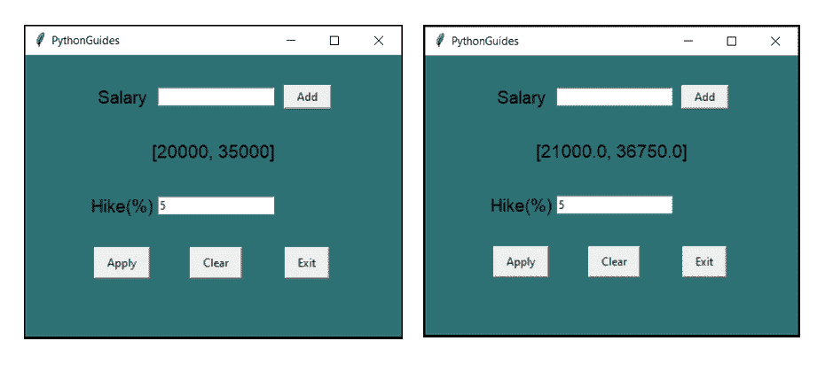

# Python Tkinter Map()函数

> 原文：<https://pythonguides.com/python-tkinter-map-function/>

[](https://sharepointsky.teachable.com/p/python-and-machine-learning-training-course)

本节我们就来说说 **Python Tkinter Map()函数**。这篇博客将告诉你如何在 Python Tkinter 中使用**地图()。**

## `Python Tkinter Map()`

Python Tkinter map()函数有两个参数，第一个是函数名&，第二个是 iterables。Iterables 是要应用函数的项目列表。Map 将给定的函数逐个应用于列表中的所有项目。

**语法:**

```py
 map(func, *iterables)
```

**代码:**

这是 map 函数的实现。

在这段代码中，用户可以输入多份工资。每次他输入薪水并点击添加按钮。薪水被添加到列表中。用户需要提供评估百分比。点击“申请”将显示新增加的工资。

```py
from tkinter import *

sal = []

# function

def mapfunction():
    res = (list(map(apply, sal))) 
    items_lb.config(text=f'{res}')

def apply(n):
    percentage = int(hike_tf.get())/100
    n = n + n * percentage
    return n

def clear():
    sal_tf.delete(0, END)
    hike_tf.delete(0, END)
    items_lb.config(text='')
    sal.clear()

def addtolist():
    temp = int(sal_tf.get())
    sal.append(temp)
    items_lb.config(text=f'{sal}')
    sal_tf.delete(0, END)

f = ('Times bold', 14)    

ws = Tk()
ws.title('PythonGuides')
ws.geometry('400x300')
ws.config(bg='#2E7175')

# Frame Widget
frame = Frame(
    ws,
    bg='#2E7175'
    )
frame.place(relx=0.5, rely=0.5, anchor=CENTER )

inside_frame = Frame(
    frame
)
inside_frame.grid(row=1, columnspan=3)

# Label Widget
sal_lb = Label(
    frame, 
    text="Salary",
    font=f,
    bg='#2E7175',
    padx=10
    )
sal_lb.grid(row=0, column=0)

hike_lb = Label(
    frame, 
    text="Hike(%)",
    font=f,
    bg='#2E7175',
    )
hike_lb.grid(row=2, column=0)

items_lb = Label(
    frame,
    text='',
    bg='#2E7175',
    font=f,
    )
items_lb.grid(row=1, column=0, columnspan=3, pady=30)

# Entry Widget
sal_tf = Entry(frame)
sal_tf.grid(row=0, column=1)

hike_tf = Entry(frame)
hike_tf.grid(row=2, column=1)

# Button widget
add_btn = Button(
    frame,
    text="Add",
    padx=10,
    command=addtolist
)
add_btn.grid(row=0, column=2, padx=10)

apply_btn = Button(
    frame, 
    text="Apply", 
    padx=10, 
    pady=5,
    command=mapfunction
    )
apply_btn.grid(row=4, column=0, pady=30)

clear_btn = Button(
    frame, 
    text="Clear", 
    padx=10, 
    pady=5,
    command=clear
    )
clear_btn.grid(row=4, column=1, pady=30)

exit_btn = Button(
    frame, 
    text="Exit", 
    padx=10, 
    pady=5,
    command=lambda:ws.destroy()
    )
exit_btn.grid(row=4, column=2, pady=30)

ws.mainloop()
```

**输出:**

在这个输出中，用户输入了两份薪水，并为每份薪水增加了 5%。map 函数采用了一个为 increment 创建的函数，并应用于这两个薪水，如您在第二张图片中所见。



Python Tkinter Map() Function

您可能会喜欢以下 Python tkinter 教程:

*   [如何使用 Python Tkinter 创建日期时间选择器](https://pythonguides.com/create-date-time-picker-using-python-tkinter/)
*   [如何进入 Python Tkinter 程序的下一页](https://pythonguides.com/go-to-next-page-in-python-tkinter/)
*   [如何使用 Python Tkinter 读取文本文件](https://pythonguides.com/python-tkinter-read-text-file/)
*   [如何使用 Python Tkinter 获取用户输入并存储在变量中](https://pythonguides.com/how-to-take-user-input-and-store-in-variable-using-python-tkinter/)
*   [Python Tkinter 退出程序](https://pythonguides.com/python-tkinter-exit-program/)
*   [上传文件用 Python Tkin](https://pythonguides.com/upload-a-file-in-python-tkinter/)[t](https://pythonguides.com/upload-a-file-in-python-tkinter/)[er](https://pythonguides.com/upload-a-file-in-python-tkinter/)
*   [用 Python Tkinter 创建 Word 文档](https://pythonguides.com/create-word-document-in-python-tkinter/)

在本节中，我们学习了如何使用 Python Tkinter 中的 **map()函数。**

[Bijay Kumar](https://pythonguides.com/author/fewlines4biju/)

Python 是美国最流行的语言之一。我从事 Python 工作已经有很长时间了，我在与 Tkinter、Pandas、NumPy、Turtle、Django、Matplotlib、Tensorflow、Scipy、Scikit-Learn 等各种库合作方面拥有专业知识。我有与美国、加拿大、英国、澳大利亚、新西兰等国家的各种客户合作的经验。查看我的个人资料。

[enjoysharepoint.com/](https://enjoysharepoint.com/)[](https://www.facebook.com/fewlines4biju "Facebook")[](https://www.linkedin.com/in/fewlines4biju/ "Linkedin")[](https://twitter.com/fewlines4biju "Twitter")