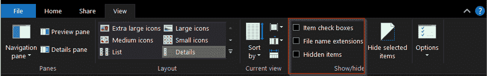

# Python Tkinter 菜单栏–如何使用

> 原文：<https://pythonguides.com/python-tkinter-menu-bar/>

[](https://sharepointsky.teachable.com/p/python-and-machine-learning-training-course)

在本 [Python 教程](https://pythonguides.com/python-hello-world-program/)中，我们将学习 **Python Tkinter 菜单栏**。我们也会讨论这些话题。

*   Python Tkinter Menu bar
*   Python Tkinter 菜单栏颜色
*   Python Tkinter 菜单栏背景色
*   Python Tkinter 菜单栏复选框
*   Python Tkinter 菜单栏类
*   Python Tkinter 菜单栏图标
*   Python Tkinter 菜单栏子菜单

如果你是 Python GUI 编程的新手，那么看看 [Python GUI 编程(Python Tkinter)](https://pythonguides.com/python-gui-programming/) 。

目录

[](#)

*   [Python Tkinter Menu bar](#Python_Tkinter_Menu_bar "Python Tkinter Menu bar")
*   [Python Tkinter Menu bar 颜色](#Python_Tkinter_Menu_bar_color "Python Tkinter Menu bar color")
*   [Python Tkinter 菜单栏复选框](#Python_Tkinter_Menu_bar_Checkbox "Python Tkinter Menu bar Checkbox")
*   [Python Tkinter 菜单栏类](#Python_Tkinter_Menu_bar_Class "Python Tkinter Menu bar Class")
*   [Python Tkinter Menu bar 图标](#Python_Tkinter_Menu_bar_icon "Python Tkinter Menu bar icon")
*   [Python Tkinter Menu bar 子菜单](#Python_Tkinter_Menu_bar_submenu "Python Tkinter Menu bar submenu")

## Python Tkinter Menu bar

*   **t 中间菜单栏**用于创建菜单选项，为应用程序提供附加功能
*   菜单栏在软件和应用程序中非常常见。
*   这是一个菜单栏的例子


Python Tkinter Menu bar

*   在这个画面中，文件、编辑、节等都是菜单栏，而菜单选项如新建文件、新建窗口等。
*   他们中很少有人有子菜单，就像最近打开的菜单一样。小箭头表示可能的扩展。
*   你一定在很多软件和应用程序中见过这种菜单栏。
*   现在当你理解了菜单栏的样子，让我们来理解如何在 Tkinter 中创建它们。

你可能还喜欢，[如何使用 Python Tkinter](https://pythonguides.com/python-tkinter-to-display-data-in-textboxes/) 在文本框中显示数据？还有[如何在 Python Tkinter](https://pythonguides.com/set-background-to-be-an-image-in-python-tkinter/) 中设置背景为图像？

## Python Tkinter Menu bar 颜色

让我们看看如何在 **Python Tkinter 菜单栏中赋予颜色。**

*   只有在 Linux 机器上才能给菜单栏着色。
*   原因是 Tkinter 外包了菜单栏，这就是为什么我们的选择有限。
*   为了在 Linux 机器上实现着色，使用关键字 `background` 来设置背景颜色，使用 `foreground` 来设置文本颜色。

**代码:**

下面是 Linux 上菜单栏的实现。在这里，我们创建了 3 个流行的菜单栏**文件**、**编辑、**和**帮助**。每个菜单栏都有选项。退出这些**退出** & **关于**都是功能性的。

```py
from tkinter import *
from tkinter import messagebox

ws =Tk()
ws.title("Python Guides")
ws.geometry("300x250")

def about():
    messagebox.showinfo('PythonGuides', 'Python Guides aims at providing best practical tutorials')

menubar = Menu(ws, background='#ff8000', foreground='black', activebackground='white', activeforeground='black')  
file = Menu(menubar, tearoff=1, background='#ffcc99', foreground='black')  
file.add_command(label="New")  
file.add_command(label="Open")  
file.add_command(label="Save")  
file.add_command(label="Save as")    
file.add_separator()  
file.add_command(label="Exit", command=ws.quit)  
menubar.add_cascade(label="File", menu=file)  

edit = Menu(menubar, tearoff=0)  
edit.add_command(label="Undo")  
edit.add_separator()     
edit.add_command(label="Cut")  
edit.add_command(label="Copy")  
edit.add_command(label="Paste")  
menubar.add_cascade(label="Edit", menu=edit)  

help = Menu(menubar, tearoff=0)  
help.add_command(label="About", command=about)  
menubar.add_cascade(label="Help", menu=help)  

ws.config(menu=menubar)
ws.mainloop() 
```

**输出:**

在此输出中，演示了彩色菜单栏。背景是“橙色”，前景是“黑色”。


Python Tkinter Menu bar color

阅读: [Python Tkinter Colors](https://pythonguides.com/python-tkinter-colors/)

## Python Tkinter 菜单栏复选框



Python Tkinter Menu bar Checkbox

*   复选按钮或复选框允许在选项之间切换
*   它们很简单&返回值是真还是假
*   带有复选框的菜单栏可用于选择暗或亮模式、隐藏项目、过滤等场景。

**代码:**

这段代码展示了菜单栏复选框的实现。

```py
from tkinter import *
from tkinter import messagebox

ws =Tk()
ws.title("Python Guides")
ws.geometry("300x250")

def about():
    messagebox.showinfo('PythonGuides', 'Python Guides aims at providing best practical tutorials')

def darkMode():
    if darkmode.get() == 1:
        ws.config(background='black')
    elif darkmode.get() == 0:
        ws.config(background='white')
    else:
        messagebox.showerror('PythonGuides', 'Something went wrong!')

menubar = Menu(ws, background='#ff8000', foreground='black', activebackground='white', activeforeground='black')  
file = Menu(menubar, tearoff=1, background='#ffcc99', foreground='black')  
file.add_command(label="New")  
file.add_command(label="Open")  
file.add_command(label="Save")  
file.add_command(label="Save as")    
file.add_separator()  
file.add_command(label="Exit", command=ws.quit)  
menubar.add_cascade(label="File", menu=file)  

edit = Menu(menubar, tearoff=0)  
edit.add_command(label="Undo")  
edit.add_separator()     
edit.add_command(label="Cut")  
edit.add_command(label="Copy")  
edit.add_command(label="Paste")  
menubar.add_cascade(label="Edit", menu=edit)  

minimap = BooleanVar()
minimap.set(True)
darkmode = BooleanVar()
darkmode.set(False)

view = Menu(menubar, tearoff=0)
view.add_checkbutton(label="show minimap", onvalue=1, offvalue=0, variable=minimap)
view.add_checkbutton(label='Darkmode', onvalue=1, offvalue=0, variable=darkmode, command=darkMode)
menubar.add_cascade(label='View', menu=view)

help = Menu(menubar, tearoff=0)  
help.add_command(label="About", command=about)  
menubar.add_cascade(label="Help", menu=help)  

ws.config(menu=menubar)
ws.mainloop() 
```

**输出:**

在此输出中，单击了小地图选项，这就是地图出现的原因。取消选中该框将移除小地图。没有选择黑暗模式检查按钮，这就是屏幕正常的原因。你可以复制代码，自己试试。


Python Tkinter Menu bar Checkbox

## Python Tkinter 菜单栏类

*   类在所有编程语言中都起着重要的作用。
*   该类有助于避免代码的重复，并方便我们将部分代码用于另一个程序。
*   旋转风扇的代码可以用在无人机、吊扇等程序中，就像写一次就可以在任何地方使用一样。
*   在这一节中，我们将学习如何为菜单栏创建一个类

**代码:**

在这段代码中，带有 3 个菜单的框被创建为**文件，编辑**和**帮助。**输出与上一节类似，但代码是类格式的。

```py
from tkinter import *
from tkinter import messagebox

class MenuBar(Menu):
    def __init__(self, ws):
        Menu.__init__(self, ws)

        file = Menu(self, tearoff=False)
        file.add_command(label="New")  
        file.add_command(label="Open")  
        file.add_command(label="Save")  
        file.add_command(label="Save as")    
        file.add_separator()
        file.add_command(label="Exit", underline=1, command=self.quit)
        self.add_cascade(label="File",underline=0, menu=file)

        edit = Menu(self, tearoff=0)  
        edit.add_command(label="Undo")  
        edit.add_separator()     
        edit.add_command(label="Cut")  
        edit.add_command(label="Copy")  
        edit.add_command(label="Paste")  
        self.add_cascade(label="Edit", menu=edit) 

        help = Menu(self, tearoff=0)  
        help.add_command(label="About", command=self.about)  
        self.add_cascade(label="Help", menu=help)  

    def exit(self):
        self.exit

    def about(self):
            messagebox.showinfo('PythonGuides', 'Python Guides aims at providing best practical tutorials')

class MenuDemo(Tk):
    def __init__(self):
        Tk.__init__(self)
        menubar = MenuBar(self)
        self.config(menu=menubar)

if __name__ == "__main__":
    ws=MenuDemo()
    ws.title('Python Guides')
    ws.geometry('300x200')
    ws.mainloop()
```

**输出:**

在此输出中，显示了带有选项菜单的菜单栏。其中的**出口**和大约是功能性的。


Python Tkinter Menu bar Class

阅读: [Python Tkinter Colors](https://pythonguides.com/python-tkinter-colors/)

## Python Tkinter Menu bar 图标

*   由于受到限制，无法在菜单栏上添加图标。
*   Tkinter 将菜单栏外包给另一家供应商，因此它为 Tkinter 菜单栏提供的功能有限。
*   在 Tkinter 菜单栏颜色部分，我们已经看到这在 mac 和 windows 中是不允许的
*   我们确实试图在 Linux 上实现它，但是在那里也不行。
*   软件是一个神秘的行业，如果你找到了解决方案，请在评论中分享。

## Python Tkinter Menu bar 子菜单

现在，让我们看看如何**在 Python Tkinter 菜单栏**中创建子菜单。

*   子菜单是指菜单中的菜单。
*   换句话说，嵌套菜单。
*   示例:视图>比率>选项 1、选项 2、选项 3
*   用户点击查看菜单，比率选项现在出现当用户点击比率，然后进一步 3 个选项出现。这被称为子菜单。

**代码:**

```py
from tkinter import *
from tkinter import messagebox

class MenuBar(Menu):
    def __init__(self, ws):
        Menu.__init__(self, ws)

        file = Menu(self, tearoff=False)
        file.add_command(label="New")  
        file.add_command(label="Open")  
        file.add_command(label="Save")  
        file.add_command(label="Save as")    
        file.add_separator()
        file.add_command(label="Exit", underline=1, command=self.quit)
        self.add_cascade(label="File",underline=0, menu=file)

        edit = Menu(self, tearoff=0)  
        edit.add_command(label="Undo")  
        edit.add_separator()     
        edit.add_command(label="Cut")  
        edit.add_command(label="Copy")  
        edit.add_command(label="Paste")  
        self.add_cascade(label="Edit", menu=edit) 

        view = Menu(self, tearoff=0)
        ratio = Menu(self, tearoff=0)
        for aspected_ratio in ('4:3', '16:9'):
            ratio.add_command(label=aspected_ratio)
        view.add_cascade(label='Ratio', menu=ratio)
        self.add_cascade(label='View', menu=view)

        help = Menu(self, tearoff=0)  
        help.add_command(label="About", command=self.about)  
        self.add_cascade(label="Help", menu=help)  

    def exit(self):
        self.exit

    def about(self):
            messagebox.showinfo('PythonGuides', 'Python Guides aims at providing best practical tutorials')

class MenuDemo(Tk):
    def __init__(self):
        Tk.__init__(self)
        menubar = MenuBar(self)
        self.config(menu=menubar)

if __name__ == "__main__":
    ws=MenuDemo()
    ws.title('Python Guides')
    ws.geometry('300x200')
    ws.mainloop()
```

**输出:**

在此输出中，**视图**有菜单选项为比率，比率还有子菜单。


Python Tkinter Menu bar submenu

您可能会喜欢以下 Python 教程:

*   [Python Tkinter check button–如何使用](https://pythonguides.com/python-tkinter-checkbutton/)
*   [Python Tkinter 单选按钮–如何使用](https://pythonguides.com/python-tkinter-radiobutton/)
*   [Python Tkinter 按钮–如何使用](https://pythonguides.com/python-tkinter-button/)
*   [Python Tkinter 条目–如何使用](https://pythonguides.com/python-tkinter-entry/)
*   [Python tkinter 标签–如何使用](https://pythonguides.com/python-tkinter-label/)
*   [Python 生成随机数和字符串](https://pythonguides.com/python-generate-random-number/)
*   [Python 将列表写入文件，并附有示例](https://pythonguides.com/python-write-list-to-file/)
*   [Python Tkinter 进度条](https://pythonguides.com/python-tkinter-progress-bar/)
*   [Python Tkinter 退出程序](https://pythonguides.com/python-tkinter-exit-program/)
*   [如何使用 Python Tkinter 获取用户输入并存储在变量中](https://pythonguides.com/how-to-take-user-input-and-store-in-variable-using-python-tkinter/)
*   [如何使用 Python Tkinter 读取文本文件](https://pythonguides.com/python-tkinter-read-text-file/)

在本节中，我们已经了解了 **Python Tkinter 菜单栏**，并且我们已经涵盖了这些主题。

*   Python Tkinter Menu bar
*   Python Tkinter 菜单栏颜色
*   Python Tkinter 菜单栏背景色
*   Python Tkinter 菜单栏复选框
*   Python Tkinter 菜单栏类
*   Python Tkinter 菜单栏图标
*   Python Tkinter 菜单栏子菜单

[Bijay Kumar](https://pythonguides.com/author/fewlines4biju/)

Python 是美国最流行的语言之一。我从事 Python 工作已经有很长时间了，我在与 Tkinter、Pandas、NumPy、Turtle、Django、Matplotlib、Tensorflow、Scipy、Scikit-Learn 等各种库合作方面拥有专业知识。我有与美国、加拿大、英国、澳大利亚、新西兰等国家的各种客户合作的经验。查看我的个人资料。

[enjoysharepoint.com/](https://enjoysharepoint.com/)[](https://www.facebook.com/fewlines4biju "Facebook")[](https://www.linkedin.com/in/fewlines4biju/ "Linkedin")[](https://twitter.com/fewlines4biju "Twitter")