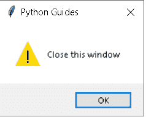

# Python Tkinter messagebox + 19 个示例

> 原文：<https://pythonguides.com/python-tkinter-messagebox/>

[](https://sharepointsky.teachable.com/p/python-and-machine-learning-training-course)

继续阅读了解更多关于 `Python Tkinter messagebox` 的内容，我们将举例讨论 Python Tkinter 中的 **messagebox。**

*   Python Tkinter messagebox
*   Python Tkinter messagebox 选项
*   Python tkinter messagebox 大小
*   Python tkinter messagebox 问题
*   python tkinter messagebox ask yesno
*   Python tkinter messagebox 位置
*   Python tkinter messagebox 文档
*   Python tkinter 是否对话框
*   Python tkinter 是否消息框
*   Python Tkinter 对话窗口
*   Python Tkinter 对话框是否
*   使用对话框打开路径
*   Python Tkinter 对话框返回值
*   Python Tkinter 对话框模式
*   Python Tkinter 对话框焦点
*   Python Tkinter 弹出消息
*   python Tkinter 弹出输入框
*   python Tkinter 弹出对话框
*   python Tkinter 弹出菜单
*   python Tkinter 关闭弹出窗口

如果您是 Python Tkinter 或 Python GUI 编程的新手，请查看 [Python GUI 编程](https://pythonguides.com/python-gui-programming/)。

目录

[](#)

*   [Python tkinter messagebox](#Python_tkinter_messagebox "Python tkinter messagebox")
*   [Python tkinter messagebox 选项](#Python_tkinter_messagebox_options "Python tkinter messagebox options")
*   [Python tkinter messagebox 大小](#Python_tkinter_messagebox_size "Python tkinter messagebox size")
*   [Python tkinter messagebox 问题](#Python_tkinter_messagebox_askquestion "Python tkinter messagebox askquestion")
*   [python tkinter messagebox asyesno](#Python_tkinter_messagebox_askyesno "Python tkinter messagebox askyesno")
*   [Python tkinter messagebox 位置](#Python_tkinter_messagebox_position "Python tkinter messagebox position")
*   [Python tkinter messagebox 文档](#Python_tkinter_messagebox_documentation "Python tkinter messagebox documentation")
*   [Python tkinter yes no 对话框](#Python_tkinter_yes_no_dialog_box "Python tkinter yes no dialog box")
*   [Python Tkinter 对话窗口](#Python_Tkinter_dialog_window "Python Tkinter dialog window")
*   [Python Tkinter 对话框是否](#Python_Tkinter_dialog_yes_no "Python Tkinter dialog yes no")
*   [Python Tkinter 使用对话窗口打开路径](#Python_Tkinter_open_path_using_the_dialog_window "Python Tkinter open path using the dialog window")
*   [Python Tkinter 对话框返回值](#Python_Tkinter_dialog_return_value "Python Tkinter dialog return value")
*   [Python Tkinter 对话框模式](#Python_Tkinter_dialog_modal "Python Tkinter dialog modal")
*   [Python Tkinter 对话框焦点](#Python_Tkinter_dialog_focus "Python Tkinter dialog focus ")
*   [Python Tkinter 弹出式消息](#Python_Tkinter_popup_message "Python Tkinter popup message")
*   [Python Tkinter 弹出输入框](#Python_Tkinter_popup_input_box "Python Tkinter popup input box")
*   [Python Tkinter 弹出对话框](#Python_Tkinter_popup_dialog "Python Tkinter popup dialog")
*   [Python Tkinter 弹出菜单](#Python_Tkinter_popup_menu "Python Tkinter popup menu")
*   [Python Tkinter 关闭弹出窗口](#Python_Tkinter_close_popup_window "Python Tkinter close popup window")

## Python tkinter messagebox

*   Messagebox 用于显示弹出消息。
*   要开始使用 message box，请在 Python 中导入一个库 messagebox。
*   Messagebox 主要提供了 6 种类型的消息提示，如 showinfo()、showerror()、showwarning()、askquestion()、askokcancel()、askyesno()、askretyrcancel()。

| `showinfo()` | 需要显示任何确认/信息时使用。如登录成功、消息发送等。 |
| `showerror()` | 用于显示带声音的错误提示。它出现的理想时间是当用户犯了任何错误或者跳过了必要的步骤。 |
| `showwarning()` | 显示带有感叹号的警告提示。它警告用户即将出现的错误。 |
| `askquestion()` | 它向用户询问**是**或**否**。它还返回'**是**或'**否** |
| **抗癌药()** | 它提示'**确定'**或'**取消【T3 '，返回'**真**或'**假【T7 '**** |
| ****【asyesno()**** | 它提示'**是'**或**'否'。**返回**真**表示‘是’，返回**假**表示‘否’ |
| `askyenocancel()` | 提示'**是'**，**，【否】，**或**，【取消】。**是返回真，否返回假，取消返回无 |
| `askretrycancel()` | 提示**重试**和**取消**选项。重试返回**真**，取消返回**假。** |

查看，[如何使用 Python Tkinter 生成工资单](https://pythonguides.com/how-to-generate-payslip-using-python-tkinter/)

## Python tkinter messagebox 选项

*   Python Messagebox 选项在上面一点已经提到了
*   所以在这里我们用一个例子来看一下，我们会看到 showinfo()、showwarning()、askquestion()、askokcancel()、askyesno()、askretrycancel()的例子。

**语法:**

```py
from tkinter import messagebox
messagebox.option('title', 'message_to_be_displayed')
```


python tkinter messagebox

**代码:**

下面是代表各种消息框的代码。

```py
from tkinter import *
from tkinter import messagebox

ws = Tk()
ws.title('Python Guides')
ws.geometry('300x200')
ws.config(bg='#5FB691')

def msg1():
    messagebox.showinfo('information', 'Hi! You got a prompt.')
    messagebox.showerror('error', 'Something went wrong!')
    messagebox.showwarning('warning', 'accept T&C')
    messagebox.askquestion('Ask Question', 'Do you want to continue?')
    messagebox.askokcancel('Ok Cancel', 'Are You sure?')
    messagebox.askyesno('Yes|No', 'Do you want to proceed?')
    messagebox.askretrycancel('retry', 'Failed! want to try again?')

Button(ws, text='Click Me', command=msg1).pack(pady=50)

ws.mainloop()
```

**输出:**

以下是点击**点击我**按钮时显示的选项。


python tkinter messagebox examples

你可能会喜欢 [Python Tkinter 在文本框中显示数据](https://pythonguides.com/python-tkinter-to-display-data-in-textboxes/)和[如何在 Python Tkinter 中设置背景为图像](https://pythonguides.com/set-background-to-be-an-image-in-python-tkinter/)。

## Python tkinter messagebox 大小

*   没有办法改变 messagebox 的大小。
*   只有更多的文本才能扩展 messagebox 的大小。
*   在本例中，我将更改文本内容以拉伸消息框的大小。

**代码:**

```py
from tkinter import *
from tkinter import messagebox

ws = Tk()
ws.title('Python Guides')
ws.geometry('400x300')

def clicked():
    messagebox.showinfo('sample 1', 'this is a message')
    messagebox.showinfo('sample 2', 'this is a message to change the size of box')
    messagebox.showinfo('sample 3', ' this is the message that is larger than previous message.')

Button(ws, text='Click here', padx=10, pady=5, command=clicked).pack(pady=20)

ws.mainloop()
```

**输出:**


Python tkinter messagebox size

阅读[如何使用 Pyinstaller 将 Python 文件转换为 exe 文件](https://pythonguides.com/convert-python-file-to-exe-using-pyinstaller/)

## Python tkinter messagebox 问题

*   askquestion 提示用于向用户提问。
*   可以以“**是**或“**否**的形式收集回复。
*   该函数返回'**是**或'**否**。
*   这些返回类型可以使用 if-else 语句来控制。
*   我们将在下面的例子中看到这一点。

**代码:**

在这段 Python 代码中，我们实现了 askquestion messagebox。我们将 messagebox 的值存储在变量' **res '中。**然后我们比较了变量和返回类型，即“是”或“否”。

```py
from tkinter import *
from tkinter import messagebox

ws = Tk()
ws.title('Python Guides')
ws.geometry('300x100')

def askMe():
    res = messagebox.askquestion('askquestion', 'Do you like cats?')
    if res == 'yes':
        messagebox.showinfo('Response', 'You like Cats')
    elif res == 'no':
        messagebox.showinfo('Response', 'You must be a dog fan.')
    else:
        messagebox.showwarning('error', 'Something went wrong!')

Button(ws, text='Click here', padx=10, pady=5, command=askMe).pack(pady=20)

ws.mainloop()
```

**输出:**

在这个输出中，有一个按钮，单击该按钮将提示问题。用户将回答“是”或“否”。相应地，另一个消息框会提示。


Python tkinter messagebox askquestion

阅读: [Python Tkinter 主循环](https://pythonguides.com/python-tkinter-mainloop/)

## python tkinter messagebox asyesno

*   askyesno 用于提示用户“是”或“否”选项。
*   可以以“**是”或“否”**的格式收集回复。
*   askyesno 函数返回布尔值，即'**真'**或**'假'**。
*   控制 yes 或 no use if-else 语句。

**代码:**

```py
from tkinter import *
from tkinter import messagebox
import time

ws = Tk()
ws.title('Python Guides')
ws.geometry('400x200')
ws.config(bg='#345')

def quitWin():
    res = messagebox.askyesno('prompt', 'Do you want to kill this window?') 
    if res == True:
        messagebox.showinfo('countdown', 'killing window in 5 seconds')
        time.sleep(5)
        ws.quit()

    elif res == False:
        pass
    else:
        messagebox.showerror('error', 'something went wrong!')

Button(ws, text='Kill the Window', padx=10, pady=5, command=quitWin).pack(pady=50)

ws.mainloop()
```

**输出:**

在这个输出中，用户将看到一个带有“取消窗口”按钮的窗口。一旦用户点击这个按钮。


Python tkinter messagebox askyesno

阅读[在 Python Tkinter 中创建 Word 文档](https://pythonguides.com/create-word-document-in-python-tkinter/)

## Python tkinter messagebox 位置

*   在本节中，我们将讨论 messagebox 的位置
*   这可以通过使用**顶层**小部件来实现。
*   任何其他小部件都可以放在顶层小部件上。
*   它类似于 python 框架，但专门用于创建定制的提示。
*   在下面的例子中，我们放置了图像、标签和 2 个按钮。
*   它看起来像一个提示，但我们可以按照我们的要求定位的东西。
*   对于图像，我们有下面列出的几个选项。
    *   * tk::icons::错误
    *   * tk::图标::信息
    *   * tk::icons::警告
    *   * tk::icons::问题

**代码:**

下面是用 **Python 创建 messagebox** 的代码，其中包含定制位置的小部件。我们在这里放置了问题的图标或图像。但是你可以用“错误”、“警告”、“问题”或“信息”来代替它

```py
from tkinter import *

def killWin():
	toplevel = Toplevel(ws)

	toplevel.title("Kill window")
	toplevel.geometry("230x100")

	l1=Label(toplevel, image="::tk::icons::question")
	l1.grid(row=0, column=0)
	l2=Label(toplevel,text="Are you sure you want to Quit")
	l2.grid(row=0, column=1, columnspan=3)

	b1=Button(toplevel,text="Yes",command=ws.destroy, width=10)
	b1.grid(row=1, column=1)
	b2=Button(toplevel,text="No",command=toplevel.destroy, width=10)
	b2.grid(row=1, column=2)

ws = Tk()
ws.geometry("300x200")
ws.title('Python Guides')
ws.config(bg='#345')
Button(ws,text="Kill the window",command=killWin).pack(pady=80)

ws.mainloop() 
```

**输出:**

在这个输出中，主窗口有一个按钮，单击该按钮将提示用户是否要退出这个页面。如果用户说“是”，该页面将会消失。因为这是一个问题，所以您可以注意到在提示的左侧有一个问号的小图标。


Python tkinter messagebox position

阅读 [Python 数字猜谜游戏](https://pythonguides.com/python-number-guessing-game/)

## Python tkinter messagebox 文档

**信息消息框**

使用 showinfo 功能显示信息**。**

**警告消息框**

为了显示警告或错误信息**，使用显示警告**和**显示错误**。

**问题消息框**

提问有多种选择:

*   **问问题**
*   **腺癌**
*   `askretrycancel`
*   ask yesno
*   **要求取消**

## Python tkinter yes no 对话框

让我们看看，如何在 Python Tkinter 或 Python **tkinter yes no 消息框**中生成 **Yes 或 No 弹出窗口。Python Tkinter 提供了一个 `messagebox` 模块，允许生成 Yes 和 No 提示。**

*   “是”或“否”弹出窗口用于在执行任务前要求确认。它主要用于确保用户没有意外触发任务。
*   当用户将要退出程序或将要启动任何敏感任务时，可以看到 Yes 或 No 提示。例如，在转账时，你看到一个提示“你想继续吗”。
*   messagbox 模块中有两个函数用于生成是或否提示:
    *   messagebox.askquestion()
    *   messagebox . askyesno()
*   messagebox.askquestion()函数用于向用户提问，用户必须回答是或否。当用户单击“是”按钮时，该函数返回 True，当用户单击“否”按钮时，该函数返回 Flase。
*   messagebox.askyesno()函数也做同样的事情，它要求用户回答是或否。
*   我们有一个完整的关于 Python Tkinter messagebox 的部分，并附有一个例子。在这里，我们已经介绍了消息框的所有可用选项。

**语法:**

*   下面是 Python Tkinter 中 **messagebox 的语法。在第一行中，我们从 Tkinter 库中导入了 messagebox 模块。**
*   在第二行中，**选项**是将生成提示的函数。有七个选项可以生成提示，但是在本教程中，我们将只讨论其中的两个:
    *   `messagebox.askquestion()`
    *   **信差盒. asyesno()**

```py
from tkinter import messagebox

messagebox.option('title', 'message_to_be_displayed')
```

**Python Tkinter 中的是/否弹出窗口示例**

*   这个应用程序向用户显示了两个选项。一个是捐赠，另一个是退出应用程序。
*   如果用户点击转账按钮， `askquestion()` 函数被触发&请求用户确认。
*   如果用户点击退出按钮， `askyesno()` 功能被触发，询问用户是否确定退出应用程序。

```py
from tkinter import *
from tkinter import messagebox

ws = Tk()
ws.title('PythonGuides')
ws.geometry('400x300')
ws.config(bg='#4a7a8c')

def askQuestion():
    reply = messagebox.askyesno('confirmation', 'Are you sure you want to donate $10000 ?')
    if reply == True:
        messagebox.showinfo('successful','You are the Best!')
    else:
        messagebox.showinfo('', 'Maybe next time!')

def askYesNo():
    reply = messagebox.askyesno('confirmation', 'Do you want to quit this application?')
    if reply == True:
        messagebox.showinfo('exiting..', 'exiting application')
        ws.destroy()
    else:
        messagebox.showinfo('', 'Thanks for Staying')

btn1 = Button(
    ws,
    text='Transfer',
    command=askQuestion,
    padx=15,
    pady=5
)
btn1.pack(expand=True, side=LEFT)

btn2 = Button(
    ws,
    text='Exit',
    command=askYesNo,
    padx=20,
    pady=5
)
btn2.pack(expand=True, side=RIGHT)

ws.mainloop()
```

**上述代码的输出**

下面是上面代码的输出，在这段代码中，用户想要退出应用程序。点击退出按钮后，他看到“是/否”弹出窗口。


Yes No Popups in Python Tkinter

这就是如何在 Python Tkinter 或 **Python Tkinter yes no 对话框**中生成 **Yes No 弹出框。**

读取 [Python Tkinter 过滤函数()](https://pythonguides.com/python-tkinter-filter/)

## Python Tkinter 对话窗口

在这一节中，我们将学习如何在 Python Tkinter 中**创建一个对话窗口。**

对话窗口是用来在用户和软件程序之间进行交流的，或者我们也可以说它只是用来显示信息并要求用户确认。

**代码:**

在下面的代码中，我们导入了库 `Simpledialog` ，该库用于创建一个对话框窗口以从用户处获取值。

*   `simple dialog . ask integer()`用于从用户处获取一个整数。
*   `simpledialog.askstring()` 用于从用户处获取字符串值。
*   `simpledialog.askfloat()` 用于从用户处获取浮点值。

```py
from tkinter import *
from tkinter import simpledialog

ws = Tk()
ws.title("Python Guides")

answer1 = simpledialog.askstring("Input", "What is your first name?",
                                parent=ws)
if answer1 is not None:
    print("Your first name is ", answer1)
else:
    print("You don't have a first name?")

answer1 = simpledialog.askinteger("Input", "What is your age?",
                                 parent=ws,
                                 minvalue=0, maxvalue=100)
if answer1 is not None:
    print("Your age is ", answer1)
else:
    print("You don't have an age?")

answer1 = simpledialog.askfloat("Input", "What is your salary?",
                               parent=ws,
                               minvalue=0.0, maxvalue=100000.0)
if answer1 is not None:
    print("Your salary is ", answer1)
else:
    print("You don't have a salary?")
ws.mainloop()
```

**输出:**

运行上面的代码后，我们得到下面的输出，其中我们看到一个对话框窗口，用户在其中输入他们的名字。输入姓名后，点击确定。


Python Tkinter dialog box window Output

点击确定后，下一个对话框将打开，用户可以在其中输入他们的名字。输入他们的年龄后，点击确定。


Python Tkinter dialog box window1 Output

点击确定后，下一个对话窗口将打开，用户可以输入他们的工资，最后点击确定。


Python Tkinter dialog box window2 Output

点击“确定”后，所有数据将显示在命令提示符下。


Python Tkinter dialog box window3 Output

阅读 [Python Tkinter add 函数示例](https://pythonguides.com/python-tkinter-add-function/)

## Python Tkinter 对话框是否

在这一节中，我们将学习如何在 Python Tkinter 中**创建一个是或否对话框。**

这是一个警告对话框，用户可以在其中选择是继续还是退出。如果用户想退出，点击**是**如果不想退出，点击**否**。

**输出:**

在下面的代码中，我们导入了 `tkinter.messagebox` 库，用于给出是和否的警告消息。我们还创建了一个窗口，并将标题**“Python Guides”**赋予将显示是或否弹出消息的窗口。

`askyesno()` 函数显示一个对话框，要求用户确认。

```py
from tkinter import *
from tkinter.messagebox import askyesno

# create the root window
ws = Tk()
ws.title('Python Guides')
ws.geometry('200x200')

# click event handler
def confirm():
    answer = askyesno(title='confirmation',
                    message='Are you sure that you want to quit?')
    if answer:
        ws.destroy()

Button(
    ws,
    text='Ask Yes/No',
    command=confirm).pack(expand=True)

# start the app
ws.mainloop() 
```

**输出:**

在下面的输出中，我们看到了一个窗口，其中将显示一条是或否的弹出消息。


Python Tkinter dialog yes or no Output

点击询问是/否后，确认消息将显示**“您确定` `要退出吗？”**使用是和否按钮。点击“是”,所有程序将退出，否则它们将停留在第一个窗口。


Python Tkinter Dialog Confirmation Yes or No

阅读 [Python Tkinter 面板](https://pythonguides.com/python-tkinter-panel/)

## Python Tkinter 使用对话窗口打开路径

在本节中，我们将学习如何使用 Python Tkinter 中的对话框**创建一个开放路径。**

“打开”对话框允许用户指定要打开的驱动器、目录和文件名。

**代码:**

在下面的代码中，**我们将库文件 dialog 作为 fd** 导入，并创建窗口 `ws= Tk()` ，标题为****“Python 向导”**。**

 ***   fd.askopenfilename() 函数返回我们选择的文件名，也支持对话框显示的其他函数。
*   **错误信息** =当文件不被支持时显示错误信息。
*   **按钮()**可以显示文字或图片。

```py
from tkinter import *
from tkinter import filedialog as fd 
ws = Tk()
ws.title("Python Guides")
ws.geometry("100x100")
def callback():
    name= fd.askopenfilename() 
    print(name)

error_msg = 'Error!'
Button(text='File Open', 
       command=callback).pack(fill=X)
ws.mainloop() 
```

**输出:**

在下面的输出中，我们看到了一个窗口，在这个窗口中我们添加了一个名为**“File Open”**的按钮。


Python Tkinter open path using dialog window Output

单击按钮后，会打开一个对话框。选择文件名后，选择点击打开按钮。


Python Tkinter open path using dialog window 1 Output

单击“打开”按钮后，文件路径和位置会显示在命令提示符上，如下图所示。


Python Tkinter open path using dialog window2 Output

在方法之后读取 [Python Tkinter](https://pythonguides.com/python-tkinter-after-method/)

## Python Tkinter 对话框返回值

在本节中，我们将学习如何在 python Tkinter 中**创建一个对话框返回值。**

返回值是用户在对话框中输入数字时得到的。并且用户输入的数字作为返回值显示在主窗口上。

**代码:**

在下面的代码中，我们创建了一个窗口 `ws = TK()` 在这个窗口中，我们添加了一个带有文本**“获取输入”**的按钮。我们还创建了标签和条目来接收用户的输入。

*   `Label()` 函数用作显示框，用户可以在其中放置文本。
*   **按钮()**用于提交文本。
*   `customdialog()` 用于获取主窗口上的弹出消息。

```py
from tkinter import *

class customdialog(Toplevel):
    def __init__(self, parent, prompt):
        Toplevel.__init__(self, parent)

        self.var = StringVar()

        self.label = Label(self, text=prompt)
        self.entry = Entry(self, textvariable=self.var)
        self.ok_button = Button(self, text="OK", command=self.on_Ok)

        self.label.pack(side="top", fill="x")
        self.entry.pack(side="top", fill="x")
        self.ok_button.pack(side="right")

        self.entry.bind("<Return>", self.on_Ok)

    def on_Ok(self, event=None):
        self.destroy()

    def show(self):
        self.wm_deiconify()
        self.entry.focus_force()
        self.wait_window()
        return self.var.get()

class example(Frame):
    def __init__(self, parent):
        Frame.__init__(self, parent)
        self.button = Button(self, text="Get Input", command=self.on_Button)
        self.label = Label(self, text="", width=20)
        self.button.pack(padx=8, pady=8)
        self.label.pack(side="bottom", fill="both", expand=True)

    def on_Button(self):
        string = customdialog(self, "Enter something:").show()
        self.label.configure(text="You entered:\n" + string)

if __name__ == "__main__":
    ws = Tk()
    ws.title("Python Guides")
    ws.geometry("200x200")
    example(ws).pack(fill="both", expand=True)
    ws.mainloop()
```

**输出:**

运行上面的代码后，我们得到了下面的输出。在这个窗口中，我们创建了一个窗口，并添加了一个标题为**“Get Input”**的按钮。


Python Tkinter dialog return value Output

点击**“获取输入”**按钮后，我们得到一个对话框。在对话框中，用户可以输入任何内容。输入后点击**确定**按钮。


Python Tkinter dialog return value1 Output

点击 ok 按钮后，我们在主窗口上得到返回值。


Python Tkinter dialog return value2 Output

读取 [Python Tkinter 保存文本到文件](https://pythonguides.com/python-tkinter-save-text-to-file/)

## Python Tkinter 对话框模式

在这一节中，我们将学习如何在 Python Tkinter 中**创建一个对话框模型。**

模式窗口创建了一种破坏主窗口但使其在模式窗口中可见的方式。我们可以使用模态窗口作为主窗口。这是为计算机应用而设计的。

**代码:**

在下面的代码中，我们导入**。ttk 导入样式**库，用于为窗口提供样式。这里我们创建一个窗口，在窗口内添加一些标签和按钮。

*   `Label()` 函数用作显示框，用户可以在其中放置文本。
*   `Button()` 函数的作用是当用户按下一个按钮时，由鼠标点击某个动作开始。
*   `Pop.destroy()` 用于在使用后销毁窗口。

```py
from tkinter import *
from tkinter.ttk import Style

ws = Tk()
ws.title("Python Guides")

ws.geometry("200x250")
style = Style()
style.theme_use('clam')

def choice1(option):
   pop1.destroy()
   if option == "yes":
      label1.config(text="Hello, How are You?")
   else:
      label1.config(text="You have selected No")
      ws.destroy()
def click_fun1():
   global pop1
   pop1 = Toplevel(ws)
   pop1.title("Confirmation")
   pop1.geometry("300x150")
   pop1.config(bg="white")

   label1 = Label(pop1, text="Would You like to Proceed?",
   font=('Aerial', 12))
   label1.pack(pady=20)

   frame1 = Frame(pop1, bg="gray71")
   frame1.pack(pady=10)

   button_1 = Button(frame1, text="Yes", command=lambda: choice1("yes"), bg="blue", fg="black")
   button_1.grid(row=0, column=1)
   button_2 = Button(frame1, text="No", command=lambda: choice1("no"), bg="blue", fg="black")
   button_2.grid(row=0, column=2)

label1 = Label(ws, text="", font=('Aerial', 14))
label1.pack(pady=40)

Button(ws, text="Click Here", command=click_fun1).pack()

ws.mainloop()
```

**输出:**

在下面的输出中，我们看到一个窗口，在这个窗口中放置了一个按钮。通过点击“点击这里”按钮，一些行动开始，并移动到下一个命令。


Python Tkinter dialog modal Output

点击“点击此处”按钮后，确认窗口打开，显示文本**“是否要继续”**如果是，点击是，如果否，点击。


Python Tkinter dialog modal1 Output

点击“是”按钮后，我们看到一些文本显示在主窗口中。


Python Tkinter dialog modal2 Output

## Python Tkinter 对话框焦点

在这一节中，我们将学习如何在 Python Tkinter 中**创建一个对话框焦点。**

在前进之前，我们应该有一个关于焦点的知识。专注就是把注意力放在一件特别的事情上，或者我们可以说是所有活动的中心点。

对话框焦点是当用户在对话框中输入一些内容，并希望向前移动时，他们单击按钮，这样就完全聚焦在按钮上了。

**代码:**

在下面的代码中，我们创建了一个窗口，在这个窗口中我们创建了一个入口小部件和按钮。哪个完成的按钮部件有焦点。

*   `Entry()` 用于给出来自用户的输入。
*   `Button()` 函数的作用是当用户按下一个按钮时，由鼠标点击某个动作开始。

```py
 from tkinter import *
from tkinter.ttk import *

ws = Tk()
ws.title("Python Guides")

entry1 = Entry(ws)
entry1.pack(expand = 1, fill = BOTH)

entry2 = Button(ws, text ="Button")

entry2.focus_set()
entry2.pack(pady = 5)

entry3 = Radiobutton(ws, text ="Hello")
entry3.pack(pady = 5)

ws.mainloop()
```

**输出:**

这是一个对话框小部件，用户在其中输入内容，然后点击按钮继续操作。在这种情况下，按钮小部件完全具有焦点。


因此，在本教程中，我们讨论了 **Python Tkinter 对话框窗口**，我们也涵盖了不同的例子。

## Python Tkinter 弹出式消息

在这一节中，我们将学习如何在 Python Tkinter 中**创建一个弹出消息。**

在继续之前，我们应该了解一些关于 Popup 的知识。弹出式菜单被定义为突然出现并引起观众注意的通知。用户窗口出现弹出消息。

**代码:**

在下面的代码中，我们创建了一个窗口，在这个窗口中，我们还创建了一个带有文本**“Click Me”**的按钮。点击它们后，将会打开一个弹出窗口。

**导入 tkinter.messagebox** 导入该库，用于在弹出屏幕上显示消息。

`tkinter . messagebox . showinfo()`用于显示重要信息。

```py
from tkinter import *

import tkinter.messagebox

ws = Tk()

ws.title("Python Guides")
ws.geometry("500x300")

def on_Click():
	tkinter.messagebox.showinfo("Python Guides", "Welcome")

but = Button(ws, text="Click Me", command=on_Click)

but.pack(pady=80)
ws.mainloop() 
```

**输出:**

在下面的输出中，我们看到一个窗口，在这个窗口中放置了一个按钮。


Python Tkinter Popup message Output

点击此按钮，会出现一个弹出窗口，显示一些信息。


Create popup message in Python Tkinter

## Python Tkinter 弹出输入框

在接下来的章节中，我们将学习如何在 Python Tkinter 中**创建一个弹出输入框。**

Inputbox 是用户可以输入一些值的地方，文本输入后有一个按钮向前移动以完成任务。弹出输入框是类似的，当弹出输入框窗口出现时，用户可以插入文本。

**代码:**

在下面的代码中，我们创建了一个窗口，在这个窗口中我们添加了一个标签和按钮。我们还定义了一个**弹出输入窗口**为 `Popup_win` 在这个窗口中我们创建了一个条目，我们可以在其中插入一些文本。

```py
 from tkinter import*

ws= Tk()
ws.title("Python Guides")

ws.geometry("500x300")

def closewin(tp):
   tp.destroy()
def insert_val(e):
   e.insert(0, "Hello Guides!")

def popup_win():

   tp= Toplevel(ws)
   tp.geometry("500x200")

   entry1= Entry(tp, width= 20)
   entry1.pack()

   Button(tp,text= "Place text", command= lambda:insert_val(entry1)).pack(pady= 5,side=TOP)

   button1= Button(tp, text="ok", command=lambda:closewin(tp))
   button1.pack(pady=5, side= TOP)

label1= Label(ws, text="Press the Button to Open the popup dialogue", font= ('Helvetica 15 bold'))
label1.pack(pady=20)

button1= Button(ws, text= "Press!", command= popup_win, font= ('Helvetica 16 bold'))
button1.pack(pady=20)
ws.mainloop()
```

**输出:**

在下面的输出中，我们看到窗口上有一个标签和按钮，标签用于描述任务，按钮用于继续任务。


Python Tkinter Popup input box Output

点击按钮，屏幕上显示一个弹出输入框，我们可以点击放置文本按钮在输入框中插入一些文本。插入后，点击确定按钮。


Popup input box using Python Tkinter

## Python Tkinter 弹出对话框

在下一节中，我们将学习如何在 Python Tkinter 中创建一个弹出对话框。

弹出对话框类似于弹出消息，显示在现有窗口的顶部。

**代码:**

在下面的代码中，我们看到一个窗口，窗口内放置了按钮，单击这些按钮中的任何一个，屏幕上会出现一个弹出对话框。

```py
from tkinter import *

import tkinter.messagebox

ws = Tk()

ws.title("Python Guides")
ws.geometry('500x300')

def Eastside():
	tkinter.messagebox.showinfo("Python Guides", "Right button Clicked")

def Westside():
	tkinter.messagebox.showinfo("Python Guides", "Left button Clicked")

def Northside():
	tkinter.messagebox.showinfo("Python Guides", "Top button Clicked")

def Southside():
	tkinter.messagebox.showinfo("Python Guides", "Bottom button Clicked")

button1 = Button(ws, text="Left", command=Westside, pady=10)
button2 = Button(ws, text="Right", command=Eastside, pady=10)
button3 = Button(ws, text="Top", command=Northside, pady=10)
button4 = Button(ws, text="Bottom", command=Southside, pady=10)

button1.pack(side=LEFT)
button2.pack(side=RIGHT)
button3.pack(side=TOP)
button4.pack(side=BOTTOM)

ws.mainloop()
```

**输出:**

运行上面的代码后，我们得到下面的输出，其中我们看到四个按钮分别位于窗口的“顶部”、“底部”、“左侧”和“右侧”。


Python Tkinter Popup dialog Output

点击顶部按钮，弹出一个对话框，显示消息**“顶部按钮**


Create a popup dialog in Python Tkinter

## Python Tkinter 弹出菜单

在本节中，我们将学习如何在 Python Tkinter 中**创建一个弹出菜单。**

右键单击主窗口，弹出菜单出现在主窗口上。屏幕上弹出一个菜单栏，其中包含有限的选项。

**代码:**

在下面的代码中，我们创建了一个窗口，在这个窗口中我们添加了一个带有文本**“右击显示菜单”**的标签。因为标签描述了菜单栏在屏幕上弹出时要做的事情。

*   `Menu()` 用于在屏幕上显示菜单栏。
*   `pop_up.add_command()` 用于在菜单栏中添加一些命令。

```py
from tkinter import *

ws = Tk()
ws.title("Python Guides")

ws.geometry("500x300")

label1 = Label(ws, text="Right-click To Display a Menu", font= ('Helvetica 16'))
label1.pack(pady= 40)

pop_up = Menu(ws, tearoff=0)

pop_up.add_command(label="New")
pop_up.add_command(label="Edit")
pop_up.add_separator()
pop_up.add_command(label="Save")

def menupopup(event):

   try:
      pop_up.tk_popup(event.x_root, event.y_root, 0)
   finally:

      pop_up.grab_release()

ws.bind("<Button-3>", menupopup)

button1 = Button(ws, text="Exit", command=ws.destroy,width=6,height=4)
button1.pack()

ws.mainloop() 
```

**输出:**

在下面的输出中，我们看到窗口中有一个标签和按钮。


Python Tkinter popup menu

当我们右击窗口上的任何地方时，菜单栏就会在窗口上弹出。


Popup menu using Python Tkinter

## Python Tkinter 关闭弹出窗口

在本节中，我们将学习如何在 Python Tkinter 中创建关闭弹出窗口。

在关闭弹出窗口中，我们想要关闭当前在屏幕上弹出的窗口。

**代码:**

在下面的代码中，我们导入了 `tkinter.messagebox` 库，用于在弹出窗口中显示消息，并希望通过显示警告消息来关闭该窗口。

*   `tkinter . messagebox . ask yesno()`用于获取用户的响应，如果他们想退出，请单击“是”,如果不想退出，请单击“否”
*   `tkinter . messagebox . show warning()`用于显示验证用户响应的警告。
*   `tkinter . messagebox . showinfo()`用于显示弹出窗口关闭的信息。

```py
from tkinter import *
import tkinter.messagebox 

ws=Tk()
ws.title("Python Guides")
ws.geometry("300x200")

def callfun():
    if tkinter.messagebox.askyesno('Python Guides', 'Really quit'):
        tkinter.messagebox.showwarning('Python Guides','Close this window')
    else:
        tkinter.messagebox.showinfo('Python Guides', 'Quit has been cancelled')

Button(text='Close', command=callfun).pack(fill=X)

ws.mainloop()
```

**输出:**

在下面的输出中，我们看到一个窗口，一个按钮被放置在一个窗口中，点击它们，我们得到**询问是否**的消息。


Python Tkinter close popup window Output

如此图所示，如果我们想关闭弹出窗口，我们选择选项“是”或“否”,然后单击“是”。


Close popup window Tkinter

点击“是”后，我们看到这个弹出窗口出现在屏幕上。点击 `ok` 按钮，关闭弹出窗口。



Python Tkinter close popup window

您可能会喜欢以下 Python 教程:

*   [Python Tkinter 帧](https://pythonguides.com/python-tkinter-frame/)
*   [Python Tkinter 菜单栏–如何使用](https://pythonguides.com/python-tkinter-menu-bar/)
*   [Python Tkinter check button–如何使用](https://pythonguides.com/python-tkinter-checkbutton/)
*   [Python Tkinter 单选按钮–如何使用](https://pythonguides.com/python-tkinter-radiobutton/)
*   [Python Tkinter 按钮–如何使用](https://pythonguides.com/python-tkinter-button/)
*   [Python Tkinter 条目–如何使用](https://pythonguides.com/python-tkinter-entry/)
*   [Python tkinter 标签–如何使用](https://pythonguides.com/python-tkinter-label/)
*   [Python Tkinter Stopwatch](https://pythonguides.com/python-tkinter-stopwatch/)

在本教程中，我们学习了 `Python tkinter messagebox` 。我们也讨论了这些主题。

*   Python tkinter messagebox
*   python tkinter messagebox 选项
*   python tkinter messagebox 大小
*   python tkinter messagebox 问题
*   python tkinter messagebox ask yesno
*   python tkinter messagebox 位置
*   python tkinter messagebox 文档
*   Python tkinter 是否消息框
*   Python tkinter 是否对话框
*   Python Tkinter 对话窗口
*   Python Tkinter 对话框是否
*   使用对话框打开路径
*   Python Tkinter 对话框返回值
*   Python Tkinter 对话框模式
*   Python Tkinter 对话框焦点
*   Python Tkinter 弹出消息
*   python Tkinter 弹出输入框
*   python Tkinter 弹出对话框
*   python Tkinter 弹出菜单
*   python Tkinter 关闭弹出窗口

[Bijay Kumar](https://pythonguides.com/author/fewlines4biju/)

Python 是美国最流行的语言之一。我从事 Python 工作已经有很长时间了，我在与 Tkinter、Pandas、NumPy、Turtle、Django、Matplotlib、Tensorflow、Scipy、Scikit-Learn 等各种库合作方面拥有专业知识。我有与美国、加拿大、英国、澳大利亚、新西兰等国家的各种客户合作的经验。查看我的个人资料。

[enjoysharepoint.com/](https://enjoysharepoint.com/)[](https://www.facebook.com/fewlines4biju "Facebook")[](https://www.linkedin.com/in/fewlines4biju/ "Linkedin")[](https://twitter.com/fewlines4biju "Twitter")**