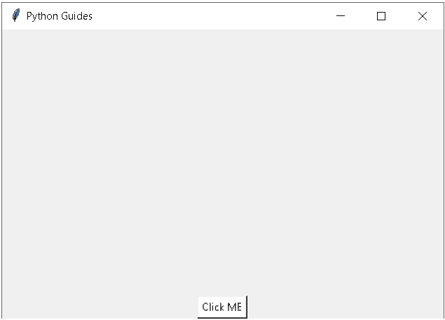
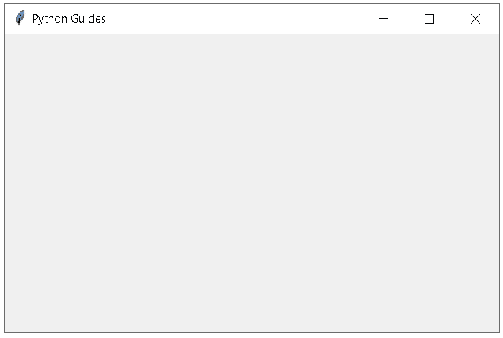
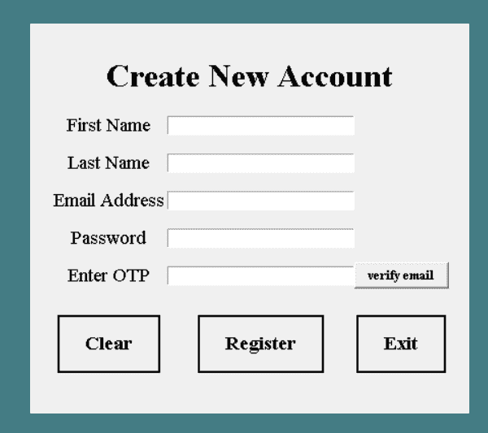
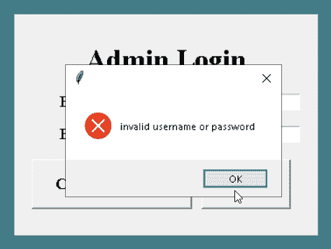

# Python 跨多窗口教程

> 原文：<https://pythonguides.com/python-tkinter-multiple-windows-tutorial/>

[](https://sharepointsky.teachable.com/p/python-and-machine-learning-training-course)

在这个 Python Tkinter 教程中，我们将学习如何在 [Python Tkinter](https://pythonguides.com/python-gui-programming/) 中**创建多个窗口**，我们还将涵盖与**多个窗口**相关的不同示例。我们将讨论这些话题。

*   Python Tkinter 多窗口
*   使用多窗口的 Python Tkinter 用户注册
*   Python Tkinter 多页面访问验证

目录

[](#)

*   [Python Tkinter 多窗口](#Python_Tkinter_multiple_windows "Python Tkinter multiple windows ")
*   [使用多窗口的 Python Tkinter 用户注册](#Python_Tkinter_user_registration_using_multiple_windows "Python Tkinter user registration using multiple windows")
*   [Python Tkinter 多页面访问验证](#Python_Tkinter_Multi-page_access_verification "Python Tkinter Multi-page access verification ")

## Python Tkinter 多窗口

首先，我们将学习如何使用 Python Tkinter 创建多个窗口。

我们正在学习多窗口是如何工作的。所谓多窗口，我们指的是将一个页面与其他相互链接的页面连接起来，并在一个新的标签页中打开，甚至将我们重定向到一个新的页面。

**代码**:

```py
import tkinter as tk

def New_Window():
    Window = tk.Toplevel()
    canvas = tk.Canvas(Window, height=HEIGHT, width=WIDTH)
    canvas.pack()

HEIGHT = 300
WIDTH = 500

ws = tk.Tk()
ws.title("Python Guides")
canvas = tk.Canvas(ws, height=HEIGHT, width=WIDTH)
canvas.pack()

button = tk.Button(ws, text="Click ME", bg='White', fg='Black',
                              command=lambda: New_Window())

button.pack()
ws.mainloop()
```

下面是给定代码的一些主要亮点。

*   `ws` 用于**根窗口**
*   **高度** =画布小工具的高度。
*   **宽度** =宽度用于画布小部件。
*   `bg` 用于背景色。
*   `fg` 用于前景色。
*   **tk。**按钮()用于添加按钮。

**输出:**

在上面的代码中，我们在屏幕底部制作了一个简单的按钮。点击那个按钮，一个新窗口就打开了。



Python Tkinter Multiple Window Output

我们可以在上面的输出中看到一个按钮，点击“ `Click Me` 按钮会打开一个新窗口。结果如下所示。



Final Output

阅读: [Python Tkinter 编辑器](https://pythonguides.com/python-tkinter-editor/)

## 使用多窗口的 Python Tkinter 用户注册

在下一节中，我们将学习使用多窗口的 **Python Tkinter 用户注册。**

我们必须制作一个登记表，在其中我们制作了载有与姓名、电子邮件和密码相关的信息的区块列。它还使用 OTP 验证电子邮件，以检查真正的用户是否有健康的数据库。

**代码:**

我们在这段代码中使用的一些库是 `smtplib` 、 `sqlite3` 和 `messagebox` 、 `random` 、 `EmailMessage` 、under `Tkinter` 和 `email.message` 库。这里还使用了一些标签、字段、条目和按钮。

*   `sqllite3.connect()` 用于数据库连接
*   `Label()` 用于显示文本，在此用户只查看不交互。
*   `Entry()` 是一个单行文本框，用于接受来自用户的值。

```py
from tkinter import *
import re
from tkinter import messagebox
import sqlite3
import random
from email.message import EmailMessage
import smtplib

**# Database** 
try:
    con = sqlite3.connect('website.db')

    con.execute('''create table if not exists users(
                fname text not null,
                lname text not null,
                email text not null,
                password text not null);      
    ''')
    con.close()

except Exception as ep:
    messagebox.showerror('', ep)

ws = Tk()
ws.title('Python Guides')
ws.geometry('500x400')
ws.config(bg="#447c84")
ws.attributes('-fullscreen',True)

**# functions**

def otp_gen():
    pass

cpy = ''

def sendOtp():
    otp_no = ''
    for _ in range(4):
        r = random.randint(0, 9)
        otp_no += str(r)  

    global cpy 
    cpy += otp_no
    sender = "codetestingemail6@gmail.com"
    reciever = em.get()
    password = "Cute...pie@0823"
    msg_body = f'otp is {cpy}'
    msg = EmailMessage()
    msg['subject'] = 'OTP'   
    msg['from'] = sender
    msg['to'] = reciever
    msg.set_content(msg_body)
    with smtplib.SMTP_SSL('smtp.gmail.com', 465) as smtp:
        smtp.login(sender,password)

        smtp.send_message(msg)

    print(cpy)
    return cpy

def clr():
    fname.delete(0, END)
    lname.delete(0, END)
    em.delete(0, END)
    pwd.delete(0, END)

def submit():
    enteredOtp = otp.get()
    expectedOtp = cpy
    print(expectedOtp)

    fname_check = fname.get()
    lname_check = lname.get()
    em_check = em.get()
    pwd_check = pwd.get()
    otp_check = otp.get()
    check_count = 0

    if fname_check == "":
        warn = "First name can't be empty!"
    else:
        check_count += 1
    if lname_check == "":
        warn = "Last name can't be empty!"
    else:
        check_count += 1
    if em_check == "":
        warn = "Email can't be empty!"
    else:
        check_count += 1
    if pwd_check == "":
        warn = "Password can't be empty!"
    else:
        check_count += 1
    if otp_check == "":
        warn = "Otp can't be empty!"
    else:
        check_count += 1

    # if fname_check, lname_check, pwd_check, otp_check:
    if check_count == 5:
        if (expectedOtp == enteredOtp):
            con = sqlite3.connect('website.db')
            c = con.cursor()
            c.execute("insert into users VALUES (:fname, :lname, :em, :pwd)",{

                'fname': fname.get(),
                'lname': lname.get(),
                'em': em.get(),
                'pwd': pwd.get()
            })
            con.commit()

            ws.destroy()
            import app

        else:
            messagebox.showerror('','Incorrect Otp')
    else:
        messagebox.showerror('', warn)

**# frames**
frame = Frame(ws, padx=20, pady=20)
frame.pack(expand=True)

**# labels**
Label(
    frame, 
    text="Create New Account",
    font=("Times", "24", "bold")
    ).grid(row=0, columnspan=3, pady=10)

Label(
    frame, 
    text='First Name', 
    font=("Times", "14")
    ).grid(row=1, column=0, pady=5)

Label(
    frame, 
    text='Last Name', 
    font=("Times", "14")
    ).grid(row=2, column=0, pady=5)

Label(
    frame, 
    text='Email Address', 
    font=("Times", "14")
    ).grid(row=3, column=0, pady=5)

Label(
    frame, 
    text='Password', 
    font=("Times", "14")
    ).grid(row=4, column=0, pady=5)

Label(
    frame, 
    text='Enter OTP', 
    font=("Times", "14")
    ).grid(row=5, column=0, pady=5)

**# Entry**
fname = Entry(frame, width=30)
lname = Entry(frame, width=30)
em = Entry(frame, width=30)
pwd = Entry(frame, width=30)
otp = Entry(frame, width=30)

fname.grid(row=1, column=1)
lname.grid(row=2, column=1)
em.grid(row=3, column=1)
pwd.grid(row=4, column=1)
otp.grid(row=5, column=1)

**# button** 
clr = Button(frame, text="Clear", padx=20, pady=10, relief=SOLID, font=("Times", "14", "bold"), command=clr)
reg = Button(frame, text="Register", padx=20, pady=10, relief=SOLID, font=("Times", "14", "bold"), command=submit)
ext = Button(frame, text="Exit", padx=20, pady=10, relief=SOLID, font=("Times", "14", "bold"), command=lambda:ws.destroy())
otpp = Button(frame, text="verify email", padx=10, relief=RAISED, font=("Times", "10", "bold"), command=sendOtp)
clr.grid(row=6, column=0, pady=20)
reg.grid(row=6, column=1, pady=20)
ext.grid(row=6, column=2, pady=20)
otpp.grid(row=5, column=2)

ws.mainloop()
```

**输出:**

在上面的代码中，我们制作了一个带有细节的注册表单，如标签**、按钮**、**、**和**条目**，这些都用在这个代码中，它与一个数据库连接相连接，这个数据库连接添加了一个真正的用户来注册。



new account Output

在下面的输出中，我们填写了所有详细信息，并验证了电子邮件以继续下一步。


Python Tkinter user registration using multiple windows

当我们检查并随机输入动态口令时，我们可以看到出现了一个错误，显示消息“**不正确的动态口令**”。这意味着在我们提供注册时使用的正确的动态口令和电子邮件地址之前，我们不能继续前进。


multiple windows in Python tkinter

阅读: [Python Tkinter 表教程](https://pythonguides.com/python-tkinter-table-tutorial/)

## Python Tkinter 多页面访问验证

在下一节中，我们将学习多页访问验证。

通过访问验证，我们是指验证在注册期间注册用户的密码和电子邮件。我们也可以使用这个代码中的 create account 按钮来注册用户。

**代码:**

**登录 Page.py**

现在，让我们看看我们在这段代码中使用的一些库是 Tkinter 库下的 `sqlite3` 和 `messagebox` 。这里还使用了标签、字段、条目和按钮。

*   `un` 用于用户名
*   `pd` 用于密码
*   使用 messagebox.showerror() 当输入不正确的用户名和密码时，会自动显示错误。

```py
from tkinter import *
from tkinter import messagebox
import sqlite3

try:
        con = sqlite3.connect('website.db')
        c = con.cursor()
        c.execute("Select * from users")
        for i in c.fetchall():
            un = i[2]
            pd = i[3]

except Exception as ep:
    messagebox.showerror('', ep)

ws = Tk()
ws.title('Python Guides')
ws.geometry('500x400')
ws.config(bg="#447c84")
ws.attributes('-fullscreen',True)

def createAccount():
    ws.destroy()
    import register

def submit():
    u = uname.get()
    p = pwd.get()
    check_counter=0
    if u == "":
       warn = "Username can't be empty"
    else:
        check_counter += 1
    if p == "":
        warn = "Password can't be empty"
    else:
        check_counter += 1
    if check_counter == 2:
        if (u == un and p == pd):
            ws.destroy()
            import app

        else:
            messagebox.showerror('', 'invalid username or password')
    else:
        messagebox.showerror('', warn)

**# frame**
frame = Frame(ws, padx=20, pady=20)
frame.pack_propagate(False)
frame.pack(expand=True)

**# labels**
Label(
    frame, 
    text="Admin Login", 
    font=("Times", "24", "bold") 
    ).grid(row=0,  columnspan=3, pady=10) #..place(x=170, y=10)

Label(
    frame, 
    text='Enter Username', 
    font=("Times", "14")
    ).grid(row=1, column=1, pady=5) #.place(x=50, y=70)

Label(
    frame, 
    text='Enter Password', 
    font=("Times", "14")
    ).grid(row=2, column=1, pady=5) #.place(x=50, y=110)

**# Entry**
uname = Entry(frame, width=20)
pwd = Entry(frame, width=20, show="*")
# uname.place(x=220, y=70)
# pwd.place(x=220, y=110)
uname.grid(row=1, column=2)
pwd.grid(row=2, column=2)

**# button** 
reg = Button(
    frame, 
    text="Create Account", 
    padx=20, pady=10, 
    relief=RAISED, 
    font=("Times", "14", "bold"), 
    command=createAccount
    )

sub = Button(
    frame, 
    text="Login", 
    padx=20, 
    pady=10, 
    relief=RAISED, 
    font=("Times", "14", "bold"), 
    command=submit
    )

reg.grid(row=3, column=1, pady=10)
sub.grid(row=3, column=2, pady=10)

ws.mainloop()
```

**输出:**

运行上面的代码后，我们得到了这样的输出，其中我们可以看到标签**【输入用户名】****【输入密码】**和两个按钮在不同的功能上工作。


Login Output

在下面的输出中，我们在密码部分的用户名和密码中输入电子邮件，然后单击“**登录**按钮。


Login Output

我们可以看到，用户输入了错误的用户名和密码，这表明它不会将我们重定向到另一个窗口或页面。



Login2.Output

`App.py`

下面是验证过程完成后运行另一个页面的代码。

**代码:**

```py
from tkinter import *
from tkinter import messagebox

ws = Tk()
ws.title('Python Guides')
ws.geometry('500x300')
ws.config(bg="#447c84")
ws.attributes('-fullscreen',True)

**# functions**
def msg():
    return messagebox.showinfo('', 'Life is short, \n do what you love')

def logOut():
   resp = messagebox.askquestion('', 'Are you sure?')
   if resp == 'yes':
        ws.destroy()

   else:
        pass

# frames
frame = Frame(
     ws,
     padx=20,
     pady=20
)
frame.pack(expand=True)

**# image** 
img = PhotoImage(file='img.png')

**# labelslo**
Label(
     frame, 
     text="Congratulations!",
     font=("Times", "24", "bold")
     ).grid(row=0, columnspan=3)

Label(
     frame, 
     text='Your Account is Active', 
     fg='green',
     font=("Times", "14")
     ).grid(row=1, columnspan=3)

imglbl = Label(frame, image=img)
imglbl.grid(row=2, column=1)

**# button** 
exp = Button(frame, text="open>>", padx=20, pady=10, relief=SOLID, font=("Times", "14", "bold"), command=msg)
logout = Button(frame, text="Logout", padx=20, pady=10, relief=SOLID, font=("Times", "14", "bold"), command=logOut)
exp.grid(row=2 , column=1)
logout.grid(row=3, column=1)

ws.mainloop()
```

运行下面的代码并点击**登录**按钮后，我们必须输入一个有效的用户名和密码。它会将我们重定向到另一个窗口，并显示以下消息。

此外，我们可以看到一个注销按钮，它将帮助我们退出该页面。


Output

你也可以阅读下面的 Tkinter 教程。

*   [Python Tkinter 测验](https://pythonguides.com/python-tkinter-quiz/)
*   [使用 Tkinter 中 pyqrcode 的 Python QR 码生成器](https://pythonguides.com/python-qr-code-generator/)
*   [如何在 Python Tkinter 中创建贪吃蛇游戏](https://pythonguides.com/create-a-snake-game-in-python/)
*   [Python Tkinter Image](https://pythonguides.com/python-tkinter-image/)
*   [python tkinter auto complete](https://pythonguides.com/python-tkinter-autocomplete/)
*   [Python Tkinter 主循环](https://pythonguides.com/python-tkinter-mainloop/)
*   [Python Tkinter 动画](https://pythonguides.com/python-tkinter-animation/)
*   [Python Tkinter 事件](https://pythonguides.com/python-tkinter-events/)
*   [Python Tkinter 验证示例](https://pythonguides.com/python-tkinter-validation/)

在本教程中，我们学习了`Python t inter multiple window`及其示例，并涵盖了以下主题。

*   Python Tkinter 多窗口
*   使用多窗口的 Python Tkinter 用户注册
*   Python Tkinter 多页面访问验证

[Bijay Kumar](https://pythonguides.com/author/fewlines4biju/)

Python 是美国最流行的语言之一。我从事 Python 工作已经有很长时间了，我在与 Tkinter、Pandas、NumPy、Turtle、Django、Matplotlib、Tensorflow、Scipy、Scikit-Learn 等各种库合作方面拥有专业知识。我有与美国、加拿大、英国、澳大利亚、新西兰等国家的各种客户合作的经验。查看我的个人资料。

[enjoysharepoint.com/](https://enjoysharepoint.com/)[](https://www.facebook.com/fewlines4biju "Facebook")[](https://www.linkedin.com/in/fewlines4biju/ "Linkedin")[](https://twitter.com/fewlines4biju "Twitter")