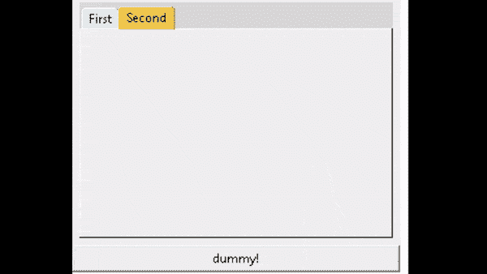

# Python Tkinter 笔记本小部件

> 原文：<https://pythonguides.com/python-tkinter-notebook/>

[](https://sharepointsky.teachable.com/p/python-and-machine-learning-training-course)

在这个 [Python Tkinter 教程](https://pythonguides.com/python-tkinter-stopwatch/)中，我们将学习如何**在 Python Tkinter** 中创建一个笔记本小部件，我们还将涵盖与 **Tkinter 笔记本**相关的不同示例。我们将讨论这些话题。

*   Python Tkinter 笔记本小部件
*   Python Tkinter 笔记本背景色
*   Python Tkinter 笔记本风格
*   Python Tkinter 笔记本标签大小
*   Python Tkinter 笔记本选择选项卡
*   Python Tkinter 笔记本禁用选项卡

目录

[](#)

*   [Python Tkinter 笔记本小工具](#Python_Tkinter_notebook_widget "Python Tkinter notebook widget")
*   [Python Tkinter 笔记本背景色](#Python_Tkinter_notebook_background-color "Python Tkinter notebook background-color")
*   [Python Tkinter 笔记本风格](#Python_Tkinter_notebook_style "Python Tkinter notebook style")
*   [Python Tkinter 笔记本标签大小](#Python_Tkinter_notebook_tab_size "Python Tkinter notebook tab size")
*   [Python Tkinter 笔记本选择标签](#Python_Tkinter_notebook_select_tab "Python Tkinter notebook select tab")
*   [Python Tkinter 笔记本禁用标签](#Python_Tkinter_notebook_disable_tab "Python Tkinter notebook disable tab")

## Python Tkinter 笔记本小工具

在这一节中，我们将学习如何在 [python Tkinter](https://pythonguides.com/python-gui-programming/) 中创建一个笔记本小部件。

众所周知，笔记本是一本有空白页的小书，如果我们愿意，我们可以在上面写任何东西。作为笔记本， **Tkinter 笔记本 widget** 的工作原理也是一样的。

笔记本小部件允许用户在应用程序窗口中创建选项卡。选项卡用于分隔工作空间。

**代码:**

在下面的代码中，我们创建了一个笔记本小部件，用户在其中创建了标签**“标签 1”**和**“标签 2”**，我们还为这些标签使用了框架。

*   **从 tkinter.ttk 导入笔记本**我们导入笔记本小部件。
*   `notebook.add()` 用于在笔记本中添加标签页。

```py
from tkinter import *
from tkinter.ttk import Notebook

ws = Tk()
ws.geometry('400x300')
ws.title('Python Guides Notebook')

notebook = Notebook(ws)
notebook.pack(pady=10, expand=True)

frame1 = Frame(notebook, width=400, height=280)
frame2 = Frame(notebook, width=400, height=280)

frame1.pack(fill='both', expand=True)
frame2.pack(fill='both', expand=True)

notebook.add(frame1, text='Tab 1')
notebook.add(frame2, text='Tab 2')

ws.mainloop() 
```

**输出:**

在下面的输出中，我们看到一个笔记本小部件创建了两个选项卡**“Tab 1”**和**“Tab 2”**。


Notebook widget Output

阅读 [Python Tkinter 菜单栏](https://pythonguides.com/python-tkinter-menu-bar/)

## Python Tkinter 笔记本背景色

在这一节中，我们将学习如何在 Python Tkinter 中**添加笔记本背景颜色。**

我们进口了**。ttk Notebook，style** library 为了在标签上创建背景色，我们使用几何图形来给出创建标签和应用样式的窗口的大小。

**代码:**

在下面的代码中，我们创建了笔记本小部件的背景色，这有助于制作一个多彩的图形用户界面。我们使用 `add()` 在笔记本中创建标签。

*   **style . theme _ use(' default ')**用于改变小工具的主题。
*   `note.add()` 用于在窗口内创建标签页。

```py
from tkinter import *
from tkinter.ttk import Notebook, Style

ws = Tk()

ws.geometry("700x350")

# Create an instance of ttk style
style = Style()
style.theme_use('default')
style.configure('TNotebook.Tab', background="Red")
style.map("TNotebook", background= [("selected", "red")])

# Create a Notebook widget
note =Notebook(ws)

# Add a frame for adding a new tab
frame1= Frame(note, width= 400, height=180)

# Adding the Tab Name
note.add(frame1, text= 'Tkinter-1')
frame2 = Frame(note, width= 400, height=180)
note.add(frame2, text= "Tkinter-2")

note.pack(expand= True, fill=BOTH, padx= 5, pady=5)
ws.mainloop() 
```

**输出:**

在下面的输出中，我们看到了 Notebook 小部件，其上的选项卡是用彩色背景创建的。


Background color Output

阅读 [Python Tkinter 计算器](https://pythonguides.com/make-a-calculator-in-python/)

## Python Tkinter 笔记本风格

在本节中，我们将学习如何在 Python Tkinter 中**添加笔记本样式。**

风格是指完成任务的对象或方法的设计。我们进口。ttk 笔记本，风格库给笔记本一个不同的风格，从我们的笔记本看起来很有吸引力。

**代码:**

在下面的代码中，我们**在小部件**中创建一个笔记本小部件，我们使用 `add()` 来创建选项卡，并赋予这些选项卡样式。

*   `style.theme_create()` 用于访问风格数据库。
*   `style.theme_use ()` 用于改变当前主题。
*   `notebook.add ()` 用于在小部件内部添加标签页。

```py
from tkinter import *
from tkinter.ttk import Notebook, Style

ws = Tk()

Mysky = "#DCF0F2"
Myyellow = "#F2C84B"

style = Style()

style.theme_create( "dummy", parent="alt", settings={
        "TNotebook": {"configure": {"tabmargins": [2, 5, 2, 0] } },
        "TNotebook.Tab": {
            "configure": {"padding": [5, 1], "background": Mysky },
            "map":       {"background": [("selected", Myyellow)],
                          "expand": [("selected", [1, 1, 1, 0])] } } } )

style.theme_use("dummy")

notebook = Notebook(ws)
frame1 = Frame(notebook, width=300, height=200)
notebook.add(frame1, text = 'First')
frame2 = Frame(notebook, width=300, height=200)
notebook.add(frame2, text = 'Second')
notebook.pack(expand=1, fill='both', padx=7, pady=7)

Button(ws, text='dummy!').pack(fill='x')

ws.mainloop()
```

**输出:**

在下面的输出中，我们看到在小部件选项卡中创建了一个笔记本小部件，我们在其上应用了样式主题。当我们点击标签时，标签的样式和颜色会改变。



Notebook Style Output

阅读 [Python Tkinter Checkbutton](https://pythonguides.com/python-tkinter-checkbutton/)

## Python Tkinter 笔记本标签大小

在这一节中，我们将学习如何在 Python Tkinter 中**改变笔记本标签的大小。**

大小被定义为一个物体有多大或多小。笔记本标签尺寸是指我们导入的标签尺寸**有多大或多小。ttk import Notebook，style** library 创建一个笔记本小部件，并赋予笔记本风格。

**代码:**

在下面的代码中，我们创建了一个笔记本小部件，在小部件中添加了选项卡，我们使用**高度和**宽度来改变选项卡的大小。

*   `width()` 用来改变标签页的宽度。
*   `Height()` 用来改变标签页的高度。

```py
from tkinter import *
from tkinter.ttk import Notebook, Style

ws= Tk()
style = Style()
style.theme_create( "MyStyle", parent="alt", settings={
        "TNotebook": {"configure": {"tabmargins": [2, 5, 2, 0] } },
        "TNotebook.Tab": {"configure": {"padding": [100, 100] },}})

style.theme_use("MyStyle")

notebook = Notebook(ws, width=250, height=250)
tab1 = Frame(notebook)
notebook.add(tab1, text = 'Welcome to tab one')
tab2 = Frame(notebook)
notebook.add(tab2, text = 'Welcome to tab two')
notebook.pack(expand=True, fill=BOTH)

Button(ws, text='Some Text!').pack(fill=X)

ws.mainloop()
```

**输出:**

在下面的输出中，我们看到添加了小部件选项卡内的一个笔记本小部件。当我们看到标签的尺寸太大而无法改变标签的尺寸时，我们调整了标签的高度和宽度。


Notebook Tab Size Output

阅读 [Python Tkinter 单选按钮](https://pythonguides.com/python-tkinter-radiobutton/)

## Python Tkinter 笔记本选择标签

在本节中，我们将学习**如何在 Python Tkinter 笔记本**中选择选项卡。

我们进口了**。ttk 导入笔记本**库来创建笔记本小部件。我们使用几何图形来给出创建选项卡的窗口的大小。我们将光标移到选项卡上，通过单击随机选择任意选项卡。

**代码:**

在下面的代码中，我们通过导入。ttk 导入 note `book` library 也导入时间来处理与时间相关的任务。

Button() :当我们将某个功能附加到一个按钮上时，它们会通过点击来自动调用。

```py
from tkinter import *
import time
from tkinter.ttk import Notebook

ws=Tk()

ws.config(width=330,height=250)

notebook=Notebook(ws)
notebook.place(x=0,y=0)

Tablist=[]
i=0
while i<6:    
     Tablist.append(Frame(ws))
     Tablist[i].config(width=330,height=200,background='white')
     i+=1

i=0
while i<6: 
    notebook.add(Tablist[i],text='tab'+str(i))
    i+=1

def LoopTabs():
    i=0
    while i<6:
         notebook.select(i)
         time.sleep(2)
         i+=1

button=Button(ws,text='Click here',command=LoopTabs)
button.place(x=20,y=180)
ws.mainloop() 
```

**输出:**

在下面的输出中，我们看到在用户单击 tab1 时放置的小部件选项卡内创建了一个笔记本小部件。如果用户点击下一个标签“Tab2”，我们将进一步移动。Tab2 标签被选中。


Notebook select tab Output

读取 [Python Tkinter 退出程序](https://pythonguides.com/python-tkinter-exit-program/)

## Python Tkinter 笔记本禁用标签

在本节中，我们将学习 Python Tkinter 中的**笔记本禁用标签。**

在学习笔记本禁用标签之前，我们应该有一些关于禁用的知识。残疾意味着不能工作。

在 Python Tkinter 笔记本禁用选项卡中，我们在笔记本中创建了一个笔记本，并添加了两个选项卡。如果第一个标签是禁用的，他们会移动到下一个标签。

**代码:**

在下面的代码中，我们导入了一些库**。ttk 导入笔记本，Style** 用于创建笔记本，Style 用于赋予我们的笔记本一些风格。

*   `Style.layout` 用于禁用第一个标签页。
*   `text.insert()` 用于在笔记本中插入一些文字。
*   `note.add()` 用于在笔记本中添加框架。

```py
from tkinter import *
from tkinter.ttk import Notebook, Style

ws = Tk()

style = Style()

style.layout('TNotebook.Tab', []) # turn off tabs

note = Notebook(ws)

frame1 = Frame(note)
text = Text(frame1, width=40, height=10)
text.insert('end', 'page0 : a text widget')
text.pack(expand=1, fill='both')
note.add(frame1)

frame2 = Frame(note)
lablel = Label(frame2, text='page1 : a label')
lablel.pack(expand=1, fill='both')
note.add(frame2)

note.pack(expand=1, fill='both', padx=5, pady=5)

def Do_Something():
    note.select(1)

ws.after(3000, Do_Something)
ws.mainloop() 
```

**输出:**

在下面的输出中，我们可以看到**第 0 页**和**第 1 页**当我们将光标移到第 0 页时，它们被禁用并移到下一页第 1 页。


Notebook disable tab Output

您可能会喜欢以下 Python Tkinter 教程:

*   [Python Tkinter TreeView](https://pythonguides.com/python-tkinter-treeview/)
*   [Python Tkinter 通断开关](https://pythonguides.com/python-tkinter-on-off-switch/)
*   [Python Tkinter 待办事项列表](https://pythonguides.com/python-tkinter-todo-list/)
*   [Python Tkinter 窗口大小](https://pythonguides.com/python-tkinter-window-size/)
*   [Python Tkinter 画布教程](https://pythonguides.com/python-tkinter-canvas/)
*   [Python Tkinter 进度条小工具](https://pythonguides.com/python-tkinter-progress-bar/)

在本教程中，我们讨论了`Python Tkinter Notebook widget`，我们还介绍了不同的例子。这是我们已经讨论过的例子列表。

*   Python Tkinter 笔记本小部件
*   Python Tkinter 笔记本背景色
*   Python Tkinter 笔记本风格
*   Python Tkinter 笔记本标签大小
*   Python Tkinter 笔记本选择选项卡
*   Python Tkinter 笔记本禁用选项卡

[Bijay Kumar](https://pythonguides.com/author/fewlines4biju/)

Python 是美国最流行的语言之一。我从事 Python 工作已经有很长时间了，我在与 Tkinter、Pandas、NumPy、Turtle、Django、Matplotlib、Tensorflow、Scipy、Scikit-Learn 等各种库合作方面拥有专业知识。我有与美国、加拿大、英国、澳大利亚、新西兰等国家的各种客户合作的经验。查看我的个人资料。

[enjoysharepoint.com/](https://enjoysharepoint.com/)[](https://www.facebook.com/fewlines4biju "Facebook")[](https://www.linkedin.com/in/fewlines4biju/ "Linkedin")[](https://twitter.com/fewlines4biju "Twitter")