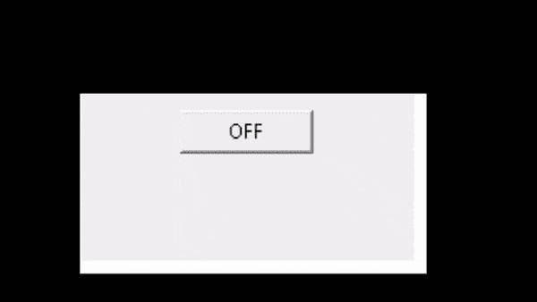
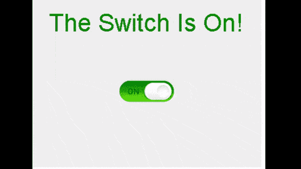
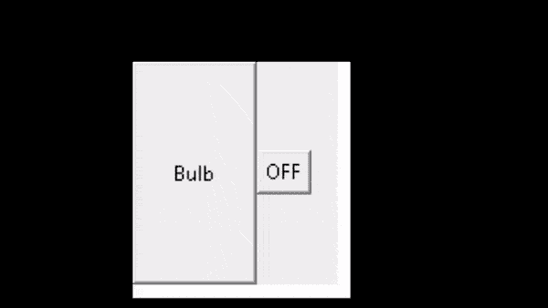

# Python Tkinter 开关

> 原文：<https://pythonguides.com/python-tkinter-on-off-switch/>

[](https://sharepointsky.teachable.com/p/python-and-machine-learning-training-course)

在这个 [Python Tkinter 教程](https://pythonguides.com/python-gui-programming/)中，我们将学习**如何创建 Python Tkinter 通断开关**，我们还将涵盖与通断开关相关的不同示例。而且，我们将涵盖这些主题

*   Python Tkinter 简单切换开关
*   Python Tkinter 开关滑动开关
*   使用按钮打开/关闭 Python Tkinter

目录

[](#)

*   [Python Tkinter 简单拨动开关](#Python_Tkinter_simple_toggle_switch "Python Tkinter simple toggle switch")
*   [Python Tkinter 开关滑动开关](#Python_Tkinter_on-off_slide_switch "Python Tkinter on-off slide switch")
*   [使用按钮](#Python_Tkinter_on-off_using_Push_button "Python Tkinter on-off  using Push  button")开启/关闭 Python Tkinter

## Python Tkinter 简单拨动开关

在本教程中，我们将学习如何在 Python Tkinter 中**创建一个简单的拨动开关。**

开关是用来接通电路的。我们在这里使用开关作为一种功能，我们可以在任何游戏应用程序或任何类似的应用程序中使用它来打开或关闭该功能。

**代码:**

在下面的代码中，我们导入 tkinter 库**将 Tkinter 作为 tk** 导入，还创建了一个小部件，在其中我们使用了一个简单的切换开关。这里的拨动开关就像我们日常生活中用来打开房间灯的普通开关一样。

**按钮()**用作普通拨动开关，开启或关闭该功能。

```py
from tkinter import *

def Simpletoggle():

    if toggle_button.config('text')[-1] == 'ON':
        toggle_button.config(text='OFF')
    else:
        toggle_button.config(text='ON')

ws = Tk()
ws.title("Python Guides")
ws.geometry("200x100")

toggle_button = Button(text="OFF", width=10, command=Simpletoggle)
toggle_button.pack(pady=10)

ws.mainloop()
```

**输出:**

运行下面的代码后，我们得到下面的输出，其中我们看到当我们单击它们时，切换开关将打开。当我们再次点击它们时，拨动开关就会关闭。



Simple Toddle Switch Output

阅读: [Python Tkinter 事件](https://pythonguides.com/python-tkinter-events/)

## Python Tkinter 开关滑动开关

在本节中，我们将学习如何在 Python Tkinter 中**创建开关滑动开关。**

我们正在寻找技术，因为它一天比一天好，体力工作已经被人工智能/人工智能取代。我们制作的开关滑动开关同样可以用于具有物联网嵌入式应用的移动应用。打开灯、灯泡、风扇、照相机、空调等。

**代码:**

在下面的代码中，我们创建了一个小部件，其中放置了一个开关滑动开关。我们使用标签、按钮，并添加照片图像来展示开关按钮的工作原理。

*   `Label()` 用于显示文本或图像的字段。
*   **按钮()**用作开启或关闭该功能的普通开关。
*   `Photoimage()` 用于在 widget 中添加图片。

```py
 from tkinter import *

ws = Tk()

ws.title('Python Guides')

ws.geometry("400x300")

#global is_on
is_on = True

label = Label(ws, 
    text = "The Switch Is On!", 
    fg = "green", 
    font = ("Helvetica", 32))

label.pack(pady = 20)

def Switch():
    global is_on

    if is_on:
        button.config(image = off)
        label.config(text = "Switch is Off", 
                        fg = "grey")
        is_on = False
    else:

        button.config(image = on)
        label.config(text = "Switch is On", fg = "green")
        is_on = True

on = PhotoImage(file = "on.png")
off = PhotoImage(file = "off.png")

button = Button(ws, image = on, bd = 0,
                   command = Switch)
button.pack(pady = 50)

ws.mainloop() 
```

**输出:**

在下面的输出中，我们看到如果用户滑动右边的开关，开关会自动打开。另一方面，用户滑动左侧开关，开关自动关闭。



On-Off slide switch Output

阅读: [Python Tkinter 笔记本 Widget](https://pythonguides.com/python-tkinter-notebook/)

## 使用按钮开启/关闭 Python Tkinter

在本节中，我们将学习如何在 Python Tkinter 中**创建一个开关按钮。**

我们在这里使用**开关按钮**作为我们可以在任何游戏应用程序或任何类似应用程序中打开或关闭该功能的功能。这里的按钮就像一个普通的开关一样工作，我们在日常生活中使用它来打开房子的灯。

**代码:**

在下面的代码中，我们使用 `def convert()` 来定义函数，并使用 `state` 方法来禁用或启用连接。

**按钮()**用作开启或关闭该功能的普通开关。

```py
from tkinter import *
ws = Tk()
ws.title("Python Guides")

def convert():
    if(a1['state']==NORMAL):
        a1["state"] = DISABLED
        a2["text"]="ON"
    elif (a1['state']==DISABLED):
        a1["state"]=NORMAL
        a2["text"]="OFF"

a1=Button(ws, text="Bulb")
a1.config(height = 8, width = 9)
a1.grid(row=0, column=0)    
a2 = Button(text="OFF", command=convert)
a2.grid(row=0,column=1)
ws.mainloop()
```

**输出:**

在上面的代码中，首先，我们创建了一个按钮对象“a1 ”,然后，我们使用 IF 语句来检查按钮的状态。最后，我们使用状态来改变按钮的行为，以获得想要的结果。

运行下面的代码后，我们得到下面的输出，其中我们看到当我们单击它们时，按钮将是 `ON` 。当我们再次点击它们时，按钮会让**离开**。



On-Off Pushbutton Output

你可能也喜欢阅读下面的 `Tkinter` 教程。

*   [Python Tkinter 动画](https://pythonguides.com/python-tkinter-animation/)
*   [Python Tkinter 保存文本到文件](https://pythonguides.com/python-tkinter-save-text-to-file/)
*   [Python Tkinter 多窗口教程](https://pythonguides.com/python-tkinter-multiple-windows-tutorial/)
*   [Python Tkinter 编辑器+示例](https://pythonguides.com/python-tkinter-editor/)
*   [Python Tkinter 表教程](https://pythonguides.com/python-tkinter-table-tutorial/)
*   [Python Tkinter 测验](https://pythonguides.com/python-tkinter-quiz/)
*   [Python Tkinter Image](https://pythonguides.com/python-tkinter-image/)
*   [Python Tkinter 搜索框](https://pythonguides.com/python-tkinter-search-box/)

因此，在本教程中，我们讨论了 **Python Tkinter On-Off 开关**，并且我们还涵盖了不同的例子。这是我们已经讨论过的例子列表。

*   Python Tkinter 简单切换
*   Python Tkinter 开关滑动开关
*   使用按钮打开/关闭 Python Tkinter

[Bijay Kumar](https://pythonguides.com/author/fewlines4biju/)

Python 是美国最流行的语言之一。我从事 Python 工作已经有很长时间了，我在与 Tkinter、Pandas、NumPy、Turtle、Django、Matplotlib、Tensorflow、Scipy、Scikit-Learn 等各种库合作方面拥有专业知识。我有与美国、加拿大、英国、澳大利亚、新西兰等国家的各种客户合作的经验。查看我的个人资料。

[enjoysharepoint.com/](https://enjoysharepoint.com/)[](https://www.facebook.com/fewlines4biju "Facebook")[](https://www.linkedin.com/in/fewlines4biju/ "Linkedin")[](https://twitter.com/fewlines4biju "Twitter")