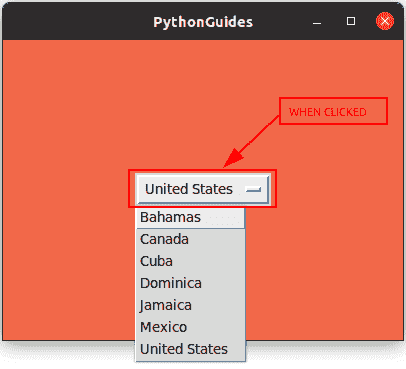
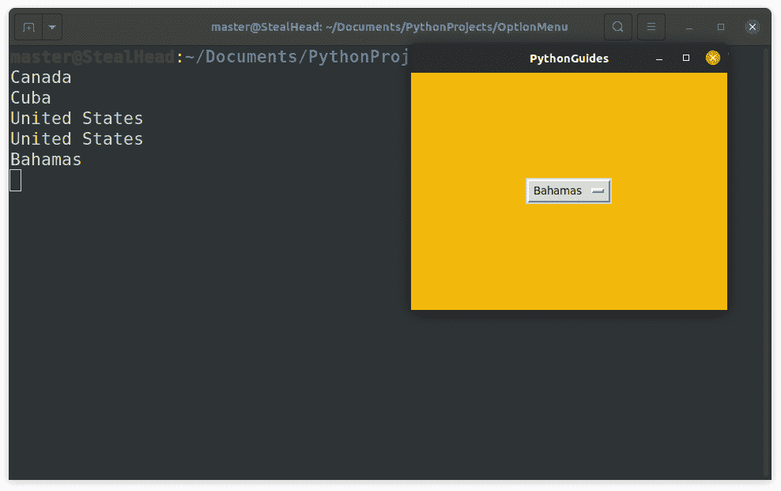
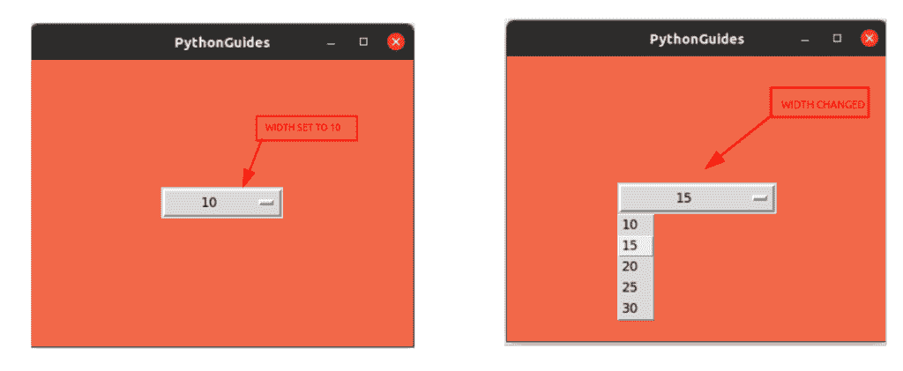
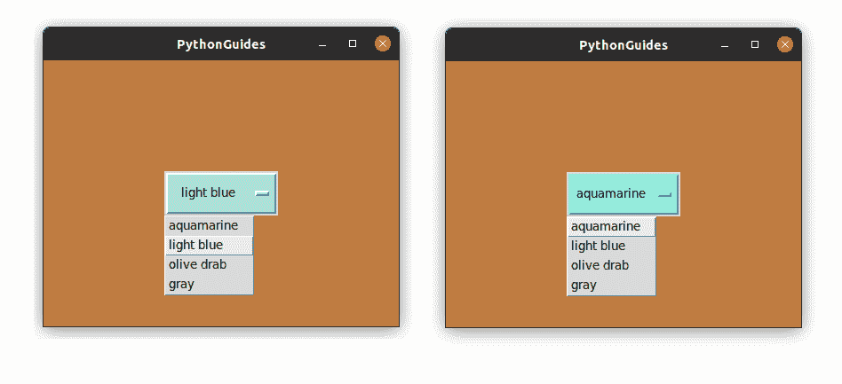
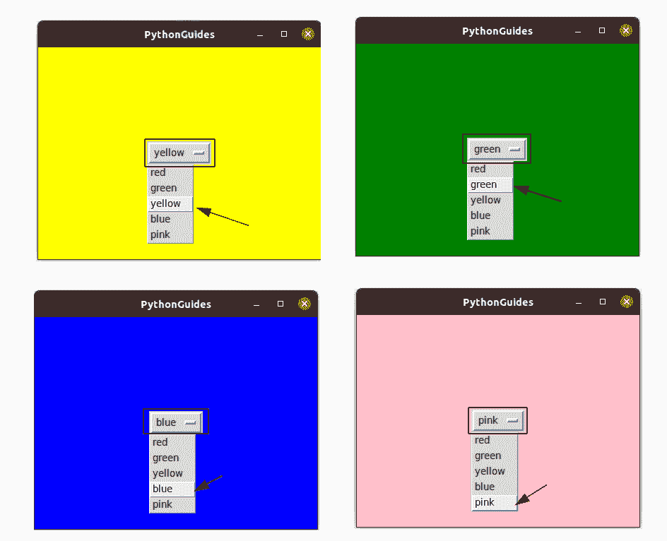
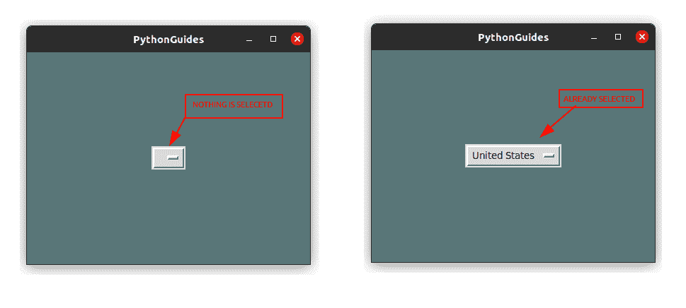
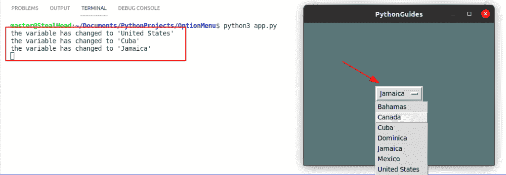
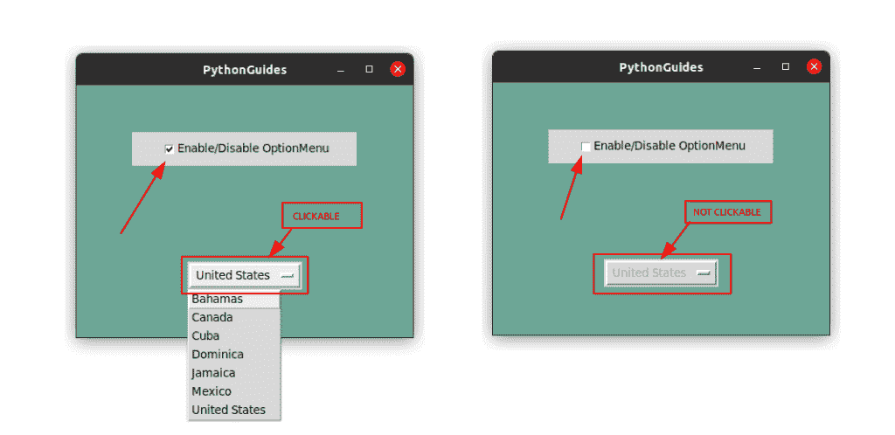

# Python Tkinter 选项菜单[完整教程]

> 原文：<https://pythonguides.com/python-tkinter-optionmenu/>

[](https://sharepointsky.teachable.com/p/python-and-machine-learning-training-course)

在这个 [Python 教程](https://pythonguides.com/learn-python/)中，我们将学习关于 `Python Tkinter OptionMenu` 小部件的一切。OptionMenu 小工具也称为下拉菜单或组合框。我们将通过例子学习所有的方法。此外，我们将涵盖这些主题。

*   python tkinter option menu documentation(python tkinter option 菜单文档)
*   Python Tkinter 选项菜单获取值
*   Python Tkinter 选项菜单宽度
*   Python Tkinter 选项菜单样式
*   Python Tkinter 选项菜单命令
*   Python Tkinter 选项集值
*   Python Tkinter 选项菜单更改事件
*   Python Tkinter 选项菜单禁用
*   Python Tkinter 选项菜单追踪
*   Python Tkinter 选项菜单颜色

目录

[](#)

*   [Python Tkinter 选项菜单](#Python_Tkinter_OptionMenu "Python Tkinter OptionMenu")
*   [Python Tkinter OptionMenu 获取值](#Python_Tkinter_OptionMenu_get_value "Python Tkinter OptionMenu get value")
*   [Python Tkinter 选项菜单宽度](#Python_Tkinter_OptionMenu_width "Python Tkinter OptionMenu width")
*   [Python Tkinter 选项菜单样式](#Python_Tkinter_OptionMenu_style "Python Tkinter OptionMenu style")
*   [Python Tkinter OptionMenu 命令](#Python_Tkinter_OptionMenu_command "Python Tkinter OptionMenu command")
*   [Python Tkinter 选项设置值](#Python_Tkinter_Option_set_value "Python Tkinter Option set value")
*   [Python Tkinter OptionMenu 更改事件](#Python_Tkinter_OptionMenu_change_event "Python Tkinter OptionMenu change event")
*   [Python Tkinter 选项菜单禁用](#Python_Tkinter_OptionMenu_disable "Python Tkinter OptionMenu disable")
*   [Python Tkinter option menu trace](#Python_Tkinter_OptionMenu_trace "Python Tkinter OptionMenu trace")
*   [Python Tkinter 选项菜单颜色](#Python_Tkinter_OptionMenu_color "Python Tkinter OptionMenu color")

## Python Tkinter 选项菜单

*   Python Tkinter 中的 **OptionMenu 用于在应用程序中创建下拉菜单。**
*   它占用更少的空间，并向用户显示多个选项。用户只能从项目列表中选择一个项目。
*   OptionMenu 的唯一缺点是它不能处理大数据。因为下拉菜单受限于屏幕的大小。因此，在大数据的情况下，使用 Listbox 是因为它提供了滚动功能。
*   下面是 Python Tkinter 中 OptionMenu 的语法

```py
OptionMenu(
    master, 
    variable, 
    value, 
    *values, 
    **kwargs
    )
```

*   `master` 是您想要放置 OptionMenu 的窗口。它可以是主窗口、次窗口或框架。
*   **变量**表示小工具的值不是固定的，它会不断变化。该变量可以在以下情况下实现:
    *   `string var()`–保存一个字符串；预设值""
    *   `int var()`–保存整数；默认值为 0
    *   `double var()`–保存浮点值；默认值为 0.0
    *   `boolean var()`–保存布尔值，返回 0 表示假，返回 1 表示真
*   **值**取决于变量的类型，如果变量是 StringVar()，那么该值将是任何名称或字符集。
*   ***值**是我们存储所有选项的列表的名称。
*   要查看完整的文档，请运行下面的代码。

```py
from tkinter import *

help(OptionMenu) 
```

这是 OptionMenu 的预览图。这是一个显示多个选项的下拉菜单，用户可以选择他/她的选择。



Preview of OptionMenu Widget

使用 Tkinter 阅读 Python 中的[注册表](https://pythonguides.com/registration-form-in-python-using-tkinter/)

## Python Tkinter OptionMenu 获取值

*   在本节中，我们将学习如何获取用户在 `Python Tkinter OptionMenu` 中选择的值。
*   OptionMenu 显示多个选项，但用户只能选择一个。因此，为了知道用户选择的选项，我们使用了 `get()` 方法。
*   `get()` 应用于分配给 OptionMenu 的变量，并返回 OptionMenu 中当前选中的选项。

**Python Tkinter 中 get()方法示例:**

在这个例子中， `get()` 方法用于在 Python Tkinter 中提取存储在 OptionMenu 中的信息。这里我们提到了使用 `get()` 方法的确切代码，我们还基于 `get()` 方法创建了一个完整的程序。

```py
 def display_selected(choice):
    choice = variable.get()
    print(choice)
```

下面是用 python tkinter 实现 get()方法的完整程序代码。

```py
from tkinter import *

ws = Tk()
ws.title('PythonGuides')
ws.geometry('400x300')
ws.config(bg='#F2B90C')

def display_selected(choice):
    choice = variable.get()
    print(choice)

countries = ['Bahamas','Canada', 'Cuba','United States']

# setting variable for Integers
variable = StringVar()
variable.set(countries[3])

# creating widget
dropdown = OptionMenu(
    ws,
    variable,
    *countries,
    command=display_selected
)

# positioning widget
dropdown.pack(expand=True)

# infinite loop 
ws.mainloop() 
```

**输出:**

在此输出中，无论在 OptionMenu 中选择了什么选项，都会显示在终端上。



Python Tkinter OptionMenu example

这就是**如何在 Python Tkinter OptionMenu** 中获取值。

阅读:[从 PDF Python 中提取文本](https://pythonguides.com/extract-text-from-pdf-python/)

## Python Tkinter 选项菜单宽度

*   在本节中，我们将学习如何控制 `Python Tkinter OptionMenu` 的宽度。
*   Width 是小部件左右两边的空间&根据应用程序的需要调整它是很重要的，因为它给应用程序带来了更好的外观。
*   使用 OptionMenu 小工具中的**宽度**选项，我们可以改变宽度。OptionMenu】不直接接受**宽度**的，所以你必须使用**配置**方法。

`Python Tkinter`中的选项菜单宽度示例

这是一个我们如何在 Python Tkinter 中改变 **OptionMenu 宽度的例子。在这段代码中，我们创建了一个函数来改变 OptionMenu 的宽度大小。用户可以从选项中选择尺寸，选项菜单将变成该尺寸。**

```py
from tkinter import *

ws = Tk()
ws.title('PythonGuides')
ws.geometry('400x300')
ws.config(bg='#F26849')

def change_width(choice):
    choice = variable.get()
    dropdown.config(width=choice)

# width choices available.
width_size = [10, 15, 20, 25, 30]

# setting variable for Integers
variable = IntVar()

# creating widget
dropdown = OptionMenu(
    ws,
    variable,
    *width_size,
    command=change_width
)
# positioning widget
dropdown.pack(expand=True)

# infinite loop 
ws.mainloop() 
```

**输出:**

在此输出中，显示了两张图片。左图的宽度设置为 10，当该值从 10 变为 15 时，选项菜单的宽度也会在右图中增加。



Python Tkinter OptionMenu width

阅读:[使用 Python Tkinter 的身体质量指数计算器](https://pythonguides.com/bmi-calculator-using-python-tkinter/)

## Python Tkinter 选项菜单样式

*   在这一节中，我们将学习如何在 Python Tkinter 中的 OptionMenu 上应用**样式**。
*   Style 是颜色、字体、宽度和其他组件，用于改善 Python Tkinter 中 OptionMenu 的外观和感觉。

**Python Tkinter 中的 OptionMenu 样式示例:**

*   在这个输出中，我们增加了 Python 中 OptionMenu 的宽度并提供了颜色。可以通过在 Python Tkinter 中更改 OptionMenu 中的选项来更改颜色。
*   下面是用于在 Python Tkinter 中更改 OptionMenu 的高度、宽度和颜色的确切代码。在这段代码中，下拉列表是分配给 OptionMenu 的变量。

```py
dropdown.config(width=10)
dropdown.config(height=2)
dropdown.config(bg='light blue')
```

下面是为实现 Python Tkinter 中 OptionMenu 中的样式选项而创建的程序的完整代码。

```py
from tkinter import *

ws = Tk()
ws.title('PythonGuides')
ws.geometry('400x300')
ws.config(bg='#BF7C41')

def change_color(choice):
    choice = variable.get()
    dropdown.config(bg=choice)

# color choices available.
color_list = ['aquamarine', 'light blue', 'olive drab', 'gray']

# setting variable for Integers
variable = StringVar()
variable.set(color_list[1])

# creating widget
dropdown = OptionMenu(
    ws,
    variable,
    *color_list,
    command=change_color
)
dropdown.config(width=10)
dropdown.config(height=2)
dropdown.config(bg='light blue')

# positioning widget
dropdown.pack(expand=True)

# infinite loop 
ws.mainloop() 
```

**输出:**

在这个输出中，OptionMenu 的颜色随着选项的变化而变化。此外，应用于它的高度和宽度给整个应用程序带来了良好的外观。



Python Tkinter OptionMenu style

阅读: [Python Tkinter 标题](https://pythonguides.com/python-tkinter-title/)

## Python Tkinter OptionMenu 命令

*   在本节中，我们将学习 **Python Tkinter OptionMenu 命令**的需求和用法。
*   一个**命令**用于将一个回调函数分配给选项菜单。如果在 OptionMenu 中选择了一个特定的选项，它允许您触发一个功能。

**Python Tkinter 中的 OptionMenu 命令示例:**

在本例中，用户可以从 OptionMenu 中选择应用程序颜色。窗口背景将被更改为选定的颜色。

```py
from tkinter import *

ws = Tk()
ws.title('PythonGuides')
ws.geometry('400x300')
ws.config(bg='#F26849')

def change_color(choice):
    choice = variable.get()
    ws.config(bg=choice)

# color choices available.
color_list = ['red', 'green', 'yellow', 'blue', 'pink']

# setting variable for Integers
variable = StringVar()

# creating widget
dropdown = OptionMenu(
    ws,
    variable,
    *color_list,
    command=change_color
)
# positioning widget
dropdown.pack(expand=True)

# infinite loop 
ws.mainloop() 
```

**输出:**

下面是上面代码的输出，你可以看到窗口的颜色可以通过在 Python Tkinter 的 OptionMenu 中选择任意颜色来改变。



Python Tkinter OptionMenu command

阅读:[使用 Tkinter 中 pyqrcode 的 Python QR 码生成器](https://pythonguides.com/python-qr-code-generator/)

## Python Tkinter 选项设置值

*   Python Tkinter OptionMenu 提供了一个方法集()，允许在 OptionMenu 中设置默认值。
*   `set()` 方法可以应用在变量上，它需要列表中您想要显示为默认值的项目。

**带设定值选项的 OptionMenu 命令示例。:**

在本例中，我们将默认国家设置为“美国”。因此，如果用户不选择任何选项，则 OptionMenu 中的默认值将为美国。

```py
from tkinter import *

ws = Tk()
ws.title('PythonGuides')
ws.geometry('400x300')
ws.config(bg='#597678')

# choices available with user.
countries = ['Bahamas','Canada', 'Cuba', 'Dominica', 'Jamaica', 'Mexico', 'United States']

# setting variable for strings
variable = StringVar()

# set default country as United States
variable.set(countries[6])

#  creating widget
dropdown = OptionMenu(
    ws,
    variable,
    *countries
)
# positioning widget
dropdown.pack(expand=True)

# infinite loop 
ws.mainloop() 
```

**输出:**

在此输出中，左边的图片显示了没有指定默认值时的 OptionMenu，而右边的图片显示了自动选择的“美国”。所以是用 Python Tkinter 中的 set()方法完成的。



with and without default value set

阅读:[如何在 Python Tkinter 中设置背景为图像](https://pythonguides.com/set-background-to-be-an-image-in-python-tkinter/)

## Python Tkinter OptionMenu 更改事件

事件是为响应所执行的活动而发生的更改。在 OptionMenu 中，每次选项改变时都被称为一个事件。使用变量，我们可以获得有关发生变化的信息。

**Python Tkinter 中 OptionMenu 更改事件示例:**

在本例中，终端上将显示更改。下面提到的代码负责报告所有变化的事件。

```py
def check(*args):
    print(f"the variable has changed to '{variable.get()}'")

variable = StringVar(value='United States')
variable.trace('w', check)
```

下面是用 Python Tkinter 显示已更改事件日志的程序的完整代码。

```py
from tkinter import *

ws = Tk()
ws.title('PythonGuides')
ws.geometry('400x300')
ws.config(bg='#597678')

def check(*args):
    print(f"the variable has changed to '{variable.get()}'")

variable = StringVar(value='United States')
variable.trace('w', check)

# choices available with user.
countries = ['Bahamas','Canada', 'Cuba', 'Dominica', 'Jamaica', 'Mexico', 'United States']

# set default country as United States
variable.set(countries[6])

#  creating widget
dropdown = OptionMenu(
    ws,
    variable,
    *countries
)
# positioning widget
dropdown.pack(expand=True)

# infinite loop 
ws.mainloop() 
```

**输出:**

在这个输出中，每次 OptionMenu 中的选项被更改时，终端屏幕上都会报告一条消息。



Python Tkinter OptionMenu change event

阅读: [Python Tkinter 在文本框中显示数据](https://pythonguides.com/python-tkinter-to-display-data-in-textboxes/)

## Python Tkinter 选项菜单禁用

*   Python Tkinter OptionMenu 提供了一个方法 `state` ，使用该方法 OptionMenu 可以**灰显**。一旦变灰，OptionMenu 的所有功能都被禁用。单击时不会发生任何变化，也不会显示下拉列表。
*   **状态**提供了两个选项:
    *   `disabled`–它禁用 Python Tkinter 中的 OptionMenu 小部件。
    *   `normal`–它启用 Python Tkinter 中的 OptionMenu 小部件

**Python Tkinter 中的 OptionMenu 禁用示例:**

在本例中，我们创建了一个复选框并设置了规则，如果复选框被选中，则 OptionMenu 处于正常状态，如果复选框未被选中或取消选中，则 OptionMenu 将变为禁用状态。

这个函数负责 Python Tkinter 中 OptionMenu 小部件的状态变化。

```py
def changeState():
    if checkVar.get() == 1:
        dropdown.configure(state='normal')
    else:
        dropdown.configure(state='disabled')
```

这是该程序的完整代码。

```py
from tkinter import *

ws = Tk()
ws.title('PythonGuides')
ws.geometry('400x300')
ws.config(bg='#393C73')

def changeState():
    if checkVar.get() == 1:
        dropdown.configure(state='normal')
    else:
        dropdown.configure(state='disabled')

variable = StringVar()
checkVar = IntVar()

checkVar.set(1)

# checkbutton widget
cb = Checkbutton(
    ws, 
    text = "Enable/Disable OptionMenu", 
    variable = checkVar,
    onvalue = 1, 
    offvalue = 0, 
    height=2,
    width=30,
    command=changeState
    )
cb.pack(expand=True)

# choices available with user.
countries = ['Bahamas','Canada', 'Cuba', 'Dominica', 'Jamaica', 'Mexico', 'United States']

# set default country as United States
variable.set(countries[6])

#  creating widget
dropdown = OptionMenu(
    ws,
    variable,
    *countries
)
# positioning widget
dropdown.pack(expand=True)

# infinite loop 
ws.mainloop() 
```

**输出:**

在输出中，左侧图片中的复选框处于选中状态，用户可以单击并操作 Python Tkinter 中的 OptionMenu 小部件。但是在右图中，复选框被禁用，现在选项菜单是灰色的。再次选择复选框，使 OptionMenu 返回工作状态。



Disable OptionMenu

阅读:[如何使用 Python Tkinter 创建倒计时器](https://pythonguides.com/create-countdown-timer-using-python-tkinter/)

## Python Tkinter option menu trace

`Trace` 类似于 change event 部分，Trace 简单来说就是跟踪 Python Tkinter 中 OptionMenu 小部件发生的变化。

**Python Tkinter 中 OptionMenu 更改事件示例:**

在本例中，终端上将显示更改。下面提到的代码负责跟踪和报告 Python Tkinter 中 OptionMenu 小部件发生的所有变化。

```py
def check(*args):
    print(f"the variable has changed to '{variable.get()}'")

variable = StringVar(value='United States')
variable.trace('w', check)
```

下面是在 Python Tkinter 的 OptionMenu 小部件中实现 trace 的完整代码。

```py
from tkinter import *

ws = Tk()
ws.title('PythonGuides')
ws.geometry('400x300')
ws.config(bg='#597678')

def check(*args):
    print(f"the variable has changed to '{variable.get()}'")

variable = StringVar(value='United States')
variable.trace('w', check)

# choices available with user.
countries = ['Bahamas','Canada', 'Cuba', 'Dominica', 'Jamaica', 'Mexico', 'United States']

# set default country as United States
variable.set(countries[6])

#  creating widget
dropdown = OptionMenu(
    ws,
    variable,
    *countries
)
# positioning widget
dropdown.pack(expand=True)

# infinite loop 
ws.mainloop() 
```

**输出:**

在这个输出中，每次 OptionMenu 中的选项被更改时，终端屏幕上都会报告一条消息。


Python Tkinter OptionMenu trace

## Python Tkinter 选项菜单颜色

在这一节中，我们将看到如何在 Python Tkinter 中的 OptionMenu 上应用颜色。应用颜色是小部件样式的一部分。

**Python Tkinter 中的 OptionMenu 颜色示例:**

在本例中，可以通过在 Python Tkinter 中更改 OptionMenu 小部件的选项来更改 OptionMenu 小部件的颜色。

```py
from tkinter import *

ws = Tk()
ws.title('PythonGuides')
ws.geometry('400x300')
ws.config(bg='#BF7C41')

def change_color(choice):
    choice = variable.get()
    dropdown.config(bg=choice)

# color choices available.
color_list = ['aquamarine', 'light blue', 'olive drab', 'gray']

# setting variable for Integers
variable = StringVar()
variable.set(color_list[1])

# creating widget
dropdown = OptionMenu(
    ws,
    variable,
    *color_list,
    command=change_color
)
dropdown.config(width=10)
dropdown.config(height=2)
dropdown.config(bg='light blue')

# positioning widget
dropdown.pack(expand=True)

# infinite loop 
ws.mainloop() 
```

**输出:**

在这个输出中，OptionMenu 的颜色随着选项的变化而变化。此外，应用于它的高度和宽度给整个应用程序带来了良好的外观。


Python Tkinter OptionMenu color

您可能喜欢:

*   [用 Python Tkinter 上传文件](https://pythonguides.com/upload-a-file-in-python-tkinter/)
*   [Python Tkinter 拖拽](https://pythonguides.com/python-tkinter-drag-and-drop/)
*   [Python Tkinter Map()函数](https://pythonguides.com/python-tkinter-map-function/)
*   [Python Tkinter Grid](https://pythonguides.com/python-tkinter-grid/)

在本教程中，我们已经学习了 Python Tkinter 中关于 **OptionMenu 小部件的一切。此外，我们已经讨论了这些主题。**

*   Python Tkinter 选项菜单
*   Python Tkinter 选项菜单获取值
*   Python Tkinter 选项菜单宽度
*   Python Tkinter 选项菜单样式
*   Python Tkinter 选项菜单命令
*   Python Tkinter 选项菜单样式
*   Python Tkinter 选项集值
*   Python Tkinter 选项菜单更改事件
*   Python Tkinter 选项菜单禁用
*   Python Tkinter 选项菜单追踪
*   Python Tkinter 选项菜单颜色
*   python tkinter option menu documentation(python tkinter option 菜单文档)

[Bijay Kumar](https://pythonguides.com/author/fewlines4biju/)

Python 是美国最流行的语言之一。我从事 Python 工作已经有很长时间了，我在与 Tkinter、Pandas、NumPy、Turtle、Django、Matplotlib、Tensorflow、Scipy、Scikit-Learn 等各种库合作方面拥有专业知识。我有与美国、加拿大、英国、澳大利亚、新西兰等国家的各种客户合作的经验。查看我的个人资料。

[enjoysharepoint.com/](https://enjoysharepoint.com/)[](https://www.facebook.com/fewlines4biju "Facebook")[](https://www.linkedin.com/in/fewlines4biju/ "Linkedin")[](https://twitter.com/fewlines4biju "Twitter")