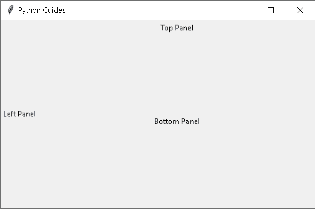
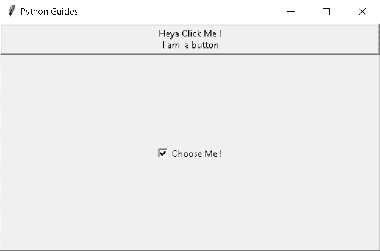
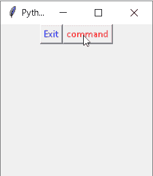
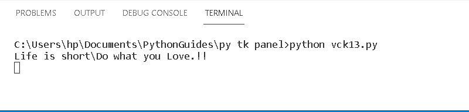
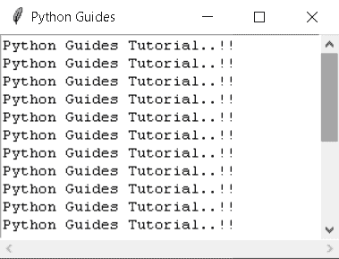

# Python Tkinter 面板

> 原文：<https://pythonguides.com/python-tkinter-panel/>

[](https://sharepointsky.teachable.com/p/python-and-machine-learning-training-course)

在本教程中，我们将学习如何在 Python Tkinter 中创建面板，我们还将介绍与 Tkinter 面板相关的不同示例。我们也将讨论这些话题。

*   Python Tkinter 面板
*   Python Tkinter 添加面板
*   Python Tkinter 按钮面板
*   Python Tkinter 滚动面板

目录

[](#)

*   [Python Tkinter 面板](#Python_Tkinter_panel "Python Tkinter panel")
*   [Python Tkinter 添加面板](#Python_Tkinter_add_a_panel "Python Tkinter add a panel")
*   [Python Tkinter 按钮面板](#Python_Tkinter_button_panel "Python Tkinter button panel")
*   [Python Tkinter 滚动面板](#Python_Tkinter_scroll_panel "Python Tkinter scroll panel")

## Python Tkinter 面板

在本节中，我们将学习如何在 [Python Tkinter](https://pythonguides.com/python-gui-programming/) 中创建面板。

面板的行为就像一个容器，它包含几个窗格作为子部件，并垂直或水平排列。用户可以调整子部件的大小，每个窗格都包含一个部件。

**语法:**

```py
p1 = PanedWindow(master,options)
```

`master` 作为父 widget 使用。

**代码:**

在下面的代码中，我们看到用 `orient= vertical` 创建了一个窗格窗口。在窗格窗口中，我们创建了一些标签。

如果用户将子控件从上到下放置，则 `orient` 被设置为 `vertical` 。如果**方向**被设置为**水平**，那么子部件被并排放置。

```py
from tkinter import *

ws=Tk()
ws.title("Python Guides")
ws.geometry("500x300")

p1 = PanedWindow()
p1.pack(fill=BOTH, expand=1)

left = Label(p1, text="Left Panel")
p1.add(left)

p2 = PanedWindow(p1, orient=VERTICAL)
p1.add(p2)

top = Label(p2, text="Top Panel")
p2.add(top)

bottom = Label(p2, text="Bottom Panel")
p2.add(bottom)

ws.mainloop()
```

**输出:**

运行上面的代码后，我们得到了下面的输出，我们可以看到一个窗格化的窗口被创建了，在这个窗口中有一个子窗口。当我们设置 **PanedWindow(p1，orient=VERTICAL)** 时，我们希望从上到下放置子窗口。



Python Tkinter Panel Output

阅读: [Python Tkinter 条目](https://pythonguides.com/python-tkinter-entry/)

## Python Tkinter 添加面板

在本节中，我们将学习如何在 Python Tkinter 中添加面板。

众所周知，面板窗口是一个容器，我们可以在里面添加任何东西，比如按钮、标签、入口小部件。我们还可以通过 **PanedWindow(主窗口，选项)**向主窗口添加面板。

**代码:**

在下面的代码中，我们添加了一个面板，我们甚至添加了一个带有文本**“嘿，点击我！\n 我是按钮"**。并且还添加了一个带有文本**“选择我！”**。

*   `pawin.add(top)` 用于在面板中添加一个按钮。
*   `pawin.add(button)` 用于在面板中添加一个复选按钮。

```py
from tkinter import *

ws = Tk()
ws.title("Python Guides")
ws.geometry("500x300")

pawin = PanedWindow(orient ='vertical')

top = Button(pawin, text ="Heya Click Me !\n I am  a button")
top.pack(side = TOP)

pawin.add(top)

button = Checkbutton(pawin, text ="Choose Me !")
button.pack(side = TOP)

pawin.add(button)

pawin.pack(fill = BOTH, expand = True)

pawin.configure(relief = RAISED)

ws.mainloop() 
```

**输出:**

运行上面的代码后，我们得到下面的输出，其中我们将一个窗格窗口分成两个窗格。一个是按钮窗格，另一个是复选框窗格。



Python Tkinter add panel Output

阅读: [Python Tkinter 单选按钮](https://pythonguides.com/python-tkinter-radiobutton/)

## Python Tkinter 按钮面板

在这一节中，我们将学习如何在 Python Tkinter 中创建一个按钮面板。

我们可以在面板窗口中创建一个按钮面板，帮助我们通过单击来执行任何任务。

**代码:**

在下面的代码中，我们创建了一个面板窗口，在这个面板窗口中有 `orient =vertical` ，我们创建了两个面板按钮。一个标签为“**命令**，另一个标签为“**退出**”。顾名思义，第二个按钮用于什么目的。

```py
from tkinter import *

def write_a_slogan():
    print("Life is short\Do what you Love.!!")

ws = Tk()
ws.title("Python Guides")
ws.geometry("200x200")
pawin = PanedWindow(orient ='vertical')
frame = tk.Frame(ws)
frame.pack()

but = Button(frame, 
                   text="Exit", 
                   fg="blue",
                   command=quit)
but.pack(side=LEFT)
slog = Button(frame,
                   text="command",
                   fg="red",
                   command=write_a_slogan)
slog.pack(side=LEFT)

ws.mainloop()
```

**输出:**

在下面的输出中，我们看到两个按钮面板，一个是命令按钮，另一个是退出按钮。



Python Tkinter button panel Output

单击命令按钮，我们会看到命令提示符上显示的文本。如果我们点击退出按钮，整个程序将被终止。



Python Tkinter button panel1 Output

阅读: [Python Tkinter 按钮](https://pythonguides.com/python-tkinter-button/)

## Python Tkinter 滚动面板

在这一节中，我们将学习如何在 Python Tkinter 中创建滚动面板。

滚动面板用于在预定义的方向(水平或垂直)滚动面板窗口。当内容超出面板窗口并且用户想要阅读面板窗口的全部内容时，使用滚动面板。

**代码:**

在这段代码中，我们创建了一个面板窗口，在其中写入内容。内容超出了面板窗口，用户不会阅读全部内容。为了阅读全部内容，我们创建了一个滚动面板。

`Orient` 决定滚动条是**垂直**还是**水平**。

```py
 from tkinter import *

class ScrollBar:

	def __init__(self):

		ws = Tk()
		ws.title("Python Guides")
		ws.geometry("200x200")

		pw = PanedWindow(orient ='vertical')

		h1 = Scrollbar(ws, orient = 'horizontal')

		h1.pack(side = BOTTOM, fill = X)

		v1 = Scrollbar(ws)

		v1.pack(side = RIGHT, fill = Y)

		t1 = Text(ws, width = 15, height = 15, wrap = NONE,
				xscrollcommand = h1.set,
				yscrollcommand = v1.set)

		for i in range(20):
			t1.insert(END,"Python Guides Tutorial..!!\n")

		t1.pack(side=TOP, fill=X)

		h1.config(command=t1.xview)

		v1.config(command=t1.yview)

		ws.mainloop()

s1 = ScrollBar()
```

**输出:**

在下面的输出中，我们看到当我们想从上到下阅读整个内容时，只有一个垂直滚动面板。然后我们滚动垂直滚动面板。



Python Tkinter scrollbar panel Output

您可能还想阅读以下关于 Python Tkinter 的主题。

*   [Python Tkinter 待办事项列表](https://pythonguides.com/python-tkinter-todo-list/)
*   [Python Tkinter 窗口大小](https://pythonguides.com/python-tkinter-window-size/)
*   [Python Tkinter Canvas](https://pythonguides.com/python-tkinter-canvas/)
*   [Python Tkinter Stopwatch](https://pythonguides.com/python-tkinter-stopwatch/)
*   [Python Tkinter 列表框](https://pythonguides.com/python-tkinter-listbox/)

因此，在本教程中，我们将讨论 Python Tkinter Panel，我们还将介绍与其实现相关的不同示例。这是我们已经讨论过的例子列表。

*   Python Tkinter 面板
*   Python Tkinter 添加面板
*   Python Tkinter 按钮面板
*   Python Tkinter 滚动面板

[Bijay Kumar](https://pythonguides.com/author/fewlines4biju/)

Python 是美国最流行的语言之一。我从事 Python 工作已经有很长时间了，我在与 Tkinter、Pandas、NumPy、Turtle、Django、Matplotlib、Tensorflow、Scipy、Scikit-Learn 等各种库合作方面拥有专业知识。我有与美国、加拿大、英国、澳大利亚、新西兰等国家的各种客户合作的经验。查看我的个人资料。

[enjoysharepoint.com/](https://enjoysharepoint.com/)[](https://www.facebook.com/fewlines4biju "Facebook")[](https://www.linkedin.com/in/fewlines4biju/ "Linkedin")[](https://twitter.com/fewlines4biju "Twitter")