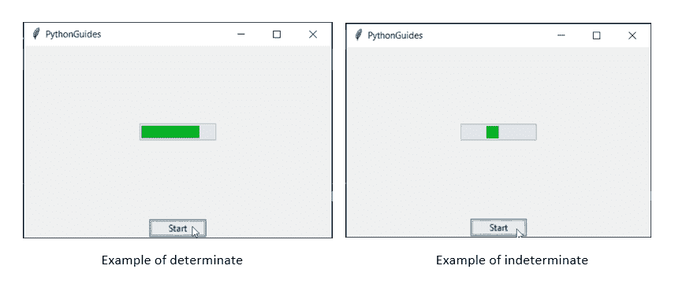
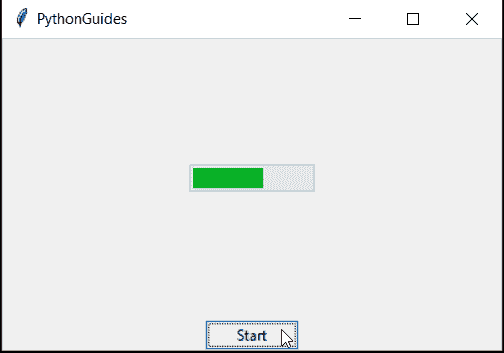
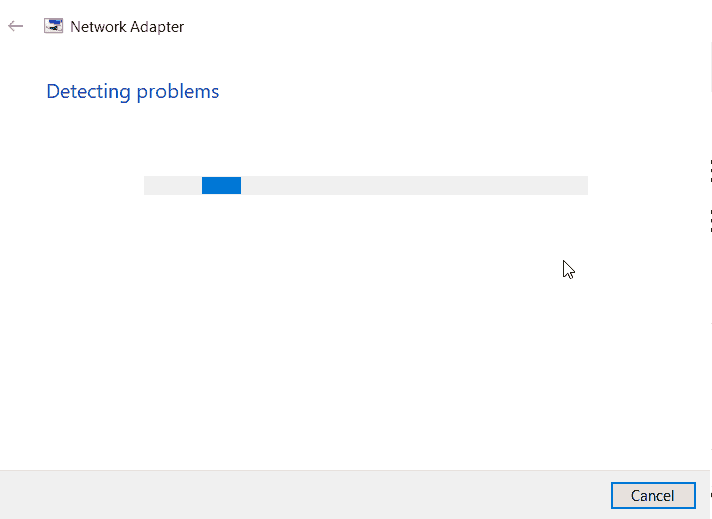
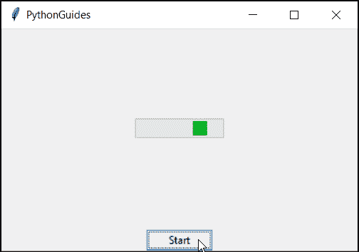
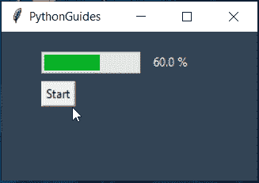
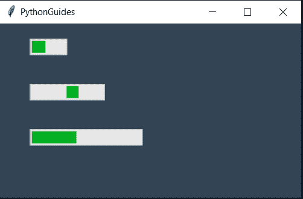
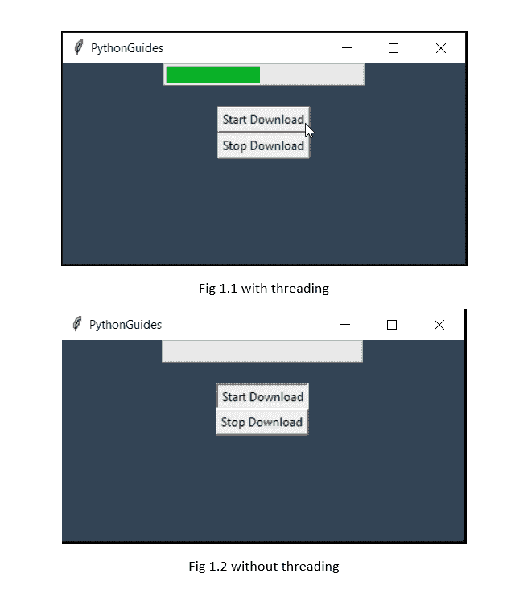

# Python Tkinter 进度条小部件–如何使用

> 原文：<https://pythonguides.com/python-tkinter-progress-bar/>

[](https://sharepointsky.teachable.com/p/python-and-machine-learning-training-course)

在这个 [Python 教程](https://pythonguides.com/learn-python/)、**、T3 中，我们将学习 **Python Tkinter 进度条小工具**。此外，我们将涵盖这些主题。**

*   关于 Python Tkinter 进度条
*   Python Tkinter 进度条使用确定
*   Python Tkinter 进度条使用不定
*   如何找到进度条的值
*   在进度条中应用文本
*   如何增加或减少进度条的宽度
*   在 Python Tkinter 进度条中使用线程
*   如何更新进度条
*   进度条不更新错误

目录

[](#)

*   [Python Tkinter 进度条小工具](#Python_Tkinter_Progress_bar_widget "Python Tkinter Progress bar widget")
    *   [Python Tkinter 进度条确定](#Python_Tkinter_Progress_bar_determinate "Python Tkinter Progress bar determinate")
    *   [Python Tkinter 进度条不确定](#Python_Tkinter_Progress_bar_indeterminate "Python Tkinter Progress bar indeterminate")
*   [Python Tkinter 进度条值](#Python_Tkinter_Progress_bar_value "Python Tkinter Progress bar value")
*   [Python Tkinter 进度条文本](#Python_Tkinter_Progress_bar_text "Python Tkinter Progress bar text")
*   [Python Tkinter 进度条宽度](#Python_Tkinter_Progress_bar_width "Python Tkinter Progress bar width")
*   [Python Tkinter 进度条线程](#Python_Tkinter_Progress_bar_thread "Python Tkinter Progress bar thread")
*   [Python Tkinter 进度条更新](#Python_Tkinter_Progress_bar_update "Python Tkinter Progress bar update")
*   [Python Tkinter 进度条未更新](#Python_Tkinter_Progress_bar_not_updating "Python Tkinter Progress bar not updating")

## Python Tkinter 进度条小工具

*   **Python Tkinter 进度条**告知活动或任务的当前状态。
*   进度条让用户感觉到他们的点击有反应，他们需要等待。
*   进度条有两种模式:
    *   确定的
    *   模糊的



python tkinter progress bar

阅读:[如何在 Python Tkinter](https://pythonguides.com/python-tkinter-image/) 中添加图片。

### Python Tkinter 进度条确定

*   **Python Tkinter 进度条确定**有一个确定的值，表示程序知道终点。
*   Determinate 是一种动画类型，在这种动画中，随着任务的继续完成，一个框会继续填充颜色。

**代码:**

在这段代码中，确定了进度条的显示模式

```py
from tkinter import *
from tkinter.ttk import *
import time

ws = Tk()
ws.title('PythonGuides')
ws.geometry('400x250+1000+300')

def step():
    for i in range(5):
        ws.update_idletasks()
        pb1['value'] += 20

        time.sleep(1)

pb1 = Progressbar(ws, orient=HORIZONTAL, length=100, mode='indeterminate')
pb1.pack(expand=True)

Button(ws, text='Start', command=step).pack()

ws.mainloop()
```

**输出:**



python tkinter progress bar determinate

读取 [Python Tkinter 添加函数](https://pythonguides.com/python-tkinter-add-function/)

### Python Tkinter 进度条不确定

*   **Python Tkinter 进度条不确定**有一个不确定的值，这意味着系统没有固定的结束值。
*   不定是一种动画类型，其中固定大小的条一直在移动。
*   进度条的这种模式可以在“错误屏幕”或“故障排除屏幕”上看到。



Python Tkinter Progress bar indeterminate

**代码:**

```py
from tkinter import *
from tkinter.ttk import *
import time

ws = Tk()
ws.title('PythonGuides')
ws.geometry('400x250+1000+300')

def step():
    for i in range(5):
        ws.update_idletasks()
        pb1['value'] += 20

        time.sleep(1)

pb1 = Progressbar(ws, orient=HORIZONTAL, length=100, mode='indeterminate')
pb1.pack(expand=True)

Button(ws, text='Start', command=step).pack()

ws.mainloop()
```

**输出:**



Python Tkinter Progress bar indeterminate

阅读 [Python Tkinter 过滤函数()——如何使用](https://pythonguides.com/python-tkinter-filter/)

## Python Tkinter 进度条值

*   **Python Tkinter 进度条值**决定进度条每次走的步数。
*   假设进度条的最大长度是 100。然后，达到 100 的每一步都被认为是一个值。
*   如果值是 20，这意味着进度条将移动 5 次，变成 100。

**代码:**

在这段代码中，我们提供的值是 20。既然是这样

```py
from tkinter import *
from tkinter.ttk import *
import time

ws = Tk()
ws.title('PythonGuides')
ws.geometry('400x250+1000+300')

def step():
    for i in range(5):
        ws.update_idletasks()
        pb1['value'] += 20

        time.sleep(1)

pb1 = Progressbar(ws, orient=HORIZONTAL, length=100, mode='indeterminate')
pb1.pack(expand=True)

Button(ws, text='Start', command=step).pack()

ws.mainloop()
```

**输出:**

在这个输出中，进度序列被显示出来&就在它的下面，进度条的值被打印出来。您可以观察到每个值相差 20

## Python Tkinter 进度条文本

*   在这一节中，我们将学习如何在 **Python 进度条**上实现一个文本。
*   进度条没有单独显示文本的功能。
*   我们可以使用一个标签小部件来做到这一点。我们所要做的就是在我们想要实现文本的地方放置一个标签小部件。
*   现在我们可以配置标签的文本值&可以用 **Python Tkinter 进度条**中的变化来改变它。
*   在这一部分，我们在进度条的右侧放置了一个标签。进度条的值提供给标签。

**代码:**

在这段代码中，我们在 step function 下声明了一个将运行 5 次的循环。这个循环将继续用 20 更新进度条值。

每次循环运行时，它都会更新标签的值。使用 ws.update_idletasks()以便我们可以看到进度。否则很快就会发生。每次循环运行时都有 1 秒的间隔。

```py
from tkinter import *
from tkinter.ttk import Progressbar
import time

def step():
    for i in range(5):
        ws.update_idletasks()
        pb['value'] += 20
        time.sleep(1)
        txt['text']=pb['value'],'%'

ws = Tk()
ws.title('PythonGuides')
ws.geometry('200x150')
ws.config(bg='#345')

pb = Progressbar(
    ws,
    orient = HORIZONTAL,
    length = 100,
    mode = 'determinate'
    )

pb.place(x=40, y=20)

txt = Label(
    ws,
    text = '0%',
    bg = '#345',
    fg = '#fff'

)

txt.place(x=150 ,y=20 )

Button(
    ws,
    text='Start',
    command=step
).place(x=40, y=50)

ws.mainloop()
```

**输出:**

在此输出中，进度条旁边的文本显示进度条的值。



Python tkinter text on progress bar

## Python Tkinter 进度条宽度

*   如果你想知道，如何在 Tkinter 中增加**进度条的宽度。**
*   那么最简单的解决方法就是增加长度值。长度值决定了进度条的宽度
*   这里我们将投影两个不同宽度的例子。

**代码:**

在这段代码中，我们使用内置函数 `start()` 创建了三个不同的进度条。两个进度条是确定的&中间的一个是不确定的。

```py
from tkinter import *
from tkinter.ttk import Progressbar
import time

ws = Tk()
ws.title('PythonGuides')
ws.geometry('400x350')
ws.config(bg='#345')

pb1 = Progressbar(
    ws,
    orient = HORIZONTAL,
    length = 50,
    mode = 'determinate'
    )

pb1.place(x=40, y=20)

pb2 = Progressbar(
    ws,
    orient = HORIZONTAL,
    length = 100,
    mode = 'indeterminate'
    )

pb2.place(x=40, y=80)

pb3 = Progressbar(
    ws,
    orient = HORIZONTAL,
    length = 150,
    mode = 'determinate'
    )

pb3.place(x=40, y=140)

pb1.start()
pb2.start()
pb3.start()

ws.mainloop()
```

**输出:**

在这个输出中，您可以看到所有三个进度条都有不同的宽度。



Python tkinter progress bar width

## Python Tkinter 进度条线程

*   Python 逐行运行程序。因此，程序的第二部分只在第一部分完成后运行。
*   在这种情况下，会创建一个依赖项，这会延迟程序。
*   为了解决这个问题&使程序独立，引入了线程的概念。
*   在线程化中，程序的每个部分都作为一个独立的单元运行。

**代码:**

在这段代码中，我们使用线程创建了程序。线程有助于避免屏幕冻结。因为它使程序的一部分能够独立运行。

这里的进度条将在 5 秒钟后开始。与此同时，屏幕冻结，用户不能做任何事情。但是使用 thread，可以点击其他按钮或关闭窗口。

```py
from tkinter import *
from tkinter.ttk import Progressbar
import time
import threading

ws = Tk()
ws.title('PythonGuides')
ws.geometry('400x200')
ws.config(bg='#345')

def start_download():
    time.sleep(5)
    pb.start()   

def stop_download():
    pb.stop()

pb = Progressbar(
    ws,
    orient = HORIZONTAL,
    length = 200,
    mode = 'determinate'
    )
pb.pack()

msg = Label(
    ws,
    text='',
    bg='#345',
    fg='red',

)

msg.pack()

start = Button(
    ws,
    text='Start Download',
    command=threading.Thread(target=start_download).start()
    #command=start_download
    )

start.pack()

stop = Button(
    ws,
    text='Stop Download',
    command=stop_download
)
stop.pack()

ws.mainloop()from tkinter import *
from tkinter.ttk import Progressbar
import time
import threading

ws = Tk()
ws.title('PythonGuides')
ws.geometry('400x350')
ws.config(bg='#345')

def play():
    time.sleep(10)
    pb.start()

pb = Progressbar(
    ws,
    orient = HORIZONTAL,
    length = 100,
    mode = 'determinate'
    )
pb.pack(pady=30)

play = Button(
    ws,
    text="Freeze",
    #command=threading.Thread(target=play).start())
    command=play)
play.pack(pady=30)

pb1 = Progressbar(
    ws,
    orient = HORIZONTAL,
    length = 100,
    mode = 'determinate'
    )

pb1.start()
pb1.pack(pady=30)

ws.mainloop()
```

**输出:**

在这个输出中，图 1.1 中的图像运行良好，当单击开始下载按钮时不会冻结屏幕。然而，图 1.2 中的图像显示，当单击开始下载按钮时，屏幕冻结 5 秒钟。这就是线程化的好处。



python tkinter progress bar using threading

## Python Tkinter 进度条更新

*   python Tkinter 中的进度条显示每次事件发生时的一些更新。
*   它让用户觉得有事发生，需要等待。您可能已经注意到有一行代码写着 `update_idletasks()` 。
*   `update_idletasks()` 允许我们在进度条中看到增量。
*   有了这行代码，人眼只能看到 100|%完成的进度条。
*   要查看示例，请参考我们的 Python Tkinter 进度条文本部分。

## Python Tkinter 进度条未更新

*   Python Tkinter 进度条应该会持续更新，如果进度条没有更新，它会提示用户什么也没有发生。
*   进度条绑定到时间，指示用户保持片刻。
*   进度条不更新有各种可能的原因。
*   这里有一些你可以遵循的提示:
    *   增量的值应该总是小于进度条的长度
    *   尝试提供增量值作为长度的整除。例如，如果长度是 100，20 或 10 将是完美的增量值，因为提醒最终将是 0。
    *   使用循环时，请确保提供

您可能会喜欢以下 Python 教程:

*   [使用蟒蛇龟绘制彩色填充形状](https://pythonguides.com/draw-colored-filled-shapes-using-python-turtle/)
*   [使用 if-else 理解 Python 列表](https://pythonguides.com/python-list-comprehension-using-if-else/)
*   [Python Tkinter Stopwatch](https://pythonguides.com/python-tkinter-stopwatch/)
*   [Python 读取二进制文件](https://pythonguides.com/python-read-a-binary-file/)
*   [如何使用 Turtle 在 python 中绘制形状](https://pythonguides.com/turtle-programming-in-python/)
*   [Python Tkinter 列表框](https://pythonguides.com/python-tkinter-listbox/)
*   [Python 文件方法](https://pythonguides.com/python-file-methods/)
*   [Python tkinter messagebox](https://pythonguides.com/python-tkinter-messagebox/)
*   [Python Tkinter 帧](https://pythonguides.com/python-tkinter-frame/)

在本教程中，我们学习了使用 Python Tkinter 实现一个**进度条。此外，我们已经讨论了这些主题。**

*   关于 Python Tkinter 进度条
*   Python Tkinter 进度条使用确定
*   Python Tkinter 进度条使用不定
*   如何找到进度条的值
*   在进度条中应用文本
*   如何增加或减少进度条的宽度
*   在 Python Tkinter 中使用线程
*   如何更新进度条
*   进度条不更新错误

[Bijay Kumar](https://pythonguides.com/author/fewlines4biju/)

Python 是美国最流行的语言之一。我从事 Python 工作已经有很长时间了，我在与 Tkinter、Pandas、NumPy、Turtle、Django、Matplotlib、Tensorflow、Scipy、Scikit-Learn 等各种库合作方面拥有专业知识。我有与美国、加拿大、英国、澳大利亚、新西兰等国家的各种客户合作的经验。查看我的个人资料。

[enjoysharepoint.com/](https://enjoysharepoint.com/)[](https://www.facebook.com/fewlines4biju "Facebook")[](https://www.linkedin.com/in/fewlines4biju/ "Linkedin")[](https://twitter.com/fewlines4biju "Twitter")