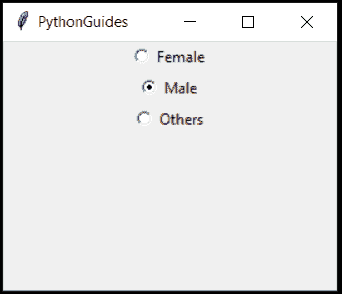
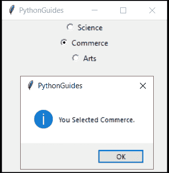
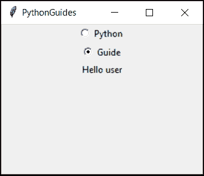
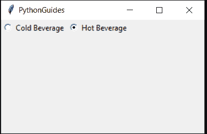
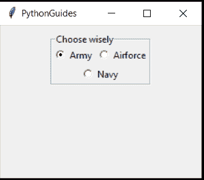
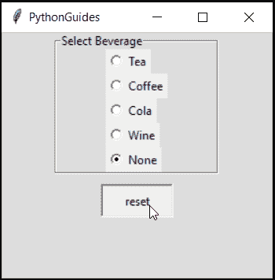
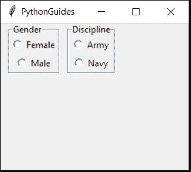
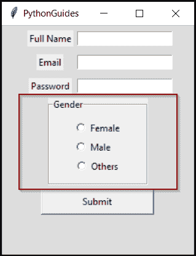

# Python Tkinter 单选按钮–如何使用

> 原文：<https://pythonguides.com/python-tkinter-radiobutton/>

[](https://sharepointsky.teachable.com/p/python-and-machine-learning-training-course)

在本 [Python 教程](https://pythonguides.com/python-programming-for-the-absolute-beginner/)中，我们将学习 `Python Tkinter RadioButton` 。此外，我们还将讨论以下主题:

*   Tkinter 单选按钮 Python
*   Tkinter 单选按钮获取值
*   Tkinter 单选按钮命令
*   Tkinter 单选按钮变量
*   tkinter 单选按钮水平
*   Tkinter 单选按钮网格
*   Tkinter 单选按钮默认值
*   Tkinter 单选按钮组
*   Tkinter 单选按钮示例

目录

[](#)

*   [Python Tkinter 单选按钮](#Python_Tkinter_RadioButton "Python Tkinter RadioButton")
*   [Tkinter 单选按钮获取值](#Tkinter_RadioButton_get_value "Tkinter RadioButton get value")
*   [Python Tkinter 单选按钮命令](#Python_Tkinter_RadioButton_command "Python Tkinter RadioButton command")
*   [Tkinter 单选按钮变量](#Tkinter_RadioButton_variable "Tkinter RadioButton variable")
*   [Tkinter 单选按钮水平](#Tkinter_RadioButton_horizontal "Tkinter RadioButton horizontal")
*   [Python Tkinter 单选按钮网格](#Python_Tkinter_RadioButton_grid "Python Tkinter RadioButton grid")
*   [Python 中的 Tkinter 单选按钮默认值](#Tkinter_RadioButton_default_in_Python "Tkinter RadioButton default in Python")
*   [Tkinter 单选按钮组](#Tkinter_RadioButton_group "Tkinter RadioButton group")
*   [Tkinter 单选按钮示例](#Tkinter_RadioButton_example "Tkinter RadioButton example")

## Python Tkinter 单选按钮

我们先来讨论一下什么是 `Python Tkinter RadioButton` 。

*   在 [Python GUI 编程](https://pythonguides.com/python-gui-programming/)中，我们可以使用单选按钮进行选择。
*   它支持从多个单选按钮中进行单一选择。
*   在填写任何表格的时候，你一定遇到过性别选择选项。其中只允许您选择一个选项。这就是所谓的单选按钮。

**举例:**

这里你可以看到一个 **Python 单选按钮**的例子。



python tkinter radiobutton

## Tkinter 单选按钮获取值

*   在本节中，我们将学习如何在 Python 中获取单选按钮中存储的值
*   在下面的例子中，学生可以选择一个方向(科学、商业、艺术)。
*   radiobutton 的值采用整数或字符串形式。
*   在这种情况下，值是整数

**代码:**

```py
from tkinter import *
from tkinter import messagebox

ws = Tk()
ws.title('PythonGuides')
ws.geometry('200x200')

def viewSelected():
    choice  = var.get()
    if choice == 1:
       output = "Science"

    elif choice == 2:
       output =  "Commerce"

    elif choice == 3:
       output =  "Arts"
    else:
        output = "Invalid selection"

    return messagebox.showinfo('PythonGuides', f'You Selected {output}.')

var = IntVar()
Radiobutton(ws, text="Science", variable=var, value=1, command=viewSelected).pack()
Radiobutton(ws, text="Commerce", variable=var, value=2, command=viewSelected).pack()
Radiobutton(ws, text="Arts", variable=var, value=3, command=viewSelected).pack()

ws.mainloop()
```

**输出:**

在此输出中，用户选择了“商务选项”。所以提示告诉他，他选择了‘商务’。



python tkinter radiobutton

此外，你可能会喜欢，[身体质量指数计算器使用 Python Tkinter](https://pythonguides.com/bmi-calculator-using-python-tkinter/) 。

## Python Tkinter 单选按钮命令

*   Python Tkinter RadioButton 命令我们可以用来触发一个函数或方法
*   换句话说，当单选按钮被选中时会发生什么
*   就像上一节一样，当单击 radiobutton 时，会出现一个带有所选选项的提示。

**代码:**

```py
from tkinter import *

ws =Tk()
ws.title("PythonGuides")
ws.geometry('200x200')

def sayHello():
    return Label(ws, text="Hello user").pack()

var= IntVar()
Radiobutton(ws, text='Python', variable=var, value=1, command=sayHello).pack()
Radiobutton(ws, text='Guide', variable=var, value=2, command=sayHello).pack()
ws.mainloop()
```

**输出:**

在这个输出中，创建了打印“hello world”的函数。当用户点击任一**单选按钮**时，该功能被触发&输出被显示。command 关键字用于传递**单选按钮**中的函数。



Python Tkinter RadioButton command

## Tkinter 单选按钮变量

*   Radiobutton 变量控制值的类型。
*   如果**变量**是**字符串变量()**，这意味着**值**将是字符串类型。
*   如果**变量**是 `IntVar()` ，那么**值**将是一个整数类型。
*   变量中的值用于定位 radiobutton。

阅读: [Python Tkinter 文本框小工具](https://pythonguides.com/python-tkinter-text-box/)

## Tkinter 单选按钮水平

*   Python 单选按钮可以水平或垂直对齐
*   在本节中，我们将学习如何在水平窗体中设置单选按钮

**代码:**

```py
from tkinter import *

ws = Tk()
ws.title("PythonGuides")
ws.geometry('200x200')

var = IntVar()

cold_bev = Radiobutton(ws, text="Cold Beverage", variable=var, value=1).grid(row=0, column=1)
hot_bev = Radiobutton(ws, text="Hot Beverage", variable=var, value=2).grid(row=0, column=2)

ws.mainloop()
```

**输出:**

在这个输出中，**单选按钮**与**水平对齐**。我们已经使用网格来做到这一点。这里 `row = 0` 和 `column = 1` 表示“冷饮”，而 `column = 2` 表示“热饮”。



Tkinter RadioButton horizontal

## Python Tkinter 单选按钮网格

*   网格是一个定位管理工具
*   它以行列格式放置小部件。
*   位置从左上角开始
*   这意味着，**行=0** 和**列=0**

**代码:**

```py
from tkinter import *

ws = Tk()
ws.title('PythonGuides')
ws.geometry('200x200')

var = IntVar()
frame = LabelFrame(ws, text='Choose wisely')
frame.pack(pady=10)

Radiobutton(frame, text='Army', variable=var, value=1).grid(row=0, column=1)
Radiobutton(frame, text="Airforce", variable=var, value=2).grid(row=0, column=2)
Radiobutton(frame, text="Navy", variable=var, value=3).grid(row=1, columnspan=3)

ws.mainloop()
```

**输出:**

在这个输出中，我们可以看到 radiobuttons 是使用 grid 定位的。



Tkinter RadioButton grid

## Python 中的 Tkinter 单选按钮默认值

我们还可以在 Python 中设置在 Tikinter 单选按钮中选择的默认选项。

*   当用户不提供任何值时，Default 有助于提供一些值。
*   当用户点击重置按钮或不提供任何输入时，默认单选按钮被选择或接受。

**代码:**

```py
from tkinter import *

ws = Tk()
ws.title("PythonGuides")
ws.geometry('200x250')
ws.configure(bg='#dddddd')

def reset():
    return var.set(5)

var = IntVar()
frame = LabelFrame(ws, text='Select Beverage', padx=50, bg= '#dddddd')
frame.pack()
Radiobutton(frame, text="Tea", variable=var, value=1 ).pack(anchor=W)
Radiobutton(frame, text="Coffee", variable=var, value=2).pack(anchor=W)
Radiobutton(frame, text="Cola", variable=var, value=3).pack(anchor=W)
Radiobutton(frame, text="Wine", variable=var, value=4).pack(anchor=W)
none_Rb = Radiobutton(frame, text="None", variable=var, value=5).pack(anchor=W)

Button(ws, text='reset', command=reset, padx=20, pady=5).pack(pady=10)

ws.mainloop()
```

**输出:**

在这个输出中，用户可以选择任何一个选项。无论选择了什么选项，但如果他点击**重置**，那么单选按钮将设置为默认，即无。



Tkinter RadioButton default

## Tkinter 单选按钮组

*   创建单选按钮的群集称为组
*   同一组的 Radiobutton 具有相同的变量名。
*   在一个表单中，有多个单选按钮，但它们可能并不都保存相同的目的。
*   所以为了对它们进行分类，它们被分组。
*   如性别会有男、女、流会有、科学商业等。

**代码:**

```py
from tkinter import *

ws = Tk()
ws.title("PythonGuies")
ws.geometry('200x200')

frame1 = LabelFrame(ws, text='Gender')
frame1.grid(row=1, column=1, padx=10)

frame2 = LabelFrame(ws, text='Discipline')
frame2.grid(row=1, column=2)

group_1 = IntVar()
group_2 = IntVar()
Radiobutton(frame1, text='Female', variable=group_1, value=1).pack()
Radiobutton(frame1, text='Male', variable=group_1, value=2).pack()
Radiobutton(frame2, text='Army', variable=group_2, value=1).pack()
Radiobutton(frame2, text='Navy', variable=group_2, value=2).pack()

ws.mainloop()
```

**输出:**

在此输出中，为 radiobutton 创建了 2 个组。“**性别**内的单选按钮不会影响“**学科**内的单选按钮。每个组都是独立的。



Tkinter RadioButton group

## Tkinter 单选按钮示例

*   在本例中，我们将为包含 radiobutton 的整个应用程序编写代码。
*   应用程序是一种用户将提供信息的表单
*   提交按钮将提示标题、名称和一条消息。
*   这些头衔(先生或女士)将根据单选按钮中的选择来定义。

**代码:**

```py
from tkinter import *
from tkinter import messagebox

ws =Tk()
ws.title('PythonGuides')
ws.geometry('250x300')

def selection():
    choice = var.get()
    if choice == 1:
        m = 'Ms.'
    elif choice == 2:
        m = 'Mr.'
    elif choice == 3:
        pass
    return m

def submit():
    name = name_Tf.get()
    m = selection()
    return messagebox.showinfo('PythonGuides', f'{m} {name}, submitted form.')

frame1 = Label(ws)
frame1.pack()
frame2 = LabelFrame(frame1, text='Gender', padx=30, pady=10)

var =IntVar()

Label(frame1, text='Full Name').grid(row=0, column=0, padx=5, pady=5)
Label(frame1, text='Email').grid(row=1, column=0, padx=5, pady=5)
Label(frame1, text='Password').grid(row=2, column=0, padx=5, pady=5)
Radiobutton(frame2, text='Female', variable=var, value=1,command=selection).pack()
Radiobutton(frame2, text='Male', variable=var, value=2,command=selection).pack(anchor=W)
Radiobutton(frame2, text='Others', variable=var, value=3,command=selection).pack()
name_Tf = Entry(frame1)
name_Tf.grid(row=0, column=2)
Entry(frame1).grid(row=1, column=2)
Entry(frame1, show="*").grid(row=2, column=2)
frame2.grid(row=3, columnspan=3,padx=30)
Button(frame1, text="Submit", command=submit, padx=50, pady=5).grid(row=4, columnspan=4, pady=5)

ws.mainloop()
```

**输出:**

这是代码的输出，这里使用了**标签**、**条目**、**单选按钮**、**框架**、**标签框架**和**按钮**小部件。



Tkinter RadioButton example

您可能会喜欢以下 Python 教程:

*   [Python Tkinter 按钮–如何使用](https://pythonguides.com/python-tkinter-button/)
*   [Python Tkinter 条目–如何使用](https://pythonguides.com/python-tkinter-entry/)
*   [Python tkinter 标签–如何使用](https://pythonguides.com/python-tkinter-label/)
*   [Python 将列表写入文件，并附有示例](https://pythonguides.com/python-write-list-to-file/)
*   [Python 生成随机数和字符串](https://pythonguides.com/python-generate-random-number/)
*   [Python 格式数字加逗号](https://pythonguides.com/python-format-number-with-commas/)
*   [命令出错，退出状态为 1 python](https://pythonguides.com/command-errored-out-with-exit-status-1-python/)
*   [Python 中的优先级队列](https://pythonguides.com/priority-queue-in-python/)
*   [Python tkinter messagebox +示例](https://pythonguides.com/python-tkinter-messagebox/)
*   如何[使用 Tkinter](https://pythonguides.com/make-a-calculator-in-python/) 创建一个 Python 计算器
*   [Python Tkinter 退出程序](https://pythonguides.com/python-tkinter-exit-program/)

在这个 Python 教程中，我们学习了如何在 GUI 编程中使用 `Python Tkinter radiobutton` 。现在，在设计屏幕时，我们可以使用 Python 中的单选按钮。

*   Tkinter 单选按钮 Python
*   Tkinter 单选按钮获取值
*   Tkinter 单选按钮命令
*   Tkinter 单选按钮变量
*   tkinter 单选按钮水平
*   Tkinter 单选按钮网格
*   Tkinter 单选按钮默认值
*   Tkinter 单选按钮组
*   Tkinter 单选按钮示例

[Bijay Kumar](https://pythonguides.com/author/fewlines4biju/)

Python 是美国最流行的语言之一。我从事 Python 工作已经有很长时间了，我在与 Tkinter、Pandas、NumPy、Turtle、Django、Matplotlib、Tensorflow、Scipy、Scikit-Learn 等各种库合作方面拥有专业知识。我有与美国、加拿大、英国、澳大利亚、新西兰等国家的各种客户合作的经验。查看我的个人资料。

[enjoysharepoint.com/](https://enjoysharepoint.com/)[](https://www.facebook.com/fewlines4biju "Facebook")[](https://www.linkedin.com/in/fewlines4biju/ "Linkedin")[](https://twitter.com/fewlines4biju "Twitter")