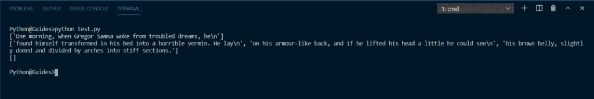

# 如何使用 Python Tkinter 读取文本文件

> 原文：<https://pythonguides.com/python-tkinter-read-text-file/>

[](https://sharepointsky.teachable.com/p/python-and-machine-learning-training-course)

在这个 [Python 教程](https://pythonguides.com/learn-python/)中，我们将学习如何使用 [Python Tkinter](https://pythonguides.com/python-gui-programming/) 中的文件。我们将**使用 Python Tkinter** 读取一个文本文件，我们也将涉及这些主题。

*   Python Tkinter 读取文本文件
*   如何在 Python Tkinter 中打开文本文件
*   如何在 Python Tkinter 中读取文本文件
*   如何在 Python Tkinter 中显示文本文件
*   如何在 Python Tkinter 中保存到文本文件
*   如何用 Python Tkinter 编写文本文件
*   如何在 Python Tkinter 中编辑文本文件
*   如何在 Python Tkinter 中创建文本文件
*   如何在 Python Tkinter 中关闭文本文件

目录

[](#)

*   [Python Tkinter 打开文本文件](#Python_Tkinter_Open_Text_File "Python Tkinter Open Text File")
*   [Python Tkinter 读取文本文件](#Python_Tkinter_Read_Text_File "Python Tkinter Read Text File")
*   [Python Tkinter 显示文本文件](#Python_Tkinter_Display_Text_File "Python Tkinter Display Text File")
*   [Python Tkinter 保存到文本文件](#Python_Tkinter_Save_to_Text_File "Python Tkinter Save to Text File")
*   [Python Tkinter 写的文本文件](#Python_Tkinter_Write_Text_File "Python Tkinter Write Text File")
*   [Python Tkinter 编辑文本文件](#Python_Tkinter_Edit_Text_File "Python Tkinter Edit Text File")
*   [Python Tkinter 创建文本文件](#Python_Tkinter_Create_Text_File "Python Tkinter Create Text File")
*   [Python Tkinter 关闭文本文件](#Python_Tkinter_Close_Text_File "Python Tkinter Close Text File")

## Python Tkinter 打开文本文件

*   在本节中，我们将学习如何使用系统中的 Python Tkinter 打开一个文本文件。
*   open()函数用于打开文件。
*   Python Tkinter 中主要有三种打开文件的模式。
    *   `r` ':以只读方式打开文件。
    *   `w` ':以只写模式打开文件。
    *   `a`’:追加模式下打开 fil。
*   读取模式是默认模式。这意味着即使在打开文件时没有指定读取模式，它也会使用它。
*   在我们的系统中，我们看到一个打开文件的对话框，类似于我们用 Python Tkinter 做的事情。
*   Python Tkinter 有一个名为 **`filedialog`** 的模块，使用它我们可以打开系统文件。
*   让我们看看 Python Tkinter 读取文本文件的实现

**语法**:

下面是使用 `open()` 函数的语法

```py
f = open("file_path", "mode")
data = f.read()
```

*   在这里， **`file_path`** 指的是文件位置&我们将使用 `filedialog` 来这样做。
*   **模式**可以是**‘r’，‘w’，‘a’**。任何带有后缀 **'+'** 的模式都将执行读取&写入。
*   这里， `f` 是文件指针，**数据**保存文本文件中的内容。

下面是在 Python Tkinter 中使用 `filedialog` 的语法。

```py
from tkinter import filedialog

tf = filedialog.askopenfilename(
        initialdir="C:/Users/MainFrame/Desktop/", 
        title="Open Text file", 
        filetypes=(("Text Files", "*.txt"),)
        )
```

*   要访问**文件对话框**，我们需要导入模块。
*   `tf` 是代表 filedialog 的变量。
*   在 filedisalog 类中，我们使用**作为 openfilename** 函数。
*   `initialdir` 是将在文件对话框中打开的默认目录。
*   **标题**是文件对话框的标题
*   **文件类型**指定您想要接受的文件类型。它起着过滤器的作用。在我们的案例中，我们已经明确说明我们只希望与。txt 扩展名。
*   ``"*.txt"``此处*表示任何文件，无论名称如何，但必须具有 txt 扩展名。

我们来看一个小程序，了解一下到目前为止我们学到了什么。

你可能喜欢 [Python 捕捉多个异常](https://pythonguides.com/python-catch-multiple-exceptions/)和 [Python 异常处理](https://pythonguides.com/python-exceptions-handling/)。

**代码:**

在这段代码中，我们使用了 open 函数来读取 Python tkinter 中的文件内容。内容显示在文本小部件中。可以使用文件对话框选择文本文件。选定的文件路径显示在输入框中。

```py
from tkinter import *
from tkinter import filedialog

def openFile():
    tf = filedialog.askopenfilename(
        initialdir="C:/Users/MainFrame/Desktop/", 
        title="Open Text file", 
        filetypes=(("Text Files", "*.txt"),)
        )
    pathh.insert(END, tf)
    tf = open(tf)  # or tf = open(tf, 'r')
    data = tf.read()
    txtarea.insert(END, data)
    tf.close()

ws = Tk()
ws.title("PythonGuides")
ws.geometry("400x450")
ws['bg']='#fb0'

txtarea = Text(ws, width=40, height=20)
txtarea.pack(pady=20)

pathh = Entry(ws)
pathh.pack(side=LEFT, expand=True, fill=X, padx=20)

Button(
    ws, 
    text="Open File", 
    command=openFile
    ).pack(side=RIGHT, expand=True, fill=X, padx=20)

ws.mainloop()
```

**输出:**

在这个输出中，我们选择了一个名为 Readme.txt 的文本文件。您可以看到 Readme.txt 的内容显示在屏幕上。


python tkinter open file

阅读: [Python Tkinter 选项菜单](https://pythonguides.com/python-tkinter-optionmenu/)

## Python Tkinter 读取文本文件

*   在这一节中，我们将学习如何使用 Python Tkinter 来**读取**文本文件。
*   该部分的大部分内容已经在前面的章节中介绍过了。因此，我们将在这里讨论上一节没有涉及的内容。
*   我们就来说说 `read()` ， `readline()` ， `readlines()` ， `readable()`
*   `read()` 用于读取文件的全部内容。
*   `readline()` 只返回行中的内容
*   `readlines()` 以列表形式返回文件的所有内容。每行都是分开的。
*   `readable()` 检查文件内容是否是人类可读的形式。它返回一个布尔值。
*   为了支持我们的例子，我们创建了一个文本文件 `read.txt`


python tkinter read text file

上图中提到的文本是一个虚拟文本，现在我们将使用这个 read.txt 文件执行读取功能。

**read():**

为了读取文件并打印全部数据，我们使用 read()函数。

```py
f = open("read.txt")
print(f.read())
```

这段代码将返回 read.txt 文件的全部内容。

如果我们将整数参数传递给这个 read()函数，那么它将返回这个数字之前的单词。假设它是``print(f.read(5))`` ，那么输出将是**一个 m** ，即包括空格在内的前五个字符。我们再次运行 **`print(f.read())`** 功能，它将显示剩余的内容。这可能有点令人困惑，但是这个例子将会澄清这一切。

```py
f = open("read.txt")
print(f.read(5))
print(f.read())
```


python tkinter read text file

在这个输出中，您可以观察到，当我们再次调用 read()函数时，它已经从第一行中离开的地方继续了。

**readline():t1**

*   这个函数返回内容的行。每次程序运行时，它都返回下一行
*   因为这个文本文件有 4 行，所以我们需要实现这个函数 4 次才能看到屏幕上的所有行。
*   像 read()函数一样，readline()也返回连续的字符，直到传递的整数值。
*   让我们看看我们所学到的一切在行动中。

```py
f = open("read.txt")
print(f.readline(5)) # 1
print(f.readline())  # 2
print(f.readline())  # 3 
```


python tkinter read text file

在这个输出中，您可以看到在第二行代码中，我们传递了参数 5，结果在输出中只打印了一个 m。在第二行代码中，我们再次使用 readline()函数打印了 read.txt。这延续了文本，只打印了一行。所以你可以看到每个函数值都被打印出来了，它只打印了文本文件的一行。总共打印 3 次 readline()函数的值。

**阅读线()**:

*   readlines() 函数将每一行追加到一个列表中，然后返回它。换句话说，这个函数的输出是一个以内容行作为列表项的列表。
*   如果您想将表中的特定行作为目标，这非常有用。
*   无论传递什么整数参数，它都只会返回索引为 0 的那一行。但是如果你传递 0，那么它将返回整个列表。
*   让我们看看我们所学到的一切在行动中。

```py
f = open("read.txt")
print(f.readlines(2))
print(f.readlines())
print(f.readlines()) 
```



python tkinter read text file

在这个输出中，您可以看到 with readlines()提供了参数，即 `2` ，即使这样它也显示第一个。此外，您可以注意到，当再次打印函数值时，它没有显示第一行，因为它已经显示在输出的第一行中了。因为所有文本都显示在输出的第一行和第二行，所以当再次打印函数值时，它返回一个空字符串。

你可能也喜欢，[如何使用 Python Tkinter](https://pythonguides.com/create-countdown-timer-using-python-tkinter/) 创建倒计时定时器。

## Python Tkinter 显示文本文件

*   Python **`Open()`** 已经将**读取**模式设置为默认。
*   所以每次我们打开一个文件，我们默认显示它。
*   我们已经在上面的章节中讨论了这个主题。请参考 Python Tkinter Read 文本文件一节，以获得该主题的演示和解释。

## Python Tkinter 保存到文本文件

*   在本节中，我们将学习如何保存文本文件 Python Tkinter 的内容。
*   每天在电脑上工作时，我们都会保存文件。所以必须意识到这样做的接口。
*   我们单击“保存”按钮，没有消息的保存已经保存，否则会出现一个文件对话框，用户导航到该位置，然后单击“保存”按钮。文件保存在该位置。
*   同样，我们将使用 Python Tkinter `filedialog` 模块来生成一个文件对话框。使用文件对话框用户可以保存文件。

**代码:**

在这段代码中，我们实现了使用 python tkinter 编写文件、使用 python tkinter 保存文件和使用 python tkinter 编辑文件。这是一个完整的应用程序，可用作记事本，用户可以在其中写东西，保存和打开文件。

```py
from tkinter import *
from tkinter import filedialog

# functions 
def openFile():
    tf = filedialog.askopenfilename(
        initialdir="C:/Users/MainFrame/Desktop/", 
        title="Open Text file", 
        filetypes=(("Text Files", "*.txt"),)
        )
    pathh.insert(END, tf)
    tf = open(tf)
    file_cont = tf.read()
    txtarea.insert(END, file_cont)

    tf.close()

def saveFile():
    tf = filedialog.asksaveasfile(
        mode='w',

        title ="Save file",
        defaultextension=".txt"
        )
    tf.config(mode='w')

    pathh.insert(END, tf)
    data = str(txtarea.get(1.0, END))
    tf.write(data)

    tf.close()

ws = Tk()
ws.title("PythonGuides")
ws.geometry("400x500")
ws['bg']='#2a636e'

# adding frame
frame = Frame(ws)
frame.pack(pady=20)

# adding scrollbars 
ver_sb = Scrollbar(frame, orient=VERTICAL )
ver_sb.pack(side=RIGHT, fill=BOTH)

hor_sb = Scrollbar(frame, orient=HORIZONTAL)
hor_sb.pack(side=BOTTOM, fill=BOTH)

# adding writing space
txtarea = Text(frame, width=40, height=20)
txtarea.pack(side=LEFT)

# binding scrollbar with text area
txtarea.config(yscrollcommand=ver_sb.set)
ver_sb.config(command=txtarea.yview)

txtarea.config(xscrollcommand=hor_sb.set)
hor_sb.config(command=txtarea.xview)

# adding path showing box
pathh = Entry(ws)
pathh.pack(expand=True, fill=X, padx=10)

# adding buttons 
Button(
    ws, 
    text="Open File", 
    command=openFile
    ).pack(side=LEFT, expand=True, fill=X, padx=20)

Button(
    ws, 
    text="Save File", 
    command=saveFile
    ).pack(side=LEFT, expand=True, fill=X, padx=20)

Button(
    ws, 
    text="Exit", 
    command=lambda:ws.destroy()
    ).pack(side=LEFT, expand=True, fill=X, padx=20, pady=20)

ws.mainloop()
```

**输出:**

在此输出中，虚拟文本被写入文本区域。现在当用户点击保存按钮时，会出现一个文件浏览器提示。用户可以在点击保存按钮之后导航到他想要保存它的位置。文件保存在系统中，可以通过单击打开按钮打开。


Python Tkinter Save to Text File

## Python Tkinter 写的文本文件

*   在这一节中，我们将学习如何用 Python Tkinter 编写一个文本文件。
*   `**open(file_path, w)** is` 用于将一个文件写入一个已存在的文件中。
*   **`open(file_path, w+)`** 用于写一个文件，如果该文件不存在，它将创建一个新文件。
*   在使用 Python Tkinter 时，我们可以传递它们中的任何一个，它们将以相同的方式工作。
*   请参考我们的 Python Tkinter 保存到文本文件部分来查看演示。

## Python Tkinter 编辑文本文件

*   在本节中，我们将学习如何在 Python Tkinter 中编辑文本文件。
*   编辑意味着文件中已经有一些文本，我们想改变它。
*   在 Python 中，可以使用**追加**模式来完成文件编辑。
*   但是在 Tkinter 的情况下，你可以简单地打开一个文件进行修改，然后再保存它。
*   请参考我们的 Python Tkinter 保存到文本文件部分来查看演示。

## Python Tkinter 创建文本文件

*   要在 Tkinter 中创建一个文本文件，占据一些文本区域是很重要的。
*   您可以使用**画布**、**条目**或**文本**小部件来创建文本区域。在我们的例子中，我们使用了文本小部件。
*   一旦写空间准备好了，我们需要创建动作按钮来保存文件。
*   **文件对话框**该模块将用于打开文件浏览器以保存或打开文件。
*   现在，最终用户需要在提供的书写空间上键入一些文本，当他单击保存按钮时，将弹出一个文件浏览器，他可以将文件保存到所需的目标位置。
*   要查看实现，请参考我们的 Python Tkinter 保存到文本文件部分。

## Python Tkinter 关闭文本文件

*   当任何操作开始时，确定它何时结束是很重要的。
*   关闭文本文件很重要，并且被认为是一种好的做法。
*   每当我们打开一个文件时，它就开始运作。系统认为我们正在处理它，所以给它分配了一些资源。关闭文件告诉计算机任务已经完成，现在文件是自由的。
*   在不关闭文件的情况下执行程序时，您可能看不到任何区别。但是，如果您将使用其他数据库处理更大的项目，那么您会注意到不同之处。
*   因此，使用后关闭文件是一个好习惯。

**语法:**

```py
f = open("file_path", "mode")
    -------
    -------
f.close() 
```

您可能会喜欢以下 Python 教程:

*   [Python Tkinter 条目](https://pythonguides.com/python-tkinter-entry/)
*   [Python Tkinter Button](https://pythonguides.com/python-tkinter-button/)
*   [Python Tkinter 单选按钮](https://pythonguides.com/python-tkinter-radiobutton/)
*   [Python 获取目录中的所有文件](https://pythonguides.com/python-get-all-files-in-directory/)
*   [Python 读取二进制文件](https://pythonguides.com/python-read-a-binary-file/)
*   [Python 复制文件](https://pythonguides.com/python-copy-file/)
*   [Python 文件方法](https://pythonguides.com/python-file-methods/)
*   [如何进入 Python Tkinter 程序的下一页](https://pythonguides.com/go-to-next-page-in-python-tkinter/)
*   [如何用 Python 把 DateTime 转换成 UNIX 时间戳](https://pythonguides.com/convert-datetime-to-unix-timestamp-in-python/)
*   [使用 Python Pygame 创建游戏](https://pythonguides.com/create-a-game-using-python-pygame/)

在本教程中，我们学习了如何在 Python Tkinter 中**读取文本文件。我们也讨论了这些主题。**

*   如何在 Python Tkinter 中打开文本文件
*   如何在 Python Tkinter 中读取文本文件
*   如何在 Python Tkinter 中显示文本文件
*   如何在 Python Tkinter 中保存到文本文件
*   如何用 Python Tkinter 编写文本文件
*   如何在 Python Tkinter 中编辑文本文件
*   如何在 Python Tkinter 中创建文本文件
*   如何在 Python Tkinter 中关闭文本文件

[Bijay Kumar](https://pythonguides.com/author/fewlines4biju/)

Python 是美国最流行的语言之一。我从事 Python 工作已经有很长时间了，我在与 Tkinter、Pandas、NumPy、Turtle、Django、Matplotlib、Tensorflow、Scipy、Scikit-Learn 等各种库合作方面拥有专业知识。我有与美国、加拿大、英国、澳大利亚、新西兰等国家的各种客户合作的经验。查看我的个人资料。

[enjoysharepoint.com/](https://enjoysharepoint.com/)[](https://www.facebook.com/fewlines4biju "Facebook")[](https://www.linkedin.com/in/fewlines4biju/ "Linkedin")[](https://twitter.com/fewlines4biju "Twitter")