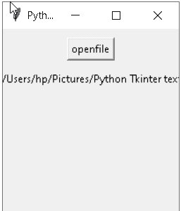

# Python Tkinter 将文本保存到文件

> 原文：<https://pythonguides.com/python-tkinter-save-text-to-file/>

[](https://sharepointsky.teachable.com/p/python-and-machine-learning-training-course)

在本教程中，我们将学习如何在 Python Tkinter 中将文本保存到文件中，我们还将介绍与保存文本文件相关的不同示例。并涵盖这些主题

*   Python Tkinter 将文本保存到文件
*   Python Tkinter 保存文本对话框
*   Python Tkinter 保存文件路径
*   Python Tkinter 保存条目
*   Python Tkinter 保存按钮
*   Python Tkinter 将输入保存到变量
*   Python Tkinter 保存画布图像

目录

[](#)

*   [Python Tkinter 保存文本到文件](#Python_Tkinter_save_text_to_file "Python Tkinter save text to file")
*   [Python Tkinter 保存文本对话框](#Python_Tkinter_save_text_dialog_box "Python Tkinter save text dialog box")
*   [Python Tkinter 保存文件路径](#Python_Tkinter_save_file_path "Python Tkinter save file path")
*   [Python Tkinter 保存条目](#Python_Tkinter_save_entry "Python Tkinter save entry")
*   [Python Tkinter 保存按钮](#Python_Tkinter_save_button "Python Tkinter save button")
*   [Python Tkinter 将输入保存到变量](#Python_Tkinter_save_input_to_variable "Python Tkinter save input to variable")
*   [Python Tkinter 保存画布图像](#Python_Tkinter_save_canvas_image "Python Tkinter save canvas image")

## Python Tkinter 保存文本到文件

在这一节中，我们将学习如何在 Python Tkinter 中将文本保存到文件中。

首先，我们在记事本、微软 word 等文本书写工具上书写文本。写完文字后，我们要保存这个。要保存文本，请进入菜单栏，文件选项卡位于文件选项卡下，有保存文件的保存选项。

**代码:**

在下面的代码中，我们首先清除文本区域，然后插入文本，并通过单击保存选项进行保存。

*   `text_zone.delete()` 用于清除文本区域。
*   `text_zone.insert()` 用于在文本区内插入文本。
*   `text _ zone . edit _ modified()=`插入文本后如果我们想修改文本那么我们使用这个函数。
*   `file dialog . ask openfile()`函数显示对话框，允许用户选择文件并返回用户选择的文件。
*   `filemenu.add_command()` 用于在文件标签下添加命令。
*   `menubar.add_cascade()` 用于提供打开文件时的功能访问。
*   如果我们写了一个大段，就使用滚动条()。因为屏幕不足以显示整个段落，所以我们使用了滚动条。

```py
import tkinter as tk
from tkinter import ttk
from tkinter import filedialog

def file1():    
    if not text_zone.edit_modified():      
        text_zone.delete('1.0', tk.END)
    else:        
        savefileas()

        text_zone.delete('1.0', tk.END)  

    text_zone.edit_modified(0)

    ws.title('PYTHON GUIDES')    

def openfile():

    if not text_zone.edit_modified():       
        try:            
            path = filedialog.askopenfile(filetypes = (("Text files", "*.txt"), ("All files", "*.*"))).name

            ws.title('Notepad - ' + path)          

            with open(path, 'r') as f:             
                content = f.read()
                text_zone.delete('1.0', tk.END)
                text_zone.insert('1.0', content)

                text_zone.edit_modified(0)

        except:
            pass   

    else:       
        savefileas()      

        text_zone.edit_modified(0)              
        openfile()         

def savefile():    
    try:

        path = ws.title().split('-')[1][1:]   

    except:
        path = ''

    if path != '':

        with open(path, 'w') as f:
            content = text_zone.get('1.0', tk.END)
            f.write(content)

    else:
        savefileas()    

    text_zone.edit_modified(0)
def savefileas():    
    try:
        path = filedialog.asksaveasfile(filetypes = (("Text files", "*.txt"), ("All files", "*.*"))).name
        ws.title('Notepad - ' + path)

    except:
        return   

    with open(path, 'w') as f:
        f.write(text_zone.get('1.0', tk.END))

ws = tk.Tk()

ws.title('Notepad')
ws.geometry('800x600')

menubar = tk.Menu(ws)

filemenu = tk.Menu(menubar, tearoff=0)
filemenu.add_command(label="New", command=file1)
filemenu.add_command(label="Open", command=openfile)
filemenu.add_command(label="Save", command=savefile)
filemenu.add_command(label="Save as...", command=savefileas)
filemenu.add_separator()
filemenu.add_command(label="Exit", command=ws.quit)

menubar.add_cascade(label="File", menu=filemenu)

text_zone = tk.Text(ws)
text_zone.pack(expand = tk.YES, fill = tk.BOTH, side = tk.LEFT)

scrollbar = ttk.Scrollbar(ws, orient=tk.VERTICAL, command=text_zone.yview)
scrollbar.pack(fill=tk.Y, side=tk.RIGHT)
text_zone['yscrollcommand'] = scrollbar.set

ws.config(menu=menubar)

ws.mainloop() 
```

**输出:**

在下面的输出中，我们看到了书写文本的记事本。为了保存这个文本，我们在菜单栏中创建了一个菜单栏，我们看到了 file 选项。


Python Tkinter save text to file Output

在点击文件时，我们看到保存选项，点击它们将文本保存到文件中。


Python Tkinter save text to file1 Output

阅读: [Python Tkinter Spinbox](https://pythonguides.com/python-tkinter-spinbox/)

## Python Tkinter 保存文本对话框

在本节中，我们将学习如何在 Python Tkinter 中保存文本对话框。

对话框是一个驱动器或目录，我们可以在其中保存我们的文本文件。我们可以创建一个文本文件，将这个文本文件保存到对话框中。点击按钮出现对话框。选择你想要保存的文件，选定文件后点击保存。文件将保存在对话框中。

**代码:**

在下面的代码中，我们创建了一个窗口 `ws=TK()` 在这个窗口中，我们添加了一个按钮，单击这个按钮会出现一个对话框，我们在这里保存文本文件。

*   `asksaveasfile()` 用于保存用户文件的函数。
*   `lambda` 函数只有一个表达式。
*   **按钮()**用于保存文件。

```py
from tkinter import *

from tkinter.filedialog import asksaveasfile

ws = Tk()
ws.geometry('200x200')
ws.title("Python Guides")

def save():
	Files = [('All Files', '*.*'),
			('Python Files', '*.py'),
			('Text Document', '*.txt')]
	file = asksaveasfile(filetypes = Files, defaultextension = Files)

button = Button(ws, text = 'Save', command = lambda : save())
button.pack(side = TOP, pady = 20)

ws.mainloop()
```

**输出:**

在下面的输出中，我们看到小部件上放置了一个保存按钮。按保存按钮。


Python Tkinter save dialog box Output

按下保存按钮后，会出现一个对话框，我们可以在其中保存文件。


Python Tkinter save dialog box1 Output

阅读: [Python Tkinter 搜索框](https://pythonguides.com/python-tkinter-search-box/)

## Python Tkinter 保存文件路径

在这一节中，我们将学习如何在 Python Tkinter 中保存文件路径。

创建文件后，我们可以保存我们的文件。我们可以保存路径的文件被创建或者我们可以说我们的文件被保存在哪个位置，比如在 `C` / drive， `E` / drive，desktop。

**代码:**

在下面的代码中，我们在一个放置按钮的小部件中创建了一个小部件，单击按钮文件路径保存在文件所在的位置。

*   `file dialog . askopenfilename()`函数允许打开并返回文件路径。
*   **按钮()**用于通过点击它们来搜索文件。

```py
from tkinter import *
from tkinter import filedialog

def get_file_path():
    global file_path1

    file_path1= filedialog.askopenfilename(title = "Select A File", filetypes = (("Python files", "*.png"), ("mp4", "*.mp4"), ("wmv", "*.wmv"), ("avi", "*.avi")))
    l1 = Label(ws, text = "File path: " + file_path1).pack()

ws = Tk()
ws.title("Python Guides")
ws.geometry("200x200")

button = Button(ws, text = "openfile", command = get_file_path).pack(pady=10)
ws.mainloop()
print(file_path1)
```

**输出:**

运行上面的代码后，我们得到了下面的输出。我们看到一个小部件，其中放置了一个**“openfile”**按钮。


Python Tkinter save file path Output

点击**打开文件**按钮后，我们得到一个对话框，在这里我们选择我们的文件并找到文件的路径。


Python Tkinter save file path1 Output

选择文件并点击打开后，文件路径将显示在小工具上。



Python Tkinter save file path2 Output

阅读: [Python Tkinter 验证](https://pythonguides.com/python-tkinter-validation/)

## Python Tkinter 保存条目

在本节中，我们将学习如何在 Python Tkinter 中保存条目。

条目是写在列表、日记中的对象，或者我们可以说是更新数据的某些内容。由于有一个用户名和密码的输入框，我们可以在此栏中输入数据。输入数据后我们可以保存我们输入的数据，保存后会自动更新。

**代码:**

在下面的代码中，我们创建了一个登录屏幕，在登录屏幕中有一个用户名和密码的输入窗口小部件，用户可以在其中输入他们的用户名和密码，然后单击提交按钮保存。

*   `Label()` 用于显示一个字段的文本或图像。
*   `Entry()` 用于获取用户输入。
*   **按钮()**这将调用提交函数。
*   **。grid()** 它管理标签、条目、按钮的几何图形。

```py
from tkinter import *

ws=Tk()
ws.title("Python Guides")

ws.geometry("200x200")

name_variable=StringVar()
password_var=StringVar()

def submit():

	name=name_variable.get()
	password=password_var.get()

	print("The name is : " + name)
	print("The password is : " + password)

	name_variable.set("")
	password_var.set("")

name_label = Label(ws, text = 'Username', font=('calibre',10, 'bold'))

name_entry = Entry(ws,textvariable = name_variable, font=('calibre',10,'normal'))

password_label = Label(ws, text = 'Password', font = ('calibre',10,'bold'))

password_entry=Entry(ws, textvariable = password_var, font = ('calibre',10,'normal'), show = '*')

submit_button=Button(ws,text = 'Submit', command = submit)

name_label.grid(row=0,column=0)
name_entry.grid(row=0,column=1)
password_label.grid(row=1,column=0)
password_entry.grid(row=1,column=1)
submit_button.grid(row=2,column=1)

ws.mainloop() 
```

**输出:**

在下面的输出中，我们创建了一个登录屏幕。有一个用户名和密码块，用户可以在其中输入自己的名称和密码。


Python Tkinter save entry Output

在这个输出中，我们看到用户可以输入他们的名字和密码。完成流程后，点击提交。


Python Tkinter save entry1 Output

点击提交按钮后，条目被保存并显示在命令提示符下。


Python Tkinter save entry2 Output

阅读: [Python Tkinter 通断开关](https://pythonguides.com/python-tkinter-on-off-switch/)

## Python Tkinter 保存按钮

在本节中，我们将学习 Python Tkinter 中的 save 按钮。

保存按钮用于保存用户创建的文件。只需点击保存按钮，我们就可以保存任何文件。

**代码:**

在下面的代码中，我们在放置按钮的小部件中创建了一个小部件。点击按钮，对话框打开，我们只需点击**保存**按钮即可保存文件。

`asksaveasfile()` 用于保存用户文件的函数。

**按钮()**这将调用提交函数。

```py
from tkinter import *

from tkinter.filedialog import asksaveasfile

ws = Tk()
ws.title("Python Guides")
ws.geometry('200x150')

def save_button():
	files = [('All Files', '*.*'),
			('Python Files', '*.py'),
			('Text Document', '*.txt')]
	file = asksaveasfile(filetypes = files, defaultextension = files)

btn = Button(ws, text = 'Save', command = lambda : save_button())
btn.pack(side = TOP, pady = 20)

ws.mainloop() 
```

**输出:**

在下面的输出中，我们看到小部件中放置了一个保存按钮。我们点击保存按钮。


Python Tkinter save button Output

点击按钮后，会出现一个对话框选择我们想要保存的文件。选择文件后，点击**保存**按钮。


Python Tkinter save button Output

阅读: [Python Tkinter 笔记本 Widget](https://pythonguides.com/python-tkinter-notebook/)

## Python Tkinter 将输入保存到变量

在本节中，我们将学习如何在 Python Tkinter 中将输入保存到变量中。

在下面的代码中，我们在画布中创建了一个画布。我们创建了一个 lab1、lab2 和 entry 小部件，用户可以在其中输入内容并获得输出，以变量的形式保存。

**代码:**

*   Canvas() 我们可以在其中放置图形、文本或框架。
*   `Label()` 函数用于显示该字段的文本。
*   `Entry()` 用于接受来自用户的文本。
*   `canvas.create_window` ()用于在画布上新建一个画布窗口对象。
*   **按钮()**用于调用提交功能。

```py
from tkinter import *

ws = Tk()
ws.title("Python Guides")

canvas =Canvas(ws, width = 400, height = 300,  relief = 'raised')
canvas.pack()

lab1 =Label(ws, text='Calculate The Square Root')
lab1.config(font=('helvetica', 14))
canvas.create_window(200, 25, window=lab1)

lab2 =Label(ws, text='Enter the  Number:')
lab2.config(font=('helvetica', 10))
canvas.create_window(200, 100, window=lab2)

entry1 =Entry (ws) 
canvas.create_window(200, 140, window=entry1)

def get_SquareRoot ():

    a1 = entry1.get()

    lab3 =Label(ws, text= 'The Square Root of ' + a1 + ' is:',font=('helvetica', 10))
    canvas.create_window(200, 210, window=lab3)

    lab4 =Label(ws, text= float(a1)**0.5,font=('helvetica', 10, 'bold'))
    canvas.create_window(200, 230, window=lab4)

button = Button(text='Get the Square Root', command=get_SquareRoot, bg='brown', fg='white', font=('helvetica', 9, 'bold'))
canvas.create_window(200, 180, window=button)

ws.mainloop() 
```

**输出:**

在下面的输出中，我们看到画布内部有一个入口小部件，用户可以在其中输入数字。输入数字后，点击**得到平方根**按钮。


Python Tkinter save the input to variable Output

点击按钮后，用户输入以平方根的形式保存为变量。


Python Tkinter save the input to variable1 Output

阅读: [Python Tkinter 事件](https://pythonguides.com/python-tkinter-events/)

## Python Tkinter 保存画布图像

在这一节中，我们将学习如何在 Python Tkinter 中保存画布图像。

在下面的代码中，我们使用 **PyQt5 库**创建了一个画布形状。

*   它是一个跨平台的 GUI 工具包，通过它，我们可以使用该库提供的简单工具开发交互式应用程序。
*   PyQt5 提供了一个工具 `QtDesigner` ，通过拖拽的方式帮助设计我们的**前端**，这有助于加快我们的开发速度。

**代码:**

*   **PyQt5。QtWidgets** 库帮助创建小部件。
*   **PyQt5。QtGui** 有助于使我们的应用程序成为 Gui 结构。
*   **PyQt5。QtCore** 用于设置 python 绑定。

```py
from tkinter import *
import tkinter as tk
from PyQt5.QtWidgets import *
from PyQt5.QtGui import *
from PyQt5.QtCore import * 
import sys

class Window(QMainWindow):
	def __init__(self):
		super().__init__()

		title = "Python Guides"

		top = 300
		left = 300
		width = 700
		height = 500

		self.setWindowTitle(title)

		self.setGeometry(top, left, width, height)

		self.Image = QImage(self.size(), QImage.Format_RGB32)

		self.Image.fill(Qt.white)

		MainMenu = self.menuBar()

		fileMenu = MainMenu.addMenu("File")

		SaveAction = QAction("Save", self)

		SaveAction.setShortcut("Ctrl + S")

		fileMenu.addAction(SaveAction)

		SaveAction.triggered.connect(self.save)

		self.draw_something()

	def paintEvent(self, event):
		canvaspainter = QPainter(self)
		canvaspainter.drawImage(self.rect(), self.Image,
									self.Image.rect())

	def draw_something(self):

		painter = QPainter(self.Image)

		painter.setPen(QPen(Qt.black, 5, Qt.SolidLine,
							Qt.RoundCap, Qt.RoundJoin))

		painter.drawLine(100, 100, 300, 300)

		self.update()

	def save(self):

		# selecting file path
		filePath, _ = QFileDialog.getSaveFileName(self, "Save Image", "",
						"PNG(*.png);;JPEG(*.jpg *.jpeg);;All Files(*.*) ")

		if filePath == "":
			return

		self.Image.save(filePath)

if __name__ == "__main__":
	application = QApplication(sys.argv)
	ws = Window()
	ws.show()

	sys.exit(application.exec()) 
```

**输出:**

运行以下代码后，我们创建了一个简单的画布，我们可以将它视为输出。为此，我们使用了 **PyQt5 库**，并在其中导入了 **QtWidgets、QtGui 和 Gtcore 库**。在显示中，我们可以看到一个带有**文件选项卡**的菜单栏，它正在执行一个操作，将我们的绘图图像保存到**。PNG 格式。**


Python Tkinter save canvas image Output

在这里，点击保存按钮后，将出现一个**对话框**，询问我们希望以哪个名称保存我们的图像，以及我们希望存储/保存在系统中的哪个位置。


Python Tkinter save canvas image 1 Output

你也可以阅读下面的 Tkinter 教程。

*   [Python Tkinter 动画](https://pythonguides.com/python-tkinter-animation/)
*   [Python Tkinter 多窗口](https://pythonguides.com/python-tkinter-multiple-windows-tutorial/)
*   [Python Tkinter 编辑器](https://pythonguides.com/python-tkinter-editor/)
*   [Python Tkinter 面板](https://pythonguides.com/python-tkinter-panel/)
*   [Python Tkinter 方法后](https://pythonguides.com/python-tkinter-after-method/)
*   [Python Tkinter Table](https://pythonguides.com/python-tkinter-table-tutorial/)
*   [Python Tkinter 测验](https://pythonguides.com/python-tkinter-quiz/)

因此，在本教程中，我们讨论了 **Python Tkinter 将文本保存到文件**中，我们还讨论了不同的例子。这是我们已经讨论过的例子列表。

*   Python Tkinter 将文本保存到文件
*   Python Tkinter 保存文本对话框
*   Python Tkinter 保存文件路径
*   Python Tkinter 保存条目
*   Python Tkinter 保存按钮
*   Python Tkinter 将输入保存到变量
*   Python Tkinter 保存画布图像

[Bijay Kumar](https://pythonguides.com/author/fewlines4biju/)

Python 是美国最流行的语言之一。我从事 Python 工作已经有很长时间了，我在与 Tkinter、Pandas、NumPy、Turtle、Django、Matplotlib、Tensorflow、Scipy、Scikit-Learn 等各种库合作方面拥有专业知识。我有与美国、加拿大、英国、澳大利亚、新西兰等国家的各种客户合作的经验。查看我的个人资料。

[enjoysharepoint.com/](https://enjoysharepoint.com/)[](https://www.facebook.com/fewlines4biju "Facebook")[](https://www.linkedin.com/in/fewlines4biju/ "Linkedin")[](https://twitter.com/fewlines4biju "Twitter")