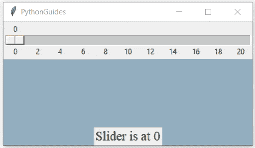

# python Tkinter Scale–详细教程

> 原文：<https://pythonguides.com/python-tkinter-scale/>

[](https://sharepointsky.teachable.com/p/python-and-machine-learning-training-course)

在本 [Python 教程](https://pythonguides.com/learn-python/)中，我们将了解到 `Python Tkinter Scale` ，也称为 `Python Tkinter Slide` 。此外，我们还将讨论以下主题:

*   Python Tkinter 比例微件
*   Python Tkinter 纵向扩展 dpi
*   Python Tkinter 比例窗口
*   Python Tkinter scale 命令
*   Python Tkinter 比例命令=lambda
*   Python Tkinter 比例默认值
*   Python Tkinter 比例获取值

目录

[](#)

*   [Python Tkinter scale 微件](#Python_Tkinter_scale_widget "Python Tkinter scale widget")
*   [Python Tkinter 纵向扩展 dpi](#Python_Tkinter_scale-up_dpi "Python Tkinter scale-up dpi")
*   [Python Tkinter 比例窗口](#Python_Tkinter_scale_window "Python Tkinter scale window")
*   [Python Tkinter scale 命令](#Python_Tkinter_scale_command "Python Tkinter scale command")
*   [Python tkinter scale command = lambda](#Python_tkinter_scale_commandlambda "Python tkinter scale command=lambda")
*   [Python Tkinter 比例默认值](#Python_Tkinter_scale_default_value "Python Tkinter scale default value")
*   [Python Tkinter scale 获取值](#Python_Tkinter_scale_get_value "Python Tkinter scale get value")

## Python Tkinter scale 微件

Python Tkinter 中的 Scale 小部件用于在应用程序上创建带有幻灯片的比例。此微件用于需要进行某些测量的应用中，使用 python Tkinter 比例尺的常见应用有:

*   微软 Word
*   写字板
*   绘图工具
*   音量混合器

下图显示了在所有版本的 Microsoft Windows 10 操作系统中都存在的 volume mixer 桌面应用程序中使用 scale 小部件。


Python Tkinter scale widget

Python Tkinter scale 可定向为垂直或水平格式。默认情况下，它设置为垂直方向。

**语法:-** 下面是在 Python Tkinter 中创建 scale 小部件的语法。

```py
Scale(
    master=ws,
    from_=0,
    to=200,
    orient=HORIZONTAL

).pack(side=BOTTOM)
```

**语法中的参数:-**

*   `master=ws` :父或子窗口名
*   `from_` :滑块的起始值
*   **到:**滑块的结束值
*   **方向**:方向可以是水平的，也可以是垂直的
*   `pack()` : pack 是几何图形管理器


Python Tkinter scale

还有，查: [Python 数字猜谜游戏](https://pythonguides.com/python-number-guessing-game/)

## Python Tkinter 纵向扩展 dpi

使用 Python Tkinter 创建应用程序时，如果您在微件上观察到模糊效果，则可以通过改变 dpi(每英寸点数)值来提高分辨率质量。

Python 的内置库 **'ctypes'** 提供了一个函数 SetProcessDpiAwareness()，它提高了 Python Tkinter 中屏幕分辨率的质量。

使用 Python Tkinter scale 小部件，我们可以创建一个基于 GUI 的交互式窗口，该窗口将接受用户输入来设置 dpi 值。

**示例:-**

在下面的例子中，我们创建了一个函数***【scale up(val)】***，这个函数用一个参数触发 SetProcessDpiAwareness()函数。

您可以使用 Python Tkinter 中的 get 函数获取 slider 或 scale 的值。我们已经将 scale.get()作为 SetProcessDpiAwareness 函数的参数进行了传递。现在，无论用户选择什么比例值，都将被赋予该功能。

> **请注意**–scale up(val)，这里的 *val* 只是一个参数，你需要传递它来使这个函数工作。

```py
**# modules**
from tkinter import *
import ctypes

**# window**
ws = Tk()
ws.title('PythonGuides')
ws.geometry('400x200')

**# function**
def scaleup(val):
    ctypes.windll.shcore.SetProcessDpiAwareness(`scale.get()`)

**# scale widget**
scale = Scale(
    ws,
    from_=0,
    to=1,
    length=200,
    orient=HORIZONTAL,
    command=scaleup,
    font=('sans-serif', 14)
)
scale.pack()

**# other widgets**
Label(ws, text='PythonGuides', font=('sans-serif', 20), pady=20).pack()
Button(ws, text='Click Here!', font=('sans-serif', 14)).pack()

**# infinite loop**
ws.mainloop()
```

**输出:-**

在下面的输出中，有两个标记为 1 和 2 的图像。第一幅图显示了默认输出，其中*`SetProcessDpiAwareness()`*函数的值设置为 0。

在下图中，SetProcessDpiAwareness()函数值设置为 1，您可以观察到窗口分辨率的提高。


Python Tkinter scale-up dpi

阅读: [Python Tkinter 过滤函数()](https://pythonguides.com/python-tkinter-filter/)

## Python Tkinter 比例窗口

缩放窗口意味着当用户上下或左右滑动缩放小部件时，改变 Tkinter 窗口的大小。

窗口中的几何方法决定了 Tkinter 窗口的大小，它需要强制参数，如宽度和高度，除此之外，您还可以提供 x 和 y 坐标来定位应用程序。

以下是在 Python Tkinter 中配置窗口几何的语法:

```py
ws.geometry('width x height + x + y')
```


在这种语法中，所有文本都是一个字符串，并且有操作符(x，+)。我们必须对 scale 小部件做类似的事情。

将使用 get()函数获取比例值，然后这些值将被转换为带有运算符符号的字符串。您也可以使用格式化字符串来执行这些操作。

**示例:-**

在下面的例子中，我们创建了两个窗口(父窗口和子窗口),并且在父窗口上放置了一个滑块。用户可以使用滑块改变子窗口的大小。

`scalewin(val)` 是改变 *win* 窗口大小的函数，win 是 ws 的子窗口。

```py
**# modules**
from tkinter import *

**# function**
def scalewin(val):
    **win.geometry(str(scale.get()) + 'x' + str(scale.get()))**

**# window**
ws = Tk()
ws.title('PythonGuides')

**# child window**
win = Toplevel(ws)
win.geometry()

**# scale widget**
scale = Scale(
    ws,
    from_= 100,
    to=1000,
    command=scalewin
)
scale.pack()

**# infinite loop**
ws.mainloop()
```

**输出:-**

在此输出中，窗口的大小随着缩放小部件上的滑块向上或向下移动而变化。


Python Tkinter scale window

在方法之后阅读: [Python Tkinter](https://pythonguides.com/python-tkinter-after-method/)

## Python Tkinter scale 命令

scale 小部件中的命令选项用于触发功能。它可以是普通函数，也可以是匿名函数。

在本节中，我们将学习使用普通函数在 Python Tkinter 中使用 scale 微件的命令选项。

**示例:-**

在我们的例子中，我们已经创建了一个函数，它将返回 Python Tkinter 中的滑块位置。每次用户移动标尺上的滑块时，都会触发一个功能，在窗口上显示一条消息。

以下是 Python Tkinter 中最后一个示例中使用的 scale 小部件的概述:

```py
scale = Scale(
    master = ws,
    from_ = 0,
    to=20,
    length=600,
    tickinterval=2,
    orient=HORIZONTAL,
    command = disp_val
)
scale.pack()
```

*   `master=ws` : widget 放置在名为 ws 的窗口上
*   `from_=0` :刻度从 0 开始
*   **到=20** :刻度结束于 20
*   `length=600` :标尺微件的长度
*   `tickinterval=2` :刻度值将乘以 2 出现
*   **方向=水平**:方向可以是水平或垂直
*   `command = disp _ val`:disp _ val 是每次在标尺上移动滑块时触发的功能名称。

以下是 Python Tkinter scale 命令的示例:

```py
**# module**
from tkinter import *

**# function**
def disp_val(val):
    var.set(f'Slider is at {scale.get()}')

**# create window**
ws = Tk()
ws.title('PythonGuides')
ws.geometry('400x200')
ws.config(bg='#93AEBF')

**# scale widget**
scale = Scale(
    master = ws,
    from_ = 0,
    to=20,
    length=600,
    tickinterval=2,
    orient=HORIZONTAL,
    command = disp_val
)
scale.pack()

**# variable with integer values only**
var = IntVar()

**# label widget to display selected number**
Label(
    ws,
    textvariable=var,
    font=('Times New Roman', 16)
).pack(side=BOTTOM)

**# infinite loop**
ws.mainloop() 
```

**输出:-**

在下面的输出中，当用户滑动 scale 小部件时，选定的数字会显示在窗口的底部。该数字会随着滑块值的变化而更新。



Python Tkinter scale command

读: [Python Tkinter messagebox](https://pythonguides.com/python-tkinter-messagebox/)

## Python tkinter scale command = lambda

Lambda 函数是一个匿名函数，这意味着它可以在一行中编写，主要用于单次任务。

了解更多: [Python 匿名函数(lambda 函数)](https://pythonguides.com/python-anonymous-function/)

在我们的例子中，我们提到了下面的代码来创建 Python Tkinter scale command = lambda。

```py
command=lambda val : var.set(scale.get()) 
```

**代码片段解释:**

*   **命令**:触发功能的是 scale 小工具中的选项。
*   `lambda val` :这里的 `val` 是自变量，虽然在程序中没有用到，但是没有自变量代码就无法运行。
*   **var.set():** 它会给标签设置值，这里 var 是代表标签的。
*   `scale.get()` :该命令将从 scale 小部件中获取选定的值。

下面是一个完整示例的实现:-

```py
**# modules**
from tkinter import *

**# window** 
ws = Tk()
ws.title('PythonGuides')
ws.geometry('400x200')
ws.config(bg='#93AEBF')

**# scale widget**
scale = Scale(
    master = ws,
    from_ = 0,
    to=20,
    length=600,
    tickinterval=2,
    orient=HORIZONTAL,
    **command=lambda val : var.set(scale.get())** 
)
scale.pack()

**# variable with integer value only**
var = IntVar()

**# label widget to display output**
Label(
    ws,
    textvariable=var,
    font=('Times New Roman', 16)
).pack(side=BOTTOM)

**# infinite loop**
ws.mainloop() 
```

**输出:-**

输出与上一节类似，只是这次是使用 Python Tkinter 中的 lambda 函数执行的。


Python Tkinter scale command

阅读: [Python Tkinter Spinbox](https://pythonguides.com/python-tkinter-spinbox/)

## Python Tkinter 比例默认值

Python Tkinter 比例微件允许在 Tkinter 微件上创建带有滑块的比例。根据窗口的方向，用户可以左右滑动或上下滑动。

Python Tkinter scale 默认值表示每次执行程序时都会显示一个特定的值。默认情况下，标尺将起始值设置为默认值，但可以使用标尺变量上的 `set()` 函数进行更改。

```py
**# module**
from tkinter import *

**# window**
ws = Tk()
ws.title('PythonGuides')
ws.geometry('600x200')

**# variable with integer values only**
var = IntVar()

**# set scale default value as 50**
var.set(50)

**# scale widget**
Scale(
    ws,
    label='Scale',
    tickinterval=5,
    variable=var,
    from_=10,
    to=100,
    length=500,
    orient=HORIZONTAL
).pack()

**# infinite loop**
ws.mainloop()
```

**输出:-**

因为我们已经将 scale 小部件的默认值设置为 50，所以每次执行程序时，滑块都会默认放置在 50 上。


Python Tkinter scale default value

阅读: [Python Tkinter 搜索框](https://pythonguides.com/python-tkinter-search-box/)

## Python Tkinter scale 获取值

Python Tkinter scale 中的 Get 方法用于获取小数位数的值。它将返回滑块当前所在的当前值。

创建标尺或滑块后，如果程序不使用用户选择的值来执行某个操作，则没有意义。

在这个例子中，我们创建了一个应用程序来显示标尺上滑块的当前位置。为此，我们使用了缩放、标签和按钮小部件。

使用 `scale.get()` 我们获取滑块当前位置的值，并基于该信息为

```py
from tkinter import *

def showval(val):
    if `scale.get()` == 1:
        ws.config(bg='#7AB3BF')
    elif `scale.get()` == 2:
        ws.config(bg='#868C54')
    elif `scale.get()` == 3:
        ws.config(bg='#F2EFEB')
    elif `scale.get()` == 4:
        ws.config(bg='#8C7484')
    elif `scale.get()` == 5:
        ws.config(bg='#0487D9')
    elif `scale.get()` == 6:
        ws.config(bg )
    else:
        ws.config(bg='#BF4C41')

ws = Tk()
ws.title('PythonGuides')
ws.geometry('300x200')

scale = Scale(
    ws,
    from_=0,
    to=10,
    length=200,
    orient=HORIZONTAL,
    command=showval
)
scale.pack(side=BOTTOM)

ws.mainloop()
```

**输出:-**

在此输出中，窗口的背景颜色随着 scale 小部件上滑块值的变化而变化。


Python Tkinter scale get value

您可能也想阅读下面的 Python Tkinter 教程。

*   [Python Tkinter 通断开关](https://pythonguides.com/python-tkinter-on-off-switch/)
*   [Python Tkinter 笔记本小工具](https://pythonguides.com/python-tkinter-notebook/)
*   [Python Tkinter 多窗口](https://pythonguides.com/python-tkinter-multiple-windows-tutorial/)
*   [Python Tkinter 图像+示例](https://pythonguides.com/python-tkinter-image/)
*   [Python Tkinter 分隔符](https://pythonguides.com/python-tkinter-separator/)

在本教程中，我们学习了 `Python Tkinter Scale` ，它也被称为 `Python Tkinter Slide` 。此外，还涵盖了以下主题:

*   Python Tkinter 比例尺
*   python Tkinter 纵向扩展 dpi
*   Python Tkinter 比例窗口
*   Python Tkinter 比例微件
*   Python Tkinter scale 命令
*   Python tkinter 比例命令=lambda
*   Python Tkinter 比例默认值
*   Python Tkinter 比例获取值

[Bijay Kumar](https://pythonguides.com/author/fewlines4biju/)

Python 是美国最流行的语言之一。我从事 Python 工作已经有很长时间了，我在与 Tkinter、Pandas、NumPy、Turtle、Django、Matplotlib、Tensorflow、Scipy、Scikit-Learn 等各种库合作方面拥有专业知识。我有与美国、加拿大、英国、澳大利亚、新西兰等国家的各种客户合作的经验。查看我的个人资料。

[enjoysharepoint.com/](https://enjoysharepoint.com/)[](https://www.facebook.com/fewlines4biju "Facebook")[](https://www.linkedin.com/in/fewlines4biju/ "Linkedin")[](https://twitter.com/fewlines4biju "Twitter")