# Python Tkinter 搜索框

> 原文：<https://pythonguides.com/python-tkinter-search-box/>

[](https://sharepointsky.teachable.com/p/python-and-machine-learning-training-course)

在本 [Python Tkinter 教程](https://pythonguides.com/python-gui-programming/)中，我们将讨论 `**Python Tkinter` 搜索框**。在这里，我们将学习如何在 Python Tkinter 中创建一个**搜索框，我们还将介绍与 **Tkinter 搜索框**相关的不同示例。并且，也涵盖这些话题。**

*   Python Tkinter 搜索框
*   Python Tkinter 搜索按钮
*   Python Tkinter 搜索文本
*   Python Tkinter 列表框搜索
*   Python Tkinter 树视图搜索
*   Python Tkinter 组合框搜索
*   Python Tkinter 搜索文件

目录

[](#)

*   [Python Tkinter 搜索框](#Python_Tkinter_search_box "Python Tkinter search box")
*   [Python Tkinter 搜索按钮](#Python_Tkinter_search_button "Python Tkinter search button")
*   [Python Tkinter 搜索文本](#Python_Tkinter_search_text "Python Tkinter search text")
*   [Python Tkinter 列表框搜索](#Python_Tkinter_Listbox_search "Python Tkinter Listbox search")
*   [Python Tkinter 树形视图搜索](#Python_Tkinter_treeview_search "Python Tkinter treeview search")
*   [Python Tkinter 组合框搜索](#Python_Tkinter_Combobox_search "Python Tkinter Combobox search")
*   [Python Tkinter 搜索文件](#Python_Tkinter_search_file "Python Tkinter search file  ")

## Python Tkinter 搜索框

在这一节中，我们将学习如何在 Python Tkinter 中**创建搜索框。**

搜索框是接受用户输入的搜索字段。用户在搜索框中输入他们想要搜索的文本或字母。

**代码:**

在下面的代码中，我们创建了一个小部件，在这个小部件中我们创建了一个用于查找文本的**搜索` `框**和**查找按钮**。

*   `Label()` 用于显示一个字段的文本或图像。
*   **按钮()**用于单击搜索文本。
*   `txt.insert()` 用于在文本字段中插入一些文本。
*   `txt.search()` 用于搜索文本。

```py
from tkinter import *

ws = Tk()
Frm = Frame(ws)
Label(Frm,text='Enter Word to Find:').pack(side=LEFT)
modify = Entry(Frm)

modify.pack(side=LEFT, fill=BOTH, expand=1)

modify.focus_set()

buttn = Button(Frm, text='Find')
buttn.pack(side=RIGHT)
Frm.pack(side=TOP)

txt = Text(ws)

txt.insert('1.0','''Enter here...''')
txt.pack(side=BOTTOM)

def find():

	txt.tag_remove('found', '1.0', END)
	ser = modify.get()
	if ser:
		idx = '1.0'
		while 1:
			idx = txt.search(ser, idx, nocase=1,
							stopindex=END)
			if not idx: break
			lastidx = '%s+%dc' % (idx, len(ser))

			txt.tag_add('found', idx, lastidx)
			idx = lastidx
		txt.tag_config('found', foreground='blue')
	modify.focus_set()
buttn.config(command=find)

ws.mainloop() 
```

**输出:**

在下面的输出中，我们看到用户输入文本并单击 Find 按钮。点击后，他们找到他们想要搜索的文本。

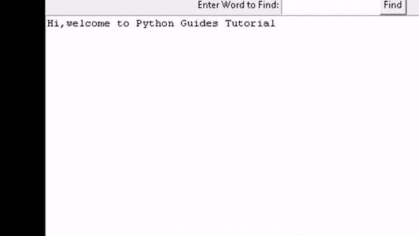

Python Tkinter search box

阅读: [Python Tkinter 通断开关](https://pythonguides.com/python-tkinter-on-off-switch/)

## Python Tkinter 搜索按钮

在本节中，我们将学习如何在 Python Tkinter 中创建一个搜索按钮。

“搜索”按钮用于提交搜索。用户在搜索框中输入文本。输入文本后，点击搜索按钮提交他们的搜索，并找到他们想要的文本。

**代码:**

在下面的代码中，我们创建了一个窗口 ws=Tk()，在这个窗口中我们创建了一个标签 button。

`Label()` 用来显示一个字段的文本。
**按钮()**用于提交文本。
`txt.insert()` 用于在文本字段中插入一些文本。
`txt.search()` 用于搜索文本。

```py
from tkinter import *

ws = Tk()
Frm = Frame(ws)
Label(Frm,text='Enter to search:').pack(side=LEFT)
modify = Entry(Frm)

modify.pack(side=LEFT, fill=BOTH, expand=1)

modify.focus_set()

buttn = Button(Frm, text='Search')
buttn.pack(side=RIGHT)
Frm.pack(side=TOP)

txt = Text(ws)

txt.insert('1.0','''Enter Text here...''')
txt.pack(side=BOTTOM)

def find():

	txt.tag_remove('found', '1.0', END)
	ser = modify.get()
	if ser:
		idx = '1.0'
		while 1:
			idx = txt.search(ser, idx, nocase=1,
							stopindex=END)
			if not idx: break
			lastidx = '%s+%dc' % (idx, len(ser))

			txt.tag_add('found', idx, lastidx)
			idx = lastidx
		txt.tag_config('found', foreground='blue')
	modify.focus_set()
buttn.config(command=find)

ws.mainloop() 
```

**输出:**

运行这段代码后，我们得到以下输出，其中我们看到用户输入了文本。输入文本后，点击搜索按钮提交搜索并找到他们想要的文本。

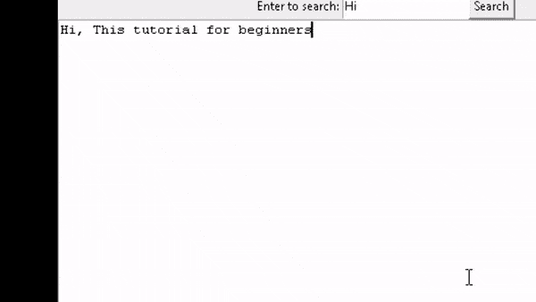

`Python Tkinter search button Output`

阅读: [Python Tkinter 验证示例](https://pythonguides.com/python-tkinter-validation/)

## Python Tkinter 搜索文本

在本节中，我们将学习如何在 Python Tkinter 中搜索文本。

搜索文本是在段落之间查找文本。用户在搜索框中输入他们想要搜索的文本，然后单击搜索按钮。点击按钮后，用户得到他们搜索的文本。

**代码:**

在下面的代码中，我们创建了一个窗口，在这个窗口中我们添加了一个搜索框和搜索按钮来搜索文本。

```py
from tkinter import *

ws = Tk()
Frm = Frame(ws)
Label(Frm,text='Enter Word to Find:').pack(side=LEFT)
modify = Entry(Frm)

modify.pack(side=LEFT, fill=BOTH, expand=1)

modify.focus_set()

buttn = Button(Frm, text='Find')
buttn.pack(side=RIGHT)
Frm.pack(side=TOP)

txt = Text(ws)

txt.insert('1.0','''English comprehension passage is the good test of your language skills. The questions in the reading comprehension exercise are mostly inference based...''')
txt.pack(side=BOTTOM)

def find():

	txt.tag_remove('found', '1.0', END)
	ser = modify.get()
	if ser:
		idx = '1.0'
		while 1:
			idx = txt.search(ser, idx, nocase=1,
							stopindex=END)
			if not idx: break
			lastidx = '%s+%dc' % (idx, len(ser))

			txt.tag_add('found', idx, lastidx)
			idx = lastidx
		txt.tag_config('found', foreground='blue')
	modify.focus_set()
buttn.config(command=find)

ws.mainloop()
```

**输出:**

运行以下代码后，我们得到以下输出，其中用户在搜索框中输入文本。点击搜索按钮后，我们得到用户想要的文本。

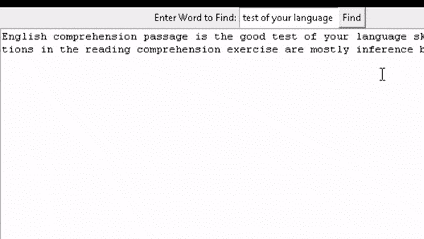

Python Tkinter search text Output

阅读: [Python Tkinter 笔记本 Widget](https://pythonguides.com/python-tkinter-notebook/)

## Python Tkinter 列表框搜索

在本节中，我们将学习如何在 Python Tkinter 中创建列表框搜索。

Listbox 用于向用户显示项目列表。并允许用户从列表中选择项目。用户在项目的列表框内单击以选择它。

**代码:**

在下面的代码中，我们创建了一个向用户显示项目列表的窗口。并创建一个入口小部件来输入要搜索的列表项。

`Entry()` 用于从列表框中输入要搜索的列表项。

```py
from tkinter import *

def Scankey(event):

	val = event.widget.get()
	print(val)

	if val == '':
		data = list
	else:
		data = []
		for item in list:
			if val.lower() in item.lower():
				data.append(item)				

	Update(data)

def Update(data):

	listbox.delete(0, 'end')

	# put new data
	for item in data:
		listbox.insert('end', item)

list = ('C','C++','Java',
	'Python','Perl',
	'PHP','ASP','JS' )

ws = Tk()

entry = Entry(ws)
entry.pack()
entry.bind('<KeyRelease>', Scankey)

listbox = Listbox(ws)
listbox.pack()
Update(list)

ws.mainloop()
```

**输出:**

在下面的输出中，我们看到了向用户显示项目列表的列表框。当用户想要从列表中搜索项目时。用户在搜索栏中输入项目名称，他们想要搜索的项目就会出现在顶部。

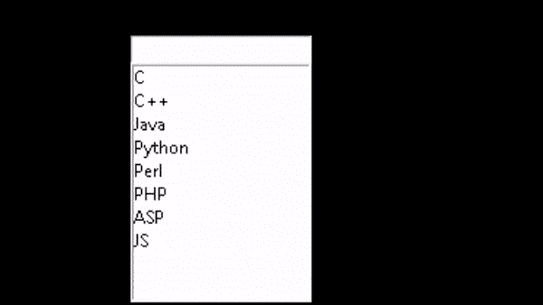

Python Tkinter Listbox search Output

阅读: [Python Tkinter 事件](https://pythonguides.com/python-tkinter-events/)

## Python Tkinter 树形视图搜索

在本节中，我们将学习如何在 Python Tkinter 中创建一个**树形视图搜索**。

Treeview 指的是分层表示。它改善了数据列的外观。在**t inter 树形视图搜索中，**我们想要搜索出现在这个**树形视图**中的名字。用户在搜索框中输入姓名，如果姓名出现在顶部的树形视图中，则单击搜索按钮。

**代码:**

在下面的代码中，我们创建了学生表和搜索框之间的连接。

*   `conn = connect("data1.db")` 创建打开的数据库。
*   `curs = conn.cursor()` 创建游标(将用户连接到数据库)。
*   `curs.execute(db1)` 在插入了我们想要执行的数据后。
*   `conn.commit()` 保存插入数据库的数据。
*   `conn.rollback()` 返回对数据库所做的最后更改。

```py
from tkinter import *
from tkinter import ttk
from tkinter.messagebox import *
from sqlite3 import *

ws = Tk()                       
ws.title("Python Guides")        
ws.geometry("750x700+400+50")  
ws.resizable(0, 0)            
view_window      

conn = None

conn = connect("data1.db")

curs = conn.cursor()

db = "create table student(rno int primary key, name text)"
curs.execute(db)

if conn is not None:
    conn.close()    

conn = None

conn = connect("data1.db")

curs = conn.cursor()

db1 = "insert into student values(1,'Pauline')"
db2 = "insert into student values(2,'Dexter')"
db3 = "insert into student values(3,'Melba')"
db4 = "insert into student values(4,'Roxanne')"
db5 = "insert into student values(5,'Mary')"
db6 = "insert into student values(6,'Andrew')"
db7 = "insert into student values(7,'Renata')"

curs.execute(db1)
curs.execute(db2)
curs.execute(db3)
curs.execute(db4)
curs.execute(db5)
curs.execute(db6)
curs.execute(db7)

conn.commit()

if conn is not None:
    conn.close()

def show():
    ws_ent.delete(0, END)     
    ws_ent.focus()
    treeview.selection()
    conn = None
    try:
        conn = connect("data1.db")    
        cursor = conn.cursor()
        db = "select * from student"   
        cursor.execute(db)

        fetchdata = treeview.get_children()       
        for elements in fetchdata:
            treeview.delete(elements)

        data = cursor.fetchall()
        for d in data:
            treeview.insert("", END, values=d)

        conn.commit()
    except Exception as e:
        showerror("Fail", e)
        conn.rollback()
    finally:
        if conn is not None:
            conn.close()
def search():
    treeview.selection()
    fetchdata = treeview.get_children()
    for f in fetchdata:
        treeview.delete(f)
    conn = None
    try:
        conn = connect("data1.db")
        core = conn.cursor()
        db = "select * from student where name = '%s' "
        name = ws_ent.get()
        if (len(name) < 2) or (not name.isalpha()):
            showerror("fail", "invalid name")
        else:
            core.execute(db %(name))
            data = core.fetchall()
            for d in data:
                treeview.insert("", END, values=d)

    except Exception as e:
        showerror("issue", e)

    finally:
        if conn is not None:
            conn.close()
def reset():
    show()  

scrollbarx = Scrollbar(ws, orient=HORIZONTAL)  
scrollbary = Scrollbar(ws, orient=VERTICAL)    
treeview = ttk.Treeview(ws, columns=("rollno", "name"), show='headings', height=22)  
treeview.pack()
treeview.heading('rollno', text="Roll No", anchor=CENTER)
treeview.column("rollno", stretch=NO, width = 100) 
treeview.heading('name', text="Name", anchor=CENTER)
treeview.column("name", stretch=NO)
scrollbary.config(command=treeview.yview)
scrollbary.place(x = 526, y = 7)
scrollbarx.config(command=treeview.xview)
scrollbarx.place(x = 220, y = 460)
style = ttk.Style()
style.theme_use("default")
style.map("Treeview")

ws_lbl = Label(ws, text = "Name", font=('calibri', 12, 'normal'))
ws_lbl.place(x = 290, y = 518)
ws_ent = Entry(ws,  width = 20, font=('Arial', 15, 'bold'))
ws_ent.place(x = 220, y = 540)
ws_btn1 = Button(ws, text = 'Search',  width = 8, font=('calibri', 12, 'normal'), command = search)
ws_btn1.place(x = 480, y = 540)
ws_btn2 = Button(ws, text = 'Reset',  width = 8, font=('calibri', 12, 'normal'), command = reset)
ws_btn2.place(x = 600, y = 540)

show()  
ws.mainloop() 
```

**输出:**

在下面的输出中，我们看到用户在搜索框中输入他们想要搜索的名字。输入姓名后，单击搜索按钮。点击它们后，名称会显示在顶部，然后再次重置并搜索另一个。

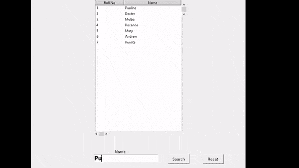

Python Tkinter Treeview Output

阅读: [Python Tkinter 列表框](https://pythonguides.com/python-tkinter-listbox/)

## Python Tkinter 组合框搜索

在这一节中，我们将学习如何在 Python Tkinter 中创建一个 Combobox 搜索。

**组合框**定义为下拉列表或列表框。我们可以键入要搜索的项目名称，也可以直接从下拉列表菜单中选择项目。

**语法:**

```py
combo = Combobox(master,option=value)
```

**代码:**

在下面的代码中，我们使用了**。ttk 导入组合框**库，用于导入组合框列表

*   `Entry()` 用户可以在 entrybox 中输入条目。他们想从组合框中搜索。
*   **按钮()**用于提交文本。

```py
from tkinter import *
from tkinter.ttk import Combobox

ws = Tk()
ws.title("Python Guides")
ws.geometry("200x200")

def search_items():
    search_value = variable.get()
    if search_value == "" or search_value == " ":
        combo['values'] = item_names
    else:
        value_to_display = []
        for value in item_names:
            if search_value in value:
                value_to_display.append(value)
        combo['values'] = value_to_display

item_names = list([str(a) for _ in range(100) for a in range(10)])

combo = Combobox(ws, state='readonly')
combo['values'] = item_names
combo.pack()

variable=StringVar()
entry1 = Entry(ws, textvariable=variable)
entry1.pack()

button = Button(ws, text="search", command=search_items)
button.pack()

ws.mainloop()
```

**输出:**

在下面的输出中，我们看到用户单击他们想要选择的项目的组合框。所选项目显示在输入框中。

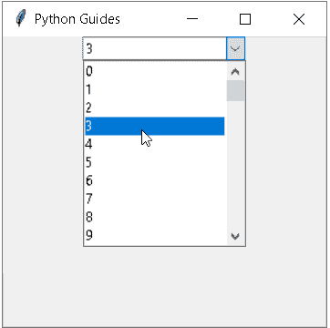

Python Tkinter Combobox search

我们还在输入框中输入我们想要搜索的项目。如本图所示，用户输入商品并点击搜索按钮。

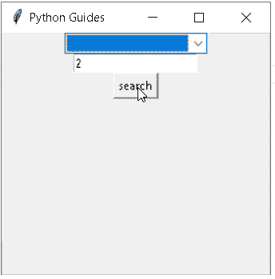

Python Tkinter Combobox search1

点击 search 按钮后，用户从 Combobox 中获取项目。

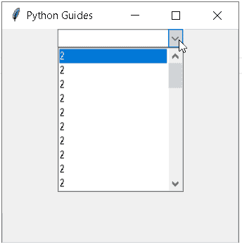

Python Tkinter Combobox search2

读: [Python Tkinter messagebox](https://pythonguides.com/python-tkinter-messagebox/)

## Python Tkinter 搜索文件

在本节中，我们将学习如何在 Python Tkinter 中创建搜索文件选项。

搜索文件是用于搜索存储在指定类别中的重要文件的选项。通过点击按钮。

**代码:**

在下面的代码中，我们创建了一个窗口 `ws = Tk()` 在这个窗口中，我们添加了一个带有文本**“选择文件”**的按钮。通过点击按钮，我们到达搜索文件位置并搜索文件。

*   `filedialog.askopenfile()` 函数显示对话框，允许用户选择文件并返回用户选择的文件。
*   `lambda` 函数只有一个表达式。

```py
from tkinter import *
from tkinter import filedialog
ws = Tk()
ws.title("Python Guides")
ws.geometry('200x200')

def ask_to_open_file():
   display = filedialog.askopenfile(initialdir="/")
   print(display)
   for j in display:
      print(j)

button = Button(ws, text ='Select file', command = lambda:ask_to_open_file())
button.pack(pady=10)
ws.mainloop()
```

**输出:**

运行这段代码后，我们得到以下输出，我们看到一个按钮被放置在小部件上。要搜索文件，我们单击“选择文件”按钮。

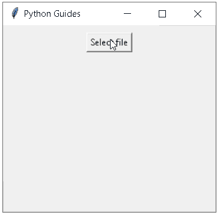

Python Tkinter search file

点击按钮后，对话框打开，我们可以在其中搜索我们需要的文件，并选择打开文件。

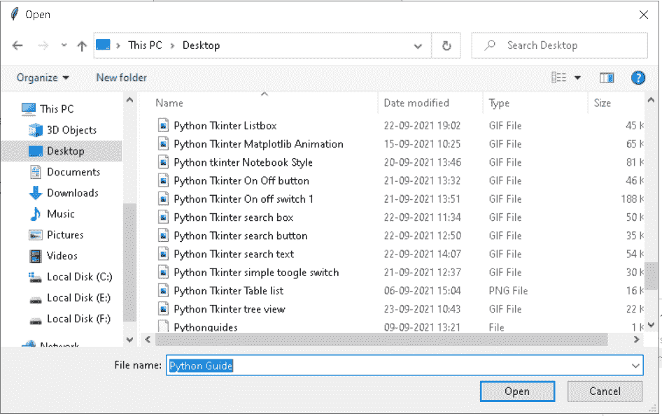

Python Tkinter search file1

单击 open 后，我们会看到命令提示符中显示的文件内的文本以及保存文件的位置。

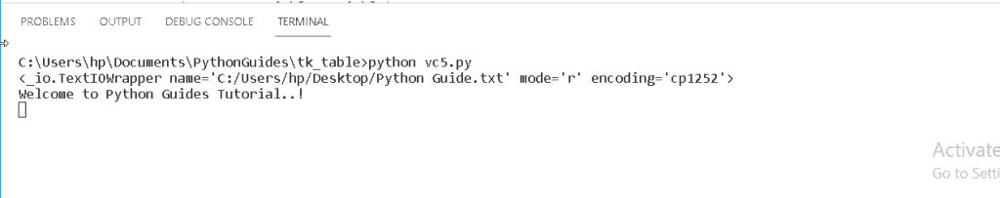

Python Tkinter search file2

你也可以阅读下面的 Tkinter 教程。

*   [Python Tkinter 帧](https://pythonguides.com/python-tkinter-frame/)
*   [Python Tkinter Scale](https://pythonguides.com/python-tkinter-scale/)
*   [Python Tkinter Menu bar](https://pythonguides.com/python-tkinter-menu-bar/)
*   [Python Tkinter Spinbox](https://pythonguides.com/python-tkinter-spinbox/)
*   [Python Tkinter 方法后](https://pythonguides.com/python-tkinter-after-method/)
*   [Python Tkinter 保存文本到文件](https://pythonguides.com/python-tkinter-save-text-to-file/)
*   [Python Tkinter Checkbutton](https://pythonguides.com/python-tkinter-checkbutton/)
*   [Python Tkinter 单选按钮](https://pythonguides.com/python-tkinter-radiobutton/)

因此，在本教程中，我们讨论了 **Python Tkinter 搜索框**，并且我们还涵盖了与其实现相关的不同示例。这是我们已经讨论过的例子列表。

*   Python Tkinter 搜索框
*   Python Tkinter 搜索按钮
*   Python Tkinter 搜索文本
*   Python Tkinter 列表框搜索
*   Python Tkinter 树视图搜索
*   Python Tkinter 组合框搜索
*   Python Tkinter 搜索文件

[Bijay Kumar](https://pythonguides.com/author/fewlines4biju/)

Python 是美国最流行的语言之一。我从事 Python 工作已经有很长时间了，我在与 Tkinter、Pandas、NumPy、Turtle、Django、Matplotlib、Tensorflow、Scipy、Scikit-Learn 等各种库合作方面拥有专业知识。我有与美国、加拿大、英国、澳大利亚、新西兰等国家的各种客户合作的经验。查看我的个人资料。

[enjoysharepoint.com/](https://enjoysharepoint.com/)[](https://www.facebook.com/fewlines4biju "Facebook")[](https://www.linkedin.com/in/fewlines4biju/ "Linkedin")[](https://twitter.com/fewlines4biju "Twitter")