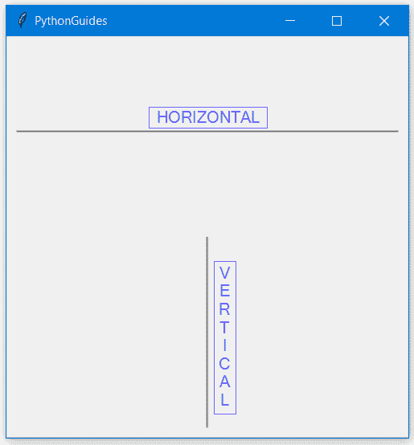
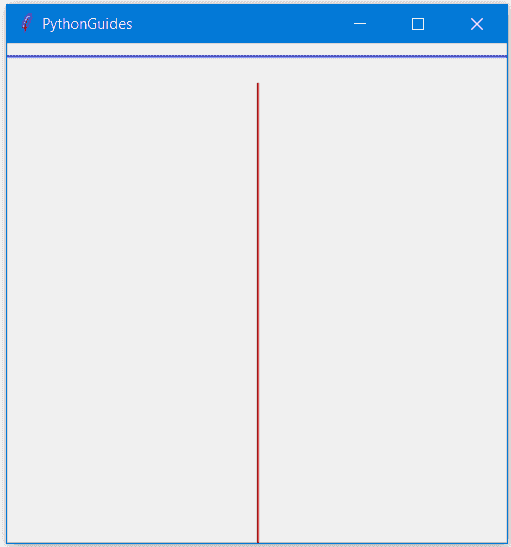
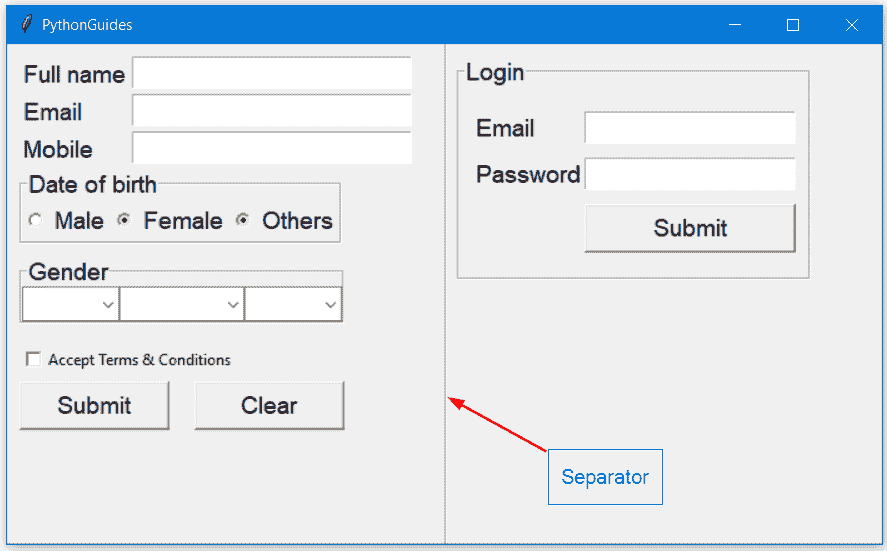
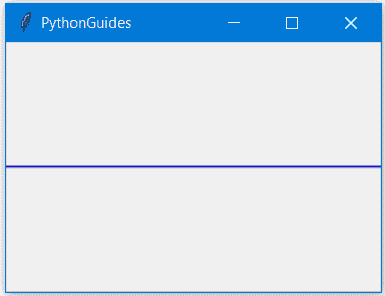
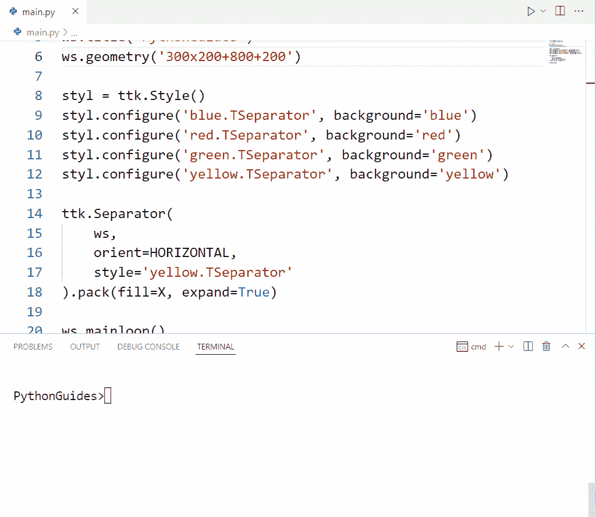
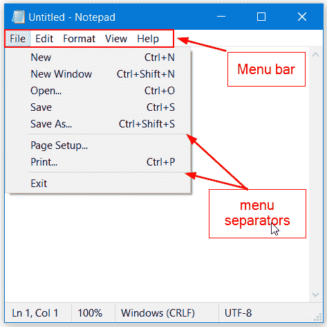
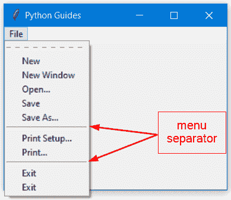
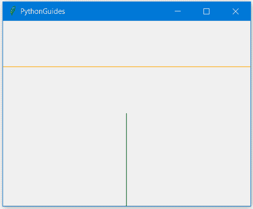
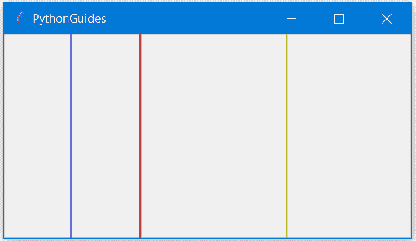

# Python Tkinter 分隔符+示例

> 原文：<https://pythonguides.com/python-tkinter-separator/>

[](https://sharepointsky.teachable.com/p/python-and-machine-learning-training-course)

在这个 [Python 教程](https://pythonguides.com/learn-python/)中，我们将学习如何使用 `Python Tkinter Separator` 小部件。此外，我们还将讨论以下主题:

*   Python Tkinter 分隔符
*   Python Tkinter 分隔符网格
*   Python Tkinter 分隔符示例
*   Python Tkinter 分隔符颜色
*   Python Tkinter 分隔符宽度
*   Python Tkinter 菜单添加分隔符
*   Python Tkinter 帧分隔符
*   Python Tkinter 垂直分隔符

目录

[](#)

*   [Python Tkinter 分隔符](#Python_Tkinter_Separator "Python Tkinter Separator")
*   [Python Tkinter 分隔符网格](#Python_Tkinter_Separator_Grid "Python Tkinter Separator Grid")
*   [Python Tkinter 分隔线示例](#Python_Tkinter_Separator_Line_Example "Python Tkinter Separator Line Example")
*   [Python Tkinter 分隔符颜色](#Python_Tkinter_Separator_Color "Python Tkinter Separator Color")
*   [Python Tkinter 分隔符宽度](#Python_Tkinter_Separator_Width "Python Tkinter Separator Width")
*   [Python Tkinter 菜单添加分隔符](#Python_Tkinter_Menu_Add_Separator "Python Tkinter Menu Add Separator")
*   [Python Tkinter 帧分隔符](#Python_Tkinter_Frame_Separator "Python Tkinter Frame Separator")
*   [Python Tkinter 垂直分隔符](#Python_Tkinter_Vertical_Separator "Python Tkinter Vertical Separator")

## Python Tkinter 分隔符

编写一个具有良好表现的软件是很重要的，因为这样可以节省用户的时间，最终有助于软件的普及。 **Python Tkinter 分隔符**用于对同一屏幕或窗口上的小工具进行分组。

这样，所有的窗口小部件看起来都很有条理，用户在使用应用程序时会感觉很舒服。

**语法:-**

下面是在 [Python Tkinter](https://pythonguides.com/python-gui-programming/) 中创建分隔符的语法。虽然我们已经提到了所有可用的选项，但是唯一的主参数是在 Python Tkinter 中创建分隔符所需的强制参数。

```py
`ttk.Separator(`
    `master`=ws,
    `orient`=HORIZONTAL,
    `style`='TSeparator',
    `class_`= ttk.Separator,
    `takefocus`= 1,
    `cursor`='plus'    
`)`.pack(fill=X, padx=10, expand=True)
```

**参数描述:-**

*   **master:** 要放置小工具的窗口名。它可以是父窗口或子窗口。
*   **orient:**[HORIZONTAL | VERTICAL]确保相应地调整几何图形管理器的填充选项值。我们设置了*填充=X* ，因为方向是水平的。
*   **style:** 您可以使用 style 自定义分隔符小部件的背景颜色。默认样式是 TSeparator。
*   您可以在程序中指定您想要继承其属性的类的名称。小部件名称是默认的类名。
*   **takefocus:** [0 | 1 ]如果 takefocus 设置为 0，那么 separator 小工具不会获得焦点，反之亦然。
*   **光标:**鼠标光标的图标每次悬停在分隔符小工具上时都会发生变化。（

*   **master:** 要放置小工具的窗口名。它可以是父窗口或子窗口。
*   **orient:**[HORIZONTAL | VERTICAL]确保相应地调整几何图形管理器的填充选项值。我们设置了*填充=X* ，因为方向是水平的。
*   **style:** 您可以使用 style 自定义分隔符小部件的背景颜色。默认样式是*t 分隔符*。
*   `class_` :您可以在程序中指定您想要继承其属性的类的名称。小部件名称是默认的类名。
*   **takefocus:** [0 | 1 ]如果 takefocus 设置为 0，那么 separator 小工具不会获得焦点，反之亦然。
*   **光标:**鼠标光标的图标每次悬停在分隔符小工具上时都会发生变化。(箭头、圆圈、时钟、十字、点盒、交换、芙蓉、心、人、老鼠、海盗、加号、舒特、上浆、蜘蛛、喷雾罐、星星、目标、tcross、迷航、手表)。

**示例:-**

在下面的例子中，我们创建了两个分隔符(水平和垂直)。

```py
**# modules**
from tkinter import ttk
from tkinter import *

**# instance of object**
ws = Tk()
ws.title('PythonGuides')
ws.geometry('400x400')

**# create styling**
styl = ttk.Style()
styl.configure('TSeparator', background='grey')

**# horizontal separator**
ttk.Separator(
    master=ws,
    orient=HORIZONTAL,
    style='TSeparator',
    class_= ttk.Separator,
    takefocus= 1,
    cursor='plus'    
).pack(fill=X, padx=10, expand=True)

**# vertical separator**
ttk.Separator(
    master=ws,
    orient=VERTICAL,
    style='TSeparator',
    class_= ttk.Separator,
    takefocus= 1,
    cursor='man'    
).pack(fill=Y, pady=10, expand=True)

**# infinite loop**
ws.mainloop()
```

在下面的输出中，您可以看到水平和垂直分隔符是使用 Python Tkinter 创建的。



python tkinter separator

阅读: [Python Tkinter 标签](https://pythonguides.com/python-tkinter-label/)

## Python Tkinter 分隔符网格

Grid 是一个几何管理器，它以行列格式放置小部件。这允许以表格格式组织应用程序小部件。

在我们开始讨论如何在 python Tkinter 中创建分隔符之前，让我们先回顾一下 Python Tkinter 中网格的基本概念:

*   行是水平网格，列是垂直网格。
*   网格中的列跨度和**行跨度**允许合并两个或多个列和行，但这些列必须被创建或占用。如果你已经创建了一个 5 行或 5 列的网格，并且你试图合并更多的行或列，那么它将只占据 5 行或 5 列。
*   Sticky 允许向任何方向拉伸网格。
*   `padx` 和 `pady` 在小工具外创建一个空间。
*   `ipadx` 和 `ipady` 在小工具内创建了一个空间。

使用网格几何管理器中的 `ipadx` 或 `ipady` 选项，我们可以在 Python Tkinter 中分隔小部件。 `ipadx` 将用于水平分离器，而 `pady` 将用于垂直分离器。

**示例:-**

在下面的示例中，我们演示了如何使用格网几何管理器创建 Python Tkinter Separator 微件。我们还展示了我们尝试过的各种选项，但没有作为评论。

```py
**# modules**
from tkinter import ttk
from tkinter import *

**# create window**
ws = Tk()
ws.title('PythonGuides')
ws.geometry('400x400')

**# style** 
styl = ttk.Style()
styl.configure('blue.TSeparator', background='blue')
styl.configure('red.TSeparator', background='red')

**# horizontal separator**
ttk.Separator(
    master=ws,
    orient=HORIZONTAL,
    style='blue.TSeparator',
    class_= ttk.Separator,
    takefocus= 1,
    cursor='plus'    
).grid(row=0, column=1, ipadx=200, pady=10)

**# ways that didn't worked**
#).grid(row=1,column=0,columnspan=4, sticky="ew", padx=10, pady=10) 
#).grid(row=0, columnspan=5, sticky=EW)
#).pack(fill=X, padx=10, expand=True)

**# vertical separator**
ttk.Separator(
    master=ws,
    orient=VERTICAL,
    style='red.TSeparator',
    class_= ttk.Separator,
    takefocus= 1,
    cursor='man'    
).grid(row=1, column=1, ipady=200, padx=10, pady=10)

**# infinite loop**
ws.mainloop()
```

下面是上面代码的输出，这里蓝线代表水平分隔符，而红线代表垂直分隔符。



Python Tkinter Separator Grid

阅读: [Python Tkinter 画布教程](https://pythonguides.com/python-tkinter-canvas/)

## Python Tkinter 分隔线示例

在本节中，我们将在 Python Tkinter 中创建一个具有 separator 小部件的项目。我们在同一个窗口中创建了注册和登录表单，并使用 Python Tkinter 分隔符将两者分开。

```py
from tkinter import *
from tkinter import ttk

ws = Tk()
ws.geometry('700x400')
ws.title('PythonGuides')

f = ('Helvetica', 14)

Label(
    ws, 
    text='Full name',
    font=f
).place(x=10, y=10)

Entry(ws, font=f).place(x=100, y=10)

Label(
    ws,
    text='Email',
    font=f
).place(x=10, y=40)

Entry(ws, font=f).place(x=100, y=40)

Label(
    ws,
    text='Mobile',
    font=f
).place(x=10, y=70)

Entry(ws, font=f).place(x=100, y=70)

genwin = LabelFrame(
    ws,
    text='Date of birth',
    font=f
)
genwin.place(x=10, y=100)

Radiobutton(
    genwin,
    text='Male',
    value=1,
    font=f
).pack(side=LEFT)

Radiobutton(
    genwin,
    text='Female',
    value=2,
    font=f
).pack(side=LEFT)

Radiobutton(
    genwin,
    text='Others',
    value=3,
    font=f
).pack(side=LEFT)

dobwin = LabelFrame(
    ws,
    text='Gender',
    font=f
)
dobwin.place(x=10, y=170)

ttk.Combobox(
    dobwin,
    values=['01', '02', '03', '04', '05', '06' ],
    width=5,
    font=f
).pack(side=LEFT)

ttk.Combobox(
    dobwin,
    values=['Janaury', 'February', 'March', 'April', 'May', 'June' ],
    width=7,
    font=f
).pack(side=LEFT)

ttk.Combobox(
    dobwin,
    values=['1995', '1996', '1997', '1998', '1999', '2000' ],
    width=5,
    font=f
).pack(side=LEFT)

Checkbutton(
    ws,
    text= 'Accept Terms & Conditions',

).place(x=10, y=240)

Button(
    ws,
    text='Submit',
    command=None,
    font=f,
    width=10
).place(x=10, y=270)

Button(
    ws,
    text='Clear',
    command=None,
    font=f,
    width=10
).place(x=150, y=270)

**ttk.Separator(
    ws,
    takefocus=0,
    orient=VERTICAL
).place(x=350, y=0, relheight=1)**

logwin = LabelFrame(
    ws, 
    text='Login',
    font=f,
    padx=10,
    pady=10
)
logwin.place(x=360, y=10)

Label(
    logwin, 
    text='Email',
    font=f,
    pady=10
).grid(row=0, column=0, sticky='w')

Entry(
    logwin, 
    font=f,
    width=15
    ).grid(row=0, column=1)

Label(
    logwin,
    text='Password',
    font=f
).grid(row=1, column=0)

Entry(
    logwin, 
    font=f,
    width=15
).grid(row=1, column=1)

Button(
    logwin,
    text='Submit',
    command=None,
    font=f
).grid(row=2, column=1, sticky=EW, pady=10)

ws.mainloop()
```

在下面的输出中，我们使用了 separator 小部件来组织注册和登录部分。



Python Tkinter Separator Line Example

阅读: [Python Tkinter 列表框](https://pythonguides.com/python-tkinter-listbox/)

## Python Tkinter 分隔符颜色

Python Tkinter Separator 提供了一个选项 `style` ，使用它我们可以改变分隔线的颜色。

分隔符小部件样式的默认名称是**t 分隔符**，但是您可以通过添加一个新名称后跟一个点(.)和旧名称，即 Python Tkinter 中的 TSeparator。

之后，这个新名称可以用来为 Python Tkinter Separator 小部件添加样式。以下是创建新名称的示例:

```py
styl = ttk.Style()
styl.configure('`blue.TSeparator`', background='blue')
```

在上面的脚本中，*蓝色。t operator*是创建的名称，背景颜色指定为蓝色。现在让我们看看如何在我们的程序中使用这种风格。

```py
ttk.Separator(
    ws,
    orient=HORIZONTAL,
    **style='blue.TSeparator'**
).pack()
```

下面是上面代码的输出，这里用 Python Tkinter 创建了一个跨越窗口的蓝色分隔符。



Python Tkinter Separator Color overview

您可以创建多种样式，并在程序中需要时使用它们。下面的示例演示了在 Python Tkinter 分隔符中使用多种颜色。

**源代码:**

在这段代码中，我们为 Python Tkinter 分隔符创建了多个具有不同背景颜色的样式。更改样式名称将会更改分隔符的颜色。

```py
from tkinter import *
from tkinter import ttk

ws = Tk()
ws.title('PythonGuides')
ws.geometry('300x200+800+200')

styl = ttk.Style()
styl.configure('blue.TSeparator', background='blue')
styl.configure('red.TSeparator', background='red')
styl.configure('green.TSeparator', background='green')
styl.configure('yellow.TSeparator', background='yellow')

ttk.Separator(
    ws,
    orient=HORIZONTAL,
    style='yellow.TSeparator'
).pack(fill=X, expand=True)

ws.mainloop()
```

**输出:**

在下面的输出中，我们展示了 Python Tkinter 分隔符的颜色。在 Python Tkinter 中，每次更改样式类型时，颜色都会发生变化。



Python Tkinter Separator Color

阅读: [Python Tkinter 帧](https://pythonguides.com/python-tkinter-frame/)

## Python Tkinter 分隔符宽度

Python Tkinter 中的 separator 小部件不提供任何改变其宽度的选项，但它提供了 class_ option。这意味着您可以使用创建一个类，然后在这里提供它的名称。

在你定制的类中，你可以执行其他活动，比如给分隔符分配高度、宽度、边框等。

我们认为这种方法是一种变通方法，要获得这方面的帮助，您可以参考下面的[网页](https://python-forum.io/thread-19625.html)。

## Python Tkinter 菜单添加分隔符

Python Tkinter 中的菜单栏用于在 Tkinter 窗口上显示菜单栏。向菜单项添加分隔符会显示相似项的分组。

请注意，这个分隔符不同于我们在整个博客中讨论的分隔符。这一部分是为了给仅在菜单项目之间的菜单栏中使用的部分留出空间。

下图显示了 Python Tkinter 中菜单栏的示例，以及在流行的记事本应用程序中分隔符的使用。



Python Tkinter Menu Add Separator

可以使用 `add_separator()` 方法将分隔符添加到菜单栏。

**源代码:**--

在下面的源代码中，我们创建了一个菜单栏，并在打印设置之前和打印菜单项之后添加了一个分隔符。

```py
**# modules**
from tkinter import *

**# create window**
ws =Tk()
ws.title("Python Guides")
ws.geometry("300x200")

**# create menu**
menubar = Menu(ws) 

**# use menu**
file = Menu(menubar)  

**# add menu items**
file.add_command(label='New')  
file.add_command(label='New Window')  
file.add_command(label='Open...')  
file.add_command(label='Save')    
file.add_command(label='Save As...') 

**# add Separator**
file.add_separator()  
file.add_command(label='Print Setup...') 
file.add_command(label='Print...') 

**# add separator**
file.add_separator()
file.add_command(label='Exit') 
file.add_command(label="Exit", command=ws.quit)  
menubar.add_cascade(label="File", menu=file)  

**# add menu on the screen**
ws.config(menu=menubar)

**# infinite loop**
ws.mainloop()
```

下面是上面代码的输出，在这里你可以看到 Python Tkinter 中带有分隔符的菜单栏。



Python Tkinter add Separator on menu widget

阅读: [Python Tkinter 菜单栏](https://pythonguides.com/python-tkinter-menu-bar/)

## Python Tkinter 帧分隔符

框架是用来在其上存储其他部件的容器部件。分隔符和框架有一个共同点，它们都用来组织窗口上的其他小部件。

因为我们在 Python Tkinter 中有一个分隔符，所以不建议使用框架在 Tkinter 应用程序上执行分隔。但是既然有人问了，我们就告诉你怎么做。

该解决方案只是一种变通方法，使框架看起来和行为像 Python Tkinter 中的分隔符小部件。

**源代码:-**

在下面的源代码中，我们创建了两个看起来与 Python Tkinter 中的 separator 小部件相同的框架。橙色线是水平线，绿色线是使用 Python Tkinter 中的 frame 小部件创建的垂直线。

```py
from tkinter import *
from tkinter import ttk

ws =Tk()
ws.title('PythonGuides')
ws.geometry('400x300')

**frame = Frame(
    ws,
    bg='orange',
)
frame.pack(fill=X, expand=True)

frame2 = Frame(
    ws, 
    bg='green',
)
frame2.pack(fill=Y, expand=True)**

ws.mainloop()
```

**输出:-**

在下面的输出中，您可以看到使用 Python Tkinter 中的 frame 小部件创建了两个分隔符。



Python Tkinter Frame Separator

阅读: [Python Tkinter Checkbutton](https://pythonguides.com/python-tkinter-checkbutton/)

## Python Tkinter 垂直分隔符

分隔符可以在窗口的水平和垂直位置对齐。默认位置是水平的。在这一节中，我们将学习如何在 Python Tkinter 中创建一个垂直分隔符。

通过将 orient 值设置为 Vertical，可以创建垂直分隔符。所有的单词都必须大写。如果你想使用小写，那么把它放在引号内(“垂直”)。

应用几何管理器时，请确保在 Python Tkinter 中为不同的几何管理器(打包、网格和放置)应用以下设置:

*   Pack( **fill=Y，expand=True** ) :-这将在垂直方向拉伸分隔符。
*   Grid( `ipady=100` ) :- ipady 在小部件内部垂直创建一个空间。
*   Place( `relheight=1` ) :-相对高度将在垂直位置拉伸分离器。

**示例:-**

在下面的例子中，我们演示了如何使用所有的几何图形管理器创建一个垂直分隔符。因为我们不能在同一个窗口中使用所有的几何图形管理器，这就是为什么我们使用了容器部件框架。

```py
**# modules**
from tkinter import *
from tkinter import ttk

**# create window**
ws = Tk()
ws.title('PythonGuides')
ws.geometry('400x200')

**# frames to store separators with different geometry managers**
frame1 = Frame(ws)
frame1.pack(side=LEFT, expand=True, fill=BOTH)

frame2 = Frame(ws)
frame2.pack(side=LEFT, expand=True, fill=BOTH)

frame3 = Frame(ws)
frame3.pack(side=LEFT, expand=True, fill=BOTH)

**# style to add colors on separators**
styl = ttk.Style()
styl.configure('red.TSeparator', background='red')
styl.configure('blue.TSeparator', background='blue')
styl.configure('yellow.TSeparator', background='yellow')

**# vertical separator with pack geometry manager**
ttk.Separator(
    frame1,
    orient=VERTICAL,
    style='blue.TSeparator'
).pack(fill=Y, expand=True)

**# vertical separator with grid geometry manager**
ttk.Separator(
    frame2,
    orient=VERTICAL,
    style='red.TSeparator'
).grid(row=0, column=0, ipady=200)

**# vertical separator with place geometry manager**
ttk.Separator(
    frame3,
    orient=VERTICAL,
    style='yellow.TSeparator'
).place(x=10, y=0, relheight=1)

**# infinite loop**
ws.mainloop()
```

下面的输出显示了 Python Tkinter 中的垂直分隔符小部件。每条线是在不同的几何图形管理器上创建的。



Python Tkinter Vertical Separator

另外，看看更多的 Python Tkinter 教程。

*   [Python Tkinter 单选按钮](https://pythonguides.com/python-tkinter-radiobutton/)
*   [Python Tkinter Map()函数](https://pythonguides.com/python-tkinter-map-function/)
*   [Python Tkinter 退出程序](https://pythonguides.com/python-tkinter-exit-program/)
*   [Python Tkinter 待办事项列表](https://pythonguides.com/python-tkinter-todo-list/)
*   [使用 Python Tkinter 的费用跟踪器](https://pythonguides.com/expense-tracking-application-using-python-tkinter/)

在本教程中，我们学习了如何使用 **Python Tkinter 分隔符**小部件。此外，我们还讨论了以下主题:

*   Python Tkinter 分隔符
*   Python Tkinter 分隔符网格
*   Python Tkinter 分隔符示例
*   Python Tkinter 分隔符颜色
*   Python Tkinter 分隔符宽度
*   Python Tkinter 菜单添加分隔符
*   Python Tkinter 帧分隔符
*   Python Tkinter 垂直分隔符

[Bijay Kumar](https://pythonguides.com/author/fewlines4biju/)

Python 是美国最流行的语言之一。我从事 Python 工作已经有很长时间了，我在与 Tkinter、Pandas、NumPy、Turtle、Django、Matplotlib、Tensorflow、Scipy、Scikit-Learn 等各种库合作方面拥有专业知识。我有与美国、加拿大、英国、澳大利亚、新西兰等国家的各种客户合作的经验。查看我的个人资料。

[enjoysharepoint.com/](https://enjoysharepoint.com/)[](https://www.facebook.com/fewlines4biju "Facebook")[](https://www.linkedin.com/in/fewlines4biju/ "Linkedin")[](https://twitter.com/fewlines4biju "Twitter")