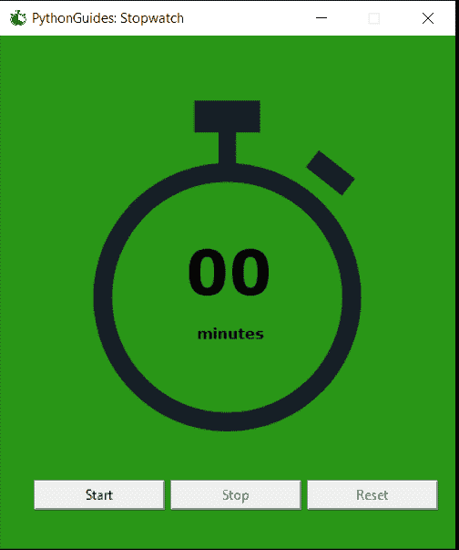

# Python Tkinter 秒表(Python 中的秒表源代码)

> 原文：<https://pythonguides.com/python-tkinter-stopwatch/>

[](https://sharepointsky.teachable.com/p/python-and-machine-learning-training-course)

在本教程中，我们将学习如何使用 [Python tkinter](https://pythonguides.com/python-gui-programming/) 创建一个简单的秒表。用 Python 创建秒表很容易。让我们从 **Python Tkinter 秒表**开始。

目录

[](#)

*   [关于秒表](#About_Stopwatch "About Stopwatch")
*   [Python 中的秒表概述](#Overview_of_Stopwatch_in_Python "Overview of Stopwatch in Python")
*   [Python 中的秒表源代码](#Stopwatch_source_code_in_Python "Stopwatch source code in Python")

## 关于秒表

*   秒表是简单的数字计数。
*   它以秒为单位计时&帮助用户了解他/她完成任务花了多少时间。
*   稍后，对这些时间偏差进行分析，并制定进一步的计划。
*   没有秒表就不可能有比赛。

## Python 中的秒表概述

*   秒表有两种类型:
    *   向前计数
    *   反向计数
*   如果没有按下 reset 或 stop，向前计数秒表会持续增加，直到无限秒。
*   反向秒表配有数字&它按递减顺序移动，直到变为零。
*   逆向秒表也叫**倒计时表**。
*   我们分开岗位进行倒计时观察。
*   在本节中，我们将讨论转发秒表。
*   秒表有**开始**，**停止** &，**复位**选项。
*   **开始**按钮开始或恢复显示屏上的计数
*   **停止**按钮停止计数，然后&出现。
*   **重置**按钮将计时器重置回 0 或起点。

## Python 中的秒表源代码

在这一节中，我们将解释用 Python 编写**秒表的简单方法。建议请去扔整个博客。**

**第一步:**

从 tkinter 模块导入所有内容

```py
from tkinter import *
```

**第二步:**

配置主应用程序窗口

```py
ws = Tk()
ws.geometry('400x450+1000+300')
ws.title('PythonGuides: Stopwatch')
ws.config(bg='#299617')
ws.iconbitmap('stopwatch.ico')
ws.resizable(0,0)
```

*   主应用程序窗口被创建&命名为 `ws` ，这是 workspace 的简写。
*   **几何图形**包括窗口的尺寸&位置。
    *   这里，400 是主应用程序的宽度。
    *   450 是主应用的高度。
    *   1000 是主应用程序的 x 位置。
    *   300 是主应用程序的 y 位置。
*   **标题**是出现在主应用程序窗口顶部的文本。
*   ws.config(bg='colorname 或 hex code ')这个代码用于设置主应用程序的背景颜色。
*   **图标位图**用于设置主应用窗口上的图标。默认图标是特征。
*   `resizable` 决定用户可以拉伸的窗口大小。
    *   它接受 x 和 y 值
    *   在这种情况下，值为 0，0 表示窗口不能调整大小。

步骤 3:放置秒表的图像

```py
bg = PhotoImage(file='stopwatch.png')
img = Label(ws, image=bg, bg='#299617')
img.place(x=75, y=50)
```

*   我们已经使用 logomakr.com 创建了一个图像
*   bg 存储使用照片图像获得的图像
*   使用图像选项将图像放置在标签上
*   请参考我们的标签部分，了解更多关于标签的信息。

**第四步:**

在主应用程序窗口上放置按钮。

```py
start_btn=Button(
    ws, 
    text='Start', 
    width=15, 
    command=lambda:StartTimer(lbl)
    )

start_btn.place(x=30, y=390) 
```

*   按钮是用来执行一个动作的
*   下面的按钮请参考我们的按钮部分
*   这里，我们将查看命令选项，命令是单击按钮时将执行的操作。
*   我们已经为启动、停止和重置创建了一个带参数的独立函数。
*   在使用 command 关键字的按钮中，我们可以传递函数，但问题是我们不能将参数传递给那个函数。为此，我们使用了[匿名函数**λ**。](https://pythonguides.com/python-anonymous-function/)

**第五步:**

创建全局变量

```py
counter = -1
running = False
```

*   函数中使用的 Python 变量仅限于该函数
*   如果我们想在另一个函数中使用一个特定的变量，那么我们必须将这个变量声明为全局变量。
*   在 python 的这个秒表源代码中，我们将 counter & running 声明为一个全局变量。
*   任何引用这些变量的函数必须在变量名前使用**全局**关键字
*   这两个变量后来被用在多个函数中。
*   任何函数对这些变量的改变都会被其他函数观察到。
*   例如，如果任何函数将计数器的值设置为 10，则使用 counter 的其他函数也将计数器值设置为 10。

**第六步:**

解释函数

*   **counter_label()和 count()**

```py
def counter_label(lbl):
    def count():
        if running:
            global counter
            if counter==-1:             
                display="00"
            else:
                display=str(counter)

            lbl['text']=display    

            lbl.after(1000, count)    
            counter += 1
    count() 
```

*   在这段代码中，counter_label 接受参数 label。
*   count()是 counter_label 中传递的另一个函数。
*   `if running` 表示 `if running == True` ，if 语句下面的程序将一直工作到时间 running 为真。
*   当 running 设置为 false 时，将停止计数
*   全局计数器，我们在这里调用这个函数之外的变量计数器。
*   直到时间计数器为-1，它将在屏幕上显示 00。
*   当用户点击操作按钮时，该功能将被激活，计数器将从-1 增加到 n。
*   计数器每 1000 毫秒增加一次。
*   最后，这个函数将返回当前的计数器时间

*   `StartTimer()`

```py
def StartTimer(lbl):
    global running
    running=True
    counter_label(lbl)
    start_btn['state']='disabled'
    stop_btn['state']='normal'
    reset_btn['state']='normal'
```

*   这是当用户点击**开始**按钮时调用的函数。
*   在这个函数内部调用了 `counter_label` 函数。
*   每次单击开始按钮，它都会立即被禁用&用户将无法再次单击它。
*   此外，它还启用**停止**和**复位**按钮。这意味着用户可以点击这些按钮。

`StopTimer()`

```py
def StopTimer():
    global running
    start_btn['state']='normal'
    stop_btn['state']='disabled'
    reset_btn['state']='normal'
    running = False
```

*   当用户点击停止按钮时，这些函数将被调用。
*   这将运行设置为假。
*   这意味着， `counter_label()` 函数中发生的活动现在将停止。
*   此外，它还会禁用停止按钮&用户将无法再次点击它。
*   并且会启用**开始`T4`复位**按钮。
*   因此，现在用户既可以通过点击开始按钮来恢复计数器，也可以重置它。

**重置计时器()**

```py
def ResetTimer(lbl):
    global counter
    counter=-1
    if running==False:      
        reset_btn['state']='disabled'
        lbl['text']='00'
    else:                          
        lbl['text']=''
```

*   当用户点击**复位**按钮时，调用复位功能。
*   计数器将再次设置为默认值，即-1
*   Running 将设置为 false，出现在主应用程序窗口上的文本将设置为 00。
*   这样，所有的东西都将开始出现，类似于程序运行时出现的屏幕。

**代码:**

```py
from tkinter import *

ws = Tk()
ws.geometry('400x450+1000+300')
ws.title('PythonGuides: Stopwatch')
ws.config(bg='#299617')
ws.iconbitmap('stopwatch.ico')
ws.resizable(0,0)

counter = -1
running = False
def counter_label(lbl):
    def count():
        if running:
            global counter
            if counter==-1:             
                display="00"
            else:
                display=str(counter)

            lbl['text']=display    

            lbl.after(1000, count)    
            counter += 1
    count()     

def StartTimer(lbl):
    global running
    running=True
    counter_label(lbl)
    start_btn['state']='disabled'
    stop_btn['state']='normal'
    reset_btn['state']='normal'

def StopTimer():
    global running
    start_btn['state']='normal'
    stop_btn['state']='disabled'
    reset_btn['state']='normal'
    running = False

def ResetTimer(lbl):
    global counter
    counter=-1
    if running==False:      
        reset_btn['state']='disabled'
        lbl['text']='00'
    else:                          
        lbl['text']=''

bg = PhotoImage(file='stopwatch.png')
img = Label(ws, image=bg, bg='#299617')
img.place(x=75, y=50)

lbl = Label(
    ws, 
    text="00", 
    fg="black", 
    bg='#299617', 
    font="Verdana 40 bold"
    )

label_msg = Label(
    ws, text="minutes", 
    fg="black", 
    bg='#299617', 
    font="Verdana 10 bold"
    )

lbl.place(x=160, y=170)
label_msg.place(x=170, y=250)

start_btn=Button(
    ws, 
    text='Start', 
    width=15, 
    command=lambda:StartTimer(lbl)
    )

stop_btn = Button(
    ws, 
    text='Stop', 
    width=15, 
    state='disabled', 
    command=StopTimer
    )

reset_btn = Button(
    ws, 
    text='Reset', 
    width=15, 
    state='disabled', 
    command=lambda:ResetTimer(lbl)
    )

start_btn.place(x=30, y=390)
stop_btn.place(x=150, y=390)
reset_btn.place(x=270, y=390)

ws.mainloop()
```

**输出:**



您可能会喜欢以下 Python 教程:

*   [如何在 Python + Python Tkinter 计算器中制作计算器](https://pythonguides.com/make-a-calculator-in-python/)
*   [Python 命名空间教程](https://pythonguides.com/python-namespace-tutorial/)
*   [Python 读取二进制文件(示例)](https://pythonguides.com/python-read-a-binary-file/)
*   [如何使用 Turtle 在 python 中绘制形状](https://pythonguides.com/turtle-programming-in-python/)
*   [Python 要求用户输入(示例)](https://pythonguides.com/python-ask-for-user-input/)
*   [如何将 Python 字符串转换成字节数组并举例](https://pythonguides.com/python-string-to-byte-array/)

我希望现在你可以用 python 创建一个**秒表，并学习如何使用 **python 秒表类**和 **python 秒表模块**。在这里，我们学习了 Python Tkinter 秒表，您获得了 Python** 中的**秒表源代码。**

[Bijay Kumar](https://pythonguides.com/author/fewlines4biju/)

Python 是美国最流行的语言之一。我从事 Python 工作已经有很长时间了，我在与 Tkinter、Pandas、NumPy、Turtle、Django、Matplotlib、Tensorflow、Scipy、Scikit-Learn 等各种库合作方面拥有专业知识。我有与美国、加拿大、英国、澳大利亚、新西兰等国家的各种客户合作的经验。查看我的个人资料。

[enjoysharepoint.com/](https://enjoysharepoint.com/)[](https://www.facebook.com/fewlines4biju "Facebook")[](https://www.linkedin.com/in/fewlines4biju/ "Linkedin")[](https://twitter.com/fewlines4biju "Twitter")