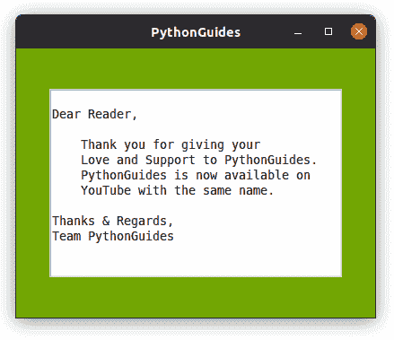
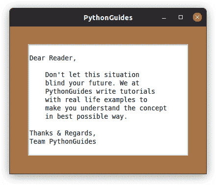
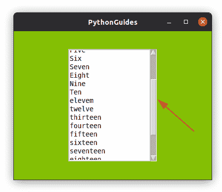
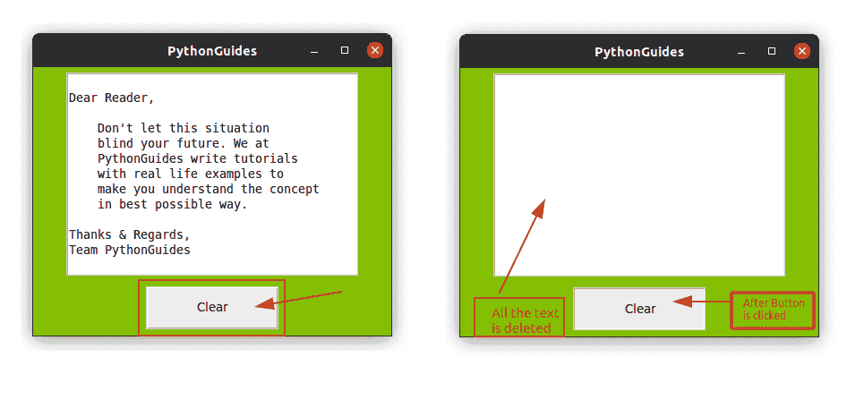
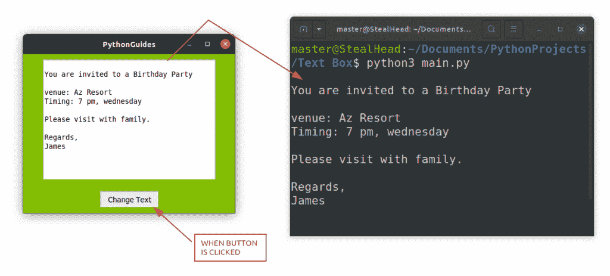
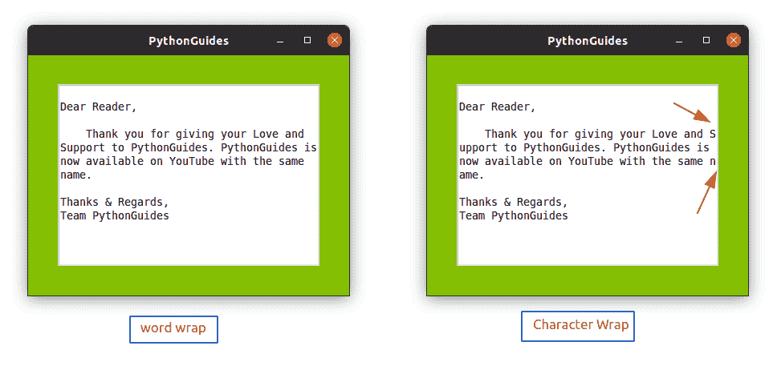
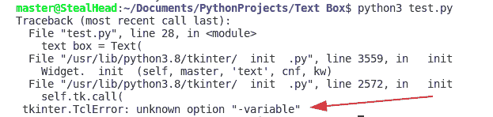
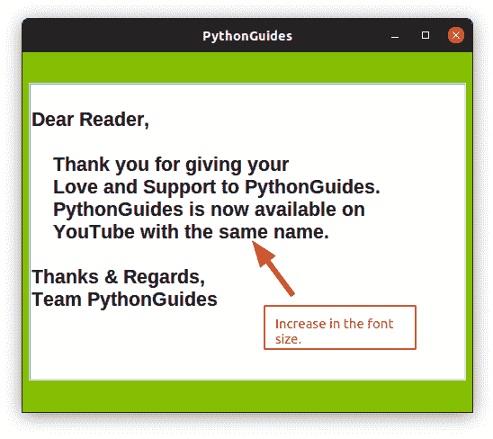

# Python Tkinter 文本框小部件+示例

> 原文：<https://pythonguides.com/python-tkinter-text-box/>

[](https://sharepointsky.teachable.com/p/python-and-machine-learning-training-course)

**Python Tkinter 文本框小部件**是入口小部件的高级版本，涵盖了 Python Tkinter 中入口小部件的所有缺点。在本教程中，我们将学习关于文本小部件的一切。此外，我们将涵盖这些主题。

*   Python Tkinter 文本框不可编辑
*   Python Tkinter 文本框大小
*   Python Tkinter 文本框滚动条
*   Python Tkinter 文本框清除
*   Python Tkinter 文本框获取值
*   Python Tkinter 文本框自动换行
*   Python Tkinter 文本框变量
*   Python Tkinter 文本框集文本
*   Python Tkinter 文本框示例
*   Python Tkinter 文本粗体

如果你是 Tkinter 新手，请查看 [Python TKinter 编程](https://pythonguides.com/python-gui-programming/)。

目录

[](#)

*   [Python Tkinter 文本框不可编辑](#Python_Tkinter_Text_Box_Not_Editable "Python Tkinter Text Box Not Editable")
*   [Python Tkinter 文本框大小](#Python_Tkinter_Text_Box_Size "Python Tkinter Text Box Size")
*   [Python Tkinter 文本框滚动条](#Python_Tkinter_Text_Box_Scrollbar "Python Tkinter Text Box Scrollbar")
*   [Python Tkinter 文本框清除](#Python_Tkinter_Text_Box_Clear "Python Tkinter Text Box Clear")
*   [Python Tkinter 文本框获取值](#Python_Tkinter_Text_Box_Get_Value "Python Tkinter Text Box Get Value")
*   [Python Tkinter 文本框自动换行](#Python_Tkinter_Text_Box_Word_Wrap "Python Tkinter Text Box Word Wrap")
*   [Python Tkinter 文本框变量](#Python_Tkinter_Text_Box_Variable "Python Tkinter Text Box Variable")
*   [Python Tkinter 文本框设置文本](#Python_Tkinter_Text_Box_Set_Text " Python Tkinter Text Box Set Text")
*   [Python Tkinter 文本框示例](#Python_Tkinter_Text_Box_Example "Python Tkinter Text Box Example")
*   [Python Tkinter Text Bold](#Python_Tkinter_Text_Bold "Python Tkinter Text Bold")

## Python Tkinter 文本框不可编辑

*   Python Tkinter 中的**文本框小部件提供了一个**状态**选项，使用该选项可以禁用文本框。一旦禁用，用户将无法在 Python Tkinter 中编辑文本框的内容。**
*   文本框的**状态**可以是**禁用**或**正常**，使用状态选项的语法为:

```py
# set the Text widget to Not Editable mode
text_box.config(state='disabled')

# set the Text widget to Editable mode
text_box.config(state='normal') 
```

**完整代码:**

下面是实现文本框不可编辑的完整代码。

```py
from tkinter import *

ws = Tk()
ws.title('PythonGuides')
ws.geometry('400x300')
ws.config(bg='#84BF04')

message ='''
Dear Reader,

    Thank you for giving your
    Love and Support to PythonGuides.
    PythonGuides is now available on 
    YouTube with the same name.

Thanks & Regards,
Team PythonGuides '''

text_box = Text(
    ws,
    height=12,
    width=40
)
text_box.pack(expand=True)
text_box.insert('end', message)
text_box.config(state='disabled')

ws.mainloop()
```

**输出:**

下面是上面代码的输出，在这个输出中，用户不能对提供的文本进行任何修改。



Non Editable Text Box Python

阅读:[Python Tkinter Entry–如何使用](https://pythonguides.com/python-tkinter-entry/)

## Python Tkinter 文本框大小

`Python Tkinter`中的文本框大小可以通过改变文本框小工具的**高度**和**宽度**的值来调整。

*   `Height` 是文本框小工具中的行数。
*   **宽度**决定文本框小工具中的列数。
*   在下面的代码片段中，我们将高度设为 12，宽度设为 40。

```py
text_box = Text(
    ws,
    height=12,
    width=40
)
text_box.pack()
```

**程序的完整代码:**

下面是用 Python Tkinter 实现文本框大小的程序的完整代码。高度和宽度决定了 Python Tkinter 中文本框的大小。

```py
from tkinter import *

ws = Tk()
ws.title('PythonGuides')
ws.geometry('400x300')
ws.config(bg='#A67449')

message ='''
Dear Reader,

    Don't let this situation
    blind your future. We at
    PythonGuides write tutorials
    with real life examples to 
    make you understand the concept
    in best possible way.

Thanks & Regards,
Team PythonGuides '''

text_box = Text(
    ws,
    height=13,
    width=40
)
text_box.pack(expand=True)
text_box.insert('end', message)

ws.mainloop()
```

**Python Tkinter 中文本框大小的输出**:

在这个输出中，您可以通过计算行数来确定程序的高度，通过计算包括空格在内的字数来确定宽度。



Python Tkinter Text Box Size

阅读: [Python Tkinter 按钮–如何使用](https://pythonguides.com/python-tkinter-button/)

## Python Tkinter 文本框滚动条

Python Tkinter 文本框中的数据可能会超过屏幕的大小。在这种情况下，滚动条帮助用户在屏幕上水平和垂直导航。

*   在这一节中，我们将学习如何在 Python Tkinter 中的文本框上实现滚动条。
*   实现滚动条的最佳实践是将 **Python Tkinter 文本框小部件**和 Scrollbar 小部件放在一个框架内，并左右调整它们的位置。
*   下面是一个在 Python 文本框小部件中实现滚动条的例子。

**这是 Python Tkinter** 中使用文本框的滚动条程序

```py
from tkinter import *

def extract_data():
    print(text_box.get('1.0', 'end'))

ws = Tk()
ws.title('PythonGuides')
ws.geometry('400x300')
ws.config(bg='#84BF04')

message ='''
One
Two
Three
Four
Five
Six
Seven
Eight
Nine
Ten
eleven
twelve 
thirteen
fourteen
fifteen 
sixteen
seventeen
eighteen
nineteen
twenty

'''

frame = Frame(ws)

text_box = Text(
    frame,
    height=13,
    width=20,
    wrap='word'
)
text_box.insert('end', message)
text_box.pack(side=LEFT,expand=True)

sb = Scrollbar(frame)
sb.pack(side=RIGHT, fill=BOTH)

text_box.config(yscrollcommand=sb.set)
sb.config(command=text_box.yview)

frame.pack(expand=True)

ws.mainloop()
```

这是程序的输出。在这个输出中，垂直滚动条被添加到 Python Tkinter 的文本框小部件中。



Python Tkinter Text Box Scrollbar

阅读: [Python Tkinter 进度条——如何使用](https://pythonguides.com/python-tkinter-progress-bar/)

## Python Tkinter 文本框清除

Python Tkinter 中的文本框小部件提供了一个 delete()方法，使用该方法我们可以清除文本框小部件的内容。

*   `delete()` 方法接受两个参数来清除文本框小部件的内容:
    *   **起点**:接受浮点值；从 1.0 开始；它删除提供的行。
    *   **结束点:**接受浮点值；键入**‘结束’**删除起点的全部数据。要删除特定的行，只需提及该行的浮点值。
*   下面是示例代码，您可以尝试理解 Python Tkinter 中文本框小部件的删除方法。只需用第 4 行的完整代码替换下面的代码。

```py
text_box.delete(1.0, 5.0) # delete lines 1, 2, 3, 4
text_box.delete(5.0, 'end') # delete all lines except first four lines
```

Python Tkinter 文本框清除程序的完整代码。

这里是程序的完整源代码，我们在 Python Tkinter 中使用 delete 方法清除了文本框小部件。

```py
from tkinter import *

def clear_textbox():
    text_box.delete(1.0, 'end')

ws = Tk()
ws.title('PythonGuides')
ws.geometry('400x300')
ws.config(bg='#84BF04')

message ='''
Dear Reader,

    Don't let this situation
    blind your future. We at
    PythonGuides write tutorials
    with real life examples to 
    make you understand the concept
    in best possible way.

Thanks & Regards,
Team PythonGuides '''

text_box = Text(
    ws,
    height=13,
    width=40
)
text_box.pack(expand=True)
text_box.insert('end', message)

Button(
    ws,
    text='Clear',
    width=15,
    height=2,
    command=clear_textbox
).pack(expand=True)

ws.mainloop()
```

****输出为 Python Tkinter 文本框清除程序**** :

在这个输出中，我们展示了如何在 Python Tkinter 中清除文本框的内容。该界面显示一个文本框和一个按钮。你可以在文本框里写任何文本，然后如果你点击按钮，所有的文本都会被删除。



Python Tkinter Text Box Clear

阅读: [Python Tkinter 画布教程](https://pythonguides.com/python-tkinter-canvas/)

## Python Tkinter 文本框获取值

Python Tkinter 中的文本框提供了一个 Get 方法，该方法允许获取文本框中存储的所有信息。Get 方法需要 Index 作为参数来指定获取信息的范围。

**语法:**

在这个语法中， `1.0` 是开始位置， `end` 关键字指的是文档的结束。这意味着所有数据都将从文本框中获取。

```py
text_box.get(1.0, 'end')
```

**文本框中 get()方法的源代码。**

下面是在 Python Tkinter 中演示 `get()` 方法的程序。在这个程序中，我们将显示文本框中插入的终端信息。

```py
from tkinter import *
from tkinter import messagebox

def extract_data():
    print(text_box.get('1.0', 'end'))

ws = Tk()
ws.title('PythonGuides')
ws.geometry('400x300')
ws.config(bg='#84BF04')

message ='''
You are invited to a Birthday Party

venue: Az Resort
Timing: 7 pm, wednesday

Please visit with family.

Regards,
James

'''

text_box = Text(
    ws,
    height=13,
    width=40,
    wrap='word'
)
text_box.pack(expand=True)
text_box.insert('end', message)

Button(
    ws,
    text='Change Text',
    command=extract_data
).pack(expand=True)

ws.mainloop()
```

**输出:**

在这个输出中，当用户点击 change text 按钮时，文本开始出现在终端上。所以这只有使用 `get()` 方法才有可能。



Python Tkinter Text Box Get Value

阅读: [Python Tkinter 进度条——如何使用](https://pythonguides.com/python-tkinter-progress-bar/)

## Python Tkinter 文本框自动换行

换行用于在达到边距时将单词移动到下一行，以提高可读性。Python Tkinter 文本框小部件提供了一个选项 `wrap` ，使用该选项我们可以在 Python Tkinter 中对文本框小部件中的句子的字符或单词进行包装。

*   文本框小部件中的句子可以用单词或字符换行。
*   **`wrap='char'`** ，用于按字符将句子换行。在这里，单词在到达页边空白之前被分成句子来覆盖可用的空间。
*   **`wrap='word'`** ，是用来把一句话由一个词来换行的。在这里，如果单词在到达页边空白之前不适合空格，它们将跳到下一行。
*   这段代码摘自下面的完整源代码。这里我们将换行设置为“word”。完整的程序代码可以在下面的代码片段中找到。

```py
text_box = Text(
    ws,
    height=13,
    width=40,
    wrap='word'
)
```

**在 Python Tkinter 中对文本框执行自动换行的完整代码**

在这个程序中，我们已经用单词换行了。也就是说，如果达到了边距，单词将移动到新的一行。

```py
from tkinter import *

def clear_textbox():
    text_box.delete('1.0', 'end')

ws = Tk()
ws.title('PythonGuides')
ws.geometry('400x300')
ws.config(bg='#84BF04')

message ='''
Dear Reader,

    Thank you for giving your Love and Support to PythonGuides. PythonGuides is now available on YouTube with the same name.

Thanks & Regards,
Team PythonGuides '''

text_box = Text(
    ws,
    height=13,
    width=40,
    wrap='word'
)
text_box.pack(expand=True)
text_box.insert('end', message)

ws.mainloop()
```

**Python Tkinter 中文本框自动换行的输出**

在此输出中，显示了两个图片，标题为单词换行和字符换行。在左图中，如果单词没有剩余空间，则整个单词移动到下一行，而在右图中，应用了“字符换行”，这意味着如果单个字符有空间，则该字符将留在那里，而单词的其他字符将移动到新行。



Python Tkinter Text Box Word Wrap

## Python Tkinter 文本框变量

*   Python Tkinter 中的文本框小部件不支持**变量**，您将无法使用变量，可能的原因是在文本框小部件中使用**插入**方法添加了数据。
*   **变量**用于其他小部件，如条目、复选按钮、单选按钮等。
*   请注意，这里的变量不是指存储对象、类或任何其他组件的值的名称或字符。该变量是通用的，用于每个小部件和程序。就像在我们的例子中， `text_box` 是分配给文本框小部件的变量。
*   这里的变量是指记录变化的变量，可以是 StringVar、IntVar、BooleanVar 等。
*   这个错误意味着变量不能与 Python Tkinter 中的文本框小部件一起使用。



error while using variable in Text widget

##  Python Tkinter 文本框设置文本

*   设置文本选项用于设置小部件上的文本，但不适用于文本框小部件。
*   在**文本框**中，我们逐行插入数据，类似地，我们逐行删除数据。开发人员必须传递关于新数据的开始和结束位置的参数。
*   但是在使用 set text 时，我们不需要传递任何与数据位置相关的参数。这可能是文本框无法使用设置文本选项或方法的原因。
*   如果在文本框中使用设置文本，将出现以下错误。

```py
AttributeError: 'Text' object has no attribute 'set'
```

## Python Tkinter 文本框示例

*   文本框广泛应用于桌面应用程序、游戏、文本编辑器等软件中。
*   在本教程中，我们分享了 Python Tkinter 中的多个文本框小部件的例子，这些小部件可以作为主要或次要项目的参考。

## Python Tkinter Text Bold

在这一节中，我们将学习如何在文本框小部件中将文本从正常变为粗体。此外，我们使用上面提到的程序，但文本类型改为粗体。

*   使用字体，我们可以设计应用程序的外观。字体提供三样东西(字体名称、字体大小和字体粗细)。
*   字体名称可以是 Arial、times new roman 等。有 n 种字体，你可以选择其中任何一种，但它必须得到你的系统的支持。
*   **字体大小**决定了高度和宽度的预定义值。对数字的更改将增大或减小字体大小。
*   字体粗细决定字体是否看起来**粗体、斜体和下划线。**

```py
from tkinter import *

def clear_textbox():
    text_box.delete('1.0', 'end')

ws = Tk()
ws.title('PythonGuides')
ws.geometry('500x400')
ws.config(bg='#84BF04')

message ='''
Dear Reader,

    Thank you for giving your
    Love and Support to PythonGuides.
    PythonGuides is now available on 
    YouTube with the same name.

Thanks & Regards,
Team PythonGuides '''

text_box = Text(
    ws,
    height=13,
    width=40,
    font= ('Arial', 16, 'bold')
)
text_box.pack(expand=True)
text_box.insert('end', message)

ws.mainloop()
```

**上述代码的输出:**

在这个输出中，您可以看到文本变大了，并且是粗体的。这可以通过改变字体选项中的值来实现。



Python Tkinter Text Box Example – Bold Text

您可能会喜欢以下 Python Tkinter 文章:

*   [Python Tkinter Stopwatch](https://pythonguides.com/python-tkinter-stopwatch/)
*   [Python Tkinter Listbox–如何使用](https://pythonguides.com/python-tkinter-listbox/)
*   [Python tkinter messagebox](https://pythonguides.com/python-tkinter-messagebox/)
*   [Python Tkinter 帧](https://pythonguides.com/python-tkinter-frame/)
*   [如何用 Python 制作计算器](https://pythonguides.com/make-a-calculator-in-python/)
*   [Python Tkinter 菜单栏–如何使用](https://pythonguides.com/python-tkinter-menu-bar/)

在本教程中，我们已经了解了 **Python Tkinter 文本框**以及如何在 Python Tkinter 中使用文本框小部件。此外，我们还讨论了下面提到的主题。

*   Python Tkinter 文本框不可编辑
*   Python Tkinter 文本框大小
*   Python Tkinter 文本框滚动条
*   Python Tkinter 文本框清除
*   Python Tkinter 文本框获取值
*   Python Tkinter 文本框自动换行
*   Python Tkinter 文本框变量
*   Python Tkinter 文本框集文本
*   Python Tkinter 文本框示例
*   Python Tkinter 文本粗体

[Bijay Kumar](https://pythonguides.com/author/fewlines4biju/)

Python 是美国最流行的语言之一。我从事 Python 工作已经有很长时间了，我在与 Tkinter、Pandas、NumPy、Turtle、Django、Matplotlib、Tensorflow、Scipy、Scikit-Learn 等各种库合作方面拥有专业知识。我有与美国、加拿大、英国、澳大利亚、新西兰等国家的各种客户合作的经验。查看我的个人资料。

[enjoysharepoint.com/](https://enjoysharepoint.com/)[](https://www.facebook.com/fewlines4biju "Facebook")[](https://www.linkedin.com/in/fewlines4biju/ "Linkedin")[](https://twitter.com/fewlines4biju "Twitter")