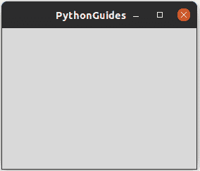
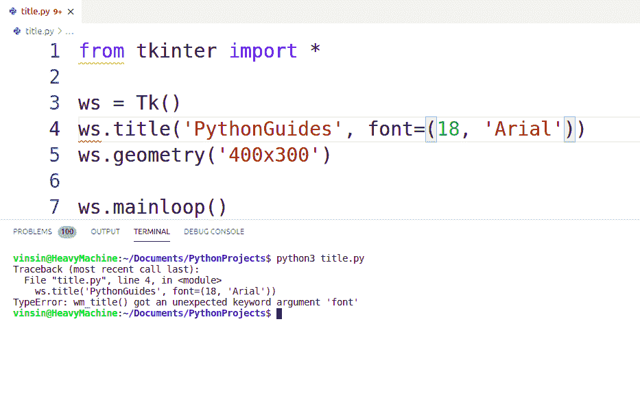
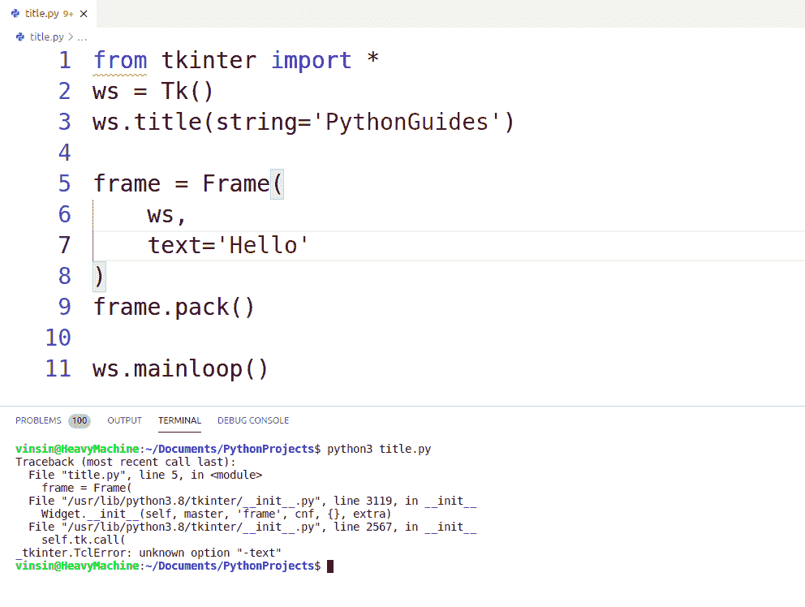
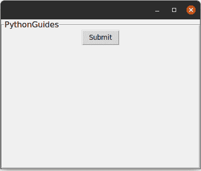

# Python Tkinter 标题(详细教程)

> 原文：<https://pythonguides.com/python-tkinter-title/>

[](https://sharepointsky.teachable.com/p/python-and-machine-learning-training-course)

在本 [Python 教程](https://pythonguides.com/learn-python/)中，我们将学习关于 `Python Tkinter Title` 的一切。这个博客将是一个探索性的博客，我们将在其中回答常见问题。此外，我们将涵盖这些主题。

*   Python Tkinter title
*   如何更改 Python Tkinter 标题字体大小
*   Python Tkinter 标题栏颜色
*   Python Tkinter 标题栏文本
*   Python Tkinter 标题中心
*   Python Tkinter 标题颜色
*   Python Tkinter 帧标题
*   如何在 Python Tkinter 中移除标题栏

如果你是 Python TKinter 或 GUI 编程的新手，请查看， [Python GUI 编程](https://pythonguides.com/python-gui-programming/)。

目录

[](#)

*   [Python Tkinter title](#Python_Tkinter_title "Python Tkinter title")
*   [Python tkinter 标题字体大小](#Python_tkinter_title_font_size "Python tkinter title font size")
*   [Python tkinter 标题栏颜色](#Python_tkinter_title_bar_color "Python tkinter title bar color")
*   [Python tkinter 标题栏文本](#Python_tkinter_title_bar_text "Python tkinter title bar text")
*   [Python tkinter 标题中心](#Python_tkinter_title_center "Python tkinter title center")
*   [Python tkinter 标题颜色](#Python_tkinter_title_color "Python tkinter title color")
*   [Python Tkinter 帧标题](#Python_Tkinter_frame_title "Python Tkinter frame title")
*   [Python tkinter 移除标题栏](#Python_tkinter_remove_title_bar "Python tkinter remove title bar")

## Python Tkinter title

*   Python Tkinter ' `title` 是指提供给窗口的名称。它出现在窗口的顶部&大多位于屏幕的左上角或中央。
*   在下图中，你可以注意到“PythonGuides”是应用程序的标题。
*   它设置了这个小部件的标题



Python tkinter title

**语法:**

下面是 Python Tkinter 'Title '的语法。

```py
wm_title(string=None)
```

**代码片段:**

下面是创建窗口标题的简单代码。**T2 `ws.title('PythonGuides')`**

```py
from tkinter import *

ws = Tk()
ws.title('PythonGuides')
ws.geometry('400x300')

ws.mainloop()
```

**输出:**

在这个输出中，PythonGuides 显示为屏幕的标题。如果你是 windows，你会在窗口的左边看到它。


Python tkinter title

上面的代码我们可以用来**在 Python Tkinter** 中设置一个标题。

阅读: [Python Tkinter 自动完成](https://pythonguides.com/python-tkinter-autocomplete/)

## Python tkinter 标题字体大小

*   Python Tkinter 'Title '不允许改变窗口的字体大小。“标题”的唯一目的是提供窗口的名称或简短描述。
*   这是一个经常被问到的问题，所以我们查阅了官方文档和各种其他网站，看看是否有可能做到这一点。
*   官网没有提供改变字体大小的功能。其他网站显示标签为**标题**。
*   这个错误是我们在试验标题字体时收到的。



Python tkinter title font size

## Python tkinter 标题栏颜色

*   Title 函数提供的一个功能是在窗口顶部设置一个字符串。没有官方文档支持标题栏上的颜色实现。
*   因为这是一个常见的问题，所以我们进行了各种实验来为用户发现提示，但没有一个有效..
*   其他网站上的代码显示部件的位置和修改。他们不处理窗口顶部的标题栏。
*   键入 **`help(ws.title)`** 阅读官方文档。这里 `ws` 是窗口的名称。

## Python tkinter 标题栏文本

标题栏用于设置窗口的名称或描述。在这一节中，我们将学习如何在 python tkinter 中设置窗口的标题。

**语法:**

下面是给窗口添加标题的语法。

```py
ws.title(string=None)
```

**代码片段:**

下面是向应用程序窗口添加标题的代码。

```py
from tkinter import *
ws = Tk()
ws.title('PythonGuides')

ws.mainloop()
```

**输出:**

下面是上面代码的输出。你可以注意到标题是“PythonGuides”。


Python tkinter title bar text

## Python tkinter 标题中心

*   没有官方的方法将应用程序窗口的标题设置为居中。但是如果你是 linux 或 mac os 用户，那么文本会自动出现在标题栏的中央。
*   Windows 用户可以应用一些额外的空间来使文本居中。

## Python tkinter 标题颜色

*   Python tkinter 标题栏不提供任何设置颜色的选项。前景色和背景色都不能添加。
*   Linux、Mac 和 Windows 上的外观可能会有所不同。

## Python Tkinter 帧标题

*   在本节中，我们将学习如何在 Tkinter 帧上设置标题。此外，我们将分享常见的错误信息及其修复。
*   Tkinter 提供了两种类型的帧
    *   基本框架
    *   标签框架
*   LabelFrame 向窗口添加文本或标题，而 Frame 不向框架窗口添加标题。除此之外，rest 和 rest 具有相似的功能。
*   如果你看到错误: `**_tkinter.TclError: unknown option "-text"**`这意味着你使用了框架而不是标签框架。



Python Tkinter frame title

给框架添加标题的正确方法是使用标签框架。这是演示。

**代码片段:**

下面是在 LabelFrame 上添加标题的代码片段。您可以在输出中注意到“PythonGuides”是框架的标题。

```py
from tkinter import *
ws = Tk()
ws.title(string='')
ws.geometry('400x300')

frame = LabelFrame(
    ws,
    text='PythonGuides',
    bg='#f0f0f0',
    font=(20)
)
frame.pack(expand=True, fill=BOTH)

Button(
    frame,
    text='Submit'
).pack()

ws.mainloop()
```

**输出:**

下面是上述代码片段的输出。你可以注意到 PythonGuides 被写成了框架的标题。



Python Tkinter frame title

## Python tkinter 移除标题栏

要删除标题栏，您需要做的就是删除行 ws.title(“任何标题”)或者您可以简单地删除文本“任何标题”。在这里，任何标题都是窗口的标题。

您可能会喜欢以下 Python Tkinter 教程:

*   [如何在 Python Tkinter 中设置背景为图像](https://pythonguides.com/set-background-to-be-an-image-in-python-tkinter/)
*   [Python Tkinter 在文本框中显示数据](https://pythonguides.com/python-tkinter-to-display-data-in-textboxes/)
*   [如何使用 Python Tkinter 创建倒计时定时器](https://pythonguides.com/create-countdown-timer-using-python-tkinter/)
*   [用 Python Tkinter 上传文件](https://pythonguides.com/upload-a-file-in-python-tkinter/)
*   [Python Tkinter 拖拽](https://pythonguides.com/python-tkinter-drag-and-drop/)

在本教程中，我们已经了解了关于 `Python Tkinter Title` 的一切。此外，我们已经讨论了这些主题。

*   python tkinter title
*   python tkinter 标题字体大小
*   python tkinter 标题栏颜色
*   python tkinter 标题栏文本
*   python tkinter 标题中心
*   python tkinter 标题颜色
*   python tkinter 帧标题
*   python tkinter 移除标题栏

[Bijay Kumar](https://pythonguides.com/author/fewlines4biju/)

Python 是美国最流行的语言之一。我从事 Python 工作已经有很长时间了，我在与 Tkinter、Pandas、NumPy、Turtle、Django、Matplotlib、Tensorflow、Scipy、Scikit-Learn 等各种库合作方面拥有专业知识。我有与美国、加拿大、英国、澳大利亚、新西兰等国家的各种客户合作的经验。查看我的个人资料。

[enjoysharepoint.com/](https://enjoysharepoint.com/)[](https://www.facebook.com/fewlines4biju "Facebook")[](https://www.linkedin.com/in/fewlines4biju/ "Linkedin")[](https://twitter.com/fewlines4biju "Twitter")