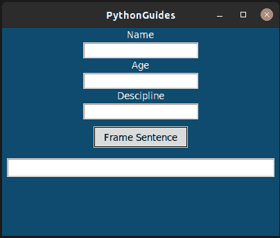
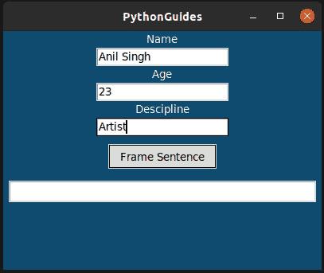
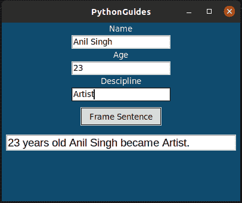

# Python Tkinter 在文本框中显示数据

> 原文：<https://pythonguides.com/python-tkinter-to-display-data-in-textboxes/>

[](https://sharepointsky.teachable.com/p/python-and-machine-learning-training-course)

在本 Python 教程中，我们将讨论如何使用 Python Tkinter**在文本框中显示数据。**

## Python Tkinter 在文本框中显示数据

*   让我们看看，如何在 [Python Tkinter](https://pythonguides.com/python-gui-programming/) 中显示文本框或入口小部件中的数据。在 Python Tkinter 中，文本框被称为入口小部件。
*   为了显示数据，我们必须使用 `insert()` 函数。插入函数有两个参数。
    *   索引位置
    *   要插入的信息
*   在我们的程序中，我们使用了入口小部件来捕获用户提供的信息，然后我们必须构造一个句子&这个句子显示在另一个入口小部件中。

**代码:**

```py
from tkinter import *

def frame_sentence():
    name = name_tf.get()
    age = int(age_tf.get())
    desc = descipline_tf.get()

    disp_tf.insert(0,f'{age} years old {name} became {desc}.')

ws = Tk()
ws.title('PythonGuides')
ws.geometry('400x300')
ws.config(bg='#0f4b6e')

name_tf = Entry(ws)
age_tf = Entry(ws)
descipline_tf = Entry(ws)

name_lbl = Label(
    ws,
    text='Name',
    bg='#0f4b6e',
    fg='white'
)
age_lbl = Label(
    ws,
    text='Age',
    bg='#0f4b6e',
    fg='white'
)

descipline_lbl = Label(
    ws,
    text='Descipline',
    bg='#0f4b6e',
    fg='white'
)

name_lbl.pack()
name_tf.pack()
age_lbl.pack()
age_tf.pack()
descipline_lbl.pack()
descipline_tf.pack()

btn = Button(
    ws,
    text='Frame Sentence',
    relief=SOLID,
    command=frame_sentence
)
btn.pack(pady=10)

disp_tf = Entry(
    ws, 
    width=38,
    font=('Arial', 14)
    )

disp_tf.pack(pady=5)

ws.mainloop() 
```

**输出:**

这是上面代码的输出，它是用户可以填写信息并可以点击框架句子按钮的界面。



Python Tkinter to Display Data in Textboxes

这是输出的第二个图像，其中填充了用户详细信息。



Display data in textboxes using Python Tkinter

在此输出中，在填写详细信息后，用户点击了“框架句子”按钮，从而使用提供的信息显示了一个句子。



How to display data in textboxes using Python Tkinter

您可能会喜欢以下 Python tkinter 教程:

*   [Python tkinter 标签](https://pythonguides.com/python-tkinter-label/)
*   [Python Tkinter 条目](https://pythonguides.com/python-tkinter-entry/)
*   [Python Tkinter Button](https://pythonguides.com/python-tkinter-button/)
*   [Python Tkinter 单选按钮](https://pythonguides.com/python-tkinter-radiobutton/)
*   [Python Tkinter Checkbutton](https://pythonguides.com/python-tkinter-checkbutton/)
*   [Python Tkinter 滚动条–如何使用](https://pythonguides.com/python-tkinter-scrollbar/)
*   [Python Tkinter 笔记本小工具](https://pythonguides.com/python-tkinter-notebook/)

在本教程中，我们已经学习了如何使用 python tkinter 在 textbox 中显示数据。

[Bijay Kumar](https://pythonguides.com/author/fewlines4biju/)

Python 是美国最流行的语言之一。我从事 Python 工作已经有很长时间了，我在与 Tkinter、Pandas、NumPy、Turtle、Django、Matplotlib、Tensorflow、Scipy、Scikit-Learn 等各种库合作方面拥有专业知识。我有与美国、加拿大、英国、澳大利亚、新西兰等国家的各种客户合作的经验。查看我的个人资料。

[enjoysharepoint.com/](https://enjoysharepoint.com/)[](https://www.facebook.com/fewlines4biju "Facebook")[](https://www.linkedin.com/in/fewlines4biju/ "Linkedin")[](https://twitter.com/fewlines4biju "Twitter")