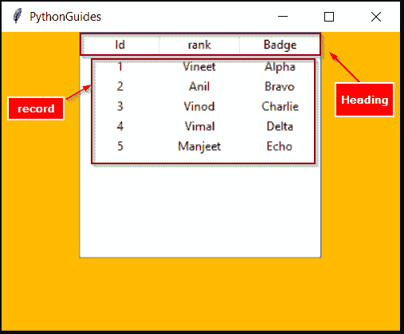
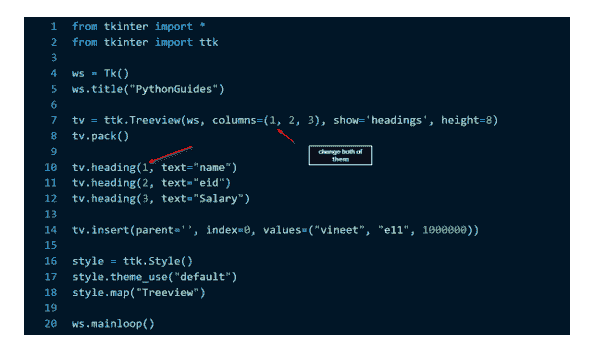
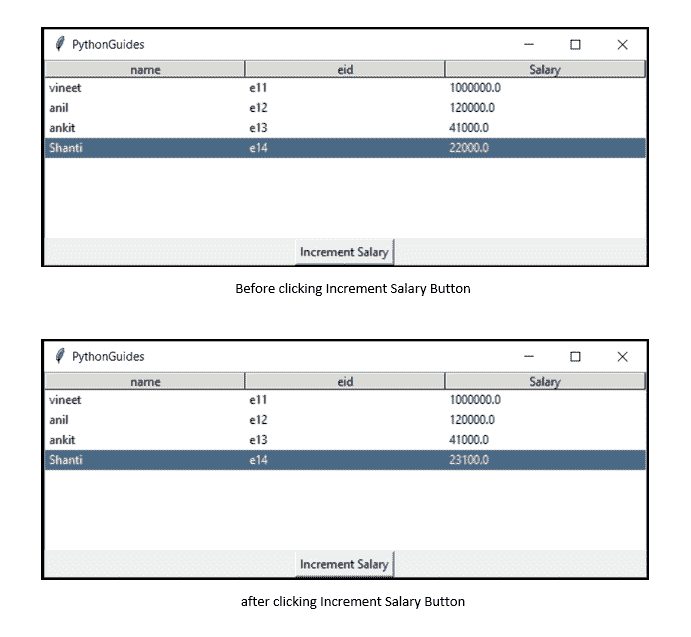
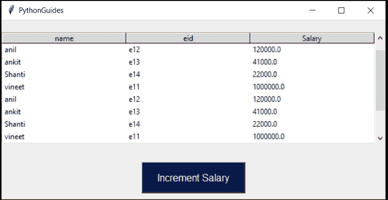
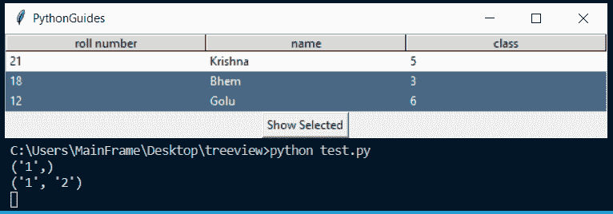
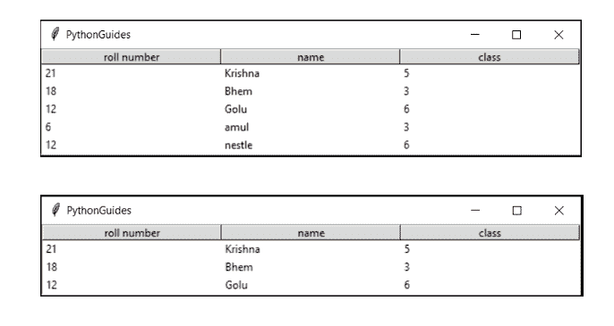
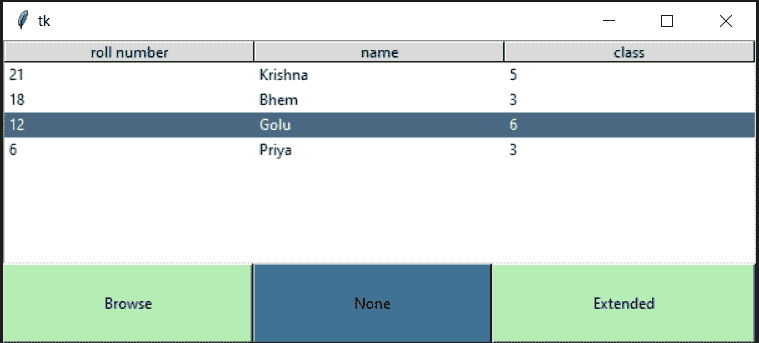

# python Tkinter TreeView–如何使用

> 原文：<https://pythonguides.com/python-tkinter-treeview/>

[](https://sharepointsky.teachable.com/p/python-and-machine-learning-training-course)

在本 [Python 教程](https://pythonguides.com/learn-python/)中，我们将学习如何创建 `Python Tkinter TreeView` 。此外，我们还将讨论以下主题:

*   什么是 Python Tkinter 树视图
*   用一个例子解释 Python Tkinter
*   如何在 Python Tkinter Treeview 中更改值
*   如何向 Python Tkinter Treeview 添加滚动条
*   如何在 Python Tkinter Treeview 中使用插入项
*   Python Tkinter Treeview 中选择的作用是什么
*   Python Tkinter Treeview 中的宽度
*   Python Tkinter 树视图表
*   Python Tkinter Treeview 中的高度
*   在 Python Tkinter Treeview 中使用 Selectmode

如果您是 Python Tkinter 的新手，请查看 [Python GUI 编程](https://pythonguides.com/python-gui-programming/)。

目录

[](#)

*   [什么是 Python Tkinter Treeview](#What_is_Python_Tkinter_Treeview "What is Python Tkinter Treeview")
*   [Python Tkinter Treeview 示例](#Python_Tkinter_Treeview_Example "Python Tkinter Treeview Example")
*   [Python Tkinter Treeview 更改值](#Python_Tkinter_Treeview_Change_Value "Python Tkinter Treeview Change Value")
*   [Python Tkinter 树形视图滚动条](#Python_Tkinter_Treeview_Scrollbars "Python Tkinter Treeview Scrollbars")
*   [Python Tkinter TreeView 插入](#Python_Tkinter_TreeView_Insert "Python Tkinter TreeView Insert")
*   [Python Tkinter 树形视图选择](#Python_Tkinter_Treeview_Selection "Python Tkinter Treeview Selection")
*   [Python Tkinter 树形视图宽度](#Python_Tkinter_TreeView_Width "Python Tkinter TreeView Width")
*   [Python Tkinter 树形视图表](#Python_Tkinter_Treeview_Table "Python Tkinter Treeview Table")
*   [Python Tkinter Treeview 高度](#Python_Tkinter_Treeview_Height "Python Tkinter Treeview Height")
*   [Python Tkinter TreeView 选择模式](#Python_Tkinter_TreeView_Selectmode "Python Tkinter TreeView Selectmode")

## 什么是 Python Tkinter Treeview

*   `Tkinter Treeview` 指的是分层表示。在这种情况下，当数据之间有关系时，我们就有了树形视图。
*   Python Tkinter Treeview 改进了数据列的外观。
*   Python Tkinter Treeview 派生自 `tkinter.ttk` 模块。
*   创建 Treeview 时，总是会创建一个额外的列。我们称该列为“鬼列”。注意这只是供我们参考。



python tkinter treeview

使用数据库 SQLite3 读取 Python Tkinter 中的[登录页面](https://pythonguides.com/registration-form-in-python-using-tkinter/)

## Python Tkinter Treeview 示例

让我们看一下 `Python tkinter treeview` 的例子。

**代码:**

```py
from tkinter import *
from tkinter import ttk

ws = Tk()
ws.title('PythonGuides')
ws.geometry('400x300')
ws['bg']='#fb0'

tv = ttk.Treeview(ws)
tv['columns']=('Rank', 'Name', 'Badge')
tv.column('#0', width=0, stretch=NO)
tv.column('Rank', anchor=CENTER, width=80)
tv.column('Name', anchor=CENTER, width=80)
tv.column('Badge', anchor=CENTER, width=80)

tv.heading('#0', text='', anchor=CENTER)
tv.heading('Rank', text='Id', anchor=CENTER)
tv.heading('Name', text='rank', anchor=CENTER)
tv.heading('Badge', text='Badge', anchor=CENTER)

tv.insert(parent='', index=0, iid=0, text='', values=('1','Vineet','Alpha'))
tv.insert(parent='', index=1, iid=1, text='', values=('2','Anil','Bravo'))
tv.insert(parent='', index=2, iid=2, text='', values=('3','Vinod','Charlie'))
tv.insert(parent='', index=3, iid=3, text='', values=('4','Vimal','Delta'))
tv.insert(parent='', index=4, iid=4, text='', values=('5','Manjeet','Echo'))
tv.pack()

ws.mainloop()
```

**输出:**


python tkinter treeview example

你可能会喜欢，[如何用 Python Tkinter](https://pythonguides.com/create-countdown-timer-using-python-tkinter/) 创建倒计时定时器？

## Python Tkinter Treeview 更改值

*   在本节中，我们将学习**如何更改 Python Tkinter Treeview 值**。
*   在 Treeview 中有两种类型的值。
*   一个是我们在表格顶部看到的标题值
*   另一个是我们在桌上看到的记录。
*   要更改标题值，我们必须在列和标题中进行更改。为了更好的理解，我们在下图中标记了这两个东西。
*   我们假设想要将 heading 的值从 1 更改为其他值。



fig . 1.1 Python Tkinter Treeview Change Value

*   要更改记录的值，我们必须创建一个函数来更改 Python Tkinter Treeview 中所选项的值。
*   在这一部分，我们将只更改记录中的一项。
*   `tkk.tree.focus` 返回树形视图中选中的项目行。如果未选择任何内容，则返回空字符串(" ")。
*   `ttk.tree.item()` 以 `tkk.tree.focus` 为自变量，后跟“**值**”。这将返回选定项目中的所有值。这些值在一个**元组**中返回。
*   我们将通过一个例子来理解这一点，在这个例子中，所选雇员的工资将按当前工资的 5%递增。

**代码:**

在这段代码中，请注意 `update_item` 函数。

*   **`tv.focus()`** 保存树形视图中选中项的行号&相同的值存储在一个名为 selected 的变量中。您可以使用打印功能来查看。`print(selected)`。
*   `tv.item()` 取 2 个参数，选定&值。这意味着从选中的行中，显示所有的值。这些值将以元组格式显示。这存储在一个名为 `temp` 的变量中。
*   通过使用 temp[0]，temp[1]，temp[2]我们可以访问元组中的项目。
*   `sal_up` 变量保存增加工资的计算。
*   `tv.item()` 方法用于向记录提供新值。

```py
from tkinter import *
from tkinter import ttk

ws = Tk()
ws.title("PythonGuides")

tv = ttk.Treeview(ws, columns=(1, 2, 3), show='headings', height=8)
tv.pack()

tv.heading(1, text="name")
tv.heading(2, text="eid")
tv.heading(3, text="Salary")

def update_item():
    selected = tv.focus()
    temp = tv.item(selected, 'values')
    sal_up = float(temp[2]) + float(temp[2]) * 0.05
    tv.item(selected, values=(temp[0], temp[1], sal_up))

tv.insert(parent='', index=0, iid=0, values=("vineet", "e11", 1000000.00))
tv.insert(parent='', index=1, iid=1, values=("anil", "e12", 120000.00))
tv.insert(parent='', index=2, iid=2, values=("ankit", "e13", 41000.00))
tv.insert(parent='', index=3, iid=3, values=("Shanti", "e14", 22000.00))

Button(ws, text='Increment Salary', command=update_item).pack()

style = ttk.Style()
style.theme_use("default")
style.map("Treeview")

ws.mainloop() 
```

**输出:**

在这个输出中，显示了 `Python Tkinter Treeview` 。我们有恩员工的饲料样本数据。底部的按钮具有将所选员工的工资增加 5%的功能。Shanti 做得很好，她应该得到加薪。她以前的工资是 22000 英镑，增加 5%后，变成了 23100 英镑。



python tkinter treeview update value

## Python Tkinter 树形视图滚动条

滚动条对于初学者来说是一个复杂的术语，也是一个广泛使用的小工具，你不能忽视它。所以在 Python Tkinter Treeview 的这一节，我们将学习为 Treeview 创建滚动条。

*   实现滚动条的最佳实践是使用框架小部件。
*   框架部件可以容纳其他部件。因此，我们将在框架上放置 Treeview & Scrollbar 小部件。
*   创建滚动条的命令: **`sb = Scrollbar(frame, orient=VERTICAL)`**
    *   我们将这个小部件放在**框架**中
    *   `orient` 决定滚动条是**水平**还是**垂直**。
*   在屏幕上放置滚动条的命令是`**sb.pack(side=RIGHT, fill=Y)**`
    *   树形视图将被打包到左边的**和右边的**和**滚动条。**
    *   **`fill=Y`** 将滚动条填充在可用空间。这将使滚动条看起来比实际大。
*   用 Treeview 配置或绑定滚动条是最重要的一步。
    *   **`tv.config(yscrollcommand=sb.set)`** 该命令配置树形视图，并与滚动条绑定。
    *   **`sb.config(command=tv.yview)`** 该命令配置滚动条，并与 Treeview 绑定。

这样，我们就可以用 Treeview 实现滚动条了。因为我们在这里使用了框架，所以这个方法可以在任何小部件上实现&你可以避免混淆。我希望你已经理解了如何在 Python Tkinter Treeview 中使用滚动条。我们还提供了一个小应用程序的滚动条的实现。

**注意:**如果你已经正确实现了滚动条，但仍然不能正常显示，那么请**增加数据中的行数。**仍然无效，请留下评论。

**代码:**

在此代码中，我们继承了之前为员工提供增量的应用程序。但是这次我们有更多的员工。由于屏幕不足以显示全部数据，所以我们使用了滚动条。

```py
from tkinter import *
from tkinter import ttk

ws = Tk()
ws.title("PythonGuides")

frame = Frame(ws)
frame.pack(pady=20)

tv = ttk.Treeview(frame, columns=(1, 2, 3), show='headings', height=8)
tv.pack(side=LEFT)

tv.heading(1, text="name")
tv.heading(2, text="eid")
tv.heading(3, text="Salary")

sb = Scrollbar(frame, orient=VERTICAL)
sb.pack(side=RIGHT, fill=Y)

tv.config(yscrollcommand=sb.set)
sb.config(command=tv.yview)

def update_item():
    selected = tv.focus()
    temp = tv.item(selected, 'values')
    sal_up = float(temp[2]) + float(temp[2]) * 0.05
    tv.item(selected, values=(temp[0], temp[1], sal_up))

tv.insert(parent='', index=0, iid=0, values=("vineet", "e11", 1000000.00))
tv.insert(parent='', index=1, iid=1, values=("anil", "e12", 120000.00))
tv.insert(parent='', index=2, iid=2, values=("ankit", "e13", 41000.00))
tv.insert(parent='', index=3, iid=3, values=("Shanti", "e14", 22000.00))
tv.insert(parent='', index=4, iid=4, values=("vineet", "e11", 1000000.00))
tv.insert(parent='', index=5, iid=5, values=("anil", "e12", 120000.00))
tv.insert(parent='', index=6, iid=6, values=("ankit", "e13", 41000.00))
tv.insert(parent='', index=7, iid=7, values=("Shanti", "e14", 22000.00))
tv.insert(parent='', index=8, iid=8, values=("vineet", "e11", 1000000.00))
tv.insert(parent='', index=9, iid=9, values=("anil", "e12", 120000.00))
tv.insert(parent='', index=10, iid=10, values=("ankit", "e13", 41000.00))
tv.insert(parent='', index=11, iid=11, values=("Shanti", "e14", 22000.00))

Button(
    ws, 
    text='Increment Salary', 
    command=update_item, 
    padx=20, 
    pady=10, 
    bg='#081947', 
    fg='#fff', 
    font=('Times BOLD', 12)
    ).pack(pady=10)

style = ttk.Style()
style.theme_use("default")
style.map("Treeview")

ws.mainloop() 
```

**输出:**

在此输出中，数据显示在 Python Tkinter 树视图中。你可以看到一个滚动条添加到窗口。无论添加了多少数据，都可以通过滚动窗口来查看。



Python Tkinter Treeview Scrollbars

## Python Tkinter TreeView 插入

`tkinter.ttk.Treeview` 实例的方法创建一个新项目，并返回新创建项目的项目标识符。

**语法**:

```py
insert(parent, index, iid=None, **kw)
```

*   **父项**是父项的项 ID，或者是创建新的顶级项的空字符串。
*   **索引**是一个整数或值 end，指定在父节点的子节点列表中插入新项目。如果索引小于或等于零，则在开头插入新节点，如果索引大于或等于当前的子节点数，则在结尾插入新节点。
*   `iid` 被用作项目标识符，iid 不能已经存在于树中。否则，生成新的唯一标识符。

## Python Tkinter 树形视图选择

*   Python Tkinter Treeview 中的 `Selection` 返回选中项目的元组。
*   `Selection` 方法返回树形视图中所选项目的行索引。
*   它可以以元组格式一次返回多个索引。
*   选择在许多方面都是有用的，选择的值可以存储在一个变量中，然后使用 if-else 将其置于条件中。
*   知道行之后，可以通过提供索引号来访问或更改该行的项目。
*   示例:行[3]，行[1]，行[2]

**代码:**

在这段代码中，请注意 `show_selected()` 函数。在这里， **`print(tv.selection())`** 打印选中的行。

```py
from tkinter import *
from tkinter import ttk

def show_selected():
    print(tv.selection())

ws = Tk()
ws.title('PythonGuides')

tv = ttk.Treeview(
    ws, 
    columns=(1, 2, 3), 
    show='headings', 
    height=3
    )
tv.pack()

tv.heading(1, text='roll number')
tv.heading(2, text='name')
tv.heading(3, text='class')

tv.insert(parent='', index=0, iid=0, values=(21, "Krishna", 5))
tv.insert(parent='', index=1, iid=1, values=(18, "Bhem", 3))
tv.insert(parent='', index=2, iid=2, values=(12, "Golu", 6))
tv.insert(parent='', index=3, iid=3, values=(6, "amul", 3))
tv.insert(parent='', index=4, iid=4, values=(12, "nestle", 6))
tv.insert(parent='', index=5, iid=5, values=(6, "zebronics", 3))

style = ttk.Style()
style.theme_use("default")
style.map("Treeview")

Button(ws, text="Show Selected", command=show_selected).pack()

ws.mainloop()
```

**输出:**

在这个输出中，首先我们选择了一个并点击了按钮。所以在输出中我们可以注意到`**('1',)**`。这意味着选择了索引 1 上的行。现在，当我们选择两行并单击按钮时，它会显示 **`('1', '2')`** ，这意味着索引 1 和索引 2 上的行被选中，如图所示。



Python Tkinter Treeview Selection

## Python Tkinter 树形视图宽度

在 Python Tkinter Treeview 的这一节中，我们将学习如何在 Treeview 中实现 Width。

*   Width 是树形视图中每一列的水平长度。
*   宽度的变化将导致应用程序水平空间的变化。
*   宽度是在列节下声明的。这不是强制选项。
*   默认情况下，每列的宽度为 20 像素。

## Python Tkinter 树形视图表

*   Python Tkinter Treeview 是数据的表格表示，因为它具有表格的所有属性。
*   Treeview 有行、列和标题。
    *   **行**:由数据决定的水平间距。数据越多，行越多。
    *   **列**:垂直间距决定标题。更多的标题更多的列。
    *   **标题**:标题是最上面一行。

## Python Tkinter Treeview 高度

在 Python Tkinter Treeview 的这一部分，我们将学习如何实现 height。

*   高度是树视图的垂直长度。
*   它还决定了树视图中的行数
*   高度的变化将导致屏幕上显示的行数的变化。

**语法:**

```py
tv = ttk.Treeview(ws, columns=(1, 2, 3), show='headings', height=3)
tv.pack(side=LEFT)
```

**代码:**

在这段代码中，我们设置了 `height=5` ，这意味着只显示 5 行。我们也试过**高度=3** 。所以你试着改变这些值。

```py
from tkinter import *
from tkinter import ttk

ws = Tk()
ws.title('PythonGuides')

tv = ttk.Treeview(
    ws, 
    columns=(1, 2, 3), 
    show='headings', 
    height=5
    #height=3
    )
tv.pack()

tv.heading(1, text='roll number')
tv.heading(2, text='name')
tv.heading(3, text='class')

tv.insert(parent='', index=0, iid=0, values=(21, "Krishna", 5))
tv.insert(parent='', index=1, iid=1, values=(18, "Bhem", 3))
tv.insert(parent='', index=2, iid=2, values=(12, "Golu", 6))
tv.insert(parent='', index=3, iid=3, values=(6, "amul", 3))
tv.insert(parent='', index=4, iid=4, values=(12, "nestle", 6))
tv.insert(parent='', index=5, iid=5, values=(6, "zebronics", 3))

style = ttk.Style()
style.theme_use("default")
style.map("Treeview")

ws.mainloop()
```

**输出:**

在此输出中，显示了两张图片。第一幅图像的**高度=5** ，第二幅图像的**高度=3** 。



Python Tkinter Treeview Height

## Python Tkinter TreeView 选择模式

在本节中，我们将了解什么是 Selectmode & Python t inter Treeview 中 select mode 的类型。

*   `Selectmode` 控制内置类绑定如何管理选择。有三种方法可以做到:
    *   **扩展:**允许用户选择多个项目。
    *   **浏览:**一次只允许单项选择。
    *   **无:**选择不会改变，用户点击但不会选择任何内容。

**语法:**

根据使用情况，可以放置**扩展**或**浏览**来代替**无**。

```py
tv = Treeview(ws, selectmode="none")
tv.pack()
```

**代码:**

在这段代码中，我们实现了 Python Tkinter Selectmode 的所有三个方法。我们有专门的三个按钮，每个有不同的任务。

*   当点击 `none` 按钮时，用户将不会在树形视图上看到任何标记。
*   当点击**浏览**按钮时，用户可以一次选择一个项目。
*   当点击**扩展**按钮时，用户将能够同时选择多个项目。
*   按住键盘上的 **shift 键**选择多个项目。

```py
from tkinter import *
from tkinter import ttk

def selectmode_none():
    tv['selectmode']="none"

def selectmode_browse():
    tv['selectmode']="browse"

def selectmode_extended():
    tv['selectmode']="extended"

ws = Tk()

tv = ttk.Treeview(
    ws, 
    columns=(1, 2, 3), 
    show='headings', 
    height=8
    )
tv.pack()

tv.heading(1, text='roll number')
tv.heading(2, text='name')
tv.heading(3, text='class')

tv.insert(parent='', index=0, iid=0, values=(21, "Krishna", 5))
tv.insert(parent='', index=1, iid=1, values=(18, "Bhem", 3))
tv.insert(parent='', index=2, iid=2, values=(12, "Golu", 6))
tv.insert(parent='', index=3, iid=3, values=(6, "Priya", 3))

b1 = Button(
    ws, 
    text="Browse",
    pady=20,
    command=selectmode_browse
    )
b1.pack(side=LEFT, fill=X, expand=True)

b2 = Button(
    ws, 
    text="None",
    pady=20,
    command=selectmode_none
    )
b2.pack(side=LEFT, fill=X, expand=True)

b3 = Button(
    ws, 
    text="Extended",
    pady=20,
    command=selectmode_extended
    )
b3.pack(side=LEFT, fill=X, expand=True)

style = ttk.Style()
style.theme_use("default")
style.map("Treeview")

ws.mainloop()
```

**输出:**

在这个输出中，显示了一个简单的 **Python Tkinter Treeview 应用程序** n。底部有三个按钮可以改变树形视图的选择模式。



Python Tkinter TreeView Selectmode

您可能会喜欢以下 Python tkinter 教程:

*   [如何用 Python 制作计算器](https://pythonguides.com/make-a-calculator-in-python/)
*   [Python Tkinter Menu bar](https://pythonguides.com/python-tkinter-menu-bar/)
*   [Python tkinter messagebox](https://pythonguides.com/python-tkinter-messagebox/)
*   [Python Tkinter 帧](https://pythonguides.com/python-tkinter-frame/)
*   [Python Tkinter Stopwatch](https://pythonguides.com/python-tkinter-stopwatch/)
*   [Python Tkinter 列表框](https://pythonguides.com/python-tkinter-listbox/)
*   [Python Tkinter 画布教程](https://pythonguides.com/python-tkinter-canvas/)
*   [Python Tkinter 进度条](https://pythonguides.com/python-tkinter-progress-bar/)
*   [Python Tkinter Map()函数](https://pythonguides.com/python-tkinter-map-function/)
*   [Python Tkinter 拖拽](https://pythonguides.com/python-tkinter-drag-and-drop/)

在本教程中，我们已经了解了 `Python Tkinter Treeview` 。此外，我们还讨论了以下主题:

*   什么是 Python Tkinter 树视图
*   用一个例子解释 Python Tkinter
*   如何在 Python Tkinter Treeview 中更改值
*   如何向 Python Tkinter Treeview 添加滚动条
*   如何在 Python Tkinter Treeview 中使用插入项
*   Python Tkinter Treeview 中选择的作用是什么
*   Python Tkinter Treeview 中的宽度
*   Python Tkinter 树视图表
*   Python Tkinter Treeview 中的高度
*   在 Python Tkinter Treeview 中使用 Selectmode

[Bijay Kumar](https://pythonguides.com/author/fewlines4biju/)

Python 是美国最流行的语言之一。我从事 Python 工作已经有很长时间了，我在与 Tkinter、Pandas、NumPy、Turtle、Django、Matplotlib、Tensorflow、Scipy、Scikit-Learn 等各种库合作方面拥有专业知识。我有与美国、加拿大、英国、澳大利亚、新西兰等国家的各种客户合作的经验。查看我的个人资料。

[enjoysharepoint.com/](https://enjoysharepoint.com/)[](https://www.facebook.com/fewlines4biju "Facebook")[](https://www.linkedin.com/in/fewlines4biju/ "Linkedin")[](https://twitter.com/fewlines4biju "Twitter")