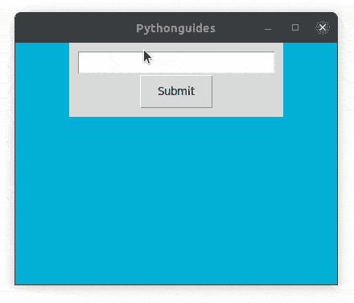
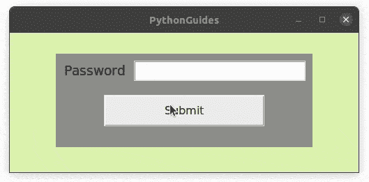
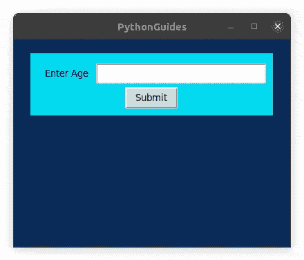
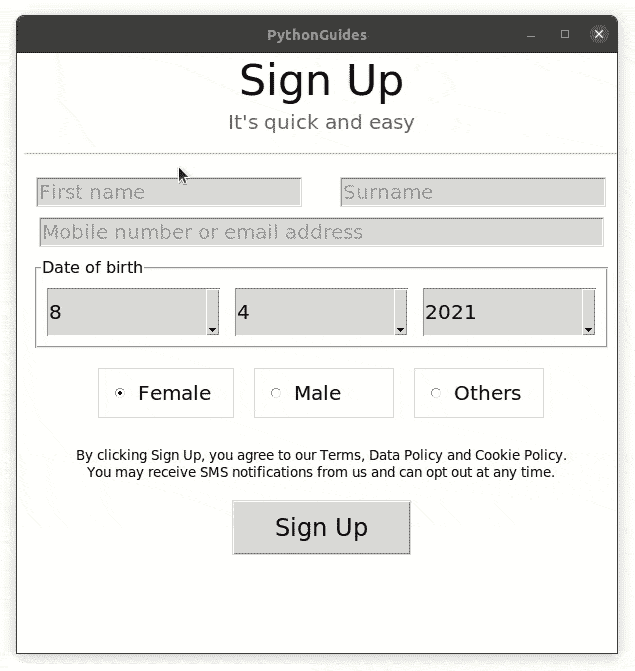
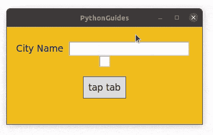
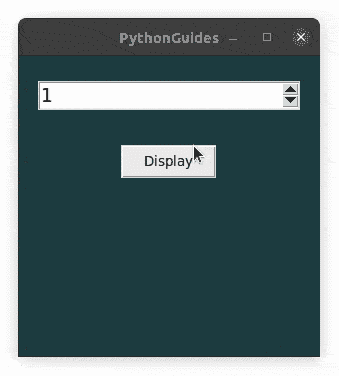

# Python Tkinter 验证示例

> 原文：<https://pythonguides.com/python-tkinter-validation/>

[](https://sharepointsky.teachable.com/p/python-and-machine-learning-training-course)

在这个 [Python Tkinter 教程](https://pythonguides.com/python-gui-programming/)中，我们将学习验证以及如何在 Python Tkinter 中实现**验证。此外，我们将涵盖这些主题。**

*   Python Tkinter 验证
*   Python Tkinter 验证条目
*   Python Tkinter 密码验证
*   Python Tkinter 条目验证整数
*   Python Tkinter 条目验证示例
*   Python Tkinter 条目验证焦点输出
*   Python Tkinter Spinbox 验证

目录

[](#)

*   [Python Tkinter Validation](#Python_Tkinter_Validation "Python Tkinter Validation")
*   [Python Tkinter 验证条目](#Python_Tkinter_Validate_Entry "Python Tkinter Validate Entry")
*   [Python Tkinter 密码验证](#Python_Tkinter_Password_Validation "Python Tkinter Password Validation")
*   [Python Tkinter 条目验证整数](#Python_Tkinter_Entry_Validate_Integer "Python Tkinter Entry Validate Integer")
*   [Python Tkinter 条目验证示例](#Python_Tkinter_Entry_Validate_Example "Python Tkinter Entry Validate Example")
*   [Python Tkinter 条目验证 focusout](#Python_Tkinter_Entry_Validate_focusout "Python Tkinter Entry Validate focusout")
*   [Python Tkinter Spinbox 验证](#Python_Tkinter_Spinbox_Validate "Python Tkinter Spinbox Validate")

## Python Tkinter Validation

`Python Tkinter`中的验证意味着宣布用户输入正式可接受。换句话说，检查用户共享的信息是否符合公司标准。

*   主要有三种类型的验证:
    1.  **类型检查:**检查数据类型
    2.  **长度检查:**检查最大或最小长度
    3.  **范围检查:**从-到
*   可以使用异常处理程序和通过引发标志来执行验证。
*   异常处理程序有**试**，**除**，**最后**
*   标志提升包括布尔和 while 循环。
*   在本教程中，我们用真实的例子和项目解释了 Python Tkinter 中的验证。

阅读 [Python Tkinter 通断开关](https://pythonguides.com/python-tkinter-on-off-switch/)

## Python Tkinter 验证条目

在这一节中，我们将学习如何在 Python Tkinter 中的 Entry 小部件上添加验证。

*   Python Tkinter 中的入口小部件对所有类型的用户输入公开，并用于各种各样的功能。喜欢它充当字符串输入，数字输入和密码输入。
*   所有这些输入都包含各种验证，如字段不能为空、最小或最大字符数等。
*   我们已经在其他部分介绍了密码验证，因此在这一部分我们将介绍
    *   **空字符串验证:**有些数据必须由用户提供。
    *   **最小和最大字符验证:**字符串中的最小和最大字符。
    *   **仅字符串验证:**用户输入只能是字符串，例如，名称不能有数字。

**源代码及说明:**

在这个例子中，我们使用 Python Tkinter 创建了一个简单的 GUI。首先，我们创建了一个简单的界面来接受用户输入，然后当用户点击提交按钮时，名为 `validation()` 的函数被调用。

```py
def validation():
    name = name_tf.get()
    msg = ''

    if len(name) == 0:
        msg = 'name can\'t be empty'
    else:
        try:
            if any(ch.isdigit() for ch in name):
                msg = 'Name can\'t have numbers'
            elif len(name) <= 2:
                msg = 'name is too short.'
            elif len(name) > 100:
                msg = 'name is too long.'
            else:
                msg = 'Success!'
        except Exception as ep:
            messagebox.showerror('error', ep)

    messagebox.showinfo('message', msg) 
```

*   在这段代码中，第 2 行我们从输入框中取出值，并保存在变量“name”中。
*   **`msg = ' '`** ，msg 为空字符串，用于存储条件信息，最后显示。
*   如果条件启动并且检查了名称的长度。如果长度为 0，这意味着输入框中没有输入。在这种情况下，用户将看到消息*“名称不能为空”*。
*   在 else 部分，使用异常处理程序*尝试*和*，除了* if-else 条件用于检查多个参数。
    *   `any(ch.isdigit() for ch in name)`:这行代码检查名字中的任何数字。如果找到，将显示错误消息。
    *   `len(name) <= 2:`如果名称中的字符总数少于 3，将显示错误消息。
    *   `len(name) > 100`:名称不能超过 100 个字符。
*   这段代码在弹出窗口中显示消息。这里的“消息”是消息框 promt 的标题，msg 包含消息。

```py
from tkinter import *
from tkinter import messagebox

ws = Tk()
ws.title('Pythonguides')
ws.geometry('400x300')
ws.config(bg='#04B2D9')

def validation():
    name = name_tf.get()
    msg = ''

    if len(name) == 0:
        msg = 'name can\'t be empty'
    else:
        try:
            if any(ch.isdigit() for ch in name):
                msg = 'Name can\'t have numbers'
            elif len(name) <= 2:
                msg = 'name is too short.'
            elif len(name) > 100:
                msg = 'name is too long.'
            else:
                msg = 'Success!'
        except Exception as ep:
            messagebox.showerror('error', ep)

    messagebox.showinfo('message', msg)

frame = Frame(
    ws,
    padx=10,
    pady=10
)
frame.pack(pady=20)

Label(
    frame,
    text='Enter Name'
).grid(row=0, column=1)

name_tf = Entry(
    frame,
    font = ('sans-sherif', 14)
)
name_tf.grid(row=0, column=1)

Button(
    frame,
    text='Submit',
    pady=10,
    padx=20,
    command=validation
).grid(row=1, columnspan=2)

ws.mainloop()
```

**输出:**

在这个输出中，有一个入口小部件，用户可以在其中提供任何名称。单击提交按钮时，程序将验证以下参数:

*   入口小部件不为空
*   名称多于 3 个字符，少于 100 个字符
*   该名称不包含任何数值。

如果所有参数都正常，那么用户将会看到一条成功消息。



Python Tkinter Entry Validation

阅读 [Python Tkinter 笔记本小工具](https://pythonguides.com/python-tkinter-notebook/)

## Python Tkinter 密码验证

在本节中，我们将介绍 **Python Tkinter 密码验证**。我们将使用 Python Tkinter 实现所有标准的密码验证。

*   使用 Python Tkinter Entry 小部件，我们可以简单地通过在 Python Tkinter 中添加选项 `**show='*'**`来创建密码字段。
*   以下是密码验证的标准列表:
    *   至少 1 个大写字母
    *   至少 1 个小写字母
    *   至少 1 个特殊字符
    *   至少 1 个数字
    *   最少 8 个字符
    *   密码字段不能为空
*   在我们的例子中，我们将使用 Python Tkinter 实现所有这些。

**源代码及说明:**

在这段代码中，我们使用 Python Tkinter 创建了 GUI，它接受密码作为用户输入，当用户单击提交按钮时，密码将被验证，如果符合定义的标准，则会显示一个“成功”弹出窗口。

*   我们已经创建了一个名为 `validation()` 的函数，每当用户单击提交按钮时就会触发这个函数。
*   `any()` 是一个 python 函数，其工作方式类似于**或**。这意味着如果任何一个条件为真，它将返回真。

下面是 validation()函数的解释。

```py
def validation():
    password = pwd.get()
    msg = ""

    if len(password) == 0:
        msg = 'Password can\'t be empty'
    else:
        try:
            if not any(ch in special_ch for ch in password):
                msg = 'Atleast 1 special character required!'
            elif not any(ch.isupper() for ch in password):
                msg = 'Atleast 1 uppercase character required!'
            elif not any(ch.islower() for ch in password):
                msg = 'Atleast 1 lowercase character required!'
            elif not any(ch.isdigit() for ch in password):
                msg = 'Atleast 1 number required!'
            elif len(password) < 8:
                msg = 'Password must be minimum of 8 characters!'
            else:
                msg = 'Success!' 
        except Exception as ep:
            messagebox.showerror('error', ep)
    messagebox.showinfo('message', msg) 
```

*   在这一行中，我们获取了用户输入，并将其存储在变量“password”中。
*   msg 是一个空字符串，它将在程序中存储消息。弹出框上显示的所有消息都来自这里。
*   我们已经创建了键盘上所有特殊字符的列表。
*   使用 if-else 语句检查密码长度。如果长度为 0，这意味着输入框是空的，在这种情况下，用户将看到一个错误消息。
*   如果用户已经提供了一些输入，那么 else 部分将在我们使用异常处理程序 *try* 和 *Except 的地方执行。*
*   在 try 块内部，使用 if-else 语句通过各种参数传递密码。如果密码通过所有参数，则显示“成功”消息。
*   这些参数如下:
    *   `if not any(ch in special_ch for ch in password)`
    *   `elif not any(ch.isupper() for ch in password)`
    *   `elif not any(ch.islower() for ch in password)`
    *   `elif not any(ch.isdigit() for ch in password)`
    *   `elif len(password) < 8`
*   这些参数确保密码至少由 1 个大写和小写字符、1 个数字和 1 个特殊字符组成。此外，它确保密码字段不为空，并且至少有 8 个字符。

```py
from tkinter import *
from tkinter import messagebox

special_ch = ['~', '`', '!', '@', '#', '$', '%', '^', '&', '*', '(', ')', '-', '_', '+', '=', '{', '}', '[', ']', '|', '\\', '/', ':', ';', '"', "'", '<', '>', ',', '.', '?']

def validation():
    password = pwd.get()
    msg = ""Turn off validation.

    if len(password) == 0:
        msg = 'Password can\'t be empty'
    else:
        try:
            if not any(ch in special_ch for ch in password):
                msg = 'Atleast 1 special character required!'
            elif not any(ch.isupper() for ch in password):
                msg = 'Atleast 1 uppercase character required!'
            elif not any(ch.islower() for ch in password):
                msg = 'Atleast 1 lowercase character required!'
            elif not any(ch.isdigit() for ch in password):
                msg = 'Atleast 1 number required!'
            elif len(password) < 8:
                msg = 'Password must be minimum of 8 characters!'
            else:
                msg = 'Success!' 
        except Exception as ep:
            messagebox.showerror('error', ep)
    messagebox.showinfo('message', msg)     

ws = Tk()
ws.title('PythonGuides')
ws.geometry('500x200')
ws.config(bg='#DDF2AE')

frame = Frame(
    ws,
    bg='#8C8C8B',
    padx=10,
    pady=10
)
frame.pack(pady=30)

Label(
    frame,
    bg='#8C8C8B',
    text='Password',
    font = ('sans-serif', 14)
).grid(row=0, column=0, padx=(0, 10))

pwd = Entry(
    frame,
    font = ('sans-serif', 14),
    show= '*'
)
pwd.grid(row=0, column=1)

submit = Button(
    frame,
    text='Submit',
    width=20,
    font = ('sans-serif', 12),
    command= validation  ,
    pady=10
)
submit.grid(row=1, columnspan=2, pady=20)

ws.mainloop()
```

**输出:**

在这个输出中，我们使用 Python Tkinter Entry 小部件创建了一个密码字段。密码字段具有所有验证。每次用户提供输入并单击提交按钮时，都会执行验证检查。如果一切如



Python Tkinter Password Validation

阅读[Python Tkinter check button–如何使用](https://pythonguides.com/python-tkinter-checkbutton/)

## Python Tkinter 条目验证整数

在本节中，我们将介绍 **Python Tkinter 条目验证整数**。我们将学习检查数字的有效性

*   Python Tkinter 条目验证整数可以在年龄和电话号码输入中看到。因为这些不能是负数或小数。
*   在这种情况下，我们迭代用户输入的每个字符，并确保用户只提供了数字。
*   如果用户输入包含任何字符串、特殊字符或十进制数，将会产生异常并通知用户。

**源代码:**

在这个例子中，我们使用 Python Tkinter 创建了一个基于 GUI 的应用程序，其中用户被询问他/她的年龄。

*   一旦用户点击提交按钮，函数 `validation()` 被触发。
*   该函数基于以下参数进行验证:
    *   年龄输入框不为空
    *   年龄不应该是负数
    *   年龄必须是整数
*   如果所有这些参数都为真，则用户会收到“成功”消息。
*   下面是对 `validation()` 函数的解释。

```py
 def validation():
    msg = ''
    age = age_tf.get()

    if len(age)==0:
        msg='Field can\'t be empty'
    else:
        try:
            if int(age) < 0:
                msg='Age can\'t be negative'
            else:
                msg='Success'
        except:
            msg='Age cannot be a string'

    messagebox.showinfo('info', msg)
```

*   msg 是 epty 字符串，创建它是为了以后在程序中存储消息。每当用户点击提交按钮时，将显示存储在 msg 变量中的消息。
*   在这一行中，用户输入被提取并存储在变量“age”中。
*   使用 if-else 语句检查年龄长度。如果长度为零，这意味着用户没有提供任何输入。在这种情况下，用户将收到错误消息。
*   在 else 部分，使用异常处理程序 *try* 和 e *xcept* 我们已经确保 out 程序没有中断。
*   在 *try* 块中，if-else 语句用于检查年龄是否小于 0。从技术上讲，年龄不能是负数，所以用户会收到错误消息。
*   如果输入正确，用户将会看到“成功”弹出窗口。

```py
from tkinter import *
from tkinter import messagebox

def validation():
    msg = ''
    age = age_tf.get()

    if len(age)==0:
        msg='Field can\'t be empty'
    else:
        try:
            if int(age) < 0:
                msg='Age can\'t be negative'
            else:
                msg='Success'
        except:
            msg='Age cannot be a string'

    messagebox.showinfo('info', msg)

ws = Tk()
ws.title('PythonGuides')
ws.geometry('400x300')
ws.config(bg='#0B2D59')

frame = Frame(
    ws,
    bg='#05DBF2',
    padx=10,
    pady=10
)
frame.pack(pady=20)

Label(
    frame,
    text='Enter Age',
    bg='#05DBF2',
    padx=10,
    pady=10
).grid(row=0, column=0)

age_tf = Entry(
    frame,
    font = ('sans-serif', 14)
)
age_tf.grid(row=0, column=1)

Button(
    frame,
    text='Submit',
    command=validation
).grid(row=1, columnspan=2)

ws.mainloop()
```

**使用 Python Tkinter** 进行整数验证的输出

 **在此输出中，创建了简单的年龄验证应用程序。在这个应用程序中，用户可以填写他们的年龄，然后点击提交。如果用户点击提交按钮而没有输入或输入不正确，那么他/她将收到相应的提示消息。



Python Tkinter Entry Validation Integer

阅读 [Python Tkinter 单选按钮–如何使用](https://pythonguides.com/python-tkinter-radiobutton/)

## Python Tkinter 条目验证示例

在这一节中，我们将看到一个成熟的应用程序，它使用 Python Tkinter 进行所有的验证。

*   在这个项目中，我们已经实现了到目前为止在本教程中解释的所有内容。
*   我们创建了一个 facebook 注册表单，并在该表单中添加了入口小部件的验证。
*   验证基于以下参数:
    *   字段不能为空
    *   名字和姓氏必须超过 3 个字符，并且只能包含字符串。
    *   手机或电子邮件字段接受手机号码或电子邮件地址。
    *   手机号码必须是 10 位数的整数
    *   邮件必须包含 ***@*** 和 ***圆点*** (。)特殊字符。

**源代码:**

```py
from tkinter import *
from tkinter import ttk
from tkinter import messagebox

def mob_email_validation():
    special_ch = ['@', '.']
    msg = ''
    me = mob_email.get()
    if me == '':
        msg = 'provide Mobile num or Email'
    else:
        try:
            if any(ch.isdigit() for ch in me):
                if len(me) == 10:
                    mob = int(me)
                    msg = 'success'
                else:
                    msg = 'incorrect mobile number!'
            else:
                if not any(ch in special_ch for ch in me):
                    msg = 'incorrect email!'
                else:
                    msg = 'success!'
        except Exception as ep:
            msg = ep
    messagebox.showinfo('message', msg)    

def validation(name_str, elm):
    msg = ''
    if name_str == '':
        msg = f'{elm} is required!'
    else:
        try:
            if len(name_str) <= 2:
                msg = 'Name is too small'
            elif any(ch.isdigit() for ch in name_str):
                msg = 'Name cannot have numbers'
            else:
                msg=f'success for {elm}'
        except Exception as ep:
            messagebox.showerror('message', ep)
    messagebox.showinfo('message', msg)

def btn_clicked():

    validation(fname.get(), 'first name')
    validation(surname.get(), 'last name')
    mob_email_validation()

def on_click_fname(event):
    fname.configure(state=NORMAL)
    fname.delete(0, END)
    fname.unbind('<Button-1>', on_click_id1)

def on_click_surname(event):
    surname.configure(state=NORMAL)
    surname.delete(0, END)
    surname.unbind('<Button-1>', on_click_id2)

def on_click_mob_email(event):
    mob_email.configure(state=NORMAL)
    mob_email.delete(0, END)
    mob_email.unbind('<Button-1>', on_click_id3)

def disp_date(choice):
    choice = day_var.get()
    print(choice)

def disp_month(choice):
    choice = month_var.get()
    print(choice)

def disp_year(choice):
    choice = year_var.get()
    print(choice)

ws = Tk()
ws.title('PythonGuides')
ws.geometry('600x600')
ws.config(bg='#fff')

firstname = StringVar()
username = StringVar()
password = StringVar()
day = [x for x in range(1, 32)]
month = [x for x in range(1, 13)]
year = [x for x in range(1905, 2022)]

# print(date)
# print(month)
# print(year)

Label(
    ws,
    text='Sign Up',
    font = ('sans-serif', 32),
    bg='#fff'
).grid(row=0, columnspan=2, sticky='EW')

Label(
    ws, 
    text='It\'s quick and easy',
    font = ('sans-serif', 15),
    fg = '#606770',
    bg='#fff',
    ).grid(row=1, columnspan=2, sticky='EW')

Label(
    ws,
    text='_'*85,
    fg='#ccd065',
    bg='#fff',
).grid(row=2, columnspan=2, pady=(0, 20))

fname = Entry(
    ws,
    bg='#fff',
    font=('sans-serif', 15)
)
fname.grid(row=3, column=0, pady=(0, 10))

surname = Entry(
    ws,
    bg='#fff',
    font=('sans-serif', 15),
)
surname.grid(row=3, column=1, pady=(0, 10))

mob_email = Entry(
    ws,
    bg='#fff',
    font=('sans-serif', 15),
    width=43
)
mob_email.grid(row=4, columnspan=2, pady=(0, 10))

# adding placeholders
fname.insert(0, 'First name')
fname.configure(state=DISABLED)
surname.insert(0, 'Surname')
surname.configure(state=DISABLED)
mob_email.insert(0, 'Mobile number or email address')
mob_email.configure(state=DISABLED)

# binding placeholders
fname.bind('<Button-1>', on_click_fname)
surname.bind('<Button-1>', on_click_surname)
mob_email.bind('<Button-1>', on_click_mob_email)

on_click_id1 = fname.bind('<Button-1>', on_click_fname)
on_click_id2 = surname.bind('<Button-1>', on_click_surname)
on_click_id3 = mob_email.bind('<Button-1>', on_click_mob_email)

dob = LabelFrame(
    ws,
    text='Date of birth',
    font=('sans-serif', 12),
    bg='#fff',
    padx=10,
    pady=10
)
dob.grid(row=5, columnspan=2, sticky='EW', padx=18, pady=(0, 10))

day_var = IntVar()
month_var = StringVar()
year_var = StringVar()

# display defaults
day_var.set(day[7])
month_var.set(month[3])
year_var.set(year[-1])

day_cb=ttk.Combobox(
    dob,
    textvariable = day_var,
    font=('sans-serif', 15),
    width=12,
    background= ['#fff'] # ToDo
)
day_cb.grid(row=6, column=0, padx=(0, 15), ipady=10)

month_cb = ttk.Combobox(
    dob,
    textvariable=month_var,
    font=('sans-serif', 15),
    width=12
)
month_cb.grid(row=6, column=1, padx=(0, 15), ipady=10)

year_cb = ttk.Combobox(
    dob,
    textvariable=year_var,
    font=('sans-serif', 15),
    width=12
)
year_cb.grid(row=6, column=2, ipady=10)

day_cb['values'] = day
month_cb['values'] = month
year_cb['values'] = year

# disable editing
day_cb['state'] = 'readonly'
month_cb['state'] = 'readonly'
year_cb['state'] = 'readonly'

gender = Frame(
    ws,
    bg='#fff',
)
gender.grid(row=7, columnspan=2)

gen_var = IntVar()
gen_var.set(1)

female_rb = Radiobutton(
    gender,
    text='Female',
    bg='#fff',
    variable=gen_var,
    value=1,
    font = ('sans-serif', 15),
    anchor='w'
)
female_rb.pack(fill=BOTH, expand=True, side=LEFT, padx=10, pady=10, ipadx=10, ipady=10)

male_rb = Radiobutton(
    gender,
    text='Male',
    bg='#fff',
    variable=gen_var,
    value=2,
    font = ('sans-serif', 15),
    anchor='w'
)
male_rb.pack(fill=BOTH, expand=True, side=LEFT, padx=10, pady=10, ipadx=25, ipady=10)

custom_rb = Radiobutton(
    gender,
    text='Others',
    bg='#fff',
    variable=gen_var,
    value=3,
    font = ('sans-serif', 15),
    anchor='w'
)
custom_rb.pack(expand=True, fill=BOTH, side=LEFT, padx=10, pady=10, ipadx=10, ipady=10)

terms ='''
By clicking Sign Up, you agree to our Terms, Data Policy and Cookie Policy. You may receive SMS notifications from us and can opt out at any time.
'''
Label(
    ws,
    text=terms,
    wraplength=500,
    bg='#fff'

).grid(row=8, columnspan=2)

signup_btn = Button(
    ws,
    text='Sign Up',
    command= btn_clicked,  #ToDo
    font = ('sans-serif', 18),
    padx=40,
    pady=10,
)
signup_btn.grid(row=9, columnspan=2)

ws.mainloop()
```

**输出:**

在本例中，显示了注册表单。这个注册表单是使用 Python Tkinter 创建的，它在入口小部件上应用了验证。



Python Tkinter Entry Validation Example

阅读[如何用 Python 制作计算器](https://pythonguides.com/make-a-calculator-in-python/)

## Python Tkinter 条目验证 focusout

在这一节中，我们将介绍 **Python Tkinter 条目验证重点关注**。每次用户将移动到其他小部件时，前一个小部件将验证用户输入是否符合标准。

*   焦点出意味着一旦用户离开小部件，事件就被激活。
*   在这种情况下，事件将验证用户输入是否有效。如果用户输入不符合标准，程序将立即通过错误信息。
*   在我们的情况下，我们将做一些不同的事情。我们将要求用户输入，并将在用户切换到其他部件后立即显示。
*   验证是小部件中的选项，它提供了多个选项，如

| `focus'` | 每当`Entry`小部件获得或失去焦点时进行验证 |
| 聚焦 | 每当小部件获得焦点时进行验证。 |
| focusout(聚焦) | 每当小部件失去焦点时进行验证。 |
| “钥匙” | 每当任何击键改变小部件的内容时进行验证。 |
| '全部' | 在上述所有情况下进行验证。 |
| '无' | 这是关闭验证的默认选项值。请注意，这是字符串“none ”,而不是特殊的 Python 值 None。 |

**源代码**

在本例中，在 Python Tkinter Entry 小部件失去焦点后，回调函数立即返回用户输入的值。

*   `validate` 是 Python Tkinter Entry 小部件中设置为*‘focus out’*的选项。
*   `validatecommand` 是每当小工具失去焦点时将被调用的函数。

```py
from tkinter import *

ws = Tk()
ws.title('PythonGuides')
ws.geometry('400x200')
ws.config(bg='#F2BD1D')

name_var = StringVar()
age_var = IntVar()
age_var.set(18)

def callback():
    disp.config(text=f'Your favorite city is {name_var.get().capitalize()}')
    return True

frame = Frame(
	ws,
	padx=10,
	pady=10,
	bg='#F2BD1D'
)
frame.pack(pady=20)

Label(
	frame,
	text='City Name',
	font=('sans-serif', 14),
	bg='#F2BD1D'
).grid(row=0, column=0)

Entry(
	frame, 
	textvariable=name_var, 
	validate='focusout', 
	validatecommand=callback,
	font=('sans-serif', 14)
	).grid(row=0, column=1, padx=10)

# this entry widget is used to change the focus
Entry(
	frame,
	width=2
).grid(row=1, columnspan=2, padx=10)

disp = Label(
	frame,
	text='tap tab',
	font=('sans-serif', 14),
	relief=SOLID,
	padx=10,
	pady=10
)
disp.grid(row=2, columnspan=2, pady=20)

ws.mainloop()
```

**输出:**

在此输出中，会询问 cityname。用户填写城市名称并点击键盘上的 **tab 键**来导航到另一个小部件。一旦小部件失去焦点，就会调用回调验证函数并显示城市名称。



Python Tkinter Validate Focusout

阅读 [Python Tkinter 菜单栏–如何使用](https://pythonguides.com/python-tkinter-menu-bar/)

## Python Tkinter Spinbox 验证

`Python Tkinter Spinbox` 是一种入口小部件，具有旋转数据的特性。

*   Python Tkinter Spinbox 允许开发人员输入一些数据，用户只需点击向上或向下的箭头就可以选择这些数据。
*   它还允许实时接收用户输入。
*   spinbox 上的验证应用于用户输入。让我们假设允许用户在 Python Tkinter Spinbox 中添加更多的数字。此时，输入字符串将会中断程序。因此，为了避免这种情况，在 Python Tkinter Spinbox 上应用了验证。
*   在我们的例子中，我们将看到 Python Tkinter Spinbox Validate 的演示。

**源代码:**

*   在这段代码中，我们创建了 Python Tkinter Spinbox 并对其进行了验证。
*   验证基于以下参数:
    *   Python Tkinter Spinbox 不能为空
    *   Python Tkinter Spinbox 只接受整数
*   每当用户填写信息并点击显示按钮时，就会触发 `validation()` 功能。下面是验证函数的解释。

```py
 def validation():
	spin = sb.get()
	if len(spin) == 0:
		msg.config(fg='red', text='Input can\'t remain empty')
	else:
		if not spin.isdigit():
			msg.config(fg='red', text='Input must be an integer')
		else:
			msg.config(fg='#fff', text=spin, font=('sans-serif', 14))
```

*   spin 变量保存 Python Tkinter Spinbox 小部件的当前值。假设用户选择了 2，那么变量 spin 中的值将是 2。
*   `if len(spin) == 0`:这一行检查 Python Tkinter Spinbox 是否为空。换句话说，如果用户不提供任何输入，那么这个条件将变为真，并且将显示一个错误消息。
*   在 else 部分，`if not spin.isdigit():`验证输入的值是否不是整数。如果是这样，则显示错误消息，否则显示输入的数字。

```py
from tkinter import *

def validation():
	spin = sb.get()
	if len(spin) == 0:
		msg.config(fg='red', text='Input can\'t remain empty')
	else:
		if not spin.isdigit():
			msg.config(fg='red', text='Input must be an integer')
		else:
			msg.config(fg='#fff', text=spin, font=('sans-serif', 14))

ws = Tk()
ws.title('PythonGuides')
ws.geometry('300x300')
ws.config(bg='#1E3C40')

data = [1,2,3,4,5,6,7,8]

sb =Spinbox(
	ws,
	values=data,
	font=('sans-serif', 14)
)
sb.pack(pady=25)

Button(
	ws,
	text='Display',
	padx=20,
	pady=5,
	command=validation
).pack(pady=10)

msg = Label(
	ws,
	text='',
	bg='#1E3C40'
)
msg.pack(pady=10)

ws.mainloop()
```

**输出:**

*   在此输出中，使用 Python Tkinter Spinbox 显示了一系列数字。
*   用户可以点击向上或向下箭头来移动数字。
*   单击显示按钮将在 Python Tkinter Spinbox 中显示所选数字。
*   用户也可以在 Python Tkinter spinbox 中提供他们的输入，但必须是整数值。
*   如果提供的不是整数，将显示一条错误消息。
*   如果用户点击空 spinbox 的显示按钮，也会产生错误。



Python Tkinter spinbox Validate

您可能还会喜欢以下 Python Tkinter 示例:

*   [Python Tkinter messagebox](https://pythonguides.com/python-tkinter-messagebox/)
*   [Python Tkinter 事件](https://pythonguides.com/python-tkinter-events/)
*   [Python Tkinter Spinbox](https://pythonguides.com/python-tkinter-spinbox/)
*   [如何使用 Python Tkinter 读取文本文件](https://pythonguides.com/python-tkinter-read-text-file/)
*   [Python Tkinter 帧](https://pythonguides.com/python-tkinter-frame/)
*   [Python Tkinter 动画](https://pythonguides.com/python-tkinter-animation/)
*   [Python Tkinter 搜索框](https://pythonguides.com/python-tkinter-search-box/)

在本教程中，我们学习了 **Python Tkinter 验证**。此外，我们已经讨论了这些主题。

*   Python Tkinter 验证
*   Python Tkinter 验证条目
*   Python Tkinter 密码验证
*   Python Tkinter 条目验证整数
*   Python Tkinter 条目验证示例
*   Python Tkinter 条目验证焦点输出
*   Python Tkinter Spinbox 验证

[Bijay Kumar](https://pythonguides.com/author/fewlines4biju/)

Python 是美国最流行的语言之一。我从事 Python 工作已经有很长时间了，我在与 Tkinter、Pandas、NumPy、Turtle、Django、Matplotlib、Tensorflow、Scipy、Scikit-Learn 等各种库合作方面拥有专业知识。我有与美国、加拿大、英国、澳大利亚、新西兰等国家的各种客户合作的经验。查看我的个人资料。

[enjoysharepoint.com/](https://enjoysharepoint.com/)[](https://www.facebook.com/fewlines4biju "Facebook")[](https://www.linkedin.com/in/fewlines4biju/ "Linkedin")[](https://twitter.com/fewlines4biju "Twitter")**